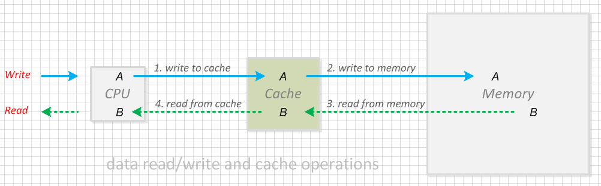
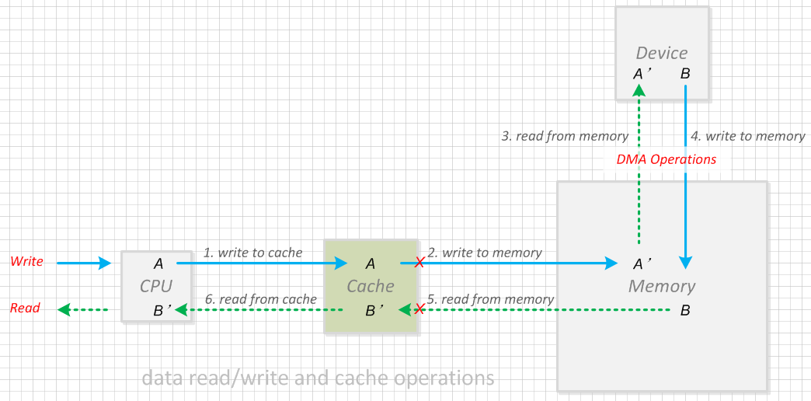
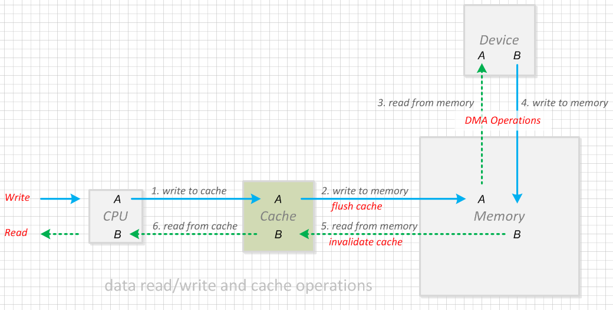
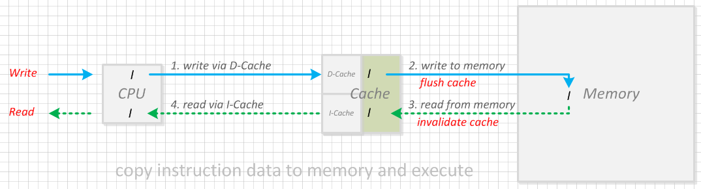

#  图解数据读写与 Cache 操作

> 题图: https://pixabay.com/vectors/phone-security-mobile-smartphone-1537387
>
> 本文原创发布于微信公众号“洛奇看世界”。

昨天读了 Baron 大佬写的介绍 Cache 细节的文档，天哪，太详细了，简直面面俱到~ 大佬就是大佬。

看完不禁想起我在 CSDN 博客上公开发表的第一篇文章，关于 Cache  何时需要对作废、何时需要刷新的分析说明，原文写于 2016 年，忍不住在这里分享一下，比较简单，希望对 Cache 操作不了解的朋友有些帮助。

> Baron 写了很多安全方面的文章，自谦是非著名的Trustzone/TEE/安全渣渣，研究方向包括 ARM Trustzone、TEE, 各种 Linux 和 Android 安全, CSDN 博客地址: https://blog.csdn.net/weixin_42135087


## 1. 什么是 Cache?

高速缓存（Cache）主要是为了解决CPU运算速度与内存（Memory）读写速度不匹配的矛盾而存在， 是CPU与内存之间的临时存贮器，容量小，但是交换速度比内存快。

>  百度百科是这样介绍缓存的：
>
>  CPU要读取一个数据时，首先从Cache中查找，如果找到就立即读取并送给CPU处理；如果没有找到，就用相对慢的速度从内存中读取并送给CPU处理，同时把这个数据所在的数据块调入Cache中，可以使得以后对整块数据的读取都从Cache中进行，不必再调用内存。
>
> 正是这样的读取机制使CPU读取Cache的命中率非常高（大多数CPU可达90%左右），也就是说CPU下一次要读取的数据90%都在Cache中，只有大约10%需要从内存读取。这大大节省了CPU直接读取内存的时间，也使CPU读取数据时基本无需等待。总的来说，CPU读取数据的顺序是先Cache后内存。


## 2. Cache 的分类

Cache 的硬件实现中通常包含一级 Cache（L1 Cache），二级 Cache（L2 Cache）甚至多级 Cache；

对于一级Cache，又有 Instruction Cache（指令缓存，通常称为 I-Cache）和 Data Cache（数据缓存，通常称为 D-Cache）之分，本文准备不讨论各级 Cache 的区别以及 I-Cache 和 D-Cache 的细节，仅将这些所有实现笼统称为Cache。


本文仅针对 Cache 的读写进行简单说明并通过示意图演示什么时候需要写回（flush）缓存，什么时候需要作废（Invalidate）缓存。


>  目前我所知的非常强的一款 CPU: AMD RYZEN 3970x (线程撕裂者) 32 核心 64 线程，其一级缓存 3MB, 二级缓存 16MB, 三级缓存 128MB, 有朋友用这颗芯片配置了一台个人电脑，编译最新的 Android S (12) 只要 20 多分钟，绝大部分公司的服务器还做不到这个性能。


对于指令缓存的 I-Cache 和数据缓存的 D-Cache，平时 D-Cache 访问比较多，以下主要以 D-Cache 的访问为例说明，指令缓存 I-Cache 原理一样。

## 3. Cache 数据访问原理


图一、Cache读写原理
　　
写入数据时：
第一步，CPU 将数据写入 Cache；
第二步，将 Cache 数据传送到 Memory 中相应的位置；

读取数据时：
第一步，将 Memory 中的数据传送到 Cache 中；
第二步，CPU 从 Cache 中读取数据；

在具体的硬件实现上，Cache 有写操作有透写（Write-Through）和回写（Write-Back）两种方式：

### 透写（Write-Through）

在透写式 Cache 中，CPU 的数据总是写入到内存中，如果对应内存位置的数据在 Cache 中有一个备份，那么这个备份也要更新，保证内存和 Cache 中的数据永远同步。所以每次操作总会执行图一中的步骤 1 和 2。

### 回写（Write-Back）

在回写式 Cache 中，把要写的数据只写到 Cache 中，并对 Cache 对应的位置做一个标记，只在必要的时候才会将数据更新到内存中。所以每次写操作都会执行步骤中的图 1，但并不是每次执行步骤 1 后都执行步骤 2 操作。


透写方式存在性能瓶颈，性能低于回写方式，现在的 CPU 设计基本上都是采用 Cache 回写方式。


通常情况下，数据只通过 CPU 进行访问，每次访问都会经过 Cache，此时数据同步不会有问题。

在有设备进行 DMA 操作的情况下，设备读写数据不再通过 Cache，而是直接访问内存。在设备和 CPU 读写同一块内存时，所取得的数据可能会不一致，如图二。


图二、设备和CPU读写同一块内存时数据不一致

CPU 执行步骤1将数据 `A` 写入 Cache，但并不是每次都会执行步骤 2 将数据 A 同步到内存，导致 Cache 中的数据 A 和内存中的数据 `A’`不一致；步骤 3 中，外部设备通过 DMA 操作时直接从内存访问数据，从而取得的是`A’`而不是`A`。

设备DMA操作完成后，通过步骤 4 将数据 `B` 写入内存；但是由于内存中的数据不会和 Cache 自动进行同步，步骤 5不会被执行，所以 CPU 执行步骤 3 读取时数据时，获取的可能是 Cache 中的数据 `B’`，而不是内存中的数据B；

在 CPU 和外设访问同一片内存区域的情况下，如何操作 Cache 以确保设备和 CPU 访问的数据一致就显得尤为重要，见图三。


图三、Cache操作同步数据

CPU 执行步骤 1 将数据 `A` 写入 Cache，由于设备也需要访问数据 `A`，因此执行步骤 2 将数据 `A` 通过 flush 操作同步到内存；步骤 3 中，外部设备通过 DMA 操作时直接从内存访问数据 `A`，最终 CPU 和设备访问的都是相同的数据。

设备 DMA 操作完成后，通过步骤 4 将数据 B 写入内存；由于 CPU 也需要访问数据 B，访问前通过 invalidate 操作作废 Cache 中的数据，从而通过 Cache 读取数据时 Cache 会从内存取数据，所以 CPU 执行步骤 6 读取数据时，获取到的是从内存更新后的数据；

## 4. Cache操作举例

### 4.1 外设数据 DMA 传输

例如，在某顶盒平台中，内存加解密在单独的安全芯片中进行，安全芯片访问的数据通过 DMA 进行传输操作。

因此，在进行内存加解密前，需要 flush D-Cache 操作将数据同步到到内存中供安全芯片访问；

加解密完成后需要执行invalidate D-Cache操作，以确保CPU访问的数据是安全芯片加解密的结果，而不是Cache之前保存的数据；

DMA进行数据加解密的示例代码：

```c
void mem_dma_desc(
		unsigned long Mode,
		unsigned long SrcAddr, /* input data addr */
		unsigned long DestAddr, /* output data addr */
		unsigned long Slot,
		unsigned long Size) /* dma data size */
	{
		...prepare for dma encryption/decryption operation...

		/* flush data in SrcAddr from D-Cache to memory 
		   to ensure dma device get the correct data */
		flush_d_cache(SrcAddr, Size);

		...do dma operation, output will be redirect to DestAddr...
	
		/* invalidate D-Cache to ensure fetch data from memory
		   instead of cached data in D-Cache */
		invalidate_d_cache(DestAddr, Size);
		return;
	}

```


### 4.2 外设 flash 的 I/O

某平台的 nand flash 的控制器也支持 DMA 读取的方式。在数据向 nand flash 写入数据时需要先 flash dcache 确保DMA 操作的数据是真实要写如的数据，而不是内存中已经过期的数据；

从nand flash 读取数据后需要 invalidate dcache，使 cache 中的数据失效，从而确保 cpu 读取的是内存数据，而不是上一次访问时缓存的结果。

nand flash 通过 DMA 方式读取数据的示例代码：

```c
static int nand_dma_read(
			struct nand_dev *nand,
			uint64_t addr, /* read addr */
			void *buf,     /* output buffer */
			size_t len)
{
	int ret;

	...prepare for nand flash read and device dma transfer...

	/* flush dma descriptor for nand flash read operation */
	flush_d_cache(descs, ndescs * sizeof(*descs));

	/* nand flash dma read operation */
	ret = nand_dma_run(nand, (uintptr_t)descs);

	/* invalidate read output buffer to ensure fetch data from memory
	   instead of cached data in D-Cache */
	invalidate_d_cache(buf, len);

	...other operations...
	
	return ret;
}

```

除了 nand flash 之外，很多硬盘也支持 DMA 方式读取。


### 4.3 I-Cache 和 D-Cache 的转换

通常 Cache 分为 I-Cache 和 D-Cache，取指令时访问 I-Cache，读写数据时访问 D-Cache。

但在代码搬运时，外设上存放的指令会被当做数据进行处理。

例如一段代码保存在外设（如nand  flash或硬盘）上，CPU想执行这段代码，需要先将这段代码作为数据复制到内存再将这段代码作为指令执行。

由于写入数据和读取指令分别通过 D-Cache 和 I-Cache，所以需要同步 D-Cache 和 I-Cache，即复制后需要先将 D-Cache 写回到内存，而且还需要作废当前的 I-Cache 以确保执行的是 Memory 内更新的代码，而不是 I-Cache 中缓存的数据，如图四所示：


图四、CPU复制代码后执行

CPU复制代码后执行的示例代码：

```c
void copy_code_and_execution(
		unsigned char *src, 
		unsigned char *dest, 
		size_t len)
{
	...copy code from src addr to dest addr...

	/* flush instructions data in D-Cache to memory */
	flush_all_d_cache();

	/* invalidate I-Cache to ensure fetch instructions from memory
	   instead of cached data in I-Cache */
	invalidate_all_i_cache();

	...jump to dest address for execution and never return...

	/* actually it never reach here if it jumps to dest successfully */
	printf("failed to jumping...\r\n");

	return; 
}

```