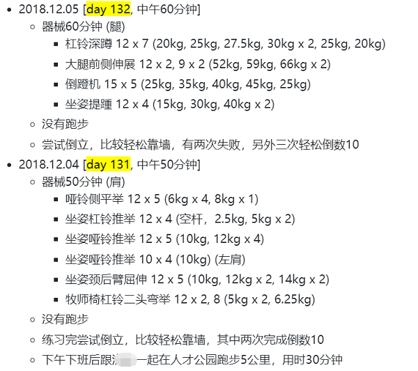

## 分享一些我做笔记的经验(二)

> 题图: Photo by Ilya Pavlov on Unsplash  
>
> https://unsplash.com/photos/wbXdGS_D17U

  

在上一篇《分享一些我做笔记的经验(一)》中分享了一些我做笔记的经历，提到记笔记的难点是随时记录，而不是要等到某个合适的时间点再记；另外就是想到什么就记录什么，只记录不整理。这一篇就我自己的经历，介绍下我如何记录和整理不同类型的笔记，如何将笔记转化为各种文档。

> 相关文章:
> - [《十年技术支持工作的几点感悟》](https://blog.csdn.net/guyongqiangx/article/details/80233594)
> - [《分享一些我做笔记的经验(一)》](https://blog.csdn.net/guyongqiangx/article/details/113253802)
> - [《分享一些我做笔记的经验(二)》](https://blog.csdn.net/guyongqiangx/article/details/116130115)

## 1. 笔记的存放

根据笔记存放的地方分类，我的笔记大概有以下3种:

- 手机便签临时记录

   随手用手机的便签功能记录。这些内容多是一些临时的想法，或者是简单的备忘，比较短小，也比较杂乱。

- 用云笔记记录私人笔记

   便签功能方便简单，适合临时记录，但满足不了复杂的场景(比如搜索，各种导出)，因此用云笔记记录个人的大部分内容；

- 用公司系统记录工作笔记

   很多公司内部都有自己的知识协同系统，例如Confluence, Twiki, 石墨文档，语雀等。

   工作相关的笔记因为涉密的原因，不方便保存到个人笔记上，因此使用公司的知识共享系统记录，这样有两个好处：
   - 1. 避免泄密，不会留下口实；
   - 2. 方便共享和别人搜索，总有那么些人自己不记录，总喜欢到处问人，这个时候一个连接扔过去就完事了；
   
  对于不想公开的工作笔记，有些系统可以将其设置为私有，这样**理论上**其他人就无法看到了。

## 2. 笔记的种类

我总结了我所有笔记，大致有以下几类：

### 1. 随意记录

这部分没什么特别的，就是临时有个想法，觉得需要记下来。或者计划某天做某事，想要备忘，就临时记录。

尤其是备忘这种情况，最好在记录的同时再设置一个闹铃提醒一下。

### 2. 事情记录

这部分是存粹的如实记录。

这一类记录看起来没有什么意义，但是经过一段时间回头来看，会让你有一种成就感，原来不知不觉中还是做了很多事情，也可以复盘以前的记录，以便接下来能有所改进。

例如健身记录，某日健身做了哪些动作，每个动作做了几组？感受如何？

以下是我2018年健身时的记录，当时刚开始健身，持续一段时间以后看到自己的进步还是挺明显的。

这类记录同样也适用于减脂，跑步，书法学习，摄影学习等。

更多关于记录的意义，推荐一本书：《奇特的一生》
- 豆瓣链接: https://book.douban.com/subject/1115353/
- 知乎链接: https://zhuanlan.zhihu.com/p/93666929

很多人觉得柳比歇夫的记录过于严苛了，但至少我们可以记录自己曾经做过什么事情，算是给自己在岁月流逝时留下一丝痕迹。

### 3. 各种文章收藏

有时候觉得某些文章很好，会收藏文章链接，大多数时候更建议将原文复制到笔记里，避免将来链接失效了找不到文档。

> 部分云笔记具备收藏文章时自动复制文章内容到笔记，这样比较方便。

其实我收藏的文章后来大多数都不会再去看了，比较失败~但仍然建议收藏是因为，将来有一天突然想起来了，还可以在自己的笔记里搜索一下。

### 4. 学习新知

学习这一类问题大致是这样的：
- 知识点是什么？
- 参考了哪些文档？
  - 这个不一定需要记录，有的话就记录出处
- 用法举例，用法1,2,3
- 就这个知识点还要什么疑问或者不清楚的地方？

例如学习Python，知识点是如何对各种基本数据进行操作，数据操作离不开增删改查，所以就有：
- 列表list如何进行增删改查？
- 元组turple如何个增删改查？
- 字典dict如何进行增删改查？
- 对文本文件如何进行增删改查？

然后对每一个增删改查附上相应的例子。因为这些笔记是自己写的，也符合个人的思维习惯和应用场景，将来即使忘了，通过自己的笔记可以很快熟悉。

重点：这一类笔记一般都会反复修改，多次更新。

比如grep和find的选项很多，一次根本记不住，即使系统学习了也很快就忘了，grep和find我自己看了不下二十遍了(有时候觉得自己挺蠢的) ，简单操作算是够了，但是遇到复杂的情形还是搞不定。所以我根据自己的使用情景，整理了的grep和find的用法笔记，有新的用法就往里面添加或更新以前的例子。忘记的时候，看一眼就好了。

### 5. 问题总结

总体上，问题总结跟前面学习笔记差不多。

我一般会记录以下这些内容：
- 问题或现象是什么? 
- 如何复现？
- 中间是如何思考解决方案的？都尝试了哪些办法？
- 参考了哪些文档？
- 还有什么问题？

跟这个相关的就是我长期做技术支持，关于平台的搭建和调试，会根据每一步的操作，逐渐完善形成一个user guide一类的文档，根据客户反馈或提出的新问题不断完善。客需要支持时就先将这个手册给他参考，从而节省了很多时间。

如果需要分享你做的一些笔记，现在很多系统都直接支持导出为docx, pdf或html文件，非常方便。

---

## 其他

洛奇工作中常常会遇到自己不熟悉的问题，这些问题可能并不难，但因为不了解，找不到人帮忙而瞎折腾，往往导致浪费几天甚至更久的时间。

所以我组建了两个微信讨论群(记得微信我说加哪个群，如何加微信见后面)，欢迎加群一起讨论:
- 一个Android OTA的讨论组，请说明加Android OTA群。
- 一个git和repo的讨论组，请说明加git和repo群。

在工作之余，洛奇尽量写一些对大家有用的东西，如果洛奇的这篇文章让您有所收获，解决了您一直以来未能解决的问题，不妨赞赏一下洛奇，这也是对洛奇付出的最大鼓励。扫下面的二维码赞赏洛奇，金额随意：

洛奇自己维护了一个公众号“洛奇看世界”，一个很佛系的公众号，不定期瞎逼逼。公号也提供个人联系方式，一些Andorid和GIT电子书资源，说不定会有意外的收获，详细内容见公号提示。扫下方二维码关注公众号：

