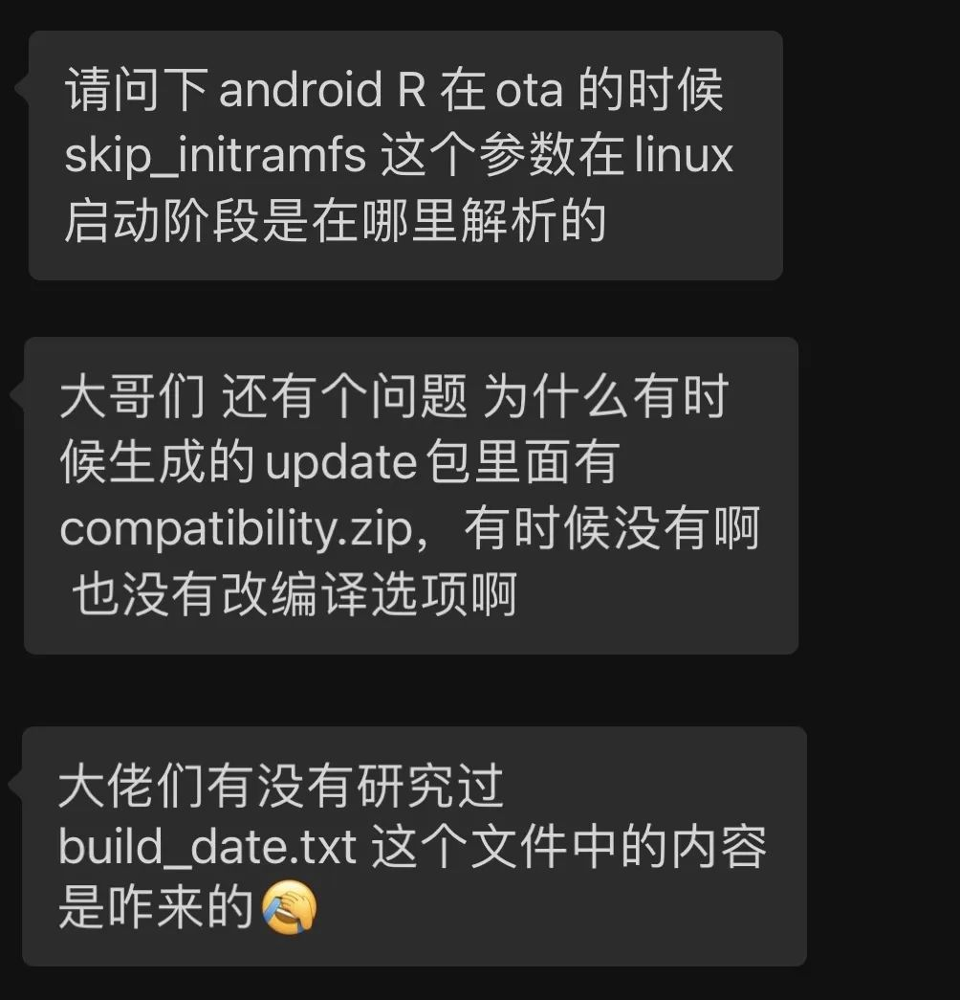
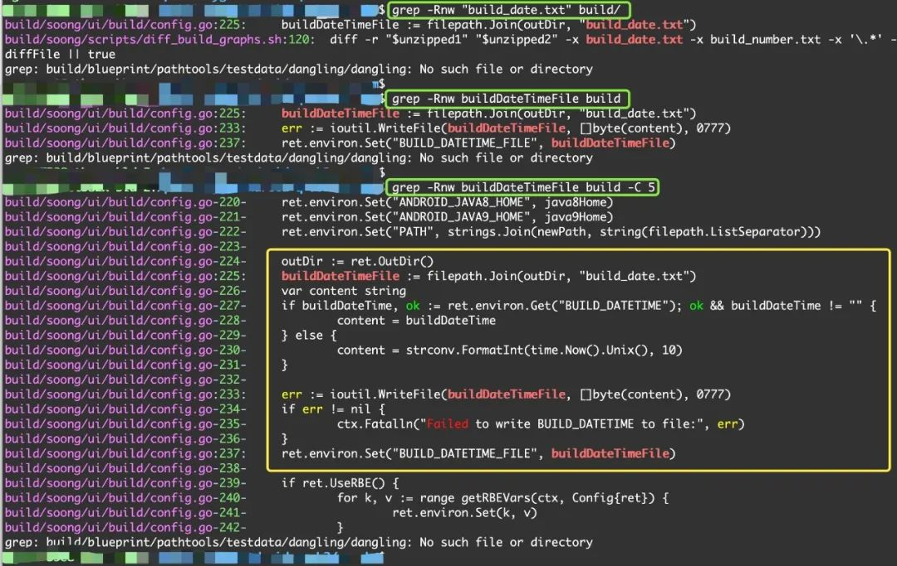

# 读代码，没有头绪怎么办？

## 1. 常见问题

我从某个 Android 技术群里选了 3 个最有代表性的问题：

有没有觉得很熟悉？

如果你知道这类问题如何解决，那么恭喜你具有穿透代码的重重迷雾，找到答案的能力~

不用再接着往下看了。

如果你还有这样的困惑，希望本文结束后你的困惑也结束了~

## 2. 问题的重点：关键字

上面这些问题的背后，是庞大的工程和代码，有多大？

以 Android 为例，文件几十万个，代码上千万行。

茫茫代码，哪里去找答案?

虽然现在没有答案，但你有线索，那就是关键字，因为你准确知道你的问题是什么？

回到前面的问题:

- 第一个问题的关键字: `skip_initramfs`
- 第二个问题的关键字: `compatibility.zip`
- 第三个问题的关键字: `build_date.txt`

## 3. 解决的核心：换位思考

重点来了

你现在是读别人的代码，想知道别人是如何处理的~

换一个角度，假设自己现在就是写代码的人，你会如何处理？

要是我，肯定会在某行代码里使用这些关键字，那就去直接去搜索这些关键字就好了。

比如：

- `skip_initramfs`，作为 linux 的启动参数，一定会在 linux 的某个驱动文件中解析这个参数，并将字符串作 `skip_initramfs` 为参数名称
- `compatibility.zip`,  一定会在某个 makefile 或脚本中打开这个文件进行处理，肯定会提供文件名 `compatibility.zip` 进行处理
- `build_date.txt`，同上面一样，一定会在参与编译的某个脚本或代码中打开处理这个文件，肯定会提供文件名 `build_date.txt` 进行处理

## 4. 示例

这里我以最后一个问题为例，由于 Android 的 build 目录负责编译，所以就在这个目录中搜索字符串 "build_date.txt"，结果一共有 3 个:

> 以下结果基于 Android Q 代码，其它版本代码可能有所不同

这里一共用了 3 次搜索：

- 第一次搜索 "build_date.txt"，发现第 1 个结果中将 "build_data.txt" 指定的文件赋值给变量 buildDateTimeFile

- 第二次搜索 "buildDateTime", 发现这个变量在文件 `build/soong/ui/build/config.go` 中处理，总共有 3 个地方

- 第三次展开搜索结果，查看搜索的上下文 (使用 grep 的 "-C 5" 选项可以查看匹配结果的前后 5 行)
  - 将 "build_date.txt" 指定的文件拼接路径后赋值给 buildDateTimeFile 变量
  - 往 buildDateTimeFile 指定的文件中写入内容 content
  - 将 buildDateTime 的内容设置到环境变量 "BUILD_DATETIME_FILE" 中

所以这里大概就是对 `build_date.txt` 的处理了，但我们也应该留意到，环境变量 "BUILD_DATETIME_FILE" 指向了 `build_date.txt` 文件，所以如果想了解所有的内容，还应该继续跟踪环境变量 "BUILD_DATETIME_FILE"，往下跟踪的过程这里不再详细叙述。

## 5. 一定要用 grep 吗？

因为我已经习惯了 "grep" 的小巧和随处可用，所以我这里演示时使用 "grep" 命令，其实不一定非要用 "grep"，任何一种搜索方式都可以。重点是使用这种思考的方法，而且在搜索时不要遗漏文件就好了。

不过，我还是强烈推荐你平时多使用 "grep"，主要还是随处可用，各种筛选参数强大，而且不用创建工程，因此也不会担心工程文件没有包含相关代码导致搜索结果不全。

## 6. 一句话总结

去搜索问题的关键字~

你明白了吗？

最后的最后，提一个问题：

Android 代码中是如何对各种按键进行处理的？

欢迎留言提出你打算如何找到相关的处理代码~

## 近期文章

- 读代码，多用用这种方式
- 程序查错实战：一类常见错误的处理思路
- 图解数据读写与 Cache 操作
- 一篇了解TrustZone
