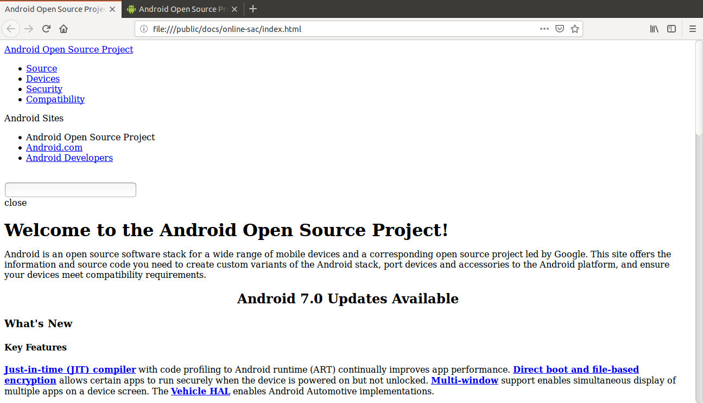
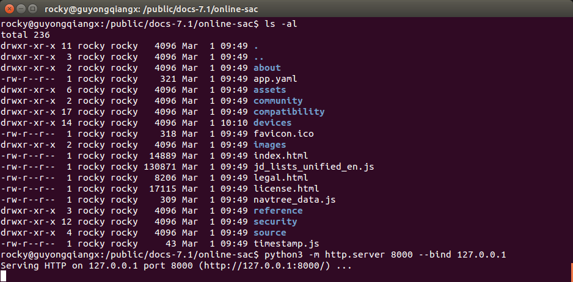
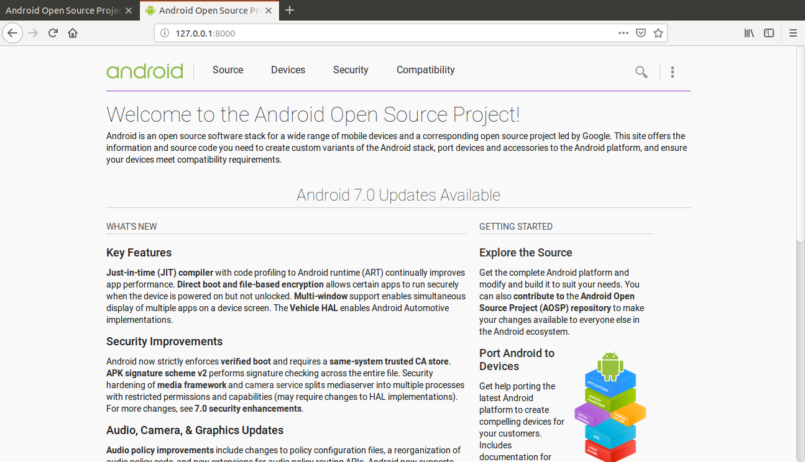
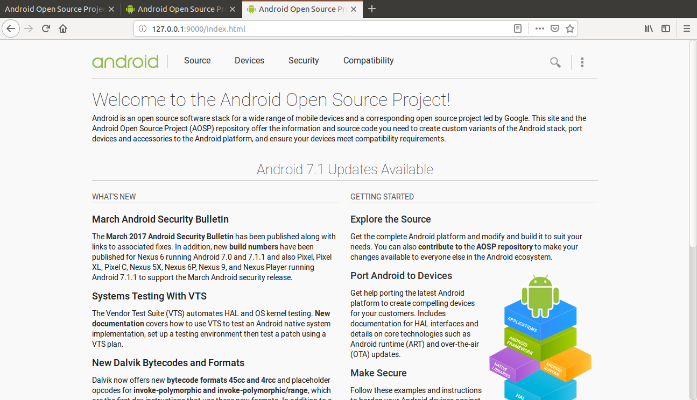

# 从本地Android代码恢复文档


> 题图: Photo by Sigmund on Unsplash
>
> https://unsplash.com/photos/59yRYIHWtzY

最近打算基于老版本Android N (7.1)的代码研究下KeyMaster，但苦于没有官方文档。Android官方网站(https://source.android.com)上虽然有文档，但是这些文档基本上都比较新，大都针对当前的Android Q(11)更新了，和老版本Android对应不上。

另外一个原因是，不知名的神秘力量导致https://source.android.com无法访问。

无奈之下，浏览Android代码目录结构，发现根目录下有个docs/source.android.com，REAME文件描述这个目录就是Android官方文档网站(https://source.android.com)的内容。换句话说，就是基于docs/source.android.com目录可以还原某个时间点的内容。真是一个Big Surprise!!!

参考README恢复搭建的过程中也遇到一些问题，故事说来有点冗长。这里简要说说在本地恢复文档的步骤。

> 本文示例基于Ubuntu 14.04和Android 7.1.1代码(NMF27D)

## 1. 编译文档
```
$ source build/envsetup.sh 
$ lunch aosp_arm-eng
$ make online-sac-docs
```

## 2. 搭建http服务访问网页

README中建议使用Google的App Engine来搭建服务，上官方一看，这个好像需要Google Cloud才能使用。
其实我们只需要一个http服务器来访问生成的静态网页，哪需要那么复杂~
> 为什么需要http服务器，直接打开不行吗？
>
> 试着直接打开一个编译好的网页就知道了，由于路径引用的原因，直接通过浏览器打开网页会出现渲染的问题。
>
> 

这里使用一行python命令，通过http.server模块搭建服务器。

进入文档所在目录，执行下面的python命令，就搭建起了一个建议的http服务啦~是不是很简单！

```
$ python3 -m http.server 8000 --bind 127.0.0.1
```

Python 3.7以后支持使用`--directory`的方式指定文档所在目录，如下:
```
$ python3 -m http.server 8000 --bind 127.0.0.1 --directory /public/docs-7.1/online-sac/
```

> 更多参数，参考Python关于http.server的文档:
>
> https://docs.python.org/3/library/http.server.html


Python3启动http服务:




## 3. 浏览文档

浏览器地址栏输入http://127.0.0.1:8000或http://localhost:8000，查看搭建的网页。



如果有多个版本的文档，也可以在不同的端口启动多个http服务，然后在浏览器指定不同端口访问:

(这里针对8000和9000端口分别开启了一个http服务，访问两个不同版本的Android文档)



## 4. 问题

此办法只针对Android 8.1和之前的版本，从Android 9开始，Android代码根目录下的`docs`就被移除掉了，无法使用此方法。

## 5. 其它

洛奇工作中常常会遇到自己不熟悉的问题，这些问题可能并不难，但因为不了解，找不到人帮忙而瞎折腾，往往导致浪费几天甚至更久的时间。

所以我组建了两个微信讨论群(记得微信我说加哪个群，如何加微信见后面)，欢迎加群一起讨论:
- 一个Android OTA的讨论组，请说明加Android OTA群。
- 一个git和repo的讨论组，请说明加git和repo群。

在工作之余，洛奇尽量写一些对大家有用的东西，如果洛奇的这篇文章让您有所收获，解决了您一直以来未能解决的问题，不妨赞赏一下洛奇，这也是对洛奇付出的最大鼓励。扫下面的二维码赞赏洛奇，金额随意：


洛奇自己维护了一个公众号“洛奇看世界”，一个很佛系的公众号，不定期瞎逼逼。公号也提供个人联系方式，一些Andorid和GIT电子书资源，说不定会有意外的收获，详细内容见公号提示。扫下方二维码关注公众号：


