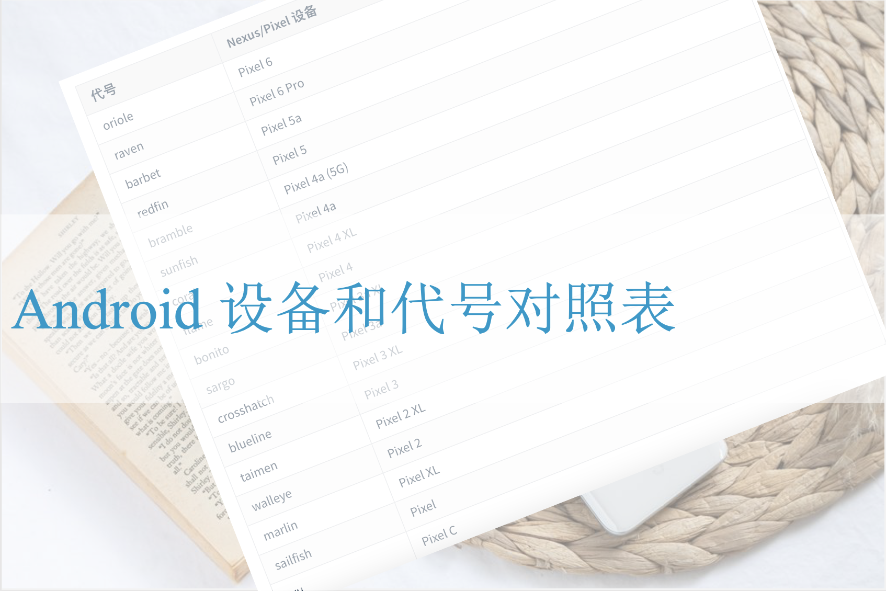

# 谷歌官方 Android 设备和代号对照表

读 Android 代码时，在 `device/google` 目录下会有很多设备代号命名的目录，但我自己又搞不清这些代号到底对应哪些设备，本文根据 Android Factory Image 下载页面([Factory Images for Nexus and Pixel Devices](https://developers.google.cn/android/images))的信息整理了这些代号和设备的关系。

## 1. 模拟器

| 模拟器代号 |  介绍文章  |
| ---- | ---- |
| goldfish | [Android之Qemu和Goldfish](https://blog.csdn.net/leopard21/article/details/21715905) |
| cattlefish | [Cuttlefish 虚拟 Android 设备](https://source.android.google.cn/setup/create/cuttlefish?hl=zh-cn) [The Android Cuttlefish emulator](https://2net.co.uk/blog/cuttlefish-android12.html) |
## 2. Nexus 和 Pixel 设备

>  参考页面: [Factory Images for Nexus and Pixel Devices (https://developers.google.cn/android/images)](https://developers.google.cn/android/images)

| 代号 | Nexus/Pixel 设备 |
| ---- | ---- |
| oriole | Pixel 6 |
| raven | Pixel 6 Pro |
| barbet | Pixel 5a |
| redfin | Pixel 5 |
| bramble | Pixel 4a (5G) |
| sunfish | Pixel 4a |
| coral | Pixel 4 XL |
| flame | Pixel 4 |
| bonito | Pixel 3a XL |
| sargo | Pixel 3a |
| crosshatch | Pixel 3 XL |
| blueline | Pixel 3 |
| taimen | Pixel 2 XL |
| walleye | Pixel 2 |
| marlin | Pixel XL |
| sailfish | Pixel |
| ryu | Pixel C |
| angler | Nexus 6P |
| bullhead | Nexus 5X |
| shamu | Nexus 6 |
| fugu | Nexus Player |
| volantisg | Nexus 9 (LTE) |
| volantis | Nexus 9 (Wi-Fi) |
| hammerhead | Nexus 5 (GSM/LTE) |
| razor | Nexus 7 [2013] (Wi-Fi) |
| razorg | Nexus 7 [2013] (Mobile) |
| mantaray | Nexus 10 |
| occam | Nexus 4 |
| nakasi | Nexus 7 (Wi-Fi) |
| nakasig | Nexus 7 (Mobile) |
| tungsten | Nexus Q |
| takju | Galaxy Nexus "maguro" (GSM/HSPA+) (with Google Wallet) |
| yakju | Galaxy Nexus "maguro" (GSM/HSPA+) |
| mysid | Galaxy Nexus "toro" (Verizon CDMA/LTE) |
| mysidspr | Galaxy Nexus "toroplus" (Sprint CDMA/LTE) |
| soju | Nexus S (worldwide version, i9020t and i9023) |
| sojua | Nexus S (850MHz version, i9020a) |
| sojuk | Nexus S (Korea version, m200) |
| sojus | Nexus S 4G (d720) |

## 3. 其它

洛奇工作中常常会遇到自己不熟悉的问题，这些问题可能并不难，但因为不了解，找不到人帮忙而瞎折腾，往往导致浪费几天甚至更久的时间。

所以我组建了几个微信讨论群(记得微信我说加哪个群，如何加微信见后面)，欢迎一起讨论:
- 一个密码编码学讨论组，主要讨论各种加解密，签名校验等算法，请说明加密码学讨论群。
- 一个Android OTA的讨论组，请说明加Android OTA群。
- 一个git和repo的讨论组，请说明加git和repo群。

在工作之余，洛奇尽量写一些对大家有用的东西，如果洛奇的这篇文章让您有所收获，解决了您一直以来未能解决的问题，不妨赞赏一下洛奇，这也是对洛奇付出的最大鼓励。扫下面的二维码赞赏洛奇，金额随意：

洛奇自己维护了一个公众号“洛奇看世界”，一个很佛系的公众号，不定期瞎逼逼。公号也提供个人联系方式，一些资源，说不定会有意外的收获，详细内容见公号提示。扫下方二维码关注公众号：

