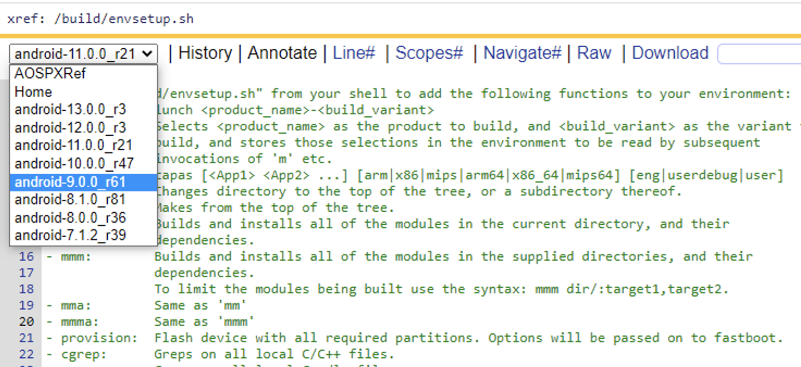

# 20230211-一个自动配置 opengrok 多项目的脚本

前段时间在服务器上配置 opengrok 阅读代码，项目有很多个，一个一个手动配置比较繁琐。

我从搭建 tomcat 和 opengrok，到配置和索引完 5 个 Android 项目，用了差不多一整天。

要是再让我手动配置几个项目，估计真要崩溃了，看到好多人都有配置 opengrok 多项目的需求，于是写了这个自动配置多项目的脚本。


## 1. 脚本源码

```bash
/public/opengrok$ cat setup-opengrok-projects.sh 
#!/bin/bash
#
# Copyright (C) 2023, guyongqiangx All Rights Reserved.
# 
# File Name: setup-opengrok-projects.sh 
#    Author: guyongqiangx
#      Blog: https://blog.csdn.net/guyongqiangx
#      Date: 2023-02-11
#      Info: 批量配置 opengrok 项目
#

# opengrok 安装目录
OPENGROK_APP_DIR=/opt/opengrok/dist/opengrok-1.7.42
# tomcat 安装目录
TOMCAT_APP_DIR=/opt/tomcat/apache-tomcat-10.0.27
# 代码项目根目录
PROJECT_ROOT_DIR=/public/opengrok
# 服务器访问地址
SERVER_URL=http://localhost:8000

# sudo 方式下用普通用户执行命令: "sudo -u username command"
USER="sudo -u guyongqiangx"

# 带一个参数，当前项目
setup_opengrok_project() {
    PROJECT=$1

    DATA_DIR=${PROJECT_ROOT_DIR}/data/${PROJECT}
    ETC_DIR=${PROJECT_ROOT_DIR}/etc/${PROJECT}
    SRC_DIR=${PROJECT_ROOT_DIR}/src/${PROJECT}
    LOG_DIR=${PROJECT_ROOT_DIR}/log/${PROJECT}

    # 1. 准备项目的 data, etc 和 log 目录
    ${USER} mkdir -p ${DATA_DIR} ${ETC_DIR} ${LOG_DIR}

    # 2. 准备项目的 logging.properties 文件
    ${USER} cp ${OPENGROK_APP_DIR}/doc/logging.properties ${ETC_DIR}

    # 3. 更新项目的 logging.properties 文件
    PATTERN="java.util.logging.FileHandler.pattern =.*"
    REPLACE="java.util.logging.FileHandler.pattern = ${LOG_DIR}/opengrok%g.%u.log"

    # TODAY=$(date +%F)
    # AUTHOR=guyongqiangx
    # COMMENTS="$TODAY $AUTHOR - Set logging file location to ${PROJECT} etc dir"
    # sed -i "s!^${PATTERN}!# &\n# ${COMMENTS}\n${REPLACE}!" ${ETC_DIR}/logging.properties
    ${USER} sed -i "s!^${PATTERN}!# &\n${REPLACE}!" ${ETC_DIR}/logging.properties

    # 4. 复制模板 source.war 到 tomcat 的 webapps 目录
    sudo cp ${OPENGROK_APP_DIR}/lib/source.war ${TOMCAT_APP_DIR}/webapps/${PROJECT}.war 

    # 5. 更新项目的 tomcat 配置文件 web.xml
    sudo opengrok-deploy -c ${ETC_DIR}/configuration.xml ${OPENGROK_APP_DIR}/lib/source.war ${TOMCAT_APP_DIR}/webapps/${PROJECT}.war

    # 6. 索引项目数据
    ${USER} java \
        -Djava.util.logging.config.file=${ETC_DIR}/logging.properties \
        -jar ${OPENGROK_APP_DIR}/lib/opengrok.jar \
        -c /usr/local/bin/ctags \
        -s ${SRC_DIR}  \
        -d ${DATA_DIR} \
        -P -S -G -W ${ETC_DIR}/configuration.xml \
        -U ${SERVER_URL}/${PROJECT} &> ${LOG_DIR}/index.log &
    ${USER} echo "index project ${PROJECT} in background..."
}

# for project in uboot-v2009.01  uboot-v2013.01  uboot-v2014.01  uboot-v2015.01
for project in $(ls ${PROJECT_ROOT_DIR}/src)
do
    echo "setup project ${project}..."
    setup_opengrok_project ${project}
done

while [ $(ps -ef | grep -c opengrok.jar) -ne 1 ]
do
    ${USER} echo -n .
    sleep 2
done

# sudo service tomcat restart
sudo systemctl restart tomcat.service
echo "done!"
```


## 2. 如何使用？

### 2.1 配置脚本

使用前需要先安装好 tomcat 和 opengrok，关于如何安装请自行搜索解决。

然后在脚本文件中做以下配置：

```bash
# opengrok 安装目录
OPENGROK_APP_DIR=/opt/opengrok/dist/opengrok-1.7.42
# tomcat 安装目录
TOMCAT_APP_DIR=/opt/tomcat/apache-tomcat-10.0.27
# 项目根目录
PROJECT_ROOT_DIR=/public/opengrok
# 服务器访问地址
SERVER_URL=http://localhost:8000

# 使用普通用户执行 sudo 命令: "sudo -u username command"
USER="sudo -u guyongqiangx"
```

其中最后一项是用 sudo 来执行普通用户操作，所以需要提供普通用户的用户名。


### 2.2 准备项目代码

然后将所有项目相关的代码放在项目根目录(`PROJECT_ROOT_DIR`)的 `src` 子目录下，类似如下：

```bash
/public/opengrok$ tree . -L 2
.
├── setup-opengrok-projects.sh
└── src
    ├── uboot-v2009.01
    ├── uboot-v2013.01
    ├── uboot-v2014.01
    ├── uboot-v2015.01
    ├── uboot-v2016.01
    ├── uboot-v2017.01
    ├── uboot-v2018.01
    ├── uboot-v2019.01
    ├── uboot-v2020.01
    ├── uboot-v2021.01
    ├── uboot-v2022.01
    └── uboot-v2023.01

13 directories, 1 file
```

默认情况下，脚本会扫描根目录的 `src` 子目录下的所有文件夹，并以该文件夹的名字创建相应的项目。

如果只想对某几个指定的文件夹操作，可以修改脚本设置项目列表，类似如下:

```bash
for project in uboot-v2009.01  uboot-v2013.01  uboot-v2014.01  uboot-v2015.01
# for project in $(ls ${PROJECT_ROOT_DIR}/src)
do
    echo "setup project ${project}..."
    setup_opengrok_project ${project}
done
```


### 2.3 执行脚本配置所有项目

代码准备好以后，在项目根目录下用 sudo 权限执行脚本，如下:

```bash
/public/opengrok$ sudo bash setup-opengrok-projects.sh 
[sudo] password for guyongqiangx: 
setup project uboot-v2009.01...
index project uboot-v2009.01 in background...
setup project uboot-v2013.01...
index project uboot-v2013.01 in background...
...
setup project uboot-v2022.01...
index project uboot-v2022.01 in background...
setup project uboot-v2023.01...
index project uboot-v2023.01 in background...
..............done!
```

运行脚本后就是漫长的等待，直到脚本输出打印 "done!"

> 必须要用 sudo 方式执行脚本，因为部分操作需要 sudo 权限去修改 tomcat 安装目录下的文件。


其中，索引项目数据的日志重定向到 log 目录的 `index.log` 文件中了，例如：

```bash
/public/opengrok$ ls -lh log/uboot-v2009.01/
total 16M
-rw-r--r-- 1 root         root  138K Feb 11 23:55 index.log
-rw-r--r-- 1 guyongqiangx users  16M Feb 11 23:55 opengrok0.0.log
```


### 2.4 项目的目录结构

项目配置好后的目录结构如下：

```bash
/public/opengrok$ tree . -L 2
.
├── data
│   ├── uboot-v2009.01
│   ...
│   └── uboot-v2023.01
├── etc
│   ├── uboot-v2009.01
│   ...
│   └── uboot-v2023.01
├── log
│   ├── uboot-v2009.01
│   ...
│   └── uboot-v2023.01
├── setup-opengrok-projects.sh
└── src
    ├── uboot-v2009.01
    ├── ...
    └── uboot-v2023.01

52 directories, 1 file
```

其中，

- src 为各个 project 的代码
- data 为各个 project 索引后的数据
- etc 为各个 project 相应的配置文件
- log 为各个 project 索引操作和解析的日志


## 3. 问题

目前这种方式创建的多项目可以工作，但浏览时在项目之间切换比较麻烦。

我希望能够以比较简单的方式在不同项目的同一个文件之间切换，例如下面这种下拉列表方式：



点击下拉列表的项目，就可以查看对应项目中的同一个文件 `/build/envsetup.sh` ，在查看多个版本的同一文件时非常方便，知道如何配置的麻烦告知下，非常感谢~