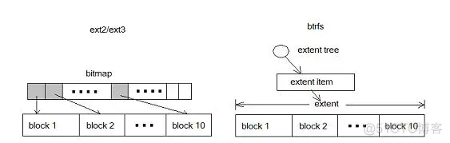

# 20230227-Android Update Engine 分析（十九）Extent 到底是什么？


说来惭愧，几年前，我把 Android 的 system/update_engine 目录下早期的代码翻了一遍，很多地方提到了并且使用了 extent 这个概念来处理数据，但我一直没有搞懂 extent 到底是个什么东西，只是知道一个 extent 由两个数据表示，一个表示起始位置，另一个表示长度。在制作升级包时，差分操作基于 extent 进行；在设备端升级时基于 extent 进行还原。仅致于此，并没有继续深究~


最近才了解到 extent 是现在常见的文件系统组织方式，突然一惊，真是 out 了，这打破了我一直以为文件系统都是基于 blockmap 进行处理的陈旧观念。


> 本文基于 Android-11.0.0_r21 进行分析


## 1. 什么是 Extent?

### 1 什么是 Extent?

初次接触 extent，脑子一片空白，难免想知道中文叫什么？但似乎没有找到一个很确切的中文翻译。

把 extent 翻译成区块？一提到块，基本上都是指 block，所以并不贴切。

现在有不少文章把 extent 叫做区段，表示一段数据的意思，但有时候也容易和区块混淆。

大体来说，把 extent 翻译成区段基本能够表达由一组区块(block)构成的一段数据的意思。

不过更多的地方则是保留英文原名，干脆不翻译，直接就叫 extent。

所以，本文也干脆就保留 Extent 的英文原样，不进行翻译。


### 2. Wikipedia 中对 Extent 的描述

为了严谨起见，我们还是看看维基百科上是怎么表述 extent 的。


图 1. Wikipedia 中对 Extent 的描述

> 来源: https://en.wikipedia.org/wiki/Extent_(file_systems)

这里提到，在计算机领域中，extent 是文件系统中用于存放文件的一片连续的区域，表示为一个范围内的块号，或设备上的磁道。一个文件可以由 0 个或多个 extent 构成。一个块文件碎片由一个 extent 表示(因为可以通过一个起始位置和一个长度的 extent 来标明一段数据)。

基于 blockmap 的文件系统，其每一个 block 都需要 1 个 bit 来表示，如果文件很大，对应的 blockmap 就会相应增大。但使用 extent 的文件系统则不存在这个问题，文件增大，只要是连续的，将 extent 表示长度的数据调整为相应数值即可。

因此，使用 extent 的直接收益就是每一段数据都可以压缩为两个数字来表示，而不需要存储这段数据内每一个 block 的编号。

> 抱歉，我不明白这里的 count key data devices 是什么东西，不知道该怎么翻译，也不明白是啥意思。


再来看看 Ext4 文件系统中，对 extent 的解释：


图 2. Wikipedia 中对 Ext4 文件系统 Extents 特性的描述

> 来源: https://en.wikipedia.org/wiki/Ext4

上面红色方框内的部分大致意思如下：

extent 取代了 ext2 和 ext3 使用的传统 block mapping 方案。1 个 extent 是一系列连续的物理块(physical blocks)，可提高大文件性能并减少碎片。

ext4 中的单个 extent 最多可以映射 128 MiB 的连续空间，其块(block)大小为 4 KiB。

1 个 inode 中可以直接存放 4 个 extents。当文件的 extent 超过 4 个时，其余 extent 将基于树(tree)进行索引。


### 3. 其它 Extent 相关资料

这里粘贴两段我从网上找到的关于 extent 的资料，更多描述请点击相应的文章链接阅读原文，特别感谢两位作者的分享。


#### 《文件系统索引extent 和 bitmap区别》

> 来源: https://blog.51cto.com/u_15174006/2719536

> Extent 能有效地减少元数据开销。
>
> 为了进一步理解这个问题，我们还是看看 ext2 中的反面例子。
>
> ext2/3 以 block 为基本单位，将磁盘划分为多个 block 。为了管理磁盘空间，文件系统需要知道哪些 block 是空闲的。 Ext 使用 bitmap 来达到这个目的。 Bitmap 中的每一个 bit 对应磁盘上的一个 block，当相应 block 被分配后，bitmap 中的相应 bit 被设置为 1 。这是很经典也很清晰的一个设计，但不幸的是当磁盘容量变大时，bitmap 自身所占用的空间也将变大。这就导致了扩展性问题，随着存储设备容量的增加，bitmap 这个元数据所占用的空间也随之增加。而人们希望无论磁盘容量如何增加，元数据不应该随之线形增加，这样的设计才具有可扩展性。
>
> 下图比较了 block 和 extent 的区别：采用 extent 的 btrfs 和采用 bitmap 的 ext2/3
>
> 
>
> 图 3. 采用 extent 的 btrfs 和采用 bitmap 的 ext2/3
>
> 在 ext2/3 中，10 个 block 需要 10 个 bit 来表示；在 btrfs 中则只需要一个元数据。对于大文件，extent 表现出了更加优异的管理性能。
>
> Extent 是 btrfs 管理磁盘空间的最小单位，由 extent tree 管理。 Btrfs 分配 data 或 metadata 都需要查询 extent tree 以便获得空闲空间的信息。
>
> 注：EXT4文件系统也采用了基于 extent 的文件存储
>
> **extent 和 bitmap**
> extent 的定义为一段连续的空间，这段连续的空间由 offset/bytes 来描述，没有更细分的粒度；bitmap 则通过 bit 来描述一个 ctl->unit 大小的单元，最小的粒度是 unit，对于 bg 来说是 sectorsize 大小。


#### 《文件系统的两种文件索引模式extent和blockmap》

> 来源: https://blog.51cto.com/zhangyu/637537

> extent 和 blockmap 是两类典型的索引实现方案，事实上，文件系统也似乎仅能按这2种方案(或共同)来实现索引。extent 是基于片断的索引方案，blockmap 是基于分配块的位图索引。
>
> 先说blockmap，这是用在ufs、sco htfs、ext2/3、reiserfs上的索引模式，意思是每个文件的分配块都有一个索引与之对应，是一对一的索引关系。举例来说：EXT3上有个a.dat，文件大小是4M，文件系统的块大小是4K，那这意味着a.dat会占用文件系统的1024个块。对这1024个块，系统会提供1024个4字节(即4096个字节)的索引表，来描述这1024个块到底位置在哪里(就像一个包含1024个对象的指针数组）。这样，文件系统驱动层下了指令，要读或写某个块，可以不用查询直接定位这个特定块。
>     
> 显而易见，Blockmap的索引机制，需要较大索引空间做保障，随机读写时如跨度太大，缓冲机制无法一次性读入全部索引信息，效率便会下降得多。同时磁盘空间浪费很大(如同EXT3，在节点设计、文件索引等方面全部是定长的MAP机制实现，所以,ext3的磁盘空间浪费严重)。另外，如果是大文件，因块索引极大，就需要对索引块引入几级索引机制(似乎不太好理解)，定位某些块时，也需要几层转换。
>     
> 再谈extent方式，用于ntfs、Vxfs、jfs、ext4等文件系统。其实现方式和blockmap不同的是，索引是按分配的片断记录，只记起始块、连续块数、及文件内部块位置(NTFS叫VCN的东东）。比如上述例子，如果一个EXT4上的4M文件，块大小同样为4K，如果这个文件分配时是连续分配的，只需记录3个数字:（文件内部块号：0，文件系统分配起始块：x,连续块数:1024)，不再需要1024个索引空间来描述。当然，如果这个文件有多个碎片组成，则需要多条记录来实现。
>     
> extent其优点是索引空间占有率较少，连续读写时会有优势，但缺点是算法复杂度略高。比如一个文件由100个片断(碎片)组成，需要定位到文件内部10M的偏移，则需要二叉查找属于哪个片断，再根据片断的起始地址计算到具体的分配块地址，才可以把数据读出来。如果像NTFS一样，片断本身都由变长方式实现，则内核判断上就更麻烦，文件系统崩溃的可能性也就很大了。
> 


总而言之，bitmap 和 extent 是文件系统组织的两种方式，前者出现在 ext2/3 和些旧文件系统上，后者在较新的文件系统(ext4, btrfs, xfs 等)上用来管理文件。

extent 方式索引空间占用小，连续读写有优势，缺点是算法复杂度高。


## 2. Android 中的 Extent


### 1. Payload 文件中的 extent

Android 在 update_metadata.proto 中定义了 Extent 结构:

```protobuf
// 文件: system/update_engine/update_metadata.proto

// Data is packed into blocks on disk, always starting from the beginning
// of the block. If a file's data is too large for one block, it overflows
// into another block, which may or may not be the following block on the
// physical partition. An ordered list of extents is another
// representation of an ordered list of blocks. For example, a file stored
// in blocks 9, 10, 11, 2, 18, 12 (in that order) would be stored in
// extents { {9, 3}, {2, 1}, {18, 1}, {12, 1} } (in that order).
// In general, files are stored sequentially on disk, so it's more efficient
// to use extents to encode the block lists (this is effectively
// run-length encoding).
// A sentinel value (kuint64max) as the start block denotes a sparse-hole
// in a file whose block-length is specified by num_blocks.

// ...

message Extent {
  optional uint64 start_block = 1;
  optional uint64 num_blocks = 2;
}
```


##### **制作全量包生成 extent**

制作全量包时，在 GenerateOperations 函数中生成 extent，代码如下：

```c++
/*
 * file: system/update_engine/payload_generator/full_update_generator.cc
 */
bool FullUpdateGenerator::GenerateOperations(
    const PayloadGenerationConfig& config,
    const PartitionConfig& old_part,
    const PartitionConfig& new_part,
    BlobFileWriter* blob_file,
    vector<AnnotatedOperation>* aops) {
  TEST_AND_RETURN_FALSE(new_part.ValidateExists());

  /*
   * 1. 根据 hard_chunk_size, soft_chunk_size 等参数设置 full_chunk_size
   */
  // FullUpdateGenerator requires a positive chunk_size, otherwise there will
  // be only one operation with the whole partition which should not be allowed.
  // For performance reasons, we force a small default hard limit of 1 MiB. This
  // limit can be changed in the config, and we will use the smaller of the two
  // soft/hard limits.
  size_t full_chunk_size;
  if (config.hard_chunk_size >= 0) {
    full_chunk_size = std::min(static_cast<size_t>(config.hard_chunk_size),
                               config.soft_chunk_size);
  } else {
    full_chunk_size = std::min(kDefaultFullChunkSize, config.soft_chunk_size);
    LOG(INFO) << "No chunk_size provided, using the default chunk_size for the "
              << "full operations: " << full_chunk_size << " bytes.";
  }
  TEST_AND_RETURN_FALSE(full_chunk_size > 0);
  TEST_AND_RETURN_FALSE(full_chunk_size % config.block_size == 0);

  /*
   * 2. 打印输出对应分区操作的 chunk_blocks 和 block_size 信息，以及并发的线程数(按 CPU 的核数计算)
   * 通过检查做包的 log 信息可以看到相应的 chunk_blocks 和 block_size 参数
   * 例如: "Compressing partition system from /tmp/system.img.i9qtlm splitting in chunks of 512 blocks (4096 bytes each) using 24 threads"
   */
  size_t chunk_blocks = full_chunk_size / config.block_size;
  size_t max_threads = diff_utils::GetMaxThreads();
  LOG(INFO) << "Compressing partition " << new_part.name << " from "
            << new_part.path << " splitting in chunks of " << chunk_blocks
            << " blocks (" << config.block_size << " bytes each) using "
            << max_threads << " threads";

  int in_fd = open(new_part.path.c_str(), O_RDONLY, 0);
  TEST_AND_RETURN_FALSE(in_fd >= 0);
  ScopedFdCloser in_fd_closer(&in_fd);

  /*
   * 3. 通过分区大小和 block_size 计算当前分区的总 block 数量和 chunk 数量
   */
  // We potentially have all the ChunkProcessors in memory but only
  // |max_threads| will actually hold a block in memory while we process.
  size_t partition_blocks = new_part.size / config.block_size;
  size_t num_chunks = utils::DivRoundUp(partition_blocks, chunk_blocks);
  aops->resize(num_chunks);
  vector<ChunkProcessor> chunk_processors;
  chunk_processors.reserve(num_chunks);
  blob_file->SetTotalBlobs(num_chunks);

  /*
   * 4. 把当前分区的所有 block 按照单次操作的 chunk 进行分割，生成 dst_extent 进行处理
   *    一个 chunk 对应一个 dst_extent
   */
  for (size_t i = 0; i < num_chunks; ++i) {
    size_t start_block = i * chunk_blocks;
    // The last chunk could be smaller.
    size_t num_blocks =
        std::min(chunk_blocks, partition_blocks - i * chunk_blocks);

    // Preset all the static information about the operations. The
    // ChunkProcessor will set the rest.
    AnnotatedOperation* aop = aops->data() + i;
    aop->name = base::StringPrintf(
        "<%s-operation-%" PRIuS ">", new_part.name.c_str(), i);
    Extent* dst_extent = aop->op.add_dst_extents();
    dst_extent->set_start_block(start_block);
    dst_extent->set_num_blocks(num_blocks);

    chunk_processors.emplace_back(
        config.version,
        in_fd,
        static_cast<off_t>(start_block) * config.block_size,
        num_blocks * config.block_size,
        blob_file,
        aop);
  }

  /*
   * 5. 基于 CPU 内核的数量(最少 4 个)线程，将每一个 dst_extent 交由 ChunkProcessor 进行处理。
   *    dst_extent 记录了操作的信息，包括起始位置和长度
   */
  // Thread pool used for worker threads.
  base::DelegateSimpleThreadPool thread_pool("full-update-generator",
                                             max_threads);
  thread_pool.Start();
  for (ChunkProcessor& processor : chunk_processors)
    thread_pool.AddWork(&processor);
  thread_pool.JoinAll();

  // All the work done, disable logging.
  blob_file->SetTotalBlobs(0);

  // All the operations must have a type set at this point. Otherwise, a
  // ChunkProcessor failed to complete.
  for (const AnnotatedOperation& aop : *aops) {
    if (!aop.op.has_type())
      return false;
  }
  return true;
}
```


对上面这段话总结一下就是：

1. 根据 hard_chunk_size, soft_chunk_size 等参数设置 full_chunk_size

   > delta_generator 默认的 hard_chunk_size 为 200MB，soft_chunk_size 为 2MB

2. 打印输出对应分区操作的 chunk_blocks 和 block_size 信息，以及并发的线程数(按 CPU 的核数计算)。
  
   可以通过检查做包的 log 信息可以看到相应的 chunk_blocks 和 block_size 参数。例如: 
   
   > "Compressing partition system from /tmp/system.img.i9qtlm splitting in chunks of 512 blocks (4096 bytes each) using 24 threads"
   
   这里说明当前 system 分区按照每个 chunk 为 512 个 block 进行处理，每个 block 大小为 4K，因此一个 chunk 大小为 512 x 4K = 2M；另外，启用了 24 个线程进行并行处理，每个线程每次处理 1 个 chunk；

3. 通过分区大小和 block_size 计算当前分区的总 block 数量和 chunk 数量
4. 把当前分区的所有 block 按照单次操作的 chunk 进行分割，生成 dst_extent 进行处理，一个 chunk 对应一个 dst_extent，记录了这个 chunk 的起始位置和长度(以 block 为基本单位)。
5. 将每一个 dst_extent 交由 ChunkProcessor 进行并行处理
6. 在 ChunkProcessor::ProcessChunk() 函数中处理 dst_extent 对应的数据，生成一个一个的 InstallOperation，并存放到  AnnotatedOperation 向量数组中供后续处理


> 更多全量包生成策略，请参考[《Android Update Engine 分析（十五） FullUpdateGenerator 策略》](https://guyongqiangx.blog.csdn.net/article/details/122767273)


##### **制作差分包生成 extent**

制作差分包时，在 GenerateOperations 函数中生成所有 InstallOperation 操作，代码如下：

```c++
/*
 * file: system/update_engine/payload_generator/ab_generator.cc
 */
bool ABGenerator::GenerateOperations(const PayloadGenerationConfig& config,
                                     const PartitionConfig& old_part,
                                     const PartitionConfig& new_part,
                                     BlobFileWriter* blob_file,
                                     vector<AnnotatedOperation>* aops) {
  TEST_AND_RETURN_FALSE(old_part.name == new_part.name);

  /*
   * 1. 设置 hard_chunk_blocks 和 soft_chunk_blocks
   */
  ssize_t hard_chunk_blocks =
      (config.hard_chunk_size == -1
           ? -1
           : config.hard_chunk_size / config.block_size);
  size_t soft_chunk_blocks = config.soft_chunk_size / config.block_size;

  /*
   * 2. 调用 DeltaReadPartition 读取 old 和 new 分区数据，对比生成差分需要的 operation 存放到 aops 中, 对应数据存放到 blob_file 中
   */
  aops->clear();
  TEST_AND_RETURN_FALSE(diff_utils::DeltaReadPartition(aops,
                                                       old_part,
                                                       new_part,
                                                       hard_chunk_blocks,
                                                       soft_chunk_blocks,
                                                       config.version,
                                                       blob_file));
  LOG(INFO) << "done reading " << new_part.name;

  /*
   * 3. 对所有的 operation 按照 start_block 的位置进行排序
   */
  SortOperationsByDestination(aops);

  /*
   * 4. 将连续的多个小的同样的 operation 合并成一个
   */
  // Use the soft_chunk_size when merging operations to prevent merging all
  // the operations into a huge one if there's no hard limit.
  size_t merge_chunk_blocks = soft_chunk_blocks;
  if (hard_chunk_blocks != -1 &&
      static_cast<size_t>(hard_chunk_blocks) < soft_chunk_blocks) {
    merge_chunk_blocks = hard_chunk_blocks;
  }

  LOG(INFO) << "Merging " << aops->size() << " operations.";
  TEST_AND_RETURN_FALSE(MergeOperations(
      aops, config.version, merge_chunk_blocks, new_part.path, blob_file));
  LOG(INFO) << aops->size() << " operations after merge.";

  /*
   * 5. 对每一个带有 src_extents 的 operation，计算 source 哈希存放到 operation 中，升级恢复数据时检查操作的数据的哈希是否匹配
   */
  if (config.version.minor >= kOpSrcHashMinorPayloadVersion)
    TEST_AND_RETURN_FALSE(AddSourceHash(aops, old_part.path));

  return true;
}
```


但这里真正生成 InstallOperation 的操作是在 DeltaReadPartition 函数中：

```c++
```


> 更多差分包(增量包)生成策略，请参考[《Android Update Engine 分析（十六） ABGenerator 策略》](https://guyongqiangx.blog.csdn.net/article/details/122886150)

### 2. Super 设备中的 extent

