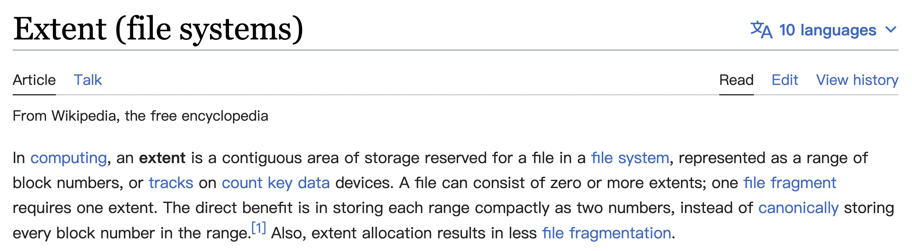
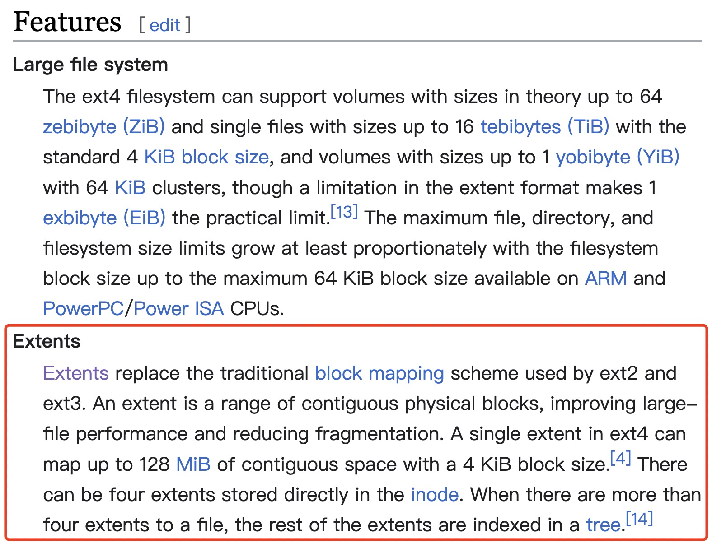
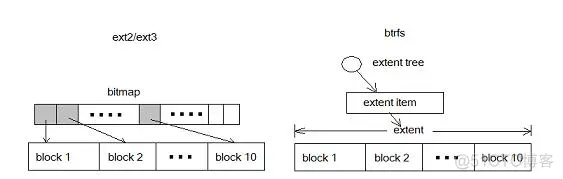
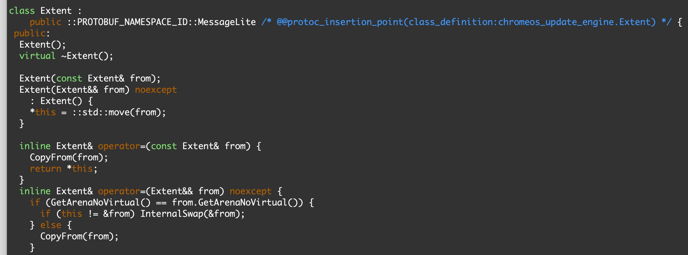
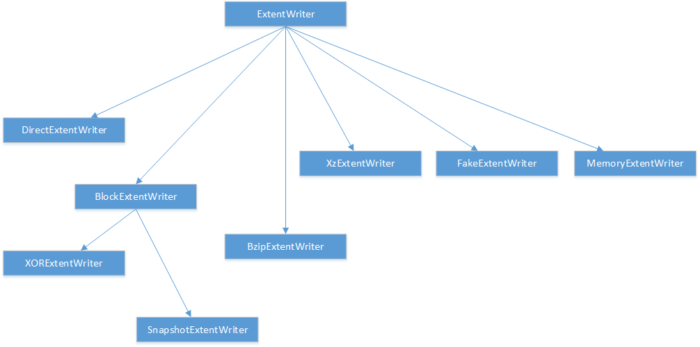
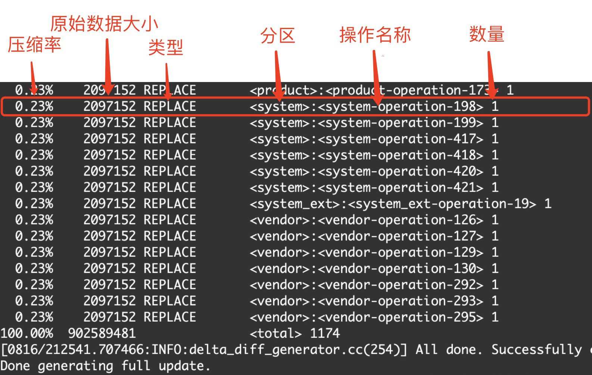
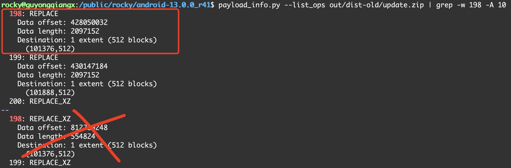

### 20230227-Android Update Engine 分析（十九）Extent 到底是什么鬼？


说来惭愧，几年前，我把 Android 的 system/update_engine 目录下早期的代码翻了一遍，很多地方提到了并且使用了 extent 这个概念来处理数据，但我一直没有搞懂 extent 到底是个什么东西，只是知道一个 extent 由两个数据表示，一个表示起始位置，另一个表示长度。在制作升级包时，差分操作基于 extent 进行；在设备端升级时基于 extent 进行还原。仅致于此，并没有继续深究~


最近才了解到 extent 是现在常见的文件系统组织方式，突然一惊，真是 out 了，这打破了我一直以为文件系统都是基于 blockmap 进行处理的陈旧观念。


> 本文基于 Android-11.0.0_r21 进行分析


## 1. 什么是 Extent?

### 0. 存储层次


### 1. 什么是 Extent?

初次接触 extent，脑子一片空白，难免想知道中文叫什么？但似乎没有找到一个很确切的中文翻译。

把 extent 翻译成区块？一提到块，基本上都是指 block，所以并不贴切。

现在有不少文章把 extent 叫做区段，表示一段数据的意思，但有时候也容易和区块混淆。

大体来说，把 extent 翻译成区段基本能够表达由一组区块(block)构成的一段数据的意思。

不过更多的地方则是保留英文原名，干脆不翻译，直接就叫 extent。

所以，本文也干脆就保留 Extent 的英文原样，不进行翻译。


### 2. Wikipedia 中对 Extent 的描述

为了严谨起见，我们还是看看维基百科上是怎么表述 extent 的。



图 1. Wikipedia 中对 Extent 的描述

> 来源: https://en.wikipedia.org/wiki/Extent_(file_systems)

这里提到，在计算机领域中，extent 是文件系统中用于存放文件的一片连续的区域，表示为一个范围内的块号，或设备上的磁道。

> 在存储中，最小的操作单位为 sector，通常一个 sector 占用 512 byte。然后多个 sector 组成一个 block。
>
> 实际上我们常用的单位不是 sector，而是 block。
>
> Android 系统中，block 是文件和镜像数据存放的最小单位，每个 block 大小为 4K，即每 8 个 sector 组成 1 个 block。假设一个文件有 25K，则前面的 24K 占用 6 个 block，剩余的 1K 数据单独占用 1 个 block，所以一个使用 7 个 block。

一个文件可以由 0 个或多个 extent 构成。例如，一个从第 0 个 block 开始，占用 20 个 block 的文件用 extent 数据可以表示为(0, 20)。

如果一个文件由多个不连续部分构成，每个部分内部包含多连续的数据块。我们通常把每一个连续数据块组成的部分称为碎片。则一个块文件碎片可以由一个 extent 表示(因为可以通过一个起始位置和一个长度的 extent 来标明一段数据)。例如一个占用了以下 block 多个 block 区域的。

0~19 block, 25~34 

基于 blockmap 的文件系统，其每一个 block 都需要 1 个 bit 来表示，如果文件很大，对应的 blockmap 就会相应增大。但使用 extent 的文件系统则不存在这个问题，文件增大，只要是连续的，将 extent 表示长度的数据调整为相应数值即可。

因此，使用 extent 的直接收益就是每一段数据都可以压缩为两个数字来表示，而不需要存储这段数据内每一个 block 的编号。

> 抱歉，我不明白这里的 count key data devices 是什么东西，不知道该怎么翻译，也不明白是啥意思。


再来看看 Ext4 文件系统中，对 extent 的解释：



图 2. Wikipedia 中对 Ext4 文件系统 Extents 特性的描述

> 来源: https://en.wikipedia.org/wiki/Ext4

上面红色方框内的部分大致意思如下：

extent 取代了 ext2 和 ext3 使用的传统 block mapping 方案。1 个 extent 是一系列连续的物理块(physical blocks)，可提高大文件性能并减少碎片。

ext4 中的单个 extent 最多可以映射 128 MiB 的连续空间，其块(block)大小为 4 KiB。

1 个 inode 中可以直接存放 4 个 extents。当文件的 extent 超过 4 个时，其余 extent 将基于树(tree)进行索引。


### 3. 其它 Extent 相关资料

这里粘贴两段我从网上找到的关于 extent 的资料，更多描述请点击相应的文章链接阅读原文，特别感谢两位作者的分享。


#### 《文件系统索引extent 和 bitmap区别》

> 来源: https://blog.51cto.com/u_15174006/2719536

> Extent 能有效地减少元数据开销。
>
> 为了进一步理解这个问题，我们还是看看 ext2 中的反面例子。
>
> ext2/3 以 block 为基本单位，将磁盘划分为多个 block 。为了管理磁盘空间，文件系统需要知道哪些 block 是空闲的。 Ext 使用 bitmap 来达到这个目的。 Bitmap 中的每一个 bit 对应磁盘上的一个 block，当相应 block 被分配后，bitmap 中的相应 bit 被设置为 1 。这是很经典也很清晰的一个设计，但不幸的是当磁盘容量变大时，bitmap 自身所占用的空间也将变大。这就导致了扩展性问题，随着存储设备容量的增加，bitmap 这个元数据所占用的空间也随之增加。而人们希望无论磁盘容量如何增加，元数据不应该随之线形增加，这样的设计才具有可扩展性。
>
> 下图比较了 block 和 extent 的区别：采用 extent 的 btrfs 和采用 bitmap 的 ext2/3
>
> 
>
> 图 3. 采用 extent 的 btrfs 和采用 bitmap 的 ext2/3
>
> 在 ext2/3 中，10 个 block 需要 10 个 bit 来表示；在 btrfs 中则只需要一个元数据。对于大文件，extent 表现出了更加优异的管理性能。
>
> Extent 是 btrfs 管理磁盘空间的最小单位，由 extent tree 管理。 Btrfs 分配 data 或 metadata 都需要查询 extent tree 以便获得空闲空间的信息。
>
> 注：EXT4文件系统也采用了基于 extent 的文件存储
>
> **extent 和 bitmap**
> extent 的定义为一段连续的空间，这段连续的空间由 offset/bytes 来描述，没有更细分的粒度；bitmap 则通过 bit 来描述一个 ctl->unit 大小的单元，最小的粒度是 unit，对于 bg 来说是 sectorsize 大小。


#### 《文件系统的两种文件索引模式extent和blockmap》

> 来源: https://blog.51cto.com/zhangyu/637537

> extent 和 blockmap 是两类典型的索引实现方案，事实上，文件系统也似乎仅能按这2种方案(或共同)来实现索引。extent 是基于片断的索引方案，blockmap 是基于分配块的位图索引。
>
> 先说blockmap，这是用在ufs、sco htfs、ext2/3、reiserfs上的索引模式，意思是每个文件的分配块都有一个索引与之对应，是一对一的索引关系。举例来说：EXT3上有个a.dat，文件大小是4M，文件系统的块大小是4K，那这意味着a.dat会占用文件系统的1024个块。对这1024个块，系统会提供1024个4字节(即4096个字节)的索引表，来描述这1024个块到底位置在哪里(就像一个包含1024个对象的指针数组）。这样，文件系统驱动层下了指令，要读或写某个块，可以不用查询直接定位这个特定块。
>     
> 显而易见，Blockmap的索引机制，需要较大索引空间做保障，随机读写时如跨度太大，缓冲机制无法一次性读入全部索引信息，效率便会下降得多。同时磁盘空间浪费很大(如同EXT3，在节点设计、文件索引等方面全部是定长的MAP机制实现，所以,ext3的磁盘空间浪费严重)。另外，如果是大文件，因块索引极大，就需要对索引块引入几级索引机制(似乎不太好理解)，定位某些块时，也需要几层转换。
>     
> 再谈extent方式，用于ntfs、Vxfs、jfs、ext4等文件系统。其实现方式和blockmap不同的是，索引是按分配的片断记录，只记起始块、连续块数、及文件内部块位置(NTFS叫VCN的东东）。比如上述例子，如果一个EXT4上的4M文件，块大小同样为4K，如果这个文件分配时是连续分配的，只需记录3个数字:（文件内部块号：0，文件系统分配起始块：x,连续块数:1024)，不再需要1024个索引空间来描述。当然，如果这个文件有多个碎片组成，则需要多条记录来实现。
>     
> extent其优点是索引空间占有率较少，连续读写时会有优势，但缺点是算法复杂度略高。比如一个文件由100个片断(碎片)组成，需要定位到文件内部10M的偏移，则需要二叉查找属于哪个片断，再根据片断的起始地址计算到具体的分配块地址，才可以把数据读出来。如果像NTFS一样，片断本身都由变长方式实现，则内核判断上就更麻烦，文件系统崩溃的可能性也就很大了。
> 


总而言之，bitmap 和 extent 是文件系统组织的两种方式，前者出现在 ext2/3 和些旧文件系统上，后者在较新的文件系统(ext4, btrfs, xfs 等)上用来管理文件。

extent 方式索引空间占用小，连续读写有优势，缺点是算法复杂度高。


## 2. Update Engine 中的 Extent

### update_metadata.proto 中的 Extent

Android 在 update_metadata.proto 中定义用于 payload 生成和处理的 Extent 结构:

```protobuf
// 文件: system/update_engine/update_metadata.proto

// Data is packed into blocks on disk, always starting from the beginning
// of the block. If a file's data is too large for one block, it overflows
// into another block, which may or may not be the following block on the
// physical partition. An ordered list of extents is another
// representation of an ordered list of blocks. For example, a file stored
// in blocks 9, 10, 11, 2, 18, 12 (in that order) would be stored in
// extents { {9, 3}, {2, 1}, {18, 1}, {12, 1} } (in that order).
// In general, files are stored sequentially on disk, so it's more efficient
// to use extents to encode the block lists (this is effectively
// run-length encoding).
// A sentinel value (kuint64max) as the start block denotes a sparse-hole
// in a file whose block-length is specified by num_blocks.

message Extent {
  optional uint64 start_block = 1;
  optional uint64 num_blocks = 2;
}
```


数据按块(block)存储在磁盘上，并且总是从 block 的开始位置开始存储。如果一个文件的数据对于一个 block 来说太大，它会溢出到另一个 block。这个 block 可能是，也可能不是在物理分区上的随后紧挨着的 block。一个有序的 extent 列表是有序 block 列表的另一种表示形式。

> 因为一个文件需要一个或多个 extent 按顺序表示，所以称为 **extent 有序列表**。

例如，按顺序存储在第 9、10、11、2、18、12 个 block 中的文件用 extent 列表的方式可以表示为一个包含 4 个 extent 的有序列表: `{{9,3}, {2,1}, {18,1}, {12,1}}`。

一般来说，文件按顺序存储在磁盘上，所以使用 extent 来编码 block 列表更有效率(这实际上是一种行程编码)。

> 比方说文件数据按顺序存放在第 9、10、11、12、13、14 个 block 中，使用 extent 有序列表的方式就是`{{9,6}}`，即 extent 有序列表中只包含了一个 extent: `{9, 6}`。这里显然使用 extent 有序列表的表现形式更高效。


update_metadata.proto 中定义的 Extent 结构包含两个成员:

- 类型为 uint64 的 `start_block` 表示 extent 起始 block 位置，
- 类型为 uint64 的 `num_blocks` 表示 extent 的 block 数量

因此，一个 extent 相当于文件中从 `start_block`开始，长度为 `num_block` 个 block 的空洞。


### update engine 代码中的 Extent

`update_metadata.proto` 定义的 Extent 是如何起作用的呢？

在编译 Android 时，`update_metadata.proto` 会被 protobuf 工具编译成名为 `update_metadata.pb.h` 的头文件存放在  `out/soong/.intermediates` 目录下。

如果你想知道生成文件的具体位置和内容，可以通过 find 命令查看:

```bash
$ find out -type f -iname update_metadata.pb.h
```


在 `update_metadata.pb.h` 我们可以看到定义了一个 Extent 类:



具体的 Extent 类的实现代码不需要关注，重点在于它的两个成员 `start_block` 和 `num_blocks`。


通过 protobuf 编译得到 Extent 类的实现以后，在代码中像下面这样包含`update_metadata.pb.h` 就可以调用 Extent 了。

```c++
#include "update_engine/update_metadata.pb.h"
```


我们直接在 update_engine 目录下搜索文件名中包含 extent 的文件(需要排除单元测试的  unittest.cc 文件)，来看看 update_engine 中都有哪些和 extent 相关的文件:

```bash
android-13.0.0_r41$ find system/update_engine/ -type f -name "*extent*" | grep -v unittest | sort
system/update_engine/payload_consumer/block_extent_writer.cc
system/update_engine/payload_consumer/block_extent_writer.h
system/update_engine/payload_consumer/bzip_extent_writer.cc
system/update_engine/payload_consumer/bzip_extent_writer.h
system/update_engine/payload_consumer/extent_map.h
system/update_engine/payload_consumer/extent_reader.cc
system/update_engine/payload_consumer/extent_reader.h
system/update_engine/payload_consumer/extent_writer.cc
system/update_engine/payload_consumer/extent_writer.h
system/update_engine/payload_consumer/fake_extent_writer.h
system/update_engine/payload_consumer/snapshot_extent_writer.cc
system/update_engine/payload_consumer/snapshot_extent_writer.h
system/update_engine/payload_consumer/xor_extent_writer.cc
system/update_engine/payload_consumer/xor_extent_writer.h
system/update_engine/payload_consumer/xz_extent_writer.cc
system/update_engine/payload_consumer/xz_extent_writer.h
system/update_engine/payload_generator/extent_ranges.cc
system/update_engine/payload_generator/extent_ranges.h
system/update_engine/payload_generator/extent_utils.cc
system/update_engine/payload_generator/extent_utils.h
```

> 这里基于 android-13.0.0_r41 代码搜索，如果版本不同可能会略有差异。

将上面的 find 结果归类一下:

主要是 payload_consumer 和 payload_generator 有文件名带 extent 字样的文件。

顾名思义，payload_consumer 就是升级中专门用于处理和消费 payload 数据，需要将各种各样的数据写入到目标设备中。payload_generator 就是制作升级包时根据源分区和目标分区的内容，生成差分数据。


payload_consumer 由于需要处理多种 InstallOperation，包含了多组 extent 的 reader 和 writer 实现，包括：`extent_reader`, `extent_writer`，以及`block_extent_writer`, `bzip_extent_writer`,  `fake_extent_writer`, `snapshot_extent_writer`, `xor_extent_writer` 和 `xz_extent_writer`


其中，ExtentReader 比较简单，重点关注下各种 ExtentWrite，它们之间的关系如下:



各种 ExtentWriter 的作用就是将升级中各种 Operation 所携带的数据写入到分区对应的 Extent 中。


payload_generator 中包含了 `extent_ranges.cc` 和 `extent_utils.cc`两个文件，定义了 ExtentRanges 对象，以及 Extent 和 ExtentRanges 的各种操作。


ExtentRanges 对象表示一组无序的 extent 集合。ExtentRanges  对象可以通过添加或删除 block 来进行修改(就像:集合加法或集合减法)。

为什么是 ExtentRanges?

在生成 payload 文件数据的过程中，各个分区镜像按照 4K 大小划分为若干个 block，再根据不同的情形将每一个  block 分门别类集中到某个  extent 中进行处理，最终得到一大堆 extent。

ExtentRanges 支持的操作包括:

- AddBlock，SubtractBlock
- AddExtent，SubtractExtent
- AddExtents，SubtractExtents
- AddRepeatedExtents，SubtractRepeatedExtents
- AddRanges，SubtractRanges
- ContainsBlock
- ExtentsOverlapOrTouch，ExtentsOverlap
- GetExtentsForBlockCount

具体操作也比较见名知意，对 ExtentRanges 对象按照不同的颗粒度 (block, extent, extents, repeated extents, ranges) 执行类似集合的添加和删除操作，具体代码这里不再展开。


### OTA 中的 chunk

在制作全量包时，对分区镜像按照 chunk 进行分割处理。"chunk" 通常指的是一个较大整体镜像被划分的小块，这样做通常是出于处理速度、内存使用或其他优化考虑。


在 `payload_generation_config.h` 中定义了两种 chunk size:

- **hard_chunk_size**

`hard_chunk_size`在 delta_generator 中默认设置为 200M，但可以通过命令行参数 `chunk_size` 改写。

`hard_chunk_size` 是 Payload 中单个操作(Operation)往目标中写入的最大尺寸。大于 `chunk_size` 的操作应该被拆分成多个操作。`hard_chunk_size`值为 `-1` 意味着没有大小限制。`hard_chunk_size` 意味着更多的操作，以及减少重用数据的机会。


- **soft_chunk_size**

`soft_chunk_size` 默认大小为 2M，是当没有显著影响操作时使用的首选 chunk 大小。例如，REPLACE、MOVE 和 SOURCE_COPY 操作不会显著受到 chunk 尺寸的影响，除了在 manifest 中描述操作额外所需的几个字节的开销。另一方面，分割 BSDIFF 操作会影响有效负载大小，因为在 chunk 之间不可能使用冗余。


### 制作全量包时的 Extent


制作全量包时，在 `FullUpdateGenerator::GenerateOperations()` 函数中生成 extent，代码会检查 `hard_chunk_size` 和 `soft_chunk_size`，并使用其中较小的值作为实际分割分区镜像时的 chunk 大小。

由于 delta_generator 默认设置 `hard_chunk_size` 为 200M，导致最终会以 `soft_chunk_size` 的大小 2M 对分区镜像进行分割。

操作时，会将一个完整的分区镜像按照每 2M 的大小分割成若干个 chunk，并将每个 chunk 的数据送到一个单独的线程进行并发处理。


对于分区镜像的分割信息，在制作全量包时会有类似下面这样的打印:

"Compressing partition system from /tmp/system.img.i9qtlm splitting in chunks of 512 blocks (4096 bytes each) using 24 threads"

这里的 `/tmp/system.img.i9qtlm` 是 system 还原成 raw 格式后的临时镜像名称，然后以每个 chunk 包含 512 个 block 的方式进行分割，使用 24 个线程并行处理 chunk 数据。

换句话说，这里每个 block 为 4K (即 4096 Bytes)，每个 chunk 为 2M (即 4K x 512 = 2048K)，有 24 个线程并行处理 chunk 数据。


分区镜像划分为多个 chunk 后，每个 chunk 的原始数据交由 ChunkProcessor 类进行处理。每处理完一个 chunk 得到一个 InstallOperation。

InstallOperation 有一个类似 "system-operation-198" 这样的名字，相应目标位置的 Extent 信息存放到 `dst_extent` 中，就是当前 chunk 的起始 block，以及 block 总数(2M 大小的 chunk 对应于  512)。

例如，在制作全量包的最后能看到如下的输出信息：



注意图中第二行的操作 "system-operation-198"，其原始数据大小为 2097152，这个数据就是 2M。

我们试图从全量包的信息中还原这个操作，在这里我们通过 `payload_info.py` 工具查看全量包中索引值为 198 的操作，一共找到两个，很显然第一个类型为 REPLACE 的就是我们上面图中的 "system-operation-198":



我来解读下这里第 198 个类型为 REPLACE 的操作信息：

- "Data offset: 428050032"，说明该操作携带的数据在 payload.bin 文件的 428050032 偏移处
- “Data length: 2097152"，说明该操作携带的数据大小为 2097152，即 2M
- "Destination: 1 extent (512 blocks)"，原始数据包含 1 个 extent，实际为 512 个 block
- "(101376, 512)"，具体的 extent 信息，即从 101376 开始的 512 个 block

换句话说，这里就是将 payload.bin 的负载中从 428050032 字节开始的 2M 数据，写入到目标分区 extent (101376, 512) 指定的位置中，即第 101376 block 开始随后 512 个 block 。


可以看到，制作全量包时，基于分区镜像的某个 2M 大小的 chunk 生成一个 Operation，位置信息保存在 `dst_extent` 中；升级时就将这个 Operation 的数据还原到 `dst_extent` 指定的目标分区位置中。


> 更多全量包生成策略的细节，请参考[《Android Update Engine 分析（十五） FullUpdateGenerator 策略》](https://guyongqiangx.blog.csdn.net/article/details/122767273)


### **制作差分包生成 extent**

相比于全量包，生成差分包数据就显得非常复杂了。

在 `ABGenerator::GenerateOperations()` 函数中生完成差分数据的生成。

但实际上干活的是 `diff_utils::DeltaReadPartition()` 函数。


生成差分包数据时，分成多步进行处理：

首先忽略分新区镜像中的 `has_tree_extent` 和 `fec_extent`, 因为这部分数据在设备升级时，会在`file_system_verify` 阶段重建。


然后，对新旧分区按照 block 大小进行划分，在内存中创建一个 BlockMapping 图。

所谓的 BlockMapping，有以下特点：

- 将每一个 block 的数据映射到一个唯一的整数值 block ids
- 两个拥有相同数据的 block，将映射到同一个 block ids
- 两个拥有相同 block ids 的 block，其数据也相同
- 数据全 0 的 block，其 block ids 为 0

新旧分区经过映射处理以后，分别得到自己的 BlockMapping  图，new_block_ids 和 old_block_ids。


如果新分区某个 block 的 block ids 为 0，则说明这个 block 的数据全 0，将新分区所有全 0 的 block 添加到 new_zeros 的 Extent 向量中。对于全 0 的 Extent，按照 `soft_chunk_size` (2M) 大小生成 ZERO 操作。


如果新分区中某个 block 和旧分区某个 block 的 block ids 一样，则说明新旧分区的这两个 block 的数据一样。


```c++
/*
 * file: system/update_engine/payload_generator/ab_generator.cc
 */
bool ABGenerator::GenerateOperations(const PayloadGenerationConfig& config,
                                     const PartitionConfig& old_part,
                                     const PartitionConfig& new_part,
                                     BlobFileWriter* blob_file,
                                     vector<AnnotatedOperation>* aops) {
  TEST_AND_RETURN_FALSE(old_part.name == new_part.name);

  /*
   * 1. 设置 hard_chunk_blocks 和 soft_chunk_blocks
   */
  ssize_t hard_chunk_blocks =
      (config.hard_chunk_size == -1
           ? -1
           : config.hard_chunk_size / config.block_size);
  size_t soft_chunk_blocks = config.soft_chunk_size / config.block_size;

  /*
   * 2. 调用 DeltaReadPartition 读取 old 和 new 分区数据，对比生成差分需要的 operation 存放到 aops 中, 对应数据存放到 blob_file 中
   */
  aops->clear();
  TEST_AND_RETURN_FALSE(diff_utils::DeltaReadPartition(aops,
                                                       old_part,
                                                       new_part,
                                                       hard_chunk_blocks,
                                                       soft_chunk_blocks,
                                                       config.version,
                                                       blob_file));
  LOG(INFO) << "done reading " << new_part.name;

  /*
   * 3. 对所有的 operation 按照 start_block 的位置进行排序
   */
  SortOperationsByDestination(aops);

  /*
   * 4. 将连续的多个小的同样的 operation 合并成一个
   */
  // Use the soft_chunk_size when merging operations to prevent merging all
  // the operations into a huge one if there's no hard limit.
  size_t merge_chunk_blocks = soft_chunk_blocks;
  if (hard_chunk_blocks != -1 &&
      static_cast<size_t>(hard_chunk_blocks) < soft_chunk_blocks) {
    merge_chunk_blocks = hard_chunk_blocks;
  }

  LOG(INFO) << "Merging " << aops->size() << " operations.";
  TEST_AND_RETURN_FALSE(MergeOperations(
      aops, config.version, merge_chunk_blocks, new_part.path, blob_file));
  LOG(INFO) << aops->size() << " operations after merge.";

  /*
   * 5. 对每一个带有 src_extents 的 operation，计算 source 哈希存放到 operation 中，升级恢复数据时检查操作的数据的哈希是否匹配
   */
  if (config.version.minor >= kOpSrcHashMinorPayloadVersion)
    TEST_AND_RETURN_FALSE(AddSourceHash(aops, old_part.path));

  return true;
}
```


但这里真正生成 InstallOperation 的操作是在 DeltaReadPartition 函数中：

```c++
bool DeltaReadPartition(vector<AnnotatedOperation>* aops,
                        const PartitionConfig& old_part,
                        const PartitionConfig& new_part,
                        ssize_t hard_chunk_blocks,
                        size_t soft_chunk_blocks,
                        const PayloadVersion& version,
                        BlobFileWriter* blob_file) {
  ExtentRanges old_visited_blocks;
  ExtentRanges new_visited_blocks;

  /*
   * 1. 如果 verity 功能已经打开，则将 verity 相关的 hash tree 和 fec 等 extent 标记为已经访问过，这里不再进行处理。为什么这里能够跳过，是因为 verity 的 hash tree 和 fec 在升级中会根据分区数据重建。
   */
  // If verity is enabled, mark those blocks as visited to skip generating
  // operations for them.
  if (version.minor >= kVerityMinorPayloadVersion &&
      !new_part.verity.IsEmpty()) {
    LOG(INFO) << "Skipping verity hash tree blocks: "
              << ExtentsToString({new_part.verity.hash_tree_extent});
    new_visited_blocks.AddExtent(new_part.verity.hash_tree_extent);
    LOG(INFO) << "Skipping verity FEC blocks: "
              << ExtentsToString({new_part.verity.fec_extent});
    new_visited_blocks.AddExtent(new_part.verity.fec_extent);
  }

  ExtentRanges old_zero_blocks;
  TEST_AND_RETURN_FALSE(DeltaMovedAndZeroBlocks(aops,
                                                old_part.path,
                                                new_part.path,
                                                old_part.size / kBlockSize,
                                                new_part.size / kBlockSize,
                                                soft_chunk_blocks,
                                                version,
                                                blob_file,
                                                &old_visited_blocks,
                                                &new_visited_blocks,
                                                &old_zero_blocks));

  bool puffdiff_allowed = version.OperationAllowed(InstallOperation::PUFFDIFF);
  map<string, FilesystemInterface::File> old_files_map;
  if (old_part.fs_interface) {
    vector<FilesystemInterface::File> old_files;
    TEST_AND_RETURN_FALSE(deflate_utils::PreprocessPartitionFiles(
        old_part, &old_files, puffdiff_allowed));
    for (const FilesystemInterface::File& file : old_files)
      old_files_map[file.name] = file;
  }

  TEST_AND_RETURN_FALSE(new_part.fs_interface);
  vector<FilesystemInterface::File> new_files;
  TEST_AND_RETURN_FALSE(deflate_utils::PreprocessPartitionFiles(
      new_part, &new_files, puffdiff_allowed));

  list<FileDeltaProcessor> file_delta_processors;

  // The processing is very straightforward here, we generate operations for
  // every file (and pseudo-file such as the metadata) in the new filesystem
  // based on the file with the same name in the old filesystem, if any.
  // Files with overlapping data blocks (like hardlinks or filesystems with tail
  // packing or compression where the blocks store more than one file) are only
  // generated once in the new image, but are also used only once from the old
  // image due to some simplifications (see below).
  for (const FilesystemInterface::File& new_file : new_files) {
    // Ignore the files in the new filesystem without blocks. Symlinks with
    // data blocks (for example, symlinks bigger than 60 bytes in ext2) are
    // handled as normal files. We also ignore blocks that were already
    // processed by a previous file.
    vector<Extent> new_file_extents =
        FilterExtentRanges(new_file.extents, new_visited_blocks);
    new_visited_blocks.AddExtents(new_file_extents);

    if (new_file_extents.empty())
      continue;

    // We can't visit each dst image inode more than once, as that would
    // duplicate work. Here, we avoid visiting each source image inode
    // more than once. Technically, we could have multiple operations
    // that read the same blocks from the source image for diffing, but
    // we choose not to avoid complexity. Eventually we will move away
    // from using a graph/cycle detection/etc to generate diffs, and at that
    // time, it will be easy (non-complex) to have many operations read
    // from the same source blocks. At that time, this code can die. -adlr
    FilesystemInterface::File old_file =
        GetOldFile(old_files_map, new_file.name);
    vector<Extent> old_file_extents;
    if (version.InplaceUpdate())
      old_file_extents =
          FilterExtentRanges(old_file.extents, old_visited_blocks);
    else
      old_file_extents = FilterExtentRanges(old_file.extents, old_zero_blocks);
    old_visited_blocks.AddExtents(old_file_extents);

    file_delta_processors.emplace_back(old_part.path,
                                       new_part.path,
                                       version,
                                       std::move(old_file_extents),
                                       std::move(new_file_extents),
                                       old_file.deflates,
                                       new_file.deflates,
                                       new_file.name,  // operation name
                                       hard_chunk_blocks,
                                       blob_file);
  }
  // Process all the blocks not included in any file. We provided all the unused
  // blocks in the old partition as available data.
  vector<Extent> new_unvisited = {
      ExtentForRange(0, new_part.size / kBlockSize)};
  new_unvisited = FilterExtentRanges(new_unvisited, new_visited_blocks);
  if (!new_unvisited.empty()) {
    vector<Extent> old_unvisited;
    if (old_part.fs_interface) {
      old_unvisited.push_back(ExtentForRange(0, old_part.size / kBlockSize));
      old_unvisited = FilterExtentRanges(old_unvisited, old_visited_blocks);
    }

    LOG(INFO) << "Scanning " << utils::BlocksInExtents(new_unvisited)
              << " unwritten blocks using chunk size of " << soft_chunk_blocks
              << " blocks.";
    // We use the soft_chunk_blocks limit for the <non-file-data> as we don't
    // really know the structure of this data and we should not expect it to
    // have redundancy between partitions.
    file_delta_processors.emplace_back(
        old_part.path,
        new_part.path,
        version,
        std::move(old_unvisited),
        std::move(new_unvisited),
        vector<puffin::BitExtent>{},  // old_deflates,
        vector<puffin::BitExtent>{},  // new_deflates
        "<non-file-data>",            // operation name
        soft_chunk_blocks,
        blob_file);
  }

  size_t max_threads = GetMaxThreads();

  // Sort the files in descending order based on number of new blocks to make
  // sure we start the largest ones first.
  if (file_delta_processors.size() > max_threads) {
    file_delta_processors.sort(std::greater<FileDeltaProcessor>());
  }

  base::DelegateSimpleThreadPool thread_pool("incremental-update-generator",
                                             max_threads);
  thread_pool.Start();
  for (auto& processor : file_delta_processors) {
    thread_pool.AddWork(&processor);
  }
  thread_pool.JoinAll();

  for (auto& processor : file_delta_processors) {
    TEST_AND_RETURN_FALSE(processor.MergeOperation(aops));
  }

  return true;
}
```


> 更多差分包(增量包)生成策略，请参考[《Android Update Engine 分析（十六） ABGenerator 策略》](https://guyongqiangx.blog.csdn.net/article/details/122886150)

## 3. Super 设备中的 extent

