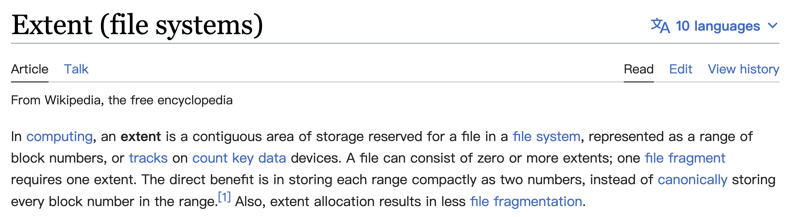
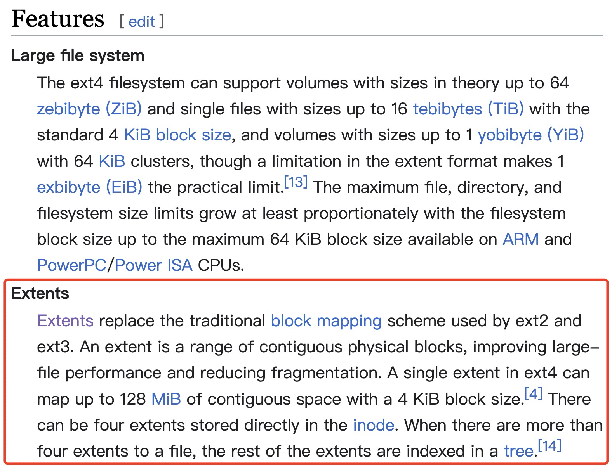

# 20230227-Android Update Engine 分析（十八）Extent 到底是什么？

说来惭愧，几年前，我把 Android 的 system/update_engine 目录下早期的代码翻了一遍，很多地方提到了并且使用了 extent 这个概念来处理数据，但我一直没有搞懂 extent 到底是个什么东西，只是知道一个 extent 由两个数据表示，一个表示起始位置，另一个表示长度。在制作升级包时，差分操作基于 extent 进行；在设备端升级时基于 extent 进行还原。仅致于此，并没有继续深究~

最近才了解到 extent 是现在常见的文件系统组织方式，突然一惊，真是 out 了，这打破了我一直以为文件系统都是基于 blockmap 进行处理的陈旧观念。

## 什么是 Extent?

初次接触 extent，脑子一片空白，难免想知道中文叫什么？但似乎没有找到一个很确切的中文翻译。

把 extent 翻译成区块？一提到块，基本上都是指 block，所以并不贴切。

现在有不少文章把 extent 叫做区段，表示一段数据的意思，但有时候也容易和区块混淆。

大体来说，把 extent 翻译成区段基本能够表达由一组区块(block)构成的一段数据的意思。

不过更多的地方则是保留英文原名，干脆不翻译，直接就叫 extent。

所以，本文也干脆就保留 Extent 的英文原样，不进行翻译。

## Wikipedia 中对 Extent 的描述

为了严谨起见，我们还是看看维基百科上是怎么表述 extent 的。

> 来源: https://en.wikipedia.org/wiki/Extent_(file_systems)

这里提到，在计算机领域中，extent 是文件系统中用于存放文件的一片连续的区域，表示为一个范围内的块号，或设备上的磁道。一个文件可以由 0 个或多个 extent 构成。一个块文件碎片由一个 extent 表示(因为可以通过一个起始位置和一个长度的 extent 来标明一段数据)。

基于 blockmap 的文件系统，其每一个 block 都需要 1 个 bit 来表示，如果文件很大，对应的 blockmap 就会相应增大。但使用 extent 的文件系统则不存在这个问题，文件增大，只要是连续的，将 extent 表示长度的数据调整为相应数值即可。

因此，使用 extent 的直接收益就是每一段数据都可以压缩为两个数字来表示，而不需要存储这段数据内每一个 block 的编号。

> 抱歉，我不明白这里的 count key data devices 是什么东西，不知道该怎么翻译，也不明白是啥意思。

再来看看 Ext4 文件系统中，对 extent 的解释：

> 来源: https://en.wikipedia.org/wiki/Ext4

上面红色方框内的部分大致意思如下：

extent 取代了 ext2 和 ext3 使用的传统 block mapping 方案。1 个 extent 是一系列连续的物理块(physical blocks)，可提高大文件性能并减少碎片。

ext4 中的单个 extent 最多可以映射 128 MiB 的连续空间，其块(block)大小为 4 KiB。

1 个 inode 中可以直接存放 4 个 extents。当文件的 extent 超过 4 个时，其余 extent 将基于树(tree)进行索引。

## 文件系统索引 extent 和 bitmap 的区别

---

Extent (file systems)

- https://en.wikipedia.org/wiki/Extent_(file_systems)

ext4

- https://en.wikipedia.org/wiki/Ext4

**EXT3和EXT4两种文件系统比较**

- https://blog.51cto.com/suxin/1677632

**文件系统索引extent 和 bitmap区别**

- https://blog.51cto.com/u_15174006/2719536

**文件系统的两种文件索引模式extent和blockmap**

- https://blog.51cto.com/zhangyu/637537

**关于ext4文件系统概述**

- https://blog.51cto.com/u_15343792/5054512

使用ioctl得到extent形式的文件逻辑块 ioctl(fd,FS_IOC_FIEMAP)

- https://blog.csdn.net/weiai3140/article/details/120405491

基于Extent 的文件存储(fiemap)

- https://blog.csdn.net/younger_china/article/details/7075751

Fiemap Ioctl

- https://www.kernel.org/doc/html/latest/filesystems/fiemap.html

[理解ext4，第一部分(extents)](https://www.likecs.com/show-204906568.html)

- https://www.likecs.com/show-204906568.html

深入理解ext4（一）----extent区段

- https://blog.csdn.net/sara4321/article/details/8609610

ext4 extent详解1之示意图演示

- https://blog.csdn.net/hu1610552336/article/details/128509011

ext4的extent解析

- https://blog.csdn.net/lieye_leaves/article/details/54800344

ext4 extent详解2之内核源码详解

- https://blog.csdn.net/hu1610552336/article/details/128509145

