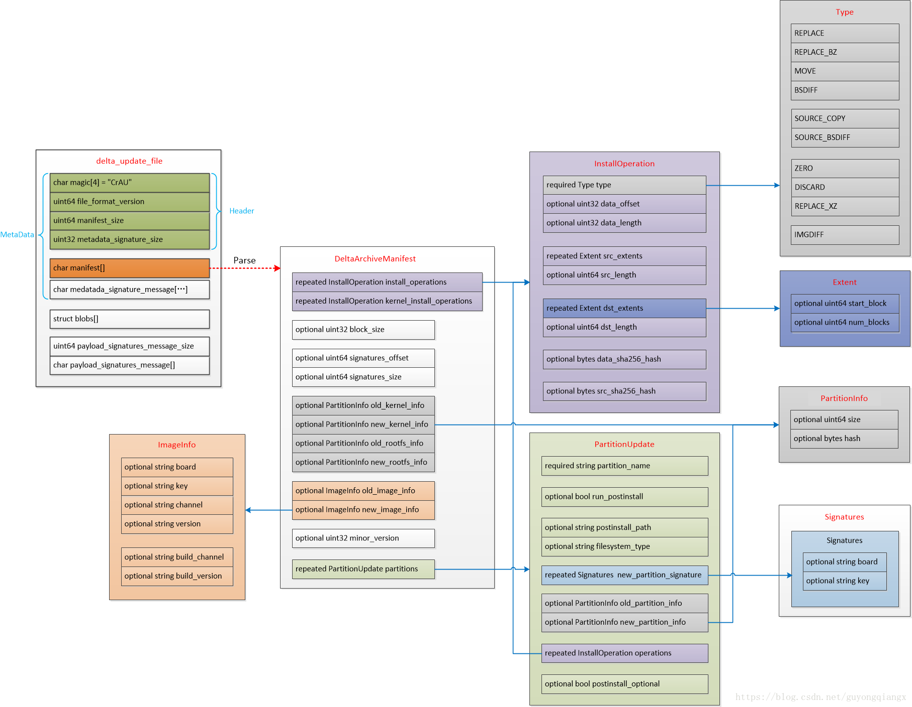

# 20230308-Android Update Engine 分析（十八）差分数据到底是如何更新的？

## 0. 导读

过去一直以来陆续有朋友问，差分数据到底是如何更新的？其实我一开始在这个问题上也犯了错误。本文详细跟踪差分数据接收到以后，是如何被用于更新的。


## 1. 系统升级的 3 个阶段

从宏观上说，整个差分升级过程大致分成三步：

假设升级前的旧系统为 V1, 升级后的新系统为 V2, 差分数据为 Delta

1. 制作差分包

   利用新旧的镜像文件生成差分数据，并打包到 payload.bin 文件中，得到差分包升级文件；

   即：V2(新) - V1(旧) = Delta(差分)

   

2. 传输差分包

   服务端将差分包数据传输给设备端。可以是网络传输，也可以是通过 U 盘复制；

   即：Server(Delta) -> Device(Delta)

   

3. 还原差分包

   设备端接收到差分包升级文件后，基于旧分区，使用差分数据还原，得到新分区数据；

   即：V1(旧) + Delta(差分) = V2(新)


通过上面的这 3 个步骤，利用系统上已有的旧系统 V1 的镜像，通过差分数据 Delta，而不需要传输新系统 V2 的全部镜像文件即可完成升级。


我们这一些系列前面的很多篇都在分析差分包是如何制作，如何传输的。

系统升级，设备端的核心是如何利用接收到的差分数据，基于旧分区数据还原得到新分区。

回到代码上，这个核心就是函数 `DeltaPerformer::Write`。要想了解数据到底是如何更新的，那就离不开这个函数。


## 2. DelaterPerformer 类的 Write 函数是如何被调用的？

在[《Android Update Engine分析（七） DownloadAction之FileWriter》](https://guyongqiangx.blog.csdn.net/article/details/82805813)分析过，通过网络接收到数据，或者通过文件读取到数据以后，DownloadAction 的`ReceivedBytes()`函数被回调，在其内部会进一步调用 DownloadAction 内部成员 `writer_` 的`Write()`函数写入接收到的数据。

具体内容请参考下面关于函数 `RecivedBytes` 的注释：

```c++
void DownloadAction::ReceivedBytes(HttpFetcher* fetcher,
                                   const void* bytes,
                                   size_t length) {
  // Note that bytes_received_ is the current offset.
  if (!p2p_file_id_.empty()) {
    WriteToP2PFile(bytes, length, bytes_received_);
  }

  /*
   * 1. 累加接收到的数据长度，保存在 bytes_received_ 中
   */
  bytes_received_ += length;
  
  /*
   * 2. 回调 delegate_ 对象的 BytesReceived 函数对数据进行处理
   */
  if (delegate_ && download_active_) {
    delegate_->BytesReceived(
        length, bytes_received_, install_plan_.payload_size);
  }
  
  /*
   * 3. 回调 writer_ 对象的 Write 函数对接收到的数据进行处理
   */
  if (writer_ && !writer_->Write(bytes, length, &code_)) {
    LOG(ERROR) << "Error " << code_ << " in DeltaPerformer's Write method when "
               << "processing the received payload -- Terminating processing";
    // Delete p2p file, if applicable.
    if (!p2p_file_id_.empty())
      CloseP2PSharingFd(true);
    // Don't tell the action processor that the action is complete until we get
    // the TransferTerminated callback. Otherwise, this and the HTTP fetcher
    // objects may get destroyed before all callbacks are complete.
    TerminateProcessing();
    return;
  }

  // Call p2p_manager_->FileMakeVisible() when we've successfully
  // verified the manifest!
  if (!p2p_visible_ && system_state_ && delta_performer_.get() &&
      delta_performer_->IsManifestValid()) {
    LOG(INFO) << "Manifest has been validated. Making p2p file visible.";
    system_state_->p2p_manager()->FileMakeVisible(p2p_file_id_);
    p2p_visible_ = true;
  }
}
```

这个函数中，除了 `p2p_file_id_` 相关的代码外，剩余的代码做了 3 件事：

1. 累加接收到的数据长度，保存在 bytes_received_ 中；
2. 回调 delegate_ 对象的 BytesReceived 函数对数据进行处理；
3. 回调 writer_ 对象的 Write 函数对接收到的进行处理

而这里的 `delegate_ ` 对象，在 DownloadAction 的构造函数中初始化为 `delegate_(nullptr)`，所以这里的第 2 步并没有被执行。


至于 writer_ 成员，是在哪里初始化的呢？这里我不再卖关子了，DownloadAction 的 writer_ 成员在 `PerformActionn()` 中被设置为 DeltaPerformer 类的对象。

下面的 `PerformAction()` 展示了 writer_ 成员被初始化为 DeltaPerformer 的类对象：

```c++
/* file: system/update_engine/payload_consumer/download_action.cc */
void DownloadAction::PerformAction() {
  http_fetcher_->set_delegate(this);

  // Get the InstallPlan and read it
  CHECK(HasInputObject());
  install_plan_ = GetInputObject();
  bytes_received_ = 0;

  install_plan_.Dump();

  LOG(INFO) << "Marking new slot as unbootable";
  if (!boot_control_->MarkSlotUnbootable(install_plan_.target_slot)) {
    LOG(WARNING) << "Unable to mark new slot "
                 << BootControlInterface::SlotName(install_plan_.target_slot)
                 << ". Proceeding with the update anyway.";
  }

  // 在 DownloadAction 的构造函数中，writer 成员被初始化为空指针: writer_(nullptr)，所以这里走 else
  if (writer_) {
    LOG(INFO) << "Using writer for test.";
  } else {
    // 使用 DeltaPerformer 的类对象初始化 writer_ 成员
    delta_performer_.reset(new DeltaPerformer(
        prefs_, boot_control_, hardware_, delegate_, &install_plan_));
    writer_ = delta_performer_.get();
  }
  download_active_ = true;

  //...
}
```


所以，回到 DownloadAction 的 ReceivedBytes() 函数:

 `writer_->Write()` 实质上就是 `DeltaPerformer->Write()`


所以本文后面的内容都围绕 DeltaPerformer 类的 `Write()` 函数进行。


## 3. DeltaPerformer 类的 Write 函数分析

DeltaPerformer 类的 Write 函数是整个升级的核心，了解了 Write 函数的操作流程，你就知道设备端接收到升级数据以后到底是如何进行处理的。


### 1. payload 数据结构

Write 函数操作的对象是 payload 数据，所以，这里对照 payload 数据的结构进行理解会更佳，我这里附上很早以前画的基于 Android 7.1 的 payload 数据结构框图:



图 1. payload 数据结构框图


更多关于 payload 数据结构定义的细节，请参考 update_engine 中 payload 数据的 protobuf 定义：

`system/update_engine/update_metadata.proto`


### 2. DeltaPerformer 类的 Write 函数注释

我在[《Android Update Engine分析（七） DownloadAction之FileWriter》](https://guyongqiangx.blog.csdn.net/article/details/82805813)分析过这个 Write 函数，我在这里再把 Write 函数简单注释总结一下：

```c++
/* file: system/update_engine/payload_consumer/delta_performer.cc */

// Wrapper around write. Returns true if all requested bytes
// were written, or false on any error, regardless of progress
// and stores an action exit code in |error|.
bool DeltaPerformer::Write(const void* bytes, size_t count, ErrorCode *error) {
  *error = ErrorCode::kSuccess;

  const char* c_bytes = reinterpret_cast<const char*>(bytes);

  /*
   * 1. 根据当前要处理的字节数 count，更新接收进度，
   *    输出进度日志: "Completed 23/377 operations (6%), 40302425/282164983 bytes downloaded (14%), overall progress 10%""
   */
  // Update the total byte downloaded count and the progress logs.
  total_bytes_received_ += count;
  UpdateOverallProgress(false, "Completed ");

  /*
   * 2. 解析 manifest 数据，提取 partitions 和 InstallOperations 信息
   */
  /*
   * 当 manifest 数据没有完成解析时: manifest_valid_=false
   * 执行这里的 while 循环，用于处理 manifest 数据
   */
  while (!manifest_valid_) {
    // Read data up to the needed limit; this is either maximium payload header
    // size, or the full metadata size (once it becomes known).
    /*
     * 2.1 复制 payload 头部的 Payload Header 数据到缓冲区
     */
    const bool do_read_header = !IsHeaderParsed();
    CopyDataToBuffer(&c_bytes, &count,
                     (do_read_header ? kMaxPayloadHeaderSize :
                      metadata_size_ + metadata_signature_size_));

    /*
     * 2.2 解析 payload 的 Header 数据，得到 manifest 和 metadata signature 的 size，方便后续操作
     */
    MetadataParseResult result = ParsePayloadMetadata(buffer_, error);
    if (result == kMetadataParseError)
      return false;
    if (result == kMetadataParseInsufficientData) {
      // If we just processed the header, make an attempt on the manifest.
      if (do_read_header && IsHeaderParsed())
        continue;

      return true;
    }

    /*
     * 2.3 检查验证 manifest 数据
     *     具体包括：
     *     1). 是否包含 old kernel 和 old rootfs 信息，如果是，则说明是差分升级;
     *     2). 检查差分升级和整包升级的各种版本信息;
     *     3). 输出类似日志: "Detected a 'full' payload."
     *     4). 检查 manifest 中的时间戳和当前运行系统的编译时间信息
     */
    // Checks the integrity of the payload manifest.
    if ((*error = ValidateManifest()) != ErrorCode::kSuccess)
      return false;
    manifest_valid_ = true;

    // Clear the download buffer.
    DiscardBuffer(false, metadata_size_);

    // This populates |partitions_| and the |install_plan.partitions| with the
    // list of partitions from the manifest.
    if (!ParseManifestPartitions(error))
      return false;

    num_total_operations_ = 0;
    for (const auto& partition : partitions_) {
      num_total_operations_ += partition.operations_size();
      acc_num_operations_.push_back(num_total_operations_);
    }

    LOG_IF(WARNING, !prefs_->SetInt64(kPrefsManifestMetadataSize,
                                      metadata_size_))
        << "Unable to save the manifest metadata size.";
    LOG_IF(WARNING, !prefs_->SetInt64(kPrefsManifestSignatureSize,
                                      metadata_signature_size_))
        << "Unable to save the manifest signature size.";

    if (!PrimeUpdateState()) {
      *error = ErrorCode::kDownloadStateInitializationError;
      LOG(ERROR) << "Unable to prime the update state.";
      return false;
    }

    if (!OpenCurrentPartition()) {
      *error = ErrorCode::kInstallDeviceOpenError;
      return false;
    }

    if (next_operation_num_ > 0)
      UpdateOverallProgress(true, "Resuming after ");
    LOG(INFO) << "Starting to apply update payload operations";
  }

  while (next_operation_num_ < num_total_operations_) {
    // Check if we should cancel the current attempt for any reason.
    // In this case, *error will have already been populated with the reason
    // why we're canceling.
    if (download_delegate_ && download_delegate_->ShouldCancel(error))
      return false;

    // We know there are more operations to perform because we didn't reach the
    // |num_total_operations_| limit yet.
    while (next_operation_num_ >= acc_num_operations_[current_partition_]) {
      CloseCurrentPartition();
      current_partition_++;
      if (!OpenCurrentPartition()) {
        *error = ErrorCode::kInstallDeviceOpenError;
        return false;
      }
    }
    const size_t partition_operation_num = next_operation_num_ - (
        current_partition_ ? acc_num_operations_[current_partition_ - 1] : 0);

    const InstallOperation& op =
        partitions_[current_partition_].operations(partition_operation_num);

    CopyDataToBuffer(&c_bytes, &count, op.data_length());

    // Check whether we received all of the next operation's data payload.
    if (!CanPerformInstallOperation(op))
      return true;

    // Validate the operation only if the metadata signature is present.
    // Otherwise, keep the old behavior. This serves as a knob to disable
    // the validation logic in case we find some regression after rollout.
    // NOTE: If hash checks are mandatory and if metadata_signature is empty,
    // we would have already failed in ParsePayloadMetadata method and thus not
    // even be here. So no need to handle that case again here.
    if (!install_plan_->metadata_signature.empty()) {
      // Note: Validate must be called only if CanPerformInstallOperation is
      // called. Otherwise, we might be failing operations before even if there
      // isn't sufficient data to compute the proper hash.
      *error = ValidateOperationHash(op);
      if (*error != ErrorCode::kSuccess) {
        if (install_plan_->hash_checks_mandatory) {
          LOG(ERROR) << "Mandatory operation hash check failed";
          return false;
        }

        // For non-mandatory cases, just send a UMA stat.
        LOG(WARNING) << "Ignoring operation validation errors";
        *error = ErrorCode::kSuccess;
      }
    }

    // Makes sure we unblock exit when this operation completes.
    ScopedTerminatorExitUnblocker exit_unblocker =
        ScopedTerminatorExitUnblocker();  // Avoids a compiler unused var bug.

    bool op_result;
    switch (op.type()) {
      case InstallOperation::REPLACE:
      case InstallOperation::REPLACE_BZ:
      case InstallOperation::REPLACE_XZ:
        op_result = PerformReplaceOperation(op);
        break;
      case InstallOperation::ZERO:
      case InstallOperation::DISCARD:
        op_result = PerformZeroOrDiscardOperation(op);
        break;
      case InstallOperation::MOVE:
        op_result = PerformMoveOperation(op);
        break;
      case InstallOperation::BSDIFF:
        op_result = PerformBsdiffOperation(op);
        break;
      case InstallOperation::SOURCE_COPY:
        op_result = PerformSourceCopyOperation(op, error);
        break;
      case InstallOperation::SOURCE_BSDIFF:
        op_result = PerformSourceBsdiffOperation(op, error);
        break;
      default:
       op_result = false;
    }
    if (!HandleOpResult(op_result, InstallOperationTypeName(op.type()), error))
      return false;

    next_operation_num_++;
    UpdateOverallProgress(false, "Completed ");
    CheckpointUpdateProgress();
  }

  // In major version 2, we don't add dummy operation to the payload.
  // If we already extracted the signature we should skip this step.
  if (major_payload_version_ == kBrilloMajorPayloadVersion &&
      manifest_.has_signatures_offset() && manifest_.has_signatures_size() &&
      signatures_message_data_.empty()) {
    if (manifest_.signatures_offset() != buffer_offset_) {
      LOG(ERROR) << "Payload signatures offset points to blob offset "
                 << manifest_.signatures_offset()
                 << " but signatures are expected at offset "
                 << buffer_offset_;
      *error = ErrorCode::kDownloadPayloadVerificationError;
      return false;
    }
    CopyDataToBuffer(&c_bytes, &count, manifest_.signatures_size());
    // Needs more data to cover entire signature.
    if (buffer_.size() < manifest_.signatures_size())
      return true;
    if (!ExtractSignatureMessage()) {
      LOG(ERROR) << "Extract payload signature failed.";
      *error = ErrorCode::kDownloadPayloadVerificationError;
      return false;
    }
    DiscardBuffer(true, 0);
    // Since we extracted the SignatureMessage we need to advance the
    // checkpoint, otherwise we would reload the signature and try to extract
    // it again.
    CheckpointUpdateProgress();
  }

  return true;
}
```


```c++
/* system/update_engine/payload_consumer/delta_performer.h */

// This class performs the actions in a delta update synchronously. The delta
// update itself should be passed in in chunks as it is received.

class DeltaPerformer : public FileWriter {
  public:
  	// ...
  
    // Open the target and source (if delta payload) file descriptors for the
    // |current_partition_|. The manifest needs to be already parsed for this to
    // work. Returns whether the required file descriptors were successfully open.
    bool OpenCurrentPartition();
  
    // ...
  
   private:
    // ...
  
    // File descriptor of the source partition. Only set while updating a
    // partition when using a delta payload.
    FileDescriptorPtr source_fd_{nullptr};

    // File descriptor of the target partition. Only set while performing the
    // operations of a given partition.
    FileDescriptorPtr target_fd_{nullptr};

    // Paths the |source_fd_| and |target_fd_| refer to.
    std::string source_path_;
    std::string target_path_;
  
  	// ...
  };
```


```c++
/* system/update_engine/payload_consumer/delta_performer.cc */
bool DeltaPerformer::OpenCurrentPartition() {
  if (current_partition_ >= partitions_.size())
    return false;

  const PartitionUpdate& partition = partitions_[current_partition_];
  // Open source fds if we have a delta payload with minor version >= 2.
  if (install_plan_->payload_type == InstallPayloadType::kDelta &&
      GetMinorVersion() != kInPlaceMinorPayloadVersion) {
    source_path_ = install_plan_->partitions[current_partition_].source_path;
    int err;
    source_fd_ = OpenFile(source_path_.c_str(), O_RDONLY, &err);
    if (!source_fd_) {
      LOG(ERROR) << "Unable to open source partition "
                 << partition.partition_name() << " on slot "
                 << BootControlInterface::SlotName(install_plan_->source_slot)
                 << ", file " << source_path_;
      return false;
    }
  }

  target_path_ = install_plan_->partitions[current_partition_].target_path;
  int err;
  target_fd_ = OpenFile(target_path_.c_str(), O_RDWR, &err);
  if (!target_fd_) {
    LOG(ERROR) << "Unable to open target partition "
               << partition.partition_name() << " on slot "
               << BootControlInterface::SlotName(install_plan_->target_slot)
               << ", file " << target_path_;
    return false;
  }

  LOG(INFO) << "Applying " << partition.operations().size()
            << " operations to partition \"" << partition.partition_name()
            << "\"";

  // Discard the end of the partition, but ignore failures.
  DiscardPartitionTail(
      target_fd_, install_plan_->partitions[current_partition_].target_size);

  return true;
}
```

