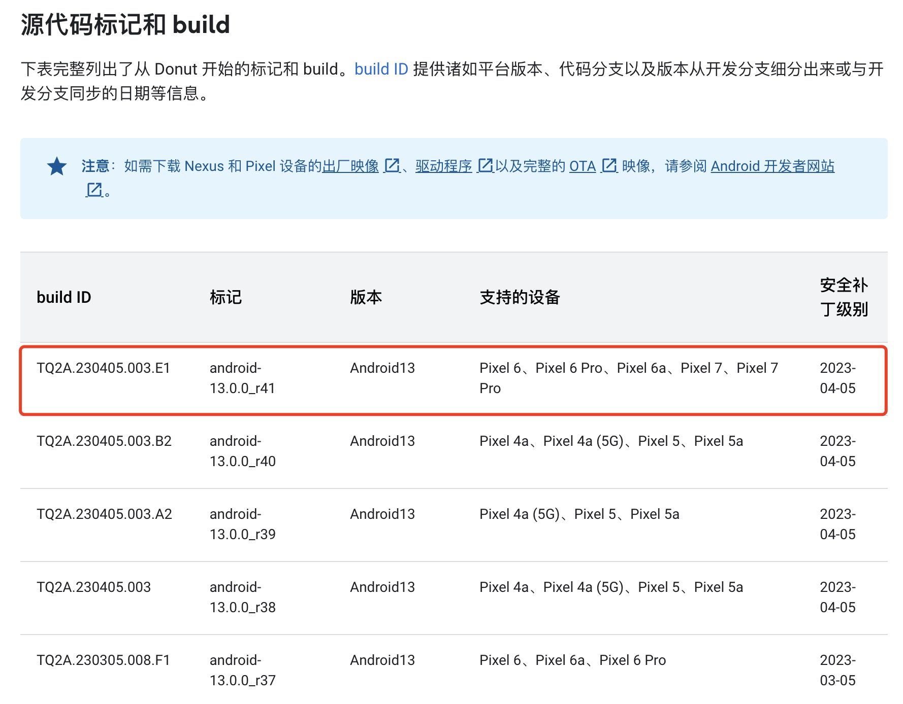

# 20230805-如何下载和编译 Android 源码？

网上关于如何下载 Android 源码和编译的文章很多，其中最常见的就是 Android 官方文档：

> [下载源代码](https://source.android.google.cn/docs/setup/download/downloading?hl=zh-cn)
>
> - https://source.android.google.cn/docs/setup/download/downloading?hl=zh-cn

即使有官方文档，但因为访问这些文档需要科学上网的原因，很多人并没有阅读过，所以不断有朋友在我的 OTA 讨论群和 OTA 的 VIP 答疑群里问如何下载和编译 Android 源码？如何制作升级包？


> 以前访问 Android 官网是需要科学上网的：
>
> - https://source.android.com
>
> 现在 Android 搭建了一个不需要模仿也能访问的墙内地址：
>
> - https://source.android.google.cn

到底该如何下载和编译 Android 源码？如何制作和使用升级包？本篇做一个汇总说明。

> 更多 Android 系统以及 Android OTA 升级文章，请前往博客[洛奇看世界(https://blog.csdn.net/guyongqiangx)](https://blog.csdn.net/guyongqiangx)


## 0. 如何获取 Android 源码?

### 1. Android 源码的获取

关于 Android 源码的获取，大概有以下两种情况：

1. 有具体项目

   项目方案的芯片厂家基于具体项目，和下游厂家签署 NDA 协议，提供 Android 和具体芯片相关 SDK 源码，下游厂家基于这些源码进行编译和项目开发

   > 什么是 NDA 协议？
   >
   > NDA 协议即保密协议（Non Disclosure Agreement)。
   >
   > 基于 NDA 协议，芯片厂家(Vendor)向下游厂家(OEM)提供各种源码和技术文档，但下游厂家不得随意公开和分发这些源码和文档。

2. 没有项目

   由于没有项目，所以自然无法拿到拿到芯片厂家提供的源码。此时，只能基于 Android 官方开放的源码学习，这就是我们经常说的 AOSP (Android Open Source Project) 源码。

   此时学习研究 AOSP 又有两种情况：

   - 基于 Android 模拟器，如 goldfish 和 cattlefish
   - 基于 Google 官方公开的 Android 设备，如各种 Nexus 和 Pixel 手机

### 2. Android 模拟器和 Google 公开设备

Android 模拟器和 Google 的 Android设备各有不同的应用场景。

- Android 模拟器

  适合没有开发板的环境，模拟一些设备进行仿真操作，但基于模拟器编译出的可能并不是一个完整的 Android 系统。

- Google 的公开的 Android设备

  Android 在发布版本时，同时会列举支持的设备清单，并提供这些设备的芯片厂家预编译驱动镜像。使用芯片厂家的驱动，配合 Android 开放的 AOSP 源码就可以编译出在这些设备上可以运行的 Android 系统。


### 3. 哪里下载源码？

关于 Android 开放的源码，通常从 Android 官方网站下载，从官方网站的下载请参考官方说明文档: [下载源代码](https://source.android.google.cn/docs/setup/download/downloading?hl=zh-cn)

一般操作如下:

```bash
# 下载 repo 工具
$ curl https://storage.googleapis.com/git-repo-downloads/repo > ~/bin/repo

# 更新 repo 权限
$ chmod a+x ~/bin/repo

# 初始化 Android 代码库
$ repo init -u https://android.googlesource.com/platform/manifest -b android-13.0.0_r7

# 同步代码
$ repo sync
```


但如果无法直接访问 Android 官方源码，则可以考虑 AOSP 的清华源, 从清华源同步源码的操作请参考清华源 AOSP 项目帮助页面(https://mirrors.tuna.tsinghua.edu.cn/help/AOSP)。


本文重点展示如何基于 Google 公开的 Android 设备下载和编译源码，并基于编译的结果制作 OTA 升级包。

关于如何搭建 Android 源码下载和编译的环境，请参考网上的其他文章。


## 1. 原生设备和升级设备

关于 Android 设备还有一个知识点，原生设备(launched device)和升级设备(upgrade device)。

这里以虚拟 A/B 分区的原生设备为例，从 Android 11(R) 开始支持虚拟 A/B 分区，出厂时就搭载虚拟 A/B 分区，该设备具有 Android 11(R) 的所有特性，因此是 Android 11(R) 的原生设备。

如果某个设备出厂时搭载的系统是 Android 10(Q)，支持动态分区。然后通过 OTA 升级到 Android 11(R)，此时该设备运行系统 Android 11(R)，但不一定支持 Android 11 开始的虚拟 A/B 分区，此时该设备属于 Android 11(R) 的升级设备。


从这里可以看到，原生设备和升级设备是一个相对的概念。

某个设备出厂时搭载 Android 10(Q)，是 Android 10(Q) 的原生设备。然后通过 OTA 升级到 Android 11(R)，此时变成了 Android 11(R) 的升级设备。

一般来说，原生设备最大程度上支持出厂时 Android 版本(例如 Android Q)尽可能多的特性。按照 GMS 的要求，这个设备至少需要支持 3 个字母版本，包括 Android Q/R/S，因此该设备升级到 Android 11(R) 以后就是 Android 11(R) 的升级设备，但升级到 Android 11(R) 后未必支持所有的 Android 11(R) 特性。

## 2. 下载和编译 Android 的简洁步骤

总体来说，基于 Google 的公开的 Android设备下载和编译 Android 源码需要以下几个步骤：

1. 确定要下载的 Android 代码版本；

   基于 Android 官方文档[《代号、标记和 build 号》](https://source.android.google.cn/docs/setup/about/build-numbers?hl=zh-cn)确定你想要下载的 Android 源码版本，和该版本支持的设备

   

2. 下载 Android 源码；

   基于步骤 1 确定的版本，使用 repo 下载 AOSP 源码

   

3. 下载 Android 设备对应的预编译驱动文件；

   基于步骤 1 确定的设备，从[《Nexus 和 Pixel 设备的驱动程序二进制文件》](https://developers.google.cn/android/drivers?hl=zh-cn)页面下载设备相应的预编译的驱动文件

   

4. 安装预编译的驱动文件；

   在 AOSP 源码的目录下，安装步骤 3 下载的预编译驱动文件

   

5. 编译源码；

   基于步骤 1 确定的设备，参考[《选择设备 build》](https://source.android.google.cn/docs/setup/build/running?hl=zh-cn#selecting-device-build)选择相应的设备选项进行编译获得完整的 Android 系统镜像。

   > 关于 Android 设备代号，参考文章:[《谷歌官方 Android 设备和代号对照表》](https://blog.csdn.net/guyongqiangx/article/details/123971895)


​         如果需要制作升级包，则需要编译 dist 发布版本。


6. 制作全量升级包

   如果只有一个版本的 dist 编译输出，则可以基于 dist 输出使用工具制作全量升级包


7. 制作差分升级包

   制作差分升级包需要有两个 dist 版本的输出。

   所以在第 5 步编译 dist 发布版本(旧版本)以后，根据需要修改代码，再次编译新的 dist 发布版本(新版本)。

   然后使用差分工具，以旧版本为基线，新版本为目标制作差分升级包。

   

## 3. 下载编译 Android 的手把手详细步骤

仔细观察页面[《代号、标记和 build 号》](https://source.android.google.cn/docs/setup/about/build-numbers?hl=zh-cn)，在这个页面上，我们看到最新的 Android 13 版本标记是 andorid-13.0.0_r41。




> 与 Android 的官方页面相比，墙内页面相对滞后，在当前(2023/08/05)，官方页面上最新版本是 android-13.0.0_r66 (安全补丁 2023-07-05)，墙内页面是 android-13.0.0_r41 (安全补丁 2023-04-05)
>
> - 官方页面: https://source.android.com/docs/setup/about/build-numbers
> - 墙内页面: https://source.android.google.cn/docs/setup/about/build-numbers?hl=zh-cn


这里以 Android 13(T) 的升级设备 Pixel 6 Pro 为例演示如何下载和编译代码。


### 1. 确定代码版本 

基于 Android 官方文档[《代号、标记和 build 号》](https://source.android.google.cn/docs/setup/about/build-numbers?hl=zh-cn)，这里确定本文示例下载 Android 源码版本为 13.0.0_r7，该版本支持升级设备 Pixel 6 Pro，版本标签(build ID)为 TP1A.221005.002。


选择版本 13.0.0_r7 和设备 Pixel 6 Pro，完全根据你的具体需求，也可以根据自己的情况选择相应的版本和设备。

比方说研究 OTA 虚拟 A/B 分区升级特性，那至少要选择 Android 11(R) 以后的原生设备。如果要研究 OTA 升级的最新特性，那就建议选择 Android 最新版本的原生设备。

既然如此，你肯定会问你为什么没有选择 Android 页面上显示的最新版本 13.0.0_r41，而是 13.0.0_r7，这只不过是因为我手上刚好有去年底同步的版本 13.0.0_r7 而已，你完全可以同步最新的 Android 源码。


> 前面提到 13.0.0_r7，"该版本支持设备 Pixel 6 Pro" 的另外一个意思是可以在 Android 驱动页面下载到该设备基于此版本的驱动文件。


> **为什么 Android 13 原生设备是 Pixel 7，而 Pixel 6 或 Pixel 6 Pro?是升级设备？**
>
> 设备 Pixel 7 最早出现在 android-13.0.0_r9 版本的设备支持列表中，而 Pixel 6 和 Pixel 6 Pro 最早在 Android 12 的 android-12.0.0_r4 支持设备中出现。
>
> 所以 Pixel 7 是 Android 13 的原生设备(launched device)。Pixel 6 和 Pixel 6 Pro 是 Android 12 的原生设备，Android 13 的升级设备(upgrade device)。


### 2. 下载 Android 源码

基于步骤 1 确定的版本，使用 repo 下载 AOSP 源码

```bash
$ mkdir android-13.0.0_r7
$ cd android-13.0.0_r7
$ repo init -u https://android.googlesource.com/platform/manifest -b android-13.0.0_r7
$ repo sync
```


### 3. 下载预编译驱动

基于步骤 1 确定的设备 Pixel 6 Pro 和版本标签 TP1A.221005.002，从[《Nexus 和 Pixel 设备的驱动程序二进制文件》](https://developers.google.cn/android/drivers?hl=zh-cn)页面查找设备相应的驱动。


> 注意：
>
> 在驱动下载页面上有很多设备都有针对标签 TP1A.221005.002 的驱动，务必选择 Pixel 6 Pro 对应的标签。


可以直接点击链接下载驱动文件，或者复制链接地址通过 wget 工具下载:

```bash
$ mkdir driver
$ cd driver
$ wget https://dl.google.com/dl/android/aosp/google_devices-raven-tp1a.221005.002-a88f334b.tgz
```

下载得到文件: google_devices-raven-tp1a.221005.002-a88f334b.tgz


### 4. 安装预编译的驱动文件

在 AOSP 源码的目录下，安装步骤 3 下载的预编译驱动文件

```bash
$ cd driver
$ ls -lh
total 629M
-rwxr-xr-x 1 rocky rocky 316M Sep 27  2022 extract-google_devices-raven.sh
-rw-r--r-- 1 rocky rocky 314M Aug  5 16:36 google_devices-raven-tp1a.221005.002-a88f334b.tgz
$ cd ../android-13.0.0_r7
$ bash ../driver/extract-google_devices-raven.sh

The license for this software will now be displayed.
You must agree to this license before using this software.

Press Enter to view the license
```

这里提示按 "Enter" 键查看 license 协议信息，一系列的空格后，根据提示输入 "I ACCEPT" 同意协议内容以后，脚本将预编译的驱动和镜像提取并保存到 vendor/google_devices/raven 目录下:


### 5. 编译源码

基于步骤 1 确定的设备 Pixel 6 Pro，参考[《选择设备 build》](https://source.android.google.cn/docs/setup/build/running?hl=zh-cn#selecting-device-build)选择相应的设备选项进行编译获得完整的 Android 系统镜像。

> 关于 Android 设备代号，参考文章:[《谷歌官方 Android 设备和代号对照表》](https://blog.csdn.net/guyongqiangx/article/details/123971895)

从我们提取的驱动文件来看， Pixel 6 Pro 对应的设备代号为 raven，所以我们选择 raven 进行编译。


#### 1. 编译非发布版本

如果不需要发布版本，使用以下的方式普通编译即可:

```bash
$ source build/envsetup.sh 
$ lunch aosp_raven-userdebug
$ make -j128
```

因为我编译的服务器上有两个 CPU 一共 128 核，所以这里使用了选项 `-j128` 指定使用 128 线程进行并行编译。


在执行过 lunch 后忘记了当前的设置，可以通过 printconfig 查看当前的编译设置:

```bash
android-13.0.0_r7$ printconfig
============================================
PLATFORM_VERSION_CODENAME=REL
PLATFORM_VERSION=13
TARGET_PRODUCT=aosp_raven
TARGET_BUILD_VARIANT=userdebug
TARGET_BUILD_TYPE=release
TARGET_ARCH=arm64
TARGET_ARCH_VARIANT=armv8-2a
TARGET_CPU_VARIANT=cortex-a55
TARGET_2ND_ARCH=arm
TARGET_2ND_ARCH_VARIANT=armv8-a
TARGET_2ND_CPU_VARIANT=generic
HOST_ARCH=x86_64
HOST_2ND_ARCH=x86
HOST_OS=linux
HOST_OS_EXTRA=Linux-5.4.0-54-generic-x86_64-Ubuntu-20.04.4-LTS
HOST_CROSS_OS=windows
HOST_CROSS_ARCH=x86
HOST_CROSS_2ND_ARCH=x86_64
HOST_BUILD_TYPE=release
BUILD_ID=TP1A.221005.002
OUT_DIR=out
PRODUCT_SOONG_NAMESPACES=vendor/google_devices/raven/proprietary ... device/google/raviole/powerstats/raven device/google/raviole vendor/google_devices/raviole/prebuilts
============================================
```


#### 2. 编译发布版本

如果需要发布版本，则需要先生成 dist 的发布版本，然后再基于发布版本制作全量升级包：

```bash
$ source build/envsetup.sh 
$ lunch aosp_raven-userdebug

$ mkdir dist_output
$ make dist DIST_DIR=dist_output -j128
```

这里的 dist 是 distribution 的意思，新建了 dist_output 目录，把发布的版本生成到这个目录中。

所以默认会在 dist_output 中生成用各种发布的 img 和 zip 的文件:

```bash
android-13.0.0_r7$ ls -lh dist_output/*.{img,zip}
-rw-r--r-- 1 rocky rocky  34M Aug  5 16:54 dist_output/aosp_raven-apps-eng.rocky.zip
-rw-r--r-- 1 rocky rocky 1.1G Aug  5 16:54 dist_output/aosp_raven-img-eng.rocky.zip
-rw-r--r-- 1 rocky rocky 866M Aug  5 16:54 dist_output/aosp_raven-ota-eng.rocky.zip
-rw-r--r-- 1 rocky rocky 431M Aug  5 16:54 dist_output/aosp_raven-proguard-dict-eng.rocky.zip
-rw-r--r-- 1 rocky rocky  12M Aug  5 16:54 dist_output/aosp_raven-proguard-usage-eng.rocky.zip
-rw-r--r-- 1 rocky rocky 1.9G Aug  5 16:54 dist_output/aosp_raven-symbols-eng.rocky.zip
-rw-r--r-- 1 rocky rocky 2.0G Aug  5 16:54 dist_output/aosp_raven-target_files-eng.rocky.zip
-rw-r--r-- 1 rocky rocky 310K Aug  5 16:54 dist_output/appcompat.zip
-rw-r--r-- 1 rocky rocky  12M Aug  5 16:54 dist_output/bootloader.img
-rw-r--r-- 1 rocky rocky  55M Aug  5 16:54 dist_output/boot.zip
-rw-r--r-- 1 rocky rocky 164K Aug  5 16:54 dist_output/dexpreopt_config.zip
-rw-r--r-- 1 rocky rocky 161M Aug  5 16:54 dist_output/dexpreopt_tools.zip
-rw-r--r-- 1 rocky rocky   22 Aug  5 16:54 dist_output/gcov-report-files-all.zip
-rw-r--r-- 1 rocky rocky 180K Aug  5 16:54 dist_output/hidl-lint.zip
-rw-r--r-- 1 rocky rocky 299M Aug  5 16:54 dist_output/otatools.zip
-rw-r--r-- 1 rocky rocky  81M Aug  5 16:54 dist_output/radio.img
-rw-r--r-- 1 rocky rocky 2.2M Aug  5 16:54 dist_output/ramdisk.img
-rw-r--r-- 1 rocky rocky 5.0K Aug  5 16:54 dist_output/super_empty.img
-rw-r--r-- 1 rocky rocky 2.1G Aug  5 16:54 dist_output/super.img
-rw-r--r-- 1 rocky rocky 358K Aug  5 16:54 dist_output/test_mappings.zip
-rw-r--r-- 1 rocky rocky  29M Aug  5 16:54 dist_output/vendor_boot-debug.img
-rw-r--r-- 1 rocky rocky  29M Aug  5 16:54 dist_output/vendor_boot-test-harness.img
-rw-r--r-- 1 rocky rocky  22M Aug  5 16:54 dist_output/vendor_ramdisk-debug.img
-rw-r--r-- 1 rocky rocky  22M Aug  5 16:54 dist_output/vendor_ramdisk.img
-rw-r--r-- 1 rocky rocky  22M Aug  5 16:54 dist_output/vendor_ramdisk-test-harness.img
```

其中最重要的是用于制作升级包的 target file 文件:

`dist_output/aosp_raven-target_files-eng.rocky.zip`


### 6. 制作升级包

#### 1. 制作增量升级包

如果需要基于上面第 5.2 步编译发布的版本制作升级包，使用下面的命令：

```bash
$ ota_from_target_files dist_output/aosp_raven-target_files-eng.rocky.zip full_update.zip
```

生成全量的升级包 full_update.zip

> 由于只有一个版本，所以只能制作全量升级包。


#### 2. 制作增量升级包

增量升级需要两个发布版本，所以在第5.2 步的发布版本代码基础上，修改代码再编译发布新的版本。

有了新旧两个版本，就可以以旧版本为基线，新版本为目标制作增量升级包了。


这里为了演示如何制作差分包，直接把代码重新发布一次，然后基于步骤 2 中的发布版本做差分。

```bash
$ mkdir dist_output_new
$ make dist DIST_DIR=dist_output_new -j128

$ ota_from_target_files -i dist_output/aosp_raven-target_files-eng.rocky.zip dist_output_new/aosp_raven-target_files-eng.rocky.zip incremental_update.zip
```

这里的工具 `ota_from_target_files` 制作增量包的语法是:

```bash
$ ota_from_target_files -i old-target_files.zip new-target_files.zip update.zip
```

以旧发布版本的 target 包 `old-target_files.zip` 为基线，新发布版本的 target 包 `new-target_files.zip` 为目标，制作得到增量升级包 `update.zip`


### 7. 使用升级包升级

关于如何使用升级包进行升级，以及 Android 升级的细节，请参考博客[洛奇看世界(https://blog.csdn.net/guyongqiangx)](https://blog.csdn.net/guyongqiangx) 上 Android OTA 升级专栏文章。


