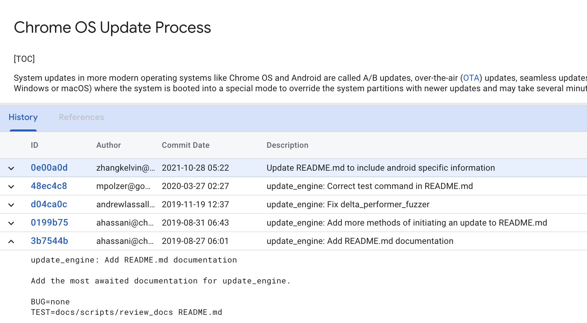
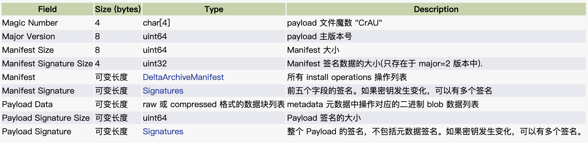

# 20230817-Android Update Engine 分析（二十一）Android A/B 的更新过程

## 0. 背景

早期 Android A/B 系统升级在 Android 7.1 版本推出时，参考文档十分有限，也就是 Android 官方大概有两三个页面介绍文档。

我的第一篇 A/B 系统分析文章[《Android A/B System OTA分析（一）概览》](https://blog.csdn.net/guyongqiangx/article/details/71334889)从总体上介绍了什么是 A/B 系统，A/B 系统如何进行升级切换，应该是不少人 A/B 系统升级的入门读物。

> [《Android A/B System OTA分析（一）概览》](https://blog.csdn.net/guyongqiangx/article/details/71334889)
>
> 链接: https://blog.csdn.net/guyongqiangx/article/details/71334889

从那之后，我陆续写过几十篇 Android A/B 系统升级的文章(到现在也还有很多话题没有写)，但每一篇都只分析了很小的一部分，要不就是分析功能代码，要不就是分析处理流程，要不就是演示工具使用。似乎从来没有一篇从总体角度上，全面又很详细介绍 Android A/B 系统升级。

我也一直希望像我的另外一篇文章 [《一篇了解TrustZone》](https://guyongqiangx.blog.csdn.net/article/details/78020257) 那样，写一篇关于 Android 系统升级的，不过限于精力和能力，一直没有完成。

幸运的是，Android 官方对系统升级这一块越来越重视，A/B 系统相关文章越来越多。从 2019 年的某个时候开始，update engine 目录下添加了 README.md 文档，专门用于描述 A/B 系统升级。



---

这个文档后来几经更新，目前已经比较全面。

不少朋友(其实是说我自己)的习惯是喜欢在网上找文档，往往忽略了代码自带的文档。所以我这里把 Android A/B 系统自带的 README.md 文档翻译成中文，再加上我的一些注释，用于全面介绍 Android A/B 系统升级。

原文档的标题为 《Chrome OS Update Process》，直译过来应该是 "Chrome 系统更新过程"，这里为了贴近我们的主题，将其改为《Android A/B 更新过程》


关于这里提到的 README.md 文档，如下:

> README.md 文档:
>
> - `system/update_engine/README.md `
>
> Android 官方源码:
>
> - https://cs.android.com/android/platform/superproject/+/main:system/update_engine/README.md
>
> 没有源码或无法访问 Android 官方的，可以访问以下链接查看:
>
> - http://aospxref.com/android-13.0.0_r3/xref/system/update_engine/

更多关于 Android A/B 系统的文章，欢迎访问我的 CSDN 博客，洛奇看世界。


本文是对于 Android 7.1 以后引入的带有 A/B 更新特性的综合描述，适用于所有 Android 7.1 ~ Android 14 的所有版本。

> 核心代码[《Android Update Engine 分析》](https://blog.csdn.net/guyongqiangx/category_12140296.html)系列，文章列表：
>
> - [Android Update Engine分析（一）Makefile](https://blog.csdn.net/guyongqiangx/article/details/77650362)
>
> - [Android Update Engine分析（二）Protobuf和AIDL文件](https://blog.csdn.net/guyongqiangx/article/details/80819901)
>
> - [Android Update Engine分析（三）客户端进程](https://blog.csdn.net/guyongqiangx/article/details/80820399)
>
> - [Android Update Engine分析（四）服务端进程](https://blog.csdn.net/guyongqiangx/article/details/82116213)
>
> - [Android Update Engine分析（五）服务端核心之Action机制](https://blog.csdn.net/guyongqiangx/article/details/82226079)
>
> - [Android Update Engine分析（六）服务端核心之Action详解](https://blog.csdn.net/guyongqiangx/article/details/82390015)
>
> - [Android Update Engine分析（七） DownloadAction之FileWriter](https://blog.csdn.net/guyongqiangx/article/details/82805813)
>
> - [Android Update Engine分析（八）升级包制作脚本分析](https://blog.csdn.net/guyongqiangx/article/details/82871409)
>
> - [Android Update Engine分析（九） delta_generator 工具的 6 种操作](https://blog.csdn.net/guyongqiangx/article/details/122351084)
>
> - [Android Update Engine分析（十） 生成 payload 和 metadata 的哈希](https://blog.csdn.net/guyongqiangx/article/details/122393172)
>
> - [Android Update Engine分析（十一） 更新 payload 签名](https://blog.csdn.net/guyongqiangx/article/details/122597314)
>
> - [Android Update Engine分析（十二） 验证 payload 签名](https://blog.csdn.net/guyongqiangx/article/details/122634221)
>
> - [Android Update Engine分析（十三） 提取 payload 的 property 数据](https://blog.csdn.net/guyongqiangx/article/details/122646107)
>
> - [Android Update Engine分析（十四） 生成 payload 数据](https://blog.csdn.net/guyongqiangx/article/details/122753185)
>
> - [Android Update Engine分析（十五） FullUpdateGenerator 策略](https://blog.csdn.net/guyongqiangx/article/details/122767273)
>
> - [Android Update Engine分析（十六） ABGenerator 策略](https://blog.csdn.net/guyongqiangx/article/details/122886150)
>
> - [Android Update Engine分析（十七）10 类 InstallOperation 数据的生成和应用](https://blog.csdn.net/guyongqiangx/article/details/122942628)
>
> - [Android Update Engine分析（十八）差分数据到底是如何更新的？](https://blog.csdn.net/guyongqiangx/article/details/129464805)
>
> - [Android Update Engine分析（十九）Extent 到底是个什么鬼？](https://blog.csdn.net/guyongqiangx/article/details/132389438)
>
> - [Android Update Engine分析（二十）为什么差分包比全量包小，但升级时间却更长？](https://blog.csdn.net/guyongqiangx/article/details/132343017)
>
> - [Android Update Engine分析（二十一）Android A/B 的更新过程]()

> 如果您已经订阅了本专栏，请务必加我微信，拉你进“动态分区 & 虚拟分区专栏 VIP 答疑群”。


## 1. Chrome OS 的更新过程

> 注: 之所以提到 Chrome OS，是因为 Android A/B 系统最初是在 Chrome OS 上开发使用的，后来引入到 Android 中，并逐渐以 Android 为重心。到目前为止， Update Engine 在 Chrome OS 和 Android 上共用同一个源码库。

在现今的操作系统(如 Chrome OS 和 Android )中， 系统更新被称为 A/B 更新、无线(OTA)更新、无缝(seamless)更新或简单的自动更新。Windows 和 macOS 这些系统的更新方式比较原始(Android A/B 更新之前的系统也是如此)，系统更新时需要启动到特殊模式来重写系统分区，并且需要花费几分钟到几小时来完成更新。相比之下，A/B 更新有几个优点， 包括但不限于:

- 在更新时和更新后，系统保留了一套可正常工作的系统。因此，减少了设备变砖的可能性。也减少了维修和质保时需要手动刷新设备的需求。

- 更新可以在系统运行时进行(通常开销很小)， 不会中断用户。唯一的缺点是用户需要重新启动(在 Chrome OS中如果执行了需要重新启动的更新，注销登录时会自动重启，重新启动大约需要10秒， 与正常重新启动无异)。

- 用户不需要(尽管可以)请求更新。后台会定期检查更新。  

- 如果更新失败，用户不受影响。用户将继续使用旧版本系统，系统将在以后的某个时间再次尝试更新。

- 如果更新正确应用但无法启动，系统将回滚到旧分区，用户仍然可以像往常一样使用系统。

- 用户不需要为更新预留足够的空间。系统已经为两个分区副本(A 和 B)预留了足够的空间。系统甚至不需要任何磁盘缓存(通常是 cache 分区)，一切无缝无感地从网络传输到内存，再更新到非活动分区。

  > 注: Android 在 A/B 更新之前的系统(Recovery)，需要下载升级文件到 cache 分区，并重启到 Recovery 模式完成升级。

### 1.1 A/B 更新的生命周期

在支持 A/B 更新的系统中，每个分区(如 kernel 或 root)都有两个副本。我们将这两个副本称为活动(A)分区和非活动(B)分区。系统启动到活动分区(根据哪个副本在启动时具有更高优先级)，当有新的更新可用时，它将被写入非活动分区。更新成功重启后，之前的非活动分区变成活动分区，旧的活动分区变成非活动分区。

> 注: 简单来说就是系统有 A/B 两套分区，当前使用的那套分区称为活动分区(A)，另外一套为非活动分区(B)。升级时更新非活动分区(B)，重启后系统从分区 B 启动，此时活动分区(B)和非活动分区(A)发生转换。


总体上说，一次完整 A/B 更新的生命周期分为**生成(Generation)**，**分发/配置(Distribution/Configuration)**，**安装(Installation)几个阶段**。

而**安装(Installation)**实际上又可以分为**下载安装(Download & Install)**，**哈希校验(Hash Verification & Verity Computation)**，**后安装(Postinstall)** 和**最后调整(Finishing Touchese)** 这几个子阶段。

> 注: 我自己其实不太习惯这里提到的各阶段描述的术语。
>
> 任何系统的更新，核心就是升级数据。所有的操作都围绕升级数据展开，一般涉及的阶段包括：
>
> 1. 制作升级包：服务端使用系统镜像制作升级包数据
> 2. 传输升级包：服务端制作的升级包数据通过各种方式传输到客户端
> 3. 使用升级包：客户端使用接收到的升级包数据进行升级


#### 1.1.1 生成(Generation)

升级流程始于为每个新系统镜像在(谷歌)服务器上生成 OTA 软件包。这是通过调用工具脚本 `ota_from_target_files`，使用源构建(source build)和目标构建(destination build)作为参数。此脚本需要target_file.zip 才能工作，普通的系统镜像(.img)文件是不够的。

> 注: 在 Android 上编译时，使用 "`make dist`" 命令会生成相应的 target_file.zip 文件和各个分区镜像。


#### 1.1.2 分发/配置(Distribution/Configuration)

生成OTA包后，使用特定密钥对其进行签名并存储在更新服务器(GOTA)已知的位置。然后，GOTA将通过公共 URL 使该 OTA 更新可用。可选地，运营商可以选择仅针对特定子集的设备提供此 OTA 更新。

> 注: OTA 包制作好以后，使用特定的秘钥签名，并上传到升级服务器上，通过公开的 URL 访问。如果系统带有 GMS 服务，就需要上传到 GOTA  服务器上。国内一般各厂家都有自己的升级服务器，不使用谷歌的 GOTA 服务器。


#### 1.1.3 安装(Installation)

当设备上的升级应用发起升级后(周期性地或用户启动)，它首先会查询不同的设备策略以查看是否允许更新检查。例如，设备策略可以在一天中的某些时间防止更新检查，或者要求随机分散更新检查时间等。

一旦策略允许更新检查，升级应用就会向更新服务器发送请求(所有此通信都是通过HTTPS进行的)，并标识其参数，如其应用程序ID、硬件ID、版本、板等。

服务器上的一些策略可能会阻止设备获取特定的 OTA 更新，这些服务器端策略通常由运营商设置。例如，运营商可能希望仅将某个 beta 版本的软件发布给某一类设备子集。

但是，如果更新服务器决定提供更新包，它将以做出响应，提供所有升级需要的参数，如 Payload 文件下载的 URL、元数据签名、Payload 大小和哈希值等。在不同状态变化后，客户端会持续和服务器保持通信，比如报告它开始下载 Payload 或完成更新，或者使用特定错误代码报告更新失败等。

然后，设备将实际安装处理 OTA 更新。这大致分为3个步骤。


##### 1. **下载和安装(Download & Install)**

每个 Payload 由两个主要部分组成：元数据(metadata)和额外数据。元数据包含要执行的操作列表。额外数据包含某些或所有这些操作所需的数据块  blob。升级应用首先下载元数据，并使用更新服务器响应中提供的签名对其进行加密验证。一旦验证元数据有效，则可以轻松通过密码学手段(主要通过 SHA256 哈希)验证 Payload 的其余部分。

接下来，升级应用将非活动分区标记为不可启动(unbootable)(因为它需要将新更新写入其中)。至此，系统无法再回滚到非活动分区。

然后，升级应用按照元数据中出现的顺序执行定义的操作(当这些操作需要其数据时会逐步下载其余的  Payload)。一旦一个操作执行完成，payload 中相应的数据将被丢弃。这消除了在应用之前缓存整个 Payload 的需求。在此过程中，升级应用会定期检查上一个执行的操作，以便在出现故障或系统关闭等情况时，它可以从错过的点继续，而不必从头重新执行所有操作。

在下载期间，升级应用会对计算所下载字节的哈希值，当下载完成时，它会检查 Payload 签名(位于 Payload 末尾)。如果无法验证签名，则拒绝更新。

> 注: 密码学上， 哈希值可以累积计算，所以 payload 下载时可以一边下载，一般计算所下载数据的 hash 值。当所有数据都下载完成后就得到了整个 payload 的哈希值。这个哈希值将用来校验整个升级数据的签名。 


##### 2. **哈希验证和校验计算(Hash Verification & Verity Computation)**

在非活动分区更新后，升级应用将为每个分区计算前向错误校正码(也称为FEC码、校验)，并将计算的校验数据写入非活动分区。在某些更新中，校验数据包含在额外数据中，所以此步骤将被跳过。 

然后，重新读取整个分区、计算哈希并与元数据中传递的分区哈希值进行比较，以确保更新已成功写入分区。此步骤中计算的哈希值包括上一步中写入的 FEC 校验码。


##### 3. **后安装步骤(Postintall)**

> 注: 我其实不知道该如何翻译 Postinstall 这个词，意思就是在 install 之后还要执行一些操作。参考各种后 xx 时代的叫法，这里暂且叫做后安装吧或者保持原样叫 postinstall。

在下一步中，如果有的话，调用 Postinstall 脚本。从 OTA 的角度来看，这些 Postinstall 脚本就是黑盒。通常Postinstall 脚本将优化存在的应用程序和运行文件系统垃圾回收，以便设备可以在 OTA 后快速启动。但这些是由其他团队管理的。


##### 4. **最后调整(Finishing Touches)**

然后，升级应用进入一种状态，指示更新已完成，用户需要重新启动系统。在这一点上，在用户重新启动(或注销)之前，升级应用不会执行任何更多的系统更新，哪怕又存在新的更新。但是，它确实会继续执行定期的更新检查，以便我们获得现实环境中活跃设备的统计数据。

在更新操作成功之后，非活动分区被标记为具有更高的优先级(在启动时，具有更高优先级的分区会先启动)。一旦用户重新启动系统，它将启动更新后的分区，并将其标记为活动分区。在重新启动后，update_verifier 程序会运行，读取所有 dm-verity 设备以确保分区没有损坏，然后标记更新为成功(successful)。

此时 A/B 更新就被认为已完成。虚拟 A/B 更新在这之后还有一个称为“合并”(merging)的步骤。合并通常需要几分钟，之后虚拟 A/B 更新才被认为完成了。


### 1.2 更新引擎守护进程(update engine daemon)

A/B 更新的核心叫做 Update Engine，程序上对应于一个叫做 `update_engine` 的单线程守护进程，始终运行。这个进程是自动更新的核心。它在后台以较低优先级运行，是系统启动后最后启动的进程之一。不同的客户端(如GMS Core 或其他服务)可以向 Update Engine 发送更新检查请求。关于如何将请求传递给更新引擎的详情因系统而异，但在Chrome OS 中是 D-Bus。查看 D-Bus 接口以获取所有可用方法的列表。在 Android 上是 binder。

更新引擎中嵌入了许多弹性功能，使自动更新强大，包括但不限于:

- 如果 update engine 崩溃，它将自动重启。

- 在活动更新期间，它会定期检查更新状态，如果无法继续更新或在中间崩溃，它将从最后一个检查点继续。

- 它会重试失败的网络通信。

- 如果由于活动分区上的位变化导致增量 Payload 应用失败几次，它会切换到完整 Payload。

升级应用会将其活动设置和数据写入 `/data/misc/update_engine/prefs`。这些数据有助于跟踪升级应用生命周期中的更改，并允许在失败尝试或崩溃后正确继续更新过程。


#### 1.2.1 交互式 vs 非交互式 vs 强制更新

非交互式更新由 update engine 在后台定期计划执行。

交互式更新发生在用户明确请求更新检查时(例如，通过点击 Chrome OS “关于” 页面上的 “检查更新” 按钮)。


根据更新服务器的策略，交互式更新比非交互式更新具有更高的优先级(通过携带标记提示)。当服务器负载繁忙时等，它们可以决定不提供更新。这两种类型的更新之间也存在其他内部差异。例如，交互式更新试图更快地安装更新。

> 注: 非交互式更新在后台静默执行，无感，所以优先级较低。
>
> 交互式更新通常发生在用户升级界面上，在前台执行，用户在界面操作更新时，自然希望尽快完成，拥有较高优先级。

强制更新类似于交互式更新(由某种用户操作启动)，但它们也可以配置为像非交互式一样运行。由于非交互式更新定期发生，强制非交互式更新会在请求时立即触发非交互式更新，而不是在稍后时间。我们可以使用以下命令调用强制非交互式更新:

```update_engine_client --interactive=false --check_for_update```


#### 1.2.2 网络

根据设备连接的网络，升级应用可以通过以太网、WiFi或蜂窝网络下载Payload。通过蜂窝网络下载可能会消耗大量数据流量，所以会需要用户许可。

#### 1.2.3 日志

在Chrome OS中，`update_engine` 日志位于`/var/log/update_engine` 目录中。每当 `update_engine` 启动时，它都会使用当前日期时间格式启动一个新的日志文件，日志文件名中包含日期时间(`update_engine.log-DATE-TIME`)。在更新引擎重新启动或系统重新启动几次后，`/var/log/update_engine` 中会出现许多日志文件。最新的活动日志通过符号链接到 `/var/log/update_engine.log`  文件。

在Android中，`update_engine` 日志位于 `/data/misc/update_engine_log` 中。

### 1.3 更新 Payload 的生成

更新 Payload 生成是将一组分区/文件转换为既能被升级应用(特别是较旧版本)理解，也能安全验证的格式的过程。这个过程涉及将输入分区分解成较小的模块并压缩以帮助节省下载 Payload 时的网络带宽。

`delta_generator` 是一个具有许多选项的工具，用于生成不同类型的更新 Payload。其代码位于 `update_engine/payload_generator` 目录中。这个目录包含生成更新 Payload 的所有相关源代码。这个目录中的文件不应包含或用于 `delta_generator` 之外的任何其他库/可执行文件中，这意味着这个目录没有编译到 updage engine 的其他工具中。

但是，不推荐直接使用 `delta_generator`，因为它有太多的标志。应该使用像 `ota_from_target_files` 或 `OTA Generator` 这样的包装器。

> 注: 关于 `delta_generator`, 相关内容非常多，具体细节可参考我的多篇博客:
>
> - [Android Update Engine 分析（九） delta_generator 工具的 6 种操作](https://blog.csdn.net/guyongqiangx/article/details/122351084)
> - [Android Update Engine 分析（十） 生成 payload 和 metadata 的哈希](https://blog.csdn.net/guyongqiangx/article/details/122393172)
> - [Android Update Engine 分析（十一） 更新 payload 签名](https://blog.csdn.net/guyongqiangx/article/details/122597314)
> - [Android Update Engine 分析（十二） 验证 payload 签名](https://blog.csdn.net/guyongqiangx/article/details/122634221)
> - [Android Update Engine 分析（十三） 提取 payload 的 property 数据](https://blog.csdn.net/guyongqiangx/article/details/122646107)
> - [Android Update Engine 分析（十四） 生成 payload 数据](https://blog.csdn.net/guyongqiangx/article/details/122753185)
> - [Android Update Engine 分析（十五） FullUpdateGenerator 策略](https://blog.csdn.net/guyongqiangx/article/details/122767273)
> - [Android Update Engine 分析（十六） ABGenerator 策略](https://blog.csdn.net/guyongqiangx/article/details/122886150)
>
> 
>
> [OTA Generator: https://github.com/google/ota-generator](https://github.com/google/ota-generator), 是当前 update engine 的维护者 Kevin Zhang 开源的一个工具。


#### 1.3.1 Payload 文件规范

每一个 Payload 文件都是一个按照下表格式定义的结构体文件:



#### 1.3.2 增量 vs 全量 Payload

有两种类型的 Payload，全量和增量。

全量 Payload 仅从目标镜像(我们要更新到的镜像)生成，包含更新非活动分区所需的所有数据。因此，全量 Payload 可能非常大。另一方面，增量 Payload 是通过比较源镜像(活动分区)和目标镜像并生成这两者之间的差异而生成的差异更新。它基本上是一个类似于 diff 或 bsdiff 等应用程序的差异更新。因此，使用增量 Payload 更新需要系统读取活动分区的部分内容，以便更新非活动分区(或重构目标分区)。增量 Payload 明显小于完整 Payload。两种类型的 Payload 结构相同。

Payload 生成非常耗费资源，其工具实现了高度的并行化。 

> 注: 关于全量包和增量包大小，在[《Android Update Engine 分析（二十）为什么差分包比全量包小，但升级时间却更长？》](https://blog.csdn.net/guyongqiangx/article/details/132343017) 有详细对比的例子。


##### 1. 生成完整 Payload

全量 Payload 是通过将分区划分为 2MiB(可配置)的块，然后使用 bzip2 或 XZ 算法对其进行压缩，或者根据哪种可以生成更小的数据而保持为原始数据来生成的。与增量 Payload 相比，全量 Payload 要大得多，因此如果网络带宽受限，它们需要更长的下载时间。另一方面，应用全量 Payload 稍快一些，因为系统不需要从源分区读取数据。

> 注：关于全量包生成的细节，请参考[《Android Update Engine 分析（十五） FullUpdateGenerator 策略》](https://blog.csdn.net/guyongqiangx/article/details/122767273)
>
> 具体每一个数据块的生成操作可以参考下图:
>
> 


##### 2. 生成增量 Payload

增量 Payload 是通过在文件和元数据级别(更精确地说，是每个分区上的文件系统级别)查看比较源镜像数据和目标镜像数据来生成的。我们可以生成增量 Payload 的原因是 Chrome OS 分区是只读的(Android 分区类似)。所以我们可以非常确定客户设备上活动分区的每一个 bit 和 image 生成和签名阶段生成的原始分区镜像完全相同。生成增量 Payload 的过程大致如下: 

1. 在目标分区上找到所有全零("0")的数据块，并为它们生成“ZERO”操作。“ZERO”操作基本上会丢弃相关的块(取决于具体实现)。

2. 通过直接逐块比较源分区和目标分区，找到在源和目标分区之间未发生更改的所有块，并生成“SOURCE_COPY”操作。

3. 列出源分区和目标分区中的所有文件(及其相关块)，并删除我们在最后两步中已经生成了操作的块(和文件)。将每个分区的剩余元数据(inode 等)分配为一个文件。

4. 如果文件是新文件，根据哪个可以生成更小的数据块来为其数据块生成“REPLACE”、“REPLACE_XZ”或“REPLACE_BZ”操作。 

5. 对于每个其他文件，比较源块和目标块，并根据哪个可以生成更小的数据块来生成“SOURCE_BSDIFF”或“PUFFDIFF”操作。这两个操作在源数据块和目标数据块之间生成二进制差异。(有关此类二进制差异程序的详细信息，请参阅 bsdiff 和 puffin 程序的细节)

6. 最后根据目标分区的块偏移量对操作进行排序。 

7. 可选地将相邻的相同或类似操作合并为较大的操作，以提高效率和潜在的生成较小的 Payload。

> 注: 关于全量包生成的细节，请参考: [Android Update Engine 分析（十五） FullUpdateGenerator 策略](https://blog.csdn.net/guyongqiangx/article/details/122767273)


全量 Payload 只能包含“REPLACE”、“REPLACE_BZ”和“REPLACE_XZ”操作。增量 Payload 可以包含任何操作。


#### 1.3.3 主版本号(major)和次本号(minor)

主版本号和次版本号分别指定更新 Payload 文件的格式以及升级应用接受某些类型更新 Payload 的能力。这些数字在升级应用中是硬编码的。


**主版本号**就是前面提到的 payload 文件格式中的的第二个字段(Major version)。每个升级应用支持一系列主版本号。目前只有两个主版本号：1 和 2。

Chrome OS 和 Android 目前都在主版本 2 上(主版本 1 已经被弃用, decprecated)。每当有新添加的不能装入 Manifest protobuf 的内容时，我们需要提升主版本号。提升主版本号需要非常谨慎，因为旧客户端不知道如何处理新的版本。在 Chrome OS 中任何主版本号提升都应该与 GoldenEye stepping stone 相关联。

> 注: 这里最后一句的原话是 'Any major version uprev in Chrome OS should be associated with a GoldenEye stepping stone.'，关于 Golden Eye stepping stone，claude 是这么解释的：
>
> .png)


**次版本号**定义了升级应用支持某些操作(operations)或执行某些动作(actions)的能力。每个升级应用支持一系列次版本号。例如，次版本号为 4 (或更低)的升级应用不知道如何处理“PUFFDIFF”操作。所以在为次版本号为 4 (或更低)的镜像生成增量 Payload 时，我们不能为它生成 PUFFDIFF 操作。Payload 生成过程会查看源镜像的次版本号以决定它支持的操作类型，并只生成符合那些限制的 Payload。类似地，如果某个特定次版本号的客户端存在 bug，提升次版本号有助于避免生成会导致该 bug 出现的 Payload。但是，提升次版本号在可维护性方面代价也很高，并且可能容易出错。所以进行次版本号升级时也需要谨慎。  

次版本号在全量 Payload 中无关紧要。全量 Payload 应该总是能够应用于非常旧的客户端。原因是升级应用可能不会发送它们当前的版本，所以如果我们有不同类型的全量 Payload ，我们就不会知道为客户端提供哪个版本。

> 注：次版本号在全量 Payload 中无关紧要，这种说法大概率上是没有问题的。
>
> 升级时，服务端传送 payloade 数据到设备，由当前运行的版本对 payload 文件进行解包并执行全量更新操作。
>
> 到目前为止，全量包中包括的操作有：ZERO, REPLACE, REPLACE_BZ, REPLACE_XZ。这些操作从 Android 7.1.2 到最新的 Android 14 一直保持稳定。但如果在某一个新版本中添加了新的全量包的算法，比如 LZ4 算法压缩的操作 REPLACE_LZ4，那升级时就可能面临和增量包升级一样的操作(operation)支持问题。
>
> 所幸的是目前这种情况还没有发生。


#### 1.3.4 签名 vs 未签名Payload

Payload 可以使用公钥/私钥对进行签名以用于生产环境，或者保持未签名状态以用于测试。像 `delta_generator` 这样的工具可以帮助生成元数据和 Payload 哈希或者使用给定的私钥对 Payload 进行签名。


**对于生产环境，必须使用签名的Payload以确保安全性。未签名的Payload只应在测试环境中使用。**

签名 Payload 需要额外的签名数据和验证过程，会增加 Payload 的大小。但这是确保更新过程安全所必需的。

生成签名 Payload 需要私钥。而验证签名需要对应的公钥。Key 管理对于保证更新系统的安全至关重要。

总之，签名 Payload 用于生产以防止恶意修改。未签名 Payload 用于测试以加速开发。两者在使用场景上有明确区分。

> 注：签名使用非对称秘钥，具体上服务端使用非公开的私钥签名，客户端使用公开的公钥进行验证。


### 1.4 update_payload 脚本

`update_payload` 包含一组 python 脚本，主要用于验证 Payload 生成和应用。我们通常使用实际设备(实时测试)来测试 Payload。`brillo_update_payload` 脚本可用于在主机设备上生成和测试应用 payload。这些测试可以看作是没有实际设备的动态测试。其他 `update_payload` 脚本(如 `check_update_payload` )可用于静态检查payload 是否处于正确状态以及其应用是否正常工作。这些脚本实际上是静态应用 payload，而不运行`payload_consumer` 中的代码。

> 注: 这里提到的 update_payload 脚本位于 Android 源码目录 `system/update_engine/scripts/update_payload`
>
> 关于 Android Update Engine 的一些工具使用，请参考我的专栏：[Android OTA 工具](https://blog.csdn.net/guyongqiangx/category_12211864.html)


### 1.5 后安装步骤 (Postinstall)

Postinstall 是在升级应用将新镜像写入非活动分区后调用的处理过程。Postinstall 的主要职责之一是在根分区末尾重新创建 dm-verity 树哈希。除此之外，它还会安装新的固件更新或任何特定的板卡流程。Postinstall 在新安装的分区内的一个单独的 chroot 中运行。所以它与活动运行的系统是完全分离的。在更新之后和设备重启之前需要完成的任何事情都应该在 postinstall 中实现。


### 1.6 编译更新引擎

你可以像编译其他平台应用程序一样编译 `update_engine`:

#### 1.6.1 设置

在编译任何内容之前，请在Android存储库顶部运行这些命令。每个shell只需要执行一次。

```bash
source build/envsetup.sh
lunch aosp_cf_x86_64_only_phone-userdebug(或用自己的目标替换 aosp_cf_x86_64_only_phone-userdebug)
```


#### 1.6.2 编译

```bash
m update_engine update_engine_client delta_generator
```


> 注：更多关于如何编译 Android 的内容，请参考文章 [《如何下载和编译 Android 源码？》](https://blog.csdn.net/guyongqiangx/article/details/132125431)


### 1.7 运行单元测试


运行单元测试类似于其他平台:

- atest update_engine_unittests 

  你需要一个连接到笔记本电脑并通过ADB可访问的设备来执行此操作。Cuttlefish也可以使用。

- atest update_engine_host_unittests 

  在主机上运行一部分测试，不需要设备。

> 注：在 update engine 下有很多文件名以 `*_unittest.cc`结尾的文件，这些都是关于 update engine 某个模块进行单元测试的代码文件，如果你对 update engine 进行了旧改，建议参考这些单元测试文件添加自己的单元测试函数。并在每次改动后运行相关的单元测试进行检查。


### 1.8 启动更新

有几种方法可以启动更新:

- 单击“设置”的“关于”页面上的“检查更新”按钮。无法配置此更新检查方式。

- 使用 [scripts/update_device.py] 程序并传递 OTA zip 文件的路径。


> 注：除了上述两种更新方式外，另外一种常用的方式是使用 Android 自带的 C++ demo 应用程序 `update_engine_client` 进行升级测试。
>
> 更多关于使用 `update_engine_client` 进行升级测试的信息，请参考博客 [《Android A/B System OTA分析（四）系统的启动和升级》](https://blog.csdn.net/guyongqiangx/article/details/72604355)


### 1.9 开发者和维护者须知


更改 `update engine` 源代码时要特别小心这些事项:


#### 1.9.1 不要破坏向后兼容性

在每个发布周期，我们都应该能够生成全量和增量 Payload，并可以正确应用于运行旧版本更新引擎客户端的旧设备。例如，在元数据 proto 文件中移除、不传递参数可能会损坏旧客户端。或者传递旧客户端不理解的操作也会损坏它们。无论何时更改 Payload 生成过程中的任何内容，都要问自己这个问题：它能在旧客户端上工作吗？如果不行，我需要用次要版本或任何其他方式来控制它吗。

特别是关于企业回滚，新的升级应用应该能够接受较旧的更新 Payload。通常这是通过全量 Payload 完成的，但应该注意不要破坏这种兼容性。


#### 1.9.2 考虑未来

在update engine中进行更改时，要考虑5年后的情况:

- 如何实现此更改，以使5年后的旧客户端不会中断?

- 5年后如何维护它?

- 如何进行更改以方便未来的更改而不破坏旧客户端或增加沉重的维护成本?


#### 1.9.3 优先不要在升级应用实现您的功能

如果一个功能可以通过服务端实现，请不要在客户端更新程序中实现它。因为客户端更新程序在某些点上可能脆弱，小错误可能会造成灾难性后果。例如，如果在升级应用中引入一个导致其在检查更新之前崩溃的 bug，并且我们无法及早在发布过程中捕捉到此 bug，那么已经升级到新 bug 系统的生产设备就可能不再接收自动更新了。因此，总是要考虑是否可以通过服务端实现要实现的功能(可能对客户端更新程序进行最小更改)?或者该功能是否可以移至与升级应用接口最小的其他服务中?回答这些问题在未来会有很大回报。

> 注: 这里的服务端和客户端应该对应于 update engine daemon 和 update engine client。而不是我们理解的后端服务器 server 和客户端设备 device 上。


#### 1.9.4 尊重其他代码库

~~当前的 update engine 代码库在许多项目(如 Android )中使用。~~

Android 和 ChromeOS 代码库已正式分支。

我们经常在这两个项目之间同步代码库。请注意不要破坏 Android 或其他共享 update engine 代码的系统。每当提交更改时，务必考虑 Android 是否需要该更改:

- 它将如何影响 Android?

- 是否可以将更改移动到接口，并实现存根实现，以免影响 Android?  

- Chrome OS 或 Android 特定的代码是否可以用宏进行保护?

作为一个基本措施，如果添加/删除/重命名代码，请确保同时更改 build.gn 和 Android.bp。不要将 Chrome OS 特定的代码(例如 system_api 或 dlcservice 中的其他库)带入 update_engine 的通用代码。尽量使用最佳软件工程实践来区分这些问题。


#### 1.9.5 从 Android( 或其他代码库)合并

Chrome OS 将 Android 代码作为上游分支跟踪。要将 Android 代码合并到 Chrome OS (反之亦然)，只需将该分支合并到 Chrome OS中，使用任何方法测试它，然后上传合并提交。

```bash
repo start merge-aosp
git merge --no-ff --strategy=recursive -X patience cros/upstream 
repo upload --cbr --no-verify .
```


## 2. 特别说明

前一节 **Chrome OS 的更新过程** 大部分是 claude 翻译的结果，但有很多地方的翻译并不尽如人意。我又将部分内容根据我的习惯进行了调整并添加了一些注释。尽管如此，还是能感觉到很多地方的翻译有些生硬。

所以，我还是强烈建议你去阅读一下文档原文，获取第一手的资料。如果英语不太好，可以和本篇翻译的内容进行参考对比理解。


更多关于 Android A/B 更新的一些基础操作和特性，请参考博客专栏 [《Android A/B 系统》](https://blog.csdn.net/guyongqiangx/category_12140293.html)系列

更多源于 Android A/B 更新的细节，请参考博客专栏[《Android Update Engine 分析》](https://blog.csdn.net/guyongqiangx/category_12140296.html) 系列


## 3. 其它

- 到目前为止，我写过 Android OTA 升级相关的话题包括：
  - 基础入门：[《Android A/B 系统》](https://blog.csdn.net/guyongqiangx/category_12140293.html)系列
  - 核心模块：[《Android Update Engine 分析》](https://blog.csdn.net/guyongqiangx/category_12140296.html) 系列
  - 动态分区：[《Android 动态分区》](https://blog.csdn.net/guyongqiangx/category_12140166.html) 系列
  - 虚拟 A/B：[《Android 虚拟 A/B 分区》](https://blog.csdn.net/guyongqiangx/category_12121868.html)系列
  - 升级工具：[《Android OTA 相关工具》](https://blog.csdn.net/guyongqiangx/category_12211864.html)系列

更多这些关于 Android OTA 升级相关文章的内容，请参考[《Android OTA 升级系列专栏文章导读》](https://blog.csdn.net/guyongqiangx/article/details/129019303)。

如果您已经订阅了动态分区和虚拟分区付费专栏，请务必加我微信，备注订阅账号，拉您进“动态分区 & 虚拟分区专栏 VIP 答疑群”。我会在方便的时候，回答大家关于 A/B 系统、动态分区、虚拟分区、各种 OTA 升级和签名的问题。

除此之外，我有一个 Android OTA 升级讨论群，里面现在有 400+ 朋友，主要讨论手机，车机，电视，机顶盒，平板等各种设备的 OTA 升级话题，如果您从事 OTA 升级工作，欢迎加群一起交流，请在加我微信时注明“Android OTA 讨论组”。此群仅限 Android OTA 开发者参与~

> 公众号“洛奇看世界”后台回复“wx”获取个人微信。


# 全文翻译


---

好的，我来翻译这篇文章的内容:

Chrome OS更新过程

内容提要

A/B更新的生命周期
生成
分发/配置
安装
更新引擎守护进程  
交互式vs非交互式vs强制更新
网络
日志
更新Payload生成
更新Payload文件规范
增量vs完整更新Payload
主要和次要版本号
签名vs未签名Payload
update_payload脚本
安装后步骤
构建更新引擎
设置
构建
运行单元测试
启动配置的更新
开发者和维护者须知
不要破坏向后兼容性
考虑未来
优先不要在升级应用实现您的功能
尊重其他代码库
从Android(或其他代码库)合并

在较现代的操作系统(如Chrome OS和Android)中，系统更新被称为A/B更新、无线(OTA)更新、无缝更新或简单的自动更新。与需要启动到特殊模式来重写系统分区的更原始的系统更新(如Windows或macOS)相比，A/B更新有几个优点，包括但不限于:

- 更新可以在系统运行时进行(通常开销很小)，不会中断用户。用户唯一的缺点是需要重新启动(或在Chrome OS中注销，如果执行了需要重新启动的更新，重新启动大约需要10秒，与正常重新启动无异)。

- 用户不需要(尽管可以)请求更新。后台会定期检查更新。  

- 如果更新失败，用户不受影响。用户将继续使用旧版本系统，系统将在以后某个时间再次尝试应用更新。

- 如果更新正确应用但无法启动，系统将回滚到旧分区，用户仍然可以像往常一样使用系统。

- 用户不需要为更新预留足够的空间。系统已经通过两个分区副本(A和B)预留了足够的空间。系统甚至不需要任何磁盘缓存，一切都从网络无缝地通过内存传输到非活动分区。

A/B更新的生命周期

在支持A/B更新的系统中，每个分区(如内核或根目录)都有两个副本。我们将这两个副本称为活动(A)和非活动(B)。系统启动到活动分区(根据哪个副本在启动时具有更高优先级)，当有新的更新可用时，它将被写入非活动分区。成功重启后，之前的非活动分区变成活动的，旧的活动分区变成非活动的。

生成

但一切都始于为每个新系统镜像在(谷歌)服务器上生成OTA软件包。这是通过调用带有源和目标构建的ota_from_target_files脚本完成的。此脚本需要target_file.zip才能工作，镜像文件是不够的。

分发/配置  

生成OTA包后，使用特定密钥对其进行签名并存储在更新服务器(GOTA)已知的位置。然后，GOTA将通过公共URL使该OTA更新可用。可选地，运营商可以选择仅针对特定子集的设备提供此OTA更新。

安装

当设备的升级应用启动更新(周期性地或用户启动)时，它首先会查询不同的设备策略以查看是否允许更新检查。例如，设备策略可以在一天中的某些时间防止更新检查，或者要求随机分散更新检查时间等。

一旦策略允许更新检查，升级应用就会向更新服务器发送请求(所有此通信都是通过HTTPS进行的)，并标识其参数，如其应用程序ID、硬件ID、版本、板等。

服务器上的一些策略可能会阻止设备获取特定的OTA更新，这些服务器端策略通常由运营商设置。例如，运营商可能希望仅将测试软件的版本交付给一子集设备。

但是，如果更新服务器决定提供更新包，它将以执行更新所需的所有参数做出响应，如Payload下载URL、元数据签名、Payload大小和哈希值等。在不同状态变化后，升级应用会继续与更新服务器通信，比如报告它开始下载Payload或完成更新，或者使用特定错误代码报告更新失败等。

然后，设备将实际安装OTA更新。这大致分为3个步骤。

下载和安装

每个Payload由两个主要部分组成:元数据和额外数据。元数据基本上是要执行的操作列表。额外数据包含某些或所有这些操作所需的数据blob。升级应用首先下载元数据，并使用更新服务器响应中提供的签名对其进行加密验证。一旦验证元数据有效，则可以轻松使用加密(主要通过SHA256哈希)验证Payload的其余部分。

接下来，升级应用将非活动分区标记为不可启动(因为它需要将新更新写入其中)。至此，系统无法再回滚到非活动分区。

然后，升级应用按照元数据中出现的顺序执行定义的操作(当这些操作需要其数据时会逐步下载其余的Payload)。一次操作完成后，其数据将被丢弃。这消除了在应用之前缓存整个Payload的需要。在此过程中，升级应用会定期检查上一个执行的操作，以便在出现故障或系统关闭等情况时，它可以从错过的点继续，而不必从头重新执行所有操作。

在下载期间，升级应用会对下载的字节进行哈希运算，当下载完成时，它会检查Payload签名(位于Payload末尾)。如果无法验证签名，则拒绝更新。

哈希验证和校验计算

在非活动分区更新后，升级应用将为每个分区计算前向错误校正码(也称为FEC、校验)，并将计算的校验数据写入非活动分区。在某些更新中，校验数据包含在额外数据中，所以此步骤将被跳过。 

然后，重新读取整个分区、计算哈希并与元数据中传递的哈希值进行比较，以确保更新已成功写入分区。此步骤中计算的哈希值包括上一步中写入的校验码。

安装后步骤

在下一步中，如果有的话，调用Postinstall脚本。从OTA的角度来看，这些Postinstall脚本就是黑盒。通常Postinstall脚本将优化存在的应用程序和运行文件系统垃圾回收，以便设备可以在OTA后快速启动。但这些是由其他团队管理的。

最后调整

然后，升级应用进入一种状态，指示更新已完成，用户需要重新启动系统。在这一点上，在用户重新启动(或注销)之前，升级应用即使有更新的更新也不会执行任何更多的系统更新。但是，它确实会继续执行定期的更新检查，以便我们可以统计字段中的活动设备数量。

证明更新成功后，非活动分区被标记为具有更高的优先级(在启动时，具有更高优先级的分区会先启动)。一旦用户重新启动系统，它将启动更新后的分区，并将其标记为活动分区。在重新启动后，update_verifier程序会运行，读取所有dm-verity设备以确保分区没有损坏，然后标记更新为成功。

此时A/B更新就被认为已完成。虚拟A/B更新之后还有一步称为“合并”。合并通常需要几分钟，之后虚拟A/B更新被认为是完整的。

更新引擎守护进程

update_engine是一个单线程守护进程，始终运行。这个进程是自动更新的核心。它在后台以较低优先级运行，是系统启动后最后启动的进程之一。不同的客户端(如GMS Core或其他服务)可以向更新引擎发送更新检查请求。关于如何将请求传递给更新引擎的详情因系统而异，但在Chrome OS中是D-Bus。查看D-Bus接口以获取所有可用方法的列表。在Android上是binder。

更新引擎中嵌入了许多弹性功能，使自动更新强大，包括但不限于:

- 如果更新引擎崩溃，它将自动重启。

- 在活动更新期间，它会定期检查更新状态，如果无法继续更新或在中间崩溃，它将从最后一个检查点继续。

- 它会重试失败的网络通信。

- 如果由于活动分区上的位变化导致增量Payload应用失败几次，它会切换到全量 Payload 。

升级应用会将其活动首选项写入/data/misc/update_engine/prefs。这些首选项有助于跟踪升级应用生命周期中的更改，并允许在失败尝试或崩溃后正确继续更新过程。

交互式 vs 非交互式 vs 强制更新

非交互式更新是更新引擎定期计划的更新，在后台进行。另一方面，交互式更新发生在用户明确请求更新检查时(例如，通过点击Chrome OS“关于”页面上的“检查更新”按钮)。

根据更新服务器的策略，交互式更新比非交互式更新具有更高的优先级(通过携带标记提示)。当服务器负载繁忙时等，它们可以决定不提供更新。这两种类型的更新之间也存在其他内部差异。例如，交互式更新试图更快地安装更新。

强制更新类似于交互式更新(由某种用户操作启动)，但它们也可以配置为像非交互式一样运行。由于非交互式更新定期发生，强制非交互式更新会在请求时立即触发非交互式更新，而不是在稍后时间。我们可以使用以下命令调用强制非交互式更新:

update_engine_client --interactive=false --check_for_update

网络

根据设备连接的网络，升级应用可以通过以太网、WiFi或蜂窝网络下载Payload。通过蜂窝网络下载会需要用户许可，因为它可能会消耗大量数据。

日志

在Chrome OS中，update_engine日志位于/var/log/update_engine目录中。每当update_engine启动时，它都会使用当前日期时间格式启动一个新的日志文件，日志文件名中包含日期时间(update_engine.log-DATE-TIME)。在更新引擎重新启动或系统重新启动几次后，/var/log/update_engine中会出现许多日志文件。最新的活动日志通过符号链接/var/log/update_engine.log链接。

在Android中，update_engine日志位于/data/misc/update_engine_log中。

更新Payload生成

更新Payload生成是将一组分区/文件转换为既能被升级应用(特别是较旧版本)理解，也能安全验证的格式的过程。这个过程涉及将输入分区分解成较小的组件并压缩以帮助下载Payload时的网络带宽。

delta_generator是一个具有广泛选项的工具，用于生成不同类型的更新Payload。其代码位于update_engine/payload_generator中。这个目录包含生成更新Payload的所有相关源代码。这个目录中的文件不应包含或用于delta_generator之外的任何其他库/可执行文件中，这意味着这个目录没有编译到更新引擎的其他工具中。

但是，不推荐直接使用delta_generator，因为它有太多的标志。应该使用像ota_from_target_files或OTA Generator这样的包装器。

更新Payload文件规范

每个更新Payload文件都有下表中定义的特定结构:

字段	大小(字节)	类型	描述
Magic Number	4	char[4]	魔数"CrAU"，标识这是一个更新Payload
Major Version	8	uint64	Payload主版本号  
Manifest Size	8	uint64	清单大小，以字节为单位
Manifest Signature Size	4	uint32	清单签名blob大小(字节)，仅在主版本2中存在
Manifest	变化	DeltaArchiveManifest	要执行的操作列表  
Manifest Signature	变化	Signatures	前五个字段的签名。如果密钥发生变化，可以有多个签名。
Payload Data	变化	List of raw or compressed data blobs	元数据中操作使用的二进制blob列表
Payload Signature Size	变化	uint64	Payload签名的大小
Payload Signature	变化	Signatures	整个Payload的签名，不包括元数据签名。如果密钥发生变化，可以有多个签名。

增量 vs 完整更新Payload

有两种类型的Payload:完整和增量。全量 Payload 仅从目标镜像(我们要更新到的镜像)生成，包含更新非活动分区所需的所有数据。因此，全量 Payload 的大小可能非常大。另一方面，增量Payload是通过比较源镜像(活动分区)和目标镜像并生成这两者之间的差异而生成的差异更新。它基本上是一个类似于diff或bsdiff等应用程序的差异更新。因此，使用增量Payload更新系统需要系统读取活动分区的部分内容，以便更新非活动分区(或重构目标分区)。增量Payload明显小于全量 Payload 。两种类型的Payload结构相同。

Payload生成非常耗费资源，其工具实现了高度的并行化。 

生成全量 Payload 

全量 Payload 是通过将分区划分为2MiB(可配置)的块，然后使用bzip2或XZ算法对其进行压缩，或者根据哪种可以生成更小的数据而保持为原始数据来生成的。与增量Payload相比，全量 Payload 要大得多，因此如果网络带宽受限，它们需要更长的下载时间。另一方面，应用全量 Payload 稍快一些，因为系统不需要从源分区读取数据。

生成增量Payload

增量Payload是通过在文件和元数据级别(更精确地说是每个适当分区上的文件系统级别)查看源镜像数据和目标镜像数据来生成的。我们可以生成增量Payload的原因是Chrome OS分区是只读的。所以我们可以非常确定客户设备上活动分区的位比特与图像生成/签名阶段中生成的原始分区完全相同。生成增量Payload的过程大致如下: 

1. 在目标分区上找到所有填充零的值块，并为它们生成“ZERO”操作。“ZERO”操作基本上会丢弃相关的块(取决于具体实现)。

2. 通过直接逐块比较源分区和目标分区，找到在源和目标分区之间未发生更改的所有块，并生成“SOURCE_COPY”操作。

3. 列出源分区和目标分区中的所有文件(及其相关块)，并删除我们在最后两步中已经生成了操作的块(和文件)。将每个分区的剩余元数据(inode等)分配为一个文件。

4. 如果文件是新文件，根据哪个可以生成更小的数据块来为其数据块生成“REPLACE”、“REPLACE_XZ”或“REPLACE_BZ”操作。 

5. 对于每个其他文件，比较源块和目标块，并根据哪个可以生成更小的数据块来生成“SOURCE_BSDIFF”或“PUFFDIFF”操作。这两个操作在源数据块和目标数据块之间生成二进制差异。(有关此类二进制差异程序的详细信息，请参阅bsdiff和puffin!)

6. 根据目标分区的块偏移量对操作进行排序。 

7. 可选地将相邻的相同或

类似操作合并为较大的操作，以提高效率和潜在的生成较小的Payload。

全量 Payload 只能包含“REPLACE”、“REPLACE_BZ”和“REPLACE_XZ”操作。增量Payload可以包含任何操作。

主要和次要版本号

主版本号和次版本号分别指定更新Payload文件的格式以及升级应用接受某些类型更新Payload的能力。这些数字在升级应用中是硬编码的。

主版本号基本上就是上述更新Payload文件规范中的更新Payload文件版本(第二个字段)。每个升级应用支持一系列主版本号。目前只有两个主版本:1和2。Chrome OS和Android目前都在主版本2上(主版本1正在被弃用)。每当有新添加的不能装入Manifest protobuf的内容时，我们需要提升主版本号。提升主版本号需要非常谨慎，因为旧客户端不知道如何处理新的版本。在Chrome OS中任何主版本号提升都应该与GoldenEye步进石相关联。

次版本号定义了升级应用接受某些操作或执行某些操作的能力。每个升级应用支持一系列次版本号。例如，次版本号为4(或更低)的升级应用不知道如何处理“PUFFDIFF”操作。所以在为次版本号为4(或更低)的镜像生成增量Payload时，我们不能为它生成PUFFDIFF操作。Payload生成过程会查看源镜像的次版本号以决定它支持的操作类型，并只生成符合那些限制的Payload。类似地，如果某个特定次版本号的客户端存在bug，提升次版本号有助于避免生成会导致该bug出现的Payload。但是，提升次版本号在可维护性方面代价也很高，并且可能容易出错。所以进行这种更改时也需要谨慎。  

次版本号在全量 Payload 中无关紧要。全量 Payload 应该总是能够应用于非常旧的客户端。原因是升级应用可能不会发送它们当前的版本，所以如果我们有不同类型的全量 Payload ，我们就不会知道为客户端提供哪个版本。

签名 vs 未签名Payload

更新Payload可以使用公钥/私钥对进行签名以用于生产环境，或者保持未签名状态以用于测试。像delta_generator这样的工具可以帮助生成元数据和Payload哈希或者使用给定的私钥对Payload进行签名。

对于生产环境，必须使用签名的Payload以确保安全性。未签名的Payload只应在测试环境中使用。

签名Payload需要额外的签名数据和验证过程，会增加Payload的大小。但这是确保更新过程安全所必需的。

生成签名Payload需要私钥。而验证签名需要对应的公钥。Key管理对于保证更新系统的安全至关重要。

总之，签名Payload用于生产以防止恶意修改。未签名Payload用于测试以加速开发。两者在使用场景上有明确区分。

update_payload脚本

update_payload包含一组python脚本，主要用于验证Payload生成和应用。我们通常使用实际设备(实时测试)来测试更新Payload。brillo_update_payload脚本可用于在主机设备上生成和测试应用payload。这些测试可以看作是没有实际设备的动态测试。其他update_payload脚本(如check_update_payload)可用于静态检查payload是否处于正确状态以及其应用是否正常工作。这些脚本实际上是静态应用payload，而不运行payload_consumer中的代码。

安装后步骤 

Postinstall是在升级应用将新镜像构件写入非活动分区后调用的过程。Postinstall的主要职责之一是在根分区末尾重新创建dm-verity树哈希。除此之外，它还会安装新的固件更新或任何特定的板卡流程。Postinstall在新安装的分区内的一个单独的chroot中运行。所以它与活动运行的系统是完全分离的。在更新之后和设备重启之前需要完成的任何事情都应该在postinstall中实现。

构建更新引擎

你可以像构建其他平台应用程序一样构建update_engine:

设置

在构建任何内容之前，请在Android存储库顶部运行这些命令。每个shell只需要执行一次。

source build/envsetup.sh
lunch aosp_cf_x86_64_only_phone-userdebug(或用自己的目标替换aosp_cf_x86_64_only_phone-userdebug)

构建

m update_engine update_engine_client delta_generator

运行单元测试

运行单元测试类似于其他平台:

atest update_engine_unittests 你需要一个连接到笔记本电脑并通过ADB可访问的设备来执行此操作。Cuttlefish也可以使用。

atest update_engine_host_unittests 在主机上运行一部分测试，不需要设备。

启动配置的更新

有几种方法可以启动更新:

- 单击“设置”的“关于”页面上的“检查更新”按钮。无法配置此更新检查方式。

- 使用 [scripts/update_device.py] 程序并传递OTA zip文件的路径。

开发者和维护者须知

更改update engine源代码时要特别小心这些事项:

不要破坏向后兼容性

在每个发布周期，我们都应该能够生成完整和增量Payload，可以正确应用于运行旧版本更新引擎客户端的旧设备。例如，在元数据proto文件中删除、不传递参数可能会损坏旧客户端。或者传递旧客户端不理解的操作也会损坏它们。无论何时更改Payload生成过程中的任何内容，都要问自己这个问题:它能在旧客户端上工作吗?如果不行，我需要用次要版本或任何其他方式来控制它吗。

特别是关于企业回滚，新的升级应用应该能够接受较旧的更新Payload。通常这是通过全量 Payload 完成的，但应该注意不要破坏这种兼容性。

考虑未来

在update engine中进行更改时，要考虑5年后的情况:

- 如何实现此更改，以使5年后的旧客户端不会中断?

- 5年后如何维护它?

- 如何进行更改以方便未来的更改而不破坏旧客户端或增加沉重的维护成本?

优先不要在升级应用实现您的功能

如果一个功能可以通过服务器端实现，请不要在客户端更新程序中实现它。因为客户端更新程序在某些点上可能脆弱，小错误可能会造成灾难性后果。例如，如果在升级应用中引入一个导致其在检查更新之前崩溃的bug，并且我们无法及早在发布过程中捕捉到此bug，那么已经升级到新bug系统的生产设备就可能不再接收自动更新了。因此，总是要考虑是否可以通过服务器端实现要实现的功能(可能对客户端更新程序进行最小更改)?或者该功能是否可以移至与升级应用接口最小的其他服务中?回答这些问题在未来会有很大回报。

尊重其他代码库

~~当前的update engine代码库在许多项目(如Android)中使用。~~

Android和ChromeOS代码库已正式分支。

我们经常在这两个项目之间同步代码库。请注意不要破坏Android或其他共享update engine代码的系统。每当提交更改时，务必考虑Android是否需要该更改:

- 它将如何影响Android?

- 是否可以将更改移动到接口，并实现存根实现，以免影响Android?  

- Chrome OS或Android特定的代码是否可以用宏进行保护?

作为一个基本措施，如果添加/删除/重命名代码，请确保同时更改build.gn和Android.bp。不要将Chrome OS特定的代码(例如system_api或dlcservice中的其他库)带入update_engine的通用代码。尽量使用最佳软件工程实践来区分这些问题。

从Android(或其他代码库)合并

Chrome OS将Android代码作为上游分支跟踪。要将Android代码合并到Chrome OS(反之亦然)，只需将该分支合并到Chrome OS中，使用任何方法测试它，然后上传合并提交。

repo start merge-aosp
git merge --no-ff --strategy=recursive -X patience cros/upstream  
repo upload --cbr --no-verify .