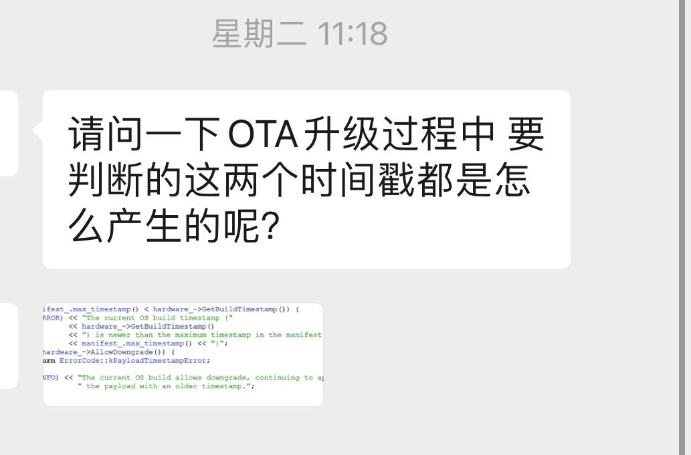
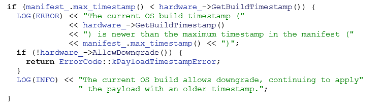
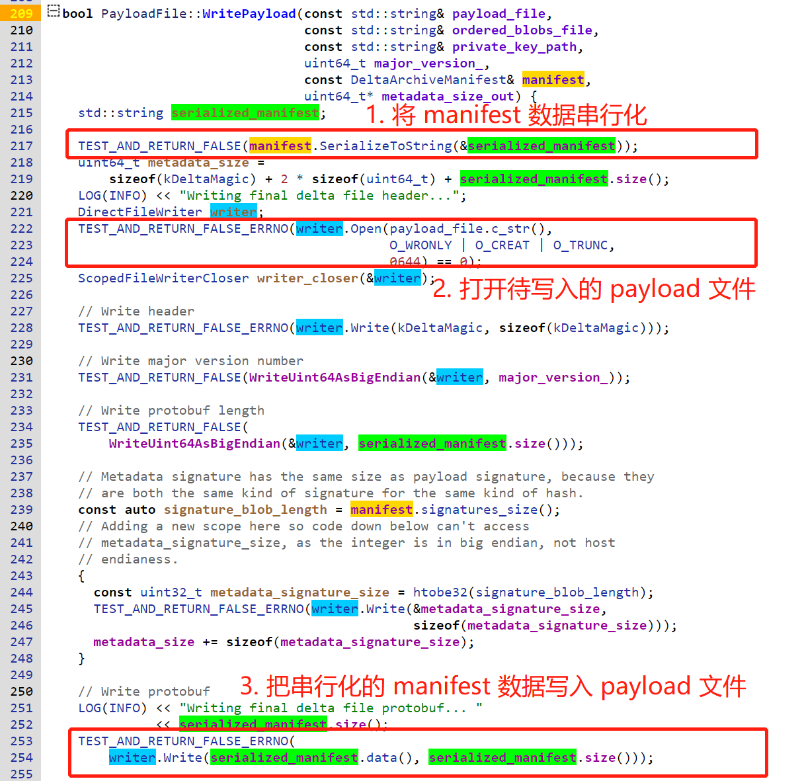
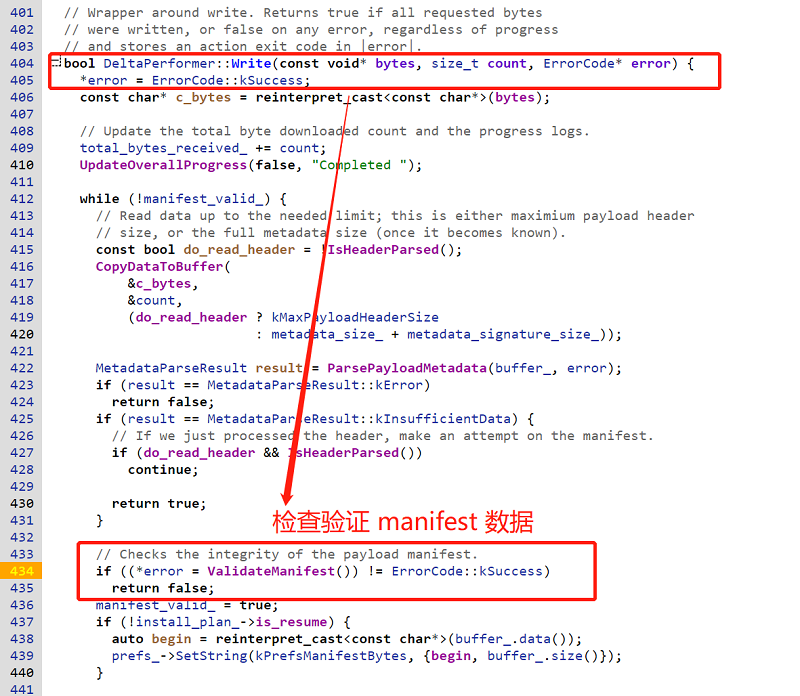
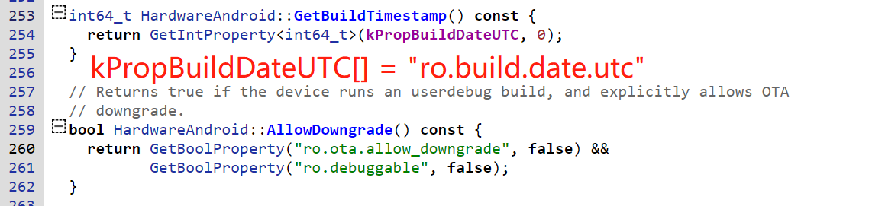

# 20230922-Android Update Engine 分析（二十二）OTA 降级限制之 timestamp


前段时间有小伙伴在 OTA 讨论 2 群问 OTA 中 `max_timestamp` 处理的问题，这个问题之前在 1 群讨论过多次，本文就 `max_timestamp` 作为降级限制功能进行详细分析。






通过 `max_timestamp` 进行降级限制，最初在 2017 年 10 月加入到 update engine 中，以下是当初的提交历史记录。


.png)

> 详细的 commit 内容可以通过以下链接查看: 
>
> https://cs.android.com/android/_/android/platform/system/update_engine/+/5011df680621eb477cad8b34f03fba5b542cc2f9


> 本文基于 android-13.0.0_r3 代码进行分析，在线代码阅读请参考：http://aospxref.com/android-13.0.0_r3/


在 Android 代码中搜索 `max_timestamp`，大概有以下 8 个地方引用：

.png)

> 为了减少不相干结果的干扰，我这里的搜索工程包括: bootable, build, device, hardware, system，你也可以在整个 Android 代码中搜索，然后再排除一些完全不相干的工程。


`max_timestamp` 定义在 `system/update_engine/update_metadata.proto` 文件中，并附带了一段注释：

```protobuf
// The maximum timestamp of the OS allowed to apply this payload. 
// Can be used to prevent downgrading the OS.
optional int64 max_timestamp = 14;
```

从这里代码的注释，再加上最初提交这个 commit 的说明，很清楚的说明了 `max_timestamp` 的用途。

```
Add maximum timestamp to the payload.

Added a new field max_timestamp in the protobuf, from now on
update_engine will reject any payload without this field.
If the OS build timestamp is newer than the max_timestamp, the payload
will also be rejected to prevent downgrade.
```

简而言之，就是 


## max_timestamp 作用的流程

### 1. ota_from_target_files 工具

.png)

.png)

.png)

这里的 metadata.postcondition 是怎么回事呢？我相信肯定有很多同学仍然是一头雾水。

.png)

.png)

从上面的分析可以知道，

```bash
android-13.0.0_r41/out$ grep -rnw utc dist-new/build.prop
11:ro.system.build.date.utc=1692116768
41:ro.build.date.utc=1692116768
```


### 2. brillo_update_payload 工具

```bash
2023-08-16 21:32:16 - common.py - INFO    :   Running: "/local/public/users/rocky/android-13.0.0_r41/out/host/linux-x86/bin/brillo_update_payload generate --payload /tmp/payload-bt7o2beq.bin --target_image out/dist-new/aosp_panther-target_files-eng.rocky.zip --source_image out/dist-old/aosp_panther-target_files-eng.rocky.zip --enable_zucchini true --enable_lz4diff false --disable_vabc true --max_timestamp 1692116768 --partition_timestamps init_boot:1692116768,product:1692116768,system:1692116768,system_dlkm:1692116768,system_ext:1692116768"
```


工具中有两出 max_timestamp 相关的地方，但都比较简单，其作用就是将接收到的 `max_timestamp` 参数传递给下一层的 delta_generator 工具。

.png)

.png)

### 3. delta_generator 工具


.png)

.png)

.png)

.png)



### 4. delta_performer.cc




.png)




## 回顾整个 max_timestamp 操作流程


## 操作建议

使用 `ota_from_target_files` 工具的 `-v` 选项制作一个升级包，然后查看相应的 timestamp 参数。

