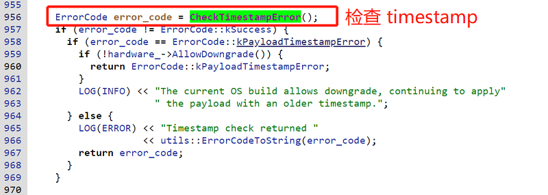
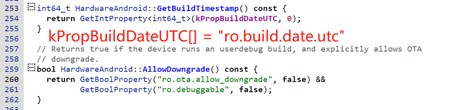

# 20230922-Android Update Engine 分析（二十二）OTA 降级限制之 timestamp


## 从 timestamp 的升级错误说起

先从很多很多年前在我的 OTA 讨论群里的一个升级错误说起：


这里具体的错误信息如下：

```bash
update_engine: [1105/000053:ERROR:delta_performer.cc<1478>] The current OS build timestamp <1542293913> is newer than the maximum timestamp in the manifest <1541687009>
```

这个错误的意思是：

当前运行系统的编译时间戳(1542293913，即 Nov 15, 2018, 2:58:33 PM)，和 Payload 中 manifest 的时间戳(1541687009，即 Nov 8, 2018, 2:23:29 PM)相比，显然当前系统的编译时间比 OTA 包中的时间要新(newer)。


想象一下这个问题是如何发生的？

1. 代码在 t1 时间编译，我们把该时间点的系统叫做 A，编译后将镜像写入到设备中成了当前运行的系统 A。

2. 你修改了代码，在 t2 时间编译生成了系统 B 的镜像，紧接着使用系统 B 的镜像对系统 A 的镜像进行差分制作升级包，得到 payload 文件。

3. 使用 payload 文件对当前的系统 A 进行升级，得到系统 B。

4. 升级时系统 A 检查 payload 文件的时间戳，发现当前系统 A 的时间竟然比 payload 中的时间还要新~

明明是先编译的系统 A，之后再制作的升级包，怎么可能系统的编译时间比升级包的时间还要新呢？这完全没有道理哈。一定是哪里搞错了，于是本文前面提到的这个错误就发生了。


这个错误来自 `system/update_engine/payload_consumer/delta_performer.cc` 文件中的一段代码:


其作用是，如果当前系统的编译时间戳(系统 A，通过 GetBuildTimestamp() 获取)比升级的目标系统时间戳(系统 B，即这里的 max_timestamp)还要新的话，打印这里的提示信息:

```
The current OS build timestamp <1542293913> is newer than the maximum timestamp in the manifest <1541687009>
```

> 背景知识：
>
> manifest 中的 max_timestamp 实际上是制作升级包时，目标(target)系统的编译时间戳。


紧接着，如果当前系统不允许降级的话，则返回 kPayloadTimestampError 错误。

如果当前系统允许降级操作，则打印提示信息:

```bash
The current OS build allows downgrade, continuing to apply the payload with an older timestamp.
```


显然，真有一种当前系统的时间比 payload 中的时间还要新的可能，那就是降级操作，我们后面详细展开说明。

在 Android 12 以后的代码中，`hardware_->AllowDowngrade()` 检查的逻辑判断已经改到外层函数中了，不过总体思路仍然一样。


通过 `max_timestamp` 进行降级限制，最初在 2017 年 10 月加入到 update engine 中，以下是当初的提交历史记录。


.png)

> 详细的 commit 内容可以通过以下链接查看: 
>
> https://cs.android.com/android/_/android/platform/system/update_engine/+/5011df680621eb477cad8b34f03fba5b542cc2f9


从这里的提交描述可以看到，引入 max_timestamp 就是为防止


> 本文基于 android-13.0.0_r3 代码进行分析，在线代码阅读请参考：http://aospxref.com/android-13.0.0_r3/


在 Android 代码中搜索 `max_timestamp`，大概有以下 8 个地方引用：

.png)

> 为了减少不相干结果的干扰，我这里的搜索工程包括: bootable, build, device, hardware, system，你也可以在整个 Android 代码中搜索，然后再排除一些完全不相干的工程。


`max_timestamp` 定义在 `system/update_engine/update_metadata.proto` 文件中，并附带了一段注释：

```protobuf
// The maximum timestamp of the OS allowed to apply this payload. 
// Can be used to prevent downgrading the OS.
optional int64 max_timestamp = 14;
```

从这里代码的注释，再加上最初提交这个 commit 的说明，很清楚的说明了 `max_timestamp` 的用途。

```
Add maximum timestamp to the payload.

Added a new field max_timestamp in the protobuf, from now on
update_engine will reject any payload without this field.
If the OS build timestamp is newer than the max_timestamp, the payload
will also be rejected to prevent downgrade.
```

简而言之，就是 


## max_timestamp 作用的流程

### 1. ota_from_target_files 工具

.png)

.png)

.png)

这里的 metadata.postcondition 是怎么回事呢？我相信肯定有很多同学仍然是一头雾水。

.png)

.png)

从上面的分析可以知道，

```bash
android-13.0.0_r41/out$ grep -rnw utc dist-new/build.prop
11:ro.system.build.date.utc=1692116768
41:ro.build.date.utc=1692116768
```


### 2. brillo_update_payload 工具

```bash
2023-08-16 21:32:16 - common.py - INFO    :   Running: "/local/public/users/rocky/android-13.0.0_r41/out/host/linux-x86/bin/brillo_update_payload generate --payload /tmp/payload-bt7o2beq.bin --target_image out/dist-new/aosp_panther-target_files-eng.rocky.zip --source_image out/dist-old/aosp_panther-target_files-eng.rocky.zip --enable_zucchini true --enable_lz4diff false --disable_vabc true --max_timestamp 1692116768 --partition_timestamps init_boot:1692116768,product:1692116768,system:1692116768,system_dlkm:1692116768,system_ext:1692116768"
```


工具中有两出 max_timestamp 相关的地方，但都比较简单，其作用就是将接收到的 `max_timestamp` 参数传递给下一层的 delta_generator 工具。

.png)

.png)

### 3. delta_generator 工具


.png)

.png)

.png)

.png)


### 4. delta_performer.cc




.png)




## 回顾整个 max_timestamp 操作流程


## 操作建议

使用 `ota_from_target_files` 工具的 `-v` 选项制作一个升级包，然后查看相应的 timestamp 参数。

