# 20230924-Android Update Engine 分析（二十三）如何在升级后清除用户数据？

> 本文为洛奇看世界(guyongqiangx)原创，转载请注明出处。
>
> 原文链接：https://blog.csdn.net/guyongqiangx/article/details/


在 OTA 讨论群呆久了，经常就能听到各种需求。其中一个就是升级后如何清除用户数据？对老同学们来说这个问题非常非常简单；但对不了解 OTA 的新同学来说，这可能有点无从下手。

如何在升级后清除用户数据？一句话，在制作升级包时指定 "--wipe-user-data" 选项就可以了。

例如以下是一个制作差分包并在升级后擦除数据的命令:

```bash
ota_from_target_files --wipe-user-data -i old-target_files.zip new-target_files.zip update.zip
```


因为这只是一个选项 "--wipe-user-data"，一句话的事情，所以我之前从没想过单独写一篇来介绍如何清除用户数据。

今天单独写一篇关于升级后如何清除用户数据的话题，其实主要不是为了介绍怎么做，而是梳理一下清除用户数据的流程，包括从制作升级包开始，到最终用户数据是如何被清除的这一整个过程。

所以，如果你只想知道如何做可以在升级后清除用户数据，那到这里就可以了。


> 本文基于 android-13.0.0_r3 代码进行分析，总体脉络框架适用于所有支持 A/B 系统的版本。
>
> 在线代码阅读: http://aospxref.com/android-13.0.0_r3/

制作清除用户数据的升级包的流程：

1. 制作升级包时提供选项 "--wipe-user-data"

在 ota_from_target_files.py 工具中是这样介绍 "--wipe-user-data" 选项的：

```bash
  --wipe_user_data
      Generate an OTA package that will wipe the user data partition when
      installed.
```

使用"--wipe_user_data" 选项将生成一个在安装时会清除用户数据分区的升级包。


在提供了 "--wipe_user_data" 选项后，ota_from_target_files.py 工具会在生成的 payload_properties.txt 文件中添加一项 "POWERWASH=1"

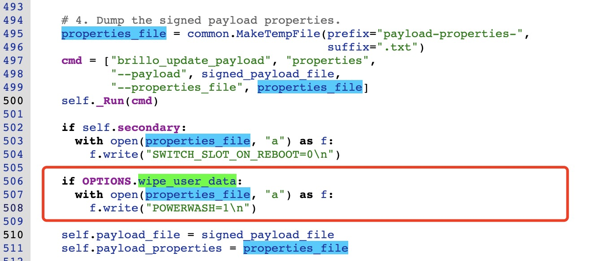

例如:

```bash
$ cat payload_properties.txt 
FILE_HASH=Rdz1nXP7lz2D8kCKqLLe9BT5Ys/LBwP9EgyBXpiA1Dc=
FILE_SIZE=66435
METADATA_HASH=s8aKOd8zvMdupvTMJ87bHLZsbrExH8sFgnBk5SWpVak=
METADATA_SIZE=65901
POWERWASH=1
```


明明是擦除数据，为啥又来一个名字奇奇怪怪的 POWERWASH？而且，接下来的这一切都和 powerwash 紧密相关。你就不好奇一下为什么是 power wash 吗？


## 什么是 POWERWASH?


我在网上找到一个直接的解释:

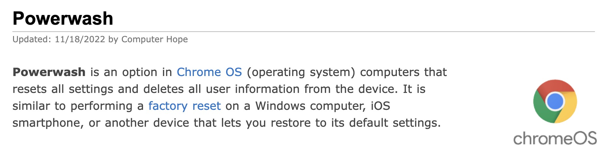

> 来源: https://www.computerhope.com/jargon/p/powerwash.htm


所以 Powerwash 就是强力清洗，引申为强力清洗设备上的用户数据。

Google 系的 ChromeOS 和 Android 上的这个术语等同于其它地方的“清除用户数据”，“工厂复位”或“恢复出厂设置”。


一句话总结：对于 "--wipe_user_data"，ota_from_target_files.py 工具的唯一作用就是往升级包 update.zip 中的文件 payload_properties.txt 写入 "POWERWASH=1"


那写入的 "POWERWASH=1" 在什么时候使用呢？


在进行 OTA 升级时，需要将 payload_properties.txt 文件的内容作为 headers 参数的内容传递给 update engine 服务端程序。例如：

```bash
console:/ # update_engine_client \
--payload=http://guyognqiangx.com/android/full-ota/payload.bin \
--update \
--headers="\
  FILE_HASH=ozGgyQEcnkI5ZaX+Wbjo5I/PCR7PEZka9fGd0nWa+oY= 
  FILE_SIZE=282164983 
  METADATA_HASH=GLIKfE6KRwylWMHsNadG/Q8iy5f7ENWTatvMdBlpoPg= 
  METADATA_SIZE=21023
  POWERWASH=1
"
```


如果你使用的是 update_engine_client 这个 Android 提供的升级 demo 应用，则程序会将 headers 参数使用换行符"\n"进行拆分，然后将得到一个字符串数组传递给 update engine 服务端进程的 applyPayload() 函数。


最终 applyPayload() 函数的执行会流转到 UpdateAttempterAndroid::ApplyPayload() 函数，在该函数中提取 headers 数组中关于 "POWERWASH" 的键值对用于设置 `install_plan_.powerwash_required`

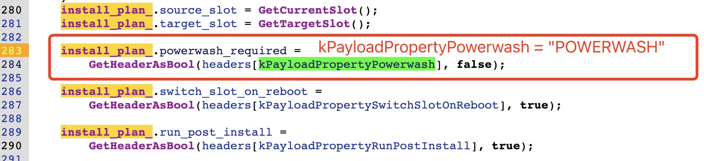

所以如果升级参数中传递了 "POWERWASH=1"，则这里获取到的 powerwash_required = 1。


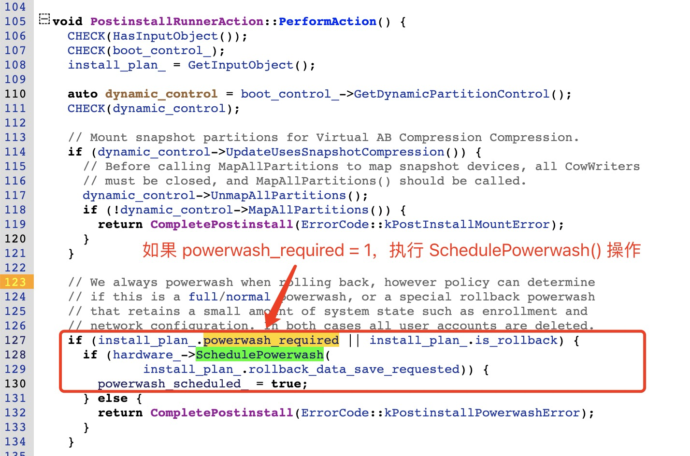

我们进一步看看 `hardware_->SchedulePowerwash()` 是如何操作的：

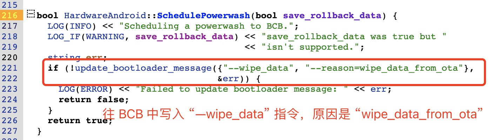

非常简单，就是往 bootloader message block 中写入命令 "--wipe_data" 指令。

最终，往 BCB 写入命令: "boot-recovery", "recovery --wipe_data"

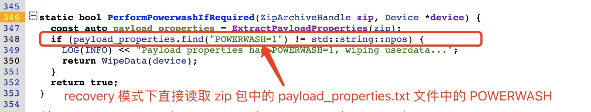

最终在 Recovery 下执行的 WipeData 操作:

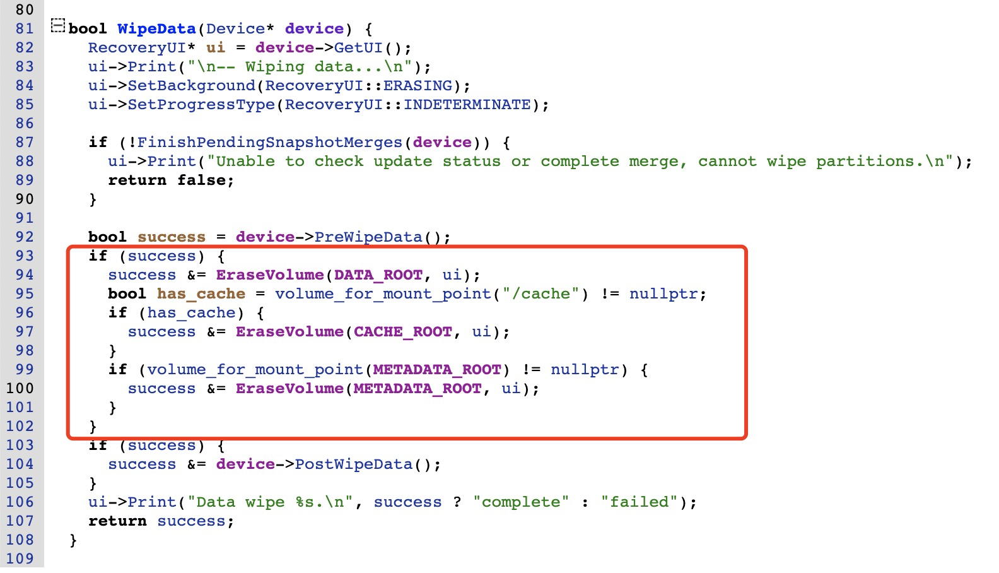


那重启进入 recovery 以后，到底是如何知道要调用 WipeData 删除数据的呢？

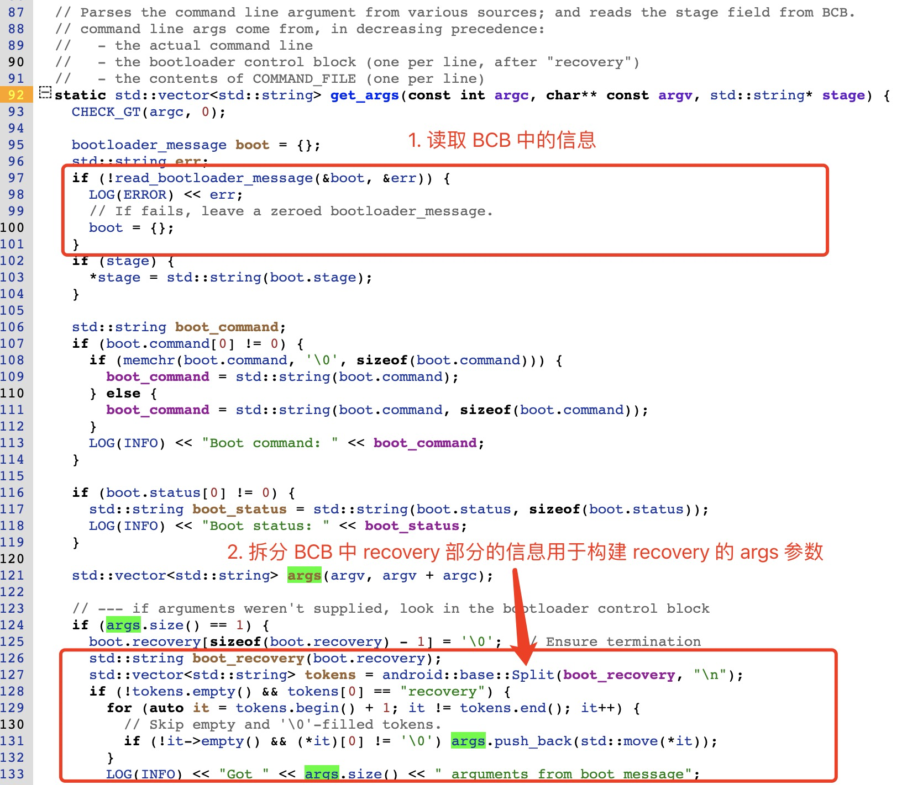

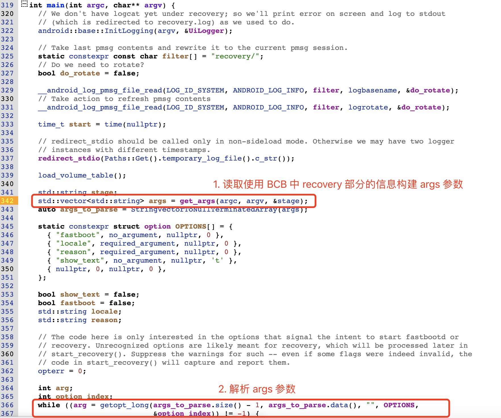

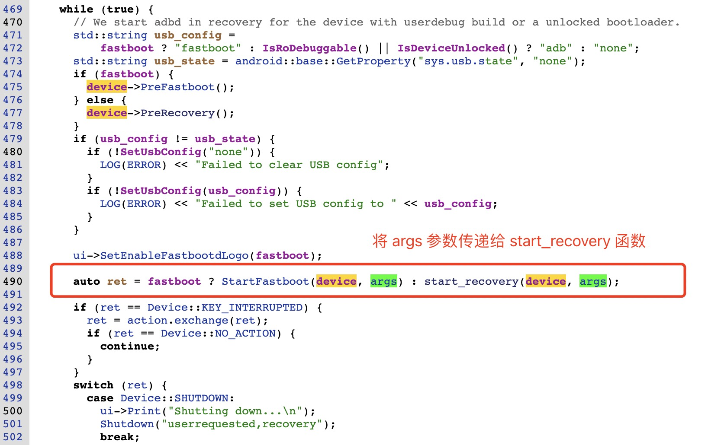

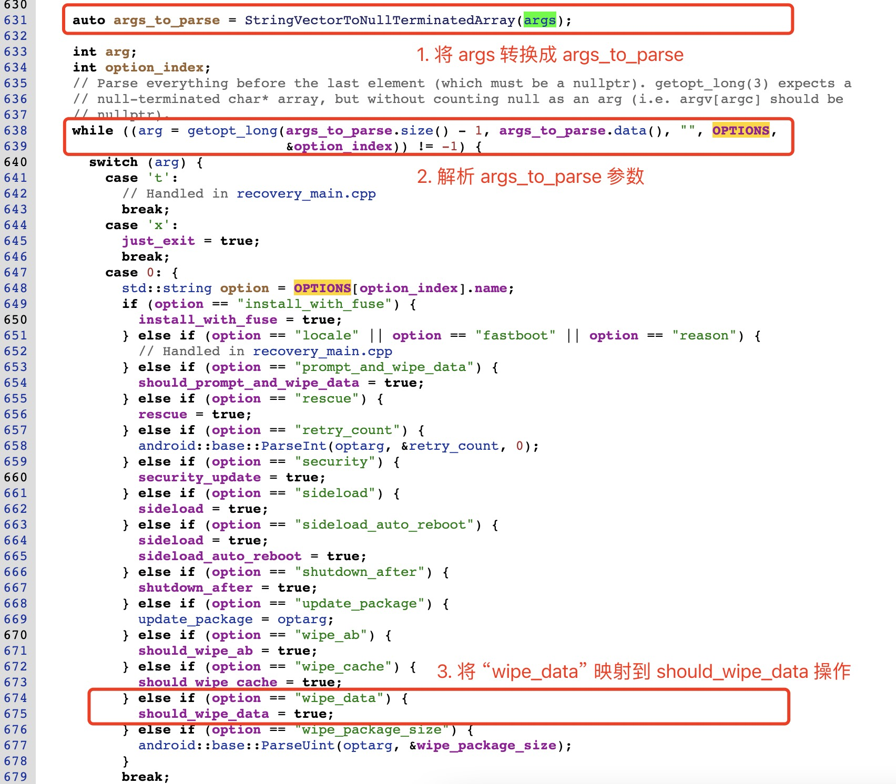

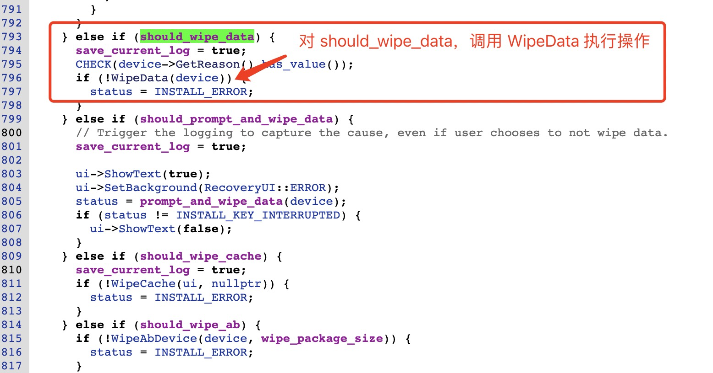

## 思考题

1. 如果制作升级包时没有指定 "--wipe-user-data"，又该如何使得在升级后擦除用户数据呢？
2. 你知道从制作升级包到最终擦除用户数据经历了几个阶段吗？
3. 为什么要在 recovery 模式下擦除用户数据，直接在升级过程中擦除不就可以了吗？
4. recovery 模式下，recovery 应用是如何得知当前的具体操作并执行的？
5. 在 recovery 中擦除数据时，具体擦除了哪些数据？
6. 使用 "--wipe-user-data" 以后，升级时就完全清除了所有的用户数据了吗？
7. 为什么 Android A/B 系统出现这么久了，还仍然需要 recovery 模式？


