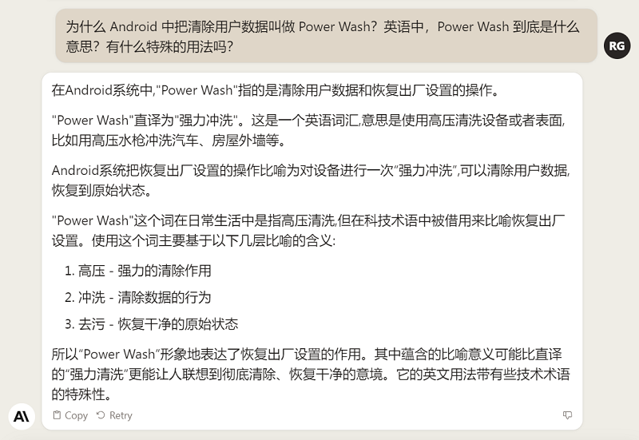
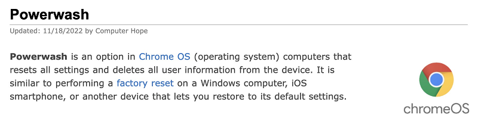
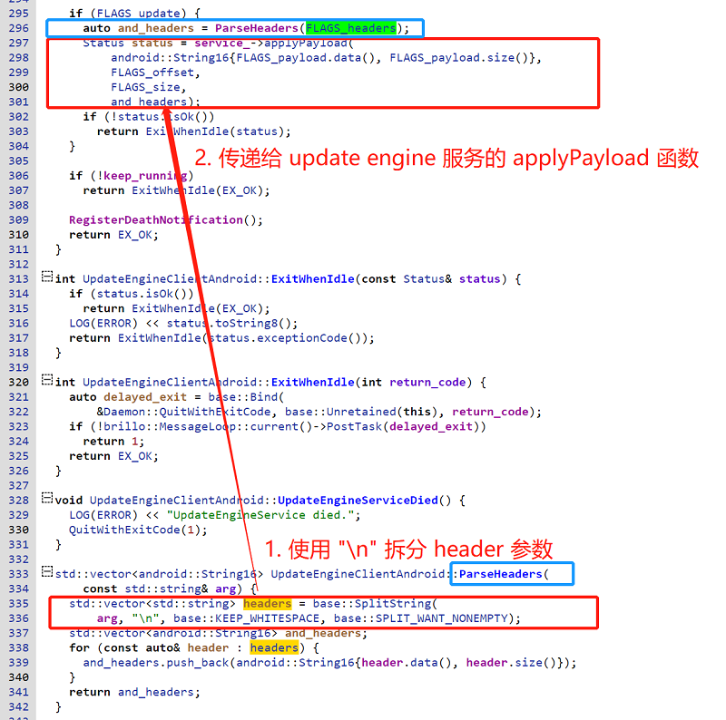
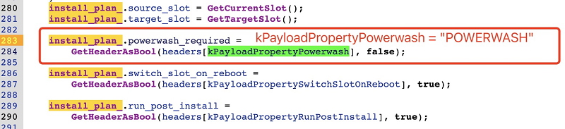
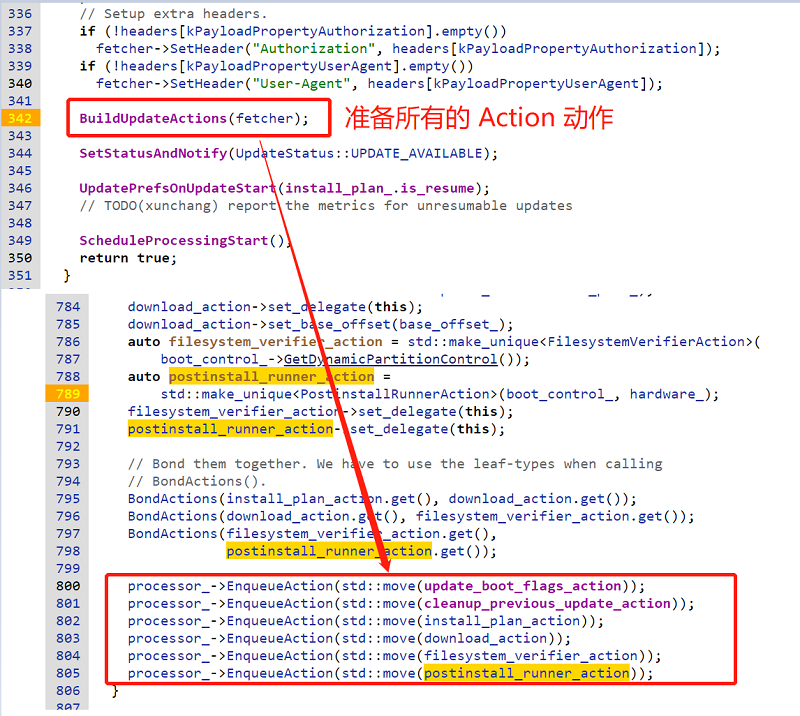
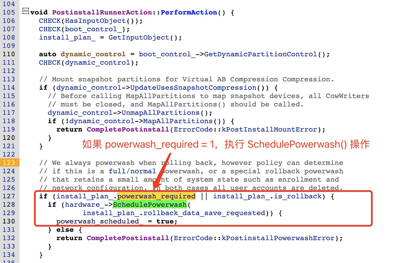
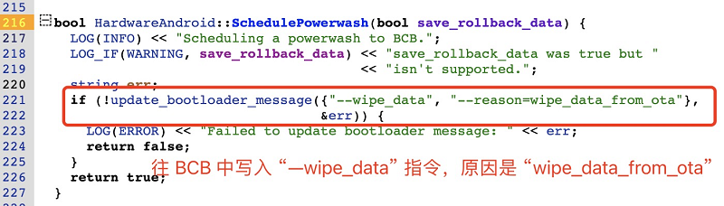
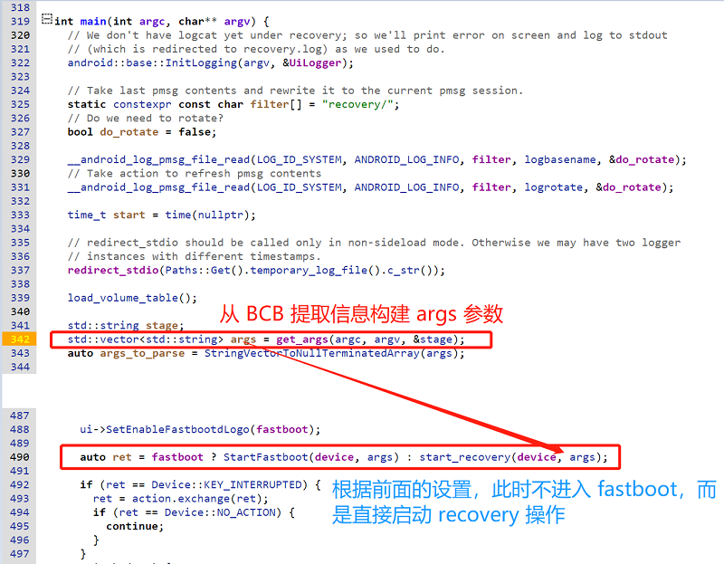

# 20230924-Android Update Engine 分析（二十三）如何在升级后清除用户数据？


> 本文为洛奇看世界(guyongqiangx)原创，转载请注明出处。
>
> 原文链接：https://blog.csdn.net/guyongqiangx/article/details/133274277

## 0. 导读

在 OTA 讨论群呆久了，经常就能听到各种需求。最常见的一个就是升级后清除用户数据。对老同学们来说这个问题非常非常简单；但对不了解 OTA 的新同学来说，这可能有点无从下手。

如何在升级后清除用户数据？一句话，在制作升级包时指定 "--wipe-user-data" 选项就可以了。

以下是一个制作差分包并在升级后擦除数据的命令:

```bash
ota_from_target_files --wipe-user-data -i old-target_files.zip new-target_files.zip update.zip
```


因为这只是一个选项 "--wipe-user-data"，一句话的事情，所以我之前从没想过单独写一篇来介绍如何清除用户数据。

今天单独写一篇关于升级后如何清除用户数据的话题，其实主要不是为了介绍怎么做，而是梳理一下清除用户数据的流程，包括从制作升级包开始，到最终用户数据被清除的这一整个过程。

所以，如果你只想知道如何做可以在升级后清除用户数据，那到这里就可以了。不过如果你想挑战下自己，不妨看看本文第 7 节的几个思考题。


> 本文基于 android-13.0.0_r3 代码进行分析，总体脉络框架适用于所有支持 A/B 系统的版本。
>
> 在线代码阅读: http://aospxref.com/android-13.0.0_r3/


以下是章节导读：

- 如果你只对如何清楚用户数据感兴趣，那读到这里就可以了。
- 如果你对从制作升级包使用"--wipe-user-data"选项开始，到最终擦除数据的整个流程代码感兴趣，请跳转到第 1 节查看一步一步的代码分析；
- 如果你希望了解整个整个流程，但又不希望深入代码，请跳转到第 2 节，查看关于 3 个阶段的总结；
- 如果你觉得自己了解了整个过程，不妨试着回答下第 3 节的思考题；


> 核心代码[《Android Update Engine 分析》](https://blog.csdn.net/guyongqiangx/category_12140296.html)系列，文章列表：
>
> - [Android Update Engine分析（一）Makefile](https://blog.csdn.net/guyongqiangx/article/details/77650362)
>
> - [Android Update Engine分析（二）Protobuf和AIDL文件](https://blog.csdn.net/guyongqiangx/article/details/80819901)
>
> - [Android Update Engine分析（三）客户端进程](https://blog.csdn.net/guyongqiangx/article/details/80820399)
>
> - [Android Update Engine分析（四）服务端进程](https://blog.csdn.net/guyongqiangx/article/details/82116213)
>
> - [Android Update Engine分析（五）服务端核心之Action机制](https://blog.csdn.net/guyongqiangx/article/details/82226079)
>
> - [Android Update Engine分析（六）服务端核心之Action详解](https://blog.csdn.net/guyongqiangx/article/details/82390015)
>
> - [Android Update Engine分析（七） DownloadAction之FileWriter](https://blog.csdn.net/guyongqiangx/article/details/82805813)
>
> - [Android Update Engine分析（八）升级包制作脚本分析](https://blog.csdn.net/guyongqiangx/article/details/82871409)
>
> - [Android Update Engine分析（九） delta_generator 工具的 6 种操作](https://blog.csdn.net/guyongqiangx/article/details/122351084)
>
> - [Android Update Engine分析（十） 生成 payload 和 metadata 的哈希](https://blog.csdn.net/guyongqiangx/article/details/122393172)
>
> - [Android Update Engine分析（十一） 更新 payload 签名](https://blog.csdn.net/guyongqiangx/article/details/122597314)
>
> - [Android Update Engine分析（十二） 验证 payload 签名](https://blog.csdn.net/guyongqiangx/article/details/122634221)
>
> - [Android Update Engine分析（十三） 提取 payload 的 property 数据](https://blog.csdn.net/guyongqiangx/article/details/122646107)
>
> - [Android Update Engine分析（十四） 生成 payload 数据](https://blog.csdn.net/guyongqiangx/article/details/122753185)
>
> - [Android Update Engine分析（十五） FullUpdateGenerator 策略](https://blog.csdn.net/guyongqiangx/article/details/122767273)
>
> - [Android Update Engine分析（十六） ABGenerator 策略](https://blog.csdn.net/guyongqiangx/article/details/122886150)
>
> - [Android Update Engine分析（十七）10 类 InstallOperation 数据的生成和应用](https://blog.csdn.net/guyongqiangx/article/details/122942628)
>
> - [Android Update Engine分析（十八）差分数据到底是如何更新的？](https://blog.csdn.net/guyongqiangx/article/details/129464805)
>
> - [Android Update Engine分析（十九）Extent 到底是个什么鬼？](https://blog.csdn.net/guyongqiangx/article/details/132389438)
>
> - [Android Update Engine分析（二十）为什么差分包比全量包小，但升级时间却更长？](https://blog.csdn.net/guyongqiangx/article/details/132343017)
>
> - [Android Update Engine分析（二十一）Android A/B 的更新过程](https://blog.csdn.net/guyongqiangx/article/details/132536383)
>
> - [Android Update Engine分析（二十二）OTA 降级限制之 timestamp](https://blog.csdn.net/guyongqiangx/article/details/133191750)
>
> - [Android Update Engine分析（二十三）如何在升级后清除用户数据？](https://blog.csdn.net/guyongqiangx/article/details/133274277)

> 如果您已经订阅了本专栏，请务必加我微信，拉你进“动态分区 & 虚拟分区专栏 VIP 答疑群”。

## 1. 擦除用户数据流程


### 1.1 制作升级包阶段

#### 1. 制作升级包的 "--wipe-user-data" 选项

既然使用选项 "--wipe-user-data" 可以在升级完成后清理用户数据，那就看下这到底是是个什么神奇选项？

在 ota_from_target_files.py 工具中是这样介绍 "--wipe-user-data" 选项的：

```bash
  --wipe_user_data
      Generate an OTA package that will wipe the user data partition when
      installed.
```

使用"--wipe_user_data" 选项将生成一个在安装时会清除用户数据分区的升级包。


在提供了 "--wipe_user_data" 选项后，ota_from_target_files.py 工具会在生成的 payload_properties.txt 文件中添加一项 "POWERWASH=1"


图 1. ota_from_target_files 处理 "--wipe_user_data" 选项


例如:

```bash
$ cat payload_properties.txt 
FILE_HASH=Rdz1nXP7lz2D8kCKqLLe9BT5Ys/LBwP9EgyBXpiA1Dc=
FILE_SIZE=66435
METADATA_HASH=s8aKOd8zvMdupvTMJ87bHLZsbrExH8sFgnBk5SWpVak=
METADATA_SIZE=65901
POWERWASH=1
```


然后再看搜索结果，竟然没有其它地方再使用 "--wipe-user-data" 了。


明明是擦除数据，为啥又来一个名字奇奇怪怪的 POWERWASH？而且，接下来的这一切都和 powerwash 紧密相关。你就不好奇一下为什么是 power wash 吗？


#### 2. 什么是 POWERWASH?


关于什么是 POWERWASH，我问了下那个谁谁谁:



图 2. 为什么 Android 中把清除用户数据叫做 Power Wash?


我还在网上找到一个更直接的解释:



图 3. ChromeOS 中关于 Powerwash 的解释


> 来源: https://www.computerhope.com/jargon/p/powerwash.htm


所以 Powerwash 就是强力清洗，引申为清除设备上的用户数据。

Google 系的 ChromeOS 和 Android 上的这个术语等同于其它地方的“清除用户数据”，“工厂复位”或“恢复出厂设置”。


总结：制作升级包阶段，对于 "--wipe_user_data"，ota_from_target_files.py 工具的唯一作用就是往升级包 update.zip 的属性文件 payload_properties.txt 中写入 "POWERWASH=1"


### 1.2 OTA 升级阶段

#### 1. payload_properties.txt 文件中的 "POWERWASH=1"

那写入升级包属性文件 payload_properties.txt 中的 "POWERWASH=1" 在什么时候使用呢？


在进行 OTA 升级时，需要将 payload_properties.txt 文件的内容作为 headers 参数的内容传递给 update engine 服务端程序。以 update_engine_client 为例，以下是升级命令：

```bash
console:/ # update_engine_client \
--payload=http://guyognqiangx.com/android/full-ota/payload.bin \
--update \
--headers="\
  FILE_HASH=ozGgyQEcnkI5ZaX+Wbjo5I/PCR7PEZka9fGd0nWa+oY= 
  FILE_SIZE=282164983 
  METADATA_HASH=GLIKfE6KRwylWMHsNadG/Q8iy5f7ENWTatvMdBlpoPg= 
  METADATA_SIZE=21023
  POWERWASH=1
"
```


在 update_engine_client 内部，程序会解析 headers 参数，并使用换行符"\n"对 headers 参数进行拆分，然后将得到的字符串数组作为 传递给 update engine 服务端进程 applyPayload() 函数。



图 4. update_engine_client 使用换行符分割 headers 参数


Update Engine 的 Binder 服务的实际执行者是 UpdateAttempterAndroid 的 ApplyPayload 函数:


图 5. headers 参数传递到 update engine 服务端的 ApplyPayload 函数


#### 2. ApplyPayload 函数设置 InstallPlan

因此，传递给 update_client_engine 的 header 参数最终转到 UpdateAttempterAndroid::ApplyPayload() 函数，在该函数中提取 headers 数组中关于 "POWERWASH" 的键值对用于设置 `install_plan_.powerwash_required`



图 6. ApplyPayload 函数使用 POWERWASH 设置 InstallPlan


所以如果升级参数中传递了 "POWERWASH=1"，则升级时变成 InstallPlan 的配置项: powerwash_required = 1。


#### 3. PostinstallRunnerAction 动作

那么 install_plan_.powerwash_required 是在什么时候被使用的呢？

别急，在 UpdateAttempterAndroid::ApplyPayload() 函数中会调用 BuildUpdateActions() 函数准备升级中所有的 Action 动作，其中有个 Action 叫做 PostinstallRunnerAction:



图 7. ApplyPayload 中创建所有 Action


在 PostinstallRunnerAction 内部会检查 `install_plan_.powerwash_required` 设置。如果 `powerwash_required` 设置为真，则启动 `hardware_->SchedulePowerwash()` 操作。



图 8. PostinstallRunnerAction 中检查 powerwash_required 设置


#### 4. SchedulePowerwash 操作

我们进一步看看 `hardware_->SchedulePowerwash()` 是如何操作的：



图 9. SchedulePowerwash 写入 "--wipe_data" 指令


非常简单，就是往 bootloader message block 中写入命令 "--wipe_data" 指令。

传入 update_engine_client 的 "POWERWASH=1" 参数变成了往 BCB(bootloader message block) 区域写入命令 "boot-recovery"，并携带两个参数 "--wipe_data" 和 "--reason=wipe_data_from_ota"，由于升级完成以后会重启，所以看起来具体清除数据的操作需要在 recovery 里面做了。

> 关于 BCB 区域的用途，请参考博客文章：[《Android A/B System OTA分析（三）主系统和bootloader的通信》](https://blog.csdn.net/guyongqiangx/article/details/72480154)


总结：

在 OTA 升级阶段，升级应用需要解析属性文件 payload_properties.txt，并将其数据传递给 Update Enginge 服务端程序的 applyPayload 函数，其中就包括 "POWERWASH=1"。

然后参数 "POWERWASH=1" 会被解析，并用于设置 InstallPlan 的属性 "powerwash_required"，在升级后期的 PostinstallRunnerAction 动作中会检查 powerwash_required 属性，并调用 SchedulePowerwash() 函数，将 "boot-revery" 命令和参数 "--wipe_data" 以及 "--reason=wipe_data_from_ota" 写入 BCB (bootloader message block) 区域中。

设备升级完成后将会重启，bootloader 阶段解析 BCB 数据并选择进入 recovery 模式。


### 1.3 Recovery 阶段


上一节提到，在 OTA 升级阶段，系统往 BCB 区域写入命令 命令 "boot-recovery"，并携带两个参数 "--wipe_data" 和 "--reason=wipe_data_from_ota"。


#### 1. Recovery 解析 BCB 信息

设备重启进入 recovery 以后，到底是如何知道删除数据的呢？

不同于以往的应用程序通过 main 函数传递参数信息， recovery 应用的 get_args 函数通过解析 BCB 数据块构建参数。


图 10. Recovery 从 BCB 中读取数据用于反向构建 args 参数


然后，将构建好的参数作为参数传递给 start_recovery 函数进一步执行操作。



图 11. 启动 start_recovery 函数


在 start_recovery 函数内部，终于看到处理 "wipe_data" 参数了，将其转化成 "should_wipe_data" 操作


图 12. start_recovery 中检查 "--wipe_data"


而 "should_wipe_data" 的结果就是调用 WipeData 函数执行具体的操作。


图 13. start_recovery 调用 WipeData 操作


#### 2. WipeData 函数

最终在 Recovery 下执行 WipeData 操作来完成数据的擦除:


图 14. WipeData 函数


从这里看，WipeData 依次做了一下几个动作：

- 调用 EraseVolume 擦除 "/data" 下的数据
- 调用 EraseVolume 擦除 "/cache" 下的数据
- 调用 EraseVolume 擦除 "/metadata" 下的数据

在 EraseVolume 下会调用 format_volume() 执行具体的操作，这里不再深入往下分析。


总结：

在设备重启后，bootloader 会检查 BCB 区域的命令，并选择进入 recovery 模式。

在 recovery 模式下，启动 recovery 应用，和普通应用通过 main 函数传递参数不同，recovery 应用读取 BCB 区域反向构建参数。

由于系统不满足 recovery 下 fastboot 模式的条件，选择 start_recovery 开始操作。

在 start_recovery 函数中根据传入的 "wipe_data" 参数，最后调用 WipeData 函数执行数据清理工作，包括：

- 擦除 "/data" 分区
- 擦除 "/cache" 分区
- 擦除 "/metadata" 分区

昨晚这一些列工作后，退出 recovery 系统，重启进入 Android 主系统。

## 2. 擦除用户数据流程总结

上一节详细分析了擦除用户数据各个阶段的代码，比较繁琐。这一节脱离具体的代码细节，对擦除用书数据的流程做一个总结。

宏观上说，通过制作升级包来擦除用户数据分成 3 个阶段：

1. 升级包制作阶段传入选项 "--wipe_user_data"
2. OTA 升级阶段，最终往 BCB 区域写入 "boot-recovery" 命令和 "--wipe_data" 参数
3. 重启进入 Recovery 模式，根据 "--wipe_data" 参数调用 WipeData 函数擦除 /data, /cache 和 /metadata 分区


### 升级包制作阶段

给 ota_from_target_files 工具传入 "--wipe_user_data" 选项制作升级包，例如：

```
ota_from_target_files --wipe-user-data -i old-target_files.zip new-target_files.zip update.zip
```

"--wipe_user_data" 选项的唯一作用就是往升级包 update.zip 的属性文件 payload_properties.txt 中写入 "POWERWASH=1"


### OTA 升级阶段

1. 提取升级包 update.zip 属性文件 payload_properties.txt 的内容，并作为 headers 参数传递给 update_engine_client。

2. update_engine_client 对 header 参数使用换行符 "\n" 进行拆分变成字符串数组传递给 Update Engine 的服务端进程函数 applyPayload，其中包括 "POWERWASH=1"。

3. 服务端进程函数 applyPayload 把所有参数传递给 UpdateAttempterAndroid::ApplyPayload() 函数。

4. 在 UpdateAttempterAndroid::ApplyPayload() 中提取 "POWERWASH=1" 用于设置 InstallPlan 的 powerwash_required 字段。

5. 在 OTA 升级完成数据写入后的 PostinstallRunnerAction 阶段检查 InstallPlan 的 powerwash_required 设置。

   如果为真，则调用  SchedulePowerwash() 函数将 "boot-revery" 命令和参数 "--wipe_data" 以及 "--reason=wipe_data_from_ota" 写入 BCB (bootloader message block) 区域中。

6. 设备升级完成后将会重启


### Recovery 阶段

1. 设备重启后，bootloader 阶段解析 BCB 数据并选择进入 recovery 模式。在 recovery 模式下，启动 recovery 应用

2. 和普通应用通过 main 函数传递参数不同，recovery 应用读取 BCB 区域反向构建参数。

3. 由于系统不满足 recovery 下 fastboot 模式的条件，选择 start_recovery 开始操作。

   在 start_recovery 函数中根据传入的 "wipe_data" 参数，最后调用 WipeData 函数执行数据清理工作。

5. 在 Recovery 的 WipeData 中完成用户数据清理的具体工作，包括：

   - 擦除 "/data" 分区

   - 擦除 "/cache" 分区

   - 擦除 "/metadata" 分区

6. 做完这一系列工作后，退出 recovery 系统，重启进入 Android 主系统。


到此，完成了通过往制作升级包中传入 "--wipe_user_data" 选项，制作升级包，然后升级，并在重启后进入 recovery 模式擦除用户数据的整个过程。

## 3. 思考题

1. 如果制作升级包时没有指定 "--wipe-user-data"，又该如何使得在升级后擦除用户数据呢？
2. 你知道从制作升级包到最终擦除用户数据经历了几个阶段吗？
3. 为什么要在 recovery 模式下擦除用户数据，直接在升级过程中擦除不就可以了吗？
4. recovery 模式下，recovery 应用是如何得知当前的具体操作并执行的？
5. 在 recovery 中擦除数据时，具体擦除了哪些数据？
6. 使用 "--wipe-user-data" 以后，升级时就完全清除了所有的用户数据了吗？
7. 为什么 Android A/B 系统出现这么久了，还仍然需要 recovery 模式？


## 4. 其它

到目前为止，我写过 Android OTA 升级相关的话题包括：

- 基础入门：《Android A/B 系统》系列
- 核心模块：《Android Update Engine 分析》 系列
- 动态分区：《Android 动态分区》 系列
- 虚拟 A/B：《Android 虚拟 A/B 分区》系列
- 升级工具：《Android OTA 相关工具》系列

更多这些关于 Android OTA 升级相关文章的内容，请参考[《Android OTA 升级系列专栏文章导读》](https://blog.csdn.net/guyongqiangx/article/details/129019303)。

如果您已经订阅了动态分区和虚拟分区付费专栏，请务必加我微信，备注订阅账号，拉您进“动态分区 & 虚拟分区专栏 VIP 答疑群”。我会在方便的时候，回答大家关于 A/B 系统、动态分区、虚拟分区、各种 OTA 升级和签名的问题。

除此之外，我有一个 Android OTA 升级讨论群，里面现在有 400+ 朋友，主要讨论手机，车机，电视，机顶盒，平板等各种设备的 OTA 升级话题，如果您从事 OTA 升级工作，欢迎加群一起交流，请在加我微信时注明“Android OTA 讨论组”。此群仅限 Android OTA 开发者参与~

> 公众号“洛奇看世界”后台回复“wx”获取个人微信。


