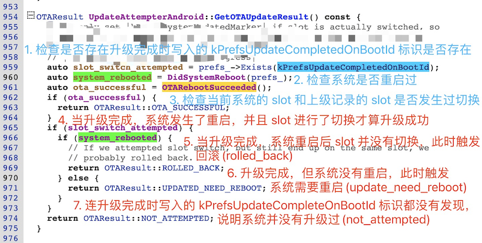

# 20230930-Android Update Engine 分析（二十六）OTA 更新后强制不切换 Slot 会怎么样？

成功更新数据后 prefs 状态是如何切换的？


上一篇[《Android Update Engine分析（二十五）升级状态 prefs 是如何保存的？》](https://blog.csdn.net/guyongqiangx/article/details/133421560) 主要分析了 Update Engine 中 prefs 的实现，以及对所有使用 prefs 的统计。在最后打算以 kPrefsBootId 为例，提供一些研究 prefs 的方法。

但随着学习的深入，发现 kPrefsBootId 的变化涉的内容很多。这个过程包括，系统升级，成功更新各分区镜像，接着写入 prefs 状态标记，设备重启，系统启动 Update Engine 服务进程，Update Engine 通过 prefs 数据检查 OTA 状态(包括 Slot 槽位切换)。

在我的 OTA 讨论群中曾经出现过一个问题，系统更新成功以后，不切换 Slot 槽位，重启后系统会提示升级失败。这到底是怎么回事呢？


其实这里升级成功，但不切换槽位导致的失败，和系统重启前对 prefs 设置，以及重启后对 prefs 数据和 OTA 状态的检查有关。

OTA 升级更新数据以后，暂不切换 Slot，等到某个时机成熟以后再切换槽位完成最后的升级的场景需求也是有的。但要如何操作？只有理解了 prefs 在 OTA 更新前后到底是如何变化，才有应对之法。


### 1. OTA 结束的操作

这个话题要从 OTA 升级结束的操作说起。

升级中，通过 ActionProcessor::StartNextActionOrFinish() 函数不断选择下一步的 Action。


当系统升级执行完所有的 Action 动作后，会调用 `UpdateAttempterAndroid::ProcessingDone()` 函数。


`ProcessingDone()` 函数根据 Action 返回结果执行不同的操作，主要分成两类：

1. OTA 更新数据成功；
2. OTA 更新数据的各种失败；


#### OTA 更新数据成功

对于成功写入 OTA 升级数据，此时的返回结果为 kSuccess，因此调用 WriteUpdateCompleteMarker() 函数，并随后将 kPrefsDeltaUpdateFailures 设置为 0。

在 WriteUpdateCompleteMarker() 函数中，主要做了两件事情：

1. 获取当前的 boot_id，保存到 `kPrefsUpdateCompletedOnBootId` 中。
2. 将当前系统的分区后缀保存到 `kPrefsPreviousSlot` 中，因为当前升级完成以后，会伴随系统的重启以及分区的切换(切换到升级的新系统中)。


> 对 linux 系统来说，每次启动都会在文件 "/proc/sys/kernel/random/boot_id" 中保存一个唯一的 id，任意的两次启动都不会有相同的 id。所以，如果两次获取的 boot_id 一样，则说明当前处于系统同一次启动的生命周期内。


#### OTA 更新数据失败

OTA 更新数据失败的情况并不是我们这里讨论的重点，但为了完整讨论 ProcessingDone() 函数，这里也简单说明一下。

当 OTA 更新数据发生各种失败时，调用函数 DeltaPerformer::ResetUpdateProgress() 将所有 OTA 升级进度相关的数据进行复位。包括：NextOperation, NextDataOffset, NextDataLength, SHA256Context, SignatureBlob, Manifest 等。


### 2. Update Engine 启动后的 Init 操作

在介绍 Update Engine 启动检查 prefs 和 OTA 状态前，先回顾下 Update Engine 的启动流程。


#### Update Engine 启动流程

更多关于 Update Engine 服务端进程启动的细节，请参考博客：

- [《Android Update Engine分析（四）服务端进程》](https://blog.csdn.net/guyongqiangx/article/details/82116213)
- [Android Update Engine分析（二十五）升级状态 prefs 是如何保存的？](https://blog.csdn.net/guyongqiangx/article/details/133421560)

以下是 Update Engine 服务端进程启动时，函数的调用流程:

```
--> main(argc, argv)
  --> daemon = chromeos_update_engine::DaemonBase::CreateInstance() (返回 DaemonAndroid 实例)
  --> daemon->Run() (即: DaemonAndroid::Run())
    --> Deamon::Run() (执行父类的 Run())
      --> Daemon::OnInit() (虚函数，执行子类的 OnInit())
        --> DaemonAndroid::OnInit()
          --> daemon_state_ = new DaemonStateAndroid()
          --> daemon_state_->Initialize() (即: DaemonStateAndroid::Initialize())
          --> daemon_state_->AddObserver(binder_service_)
          --> daemon_state_->StartUpdater() (即: DaemonStateAndroid::StartUpdater())
            --> update_attempter_->Init() (即: UpdateAttempterAndroid::Init())
    --> message_loop_.PostTask(Daemon::OnEventLoopStartedTask)
    --> message_loop_.Run() (消息主循环)
    --> Daemon::OnShutdown(&exit_code_)
```


从上面的函数调用流程中可以看到，在 Update Engine 启动初始化的后期，会调用 UpdateAttempterAndroid::Init() 函数。在 UpdateAttempterAndroid::Init() 函数中，分成两种情况进行处理：

1. OTA 更新后还没有重启系统，但 Update Engine 因为某种情况重启了
2. OTA 更新后已经重启过系统，进入系统后启动了 Update Engine


#### OTA 更新后还没有重启系统

OTA 更新后还没有重启系统，但 Update Engine 因为某种意外重启了。

> 思考题：Update Engine 服务端进程是如何启动的？由谁启动的？

前面分析 Update Engine 启动流程时说过，启动的末期会调用函数 `UpdateAttempterAndroid::Init()`，在该函数中，读取当前系统的 boot_id 和上次成功写入数据时记录的 boot_id 比较。

如果两个 boot_id 一样，说明系统自从成功写入数据后还没有重启过，此时发送状态通知：更新后需要重启(UPDATE_NEED_REBOOT)。


#### OTA 更新后已经重启系统

如果 Update Engine 启动中发现 prefs 记录的 boot_id 和当前系统的 boot_id 不一样，说明自系统更新完数据后，已经重新启动过了。

此时的调用 `GetOTAUpdateResult()` 检查并返回 OTA 升级结果，并根据 OTA 升级结果更新系统的升级状态，如下：


这里主要有 3 个操作：

1. 调用 GetOTAUpdateResult() 检查并返回 OTA 更新结果；
2. 调用 DidSystemReboot() 检查系统是否重启过；
3. 调用 UpdateStateAfterReboot(result)，根据 OTA 更新结果更新系统状态；

下面逐个分析这 3 个操作函数。


##### GetOTAUpdateResult() 函数

不得不说，函数 GetOTAUpdateResult() 对升级结果的检查有点复杂：



我们之前讨论的升级流程是，数据更新成功后调用 WriteUpdateCompleteMarker() 函数写入标记，然后系统重启，并切换 slot 槽位。

所以，这里的 OTA 结果就通过检查 3 个条件来综合判断：

1. 检查数据更新成功后写入的标记

   检查升级数据写入成功后的标记 kPrefsUpdateCompleteOnBootId

2. 检查系统是否重启过

3. 检查系统 slot 槽位是否发生了切换


根据 3 个条件的结果，讨论 4 类可能得情况：

- 如果检查到系统上次升级数据成功后写入的标记，并且系统重启了，而且槽位发生了切换，返回结果：升级成功(OTA_SUCCESSFUL)。

- 如果检查到系统上次升级数据成功后写入的标记，系统也重启了，但是槽位没有发生切换，那说明系统升级可能在哪里发生问题了导致系统槽位没有切换成功，返回结果：系统回滚(ROLLED_BACK)。

- 如果检查到系统上次升级数据成功后写入的标记，系统还没重启，返回结果：系统需要重启(UPDATED_NEED_REBOOT)。

- 如果连系统上次升级数据成功后写入的标记都没有检查到，那说明系统没有升级，返回结果：没有尝试过升级(NOT_ATTEMPTED)。


**重点：本文一开始提到的那个场景，系统更新成功以后，不切换 Slot 槽位，重启后系统会提示升级失败。你找到原因了吗？**


##### DidSystemReboot() 函数

检查当前系统在升级后是否重启过比较简单，就是将当前系统的 boot_id 和上一次启动 Update Engine 记录的 boot_id 进行比较，如果不一样，则说明重启过。


##### UpdateStateAfterReboot() 函数

UpdateStateAfterReboot() 函数使用 OTA 检查结果更新系统状态，决定下一步操作，函数代码有点长。


UpdateAttempterAndroid::TerminateUpdateAndNotify() 函数


### 问题

如果系统更新成功以后，不切换 Slot 槽位，重启后系统会提示升级失败。但又需要这个场景，该如何修改代码？

