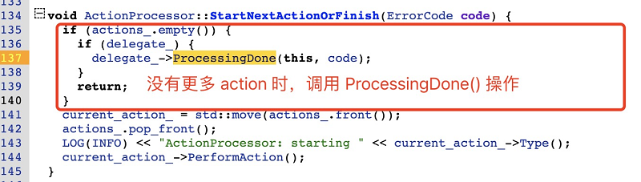
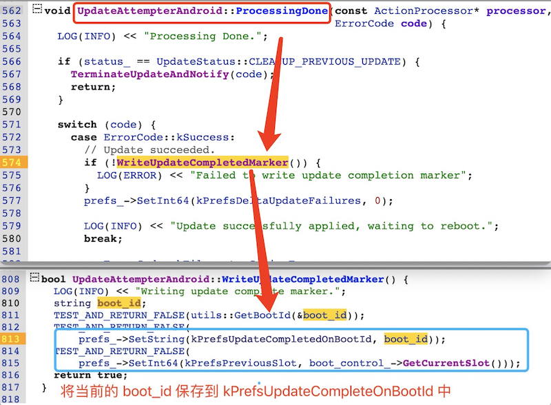

# 20230930-Android Update Engine 分析（二十六）OTA 更新后强制不切换 Slot 会怎么样？

## 0. 导读

成功更新数据后 prefs 状态是如何切换的？


上一篇[《Android Update Engine分析（二十五）升级状态 prefs 是如何保存的？》](https://blog.csdn.net/guyongqiangx/article/details/133421560) 主要分析了 Update Engine 中 prefs 的实现，以及对所有使用 prefs 的统计。在最后打算以 kPrefsBootId 为例，提供一些研究 prefs 的方法。

但随着学习的深入，发现 kPrefsBootId 的变化涉的内容很多。这个过程包括，系统升级，成功更新各分区镜像，接着写入 prefs 状态标记，设备重启，系统启动 Update Engine 服务进程，Update Engine 通过 prefs 数据检查 OTA 状态(包括 Slot 槽位切换)。

在我的 OTA 讨论群中曾经出现过一个问题，系统更新成功以后，不切换 Slot 槽位，重启后系统会提示升级失败。这到底是怎么回事呢？


其实这里升级成功，但不切换槽位导致的失败，和系统重启前对 prefs 设置，以及重启后对 prefs 数据和 OTA 状态的检查有关。

OTA 升级更新数据以后，暂不切换 Slot，等到某个时机成熟以后再切换槽位完成最后的升级的场景需求也是有的。但要如何操作？只有理解了 prefs 在 OTA 更新前后到底是如何变化，才有应对之法。


## 1. OTA 结束的设置操作

这个话题要从 OTA 升级结束的操作说起。

升级中，通过 ActionProcessor::StartNextActionOrFinish() 函数不断选择下一步的 Action。



当系统升级执行完所有的 Action 动作后，会调用 `UpdateAttempterAndroid::ProcessingDone()` 函数。


`ProcessingDone()` 函数根据 Action 返回结果执行不同的操作，主要分成两类：

1. OTA 更新数据成功；
2. OTA 更新数据的各种失败；


### 1.1 OTA 更新数据成功

对于成功写入 OTA 升级数据，此时的返回结果为 kSuccess，因此调用 WriteUpdateCompleteMarker() 函数，并随后将 kPrefsDeltaUpdateFailures 设置为 0。

在 WriteUpdateCompleteMarker() 函数中，主要做了两件事情：

1. 获取当前的 boot_id，保存到 `kPrefsUpdateCompletedOnBootId` 中。
2. 将当前系统的分区后缀保存到 `kPrefsPreviousSlot` 中，因为当前升级完成以后，会伴随系统的重启以及分区的切换(切换到升级的新系统中)。




> 对 linux 系统来说，每次启动都会在文件 "/proc/sys/kernel/random/boot_id" 中保存一个唯一的 id，任意的两次启动都不会有相同的 id。所以，如果两次获取的 boot_id 一样，则说明当前处于系统同一次启动的生命周期内。


### 1.2 OTA 更新数据失败

OTA 更新数据失败的情况并不是我们这里讨论的重点，但为了完整讨论 ProcessingDone() 函数，这里也简单说明一下。

当 OTA 更新数据发生各种失败时，调用函数 DeltaPerformer::ResetUpdateProgress() 将所有 OTA 升级进度相关的数据进行复位。包括：NextOperation, NextDataOffset, NextDataLength, SHA256Context, SignatureBlob, Manifest 等。


在[《Android Update Engine分析（二十五）升级状态 prefs 是如何保存的？》](https://blog.csdn.net/guyongqiangx/article/details/133421560)中，我贴过一些测试设备上的 prefs 状态数据例子，我重新截图如下:

.png)

从图上可以看到，截图中的大部分状态数据都会被 ResetUpdateProgress 函数重置。


## 2. Update Engine 启动后的检查操作

在介绍 Update Engine 启动检查 prefs 和 OTA 状态前，先回顾下 Update Engine 的启动流程。


### 2.1 Update Engine 启动流程

更多关于 Update Engine 服务端进程启动的细节，请参考博客：

- [《Android Update Engine分析（四）服务端进程》](https://blog.csdn.net/guyongqiangx/article/details/82116213)
- [《Android Update Engine分析（二十五）升级状态 prefs 是如何保存的？》](https://blog.csdn.net/guyongqiangx/article/details/133421560)

以下是 Update Engine 服务端进程启动时，函数的调用流程:

```
--> main(argc, argv)
  --> daemon = chromeos_update_engine::DaemonBase::CreateInstance() (返回 DaemonAndroid 实例)
  --> daemon->Run() (即: DaemonAndroid::Run())
    --> Deamon::Run() (执行父类的 Run())
      --> Daemon::OnInit() (虚函数，执行子类的 OnInit())
        --> DaemonAndroid::OnInit()
          --> daemon_state_ = new DaemonStateAndroid()
          --> daemon_state_->Initialize() (即: DaemonStateAndroid::Initialize())
          --> daemon_state_->AddObserver(binder_service_)
          --> daemon_state_->StartUpdater() (即: DaemonStateAndroid::StartUpdater())
            --> update_attempter_->Init() (即: UpdateAttempterAndroid::Init())
    --> message_loop_.PostTask(Daemon::OnEventLoopStartedTask)
    --> message_loop_.Run() (消息主循环)
    --> Daemon::OnShutdown(&exit_code_)
```


从上面的函数调用流程中可以看到，在 Update Engine 启动初始化的后期，会调用 UpdateAttempterAndroid::Init() 函数。在 UpdateAttempterAndroid::Init() 函数中，分成两种情况进行处理：

1. OTA 更新后还没有重启系统，但 Update Engine 因为某种情况重启了
2. OTA 更新后已经重启过系统，进入系统后启动了 Update Engine


### 2.2 OTA 更新后还没有重启系统

OTA 更新后还没有重启系统，但 Update Engine 因为某种意外重启了。

> 思考题：Update Engine 服务端进程是如何启动的？由谁启动的？

前面分析 Update Engine 启动流程时说过，启动的末期会调用函数 `UpdateAttempterAndroid::Init()`，在该函数中，读取当前系统的 boot_id 和上次成功写入数据时记录的 boot_id 比较。

如果两个 boot_id 一样，说明系统自从成功写入数据后还没有重启过，此时发送状态通知：更新后需要重启(UPDATE_NEED_REBOOT)。


### 2.3 OTA 更新后已经重启系统

如果 Update Engine 启动中发现 prefs 记录的 boot_id 和当前系统的 boot_id 不一样，说明自系统更新完数据后，已经重新启动过了。

此时先调用 GetOTAUpdateResult() 检查并返回 OTA 更新结果，然后调用 DidSystemReboot() 检查系统是否重启过，如果重启过了，就把 OTA 更新结果传递给  UpdateStateAfterReboot(result) 函数，用于更新系统的升级状态。

这部分代码如下：


这里主要有 3 个操作：

1. 调用 GetOTAUpdateResult() 检查并返回 OTA 更新结果；
2. 调用 DidSystemReboot() 检查系统是否重启过；
3. 调用 UpdateStateAfterReboot(result)，根据 OTA 更新结果更新系统状态；

下面逐个分析这 3 个操作函数，对操作细节不感兴趣的话，可以略过。


#### GetOTAUpdateResult() 函数

函数 GetOTAUpdateResult() 用于对升级结果的检查，不得不说，这个检查真的有点复杂：


我们之前讨论的升级流程是，数据更新成功后调用 WriteUpdateCompleteMarker() 函数写入标记，然后系统重启，并切换 slot 槽位。

所以，这里的 OTA 结果就通过检查 3 个条件来综合判断：

1. 检查数据更新成功后写入的标记

   - 检查升级数据写入成功后的标记 kPrefsUpdateCompleteOnBootId

2. 检查系统是否重启过
   - 比较 kPrefsBootId 和系统当前的 boot_id

3. 检查系统 slot 槽位是否发生了切换
   - 比较 kPrefsPreviousSlot 和当前系统的槽位 slot
   - 检查 kPrefsPreviousVersion 和当前系统属性 `ro.build.version.incremental`


根据 3 个条件的结果，讨论 4 类可能的情况：

- 如果检查到系统上次升级数据成功后写入的标记，并且系统重启了，而且槽位发生了切换，返回结果：升级成功(**OTA_SUCCESSFUL**)。

- 如果检查到系统上次升级数据成功后写入的标记，系统也重启了，但是槽位没有发生切换，那说明系统升级可能在哪里发生问题了导致系统槽位没有切换成功，返回结果：系统回滚(**ROLLED_BACK**)。

- 如果检查到系统上次升级数据成功后写入的标记，系统还没重启，返回结果：系统需要重启(**UPDATED_NEED_REBOOT**)。

- 如果连系统上次升级数据成功后写入的标记都没有检查到，那说明系统没有升级，返回结果：没有尝试过升级(**NOT_ATTEMPTED**)。


**重点：本文一开始提到的那个场景，系统更新成功以后，不切换 Slot 槽位，重启后系统会提示升级失败。你找到原因了吗？**


#### DidSystemReboot() 函数

检查当前系统在升级后是否重启过比较简单，就是将当前系统的 boot_id 和上一次启动 Update Engine 记录的 boot_id 进行比较，如果不一样，则说明重启过。


#### UpdateStateAfterReboot() 函数

UpdateStateAfterReboot(result) 函数使用 OTA 检查结果更新系统状态，决定下一步操作，函数代码有点长。

.png)


UpdateStateAfterReboot(result) 函数中，不论哪一种情况，都会进行以下操作：

1. 获取系统属性 `ro.build.version.incremental` 作为当前系统的版本号(实际上是系统的 fingerprint)
2. 获取当前 kernel 的 boot_id 并保存到 prefs 的 kPrefsBootId 中
3. 如果 prefs 中没有找到 kPrefsPreviousVersion 数据，说明当前的系统是刚出厂的新设备，或者是刚恢复出厂设置的设备(擦除了 /data 分区)，此时不存在任何的升级记录，将系统版本和和当前槽位分别保存到 kPrefsPreviousVersion 和 kPrefsPreviousSlot 中。

如果系统有 OTA 更新，但没有成功的情况下，使用 kPrefsNumReboots 记录设备的启动次数。

如果系统有 OTA 更新，但 OTA 检查的结果是回滚 (ROLLED_BACK)，则释放 apex 占用的空间，并复位进度。

如果系统有 OTA 更新，并且成功了，则保存当前的版本号(fingerprint)和槽位(slot)信息，并复位进度。


对于 LoadAndReportTimeToReboot() 函数，目前内部会读取 kPrefsSystemUpdatedMarker 数据，保存的是系统在完成 OTA 时的时间信息，但并没有做什么实际操作。


### 2.4 关于 kPrefsPreviousVersion  和 kPrefsPreviousSlot 

#### **kPrefsPreviousVersion **

这里的 kPrefsPreviousVersion 到底保存了什么数据？

不妨在设备上看看:

```bash
console:/data/misc/update_engine/prefs # xxd -g1 previous-version
00000000: 65 6e 67 2e 72 67 39 33 35 37 2e 32 30 32 32 31  eng.rg9357.20221
00000010: 30 31 30 2e 32 31 30 36 31 36                    010.210616
console:/data/misc/update_engine/prefs # 
```

也可以直接在编译生成的 dist 目录中搜索查看 "ro.build.version.incremental" 属性:

```bash
$ grep "ro.build.version.incremental" out/dist/build.prop 
ro.build.version.incremental=eng.rg9357.20221010.210616
$
```

所以，这里 `previous-version` 保存的就是系统的 fingerprint


#### **kPrefsPreviousSlot** 

另外，在我的测试设备上运行的是 Android R(11) 的代码，还没有 kPrefsPreviousSlot 数据。

查看官方源码，kPrefsPreviousSlot 在下面这个更改中加入:

.png)

> 在线源码:
>
> https://cs.android.com/android/_/android/platform/system/update_engine/+/866034758956e0c47ab2e642c4ed8fdfa3e88a72


### 2.5 总结


### 3. 问题

回到问题：OTA 更新后强制不切换 Slot 会怎么样？

答案就是：重启后系统会提示升级失败，具体原因是系统重启后，在 Update Engine 启动中会检查 OTA 升级结果。

能检查到系统上次升级数据成功后写入的标记，系统也重启了，但是槽位没有发生切换，按照一般的系统操作场景的理解，说明系统升级可能在哪里发生问题了导致系统槽位没有切换成功，最终返回 OTA 结果：系统回滚(**ROLLED_BACK**)。

对于系统回滚 (ROLLED_BACK)，就意味着升级失败了，此时进行失败的清理操作，复位升级数据。


但是，实际上我们是有这个需求的：

OTA 升级更新数据以后，暂不切换 Slot，等到某个时机成熟以后再切换槽位完成最后的升级。

例如，OTA 讨论群中提到的场景，车机升级时主系统(Android)更新了，此时还要等待各种其它设备(MCU)也完成了升级，整个系统才触发 Slot 切换转到新系统。


所以，对于这个场景，该如何修改代码来实现呢？


