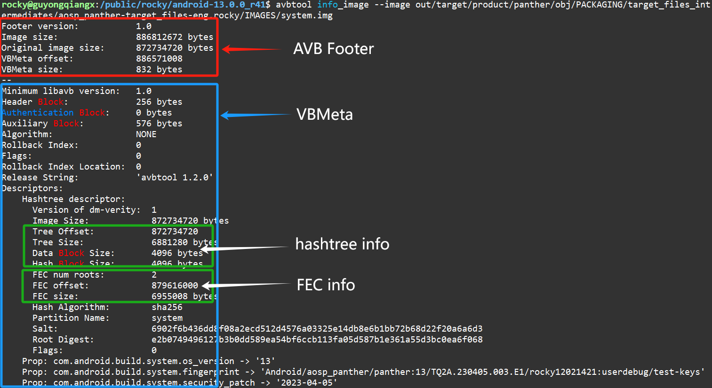

# AVB 数据实战之 system.img

## 1. 前言

在上一篇[《AVB 数据实战之 boot.img》]()中分析了使用 `add_hash_footer` 操作的 boot.img 镜像的格式。

本篇进一步分析 `add_hashtree_footer` 操作的 system.img 镜像的格式。


因此，system.img 都包含哪些数据，你有尝试亲自去分析 system.img 吗？

一个 system 分区的镜像，为了满足 AVB 需要，需要进行如何处理？


本文以实际操作的形式，带你查看 system.img 镜像，包括 avbtool 的多个操作，以及如何如何手动解析 AVB Footer，如何使用 shell 命令验证带有 salt 的镜像 hash 值。


如果觉得实际操作比较返回，请转到第 4 节，查看 avbtool 命令，以及 boot.img 的格式总结。

## 2. 环境

具体的环境搭建，请参考[《AVB 数据实战之 boot.img》]()第二节中关于环境搭建的内容。

这里就基于其生成的 system.img 进行分析分析。


## 3. 操作

### 1. 使用 avbtool 处理 system.img

在编译 log 文件 `make-dist-20241202-avbtool.log` 中查看 avbtool 用于 system.img 的操作，再回到完整的 log 文件中查看，原始的对 system.img 操作的 log 是这样的：

```bash
2024-12-02 14:54:27 - common.py - INFO    :   Running: "/local/public/users/rocky/android-13.0.0_r41/out/host/linux-x86/bin/avbtool add_hashtree_footer --partition_size 886812672 --partition_name system --image /local/public/users/rocky/android-13.0.0_r41/out/target/product/panther/obj/PACKAGING/target_files_intermediates/aosp_panther-target_files-eng.rocky/IMAGES/system.img --salt 6902f6b436dd8f08a2ecd512d4576a03325e14db8e6b1bb72b68d22f20a6a6d3 --hash_algorithm sha256 --prop com.android.build.system.os_version:13 --prop com.android.build.system.fingerprint:Android/aosp_panther/panther:13/TQ2A.230405.003.E1/rocky12021421:userdebug/test-keys --prop com.android.build.system.security_patch:2023-04-05"
```

> 特别注意：这里的 avbtool 处理的是 target 包目录 `aosp_panther-target_files-eng.rocky/IMAGES` 下的 `system.img`。
>
> 对于 `out/target/product/panther/system.img`，其处理也类似。


根据 log 中的信息，看起来是对 `aosp_panther-target_files-eng.rocky/IMAGES` 文件夹下面的 system.img 进行处理。

为了显示方便，整理一下具体的处理命令，如下：

```bash
avbtool add_hashtree_footer \
	--partition_size 886812672 \
	--partition_name system \
	--image aosp_panther-target_files-eng.rocky/IMAGES/system.img \
	--salt 6902f6b436dd8f08a2ecd512d4576a03325e14db8e6b1bb72b68d22f20a6a6d3 \
	--hash_algorithm sha256 \
	--prop com.android.build.system.os_version:13 \
	--prop com.android.build.system.fingerprint:Android/aosp_panther/panther:13/TQ2A.230405.003.E1/rocky12021421:userdebug/test-keys \
	--prop com.android.build.system.security_patch:2023-04-05
```


简单来说，就是对 system.img 执行 `add_hashtree_footer` 操作。

> 注意：这里并没有传入 `-key` 参数，所以不会对 `system.img` 进行签名。


### 2. 使用 avbtool 查看 system.img

我们使用 avbtool 工具的 `info_image` 查看下生成的 boot.img 文件：

```bash
$ avbtool info_image --image out/target/product/panther/obj/PACKAGING/target_files_intermediates/aosp_panther-target_files-eng.rocky/IMAGES/system.img
Footer version:           1.0
Image size:               886812672 bytes
Original image size:      872734720 bytes
VBMeta offset:            886571008
VBMeta size:              832 bytes
--
Minimum libavb version:   1.0
Header Block:             256 bytes
Authentication Block:     0 bytes
Auxiliary Block:          576 bytes
Algorithm:                NONE
Rollback Index:           0
Flags:                    0
Rollback Index Location:  0
Release String:           'avbtool 1.2.0'
Descriptors:
    Hashtree descriptor:
      Version of dm-verity:  1
      Image Size:            872734720 bytes
      Tree Offset:           872734720
      Tree Size:             6881280 bytes
      Data Block Size:       4096 bytes
      Hash Block Size:       4096 bytes
      FEC num roots:         2
      FEC offset:            879616000
      FEC size:              6955008 bytes
      Hash Algorithm:        sha256
      Partition Name:        system
      Salt:                  6902f6b436dd8f08a2ecd512d4576a03325e14db8e6b1bb72b68d22f20a6a6d3
      Root Digest:           e2b0749496127b3b0dd589ea54bf6ccb113fa05d587b1e361a55d3bc0ea6f068
      Flags:                 0
    Prop: com.android.build.system.os_version -> '13'
    Prop: com.android.build.system.fingerprint -> 'Android/aosp_panther/panther:13/TQ2A.230405.003.E1/rocky12021421:userdebug/test-keys'
    Prop: com.android.build.system.security_patch -> '2023-04-05'
```


主要部分和上一篇[《AVB 数据实战之 boot.img》]()的基本一样，但又略有不同，多了 Hashtree 和 FEC 相关的信息，如下：



这里的数据重点如下：

- AVB Footer 数据

  - AVB Footer 版本: `1.0`

  - 处理后的 system.img 镜像大小为 886812672 字节( 4K 粒度对齐)，给 avbtool 传入的参数指定了这个值。

  - 原始的不带任何额外数据的 system.img 镜像为 872734720 字节 (可以通过 `avbtool erase_footer` 移除额外的 AVB 数据来还原原始的镜像)

  - AVB 的元数据 VBMeta 大小为 832 字节，位于偏移量为 886571008 的位置(原始镜像结束的地方)

- VBMeta 数据

  - 头部各块数据大小(Header, Authentication, Auxiliary 等数据)

  - Authentication Block 大小为 0，所以不带有签名数据(在 vbmeta_system.img 中单独处理)

  - 回滚 Index 值：0

  - 包含了 1 个哈希树(hashtree)描述符
    - hashtree 位置: 872734720，大小: 6881280
    - FEC 位置: 879616000, 大小: 6955008
    - Salt 值和 Root 哈希值

  - 包含了 3 个 Prop 属性


### 3. 使用 avbtool 添加的额外数据

当使用 avbtool 对原来的 `system.img` 执行 `add_hashtree_footer` 操作时到底添加了哪些数据呢？

1. 写入原始未经处理的镜像 system.img，共 872734720 字节(0x3404E000)
2. 计算原始镜像的 hashtree，并从原始数据结束的地方开始写入 (0x3404E000)，大小为 6881280 字节(即 0x69000)
3. 计算原始镜像和 hashtree 数据的 FEC 数据，用于纠错。FEC 数据从 hashtree 结束的地方(879616000=872734720+6881280，即 0x346DE000)开始写入，大小 6955008字节(0x6A2000)。
4. 将原始镜像 system.img 计算得到的 VBMeta 元数据存放在 FEC 数据结束的地方(886571008=879616000+6955008，即 0x34D80000)，大小为 832 字节(占用 4K Block)
5. 将新镜像填充到指定的 `partition_size` 大小(通过参数指定:`--partition_size 886812672`)
6. 在新镜像的最后 4K block 的最后 64 字节写入 AVB Footer 内容


> 注：所有操作都按照 4K 页面进行
>
> 例如：
>
> 1. 原始镜像大小为 4K block 整数倍，结束的地方 4K 对齐
> 2. hashtree 数据大小为 4K  block 整数倍
> 3. FEC 数据大小为 4K block 整数倍
> 4. VBMeta 存放在 4K 起始位置，并且填充到 4K 对齐(这里实际 832 字节，最终占用 4K)
> 5. 如果需要填充，则填充到指定大小 - 4K，因为最后 4K 放 AVB Footer
> 6. 最后 1 个 4K 结束位置的 64 字节写入 AVB Footer


所以，最终的 system.img 格式如下：

```bash
system.img layout (4K aligned):
+--------------------------------+ 0x0
|      Original System Image     |
|      (system partition)        |
+--------------------------------+ original_image_size
|                                |
|      Hash Tree                 |
|      (Merkle Tree)             |
|                                |
+--------------------------------+ tree_offset + tree_size
|                                |
|      FEC Data                  | (Optional)
|                                |
+--------------------------------+ fec_offset + fec_size
|      AVB VBMeta                |
|      - Header                  |
|      - Authentication Block    |
|      - Hashtree Descriptor     |
|      - Properties              |
+--------------------------------+ vbmeta_offset + vbmeta_size
|                                |
|      Padding                   |
|                                |
+--------------------------------+  <-- Last 4KB offset
|      (4KB)                     |
|      AVB Footer                |  <-- Last 64 bytes
+--------------------------------+  <-- partition_size
```


总体来说，使用 `add_hashtree_footer` 操作的镜像处理后包含以下 5 块数据：

- 原始分区镜像
- hashtree 数据，位置从原始镜像结束开始
- FEC 数据，位置从 hashtree 数据结束开始
- AVB 元数据 (VBMeta)，位置从 FEC 数据结束开始
- AVB Footer 数据，最后一个 4K block 的最后 64 个字节


### 4. 查验 system.img 中额外添加的数据

为了证实上一节的结论，即：使用 `add_hashtree_footer` 操作的镜像处理后包含以下 5 块数据：

- 原始分区镜像
- hashtree 数据，位置从原始镜像结束开始
- FEC 数据，位置从 hashtree 数据结束开始
- AVB 元数据 (VBMeta)，位置从 FEC 数据结束开始
- AVB Footer 数据，最后一个 4K block 的最后 64 个字节

#### 查看 AVB Footer

整个 64M 镜像最后 4K 的起始地址为 0x34DB A000 (886808576=886812672-4096)，这里查看从 0x34DB A000 开始的 4096 字节：

```
$ hexdump -C -s 0x34DBA000 -n 4096 out/target/product/panther/obj/PACKAGING/target_files_intermediates/aosp_panther-target_files-eng.rocky/IMAGES/system.img
34dba000  00 00 00 00 00 00 00 00  00 00 00 00 00 00 00 00  |................|
*
34dbafc0  41 56 42 66 00 00 00 01  00 00 00 00 00 00 00 00  |AVBf............|
34dbafd0  34 04 e0 00 00 00 00 00  34 d8 00 00 00 00 00 00  |4.......4.......|
34dbafe0  00 00 03 40 00 00 00 00  00 00 00 00 00 00 00 00  |...@............|
34dbaff0  00 00 00 00 00 00 00 00  00 00 00 00 00 00 00 00  |................|
34dbb000
```

可以看到，这里最后 64 直接为 AVB Footer。

可以根据文件 `external/avb/libavb/avb_footer.h` 中定义的 AVB Footer 来手动解析一下：

```c
/* Magic for the footer. */
#define AVB_FOOTER_MAGIC "AVBf"
#define AVB_FOOTER_MAGIC_LEN 4

/* Size of the footer. */
#define AVB_FOOTER_SIZE 64

/* The current footer version used - keep in sync with avbtool. */
#define AVB_FOOTER_VERSION_MAJOR 1
#define AVB_FOOTER_VERSION_MINOR 0

/* The struct used as a footer used on partitions, used to find the
 * AvbVBMetaImageHeader struct. This struct is always stored at the
 * end of a partition.
 */
typedef struct AvbFooter {
  /*   0: Four bytes equal to "AVBf" (AVB_FOOTER_MAGIC). */
  uint8_t magic[AVB_FOOTER_MAGIC_LEN];
  /*   4: The major version of the footer struct. */
  uint32_t version_major;
  /*   8: The minor version of the footer struct. */
  uint32_t version_minor;

  /*  12: The original size of the image on the partition. */
  uint64_t original_image_size;

  /*  20: The offset of the |AvbVBMetaImageHeader| struct. */
  uint64_t vbmeta_offset;

  /*  28: The size of the vbmeta block (header + auth + aux blocks). */
  uint64_t vbmeta_size;

  /*  36: Padding to ensure struct is size AVB_FOOTER_SIZE bytes. This
   * must be set to zeroes.
   */
  uint8_t reserved[28];
} AVB_ATTR_PACKED AvbFooter;
```


解析结果：

```
              magic( 4): 41 56 42 66              -> magic: "AVBf"
      version_major( 4): 00 00 00 01              -> major: 1
      version_minor( 4): 00 00 00 00              -> minor: 0
original_image_size( 8): 00 00 00 00  34 04 e0 00 -> 0x00000000 3404e000 = 872734720
      vbmeta_offset( 8): 00 00 00 00  34 d8 00 00 -> 0x00000000 34d80000 = 886571008
        vbmeta_size( 8): 00 00 00 00  00 00 03 40 -> 0x00000000 00000680 = 832
```

所以，通过最后 64 字节的 AVB Footer 解析得到以下内容：

```
Footer version:           1.0
Image size:               886812672 bytes
Original image size:      872734720 bytes
VBMeta offset:            886571008
VBMeta size:              832 bytes
```


#### 查看 hashtree 数据

从前面可以看到，原始镜像大小为 872734720 字节，hashtree 数据紧挨着这个位置存放，所以偏移位置 0x3404E000 开始，我们看下从 0x3404E000  开始的这 256 字节数据：

```
$ hexdump -C -s 0x3404E000 -n 256 out/target/product/panther/obj/PACKAGING/target_files_intermediates/aosp_panther-target_files-eng.rocky/IMAGES/system.img
3404e000  c0 e9 8a bf 42 81 e0 b3  c4 00 77 91 9b ad 59 df  |....B.....w...Y.|
3404e010  71 93 89 01 9b 9f f0 85  58 68 08 46 cb 6a f0 59  |q.......Xh.F.j.Y|
3404e020  14 bf ba ec e2 08 0d 74  a0 34 a3 da 98 22 59 dd  |.......t.4..."Y.|
3404e030  14 bc 8b ea 80 44 99 ce  02 a0 71 1c 15 77 83 43  |.....D....q..w.C|
3404e040  e8 79 a6 b1 b9 2e 58 4c  0d 08 9e 3f 25 39 b2 14  |.y....XL...?%9..|
3404e050  a4 bd 62 4f c5 47 b9 45  4b 10 a1 05 12 f2 08 6c  |..bO.G.EK......l|
3404e060  8b 23 76 09 53 72 09 25  9d 90 cd b8 98 9a 10 39  |.#v.Sr.%.......9|
3404e070  9c d1 7d 82 11 26 64 63  ae 15 2d 4e bd 10 1a 39  |..}..&dc..-N...9|
3404e080  1b 94 55 3f 4f 49 5d f5  c0 92 af a8 ac 53 0c da  |..U?OI]......S..|
3404e090  a5 fa 03 95 44 9f 66 28  2c 94 71 0c dd 4f 8f e1  |....D.f(,.q..O..|
3404e0a0  2b 82 ca db ce 27 f4 32  28 c5 16 18 d6 53 ac ca  |+....'.2(....S..|
3404e0b0  a6 4e 2c 6a ed 92 dc 82  9f d4 ff 89 08 0e d3 15  |.N,j............|
3404e0c0  02 3e 14 ef b6 0b 3a 08  a0 28 60 97 ca 5f d8 07  |.>....:..(`.._..|
3404e0d0  7c 37 bd d1 cf 54 6e 71  03 3b fc b7 4e 77 6e 04  ||7...Tnq.;..Nwn.|
3404e0e0  84 d6 f6 b7 7b e5 ba 28  70 50 20 00 31 cf b0 ea  |....{..(pP .1...|
3404e0f0  d3 b2 7f 7b 45 67 44 e3  86 53 ad 58 e6 fa 8d 42  |...{EgD..S.X...B|
3404e100
```

从输出的内容看，从位置 0x3404E000 开始就是 hashtree 数据了。 

由于引入了 Salt，所以第一块数据的 hash 值应该基于 32 字节的 Salt 数据，以及第一块 4K 数据进行计算。

我们试着计算第一块 hash 数据：

```
# 1. convert system salt string to binary data
$ echo -n "6902f6b436dd8f08a2ecd512d4576a03325e14db8e6b1bb72b68d22f20a6a6d3" | xxd -r -ps > system-salt.bin
$ hexdump -Cv system-salt.bin 
00000000  69 02 f6 b4 36 dd 8f 08  a2 ec d5 12 d4 57 6a 03  |i...6........Wj.|
00000010  32 5e 14 db 8e 6b 1b b7  2b 68 d2 2f 20 a6 a6 d3  |2^...k..+h./ ...|
00000020

# 2. first 4K data of system.img
$ dd if=out/target/product/panther/obj/PACKAGING/target_files_intermediates/aosp_panther-target_files-eng.rocky/IMAGES/system.img of=system-1st-4k.bin bs=4096 count=1
1+0 records in
1+0 records out
4096 bytes (4.1 kB, 4.0 KiB) copied, 0.000316474 s, 12.9 MB/s

# 3. calculate first sha256 of (system-salt.bin + system-1st-4k.bin)

```


这里的重点是解析 AVB Footer，并提取信息查看 VBMeta 的具体位置。但关于 VBMeta 数据具体内容的解析不是这里的重点，所以暂时略过。


#### 查看 FEC 数据

#### 查看 VBMeta 数据


### 5. 其它操作

#### 1. 还原原始的 system.img 镜像

可以通过 avbtool 的 `erase_footer` 命令来还原原始镜像。

为了不破坏原始数据，这里先将生成的 system.img 复制为 system1.img，然后基于 system1.img 进行操作：

```bash
$ cp out/target/product/panther/boot.img boot1.img
$ avbtool erase_footer --image boot1.img 
$ ls -al boot1.img 
-rw-r--r-- 1 rocky users 24981504 Dec  3 15:57 boot1.img
```

从这里可以看到，当移除了 VBMeta，AVB Footer 以及填充后，boot1.img 恢复到了原始镜像的 24981504 字节大小。

#### 2. 验证原始的 system.img 镜像加 salt 后的哈希值

在分析 boot.img 时，提到了 boot.img 的 VBMeta 中包含了一个 Hash Descriptor:

```bash
    Hash descriptor:
      Image Size:            24981504 bytes
      Hash Algorithm:        sha256
      Partition Name:        boot
      Salt:                  9f4a6530e6ce8d00b77548ed0ad00344cd7724f83ca0bf9a8f0ad9ea4c366b41
      Digest:                e355127406fbce41f1cd044e6ab06aff4c24a36e9984bceb3cc59d3f14a66be1
      Flags:                 0
```

我们可以通过上一步还原的 boot1.img 以及这里使用的 Salt 值验证 Digest 值：

```
# 1. 将 Salt 转换成二进制文件
$ echo -n "9f4a6530e6ce8d00b77548ed0ad00344cd7724f83ca0bf9a8f0ad9ea4c366b41" | xxd -r -ps > salt.bin
$ hexdump -Cv salt.bin 
00000000  9f 4a 65 30 e6 ce 8d 00  b7 75 48 ed 0a d0 03 44  |.Je0.....uH....D|
00000010  cd 77 24 f8 3c a0 bf 9a  8f 0a d9 ea 4c 36 6b 41  |.w$.<.......L6kA|
00000020

# 2. 将 salt.bin 和 boot1.img 合并到一起计算 sha256 哈希
$ cat salt.bin boot1.img | sha256sum
e355127406fbce41f1cd044e6ab06aff4c24a36e9984bceb3cc59d3f14a66be1  -
```


从上面可以看到，将 Salt 的内容添加到原始镜像的签名再计算 SHA256 哈希，确实得到了 Hash Descriptor 中的 Digest 值。

各种安全算法中所谓的加盐操作，实际上就是将一个随机的二进制数据添加到需要计算的数据前面，然后再对数据进行所需要的操作。

## 4. 总结


### 2. boot.img 镜像格式

当使用 avbtool 对原始的 boot.img 镜像执行 `add_hash_footer` 操作时，主要发生了以下变化：

1. 写入原始未经处理的镜像 boot.img
2. 将原始镜像 boot.img 计算得到的 VBMeta 元数据存放在原始镜像结束的地方（4K 对齐)
3. 将新镜像填充到指定大小（例如 64M 大小）
4. 在新镜像的最后 64 字节直接写入 AVB Footer 内容

> 注：所有操作都按照 4K 页面对齐进行


所以，最终的 boot.img 格式如下：

```bash
+--------------------------------+ 0x0
|      Original System Image     |
|      (system partition)        |
+--------------------------------+ original_image_size
|                                |
|      Hash Tree                 |
|      (Merkle Tree)             |
|                                |
+--------------------------------+ tree_offset + tree_size
|                                |
|      FEC Data                  | (Optional)
|                                |
+--------------------------------+ fec_offset + fec_size
|      AVB VBMeta                |
|      - Header                  |
|      - Authentication Block    |
|      - Hashtree Descriptor     |
|      - Properties              |
+--------------------------------+ vbmeta_offset + vbmeta_size
|                                |
|      Padding                   |
|                                |
+--------------------------------+  <-- Last 4KB offset
|      (4KB)                     |
|      AVB Footer                |  <-- Last 64 bytes
+--------------------------------+  <-- partition_size
```


总体来说，使用 `add_hash_footer` 操作的镜像处理后包含以下 3 块数据：

- Original Data: 原始分区镜像
- VBMeta: AVB 元数据 (VBMeta)，位置从原始镜像结束开始
- AVB Footer: AVB Footer 数据，最后一个 4K 页面的最后 64 个字节

本文的内容除了分析 boot.img 之外，也适合任何其它基于 `add_hash_footer` 操作的镜像，例如 dtbo.img，或者 radio.img 这类小分区镜像。因为较大分区(如 system, vendor, product 等)镜像会使用 `add_hashtree_footer` 操作。

## 5. 其它

我创建了一个 Android AVB 讨论群，主要讨论 Android 设备的 AVB 验证问题。

我还几个 Android OTA 升级讨论群，主要讨论 Android 设备的 OTA 升级话题。

欢迎您加群和我们一起交流，请在加我微信时注明“Android AVB 交流”或“Android OTA 交流”。

仅限 Android 相关的开发者参与~

> 公众号“洛奇看世界”后台回复“wx”获取个人微信。

