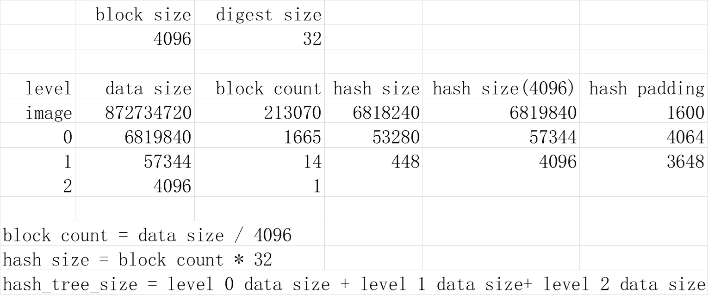
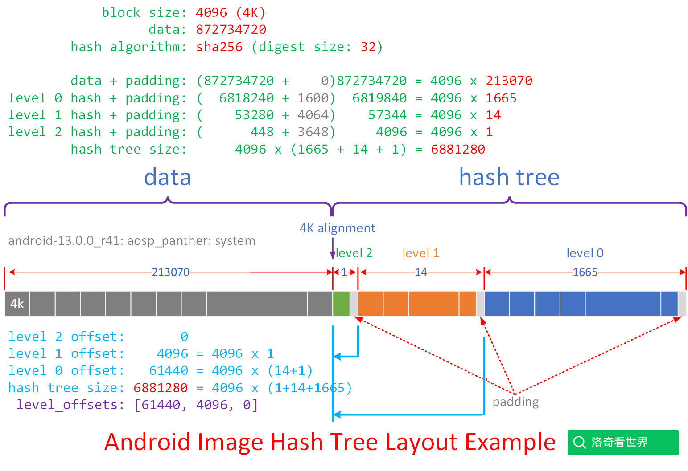

# 20241213-AVB 的哈希树到底是如何生成的？

## 1. 前言

Android 编译时会调用 avbtool 对 system, vendor, product 等镜像生成 hashtree，但这里的 hashtree 到底是如何生成的呢？本篇以 android-13.0.0_r41 中编译 aosp_panther 目标的 system 镜像为例。探究下 system.img 的 hashtree 到底是如何生成的。

主要包含两部分，

1. 从代码探究 hashtree 到底是如何生成的？
2. 使用编译生成的镜像，通过实战验证 hashtree 数据


## 2. 使用 avbtool 处理和查看 system.img

### 2.1 使用 avbtool 给 system.img 添加 hashtree 

搜索编译 log，会发现编译中会调用下面的命令处理 target 包中的 system 镜像：

```
avbtool add_hashtree_footer \
	--partition_size 886812672 \
	--partition_name system \
	--image IMAGES/aosp_panther-target_files-eng.rocky/system.img \
	--salt 6902f6b436dd8f08a2ecd512d4576a03325e14db8e6b1bb72b68d22f20a6a6d3 \
	--hash_algorithm sha256 \
	--prop com.android.build.system.os_version:13 \
	--prop com.android.build.system.fingerprint:Android/aosp_panther/panther:13/TQ2A.230405.003.E1/rocky12021421:userdebug/test-keys \
	--prop com.android.build.system.security_patch:2023-04-05
```


> **特别说明**
>
> 1. 命令中指定参数“--partition_size 886812672”，目的是将 system.img 经过 AVB 工具一系列处理之后，得到一个新的大小和分区一样(886812672)的 system.img。但原始的 system.img 并不是 886812672，在我的机器上编译出来的原始的 system.img 的大小为 872734720。
> 2. 如果没有指定 `--salt 6902f6b43...a6d3` 参数，则 avbtool 会自动从 `/dev/urandom` 读取 32 字节作为 sha256 哈希算法的 salt


### 2.2 使用 avbtool 查看 system.img 信息

我们用 avbtool 查看下处理后的 system.img 信息:

```
$ avbtool info_image --image system.img
Footer version:           1.0
Image size:               886812672 bytes
Original image size:      872734720 bytes
VBMeta offset:            886571008
VBMeta size:              832 bytes
--
Minimum libavb version:   1.0
Header Block:             256 bytes
Authentication Block:     0 bytes
Auxiliary Block:          576 bytes
Algorithm:                NONE
Rollback Index:           0
Flags:                    0
Rollback Index Location:  0
Release String:           'avbtool 1.2.0'
Descriptors:
    Hashtree descriptor:
      Version of dm-verity:  1
      Image Size:            872734720 bytes
      Tree Offset:           872734720
      Tree Size:             6881280 bytes
      Data Block Size:       4096 bytes
      Hash Block Size:       4096 bytes
      FEC num roots:         2
      FEC offset:            879616000
      FEC size:              6955008 bytes
      Hash Algorithm:        sha256
      Partition Name:        system
      Salt:                  6902f6b436dd8f08a2ecd512d4576a03325e14db8e6b1bb72b68d22f20a6a6d3
      Root Digest:           e2b0749496127b3b0dd589ea54bf6ccb113fa05d587b1e361a55d3bc0ea6f068
      Flags:                 0
    Prop: com.android.build.system.os_version -> '13'
    Prop: com.android.build.system.fingerprint -> 'Android/aosp_panther/panther:13/TQ2A.230405.003.E1/rocky12021421:userdebug/test-keys'
    Prop: com.android.build.system.security_patch -> '2023-04-05'
```


## 3. system.img 的 hashtree 是如何生成的？

使用 avbtool 的 `add_hashtree_footer` 操作处理 system.img 或者 vendor.img 时，hashtree 的生成是在 `add_hashtree_footer()` 函数中通过调用 `generate_hash_tree()` 来完成的。


### 3.1 generate_hash_tree() 函数注释

我们看下 `generate_hash_tree()` 函数的具体实现：

> 在线代码：https://xrefandroid.com/android-13.0.0_r83/xref/external/avb/avbtool.py#generate_hash_tree


对于一个大小为 872734720 bytes 的 system 分区，block size 为 4096 (4K)，哈希算法为 sha256, 随机盐为 6902f6b436dd8f08a2ecd512d4576a03325e14db8e6b1bb72b68d22f20a6a6d3，提前计算好 digest_padding, hash_level_offsets, tree_size 并传入：

```
        image_size: 872734720
        block_size: 4096
     hash_alg_name: sha256
              salt: 6902f6b436dd8f08a2ecd512d4576a03325e14db8e6b1bb72b68d22f20a6a6d3
    digest_padding: 0
hash_level_offsets: [61440, 4096, 0]
         tree_size: 6881280
```

其中，hash_level_offsets 和 tree_size 是通过 `calc_hash_level_offsets()` 计算出来的。

尤其是 hash_level_offsets 比较难理解，`calc_hash_level_offsets()` 函数的注释附带在后面。


这里将函数 `generate_hash_tree()` 完整的代码注释如下：

```python
def generate_hash_tree(image, image_size, block_size, hash_alg_name, salt,
                      digest_padding, hash_level_offsets, tree_size):
    """生成文件的 Merkle 树。

    Arguments:
      image: 图像文件对象
      image_size: 图像文件的大小
      block_size: 块大小,例如 4096
      hash_alg_name: 哈希算法名称,例如 'sha256' 或 'sha1'
      salt: 用于哈希计算的盐值
      digest_padding: 每个摘要的填充值(填充到 2^n 值，sha256 值长度为 32=2^5 字节，不用填充)
      hash_level_offsets: 从 calc_hash_level_offsets() 计算得到的偏移量
      tree_size: 树的总字节数大小

    Returns:
      返回一个元组,第一个元素是顶层哈希值(bytes),第二个元素是完整的哈希树(bytes)
    """
    # 创建一个指定大小的字节数组用于存储哈希树
    hash_ret = bytearray(tree_size)

    # 初始化源数据的偏移量为0
    hash_src_offset = 0

    # 初始化源数据的大小为输入图像的大小
    hash_src_size = image_size

    # 初始化当前处理的树层级为0
    level_num = 0

    # 当源数据大小大于块大小时,继续构建哈希树的下一层
    while hash_src_size > block_size:
        # 用于存储当前层级的所有哈希值
        level_output_list = []

        # 记录剩余需要处理的数据大小
        remaining = hash_src_size

        # 处理当前层级的所有数据块
        while remaining > 0:
            # 创建一个新的哈希器实例,使用指定的算法和盐值
            hasher = create_avb_hashtree_hasher(hash_alg_name, salt)

            # 对于第0层,直接从输入文件读取数据
            # 对于其他层,从已构建的哈希树中读取数据
            if level_num == 0:
                image.seek(hash_src_offset + hash_src_size - remaining)
                data = image.read(min(remaining, block_size))
            else:
                offset = hash_level_offsets[level_num - 1] + hash_src_size - remaining
                data = hash_ret[offset:offset + block_size]

            # 更新哈希值
            hasher.update(data)

            # 更新剩余需要处理的数据大小
            remaining -= len(data)

            # 如果数据块小于块大小,用0填充
            if len(data) < block_size:
                hasher.update(b'\0' * (block_size - len(data)))

            # 将计算出的哈希值添加到当前层级的输出列表
            level_output_list.append(hasher.digest())

            # 如果需要填充摘要,添加填充
            if digest_padding > 0:
                level_output_list.append(b'\0' * digest_padding)

        # 将当前层级的所有哈希值连接成一个字节串
        level_output = b''.join(level_output_list)

        # 计算需要的填充以使输出大小为块大小的整数倍
        padding_needed = (round_to_multiple(
            len(level_output), block_size) - len(level_output))
        level_output += b'\0' * padding_needed

        # 将当前层级的输出复制到最终的哈希树中
        offset = hash_level_offsets[level_num]
        hash_ret[offset:offset + len(level_output)] = level_output

        # 准备处理下一层级
        hash_src_size = len(level_output)
        level_num += 1

    # 计算根哈希值
    hasher = create_avb_hashtree_hasher(hash_alg_name, salt)
    hasher.update(level_output)

    # 返回根哈希值和完整的哈希树
    return hasher.digest(), bytes(hash_ret)
```


`generate_hash_tree()` 函数实现了 Merkle 树的构建过程。Merkle 树是一种树形数据结构,其中每个非叶节点都是其子节点的哈希值。在这个实现中:

1. 首先将输入数据分成固定大小的块(block_size)，Android 里面的 block_size=4096 (4K)
2. 在第 0 层，对每个块计算哈希值, 形成树的叶子节点
3. 然后将第 0 层计算得到的哈希值分组, 每组再计算一个新的哈希值, 形成上一层节点
4. 重复这个过程直到最后只剩一个哈希值, 即根节点(root hash)
5. 所有的哈希值都使用指定的哈希算法(hash_alg_name)计算, 并且在计算时会加入盐值(salt)
6. 最终返回根哈希值(root hash)和完整的哈希树(hash tree)结构

这种树状结构的主要用途是快速验证大型数据集的完整性, 因为只需要验证改变数据块的路径上的哈希值,而不需要重新计算整个数据集的哈希值。


### 3.2 `calc_hash_level_offsets()` 函数注释

`generate_hash_tree()`  函数的参数 hash_level_offsets 和 tree_size 是通过 `calc_hash_level_offsets()` 计算出来的。

尤其是 hash_level_offsets 比较难理解，下面是这个函数逐行的注释。

```python
def calc_hash_level_offsets(image_size, block_size, digest_size):
    # 函数功能：计算Merkle树中所有哈希层级的偏移量
    # 参数说明：
    # image_size: 需要计算Merkle树的镜像文件大小
    # block_size: 数据块大小，例如4096字节
    # digest_size: 每个哈希值的大小，例如SHA-256为32字节

    # 初始化三个关键变量：
    level_offsets = []  # 存储每一层在最终树中的起始位置
    level_sizes = []    # 存储每一层所需的字节数
    tree_size = 0       # 累计整个树结构所需的总字节数

    # 初始化计数器和大小变量
    num_levels = 0      # 记录树的总层数
    size = image_size   # 从完整镜像大小开始计算

    # 自下而上计算每一层的大小，直到当前层的大小小于等于块大小
    while size > block_size:
        # 计算当前层需要多少个块来存储哈希值
        # (size + block_size - 1) // block_size 是向上填充到 block_size 取整除法
        # 例如：如果size=4097，block_size=4096，则需要2个块
        num_blocks = (size + block_size - 1) // block_size

        # 计算当前层所有哈希值需要的总字节数
        # num_blocks * digest_size：所有哈希值的原始大小
        # round_to_multiple：将结果调整为block_size的整数倍，确保存储对齐
        level_size = round_to_multiple(num_blocks * digest_size, block_size)

        # 记录当前层的信息
        level_sizes.append(level_size)    # 保存当前层的大小
        tree_size += level_size           # 更新树的总大小
        num_levels += 1                   # 层数加1

        # 更新size为当前层的大小，用于下一轮循环
        # 因为上一层要对当前层的数据进行哈希
        size = level_size

    # 这里比较难理解!!!
    # 计算每一层的偏移量，注意这个循环是自底向上存储的
    for n in range(0, num_levels):
        offset = 0
        # 计算当前层的偏移量
        # 偏移量等于所有上层大小的总和
        # 这样可以将所有层按从上到下的顺序存储在内存中
        for m in range(n + 1, num_levels):
            offset += level_sizes[m]
        level_offsets.append(offset)

    # 返回计算结果：
    # 1. level_offsets：每层的起始偏移量数组
    # 2. tree_size：整个树结构的总大小
    return level_offsets, tree_size
```


## 4. system.img 的 hashtree 布局

> **最大的坑**
>
> 计算镜像的 hashtree 时，通过原始数据计算 hash 得到 level 0 数据，然后通过 level 0 的数据计算 hash 得到 level 1 的数据，以此直接到最后一块的顶层 hash 数据。
>
> 但是！！！存放镜像的 hashtree 时，是反过来存放的，先存放最顶层的数据，然后依次存放后面的数据，最后才是 level 1，以及 level 0 的数据。
>
> 我在手动验证 hash 生成的数据时，一直验证不通过，经过好久的调试才发现这个异常。

对于一个大小为 872734720 字节的原始 system.img 镜像，生成时大小已经按照 4096 字节对齐了。

如果使用 sha256 计算每个 block (4096) 的哈希值，每个 sha256 的哈希值长度为 32 字节，各层有以下结果：




> 特别说明:
>
> 1. 每一层数据的 hash 结果如果不是 4096 的整数倍，则还需要填充 0 到 4096 整数倍。


为了显示更直观，我又花了些时间将这些数据用下面这个图来表示：

> 特别注意，hashtree 在存放时，最顶层的数据在前面，最底层的数据在最后面。




## 5. 手动验证 system.img 的 hashtree 数据

我这里以我自己编译生成的 system.img 进行手动验证，建议你也用你本地的 system.img 参考我这里的操作手动验证数据。

由于 872734720 字节的 system.img 非常大，我这里简化了操作，只验证第 1 个 和 第 2 个 block 以及整个 image 的 hash。

### 5.1 验证准备

为了验证 system.img 的 hashtree，我们需要提前准备一下数据，主要是提取需要计算 hash 的原始数据并存放到文件中，方便后面 sha256sum 工具操作：

- system.img 镜像，并从中提取镜像第一个和第二个 4K 数据保存为单独的文件，以及提取原始的 system.img 没有进行任何添加的镜像
- 将 salt 值转换成二进制文件

```bash
# 还原处理过的 system.img 镜像为: system-raw.img
$ cp system.img system-raw.img
$ avbtool erase_footer --image system-raw.img

# 提取第 1 个 4K 数据到文件 system-1st-4k.bin
$ dd if=system-raw.img of=system-1st-4k.bin bs=4096 count=1

# 提取第 2 个 4K 数据到文件 system-2nd-4k.bin
$ dd if=system-raw.img of=system-2nd-4k.bin bs=4096 count=1 skip=1

# 将 salt 盐值保存为二进制文件: system-salt.bin
# salt: 6902f6b436dd8f08a2ecd512d4576a03325e14db8e6b1bb72b68d22f20a6a6d3
$ echo -n 6902f6b436dd8f08a2ecd512d4576a03325e14db8e6b1bb72b68d22f20a6a6d3 | xxd -r -ps > system-salt.bin
$ hexdump -C system-salt.bin 
00000000  69 02 f6 b4 36 dd 8f 08  a2 ec d5 12 d4 57 6a 03  |i...6........Wj.|
00000010  32 5e 14 db 8e 6b 1b b7  2b 68 d2 2f 20 a6 a6 d3  |2^...k..+h./ ...|
00000020
```


### 5.2 验证第 1 个 4K 的 hash

由于计算 hash 有 salt 随机盐参与，所以需要先计算 salt 随机盐的哈希，在加上第 1 个 4K 的哈希，由于哈希具有累积性，所以这里直接将 salt 和第 1 个 4K 数据一起计算：

```bash
$ cat system-salt.bin system-1st-4k.bin | sha256sum
1e09183f5367d7ccde785b4cea8afead6b859058fc72d1181711eaecbcbd22ef  -
```


由于镜像的 hashtree 数据紧挨着镜像的原始数据存放，所以 hashtree 数据的偏移为原始镜像大小 872734720，但根据前面计算的 offset 结果，level 0 的 hash 数据偏移为 61440，因此：

level 0 哈希数据在 system.img 镜像中整体偏移为 0x3405d000 = 872734720 + 61440 = 872796160

所以我们这里查看处理后镜像的 hashtree 在 0x3405d000 位置的 128 字节数据:

```bash
$ hexdump -Cv -s 0x3405d000 -n 128 system.img 
3405d000  1e 09 18 3f 53 67 d7 cc  de 78 5b 4c ea 8a fe ad  |...?Sg...x[L....|
3405d010  6b 85 90 58 fc 72 d1 18  17 11 ea ec bc bd 22 ef  |k..X.r........".|
3405d020  7e 05 9a 40 93 da 40 59  0c 31 10 f8 4b 0f 8e cd  |~..@..@Y.1..K...|
3405d030  cd e6 f1 f3 92 3e 4b b7  d0 fb 1b b1 f0 5d d5 61  |.....>K......].a|
3405d040  81 59 fb 11 7f 0c 2a 94  8b 06 36 4b 72 9d f7 02  |.Y....*...6Kr...|
3405d050  ff 32 e8 52 e3 93 50 74  22 0b 14 c3 a8 3a 3a bb  |.2.R..Pt"....::.|
3405d060  81 59 fb 11 7f 0c 2a 94  8b 06 36 4b 72 9d f7 02  |.Y....*...6Kr...|
3405d070  ff 32 e8 52 e3 93 50 74  22 0b 14 c3 a8 3a 3a bb  |.2.R..Pt"....::.|
3405d080
```


### 5.3 验证第 2 个 4K 的 hash

参考上一节对 system.img 第 1 个 4K 数据 hash 的验证，这里计算第 2 个 4K 镜像的 hash:

```bash
$ cat system-salt.bin system-2nd-4k.bin | sha256sum
7e059a4093da40590c3110f84b0f8ecdcde6f1f3923e4bb7d0fb1bb1f05dd561  -
```


第 2 个 4K 数据的 hash 在第 1 个 4K 数据哈希的后面偏移 32 字节处(sha256 哈希长度为 32 字节)，从上一节中的输出，我们可以看到 0x3405d020 开始的 32 字节哈希值和我们这里计算的结果一致。

```
$ hexdump -Cv -s 0x3405d000 -n 128 system.img 
3405d000  1e 09 18 3f 53 67 d7 cc  de 78 5b 4c ea 8a fe ad  |...?Sg...x[L....|
3405d010  6b 85 90 58 fc 72 d1 18  17 11 ea ec bc bd 22 ef  |k..X.r........".|
3405d020  7e 05 9a 40 93 da 40 59  0c 31 10 f8 4b 0f 8e cd  |~..@..@Y.1..K...|
3405d030  cd e6 f1 f3 92 3e 4b b7  d0 fb 1b b1 f0 5d d5 61  |.....>K......].a|
```


### 5.4 验证整个镜像的 hash

整个镜像的 hash 是通过 level 2 的哈希数据以及随机盐 salt 的值计算得到的。

这里我们先提取 level 2 的 hash 数据，根据前面的计算，作为顶层最后一块 hash，所以 level 2 的数据就是紧挨着原始镜像的那个 block。

这里我们提取 level 2 的 hash 数据:

```bash
$ dd if=system.img of=system-level-2-data.bin bs=4096 count=1 skip=213070
```

经过前面的计算，我们知道，对于大小为 872734720 字节的镜像, 顶层 level 2 的哈希实际上只有 448 字节，其余都是填充的数据。

所以，我们这里不妨直接查看下 level 2 这一块哈希数据：

```bash
$ hexdump -C system-level-2-data.bin 
00000000  c0 e9 8a bf 42 81 e0 b3  c4 00 77 91 9b ad 59 df  |....B.....w...Y.|
00000010  71 93 89 01 9b 9f f0 85  58 68 08 46 cb 6a f0 59  |q.......Xh.F.j.Y|
00000020  14 bf ba ec e2 08 0d 74  a0 34 a3 da 98 22 59 dd  |.......t.4..."Y.|
00000030  14 bc 8b ea 80 44 99 ce  02 a0 71 1c 15 77 83 43  |.....D....q..w.C|
00000040  e8 79 a6 b1 b9 2e 58 4c  0d 08 9e 3f 25 39 b2 14  |.y....XL...?%9..|
00000050  a4 bd 62 4f c5 47 b9 45  4b 10 a1 05 12 f2 08 6c  |..bO.G.EK......l|
00000060  8b 23 76 09 53 72 09 25  9d 90 cd b8 98 9a 10 39  |.#v.Sr.%.......9|
00000070  9c d1 7d 82 11 26 64 63  ae 15 2d 4e bd 10 1a 39  |..}..&dc..-N...9|
00000080  1b 94 55 3f 4f 49 5d f5  c0 92 af a8 ac 53 0c da  |..U?OI]......S..|
00000090  a5 fa 03 95 44 9f 66 28  2c 94 71 0c dd 4f 8f e1  |....D.f(,.q..O..|
000000a0  2b 82 ca db ce 27 f4 32  28 c5 16 18 d6 53 ac ca  |+....'.2(....S..|
000000b0  a6 4e 2c 6a ed 92 dc 82  9f d4 ff 89 08 0e d3 15  |.N,j............|
000000c0  02 3e 14 ef b6 0b 3a 08  a0 28 60 97 ca 5f d8 07  |.>....:..(`.._..|
000000d0  7c 37 bd d1 cf 54 6e 71  03 3b fc b7 4e 77 6e 04  ||7...Tnq.;..Nwn.|
000000e0  84 d6 f6 b7 7b e5 ba 28  70 50 20 00 31 cf b0 ea  |....{..(pP .1...|
000000f0  d3 b2 7f 7b 45 67 44 e3  86 53 ad 58 e6 fa 8d 42  |...{EgD..S.X...B|
00000100  f0 b3 0c 9e 67 e1 86 00  41 0f 77 bc e6 83 91 d0  |....g...A.w.....|
00000110  ed e0 19 bf ac 0c b1 8d  ac 26 5b 56 9c a0 bb cf  |.........&[V....|
00000120  9a 29 8a 4f 06 0e d5 7d  00 47 82 0f 5e 54 c8 7f  |.).O...}.G..^T..|
00000130  af 3c 78 ae b4 66 de 18  43 37 54 69 3e ce 1d 4b  |.<x..f..C7Ti>..K|
00000140  6b 0f 74 a2 15 78 b7 9e  c7 a4 f1 a0 f4 29 7d 9c  |k.t..x.......)}.|
00000150  ac 99 13 41 39 a1 38 36  c4 51 70 2e a7 9f dd b3  |...A9.86.Qp.....|
00000160  ad 04 1d 0a 42 70 b6 f3  48 b8 ca 03 ab a7 78 0d  |....Bp..H.....x.|
00000170  fb af dd ea 31 35 93 49  8f b5 31 02 4e 73 3c ad  |....15.I..1.Ns<.|
00000180  3f 1c 5c 1d db 22 43 6f  65 c9 e3 8b 93 b7 bb 9a  |?.\.."Coe.......|
00000190  a7 94 21 69 7c 11 02 00  41 5b 23 ed 6a cb 04 57  |..!i|...A[#.j..W|
000001a0  e3 b1 a9 39 5d 55 b5 96  06 d7 e8 e8 34 a9 65 1e  |...9]U......4.e.|
000001b0  b3 de 63 6d eb f8 81 58  52 6d 8d 45 d2 36 e2 be  |..cm...XRm.E.6..|
000001c0  00 00 00 00 00 00 00 00  00 00 00 00 00 00 00 00  |................|
*
00001000
```

可以看到，这个数据块从 0x1c0 偏移量开始，后面的数据全部都是0，这里经过 hexdump 输出时由于 0x1c0 后面的数据和 0x1c0 的数据一样，所以这些数据在输出时都被省略了。

因此，level 2 的有效数据大小为 0x1c0 = 448，实际内容和我们的预期吻合。


由此，我们再计算下带有随机盐 salt 的 level 2 数据的哈希值:

```bash
$ cat system-salt.bin system-level-2-data.bin | sha256sum 
e2b0749496127b3b0dd589ea54bf6ccb113fa05d587b1e361a55d3bc0ea6f068  -
```


对比本文一开始使用 avbtool 查看 system.img 得到的信息中的 Root Digest，二者一致:

```bash
Descriptors:
    Hashtree descriptor:
      Version of dm-verity:  1
      Image Size:            872734720 bytes
      Tree Offset:           872734720
      Tree Size:             6881280 bytes
      Data Block Size:       4096 bytes
      Hash Block Size:       4096 bytes
      FEC num roots:         2
      FEC offset:            879616000
      FEC size:              6955008 bytes
      Hash Algorithm:        sha256
      Partition Name:        system
      Salt:                  6902f6b436dd8f08a2ecd512d4576a03325e14db8e6b1bb72b68d22f20a6a6d3
      Root Digest:           e2b0749496127b3b0dd589ea54bf6ccb113fa05d587b1e361a55d3bc0ea6f068
      Flags:                 0
```


由此，我们成功验证了 system.img 原始镜像中前两个 block 以及整个镜像的 hash 值。


## 6. 总结

### 6.1 hashtree 数据的计算

计算镜像的 hashtree 时，通过原始数据计算 hash 得到 level 0 数据，然后通过 level 0 的数据计算 hash 得到 level 1 的数据，以此直接到最后一块的顶层 hash 数据。


### 6.2 hashtree 数据的存放

但是！！！存放镜像的 hashtree 时，是反过来存放的，先存放最顶层的数据，然后依次存放后面的数据，最后才是 level 1，以及 level 0 的数据。


### 6.3 hashtree 数据布局示例

我们以 android-13.0.0_r41 中编译 aosp_panther 目标的 system 镜像为例，探究了 system.img 的 hashtree 到底是如何生成的，以及布局。

- system.img 原始镜像大小 872734720
- system 分区大小 886812672
- hash 算法 sha256
- block 大小 4096

整个镜像和 hashtree 布局如下：


## 7. 其它

我创建了一个 Android AVB 讨论群，主要讨论 Android 设备的 AVB 验证问题。

我还几个 Android OTA 升级讨论群，主要讨论 Android 设备的 OTA 升级话题。

欢迎您加群和我们一起交流，请在加我微信时注明“Android AVB 交流”或“Android OTA 交流”。

仅限 Android 相关的开发者参与~

> 公众号“洛奇看世界”后台回复“wx”获取个人微信。

