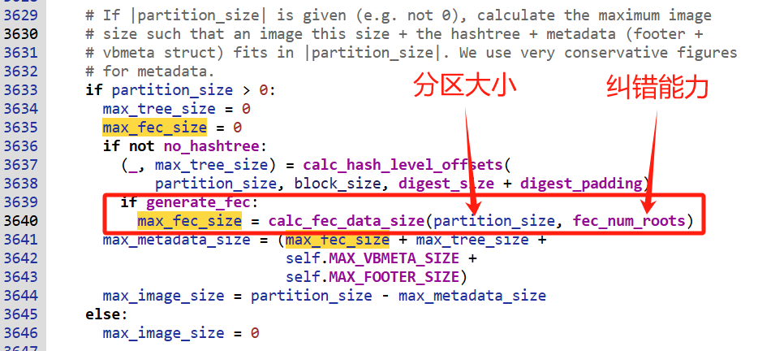
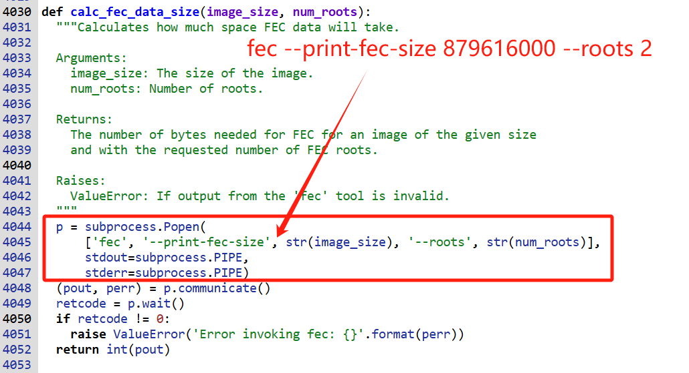
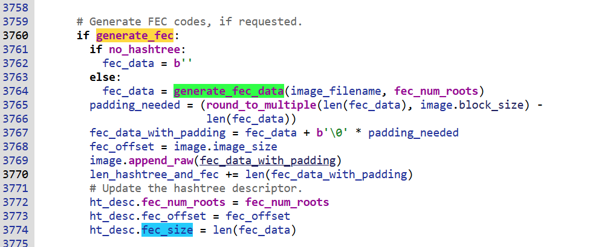
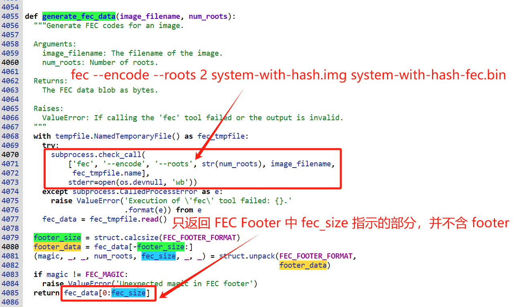

# 20241215-AVB 的 FEC 数据到底是如何生成的？

## 1. 前言

Android 编译时会调用 avbtool 对 system, vendor, product 等镜像生成 hashtree，但对于大的镜像，还会在 hashtree 之后生成用于纠错的 FEC 数据。那这个 FEC 到底是如何生成的呢？本篇以 android-13.0.0_r41 中编译 aosp_panther 目标的 system 镜像为例。探究下 system.img 的 FEC 数据到底是如何生成的。

主要包含两部分，

1. 从代码探究 FEC 数据到底是如何生成的？
2. 使用编译生成的镜像，通过实战验证 FEC 数据


## 2. 使用 avbtool 处理和查看 system.img

### 2.1 使用 avbtool 给 system.img 添加 FEC 数据

搜索编译 log，会发现编译中会调用下面的命令处理 target 包中的 system 镜像：

```
avbtool add_hashtree_footer \
	--partition_size 886812672 \
	--partition_name system \
	--image IMAGES/aosp_panther-target_files-eng.rocky/system.img \
	--salt 6902f6b436dd8f08a2ecd512d4576a03325e14db8e6b1bb72b68d22f20a6a6d3 \
	--hash_algorithm sha256 \
	--prop com.android.build.system.os_version:13 \
	--prop com.android.build.system.fingerprint:Android/aosp_panther/panther:13/TQ2A.230405.003.E1/rocky12021421:userdebug/test-keys \
	--prop com.android.build.system.security_patch:2023-04-05
```


> **特别说明**
>
> 1. 命令中指定参数“--partition_size 886812672”，目的是将 system.img 经过 AVB 工具一系列处理之后，得到一个新的大小和分区一样(886812672)的 system.img。但原始的 system.img 并不是 886812672，在我的机器上编译出来的原始的 system.img 的大小为 872734720。
> 2. 如果没有指定 `--salt 6902f6b43...a6d3` 参数，则 avbtool 会自动从 `/dev/urandom` 读取 32 字节作为 sha256 哈希算法的 salt


### 2.2 使用 avbtool 查看 system.img 信息

我们用 avbtool 查看下处理后的 system.img 信息:

```
$ avbtool info_image --image system.img
Footer version:           1.0
Image size:               886812672 bytes
Original image size:      872734720 bytes
VBMeta offset:            886571008
VBMeta size:              832 bytes
--
Minimum libavb version:   1.0
Header Block:             256 bytes
Authentication Block:     0 bytes
Auxiliary Block:          576 bytes
Algorithm:                NONE
Rollback Index:           0
Flags:                    0
Rollback Index Location:  0
Release String:           'avbtool 1.2.0'
Descriptors:
    Hashtree descriptor:
      Version of dm-verity:  1
      Image Size:            872734720 bytes
      Tree Offset:           872734720
      Tree Size:             6881280 bytes
      Data Block Size:       4096 bytes
      Hash Block Size:       4096 bytes
      FEC num roots:         2
      FEC offset:            879616000
      FEC size:              6955008 bytes
      Hash Algorithm:        sha256
      Partition Name:        system
      Salt:                  6902f6b436dd8f08a2ecd512d4576a03325e14db8e6b1bb72b68d22f20a6a6d3
      Root Digest:           e2b0749496127b3b0dd589ea54bf6ccb113fa05d587b1e361a55d3bc0ea6f068
      Flags:                 0
    Prop: com.android.build.system.os_version -> '13'
    Prop: com.android.build.system.fingerprint -> 'Android/aosp_panther/panther:13/TQ2A.230405.003.E1/rocky12021421:userdebug/test-keys'
    Prop: com.android.build.system.security_patch -> '2023-04-05'
```


从这个 `info_image` 中，我们可以看到，Hashtree descriptor 中包含了 FEC 数据的相关信息：

```bash
      FEC num roots:         2
      FEC offset:            879616000
      FEC size:              6955008 bytes
```

这部分数据的意思如下：

- FEC num roots: 2
  - 表示 FEC 可以纠正最多 2 个数据块的错误，如果系统检测到 1 或 2 个数据块损坏，可以自动重建正确的数据。超过 2 个损坏块时，则无法完全恢复数据。
- FEC offset: 879616000
  - 镜像中的 FEC 数据位于偏移 879616000=0x346DE000 的地方
- FEC size: 6955008 bytes
  - 镜像中的 FEC 数据大小为 6955008 字节，大约为 6.64M


## 3. system.img 的 FEC 是如何生成的？

使用 avbtool 的 `add_hashtree_footer` 操作处理 system.img 或者 vendor.img 时，FEC 数据的生成是在 `add_hashtree_footer()` 函数中通过调用 `generate_fec_data()` 来完成的。


### 3.1 预估 FEC 数据的大小

在 `add_hashtree_footer()` 函数中, 先通过调用 `calc_fec_data_size()` 根据分区大小 partition_size，和 FEC 可以纠正数据块的能力 fec_num_roots 来预估 FEC 数据的大小:



> 在线代码: https://xrefandroid.com/android-13.0.0_r83/xref/external/avb/avbtool.py#3629

默认情况下，FEC num roots 为 2，表示 FEC 可以纠正最多 2 个数据块的错误。


在 `calc_fec_data_size()` 函数内部包装了对 fec 工具的调用：



> 在线代码: https://xrefandroid.com/android-13.0.0_r83/xref/external/avb/avbtool.py#calc_fec_data_size

例如，这里的分区大小为：886812672，则可以通过以下命令预估 fec 数据的最大值(实际上包含的镜像数据小于分区，所以实际的 FEC 数据会小于这个值)

```bash
$ fec --print-fec-size 879616000 --roots 2
6959104
```


### 3.2 生成 FEC 数据

在 `add_hashtree_footer()` 函数中, 在生成了 hashtree 数据后，调用 `generate_fec_data()` 生成 FEC 数据:



> 在线代码: https://xrefandroid.com/android-13.0.0_r83/xref/external/avb/avbtool.py#3760

FEC 可以纠正的数据内容包括，原始的镜像数据，以及基于镜像数据生成的 hashtree 数据。


进一步查看 `generate_fec_data()`函数，不过是对 fec 工具的调用包装：



> 在线代码：https://xrefandroid.com/android-13.0.0_r83/xref/external/avb/avbtool.py#generate_fec_data


所以，当我们准备好 system 镜像，以及对应的 hashtree 数据后，可以使用下面的命令手动生成 FEC 数据：

```bash
$ fec --encode --roots 2 system-with-hash.img system-with-hash-fec.bin
encoding RS(255, 253) to 'system-with-hash-fec.bin' for input files:
        1: 'system-with-hash.img'
```

从这里可以看到，实际上使用的是 RS(255,253) 编码。

> 关于 RS(255, 253):
>
> RS(255, 253) 是 Reed-Solomon 编码中的一种特定参数配置，用于前向纠错（Forward Error Correction, FEC）。
>
> Reed-Solomon 编码基本概念：
>
> - 是一种广泛使用的错误纠正编码技术
>
> - 可以检测和修复数据transmission或存储过程中的错误
>
> RS(255, 253) 的具体含义：
>
> - 255 是编码块的总长度（字节数）
>
> - 253 是原始数据的长度
>
> - 意味着在 255 个字节中，有 253 个是原始数据
>
> - 有 2 个字节用于错误纠正码（冗余信息）
>
> 纠错能力：
>
> - 可以纠正 1 个字节的错误（2 个错误字节的冗余）
>
> - 提供了非常高效的错误恢复能力

### 3.3 总结

avbtool 中生成 FEC 数据实际是通过 fec 工具完成的，编译 Android 源码时会生成 fec 工具。

关于 fec 工具的详细分析，后面专门开篇讨论。


通过以下命令式预估 FEC 数据大小：

```bash
$ fec --print-fec-size 879616000 --roots 2
6959104
```


通过以下命令生成镜像的 FEC 数据:

```bash
$ fec --encode --roots 2 system-with-hash.img system-with-hash-fec.bin
encoding RS(255, 253) to 'system-with-hash-fec.bin' for input files:
        1: 'system-with-hash.img'
```


计算 FEC 数据的内容包括原始的分区镜像，以及基于分区镜像计算出来的 hashtree 数据。


## 4. 手动验证 system.img 镜像的 FEC 数据

### 4.1 avbtool 解析的 FEC 数据信息

在 avbtool 的 info_image 中，提供了详细的原始镜像，hashtree 和 FEC 数据的信息:

```bash
$ avbtool info_image --image system.img
...
Descriptors:
    Hashtree descriptor:
      Version of dm-verity:  1
      Image Size:            872734720 bytes
      Tree Offset:           872734720
      Tree Size:             6881280 bytes
      Data Block Size:       4096 bytes
      Hash Block Size:       4096 bytes
      FEC num roots:         2
      FEC offset:            879616000
      FEC size:              6955008 bytes
      Hash Algorithm:        sha256
      Partition Name:        system
      Salt:                  6902f6b436dd8f08a2ecd512d4576a03325e14db8e6b1bb72b68d22f20a6a6d3
      Root Digest:           e2b0749496127b3b0dd589ea54bf6ccb113fa05d587b1e361a55d3bc0ea6f068
      Flags:                 0
    ...
```

这里提到了几个重要的信息：

- Image Size: 872734720 bytes
  - 原始镜像大小 872734720 字节 (约 832.3M)
- Tree Offset: 872734720
  - hashtree 数据的偏移位于：872734720
- Tree Size: 6881280 bytes
  - hashtree 的大小为 6881280 字节 (约 6.56M)
- FEC num roots: 2
  - FEC 的纠错能力为 2，可以纠正最多 2 个数据块的错误。
- FEC offset: 879616000
  - FEC 数据的偏移位于 879616000
- FEC size: 6955008 bytes
  - FEC 数据的大小为 6955008 bytes (约 6.63M)

总体上，一个 832M 左右的镜像，其 hashtree 数据约 6.56M，FEC 数据约 6.63M。


### 4.2 使用 fec 工具生成 FEC 数据

关于 hashtree 数据的验证，请参考我的另外一篇文章《AVB 的哈希树到底是如何生成的？》

这里专注于验证 FEC 数据，由于 FEC 数据计算的内容，包括原始的镜像，以及 hashtree 数据，所以我们这里提取相应的镜像数据:

```bash
# system image + hash tree: (872734720 + 6881280) = 879616000 = 214750 x 4096
# 提取计算 FEC 的数据(包括原始镜像和 hashtree)
$ dd if=system.img of=system-with-hash.img bs=4096 count=214750

# 根据分区大小 886812672 计算最大的 FEC 数据大小
$ fec --print-fec-size 886812672 --roots 2
7016448

# 根据实际计算 FEC 数据的大小 879616000 来计算精确的 FEC 数据大小
$ fec --print-fec-size 879616000 --roots 2
6959104

# 计算 system-with-hash.img 文件的 FEC 数据
$ fec --encode --roots 2 system-with-hash.img system-with-hash-fec.bin
encoding RS(255, 253) to 'system-with-hash-fec.bin' for input files:
        1: 'system-with-hash.img'
$ ls -al system-with-hash-fec.bin
-rw-r--r-- 1 rocky users 6959104 Dec 15 11:28 system-with-hash-fec.bin
```


从上面可以看到，通过命令 `fec --print-fec-size 879616000 --roots 2` 得到 FEC 精确大小为 6959104。

然后，通过命令 `fec --encode --roots 2 system-with-hash.img system-with-hash-fec.bin` 生成的 FEC 数据的实际大小也是 6959104。


但我们通过 avbtool 查看到的 FEC 数据大小却只有 6955008 字节，如果细心一点的话，就会发现：

```
6959104 - 6955008 = 4096
```

没错，这中间少了 4096 字节。


### 4.3 手动解析 FEC Footer

让我们看看生成的 FEC 数据最后的 4096 字节都是什么内容：

```
$ hexdump -C -s $((6959104-4096)) system-with-hash-fec.bin 
006a2000  fe ec cf fe 00 00 00 00  3c 00 00 00 02 00 00 00  |........<.......|
006a2010  00 20 6a 00 00 e0 6d 34  00 00 00 00 dc 7d 44 51  |. j...m4.....}DQ|
006a2020  0d e9 3c c8 03 37 17 31  af d3 f6 b3 f6 25 e3 96  |..<..7.1.....%..|
006a2030  17 f1 87 b4 ad fe 6f 15  12 8e 65 04 00 00 00 00  |......o...e.....|
006a2040  00 00 00 00 00 00 00 00  00 00 00 00 00 00 00 00  |................|
*
006a2fc0  00 00 00 00 fe ec cf fe  00 00 00 00 3c 00 00 00  |............<...|
006a2fd0  02 00 00 00 00 20 6a 00  00 e0 6d 34 00 00 00 00  |..... j...m4....|
006a2fe0  dc 7d 44 51 0d e9 3c c8  03 37 17 31 af d3 f6 b3  |.}DQ..<..7.1....|
006a2ff0  f6 25 e3 96 17 f1 87 b4  ad fe 6f 15 12 8e 65 04  |.%........o...e.|
006a3000
```

其实，在这 4096 字节中包含的是 FEC Footer 内容：

- 在最开始的 60 字节包含 FEC Footer
- 在最末尾的 60 字节包含 FEC Footer 镜像

在 `system/extras/libfec/include/fec/io.h` 文件中包含了 FEC Footer 的定义：

```c
#define FEC_BLOCKSIZE 4096
#define FEC_DEFAULT_ROOTS 2

#define FEC_MAGIC 0xFECFECFE
#define FEC_VERSION 0

/* disk format for the header */
struct fec_header {
    uint32_t magic;
    uint32_t version;
    uint32_t size;
    uint32_t roots;
    uint32_t fec_size;
    uint64_t inp_size;
    uint8_t hash[SHA256_DIGEST_LENGTH];
} __attribute__ ((packed));
```

让我们手动解析下 FEC Footer 的内容：

```
   magic( 4): fe ec cf fe              ->    magic: 0xFECFECFE (little endian)
 version( 4): 00 00 00 00              ->  version: 0
    size( 4): 3c 00 00 00              ->     size: 0x0000003C = 60 bytes
   roots( 4): 02 00 00 00              ->    roots: 0x00000002 = 2 (FEC num roots)
fec_size( 4): 00 20 6a 00              -> fec_size: 0x006A2000 = 6955008
inp_size( 8): 00 e0 6d 34  00 00 00 00 -> inp_size: 0x346DE000 = 879616000
    hash(32): dc 7d 44 51  0d e9 3c c8  03 37 17 31  af d3 f6 b3
	          f6 25 e3 96  17 f1 87 b4  ad fe 6f 15  12 8e 65 04
```

再对比我们使用 avbtool 拿到的数据，其中的 FEC Size (6955008) 是一致的。

只不过 avbtool 给镜像添加 FEC 数据时，并没有包含最后一个 4096 字节的 FEC Footer。


### 4.4 对比手动生成的和 avbtool 生成的 FEC 数据

比较手动生成的 FEC 和 avbtool 生成镜像的 FEC 数据

我们试着计算生成的 FEC 数据不含 FEC Footer 部分的 md5 哈希值：

```bash
$ dd if=system-with-hash-fec.bin bs=4096 count=$(((6959104-4096)/4096)) | md5sum
85d6a653576ba3e9093e1f44faa46489  -
```


我们再计算下 system.img 中 FEC 数据的哈希值:

```bash
$ dd if=system.img bs=4096 count=$((6955008/4096)) skip=$((879616000/4096)) | md5sum
85d6a653576ba3e9093e1f44faa46489  -
```


从这里看到，我们手动处理生成的 FEC 和从 system.img 中提取的 FEC 数据的 md5 哈希值一致，说明其内容也是完全一样的。


## 5. 总结

本文没有深入 FEC 纠错的原理，主要跟踪 avbtool 工具来查看 FEC 数据是如何生成的。

可以通过 `avbtool info_image` 的输出查看镜像信息，如果包含 FEC 数据(例如 system.img)，则会显示 FEC 数据的信息。


实际上，avbtool 中 FEC 数据的生成，主要是包装使用了 fec 工具的以下两条命令：

```bash
# 根据实际计算 FEC 数据的大小 879616000 来计算精确的 FEC 数据大小
$ fec --print-fec-size 879616000 --roots 2
6959104

# 计算 system-with-hash.img 文件的 FEC 数据
$ fec --encode --roots 2 system-with-hash.img system-with-hash-fec.bin
encoding RS(255, 253) to 'system-with-hash-fec.bin' for input files:
        1: 'system-with-hash.img'
```


默认情况下，生成的 FEC 中使用参数 `--roots 2`，表示可以纠正最多 2 个数据块的错误。

用于计算 FEC 的数据包括原始的分区镜像，以及基于原始分区镜像计算的 hashtree 数据。


生成 FEC 数据时底层使用了 RS(255, 253) 编码，其具体含义如下：

- 255 是编码块的总长度（字节数）

- 253 是原始数据的长度

- 意味着在 255 个字节中，有 253 个是原始数据

- 有 2 个字节用于错误纠正码（冗余信息）


在使用 `fec --encode` 命令生成的 FEC 数据中，最后 4096 字节包含了 FEC Footer 和一个 FEC Footer 镜像。

在使用 avbtool 处理 fec 数据时，只包含了 fec 数据部分，没有包含 FEC Footer，因此在 avbtool 的输出镜像中不包含 FEC Footer 数据。


## 6. 其它

我创建了一个 Android AVB 讨论群，主要讨论 Android 设备的 AVB 验证问题。

我还几个 Android OTA 升级讨论群，主要讨论 Android 设备的 OTA 升级话题。

欢迎您加群和我们一起交流，请在加我微信时注明“Android AVB 交流”或“Android OTA 交流”。

仅限 Android 相关的开发者参与~

> 公众号“洛奇看世界”后台回复“wx”获取个人微信。

