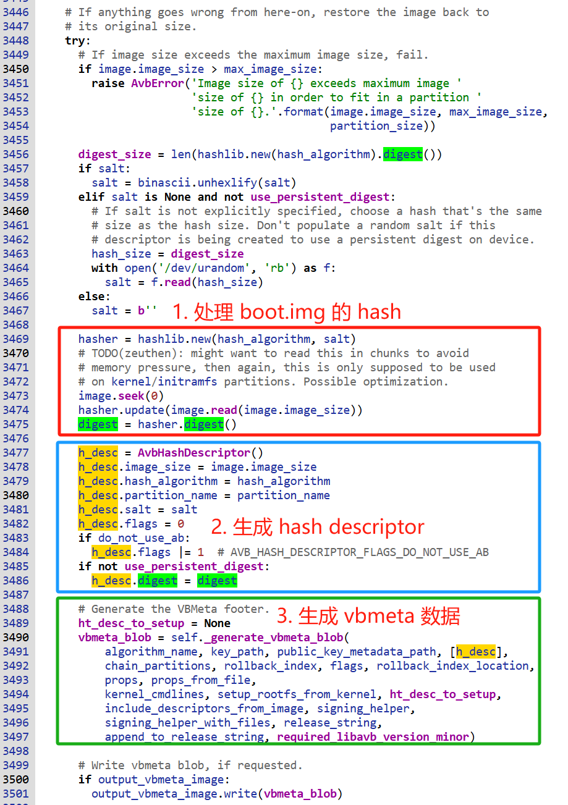
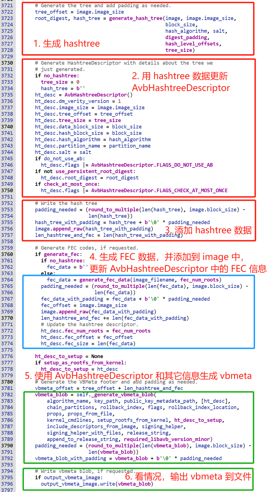
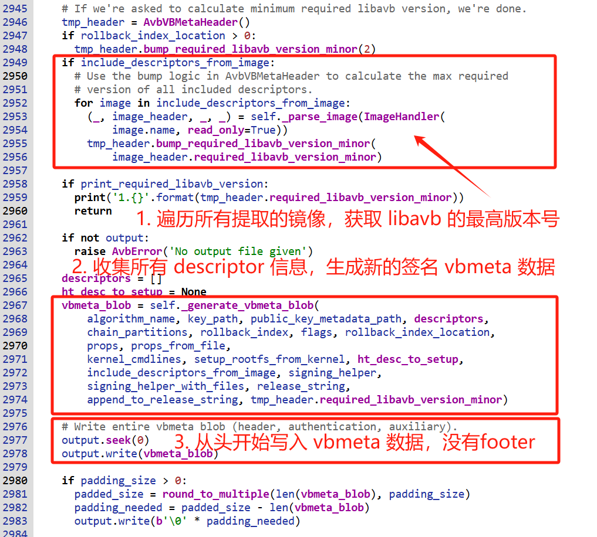
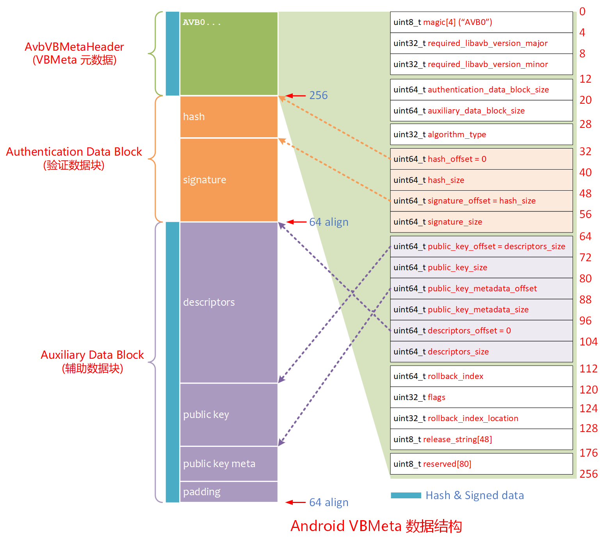

# 20241216-AVB 的 VBMeta 数据是如何生成的？

## 1. 导读

前面几篇分析了 boot.img 和 system.img 的布局，以及 system.img 中的 hashtree 和 FEC 数据，对于最重要的 VBMeta 数据还没有涉及。本篇重点分析下 VBMeta 数据的生成以及结构。


编译一个全新的 Android, 并将 log 保存下来，搜索 log，就可以找到编译中使用 avbtool 给镜像添加 VBMeta 数据的命令。


例如，我这里基于 `android-13.0.0_r41` 的源码，编译 Google Pixel 7 ("panther") 设备的镜像中，通过 "`grep avbtool` " 找到了不少使用 avbtool 处理镜像的命令。

> 这里再次将我编译 Android 的命令张贴如下：
>
> ```bash
> # prepare android-13.0.0_r41
> $ repo init -u https://android.googlesource.com/platform/manifest -b android-13.0.0_r41
> $ repo sync
> 
> # prepare Pixel 7("panther") binaries
> $ wget https://dl.google.com/dl/android/aosp/google_devices-panther-tq2a.230405.003.e1-2c3467dd.tgz
> $ tar -zxf google_devices-panther-tq2a.230405.003.e1-2c3467dd.tgz
> $ ./extract-google_devices-panther.sh
> 
> # build
> $ source build/envsetup.sh
> $ lunch aosp_panther-userdebug
> $ make dist -j128 2>&1 | tee make-dist-20241202.log
> ```
>
> 为了后面的操作方便，我这里将所有的编译 log 都保存到文件 `make-dist-20241202.log` 中了。


本文主要就 3 类带 VBMeta 数据处理的命令进行分析，分别是：

- boot.img，代表了 avbtool 使用 `add_hash_footer` 操作对小镜像生成 hash footer 的处理
- system.im，代表了 avbtool 使用 `add_hashtree_footer` 操作对大镜像生成 hashtree footer 的处理
- vbmeta.img，代表了 avbtool 使用 `make_vbmeta_image` 从多个镜像中提取 vbmeta 数据到单独文件的处理


> 本文基于 android-13.0.0_r41 的代码进行分析。

## 2. boot 分区中的 VBMeta

使用 avbtool 处理 boot image 的命令如下：

```bash
avbtool add_hash_footer \
	--image boot.img \
	--partition_size 67108864 \
	--partition_name boot \
	--key external/avb/test/data/testkey_rsa2048.pem \
	--algorithm SHA256_RSA2048 \
	--prop com.android.build.boot.os_version:13 \
	--prop com.android.build.boot.fingerprint:Android/aosp_panther/panther:13/TQ2A.230405.003.E1/rocky12021421:userdebug/test-keys \
	--prop com.android.build.boot.security_patch:2023-04-05 \
	--rollback_index 1680652800
```


处理 boot image 实际上交由 `add_hash_footer()` 函数来完成的，在 `add_hash_footer()` 中，主要进行了以下处理：

0. 准备工作，包括：
   1. 检查需要的 AVB 版本；
   2. 根据传入的 partition size，计算和检查元数据(AVBFooter + VBMeta)数据，以及镜像数据的大小
   3. 如果来的文件中已经包含了 AVBFooter 和 VBMeta 数据，则移除这些数据，恢复原始的 boot.img 镜像数据
1. 使用传入的随机盐值计算原始 boot.img 镜像的 hash，如果没有传入随机的 salt，则从 `/dev/urandom` 伪随机数设备生成随机 salt
2. 基于 boot.img 的 hash，生成 AVB Hash Descriptor 描述符
3. 使用 AVB Hash Descriptor 描述符和传入的 key 等一系列参数生成 VBMeta 数据

原始的代码如下：



> 在线代码：https://xrefandroid.com/android-13.0.0_r83/xref/external/avb/avbtool.py#add_hash_footer

## 3. system 分区中的 VBMeta

使用 avbtool 处理 system image 的命令如下：

```bash
# system.img
avbtool add_hashtree_footer \
	--partition_size 886812672 \
	--partition_name system \
	--image aosp_panther-target_files-eng.rocky/IMAGES/system.img \
	--salt 6902f6b436dd8f08a2ecd512d4576a03325e14db8e6b1bb72b68d22f20a6a6d3 \
	--hash_algorithm sha256 \
	--prop com.android.build.system.os_version:13 \
	--prop com.android.build.system.fingerprint:Android/aosp_panther/panther:13/TQ2A.230405.003.E1/rocky12021421:userdebug/test-keys \
	--prop com.android.build.system.security_patch:2023-04-05
```

由于 system.img 的 VBMeta 数据随后会单独提取到 vbmeta.img 中，所以这里并没有传入私钥数据对 system.img 的 vbmeta 数据进行签名。


处理 system image 实际上交由 `add_hashtree_footer()` 函数来完成的，在 `add_hashtree_footer()` 中，主要进行了以下处理：

0. 准备工作，包括：
   1. 检查需要的 AVB 版本；
   2. 根据传入的 partition size，预估 hashtree 和 fec 数据的大小，来检查镜像文件的 max size;
   3. 如果来的文件中已经包含了 AVBFooter 和 VBMeta 数据，则移除这些数据，恢复原始的 boot.img 镜像数据
1. 使用传入的随机盐 salt 和哈希算法计算生成镜像的 hashtree 数据;
2. 使用生成的 hashtree 数据相关信息更新 AvbHashtreeDescritpor;
3. 将 hashtree 数据添加到镜像中；
4. 基于原始的镜像内容和以及 hashtree 数据生成 FEC 数据，更新 AvbHashtreeDescriptor，并将 FEC 数据更新到镜像中；
5. 使用更新的 AvbHashtreeDescriptor 描述符生成 VBMeta 数据；
6. 如果需要单独保存 VBMeta 数据，则将其输出到单独的文件中；

原始的代码如下：



## 4. vbmeta.img 镜像

搜索编译生成的 log，使用 avbtool 生成的 vbmeta 相关镜像包括以下两类：

1. 从 vendor.img 中提取单独的 vbmeta 到文件 vbmeta_vendor.img 中；
2. 基于多个文件的 vbmeta 数据，生成单独的 vbmeta 分区镜像 vbmeata.img


这两个命令分别如下：

```bash
# vbmeta_vendor.img
avbtool make_vbmeta_image \
	--output IMAGES/vbmeta_vendor.img \
	--key external/avb/test/data/testkey_rsa2048.pem \
	--algorithm SHA256_RSA2048 \
	--include_descriptors_from_image IMAGES/vendor.img \
	--padding_size 4096 \
	--rollback_index 1680652800

# vbmeta.img, with chain partitions
avbtool make_vbmeta_image \
	--output IMAGES/vbmeta.img \
	--key external/avb/test/data/testkey_rsa4096.pem \
	--algorithm SHA256_RSA4096 \
	--chain_partition boot:2:out/soong/.temp/avb-rdtlqkfe.avbpubkey \
	--chain_partition init_boot:4:out/soong/.temp/avb-heg356oe.avbpubkey \
	--include_descriptors_from_image IMAGES/vendor_boot.img \
	--include_descriptors_from_image IMAGES/vendor_kernel_boot.img \
	--include_descriptors_from_image IMAGES/vendor_dlkm.img \
	--include_descriptors_from_image IMAGES/dtbo.img \
	--include_descriptors_from_image IMAGES/pvmfw.img \
	--chain_partition vbmeta_system:1:out/soong/.temp/avb-er20eabz.avbpubkey \
	--chain_partition vbmeta_vendor:3:out/soong/.temp/avb-bn_8e20u.avbpubkey \
	--padding_size 4096 \
	--rollback_index 1680652800
```


生成单独 vbmeta 数据镜像实际上交由 `make_vbmeta_image()` 函数来完成的，在 `make_vbmeta_image()` 中，主要进行了以下处理：

1. 编译所有需要提取的镜像，获取 libavb 的最高版本号；
2. 收集所有镜像的描述符 descriptor 信息，生成 vbmeta 数据并签名；
3. 将签名后的 vbmeta 数据输出到单独的镜像中，和 boot 以及 system 分区中的 vbmata 数据不同的是，在单独的 vbmeta 中不会写入 AVB Footer 数据。

> AVB Footer 数据的作用是用来定位 VBMeta 数据，对于单独的 vbmeta 镜像，起始位置就已经是 VBMeta 数据了，所以不再需要 AVB Footer 来定位。


部分处理的原始代码如下：




从上面的三个操作 `add_hash_footer`, `add_hashtree_footer` 和 `make_vbmeta_image` 可以看到，实际生成 VBMeta 数据的操作在 `_generate_vbmeta_blob()` 函数中完成。

## 5. `_generate_vbmeta_blob()` 函数

我们这里对 `_generate_vbmeta_blob()` 函数详细注释，觉得太啰嗦的可以忽略过，直到需要的时候再回来查看:

```python
  def _generate_vbmeta_blob(self, algorithm_name, key_path,
                            public_key_metadata_path, descriptors,
                            chain_partitions,
                            rollback_index, flags, rollback_index_location,
                            props, props_from_file,
                            kernel_cmdlines,
                            setup_rootfs_from_kernel,
                            ht_desc_to_setup,
                            include_descriptors_from_image, signing_helper,
                            signing_helper_with_files,
                            release_string, append_to_release_string,
                            required_libavb_version_minor):
    """Generates a VBMeta blob.

    VBMeta 数据包含三个部分：
    - Header (VBMeta 数据头，结构体 AvbVBMetaHeader)
    - Authentication Data Block (认证数据块)
      - 包含 Header (头部)和 Auxiliary (辅助)数据的哈希和签名
    - Auxiliary Block (辅助块)
      - 各种描述符
      - 签名的公钥
      - 其它数据

    只有当参数 algorithm_name 为 None 时，参数 key 才可以为 None.
    因为参数 algorithm_name 用于表示签名使用的算法，例如 SHA256_RSA2048，这个算法为空意味着不用签名。

    参数:
        algorithm_name: 算法名称，来自 ALGORITHMS 字典，例如: SHA256_RSA2048
        key_path: 用于签名的 .pem 格式的 key 文件路径
        public_key_metadata_path: 公钥元数据路径或 None
        descriptors: 要插入的描述符列表，包括 AvbHashDescriptor, AvbHashtreeDescriptor 等。
        chain_partitions: 链式处理分区描述符列表, AvbChainPartitionDescriptor。
        rollback_index: 使用的回滚索引值。
        flags: 镜像使用的各种标记。
        rollback_index_location: 主 vbmeta 回滚索引的位置。
        props: 要插入的属性(形式为'key:value'的字符串列表)。
        props_from_file: 要插入的属性(形式为'key:<path>'的字符串列表)。
        kernel_cmdlines: 要插入的内核命令行(字符串列表)。
        setup_rootfs_from_kernel: 用于生成 dm-verity 内核命令行的文件。
        ht_desc_to_setup: 如果不为 None，则为生成 dm-verity 内核命令行描述符的 AvbHashtreeDescriptor。
        include_descriptors_from_image: 包含描述符的镜像文件列表，用于提取其包含的描述符。
        signing_helper: 签名 hash 并返回签名的程序。
        signing_helper_with_files: 与 signing_helper 相同，但使用文件。
        release_string: avbtool 发布字符串。
        append_to_release_string: 要追加的发布字符串。
        required_libavb_version_minor: 使用至少该版本的小版本。

    返回:
        VBMeta blob 的字节。

    异常:
        Exception: 如果算法 algorithm_name 没找到，如果没有找到算法所需要的秘钥，或密钥大小错误引发异常。
    """
    
    # 检查算法 algorithm_name (如 ALGORITHMS) 是否位于 ALGORITHMS 列表中
    # 当前支持的算法包括：
    #   SHA256_RSA2048, SHA256_RSA4096, SHA256_RSA8192
    #   SHA512_RSA2048, SHA512_RSA4096, SHA512_RSA8192
    try:
      alg = ALGORITHMS[algorithm_name]
    except KeyError:
      raise AvbError('Unknown algorithm with name {}'.format(algorithm_name))

    # 如果没有传入描述符，则创建一个空描述符列表
    # 针对 boot.img 一类小镜像，会传入 [AVBHashDescriptor]
    # 针对 system.img 一类大镜像，传入 [AVBHashTreeDescriptors]
    if not descriptors:
      descriptors = []

    #
    # 1. 构造 AvbVBMetaHeader
    #
    h = AvbVBMetaHeader()
    h.bump_required_libavb_version_minor(required_libavb_version_minor)

    #
    # 2. 准备各种描述符
    #
    #  2.1 根据传入的链式分区列表，生成相应的 AvbChainPartitionDescriptor
    #      AvbChainPartitionDescriptor 包含的内容:
    #      - partition_name
    #      - rollback_index_location
    #      - public_key
    # Insert chained partition descriptors, if any
    if chain_partitions:
      used_locations = {rollback_index_location: True}
      for cp in chain_partitions:
        cp_tokens = cp.split(':')
        if len(cp_tokens) != 3:
          raise AvbError('Malformed chained partition "{}".'.format(cp))
        partition_name = cp_tokens[0]
        chained_rollback_index_location = int(cp_tokens[1])
        file_path = cp_tokens[2]
        # Check that the same rollback location isn't being used by
        # multiple chained partitions.
        if used_locations.get(chained_rollback_index_location):
          raise AvbError('Rollback Index Location {} is already in use.'.format(
              chained_rollback_index_location))
        used_locations[chained_rollback_index_location] = True
        desc = AvbChainPartitionDescriptor()
        desc.partition_name = partition_name
        desc.rollback_index_location = chained_rollback_index_location
        if desc.rollback_index_location < 1:
          raise AvbError('Rollback index location must be 1 or larger.')
        with open(file_path, 'rb') as f:
          desc.public_key = f.read()
        descriptors.append(desc)

    # 2.2 处理作为参数传入的描述符，主要包括 AvbHashDescriptor(boot.img 等小镜像，使用 hash footer), AvbHashtreeDescriptor (system.img 等大镜像，使用 hashtree footer)
    # Descriptors.
    encoded_descriptors = bytearray()
    for desc in descriptors:
      encoded_descriptors.extend(desc.encode())

    # 2.3 使用传入的 properties 内容生成 AvbPropertyDescriptor
    #     包括两种情况：从 props 字符串构建和从 props_from_file 文件构建
    # Add properties.
    if props:
      for prop in props:
        idx = prop.find(':')
        if idx == -1:
          raise AvbError('Malformed property "{}".'.format(prop))
        # pylint: disable=redefined-variable-type
        desc = AvbPropertyDescriptor()
        desc.key = prop[0:idx]
        desc.value = prop[(idx + 1):].encode('utf-8')
        encoded_descriptors.extend(desc.encode())
    if props_from_file:
      for prop in props_from_file:
        idx = prop.find(':')
        if idx == -1:
          raise AvbError('Malformed property "{}".'.format(prop))
        desc = AvbPropertyDescriptor()
        desc.key = prop[0:idx]
        file_path = prop[(idx + 1):]
        with open(file_path, 'rb') as f:
          # pylint: disable=attribute-defined-outside-init
          desc.value = f.read()
        encoded_descriptors.extend(desc.encode())

    #
    # 2.4 处理 AvbKernelCmdlineDescriptor 描述符
    #
    # 2.4.1 根据传入的分区镜像名称创建用于 dm-verity 的 AvbKernelCmdlineDescriptor
    # Add AvbKernelCmdline descriptor for dm-verity from an image, if requested.
    if setup_rootfs_from_kernel:
      image_handler = ImageHandler(
          setup_rootfs_from_kernel.name)
      cmdline_desc = self._get_cmdline_descriptors_for_dm_verity(image_handler)
      encoded_descriptors.extend(cmdline_desc[0].encode())
      encoded_descriptors.extend(cmdline_desc[1].encode())

    # 2.4.2 根据传入的 ht_desc_to_setup 生成 AvbKernelCmdlineDescriptor
    # Add AvbKernelCmdline descriptor for dm-verity from desc, if requested.
    if ht_desc_to_setup:
      cmdline_desc = self._get_cmdline_descriptors_for_hashtree_descriptor(
          ht_desc_to_setup)
      encoded_descriptors.extend(cmdline_desc[0].encode())
      encoded_descriptors.extend(cmdline_desc[1].encode())

    # 2.4.3 根据传入的 kernel_cmdlines 参数生成 AvbKernelCmdlineDescriptor
    # Add kernel command-lines.
    if kernel_cmdlines:
      for i in kernel_cmdlines:
        desc = AvbKernelCmdlineDescriptor()
        desc.kernel_cmdline = i
        encoded_descriptors.extend(desc.encode())

    # 2.5 从传入的分区列表 include_descriptors_from_image 中提取各分区的各种描述符
    # Add descriptors from other images.
    if include_descriptors_from_image:
      descriptors_dict = dict()
      for image in include_descriptors_from_image:
        image_handler = ImageHandler(image.name, read_only=True)
        (_, image_vbmeta_header, image_descriptors, _) = self._parse_image(
            image_handler)
        # Bump the required libavb version to support all included descriptors.
        h.bump_required_libavb_version_minor(
            image_vbmeta_header.required_libavb_version_minor)
        for desc in image_descriptors:
          # The --include_descriptors_from_image option is used in some setups
          # with images A and B where both A and B contain a descriptor
          # for a partition with the same name. Since it's not meaningful
          # to include both descriptors, only include the last seen descriptor.
          # See bug 76386656 for details.
          if hasattr(desc, 'partition_name'):
            key = type(desc).__name__ + '_' + desc.partition_name
            descriptors_dict[key] = desc.encode()
          else:
            encoded_descriptors.extend(desc.encode())
      for key in sorted(descriptors_dict):
        encoded_descriptors.extend(descriptors_dict[key])

    #
    # 3. 准备签名的公钥
    #
    # 3.1 公钥来自 public_key_metadata_path 数据
    # Load public key metadata blob, if requested.
    pkmd_blob = b''
    if public_key_metadata_path:
      with open(public_key_metadata_path, 'rb') as f:
        pkmd_blob = f.read()

    # 3.2 公钥来自 key_path 指定的文件
    key = None
    encoded_key = b''
    if alg.public_key_num_bytes > 0:
      if not key_path:
        raise AvbError('Key is required for algorithm {}'.format(
            algorithm_name))
      encoded_key = RSAPublicKey(key_path).encode()
      if len(encoded_key) != alg.public_key_num_bytes:
        raise AvbError('Key is wrong size for algorithm {}'.format(
            algorithm_name))

    #
    # 4. 更新 AvbVBMetaHeader 数据
    #
    #
    # 4.1 将 release_string 添加到 Header Data 中
    # Override release string, if requested.
    if isinstance(release_string, str):
      h.release_string = release_string

    # 4.2 将 append_to_release_string 添加到 Header Data 中
    # Append to release string, if requested. Also insert a space before.
    if isinstance(append_to_release_string, str):
      h.release_string += ' ' + append_to_release_string

    # 4.3 使用辅助块 Auxiliary 的 descriptors, public key 和 metadata 信息更新 Header 数据,
    # 主要包含各自的 offset 和 size 信息
    # For the Auxiliary data block, descriptors are stored at offset 0,
    # followed by the public key, followed by the public key metadata blob.
    h.auxiliary_data_block_size = round_to_multiple(
        len(encoded_descriptors) + len(encoded_key) + len(pkmd_blob), 64)
    h.descriptors_offset = 0
    h.descriptors_size = len(encoded_descriptors)
    h.public_key_offset = h.descriptors_size
    h.public_key_size = len(encoded_key)
    h.public_key_metadata_offset = h.public_key_offset + h.public_key_size
    h.public_key_metadata_size = len(pkmd_blob)

    # 4.4 使用 Authentication Data Block 信息更新 Header 数据，主要包括 block size, algorithm type
    # hash offset, hash size 等。
    # For the Authentication data block, the hash is first and then
    # the signature.
    h.authentication_data_block_size = round_to_multiple(
        alg.hash_num_bytes + alg.signature_num_bytes, 64)
    h.algorithm_type = alg.algorithm_type
    h.hash_offset = 0
    h.hash_size = alg.hash_num_bytes
    # Signature offset and size - it's stored right after the hash
    # (in Authentication data block).
    h.signature_offset = alg.hash_num_bytes
    h.signature_size = alg.signature_num_bytes

    # 4.5 使用 rollback index 和 flags 以及 rollback index location 更新 Header 数据
    h.rollback_index = rollback_index
    h.flags = flags
    h.rollback_index_location = rollback_index_location

    # Generate Header data block.
    header_data_blob = h.encode()

    # 5. 生成 Auxiliary Data 数据
    #    包括描述符(Descriptor)，公钥(Public Key), 公钥元数据(Key Metadata) 以及 Header 和 Auxiliary Data 的签名
    # 5.1 使用 Descriptor, Public Key 和 Key Metadata 依次排列生成辅助块
    # Generate Auxiliary data block.
    aux_data_blob = bytearray()
    aux_data_blob.extend(encoded_descriptors)
    aux_data_blob.extend(encoded_key)
    aux_data_blob.extend(pkmd_blob)
    padding_bytes = h.auxiliary_data_block_size - len(aux_data_blob)
    aux_data_blob.extend(b'\0' * padding_bytes)

    # 5.2 使用指定的哈希算法计算 Header 和 Auxiliary Data(辅助数据)的哈希，并使用公钥签名
    # Calculate the hash.
    binary_hash = b''
    binary_signature = b''
    if algorithm_name != 'NONE':
      ha = hashlib.new(alg.hash_name)
      ha.update(header_data_blob)
      ha.update(aux_data_blob)
      binary_hash = ha.digest()

      # Calculate the signature.
      rsa_key = RSAPublicKey(key_path)
      data_to_sign = header_data_blob + bytes(aux_data_blob)
      binary_signature = rsa_key.sign(algorithm_name, data_to_sign,
                                      signing_helper, signing_helper_with_files)

    # 6. 生成 Authentication 数据
    #    包括 Header 和 Auxiliary 数据计算出来的哈希，以及签名数据
    # Generate Authentication data block.
    auth_data_blob = bytearray()
    auth_data_blob.extend(binary_hash)
    auth_data_blob.extend(binary_signature)
    padding_bytes = h.authentication_data_block_size - len(auth_data_blob)
    auth_data_blob.extend(b'\0' * padding_bytes)

    return header_data_blob + bytes(auth_data_blob) + bytes(aux_data_blob)
```


总结一下`_generate_vbmeta_blob()` 函数中的操作：

这个函数用于生成 VBMeta 数据，对于生成的 VBMeta 数据，主要包含 3 部分，按顺序依次为：

1. AvbVBMetaHeader
2. Authentication Data Block
3. Auxiliary Data Block

即:

```
+-----------------------------------------+
| Header data - (256 Bytes)               | (AVB VBMeta Header 数据)
+-----------------------------------------+
| Authentication data - variable size     | (认证数据块，包含 Header 和 Auxiliary Data 的签名)
+-----------------------------------------+
| Auxiliary data - variable size          | (辅助数据块，包括各种描述符，公钥信息)
+-----------------------------------------+
```


## 6. AvbVBMetaHeader  数据解析

AvbVBMetaHeader 主要包含一些 AVB 的元数据，详细结构定义，请参考头文件:

external/avb/libavb/avb_vbmeta_image.h

```c
typedef struct AvbVBMetaImageHeader {
  /*   0: Four bytes equal to "AVB0" (AVB_MAGIC). */
  uint8_t magic[AVB_MAGIC_LEN];

  /*   4: The major version of libavb required for this header. */
  uint32_t required_libavb_version_major;
  /*   8: The minor version of libavb required for this header. */
  uint32_t required_libavb_version_minor;

  /*  12: The size of the signature block. */
  uint64_t authentication_data_block_size;
  /*  20: The size of the auxiliary data block. */
  uint64_t auxiliary_data_block_size;

  /*  28: The verification algorithm used, see |AvbAlgorithmType| enum. */
  uint32_t algorithm_type;

  /*  32: Offset into the "Authentication data" block of hash data. */
  uint64_t hash_offset;
  /*  40: Length of the hash data. */
  uint64_t hash_size;

  /*  48: Offset into the "Authentication data" block of signature data. */
  uint64_t signature_offset;
  /*  56: Length of the signature data. */
  uint64_t signature_size;

  /*  64: Offset into the "Auxiliary data" block of public key data. */
  uint64_t public_key_offset;
  /*  72: Length of the public key data. */
  uint64_t public_key_size;

  /*  80: Offset into the "Auxiliary data" block of public key metadata. */
  uint64_t public_key_metadata_offset;
  /*  88: Length of the public key metadata. Must be set to zero if there
   *  is no public key metadata.
   */
  uint64_t public_key_metadata_size;

  /*  96: Offset into the "Auxiliary data" block of descriptor data. */
  uint64_t descriptors_offset;
  /* 104: Length of descriptor data. */
  uint64_t descriptors_size;

  /* 112: The rollback index which can be used to prevent rollback to
   *  older versions.
   */
  uint64_t rollback_index;

  /* 120: Flags from the AvbVBMetaImageFlags enumeration. This must be
   * set to zero if the vbmeta image is not a top-level image.
   */
  uint32_t flags;

  /* 124: The location of the rollback index defined in this header.
   * Only valid for the main vbmeta. For chained partitions, the rollback
   * index location must be specified in the AvbChainPartitionDescriptor
   * and this value must be set to 0.
   */
  uint32_t rollback_index_location;

  /* 128: The release string from avbtool, e.g. "avbtool 1.0.0" or
   * "avbtool 1.0.0 xyz_board Git-234abde89". Is guaranteed to be NUL
   * terminated. Applications must not make assumptions about how this
   * string is formatted.
   */
  uint8_t release_string[AVB_RELEASE_STRING_SIZE];

  /* 176: Padding to ensure struct is size AVB_VBMETA_IMAGE_HEADER_SIZE
   * bytes. This must be set to zeroes.
   */
  uint8_t reserved[80];
} AVB_ATTR_PACKED AvbVBMetaImageHeader;
```


根据 external/avb/libavb/avb_vbmeta_image.h 文件中的一些注释，重点如下：

- "头部数据"(Header data)由此结构体描述，其大小始终为 |AVB_VBMETA_IMAGE_HEADER_SIZE| 字节。

- "验证数据"(Authentication data)的大小为 |authentication_data_block_size| 字节，包含用于验证 vbmeta 镜像的哈希值和签名。

  哈希值和签名的类型由 |algorithm_type| 字段定义。

- "辅助数据"(Auxiliary data)的大小为 |auxiliary_data_block_size| 字节，包含辅助数据，其中包括用于生成签名的公钥和描述符。

- 公钥位于该块中偏移量 |public_key_offset| 处，大小为 |public_key_size|。

  公钥数据的大小由 |algorithm_type| 字段定义。

  公钥数据的格式在 |AvbRSAPublicKeyHeader| 结构体中描述。

- 描述符从"辅助数据"(Auxiliary data)块的起始位置偏移 |descriptors_offset| 开始，占用 |descriptors_size| 字节。每个描述符都作为带有标签和后续字节数的|AvbDescriptor| 存储。可以通过遍历这些数据直到用完 |descriptors_size| 来确定描述符的数量。

- "验证数据"(Authentication data)和"辅助数据"(Auxiliary data)的大小必须能被 64 整除，这是为了确保正确对齐。

- 描述符(Descriptor)是存储在 vbmeta 镜像中的自由格式块，与镜像的其他部分一样，要经过相同的完整性检查。
  常用描述符包括：

  - AvbHashDescriptor
  - AvbHashtreeDescriptor
  - AvbPropertyDescriptor
  - AvbKernelCmdlineDescriptor
  - AvbChainPartitionDescriptor

- AvbVBMetaImageHeader 结构体是有版本控制的，请参见 |required_libavb_version_major| 和 |required_libavb_version_minor| 字段。这表示验证头部所需的最低 libavb 版本，具体取决于所使用的功能（如算法、描述符）。注意，即使是由 1.4 版本的 avbtool 生成的，如果没有使用 1.0 版本之后引入的功能，这个版本号也可能是 1.0。


所以一个完整的 VBMeta 内容布局大概是这样：



## 7. 其它

我创建了一个 Android AVB 讨论群，主要讨论 Android 设备的 AVB 验证问题。

我还几个 Android OTA 升级讨论群，主要讨论 Android 设备的 OTA 升级话题。

欢迎您加群和我们一起交流，请在加我微信时注明“Android AVB 交流”或“Android OTA 交流”。

仅限 Android 相关的开发者参与~

> 公众号“洛奇看世界”后台回复“wx”获取个人微信。


