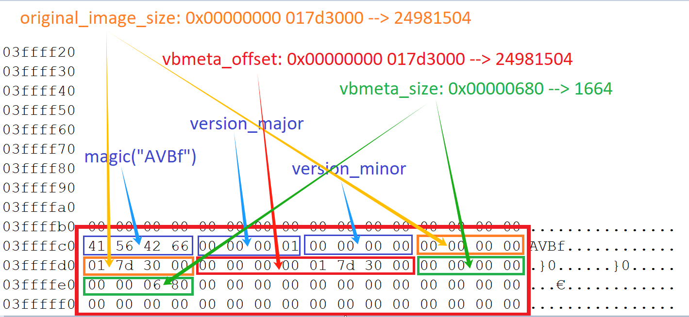
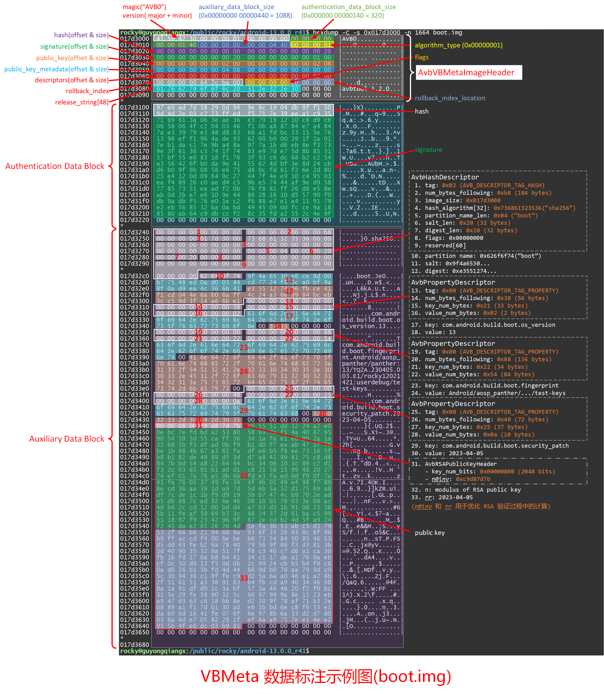

# 20241219-硬核: VBMeta 数据解析和签名验证实战


## 1. 导读

在上一篇《AVB 的 VBMeta 数据是如何生成的？》中，我们分析了 VBMeta 数据时如何生成的，以及 VBMeta 的主要布局，但并没有进一步深入检查 VBMeta 的数据。

本篇我们继续深入 VBMeta 数据，实战手动验证签名，解析各种描述符。


## 2. 解析 boot 分区 vbmeta

先看下 avbtool 提取的信息:

```bash
$ avbtool info_image --image boot.img
Footer version:           1.0
Image size:               67108864 bytes
Original image size:      24981504 bytes
VBMeta offset:            24981504
VBMeta size:              1664 bytes
--
Minimum libavb version:   1.0
Header Block:             256 bytes
Authentication Block:     320 bytes
Auxiliary Block:          1088 bytes
Public key (sha1):        cdbb77177f731920bbe0a0f94f84d9038ae0617d
Algorithm:                SHA256_RSA2048
Rollback Index:           1680652800
Flags:                    0
Rollback Index Location:  0
Release String:           'avbtool 1.2.0'
Descriptors:
    Hash descriptor:
      Image Size:            24981504 bytes
      Hash Algorithm:        sha256
      Partition Name:        boot
      Salt:                  9f4a6530e6ce8d00b77548ed0ad00344cd7724f83ca0bf9a8f0ad9ea4c366b41
      Digest:                e355127406fbce41f1cd044e6ab06aff4c24a36e9984bceb3cc59d3f14a66be1
      Flags:                 0
    Prop: com.android.build.boot.os_version -> '13'
    Prop: com.android.build.boot.fingerprint -> 'Android/aosp_panther/panther:13/TQ2A.230405.003.E1/rocky12021421:userdebug/test-keys'
    Prop: com.android.build.boot.security_patch -> '2023-04-05'
```


这里我们手动解析 boot.img

### 2.1 查看 AVB Footer

通过命令 `ls -al boot.img | cut -d' ' -f5` 获取 boot.img 的大小，并查看文件的末尾 64 个字节，如下：

```bash
rocky@guyongqiangx:/public/rocky/android-13.0.0_r41$ ls -al boot.img | cut -d' ' -f5
67108864
rocky@guyongqiangx:/public/rocky/android-13.0.0_r41$ hexdump -Cv -s $((67108864-64)) boot.img
03ffffc0  41 56 42 66 00 00 00 01  00 00 00 00 00 00 00 00  |AVBf............|
03ffffd0  01 7d 30 00 00 00 00 00  01 7d 30 00 00 00 00 00  |.}0......}0.....|
03ffffe0  00 00 06 80 00 00 00 00  00 00 00 00 00 00 00 00  |................|
03fffff0  00 00 00 00 00 00 00 00  00 00 00 00 00 00 00 00  |................|
04000000
```



解析结果：

```
              magic( 4): 41 56 42 66              -> magic: "AVBf"
      version_major( 4): 00 00 00 01              -> major: 1
      version_minor( 4): 00 00 00 00              -> minor: 0
original_image_size( 8): 00 00 00 00  01 7d 30 00 -> 0x00000000 017d3000 = 24981504
      vbmeta_offset( 8): 00 00 00 00  01 7d 30 00 -> 0x00000000 017d3000 = 24981504
        vbmeta_size( 8): 00 00 00 00  00 00 06 80 -> 0x00000000 00000680 = 1664
```

所以，通过最后 64 字节的 AVB Footer 解析得到以下内容：

```
Footer version:           1.0
Image size:               67108864 bytes
Original image size:      24981504 bytes
VBMeta offset:            24981504
VBMeta size:              1664 bytes
```

### 2.2 查看 VBMeta

通过上一节的 AVB Footer 我们看到 `vbmeta_offset = 0x017d3000`, `vbmeta_size = 0x0680 = 1664`

所以镜像 0x017d3000 开始的 1664 字节内容就是 boot.img 的 VBMeta 数据了。

> 手动解析和标注 VBMeta 实在太花时间了，我这里就只解析 boot.img 的 VBMeta 数据。强哥我花了一整天，才将 boot.img 的 VBMeta 数据在输出的图上标注了出来。简直崩了个溃~
>
> 如果有兴趣，可以自行试着标注 system.img 或者 vbmeta.img 的 VBMeta 数据。

在上一篇中，我们介绍过 VBMeta 的布局，如下：


基于 boot.img 标注的 VBMeta 数据如下：



经过标注，对 VBMeta 数据的布局理解更加深刻。

VBMeta 总体分成 3 个部分：

- AvbVBMetaImageHeader
- Authentication Data Block
- Auxiliary Data Block

在 Authentication Data Block 内包含了基于 AvbVBMetaImageHeader 和 Auxiliary Data Block 数据计算的哈希，以及签名；

在 Auxiliary Data Block 内包含了多个 Descriptor 描述符，以及用于验证签名的 public key 公钥；

## 3. 手动验证 VBMeta 数据

你以为通过手动标记出 VBMeta 就完了吗？

在手动标记过程中，已经解析了各种描述符等信息，接下来我会对 VBMeta 的哈希和签名等数据进行验证。

### 3.1 分割 VBMeta 数据

定位 VBMeta 数据以后，基于 AvbVBMetaImageHeader 中 `authentication_data_block_size` 和 `auxiliary_data_block_size` 提取各部分数据。


```bash
# 1. 提取整个 vbmeta 数据到 vbmeta.bin
$ dd if=boot.img of=vbmeta.bin skip=24981504 bs=1 count=1664

# 2. 从 vbmeta.bin 中分别提取 AvbVBMetaImageHeader, Authentication Data 和 Auxiliary Data
# AvbVBMetaImageHeader 256 bytes
# authentication_data_block_size = 0x0140 bytes
# auxiliary_data_block_size = 0x0440 bytes
$ dd if=vbmeta.bin of=vbmeta-header.bin bs=1 count=256
$ dd if=vbmeta.bin of=vbmeta-auth.bin skip=256 bs=1 count=$((0x0140))
$ dd if=vbmeta.bin of=vbmeta-auxiliary.bin skip=$((256 + $((0x0140)))) bs=1 count=$((0x0440))
```


### 3.2 计算哈希

计算 AvbVBMetaImageHeader 和 Auxiliary Data 的 sha256 哈希

```bash
$ cat vbmeta-header.bin vbmeta-auxiliary.bin | sha256sum
97e0ad7d58290d949e8c1904db9ff1508d4d2e03c223ffedf5717e39eea1c935  -
```

对比 Authentication Data 的前 32 字节内容：

```bash
$ hexdump -Cv -n 32 vbmeta-auth.bin 
00000000  97 e0 ad 7d 58 29 0d 94  9e 8c 19 04 db 9f f1 50  |...}X).........P|
00000010  8d 4d 2e 03 c2 23 ff ed  f5 71 7e 39 ee a1 c9 35  |.M...#...q~9...5|
00000020
```


验证了 Authentication Data 前面 32 字节就是 AvbVBMetaImageHeader 和 Auxiliary Data 的 sha256 哈希。


### 3.3 提取 VBMeta 的公钥

为了验证 VBMeta 的签名，需要获取验证使用的公钥。

这里的公钥有两种途径获得：

1. 直接从avbtool 处理 boot.img 时签名的秘钥中提取公钥
2. 从 Auxiliary Data 中提取 public key 公钥数据

这两种方式我们这里都分别进行操作。


#### a. 从签名的秘钥中提取公钥

在前面使用 avbtool 处理 boot.img 时，传入的秘钥为 `external/avb/test/data/testkey_rsa2048.pem`

我们这里使用 openssl 查看下这个秘钥的信息，并导出公钥

```bash
# 从签名的私钥 testkey_rsa2048.pem 中导出用于验证签名的公钥 testkey_rsa2048_pub.pem
$ openssl rsa -in external/avb/test/data/testkey_rsa2048.pem -pubout -out testkey_rsa2048_pub.pem
writing RSA key

# 查看公钥的明文内容，或者也可以使用 `cat testkey_rsa2048_pub.pem` 查看，只是没有明文输出
$ openssl rsa -inform PEM -pubin -in testkey_rsa2048_pub.pem -text
RSA Public-Key: (2048 bit)
Modulus:
    00:c6:55:51:dd:32:24:a2:e0:0e:bc:7e:fd:bd:a2:
    53:80:58:69:7e:f5:4a:40:87:95:90:54:59:3d:55:
    ca:ff:36:34:1a:fa:e1:e0:90:2a:1a:32:68:5b:f3:
    df:ad:0b:f9:b1:d0:f7:ea:ab:47:1f:76:be:1b:98:
    4b:67:a3:62:fa:df:e6:b5:f8:ee:73:16:5f:b8:b1:
    82:de:49:89:d5:3d:d7:a8:42:99:81:75:c8:d8:84:
    7b:bd:54:a8:22:64:44:bc:34:06:10:3c:89:c2:d1:
    f3:2c:03:65:91:b1:a0:d1:c8:21:56:15:99:48:20:
    27:74:ef:01:7a:76:a5:0b:6b:fd:e3:fa:ed:0d:f9:
    0f:7a:41:fa:76:05:37:49:fe:34:4f:4b:01:49:e4:
    98:f7:89:8e:cd:36:aa:39:1d:a9:7d:5d:6b:5a:52:
    d1:75:69:a8:df:7c:de:1c:1b:f9:d9:19:5b:b7:47:
    4c:b9:70:2e:ad:e5:d6:88:7c:ed:92:6e:46:08:10:
    b5:76:03:3e:09:ac:4d:b6:2c:cd:12:00:bd:d4:a7:
    03:d3:1b:91:08:23:36:5b:11:fe:af:59:69:b3:3c:
    88:24:37:2d:61:ba:c5:99:51:18:97:f9:23:42:96:
    9f:87:2e:cd:b2:4d:5f:a9:24:f2:45:da:e2:65:26:
    26:4d
Exponent: 65537 (0x10001)
writing RSA key
-----BEGIN PUBLIC KEY-----
MIIBIjANBgkqhkiG9w0BAQEFAAOCAQ8AMIIBCgKCAQEAxlVR3TIkouAOvH79vaJT
gFhpfvVKQIeVkFRZPVXK/zY0Gvrh4JAqGjJoW/PfrQv5sdD36qtHH3a+G5hLZ6Ni
+t/mtfjucxZfuLGC3kmJ1T3XqEKZgXXI2IR7vVSoImREvDQGEDyJwtHzLANlkbGg
0cghVhWZSCAndO8BenalC2v94/rtDfkPekH6dgU3Sf40T0sBSeSY94mOzTaqOR2p
fV1rWlLRdWmo33zeHBv52Rlbt0dMuXAureXWiHztkm5GCBC1dgM+CaxNtizNEgC9
1KcD0xuRCCM2WxH+r1lpszyIJDctYbrFmVEYl/kjQpafhy7Nsk1fqSTyRdriZSYm
TQIDAQAB
-----END PUBLIC KEY-----

$ md5sum testkey_rsa2048_pub.pem 
cb07e4a86d943a8ad4390b58f54ecc63  testkey_rsa2048_pub.pem
```


#### b. 从 Auxiliary Data 中提取 public key 公钥数据

根据前面 VBMeta 手动标注的结果，公钥 public key 位于 Auxiliary Data 的 0x0200 偏移位置，大小为 0x0208。

因此，我们从 Auxiliary Data 中提取公钥:

```bash
# 1. 从 vbmeta-auxiliary.bin 中提取公钥数据
# 由于 dd 的命令不直接支持十六进制，所以我这里使用 $((0x0200)) 这样的方式转换 
$ dd if=vbmeta-auxiliary.bin of=pub_key.bin skip=$((0x0200)) bs=1 count=$((0x0208)) 
520+0 records in
520+0 records out
520 bytes copied, 0.0759345 s, 6.8 kB/s

# 2. 查看 sha1 哈希值，和 `avbtool info_image` 中的输出一致
# Public key (sha1):        cdbb77177f731920bbe0a0f94f84d9038ae0617d
$ sha1sum pub_key.bin 
cdbb77177f731920bbe0a0f94f84d9038ae0617d  pub_key.bin

# 3. 查看公钥数据
# 公钥数据的头部是 8 字节的: AvbRSAPublicKeyHeader
# 包括: key_num_bits(4 bytes), n0inv(4 bytes), 随后才是公钥的 modulus 数据
$ hexdump -Cv pub_key.bin
00000000  00 00 08 00 c9 d8 7d 7b  c6 55 51 dd 32 24 a2 e0  |......}{.UQ.2$..|
00000010  0e bc 7e fd bd a2 53 80  58 69 7e f5 4a 40 87 95  |..~...S.Xi~.J@..|
00000020  90 54 59 3d 55 ca ff 36  34 1a fa e1 e0 90 2a 1a  |.TY=U..64.....*.|
00000030  32 68 5b f3 df ad 0b f9  b1 d0 f7 ea ab 47 1f 76  |2h[..........G.v|
00000040  be 1b 98 4b 67 a3 62 fa  df e6 b5 f8 ee 73 16 5f  |...Kg.b......s._|
00000050  b8 b1 82 de 49 89 d5 3d  d7 a8 42 99 81 75 c8 d8  |....I..=..B..u..|
00000060  84 7b bd 54 a8 22 64 44  bc 34 06 10 3c 89 c2 d1  |.{.T."dD.4..<...|
00000070  f3 2c 03 65 91 b1 a0 d1  c8 21 56 15 99 48 20 27  |.,.e.....!V..H '|
00000080  74 ef 01 7a 76 a5 0b 6b  fd e3 fa ed 0d f9 0f 7a  |t..zv..k.......z|
00000090  41 fa 76 05 37 49 fe 34  4f 4b 01 49 e4 98 f7 89  |A.v.7I.4OK.I....|
000000a0  8e cd 36 aa 39 1d a9 7d  5d 6b 5a 52 d1 75 69 a8  |..6.9..}]kZR.ui.|
000000b0  df 7c de 1c 1b f9 d9 19  5b b7 47 4c b9 70 2e ad  |.|......[.GL.p..|
000000c0  e5 d6 88 7c ed 92 6e 46  08 10 b5 76 03 3e 09 ac  |...|..nF...v.>..|
000000d0  4d b6 2c cd 12 00 bd d4  a7 03 d3 1b 91 08 23 36  |M.,...........#6|
000000e0  5b 11 fe af 59 69 b3 3c  88 24 37 2d 61 ba c5 99  |[...Yi.<.$7-a...|
000000f0  51 18 97 f9 23 42 96 9f  87 2e cd b2 4d 5f a9 24  |Q...#B......M_.$|
00000100  f2 45 da e2 65 26 26 4d  1e fa 3b 53 ab c5 d3 79  |.E..e&&M..;S...y|
00000110  53 2f 66 b8 21 94 66 9a  93 6f 35 26 43 8c 8f 96  |S/f.!.f..o5&C...|
00000120  b9 ff ac cd f4 00 6e be  b6 73 54 84 50 85 46 53  |......n..sT.P.FS|
00000130  d5 dd 43 fe b2 6a 78 40  79 56 9f 86 f3 d3 81 3b  |..C..jx@yV.....;|
00000140  3d 40 90 35 32 9a 51 7f  f8 c3 4b c7 d6 a1 ca 30  |=@.52.Q...K....0|
00000150  fb 1b fd 27 0a b8 64 41  34 c1 17 de a1 76 9a eb  |...'..dA4....v..|
00000160  cf 0c 50 d9 13 f5 0d 0b  2c 99 24 cb b5 b4 f8 c6  |..P.....,.$.....|
00000170  0a d0 26 b1 5b fd 4d 44  66 9d b0 76 aa 79 9d c0  |..&.[.MDf..v.y..|
00000180  5c 3b 94 36 c1 8f fe c9  d2 5a 6a a0 46 e1 a2 8b  |\;.6.....Zj.F...|
00000190  2f 51 61 51 a3 36 91 83  b4 fb cd a9 40 34 46 98  |/QaQ.6......@4F.|
000001a0  8a 1a 91 df d9 2c 3a bf  57 3a 46 46 20 f2 f0 bc  |.....,:.W:FF ...|
000001b0  31 5e 29 fe 58 90 32 5c  66 97 99 9a 8e 15 23 eb  |1^).X.2\f.....#.|
000001c0  a9 47 d3 63 c6 18 bb 8e  d2 20 9f 78 af 71 b3 2e  |.G.c..... .x.q..|
000001d0  08 89 a1 f1 7d b1 30 a0  e6 1b bd 6e c8 f6 33 e1  |....}.0....n..3.|
000001e0  da b0 bd 16 41 fe 07 6f  6e 97 8b 6a 33 d2 d7 80  |....A..on..j3...|
000001f0  03 6a 4d e7 05 82 28 1f  ef 6a a9 75 7e e1 4e e2  |.jM...(..j.u~.N.|
00000200  95 5b 4f e6 dc 03 b9 81                           |.[O.....|
00000208

# 4. 将十六进制的 public key 数据转换成 modulus 字符串
# 使用以下的 xxd 或 hexdump 命令均可获得 public key 的 modulus，从而通过 (mmodulus, e) 构建公钥
# modulus=$(echo -n $(xxd -ps -s 8 -l 256 pub_key.bin) | tr -d ' ')
# modulus=$(hexdump -v -e '1/1 "%02x"' -s 8 -n 256 pub_key.bin)
$ modulus=$(echo -n $(xxd -ps -s 8 -l 256 pub_key.bin) | tr -d ' ')
$ echo $modulus
c65551dd3224a2e00ebc7efdbda2538058697ef54a4087959054593d55caff36341afae1e0902a1a32685bf3dfad0bf9b1d0f7eaab471f76be1b984b67a362fadfe6b5f8ee73165fb8b182de4989d53dd7a842998175c8d8847bbd54a8226444bc3406103c89c2d1f32c036591b1a0d1c82156159948202774ef017a76a50b6bfde3faed0df90f7a41fa76053749fe344f4b0149e498f7898ecd36aa391da97d5d6b5a52d17569a8df7cde1c1bf9d9195bb7474cb9702eade5d6887ced926e460810b576033e09ac4db62ccd1200bdd4a703d31b910823365b11feaf5969b33c8824372d61bac599511897f92342969f872ecdb24d5fa924f245dae26526264d

# 5. 创建公钥描述结构 pubkey.asn1
$ (
  echo "asn1=SEQUENCE:pubkey"
  echo "[pubkey]"
  echo "algorithm=SEQUENCE:alg"
  echo "pubkey=BITWRAP,SEQUENCE:rsa"
  echo "[alg]"
  echo "algorithm=OID:rsaEncryption"
  echo "parameter=NULL"
  echo "[rsa]"
  echo "n=INTEGER:0x${modulus}"
  echo "e=INTEGER:65537"
) > pubkey.asn1

# 6. 基于公钥描述结构 pubkey.asn1 文件创建 DER 格式公钥
$ openssl asn1parse -genconf pubkey.asn1 -out pubkey.der -noout

# 7. 将 DER 格式的公钥转换成 PEM 格式
$ openssl rsa -in pubkey.der -inform DER -pubin -out pubkey.pem
writing RSA key

# 显示公钥内容
$ $ openssl rsa -in pubkey.pem -pubin -text
RSA Public-Key: (2048 bit)
Modulus:
    00:c6:55:51:dd:32:24:a2:e0:0e:bc:7e:fd:bd:a2:
    53:80:58:69:7e:f5:4a:40:87:95:90:54:59:3d:55:
    ca:ff:36:34:1a:fa:e1:e0:90:2a:1a:32:68:5b:f3:
    df:ad:0b:f9:b1:d0:f7:ea:ab:47:1f:76:be:1b:98:
    4b:67:a3:62:fa:df:e6:b5:f8:ee:73:16:5f:b8:b1:
    82:de:49:89:d5:3d:d7:a8:42:99:81:75:c8:d8:84:
    7b:bd:54:a8:22:64:44:bc:34:06:10:3c:89:c2:d1:
    f3:2c:03:65:91:b1:a0:d1:c8:21:56:15:99:48:20:
    27:74:ef:01:7a:76:a5:0b:6b:fd:e3:fa:ed:0d:f9:
    0f:7a:41:fa:76:05:37:49:fe:34:4f:4b:01:49:e4:
    98:f7:89:8e:cd:36:aa:39:1d:a9:7d:5d:6b:5a:52:
    d1:75:69:a8:df:7c:de:1c:1b:f9:d9:19:5b:b7:47:
    4c:b9:70:2e:ad:e5:d6:88:7c:ed:92:6e:46:08:10:
    b5:76:03:3e:09:ac:4d:b6:2c:cd:12:00:bd:d4:a7:
    03:d3:1b:91:08:23:36:5b:11:fe:af:59:69:b3:3c:
    88:24:37:2d:61:ba:c5:99:51:18:97:f9:23:42:96:
    9f:87:2e:cd:b2:4d:5f:a9:24:f2:45:da:e2:65:26:
    26:4d
Exponent: 65537 (0x10001)
writing RSA key
-----BEGIN PUBLIC KEY-----
MIIBIjANBgkqhkiG9w0BAQEFAAOCAQ8AMIIBCgKCAQEAxlVR3TIkouAOvH79vaJT
gFhpfvVKQIeVkFRZPVXK/zY0Gvrh4JAqGjJoW/PfrQv5sdD36qtHH3a+G5hLZ6Ni
+t/mtfjucxZfuLGC3kmJ1T3XqEKZgXXI2IR7vVSoImREvDQGEDyJwtHzLANlkbGg
0cghVhWZSCAndO8BenalC2v94/rtDfkPekH6dgU3Sf40T0sBSeSY94mOzTaqOR2p
fV1rWlLRdWmo33zeHBv52Rlbt0dMuXAureXWiHztkm5GCBC1dgM+CaxNtizNEgC9
1KcD0xuRCCM2WxH+r1lpszyIJDctYbrFmVEYl/kjQpafhy7Nsk1fqSTyRdriZSYm
TQIDAQAB
-----END PUBLIC KEY-----

$ md5sum pubkey.pem 
cb07e4a86d943a8ad4390b58f54ecc63  pubkey.pem
```


从这里可以看到，我们最终通过两种方式都获取到了验证签名的公钥(两个公钥文件的 md5 值一样)。

- 从签名使用的 testkey_rsa2048.pem 中提取公钥
- 从 Auxiliary Data 中提取数据构建公钥


### 3.4 使用公钥验证签名

我们从上一步中拿到了公钥 testkey_rsa2048.pem 或 pubkey.pem，二者完全一样。

这里我们使用这个公钥验证 VBMeta 数据的签名。


从 Authentication Data 中提取签名数据到 signature.bin:

```bash
# 签名数据的偏移为: 256(vbmeta header) + 0x20(hash size)
# 签名数据的大小为: 0x100(256) bytes
$ dd if=vbmeta.bin of=signature.bin skip=$((256+0x20)) bs=1 count=$((0x100))
```


我们可以试着解密原始的签名数据:

```bash
$ openssl rsautl -in signature.bin -inkey pubkey.pem -pubin -verify -hexdump -raw
0000 - 00 01 ff ff ff ff ff ff-ff ff ff ff ff ff ff ff   ................
0010 - ff ff ff ff ff ff ff ff-ff ff ff ff ff ff ff ff   ................
0020 - ff ff ff ff ff ff ff ff-ff ff ff ff ff ff ff ff   ................
0030 - ff ff ff ff ff ff ff ff-ff ff ff ff ff ff ff ff   ................
0040 - ff ff ff ff ff ff ff ff-ff ff ff ff ff ff ff ff   ................
0050 - ff ff ff ff ff ff ff ff-ff ff ff ff ff ff ff ff   ................
0060 - ff ff ff ff ff ff ff ff-ff ff ff ff ff ff ff ff   ................
0070 - ff ff ff ff ff ff ff ff-ff ff ff ff ff ff ff ff   ................
0080 - ff ff ff ff ff ff ff ff-ff ff ff ff ff ff ff ff   ................
0090 - ff ff ff ff ff ff ff ff-ff ff ff ff ff ff ff ff   ................
00a0 - ff ff ff ff ff ff ff ff-ff ff ff ff ff ff ff ff   ................
00b0 - ff ff ff ff ff ff ff ff-ff ff ff ff ff ff ff ff   ................
00c0 - ff ff ff ff ff ff ff ff-ff ff ff ff 00 30 31 30   .............010
00d0 - 0d 06 09 60 86 48 01 65-03 04 02 01 05 00 04 20   ...`.H.e.......
00e0 - 97 e0 ad 7d 58 29 0d 94-9e 8c 19 04 db 9f f1 50   ...}X).........P
00f0 - 8d 4d 2e 03 c2 23 ff ed-f5 71 7e 39 ee a1 c9 35   .M...#...q~9...5
```


这里的最后两行就是和 3.2 一节算出来的一样的哈希值了。


或者我们也可以直接验证哈希值，但需要提前准备好签名数据。

将签名的 AvbVBMetaImageHeader 和 Auxiliary Data 数据合并成一个 data.bin 文件，因为签名时基于这两个部分的数据进行计算的：

```bash
$ cat vbmeta-header.bin vbmeta-auxiliary.bin > data.bin
```


直接使用数据 data.bin 和 signature.bin 验证签名：

```bash
$ openssl dgst -sha256 -verify pubkey.pem -signature signature.bin data.bin
Verified OK
```


显然，这里直接验证签名成功。


> 本篇实战内容涉及到一些关于 sha256 哈希，以及私钥签名，公钥验证等密码学知识，以及各种 openssl 命令。估计不少同学会不太清楚各种具体命令的意思，即使操作了也会有似懂非懂的感觉。
>
> 更多关于使用 openssl 命令利用非对称秘钥进行加密和解密，以及签名和验证，请参考以下文章：
>
> [《OpenSSL RSA Key的生成和转换》](https://blog.csdn.net/guyongqiangx/article/details/74331892)
>
> - https://blog.csdn.net/guyongqiangx/article/details/74331892
>
> [《OpenSSL和Python实现RSA Key公钥加密私钥解密》](https://blog.csdn.net/guyongqiangx/article/details/74732434)
>
> - https://blog.csdn.net/guyongqiangx/article/details/74732434
>
> [《OpenSSL和Python实现RSA Key数字签名和验证》](https://blog.csdn.net/guyongqiangx/article/details/74454969)
>
> - https://blog.csdn.net/guyongqiangx/article/details/74454969

## 4. 原始的 vbmeta 数据

我强烈建议你也试着手动解析 boot.img 的 VBMeta 数据实战下。

以下是我解析的原始数据，你可以对照我上面的标注图试着对这块 VBMeta 数据解析看看。

```bash
$ hexdump -Cv -s 0x017d3000 -n 1664 boot.img
017d3000  41 56 42 30 00 00 00 01  00 00 00 00 00 00 00 00  |AVB0............|
017d3010  00 00 01 40 00 00 00 00  00 00 04 40 00 00 00 01  |...@.......@....|
017d3020  00 00 00 00 00 00 00 00  00 00 00 00 00 00 00 20  |............... |
017d3030  00 00 00 00 00 00 00 20  00 00 00 00 00 00 01 00  |....... ........|
017d3040  00 00 00 00 00 00 02 00  00 00 00 00 00 00 02 08  |................|
017d3050  00 00 00 00 00 00 04 08  00 00 00 00 00 00 00 00  |................|
017d3060  00 00 00 00 00 00 00 00  00 00 00 00 00 00 02 00  |................|
017d3070  00 00 00 00 64 2c ba 00  00 00 00 00 00 00 00 00  |....d,..........|
017d3080  61 76 62 74 6f 6f 6c 20  31 2e 32 2e 30 00 00 00  |avbtool 1.2.0...|
017d3090  00 00 00 00 00 00 00 00  00 00 00 00 00 00 00 00  |................|
017d30a0  00 00 00 00 00 00 00 00  00 00 00 00 00 00 00 00  |................|
017d30b0  00 00 00 00 00 00 00 00  00 00 00 00 00 00 00 00  |................|
017d30c0  00 00 00 00 00 00 00 00  00 00 00 00 00 00 00 00  |................|
017d30d0  00 00 00 00 00 00 00 00  00 00 00 00 00 00 00 00  |................|
017d30e0  00 00 00 00 00 00 00 00  00 00 00 00 00 00 00 00  |................|
017d30f0  00 00 00 00 00 00 00 00  00 00 00 00 00 00 00 00  |................|
017d3100  97 e0 ad 7d 58 29 0d 94  9e 8c 19 04 db 9f f1 50  |...}X).........P|
017d3110  8d 4d 2e 03 c2 23 ff ed  f5 71 7e 39 ee a1 c9 35  |.M...#...q~9...5|
017d3120  71 b9 61 3a 06 3e ae 36  e3 79 19 12 10 c8 d9 cb  |q.a:.>.6.y......|
017d3130  06 58 06 4f c2 04 03 46  f1 0b a8 87 84 e7 a4 84  |.X.O...F........|
017d3140  7a e3 39 79 e3 48 d8 83  68 a1 fd bc 33 15 5e 76  |z.9y.H..h...3.^v|
017d3150  13 96 ef f1 96 4a de 93  62 00 b9 00 39 1f 2a 01  |.....J..b...9.*.|
017d3160  7e b1 da c1 7e 9b a4 8a  97 7a 1b d6 eb 8e f3 73  |~...~....z.....s|
017d3170  9e 3f 61 36 c3 74 1f 74  83 e9 7d e7 5d 8b 85 31  |.?a6.t.t..}.]..1|
017d3180  57 bf 55 e6 83 18 f1 76  3f 93 c6 dc 68 b2 c2 54  |W.U....v?...h..T|
017d3190  a3 56 42 6f b0 da 9e 41  55 62 4d bf 3e 8d 24 cb  |.VBo...AUbM.>.$.|
017d31a0  d6 b0 9f 9b 08 58 e6 75  d8 0c fd 61 f2 6e 2d 80  |.....X.u...a.n-.|
017d31b0  25 e4 12 0d 09 64 0c 27  44 7f 4e e9 10 c4 95 03  |%....d.'D.N.....|
017d31c0  ea f4 89 26 c0 ae d4 c5  9b e5 74 44 af 9e d9 58  |...&......tD...X|
017d31d0  77 85 73 51 ea ad f2 0b  76 f8 81 ff 26 d8 e5 8e  |w.sQ....v...&...|
017d31e0  ab 0d 2b e7 e6 10 9e 44  86 28 16 10 d5 57 90 f0  |..+....D.(...W..|
017d31f0  db 9a db f5 76 e0 1e c2  f6 88 e7 e1 a4 11 91 79  |....v..........y|
017d3200  e2 eb 56 85 32 ba 0a bd  49 45 09 0d fc ce 9a 18  |..V.2...IE......|
017d3210  85 80 ab 64 c9 db cc f2  8c 35 fd a2 55 2c 4e 9f  |...d.....5..U,N.|
017d3220  00 00 00 00 00 00 00 00  00 00 00 00 00 00 00 00  |................|
017d3230  00 00 00 00 00 00 00 00  00 00 00 00 00 00 00 00  |................|
017d3240  00 00 00 00 00 00 00 02  00 00 00 00 00 00 00 b8  |................|
017d3250  00 00 00 00 01 7d 30 00  73 68 61 32 35 36 00 00  |.....}0.sha256..|
017d3260  00 00 00 00 00 00 00 00  00 00 00 00 00 00 00 00  |................|
017d3270  00 00 00 00 00 00 00 00  00 00 00 04 00 00 00 20  |............... |
017d3280  00 00 00 20 00 00 00 00  00 00 00 00 00 00 00 00  |... ............|
017d3290  00 00 00 00 00 00 00 00  00 00 00 00 00 00 00 00  |................|
017d32a0  00 00 00 00 00 00 00 00  00 00 00 00 00 00 00 00  |................|
017d32b0  00 00 00 00 00 00 00 00  00 00 00 00 00 00 00 00  |................|
017d32c0  00 00 00 00 62 6f 6f 74  9f 4a 65 30 e6 ce 8d 00  |....boot.Je0....|
017d32d0  b7 75 48 ed 0a d0 03 44  cd 77 24 f8 3c a0 bf 9a  |.uH....D.w$.<...|
017d32e0  8f 0a d9 ea 4c 36 6b 41  e3 55 12 74 06 fb ce 41  |....L6kA.U.t...A|
017d32f0  f1 cd 04 4e 6a b0 6a ff  4c 24 a3 6e 99 84 bc eb  |...Nj.j.L$.n....|
017d3300  3c c5 9d 3f 14 a6 6b e1  00 00 00 00 00 00 00 00  |<..?..k.........|
017d3310  00 00 00 00 00 00 00 38  00 00 00 00 00 00 00 21  |.......8.......!|
017d3320  00 00 00 00 00 00 00 02  63 6f 6d 2e 61 6e 64 72  |........com.andr|
017d3330  6f 69 64 2e 62 75 69 6c  64 2e 62 6f 6f 74 2e 6f  |oid.build.boot.o|
017d3340  73 5f 76 65 72 73 69 6f  6e 00 31 33 00 00 00 00  |s_version.13....|
017d3350  00 00 00 00 00 00 00 00  00 00 00 00 00 00 00 88  |................|
017d3360  00 00 00 00 00 00 00 22  00 00 00 00 00 00 00 54  |.......".......T|
017d3370  63 6f 6d 2e 61 6e 64 72  6f 69 64 2e 62 75 69 6c  |com.android.buil|
017d3380  64 2e 62 6f 6f 74 2e 66  69 6e 67 65 72 70 72 69  |d.boot.fingerpri|
017d3390  6e 74 00 41 6e 64 72 6f  69 64 2f 61 6f 73 70 5f  |nt.Android/aosp_|
017d33a0  70 61 6e 74 68 65 72 2f  70 61 6e 74 68 65 72 3a  |panther/panther:|
017d33b0  31 33 2f 54 51 32 41 2e  32 33 30 34 30 35 2e 30  |13/TQ2A.230405.0|
017d33c0  30 33 2e 45 31 2f 72 6f  63 6b 79 31 32 30 32 31  |03.E1/rocky12021|
017d33d0  34 32 31 3a 75 73 65 72  64 65 62 75 67 2f 74 65  |421:userdebug/te|
017d33e0  73 74 2d 6b 65 79 73 00  00 00 00 00 00 00 00 00  |st-keys.........|
017d33f0  00 00 00 00 00 00 00 48  00 00 00 00 00 00 00 25  |.......H.......%|
017d3400  00 00 00 00 00 00 00 0a  63 6f 6d 2e 61 6e 64 72  |........com.andr|
017d3410  6f 69 64 2e 62 75 69 6c  64 2e 62 6f 6f 74 2e 73  |oid.build.boot.s|
017d3420  65 63 75 72 69 74 79 5f  70 61 74 63 68 00 32 30  |ecurity_patch.20|
017d3430  32 33 2d 30 34 2d 30 35  00 00 00 00 00 00 00 00  |23-04-05........|
017d3440  00 00 08 00 c9 d8 7d 7b  c6 55 51 dd 32 24 a2 e0  |......}{.UQ.2$..|
017d3450  0e bc 7e fd bd a2 53 80  58 69 7e f5 4a 40 87 95  |..~...S.Xi~.J@..|
017d3460  90 54 59 3d 55 ca ff 36  34 1a fa e1 e0 90 2a 1a  |.TY=U..64.....*.|
017d3470  32 68 5b f3 df ad 0b f9  b1 d0 f7 ea ab 47 1f 76  |2h[..........G.v|
017d3480  be 1b 98 4b 67 a3 62 fa  df e6 b5 f8 ee 73 16 5f  |...Kg.b......s._|
017d3490  b8 b1 82 de 49 89 d5 3d  d7 a8 42 99 81 75 c8 d8  |....I..=..B..u..|
017d34a0  84 7b bd 54 a8 22 64 44  bc 34 06 10 3c 89 c2 d1  |.{.T."dD.4..<...|
017d34b0  f3 2c 03 65 91 b1 a0 d1  c8 21 56 15 99 48 20 27  |.,.e.....!V..H '|
017d34c0  74 ef 01 7a 76 a5 0b 6b  fd e3 fa ed 0d f9 0f 7a  |t..zv..k.......z|
017d34d0  41 fa 76 05 37 49 fe 34  4f 4b 01 49 e4 98 f7 89  |A.v.7I.4OK.I....|
017d34e0  8e cd 36 aa 39 1d a9 7d  5d 6b 5a 52 d1 75 69 a8  |..6.9..}]kZR.ui.|
017d34f0  df 7c de 1c 1b f9 d9 19  5b b7 47 4c b9 70 2e ad  |.|......[.GL.p..|
017d3500  e5 d6 88 7c ed 92 6e 46  08 10 b5 76 03 3e 09 ac  |...|..nF...v.>..|
017d3510  4d b6 2c cd 12 00 bd d4  a7 03 d3 1b 91 08 23 36  |M.,...........#6|
017d3520  5b 11 fe af 59 69 b3 3c  88 24 37 2d 61 ba c5 99  |[...Yi.<.$7-a...|
017d3530  51 18 97 f9 23 42 96 9f  87 2e cd b2 4d 5f a9 24  |Q...#B......M_.$|
017d3540  f2 45 da e2 65 26 26 4d  1e fa 3b 53 ab c5 d3 79  |.E..e&&M..;S...y|
017d3550  53 2f 66 b8 21 94 66 9a  93 6f 35 26 43 8c 8f 96  |S/f.!.f..o5&C...|
017d3560  b9 ff ac cd f4 00 6e be  b6 73 54 84 50 85 46 53  |......n..sT.P.FS|
017d3570  d5 dd 43 fe b2 6a 78 40  79 56 9f 86 f3 d3 81 3b  |..C..jx@yV.....;|
017d3580  3d 40 90 35 32 9a 51 7f  f8 c3 4b c7 d6 a1 ca 30  |=@.52.Q...K....0|
017d3590  fb 1b fd 27 0a b8 64 41  34 c1 17 de a1 76 9a eb  |...'..dA4....v..|
017d35a0  cf 0c 50 d9 13 f5 0d 0b  2c 99 24 cb b5 b4 f8 c6  |..P.....,.$.....|
017d35b0  0a d0 26 b1 5b fd 4d 44  66 9d b0 76 aa 79 9d c0  |..&.[.MDf..v.y..|
017d35c0  5c 3b 94 36 c1 8f fe c9  d2 5a 6a a0 46 e1 a2 8b  |\;.6.....Zj.F...|
017d35d0  2f 51 61 51 a3 36 91 83  b4 fb cd a9 40 34 46 98  |/QaQ.6......@4F.|
017d35e0  8a 1a 91 df d9 2c 3a bf  57 3a 46 46 20 f2 f0 bc  |.....,:.W:FF ...|
017d35f0  31 5e 29 fe 58 90 32 5c  66 97 99 9a 8e 15 23 eb  |1^).X.2\f.....#.|
017d3600  a9 47 d3 63 c6 18 bb 8e  d2 20 9f 78 af 71 b3 2e  |.G.c..... .x.q..|
017d3610  08 89 a1 f1 7d b1 30 a0  e6 1b bd 6e c8 f6 33 e1  |....}.0....n..3.|
017d3620  da b0 bd 16 41 fe 07 6f  6e 97 8b 6a 33 d2 d7 80  |....A..on..j3...|
017d3630  03 6a 4d e7 05 82 28 1f  ef 6a a9 75 7e e1 4e e2  |.jM...(..j.u~.N.|
017d3640  95 5b 4f e6 dc 03 b9 81  00 00 00 00 00 00 00 00  |.[O.............|
017d3650  00 00 00 00 00 00 00 00  00 00 00 00 00 00 00 00  |................|
017d3660  00 00 00 00 00 00 00 00  00 00 00 00 00 00 00 00  |................|
017d3670  00 00 00 00 00 00 00 00  00 00 00 00 00 00 00 00  |................|
017d3680
```


或者编译一个 Android 版本的代码，利用生成 boot.img，system.img 或 vbmeta.img 进行实战验证。


## 5. 总结

Android AVB 的核心数据时 VBMeta，主要包含以下 3 个部分：

- AvbVBMetaImageHeader
- Authentication Data Block
- Auxiliary Data Block

本文主要从解析 boot 分区的 AVB Footer 数据开始，提取和验证 VBMeta 数据信息。

在提取到 VBMeta 后，根据 VBMeta 的布局信息图，对 VBMeta 的每一个字段都进行了手工标注。

> 说实话，这个标注没什么技术含量，但却真是太浪费时间了。好处就是可以大大加深你对 AVB 数据的理解。

随后，根据 VBMeta 的 AvbVBMetaImageHeader 信息，分别提取了 AvbVBMetaImageHeader, Authentication Data Block, Auxiliary Data Block 三个部分的内容到独立的文件中。

并进一步从 Authentication Data Block 中提取出 Hash 和 签名数据，并从 Auxiliary Data Block 中提取了 public key，还原得到 PEM 格式的公约文件，最终使用这个公钥文件验证了 VBMeta 数据的签名。


## 6. 其它

我创建了一个 Android AVB 讨论群，主要讨论 Android 设备的 AVB 验证问题。

我还几个 Android OTA 升级讨论群，主要讨论 Android 设备的 OTA 升级话题。

欢迎您加群和我们一起交流，请在加我微信时注明“Android AVB 交流”或“Android OTA 交流”。

仅限 Android 相关的开发者参与~

> 公众号“洛奇看世界”后台回复“wx”获取个人微信。

