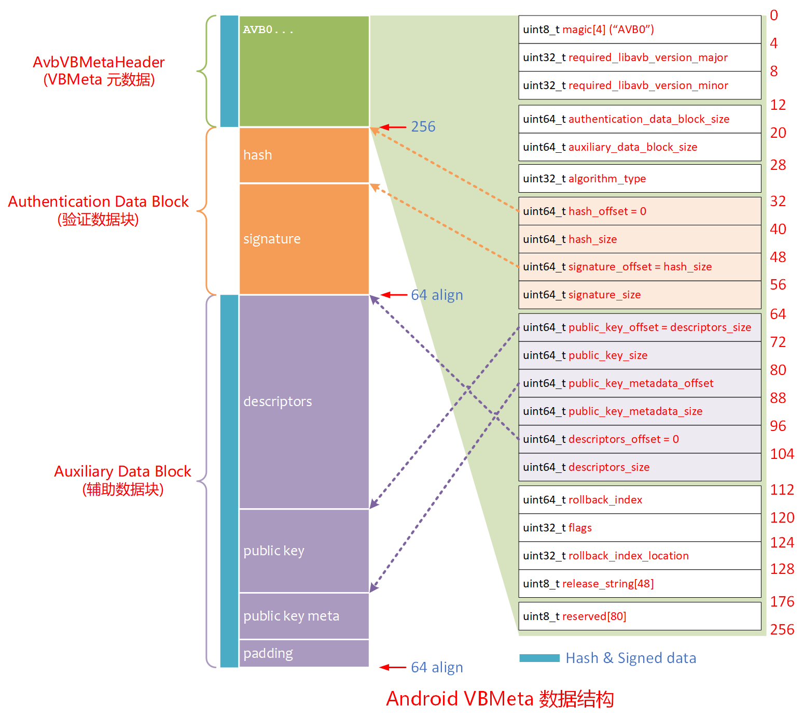
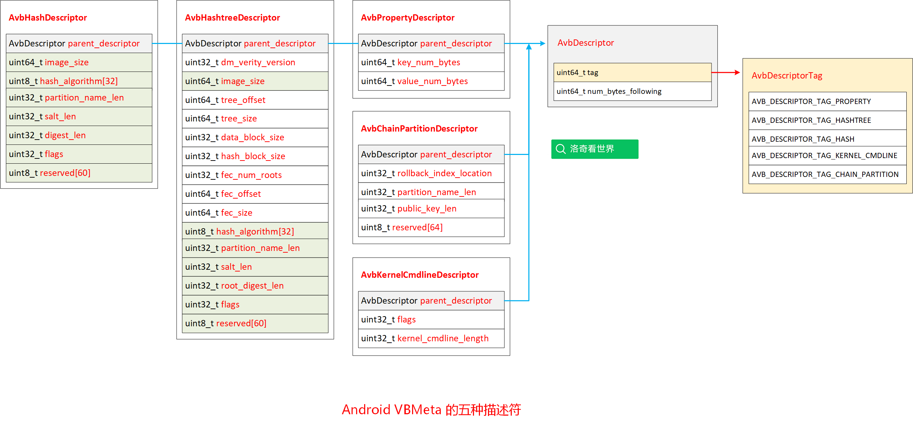
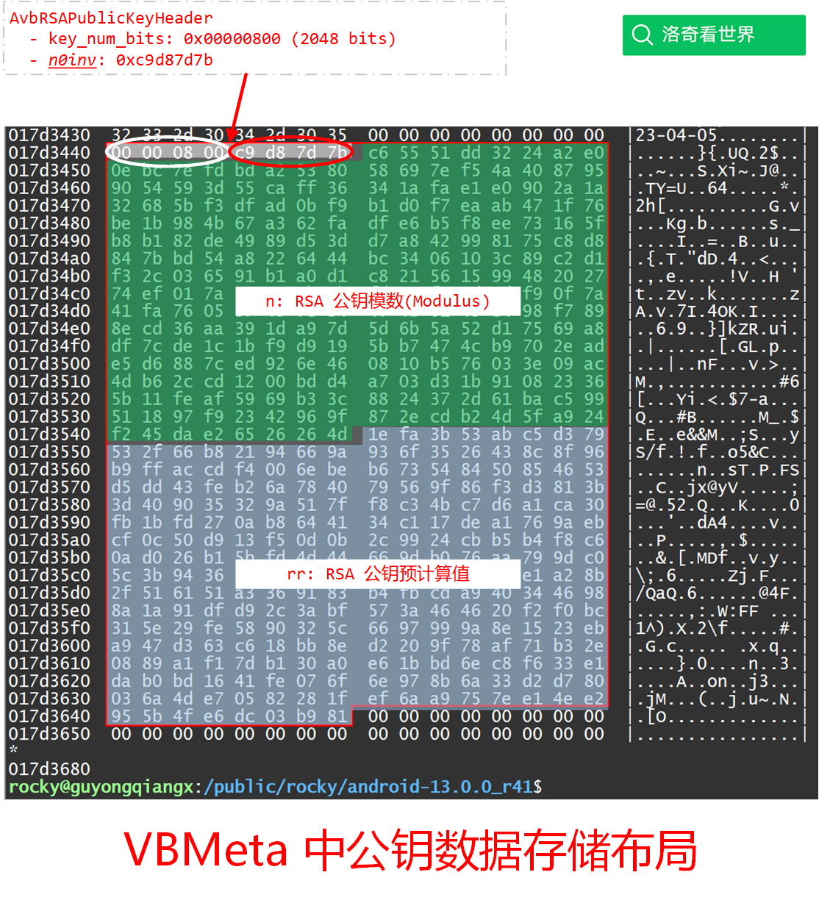

# 20241226-Android AVB 分析（九）Auxiliary Data 包含了哪些描述符和公钥？

## 1. 前言

在上一篇[《Android AVB 分析（八）VBMeta 数据解析和签名验证实战》](https://blog.csdn.net/guyongqiangx/article/details/144655337)中，对一个典型的 boot.img 的 VBMeta 进行了注释。

对每一个 VBMeta 数据，分成 3 个部分：

- AvbVBMetaImageHeader
  - VBMeta 头部的 meta 数据，用于描述整个 VBMeta
- Authentication Data Block
  - VBMeta 的验证数据块，主要用来检查 VBMeta 数据的哈希和签名
- Auxiliary Data Block
  - VBMeta 的辅助数据块，包含了各种描述符和属性数据，包括镜像的 hash 或 hashtree 的 top hash，以及前门使用的公钥，是整个 VBMeta 的核心数据。

所以，本位围绕 Auxiliary Data Block (辅助数据块)进行详细分析。


## 2. Auxiliary Data Block 构成

要详细说明 Auxiliary Data Block 的构成，还是离不开下面这个布局图：



有图可知，Auxiliary Data Block 主要包含了 3 个部分：

- descriptors
  - 包含各种属性和数据描述符，包括: AvbHashDescriptor, AvbHashtreeDescriptor, AvbChainPartitionDescriptor, AvbPropertyDescriptor 和 AvbKernelCmdlineDescriptor 五种。
- public key
  - 优化后的 public key 公钥数据，由 AvbRSAPublicKeyHeader 进行描述
- public key meta
  - 公钥描述数据，一般少用


所以，在 Auxiliary Data Block 中，主要就是描述符(Descriptor)和公钥(Public Key)数据了。


## 3. 描述符分析

我绘制了一张包含所有 5 中描述符的结构图，如下：



对于每一个描述符，其头部都有一个 `AvbDescriptor`，用来指示当前描述符的类型，以及占用的字节数。随后才是每个描述符各自的数据项。

### 1. AvbHashDescriptor

如果一个分区，例如 boot 和 dtbo 以及各种 firmware 分区，使用 `add_hash_footer` 操作，则会基于整个分区镜像计算 hash，并将这个 hash 值保存在 `AvbHashDescriptor` 中。

`AvbHashDescriptor` 的结构定义如下：

```c
/*
 * external/avb/libavb/avb_hash_descriptor.h
 */
typedef struct AvbHashDescriptor {
  AvbDescriptor parent_descriptor;
  uint64_t image_size;
  uint8_t hash_algorithm[32];
  uint32_t partition_name_len;
  uint32_t salt_len;
  uint32_t digest_len;
  uint32_t flags;
  uint8_t reserved[60];
} AVB_ATTR_PACKED AvbHashDescriptor;
```

紧随 AvbHashDescriptor 描述符之后的数据才是真正的数据，包括：

- 长度为 `partition_name_len` 字节的分区名(partition name)，使用 utf-8 编码
- 长度为 `salt_len` 字节的随机字符串 salt 值
- 长度为 `digest_len` 字节的哈希值

最终验证时，使用 salt 值计算整个镜像的哈希值，并和这里存储的 hash 值进行比较。

### 2. AvbHashtreeDescriptor

如果一个分区，例如 system, vendor 和 product 等分区，使用 `add_hashtree_footer` 操作，则会基于整个分区镜像生成 FEC 数据放置在镜像之后，再基于镜像和 FEC 数据生成 hashtree，并将 hashtree 最顶层的 top hash 值保存在 `AvbHashtreeDescriptor` 中。

`AvbHashtreeDescriptor` 的结构定义如下：

```c
/*
 * external/avb/libavb/avb_hashtree_descriptor.h
 */
typedef struct AvbHashtreeDescriptor {
  AvbDescriptor parent_descriptor;
  uint32_t dm_verity_version;
  uint64_t image_size;
  uint64_t tree_offset;
  uint64_t tree_size;
  uint32_t data_block_size;
  uint32_t hash_block_size;
  uint32_t fec_num_roots;
  uint64_t fec_offset;
  uint64_t fec_size;
  uint8_t hash_algorithm[32];
  uint32_t partition_name_len;
  uint32_t salt_len;
  uint32_t root_digest_len;
  uint32_t flags;
  uint8_t reserved[60];
} AVB_ATTR_PACKED AvbHashtreeDescriptor;
```

相对于前面的 AvbHashDescriptor 描述符，这里的 AvbHashtreeDescriptor 多了一些字段，主要用来描述 hashtree 和 FEC 的数据信息。

紧随 AvbHashtreeDescriptor 描述符之后的数据才是真正的数据，包括：

- 长度为 `partition_name_len` 字节的分区名(partition name)，使用 utf-8 编码
- 长度为 `salt_len` 字节的随机字符串 salt 值
- 长度为 `root_digest_len` 字节的根哈希值(root digest)

最终验证时，使用 salt 值计算生成整个镜像和其 FEC 数据的哈希树，将计算得到的 root hash 和这里存储的 root digest 值进行比较。

### 3. AvbChainPartitionDescriptor

在处理生成 VBMeta 数据时，如果指定 "--chain_partition" 参数，则 avbtool 会根据 "--chain_partition" 参数的内容生成 AvbChainPartitionDescriptor，例如 Andrid 13 编译 aosp_panther 设备时，会通过类似下面的命令生成 vbmeta.img 文件，并包含四个 AvbChainPartitionDescriptor:

```bash
avbtool make_vbmeta_image \
	--output IMAGES/vbmeta.img \
	--key external/avb/test/data/testkey_rsa4096.pem \
	--algorithm SHA256_RSA4096 \
	--chain_partition boot:2:out/soong/.temp/avb-rdtlqkfe.avbpubkey \
	--chain_partition init_boot:4:out/soong/.temp/avb-heg356oe.avbpubkey \
	--include_descriptors_from_image IMAGES/vendor_boot.img \
	--include_descriptors_from_image IMAGES/vendor_kernel_boot.img \
	--include_descriptors_from_image IMAGES/vendor_dlkm.img \
	--include_descriptors_from_image IMAGES/dtbo.img \
	--include_descriptors_from_image IMAGES/pvmfw.img \
	--chain_partition vbmeta_system:1:out/soong/.temp/avb-er20eabz.avbpubkey \
	--chain_partition vbmeta_vendor:3:out/soong/.temp/avb-bn_8e20u.avbpubkey \
	--padding_size 4096 \
	--rollback_index 1680652800
```

例如：

```bash
--chain_partition boot:2:out/soong/.temp/avb-rdtlqkfe.avbpubkey
```

这个参数包含 3 个部分，使用":"进行分隔，分别是：

- 分区名(partition name)
- 链式回滚的索引位置(chained rollback index location)
- 公钥路径(file path)


AvbChainPartitionDescriptor 包含了用来使用链式验证的信息，其结构定义如下：

```c
/*
 * external/avb/libavb/avb_chain_partition_descriptor.h
 */
typedef struct AvbChainPartitionDescriptor {
  AvbDescriptor parent_descriptor;
  uint32_t rollback_index_location;
  uint32_t partition_name_len;
  uint32_t public_key_len;
  uint8_t reserved[64];
} AVB_ATTR_PACKED AvbChainPartitionDescriptor;
```

什么是链式验证呢？链式验证是相对于一般的直接验证而言的。

对于一般采用直接验证的分区，例如 boot，在其镜像的 VBMeta 数据中，直接保存了 boot 镜像的签名值以及签名使用的公钥。在检查时，从 boot 镜像中提取公钥数据，检查 boot 分区的签名即可。


对于链式验证，其分区镜像(system)签名使用的公钥被提取出来，生成 AvbChainPartitionDescriptor，单独保存在 vbmeta 镜像中。验证时，从 vbmeta 数据的链式描述符中提取公钥 public key，然后用这个公钥验证相应分区(system)的签名。

这样的好处是使镜像数据及其签名和 vbmeta 分区分离。

例如，如果我们使用一般验证方式验证 system 分区，当 system 分区更新后，其相应的 hash 值和签名等也需要更新在 vbmeta 中，验证时从 vbmeta 中提取数据和实际从 system 计算的值进行比较。因此，当更新 system 分区时，也必须同时更新 vbmeta 分区镜像。


当使用链式验证时，system 分区的签名数据保存在 system 中。此时 vbmeta 中就只保存验证使用的 key。如果 system 分区更新了，那只需要更新 system 分区镜像即可，不需要同时更新 vbmeta 分区镜像。


紧随 AvbChainPartitionDescriptor  描述符之后的数据才是真正的数据，包括：

- 长度为 `partition_name_len` 字节的分区名(partition name)，使用 utf-8 编码
- 长度为 `public_key_len` 字节的公钥(public key)

最终验证时，从 AvbChainPartitionDescriptor 提取公钥，用来检查相应分区的 VBMeta 数据签名。


### 4. AvbPropertyDescriptor 

当你在使用 avbtool 处理镜像时传入了"--prop"键值对参数时，才会生成 AvbPropertyDescriptor 描述符。

例如，Android 13 编译 aosp_panther 设备时，是这样处理 boot.img 分区的:

```bash 
avbtool add_hash_footer \
	--image boot.img \
	--partition_size 67108864 \
	--partition_name boot \
	--key external/avb/test/data/testkey_rsa2048.pem \
	--algorithm SHA256_RSA2048 \
	--prop com.android.build.boot.os_version:13 \
	--prop com.android.build.boot.fingerprint:Android/aosp_panther/panther:13/TQ2A.230405.003.E1/rocky12021421:userdebug/test-keys \
	--prop com.android.build.boot.security_patch:2023-04-05 \
	--rollback_index 1680652800
```

这里会根据传入的两个 "--prop" 参数，生成两个相应的 AvbPropertyDescriptor 来描述这个键值对。

例如:

```bash
--prop com.android.build.boot.os_version:13
```

这里包含了一个键值对信息，使用":"进行分隔：

- 键(key): com.android.build.boot.os_version
- 值(value): 13


AvbPropertyDescriptor 描述的内容比较简单，就是定义了键值对其键(key)和值(value)的字节数。

```c
/*
 * external/avb/libavb/avb_property_descriptor.h
 */
typedef struct AvbPropertyDescriptor {
  AvbDescriptor parent_descriptor;
  uint64_t key_num_bytes;
  uint64_t value_num_bytes;
} AVB_ATTR_PACKED AvbPropertyDescriptor;
```

紧随 AvbPropertyDescriptor 描述符之后的就是字符串形式的键值对数据，包括：

- 长度为 `key_num_bytes` 字节的键名(key)，使用 utf-8 编码，随后是一个 NUL 结束符
- 长度为 `value_num_bytes` 字节的值(value)，使用 utf-8 编码，随后是一个 NUL 结束符，并且填充到 8 字节的边界

### 5. AvbKernelCmdlineDescriptor 

当你在使用 avbtool 处理镜像时，如果传入 "--setup_as_rootfs_from_kernel" 参数，avbtool 会根据这个参数生成两个 AvbKernelCmdlineDescriptor，例如：

```bash
$ avbtool add_hashtree_footer \
	--partition_size 886812672 \
	--partition_name system \
	--image system.img \
	--salt 6902f6b436dd8f08a2ecd512d4576a03325e14db8e6b1bb72b68d22f20a6a6d3 \
	--setup_as_rootfs_from_kernel \
	--hash_algorithm sha256 \
	--prop com.android.build.system.os_version:13 \
	--prop com.android.build.system.fingerprint:Android/aosp_panther/panther:13/TQ2A.230405.003.E1/rocky12021421:userdebug/test-keys \
	--prop com.android.build.system.security_patch:2023-04-05
```

当我们使用 avbtool 查看 system.img 时，可以看到已经生成了两个 AvbKernelCmdlineDescriptor 描述符：

```bash
$ avbtool info_image --image system.img
Footer version:           1.0
Image size:               886812672 bytes
Original image size:      872734720 bytes
VBMeta offset:            886571008
VBMeta size:              1408 bytes
--
Minimum libavb version:   1.0
Header Block:             256 bytes
Authentication Block:     0 bytes
Auxiliary Block:          1152 bytes
Algorithm:                NONE
Rollback Index:           0
Flags:                    0
Rollback Index Location:  0
Release String:           'avbtool 1.2.0'
Descriptors:
    Hashtree descriptor:
      Version of dm-verity:  1
      Image Size:            872734720 bytes
      Tree Offset:           872734720
      Tree Size:             6881280 bytes
      Data Block Size:       4096 bytes
      Hash Block Size:       4096 bytes
      FEC num roots:         2
      FEC offset:            879616000
      FEC size:              6955008 bytes
      Hash Algorithm:        sha256
      Partition Name:        system
      Salt:                  6902f6b436dd8f08a2ecd512d4576a03325e14db8e6b1bb72b68d22f20a6a6d3
      Root Digest:           e2b0749496127b3b0dd589ea54bf6ccb113fa05d587b1e361a55d3bc0ea6f068
      Flags:                 0
    Prop: com.android.build.system.os_version -> '13'
    Prop: com.android.build.system.fingerprint -> 'Android/aosp_panther/panther:13/TQ2A.230405.003.E1/rocky12021421:userdebug/test-keys'
    Prop: com.android.build.system.security_patch -> '2023-04-05'
    Kernel Cmdline descriptor:
      Flags:                 1
      Kernel Cmdline:        'dm="1 vroot none ro 1,0 1704560 verity 1 PARTUUID=$(ANDROID_SYSTEM_PARTUUID) PARTUUID=$(ANDROID_SYSTEM_PARTUUID) 4096 4096 213070 213070 sha256 e2b0749496127b3b0dd589ea54bf6ccb113fa05d587b1e361a55d3bc0ea6f068 6902f6b436dd8f08a2ecd512d4576a03325e14db8e6b1bb72b68d22f20a6a6d3 10 $(ANDROID_VERITY_MODE) ignore_zero_blocks use_fec_from_device PARTUUID=$(ANDROID_SYSTEM_PARTUUID) fec_roots 2 fec_blocks 214750 fec_start 214750" root=/dev/dm-0'
    Kernel Cmdline descriptor:
      Flags:                 2
      Kernel Cmdline:        'root=PARTUUID=$(ANDROID_SYSTEM_PARTUUID)'
```

这里生成的 AvbKernelCmdlineDescriptor 看起来特别复杂，我没有具体使用过，也没有去详细解析过生成参数的意义，如果有需要，可以自行解析。


AvbKernelCmdlineDescriptor 描述的内容也比较简单，就是定义了随后的命令行参数字符串占用的字节数。

```c
/*
 * external/avb/libavb/avb_kernel_cmdline_descriptor.h
 */
typedef struct AvbKernelCmdlineDescriptor {
  AvbDescriptor parent_descriptor;
  uint32_t flags;
  uint32_t kernel_cmdline_length;
} AVB_ATTR_PACKED AvbKernelCmdlineDescriptor;
```

紧随 AvbKernelCmdlineDescriptor 描述符之后的就是字符串形式的命令行参数了：

- 长度为 `kernel_cmdline_length` 字节的命令行参数，使用 utf-8 编码，随后是一个 NUL 结束符


## 4. 公钥数据分析

一般来说，用于验证签名的 RSA 公钥数据比较简单，一个模数 modulus 和一个指数 e 就够了，像下面这样：

```bash
# 从签名的测试私钥中导出公钥
$ openssl rsa -in external/avb/test/data/testkey_rsa2048.pem -pubout -out testkey_rsa2048_pub.pem

# 查看公钥数据
$ openssl rsa -inform PEM -pubin -in testkey_rsa2048_pub.pem -text -noout
RSA Public-Key: (2048 bit)
Modulus:
    00:c6:55:51:dd:32:24:a2:e0:0e:bc:7e:fd:bd:a2:
    53:80:58:69:7e:f5:4a:40:87:95:90:54:59:3d:55:
    ca:ff:36:34:1a:fa:e1:e0:90:2a:1a:32:68:5b:f3:
    df:ad:0b:f9:b1:d0:f7:ea:ab:47:1f:76:be:1b:98:
    4b:67:a3:62:fa:df:e6:b5:f8:ee:73:16:5f:b8:b1:
    82:de:49:89:d5:3d:d7:a8:42:99:81:75:c8:d8:84:
    7b:bd:54:a8:22:64:44:bc:34:06:10:3c:89:c2:d1:
    f3:2c:03:65:91:b1:a0:d1:c8:21:56:15:99:48:20:
    27:74:ef:01:7a:76:a5:0b:6b:fd:e3:fa:ed:0d:f9:
    0f:7a:41:fa:76:05:37:49:fe:34:4f:4b:01:49:e4:
    98:f7:89:8e:cd:36:aa:39:1d:a9:7d:5d:6b:5a:52:
    d1:75:69:a8:df:7c:de:1c:1b:f9:d9:19:5b:b7:47:
    4c:b9:70:2e:ad:e5:d6:88:7c:ed:92:6e:46:08:10:
    b5:76:03:3e:09:ac:4d:b6:2c:cd:12:00:bd:d4:a7:
    03:d3:1b:91:08:23:36:5b:11:fe:af:59:69:b3:3c:
    88:24:37:2d:61:ba:c5:99:51:18:97:f9:23:42:96:
    9f:87:2e:cd:b2:4d:5f:a9:24:f2:45:da:e2:65:26:
    26:4d
Exponent: 65537 (0x10001)
```


对于指数 e，大家都默认使用 65537(当然，我有见过使用 e=3 的)，所以存储时直接将模数 modulus 转换成二进制存储起来，恢复的时候读取二进制数据，转换成 modulus 再配合默认的指数 e 就还原了公钥。


因此，对于一个 2048 bit 的 RSA 公钥，直接将 modulus 转换成 256 字节的数据保存就可以了。不过，在 Android VBMeta 上不完全是这样。

在[《Android AVB 分析（八）VBMeta 数据解析和签名验证实战》](https://blog.csdn.net/guyongqiangx/article/details/144655337)中，我标注过 RSA 公钥，占用 0x208(520) 字节。根据前面的分析，实际上 256 字节就够了，为啥还要 520 字节这么多呢？

这是因为 Android AVB 为了化简在验证时候的计算，在公钥数据中保存了一些额外的预先计算的 n0inv 和 rr 数据信息。

对于 AVB 中的公钥，AvbRSAPublicKeyHeader 是这样定义的：

```c
/*
 * external/avb/libavb/avb_crypto.h
 */
typedef struct AvbRSAPublicKeyHeader {
  uint32_t key_num_bits;
  uint32_t n0inv;
} AVB_ATTR_PACKED AvbRSAPublicKeyHeader;
```

所以，对于 2048 bit RSA 公钥(public key)的存储，是这样的：

- 8 字节的 AvbRSAPublicKeyHeader
  - 4 字节的 RSA 秘钥长度，例如 RSA2048，秘钥长度为 2048 bits，所以值为 0x0000 0800
  - 4 字节的预计算 n0inv 数据
- 256 字节的 modulus 数据
- 256 字节的预计算 rr 数据

因此，一共就是 8 + 256 + 256 = 520 (0x208) 字节了。


在上一篇中标记点数据就是这样：



> **为什么要使用 `n0inv` 和 `rr`？**
>
> RSA 验证过程通常涉及大数模运算，这些运算计算量大且相对较慢。为了提高速度，尤其是在嵌入式设备（如 Android）中，预计算一些常量并将它们存储下来，可以在验证过程中避免每次都计算这些值，从而显著减少验证的开销。具体地：
>
> - `n0inv` 让模反元素的计算变得更加高效，尤其是在使用 Chinese Remainder Theorem (中国剩余定理，CRT) 进行优化时。
> - `rr` 使得大数模幂运算变得更快。
>
> 通过预计算这些值，验证过程变得更快，从而提升了整个系统的性能，特别是 Android AVB 需要在 bootloader 场景下需要进行多次快速验证的任务。


好了，到本篇为止的前面几篇分析了 AVB 涉及的绝大部分数据的生成，接下来我们要开始讨论具体的代码，如何使用这些 AVB 数据了。

有了前面的基础，明白了数据是如何生成的，接下来理解这些数据是如何使用的就更容易，简单来说，就是使用这些生成的数据，去验证原始数据。

## 5. 其它

我创建了一个 Android AVB 讨论群，主要讨论 Android 设备的 AVB 验证问题。

我还几个 Android OTA 升级讨论群，主要讨论 Android 设备的 OTA 升级话题。

欢迎您加群和我们一起交流，请在加我微信时注明“Android AVB 交流”或“Android OTA 交流”。

仅限 Android 相关的开发者参与~

> 公众号“洛奇看世界”后台回复“wx”获取个人微信。


