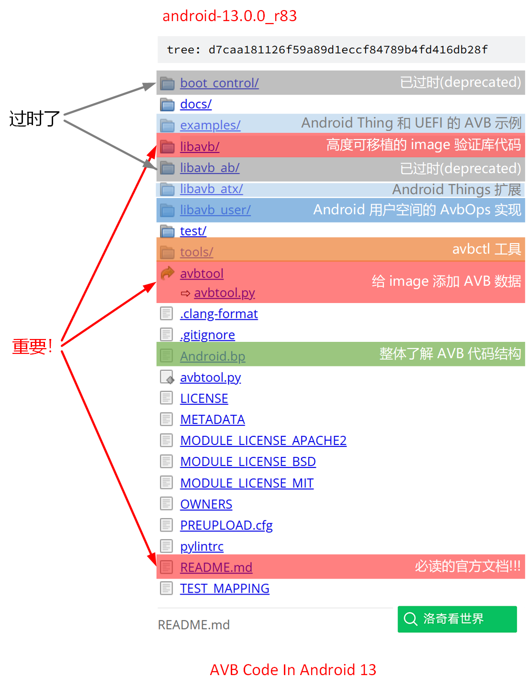
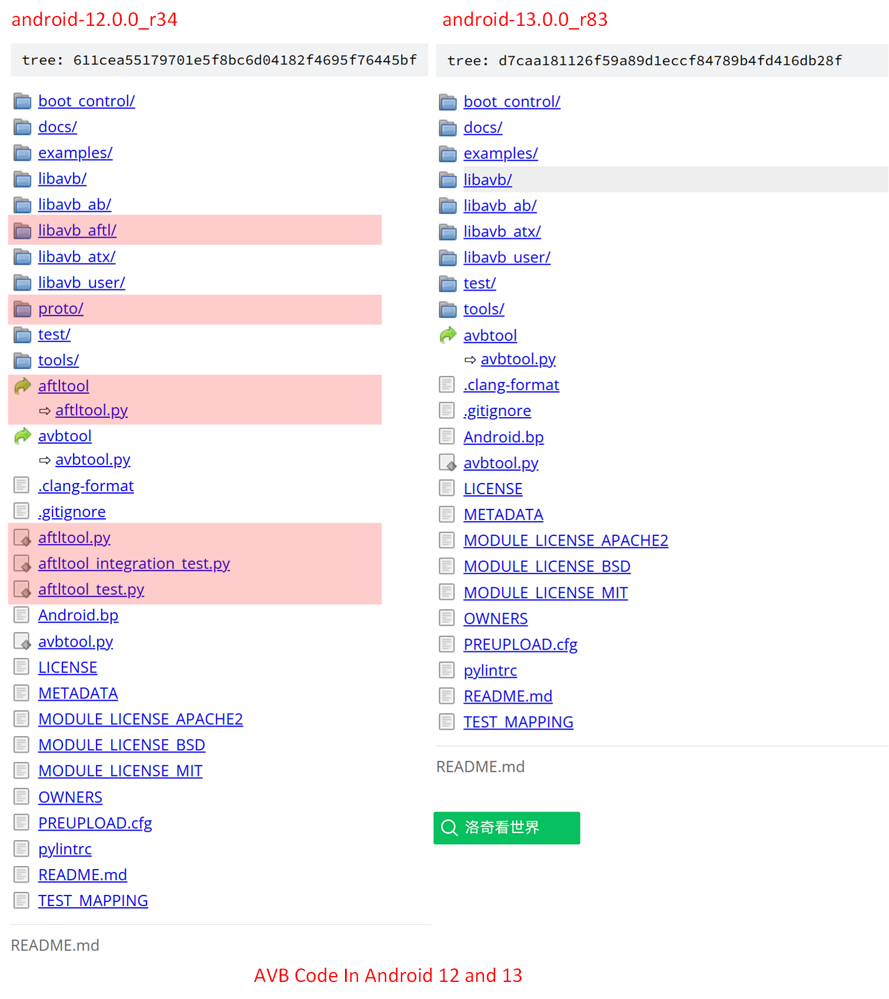
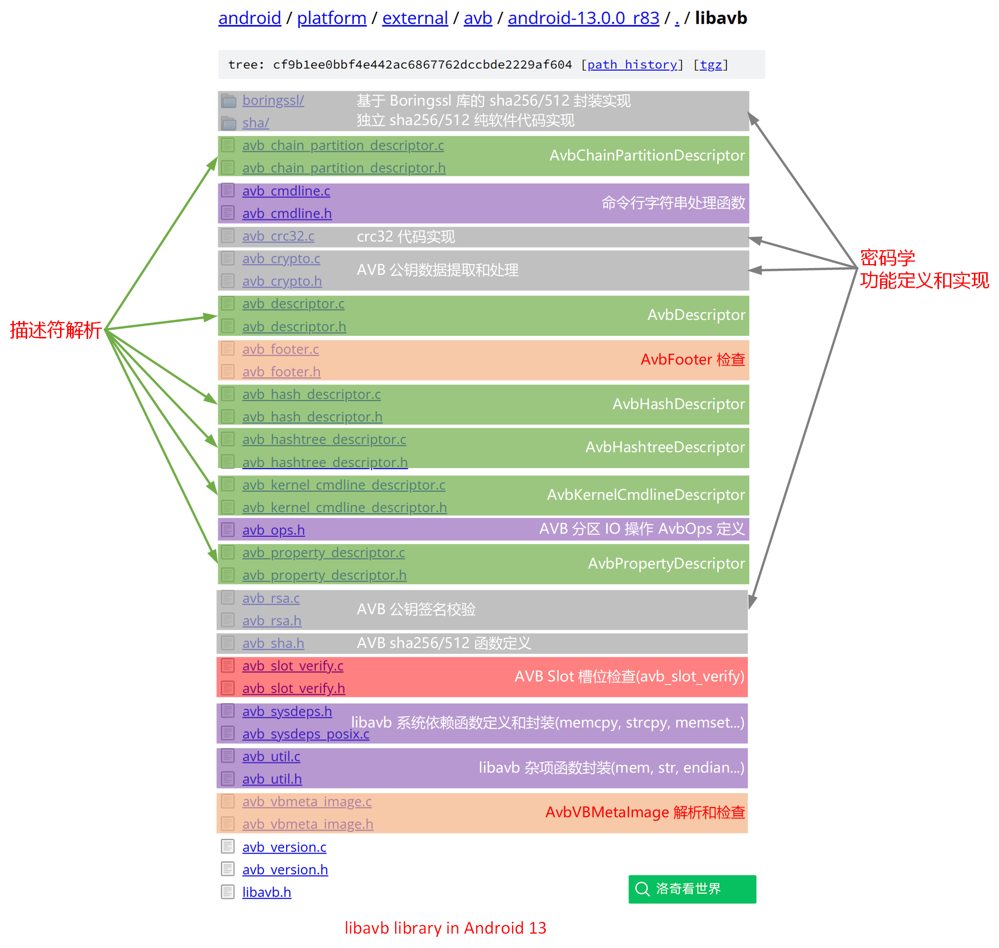
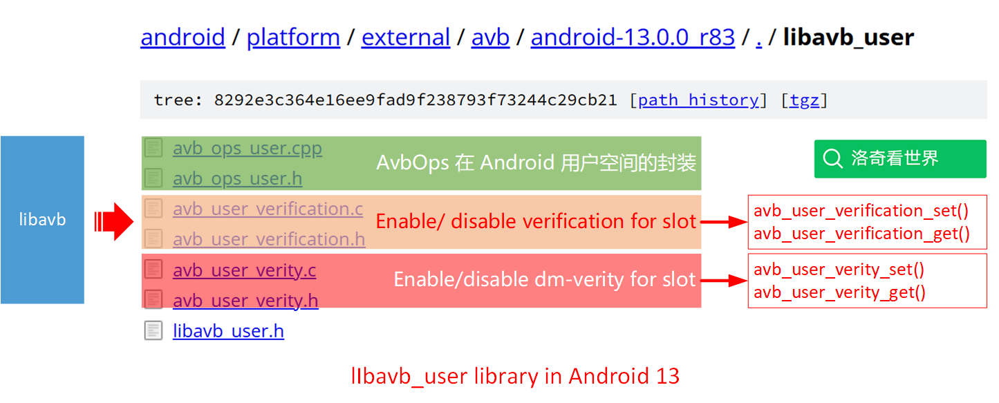
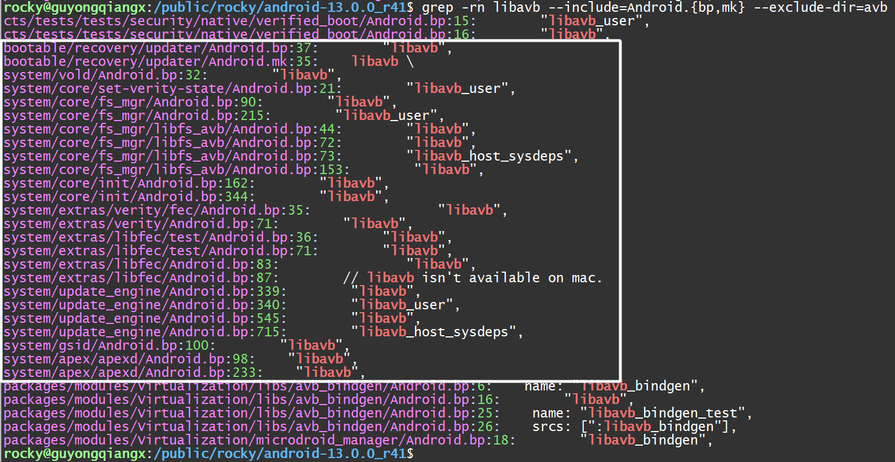
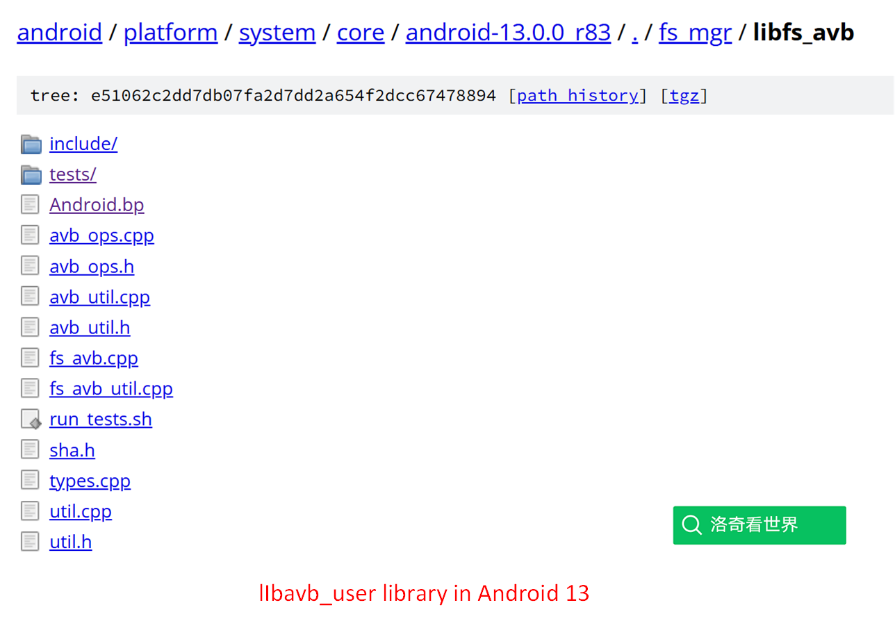

# 20250104-Android AVB 分析（十）AVB 有哪些相关的源码？

前面的几篇内容主要分析 avbtool 工具源码，通过分析，我们看到了 avbtool 如何处理各种镜像 image，包括各种分区镜像的 AVB 数据是如何生成的，例如 hash, hashtree, FEC 和 VBMeta 等。因此，前面几篇的核心是 AVB 相关数据的生成~

有了这些生成的数据，接下来就看这些数据是如何使用的。

从本篇开始，逐步介绍 AVB 数据的使用，包括基于 boot 这类小分区镜像生成的 hash，以及基于 system 这类大分区镜像生成的 FEC 和 hashtree，这就必须涉及到大量的代码。

所以，我们第一件事要做的就是，从宏观上看看 AVB 相关的源码的结构，从而对 AVB 源码有一个整体的把握。

> 本文基于 android-13.0.0_r83 进行分析
>
> https://android.googlesource.com/platform/external/avb/+/android-13.0.0_r83

## 1. 目录结构

AVB 的主要代码位于 `external/avb` 目录，其内容如下:



在本地的说明文档 `external/avb/README.md` 中是这样介绍这个目录的。

* `libavb/`

  * 一个 image 镜像验证的实现。这部分代码被设计成高度可移植，以便能在尽可能多的场景中使用(例如各种 bootloader 或应用)。

    此代码需要一个符合 C99标准的 C 编译器。

    其中部分代码被视为实现的内部代码，不应在外部使用。例如`avb_rsa.[ch]`和`avb_sha.[ch]` 这样的文件，其中定义的函数 `avb_rsa_verify()` 主要是给 libavb 库内部的代码使用，而不是对外提供的接口。

    预期由各家平台提供的系统依赖项在`avb_sysdeps.h`中定义，换句话说，就是 `avb_sysdeps.h` 中定义的各种接口，在移植时需要由各家具体去实现。如果平台提供标准 C 运行时，直白的说就是如果平台支持标准的 C 库，则可以使用`avb_sysdeps_posix.c`。

* `libavb_atx/`

  * 用于 Android Things (Android 可穿戴设备)的扩展，用来验证公钥元数据。

* `libavb_user/`

  * 包含一个适用于 Android 用户空间的`AvbOps`实现。这些实现在`boot_control.avb`和`avbctl`中使用。

* `libavb_ab/`

  * 一个用于 bootloader 和 AVB 示例的实验性 A/B 实现。**注意**：此代码已*废弃*，如需使用必须定义`AVB_AB_I_UNDERSTAND_LIBAVB_AB_IS_DEPRECATED`。该代码将于2018年6月1日移除。

* `boot_control/`

  * 一个用于配合使用实验性`libavb_ab` A/B栈的 bootloader 的Android `boot_control` HAL实现。**注意**：此代码已*废弃*，将于2018年6月1日移除。

* `Android.bp`

  * 用于构建`libavb`（设备上使用的静态库）、主机端(host)库（用于单元测试）和单元测试的构建说明。

* `avbtool`

  * 一个用 Python 编写的工具，用于处理与验证启动相关的镜像。

* `test/`

  * 各种 avb 相关工具和库的单元测试，包括 `abvtool`、`libavb`、`libavb_ab`和`libavb_atx`。

* `tools/avbctl/`

  * 包含一个工具的源代码，可用于在 Android 运行时控制 AVB。
  * Contains the source-code for a tool that can be used to control
    AVB at runtime in Android.

* `examples/uefi/`

  * 包含一个基于UEFI的 bootloader 如何使用`libavb/`和`libavb_ab/` 的源代码。

* `examples/things/`

  * 包含适用于Android Things的槽位(slot)验证源代码。


### 关于 AFTL

Android 13 相比于旧版本 Android 12 和以下的源码，移除了 AFTL 相关的源码。

> AFTL: Android Firmware Transparency Log



根据 libavb_aftl 目录下 AFTL 自带的 ReadMe，AFTL 主要实现了下面的功能：

> Android 固件透明日志（AFTL）是一种二进制透明度的实现，它利用公共的只可追加账本来提供构建镜像的加密包含证明。设备制造商将这些称为包含证明的加密证明存储在设备上，以便在系统更新和设备启动期间进行离线验证。这确保设备上只运行公开已知的构建。此外，它允许设备制造商和其他相关方审计日志中的信息，以检测发布者签名密钥的意外或恶意使用。 

通过这段介绍，看起来 AFTL 似乎是用来进行安全加固的，不过没有看到在哪里具体使用。由于这部分功能代码已经移除，后面不会再单独提及。

## 2. Makefile

有了对 AVB 目录的大致印象，我们可以通过整理 Android.bp 文件来看看这些代码都构建了哪些东西。

以下是对 AVB 目录下 Android.bp 文件的大致整理，包含了编译生成目标的类型(type)和名称(name)：

```bash
                  type  name
----------------------  ------------------------------
           cc_defaults: avb_defaults
           cc_defaults: avb_sources
           cc_defaults: avb_crypto_ops_impl_boringssl
           cc_defaults: avb_crypto_ops_impl_sha
    python_binary_host: avbtool
     cc_library_static: libavb
     cc_library_static: libavb_user
             cc_binary: avbctl
cc_library_host_static: libavb_ab_host
           cc_defaults: avb_atx_sources
cc_library_host_static: libavb_host_sysdeps
           cc_defaults: avb_things_example_sources
           cc_defaults: libavb_host_unittest_core
          cc_test_host: libavb_host_unittest
          cc_test_host: libavb_host_unittest_sha
cc_library_host_static: libavb_host_user_code_test
            cc_library: bootctrl.avb
    cc_library_headers: avb_headers
```

除去不重要的 `cc_defaults` 和 `cc_test_hosts` 以及 `cc_library_headers` 目标，则 AVB 代码主要生成了以下内容:

```
                  type  name
----------------------  ------------------------------
    python_binary_host: avbtool
     cc_library_static: libavb
     cc_library_static: libavb_user
             cc_binary: avbctl
cc_library_host_static: libavb_ab_host
cc_library_host_static: libavb_host_sysdeps
            cc_library: bootctrl.avb
```

- Python 脚本转换的二进制工具 avbtool
- 设备上使用的静态库: libavb, libavb_user
- 设备上使用的工具: avbctl
- 设备上的库: bootctrl.avb (AVB 版本的 bootctrl，已经过时)
- 主机上使用的静态库: libavb_ab_host, libavb_host_sysdeps

因此，总体上 avb 代码会生成一个 avbtool 工具，以及 libavb 和 libavb_user 的库给 Android 用户空间去使用。

另外还会生成一些其他的库和测试应用，但相对于我们这里的代码分析，这部分已经不重要了。

简单小结一下：

- avbtool 用于在编译阶段处理分区镜像，添加 AVB 相关数据；

- libavb 移植给 bootloader 或启动阶段的小系统在启动阶段验证 boot 这样的分区；

- libavb 和其上的 libavb_user 在 Android 系统中用于验证 system, vendor 这样的分区；
- avbctl 工具在 Android 系统中可以用来进行一些 AVB 相关的操作；


> 问题: 在主机 out 目录下非 Python 脚本版本的 avbtool，这个工具是如何生成的？
>
> ```bash
> $ file external/avb/avbtool
> external/avb/avbtool: symbolic link to avbtool.py
> $ file out/host/linux-x86/bin/avbtool 
> out/host/linux-x86/bin/avbtool: ELF 64-bit LSB shared object, x86-64, version 1 (SYSV), dynamically linked, interpreter /lib64/ld-linux-x86-64.so.2, for GNU/Linux 2.6.24, stripped
> ```
> 在 Android.bp 中，当使用 `python_binary_host`定义目标时，Android 编译系统会将 Python 脚本转换成主机 host 上可执行的二进制工具。具体的转换是如何实现的待深入学习，如果有浅显的资料，也欢迎推荐。


> 单元测试(unittest)：
>
> 如果你写代码，想学习下 google 的项目都是如何做单元测试的，可以参考下 avb 下 unittest 的相关内容，相信我，肯定会有所收获。

## 3. libavb 库

关于 libavb 库，官方是这么介绍的：

libavb 库在设备端执行所有验证操作。例如，它首先加载 vbmeta 分区，检查签名，然后继续加载启动分区以进行验证。该库旨在用于 bootloader 和 Android 内部。它有一个简单的系统依赖性抽象（参见 avb_sysdeps.h），以及bootloader 或操作系统预期要实现的操作（参见avb_ops.h）。验证的主要入口点是avb_slot_verify()。

### libavb 源码结构

整个 AVB 源码下面有两个核心，一是 avbtool.py 工具，另一个就是 libavb 源码了。

和 avbtool.py 生成 AVB 数据相反，libavb 库的作用是验证 AVB 数据。

libavb 的代码被设计为高度可移植，可以很方便的移植到你的 bootloader，你的 linux，或者其他 RTOS 系统上去支持 AVB 校验。

libavb 的源码文件命名也比较清楚，如下：



总体上，libavb 下面的源码按照功能划分，可以分成以下 4 组：

- 密码学功能实现
  - 哈希 sha256, sha512 实现
    - avb_sha.h (头文件定义)
    - boringssl/{avb_crypto_ops_impl.h, sha.c}
    - sha/{avb_crypto_ops_impl.h, sha256_impl.c, sha512_impl.c}
  - crc32 校验和实现
    - avb_crc32.c
  - RSA 公钥验证计算
    - avb_rsa.h, avb_rsa.c
  - VBMeta 提供公钥数据
    - avb_crypto.h, avb_crypto.c
- 5 种 AVB 描述符解析
  - AVB 头部通用的描述符(可以理解为继承关系)
    - avb_descriptor.h, avb_descriptor.c
  - 具体的 5 种描述符定义和解析
    - avb_chain_partition_descriptor.h, avb_chain_partition_descriptor.c
    - avb_hash_descriptor.h, avb_hash_descriptor.c
    - avb_hashtree_descriptor.h, avb_hashtree_descriptor.c
    - avb_kernel_cmdline_descriptor.h, avb_kernel_cmdline_descriptor.c
    - avb_property_descriptor.h, avb_property_descriptor.c
- AVBFooter 和 VBMeta 数据解析
  - avb_footer.h, avb_footer.c
  - avb_vbmeta_image.h, avb_vbmeta_image.c
- AVB 移植和辅助相关函数的定义和实现
  - AVB 命令行字符串处理
    - avb_cmdline.h, avb_cmdline.c
  - AVB 各种杂项函数定义
    - avb_util.h, avb_util.c
  - AVB 系统操作函数定义，移植时需要实现这些操作函数
    - avb_sysdeps.h, avb_sysdeps_posix.c (基于标准 C 库的实现)
  - AVB 分区操作函数定义，移植时需要实现这些分区操作
    - avb_ops.h (定义了 AVB 分区处理时的操作函数)
- AVB 槽位校验
  - avb_slot_verify.h, avb_slot_verify.c


对于 libavb 库来说，调用 libavb 库进行校验只需要调用一个函数：

```c
AvbSlotVerifyResult avb_slot_verify(AvbOps* ops,
                                    const char* const* requested_partitions,
                                    const char* ab_suffix,
                                    AvbSlotVerifyFlags flags,
                                    AvbHashtreeErrorMode hashtree_error_mode,
                                    AvbSlotVerifyData** out_data);
```

整个 libavb 代码，最终就是为了向外界提供一个 `avb_slot_verify()` 接口而存在。


### avb_slot_verify() 函数

整个 libavb 库的所有代码都是为了 `avb_slot_verify()` 函数而存在。

当你的 RTOS 或者 bootloader 在启动时需要检查分区的 vbmeta 数据，向 `avb_slot_verify()` 函数传入相应的分区名称(requested_partitions)，以及相应的行为(flags)，在 `avb_slot_verify()` 内部根据传入的行为完成检查并范围校验，将结果保存在 AvbSlotVerifyData 中供外接使用。


你的 bootloader 或 RTOS 根据函数 `avb_slot_verify()` 返回的结果，例如校验成功或失败，进行相应的逻辑处理即可。


`avb_slot_verify()` 内部具体的函数实现我们单独开篇分析，这里暂时略过。


### libavb 库的移植

由于 Android Verified Boot 在系统启动和运行中有多个地方需要调用 libavb 库，例如各厂家自己的 bootloader 或者启动中的 RTOS 小系统，因此 libavb 被设计成高度可移植的函数。


总体上，关于 libavb 的可移植性，官方文档是这么介绍的：

libavb 代码的目的是在加载 Android 或其他操作系统的 bootloader 中被使用。建议的方法是将 libavb 头文件和 C 文件复制到 bootloader 中，并适当集成。

随着时间的推移，libavb/代码库将会不断发展，因此集成应尽可能不具侵入性。意图是保持库的 API 稳定，但在必要时会进行更改。关于可移植性，该库旨在高度可移植，能够在小端和大端架构以及 32 位和 64 位上工作。它还旨在在没有标准 C 库和运行时的非标准环境中运行。

> 关于这段话中的 “集成应尽可能不具侵入性”，原文是 "integration should be as non-invasive as possible"，主要是指集成或代码修改时，尽量减少对现有系统或代码的干扰和影响。一句话来说，就是尽量不要修改现有代码。

如果设置了 `AVB_ENABLE_DEBUG` 预处理器符号，代码将包含有用的调试信息和运行时检查。量产编译时不应使用此符号。`AVB_COMPILATION` 预处理器符号仅在编译库时设置。代码必须编译成一个单独的库。

使用编译后的 libavb 库的应用程序必须仅包含 libavb/libavb.h 文件（该文件将包含所有公共接口），并且不应设置 `AVB_COMPILATION` 预处理器符号。这是为了确保将来可能会发生变化的内部代码（例如 `avb_sha.[ch]`和 `avb_rsa.[ch]`）不会对应用程序代码可见。

> 关于可移植性的原文请参考 Portability 一节:
>
> https://android.googlesource.com/platform/external/avb/+/android-13.0.0_r83/README.md#portability


在移植 libavb 库时，需要实现以下内容：

1. 实现 `avb_sysdeps.h` 文件中定义的所有函数

   包括: avb_memcmp, avb_memcpy, avb_memset, avb_strcmp, ..., avb_print 等。如果你的 bootloader 或者 RTOS 支持链接标准的 C 库(正确的说法是 posix 接口)，那就可以借用已经实现好的 `avb_sysdeps_posix.c` 文件，否则就需要实现这里的每一个接口。

   例如 u-boot 支持 posix 接口，所以可以直接使用 `avb_sysdeps_posix.c` 文件中实现的函数；

   ```bash
   $ cat lib/libavb/Makefile 
   # SPDX-License-Identifier: GPL-2.0+
   #
   # (C) Copyright 2017 Linaro Limited
   
   obj-$(CONFIG_LIBAVB) += avb_chain_partition_descriptor.o avb_cmdline.o
   obj-$(CONFIG_LIBAVB) += avb_crypto.o avb_footer.o avb_hashtree_descriptor.o
   obj-$(CONFIG_LIBAVB) += avb_property_descriptor.o avb_sha256.o
   obj-$(CONFIG_LIBAVB) += avb_slot_verify.o avb_util.o avb_version.o
   obj-$(CONFIG_LIBAVB) += avb_descriptor.o avb_hash_descriptor.o
   obj-$(CONFIG_LIBAVB) += avb_kernel_cmdline_descriptor.o avb_rsa.o avb_sha512.o
   obj-$(CONFIG_LIBAVB) += avb_sysdeps_posix.o avb_vbmeta_image.o
   
   ccflags-y = -DAVB_COMPILATION
   ```

   

2. 实现 `avb_ops.h` 文件中定义的 AvbOps 接口，包括: 

   - read_from_partition, 
   - get_preloaded_partition, 
   - write_to_partition, 
   - validate_vbmeta_public_key
   - read_rollback_index
   - write_rollback_index
   - read_is_device_unlocked
   - get_unique_guid_for_partition
   - get_size_of_partition
   - read_persistent_value
   - write_persistent_value

   当然，对于有些功能，例如 persistent 持久化取值，如果不支持，可以不用实现。

   对于 u-boot，这部分的实现位于 `common/avb_verify.c` 文件中。在这个文件中定义好相关函数后，是这样初始化 AvbOps 结构体的：

   ```c
   AvbOps *avb_ops_alloc(int boot_device)
   {
   	struct AvbOpsData *ops_data;
   
   	ops_data = avb_calloc(sizeof(struct AvbOpsData));
   	if (!ops_data)
   		return NULL;
   
   	ops_data->ops.user_data = ops_data;
   
   	ops_data->ops.read_from_partition = read_from_partition;
   	ops_data->ops.write_to_partition = write_to_partition;
   	ops_data->ops.validate_vbmeta_public_key = validate_vbmeta_public_key;
   	ops_data->ops.read_rollback_index = read_rollback_index;
   	ops_data->ops.write_rollback_index = write_rollback_index;
   	ops_data->ops.read_is_device_unlocked = read_is_device_unlocked;
   	ops_data->ops.get_unique_guid_for_partition =
   		get_unique_guid_for_partition;
   #ifdef CONFIG_OPTEE_TA_AVB
   	ops_data->ops.write_persistent_value = write_persistent_value;
   	ops_data->ops.read_persistent_value = read_persistent_value;
   #endif
   	ops_data->ops.get_size_of_partition = get_size_of_partition;
   	ops_data->mmc_dev = boot_device;
   
   	return &ops_data->ops;
   }
   ```

   在 u-boot 中，通过函数 `avb_ops_alloc()` 设置好 AvbOps 结构体后，随后就可以调用 `avb_slot_verify()` 进行 AVB 验证了。

## 4. libavb_user 源码

libavb_user 库是基于 libavb 的进一步封装，用于在 Android 中使用。

如下图所示：



整个 libavb_user 包含 3 组文件：

- avb_ops_user.h, avb_ops_user.cpp

  - 在 Android 用户空间实现了 AvbOps 接口

    ```c
    AvbOps* avb_ops_user_new(void) {
      AvbOps* ops;
    
      ops = static_cast<AvbOps*>(calloc(1, sizeof(AvbOps)));
      if (ops == NULL) {
        avb_error("Error allocating memory for AvbOps.\n");
        goto out;
      }
    
      ops->ab_ops = static_cast<AvbABOps*>(calloc(1, sizeof(AvbABOps)));
      if (ops->ab_ops == NULL) {
        avb_error("Error allocating memory for AvbABOps.\n");
        free(ops);
        goto out;
      }
      ops->ab_ops->ops = ops;
    
      ops->read_from_partition = read_from_partition;
      ops->write_to_partition = write_to_partition;
      ops->validate_vbmeta_public_key = validate_vbmeta_public_key;
      ops->read_rollback_index = read_rollback_index;
      ops->write_rollback_index = write_rollback_index;
      ops->read_is_device_unlocked = read_is_device_unlocked;
      ops->get_unique_guid_for_partition = get_unique_guid_for_partition;
      ops->get_size_of_partition = get_size_of_partition;
      ops->ab_ops->read_ab_metadata = avb_ab_data_read;
      ops->ab_ops->write_ab_metadata = avb_ab_data_write;
    
    out:
      return ops;
    }
    ```

- avb_user_verification.h, avb_user_verification.h

  - 提供了两个函数 `avb_user_verification_set()` 和 `avb_user_verification_get()`，用于 enable 和 disable verification 状态

- avb_user_verity.h, avb_user_verity.h

  - 提供了两个函数`avb_user_verity_set()` 和 `avb_user_verity_get()`，用于 enable 和 disable dm-verity 功能


问题来了，这里用户空间的  verification 和 dm-verity 听起来似乎名字差不多，但有什么区别吗？


## 5. libavb 和 libavb_user 库的引用

前面分析了 libavb 和 libavb_user 库的功能和组成，那 Android 的哪些地方在使用这些库呢？

我们不妨在 Android 13 的代码下完整搜索下对 libavb 和 libavb_user 库的引用，比方说在所有 Android.bp 或 Andrid.mk 中搜索对 libavb 的引用(除了 `external/avb` 目录下)，如下：

```bash
android-13.0.0_r41$ grep -rn libavb --include=Android.{bp,mk} --exclude-dir=avb
```

搜索结果：



我们这里搜索的是整个 Android 源码目录，除了搜索时间长一点之外 ，结果非常精准。

总结一下这个搜索的结果，引用 libavb 或 libavb_user 库的模块有以下几个：

- bootable/recovery/updater (**libavb**)
- system/vold (**libavb**)
- system/core/set-verity-state (**libavb, libavb_user**)
- system/core/fs_mgr (**libavb, libavb_user**)
- system/core/fs_mgr/libfs_avb (**libavb**)
- system/core/init (**libavb**)
- system/extras/verity (**libavb**)
- system/extras/verity/fec (**libavb**)
- system/extras/libfec (**libavb**)
- system/update_engine (**libavb, libavb_user**)
- system/gsid (**libavb**)
- system/apex/apexd (**libavb**)

重点说下，这里有 3  模块引用了 libavb_user 库，分别是：

- system/core/set-verity-state (**libavb, libavb_user**)
- system/core/fs_mgr (**libavb, libavb_user**)
- system/update_engine (**libavb, libavb_user**)

根据前面分析 libavb_user 库开放的接口，说明这些模块在对 verification 或 dm-verity 的 enable/disable 进行设置。

至于每一个模块，到底因为什么原因引用 libavb 或 libavb_user，请自行到相应的模块查看。


## 6. libfs_avb 源码

留意第 5 节的搜索结果，我们看到：

- system/core/fs_mgr (**libavb, libavb_user**)
- system/core/fs_mgr/libfs_avb (**libavb**)

在 `system/core/fs_mgr` 还有一个名为 `libfs_avb` 的文件夹，说明这个文件夹下面所有内容都和 AVB 相关:



总体上，libfs_avb 基于 libavb 和 libavb_user，在 fs_mgr 层面封装了下面的函数：

- LoadAndVerifyVbmeta()
- LoadAndVerifyVbmetaByPath()
- GetHashtreeDescriptor()
- GetHashDescriptor()
- GetAvbPropertyDescriptor()

以及 FsManagerAvbOps 类和 AvbHandle 类在 Android 用户空间对 AVB 进行操作。


后续分析 AVB 数据在 Android 系统中如何验证时，会详细分析这一部分代码。


## 7. AVB 其它相关代码

从前面第 5 节分析的 libavb 和 libavb_user 库相关模块外，以下内容也和 AVB 相关:

- system/core/fs_mgr/libvbmeta
- system/core/set-verity-state
- system/extras/verity
- system/extras/vbmeta_tools

这些内容是和 AVB, verity, vbmeta 等相关的工具和库的源码，后续看情况决定是否对这些源码详细分析。


## 8. 总结

Android AVB 的核心代码位于 `external/avb` 目录，各目录的作用如下：

* `libavb/`

  * 一个 image 镜像验证的实现。这部分代码被设计成高度可移植，以便能在尽可能多的场景中使用(例如各种 bootloader 或应用)。

    此代码需要一个符合 C99标准的 C 编译器。

    其中部分代码被视为实现的内部代码，不应在外部使用。例如`avb_rsa.[ch]`和`avb_sha.[ch]` 这样的文件，其中定义的函数 `avb_rsa_verify()` 主要是给 libavb 库内部的代码使用，而不是对外提供的接口。

    预期由各家平台提供的系统依赖项在`avb_sysdeps.h`中定义，换句话说，就是 `avb_sysdeps.h` 中定义的各种接口，在移植时需要由各家具体去实现。如果平台提供标准 C 运行时，直白的说就是如果平台支持标准的 C 库，则可以使用`avb_sysdeps_posix.c`。

* `libavb_atx/`

  * 用于 Android Things (Android 可穿戴设备)的扩展，用来验证公钥元数据。

* `libavb_user/`

  * 包含一个适用于 Android 用户空间的`AvbOps`实现。这些实现在`boot_control.avb`和`avbctl`中使用。

* `libavb_ab/`

  * 一个用于 bootloader 和 AVB 示例的实验性 A/B 实现。**注意**：此代码已*废弃*，如需使用必须定义`AVB_AB_I_UNDERSTAND_LIBAVB_AB_IS_DEPRECATED`。该代码将于2018年6月1日移除。

* `boot_control/`

  * 一个用于配合使用实验性`libavb_ab` A/B栈的 bootloader 的Android `boot_control` HAL实现。**注意**：此代码已*废弃*，将于2018年6月1日移除。

* `Android.bp`

  * 用于构建`libavb`（设备上使用的静态库）、主机端(host)库（用于单元测试）和单元测试的构建说明。

* `avbtool`

  * 一个用 Python 编写的工具，用于处理与验证启动相关的镜像。

* `test/`

  * 各种 avb 相关工具和库的单元测试，包括 `abvtool`、`libavb`、`libavb_ab`和`libavb_atx`。

* `tools/avbctl/`

  * 包含一个工具的源代码，可用于在 Android 运行时控制 AVB。
  * Contains the source-code for a tool that can be used to control
    AVB at runtime in Android.

* `examples/uefi/`

  * 包含一个基于UEFI的 bootloader 如何使用`libavb/`和`libavb_ab/` 的源代码。

* `examples/things/`

  * 包含适用于Android Things的槽位(slot)验证源代码。


经过分析 Android.bp 文件，这个目录下主要生成以下我们比较关心的内容：

- Python 脚本转换的二进制工具 avbtool，用来处理各个分区的镜像，添加 VBMeta 数据
- 设备上使用的静态库: libavb, libavb_user，用来验证分区镜像的 VBMeta 数据
- 设备上使用的工具: avbctl，用于在 Android 用户空间查询和设置 avb 的状态


AVB 代码的核心是 libavb 库，整个 libavb 库为了 `avb_slot_verify()` 函数而存在。在系统启动阶段，通过 bootloader 或启动系统通过集成 libavb 库并调用  `avb_slot_verify()` 来完成 Linux 启动前的校验。


除了 `externa/avb` 目录的代码外，AVB 相关的代码模块还包括：

- bootable/recovery/updater (**libavb**)
- system/vold (**libavb**)
- system/core/set-verity-state (**libavb, libavb_user**)
- system/core/fs_mgr (**libavb, libavb_user**)
- system/core/fs_mgr/libfs_avb (**libavb**)
- system/core/init (**libavb**)
- system/extras/verity (**libavb**)
- system/extras/verity/fec (**libavb**)
- system/extras/libfec (**libavb**)
- system/update_engine (**libavb, libavb_user**)
- system/gsid (**libavb**)
- system/apex/apexd (**libavb**)

以及：

- system/core/fs_mgr/libvbmeta
- system/extras/vbmeta_tools


## 9. 其它

我创建了一个 Android AVB 讨论群，主要讨论 Android 设备的 AVB 验证问题。

我还有几个 Android OTA 升级讨论群，主要讨论 Android 设备的 OTA 升级话题。

欢迎您加群和我们一起交流，请在加我微信时注明“Android AVB 交流”或“Android OTA 交流”。

仅限 Android 相关的开发者参与~

> 公众号“洛奇看世界”后台回复“wx”获取个人微信。


