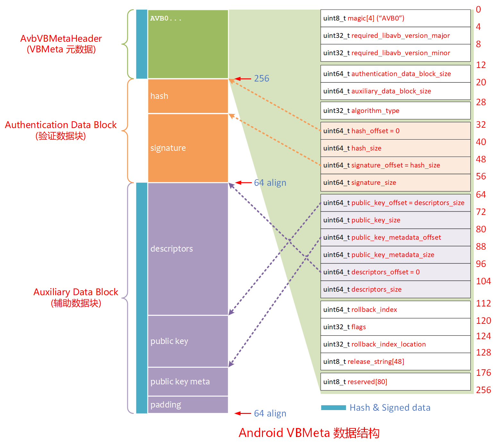

# 20250105-Android AVB 分析（十一）bootloader 是如何进行 verify boot 检查的？

## 1. 导读

上一篇[《Android AVB 分析（十）AVB 有哪些相关的源码？》](https://blog.csdn.net/guyongqiangx/article/details/144936814)中分析了 AVB 源码结构，本篇正式深入 AVB 源码，看看在 bootloader 中是如何使用 libavb 进行 verify boot 检查验证的。


在整个启动过程中的验证是这样链接的：

1. 生成一对非对称秘钥(包括公钥和私钥，既可以是 RSA 秘钥，也可以是椭圆算法秘钥)

2. 使用非对称秘钥的私钥对 bootloader 签名，对应的用于验证签名的公钥存储到芯片的 ROM 或 OTP 区域中；

3. 芯片上电后，ROM 使用这个不可更改的公钥验证 bootloader 签名，验证通过后启动并跳转到 bootloader；

4. bootloader 中用固化在自身代码，或保存在芯片安全存储区域的不可更改的公钥去验证下一级的镜像，例如 AVB 中的 vbmeta 分区镜像；

   (AVB 在启动时实际上从 vbmeta 中提取公钥用于验证自身的签名；然后再将固化在 u-boot 中的公钥和从 vbmeta 中提取的公钥进行比较，二者一样确保 vbmeta 中的公钥合法才继续下一步启动流程。通过这种方式就确保了 vbmeta 也是通过合法的秘钥认证的。)

5. vbmeta 中的秘钥验证通过后，再用其描述符中的 hash 去检查 boot 和其他分区，确保 boot 等分区没有被更改后，再从 boot 分区启动 linux，然后进入下一级验证。


对于芯片 ROM 对 bootloader 代码的签名验证，以及 bootloader 起来后如何处理代码并调用 libavb 验证 vbmeta，这一块属于厂家自己的代码，因为各个厂家的 bootloader 都可能不一样, 有的用 u-boot，有的基于 UEFI，有的可能是私有的 bootloader。

但有一点相同的是，各厂家都按照 Android 官方要求集成 libavb 库，调用 `avb_slot_verify()` 函数完成验证，并根据验证结果执行相应的动作。


我在这里以公开的 u-boot 源码进行分析，看看 u-boot 中是如何使用 libavb 进行启动验证的。这一块处理虽然各家的代码不完全一样，但是操作都要满足 Android 要求，所以原理和行为都是一致的。

> 本文基于写作时最新的 u-boot 源码进行分析: v2025.01-rc6
>
> - https://github.com/u-boot/u-boot/tree/v2025.01-rc6
>
> 参考 u-boot 关于 AVB 2.0 的参考文档:
>
> - https://docs.u-boot.org/en/latest/android/avb2.html

本文由于分析 u-boot 源码，所以篇幅比较长。

第 2 节主要分析 u-boot 中 verify boot 相关的两个命令

第 3 节分析 libavb 的 `avb_slot_verify()` 函数实现

第 4 节分析 libavb 的 `load_and_verify_vbmeta()` 函数

第 5 节简要概述 libavb 中的一些其他函数

第 6 节总结 verify boot 中的主要流程

第 7 节就一些特别的知识点进行说明


如果觉得查看源码注释太繁琐，可以直接跳转到第 6 节查看总结，以及第 7 节查看特别说明。

## 2. u-boot 中的 verify boot 命令

虽然是基于 u-boot 最新的源码分析，但实际上 u-boot 中集成的 libavb 库并不是最新的 v1.3 版，而是 v1.1 版本。

```c
u-boot-v2025.01$ grep -n AVB_VERSION_MAJOR -C 2 lib/libavb/avb_version.h
18-
19-/* The version number of AVB - keep in sync with avbtool. */
20:#define AVB_VERSION_MAJOR 1
21-#define AVB_VERSION_MINOR 1
22-#define AVB_VERSION_SUB 0
```

所以本文基于 u-boot 中的 libavb v1.1 版本的代码进行分析。

后面看情况再决定是否跟踪分析 libavb v1.1, v1.2 和 v1.3 版本的变更。


关于 u-boot 中如何打开和编译 libavb 相关的代码，如何运行 AVB 相关的命令，请参考 u-boot 自带的文档。

>[《Android Verified Boot 2.0》](https://docs.u-boot.org/en/latest/android/avb2.html#android-verified-boot-2-0)
>
>- https://docs.u-boot.org/en/latest/android/avb2.html


### 2.1 AVB 相关命令

根据 u-boot 文档介绍，集成 AVB 2.0 时，提供了以下命令：

```bash
avb init <dev> - initialize avb 2 for <dev>
avb read_rb <num> - read rollback index at location <num>
avb write_rb <num> <rb> - write rollback index <rb> to <num>
avb is_unlocked - returns unlock status of the device
avb get_uuid <partname> - read and print uuid of partition <part>
avb read_part <partname> <offset> <num> <addr> - read <num> bytes from
    partition <partname> to buffer <addr>
avb read_part_hex <partname> <offset> <num> - read <num> bytes from
    partition <partname> and print to stdout
avb write_part <partname> <offset> <num> <addr> - write <num> bytes to
    <partname> by <offset> using data from <addr>
avb read_pvalue <name> <bytes> - read a persistent value <name>
avb write_pvalue <name> <value> - write a persistent value <name>
avb verify [slot_suffix] - run verification process using hash data
    from vbmeta structure
    [slot_suffix] - _a, _b, etc (if vbmeta partition is slotted)
```

对于没有 A/B  槽位(slot)的系统，验证 Verify Boot，执行如下命令:

```bash
=> avb init 1
=> avb verify
```

对于有 Android A/B 系统存在两个槽位(a/b)的情况，执行如下命令验证指定的槽位：

```bash
=> avb init 1
=> avb verify _a
```

### 2.2 命令 `avb init`

avb 所有相关的命令都位于 `cmd/avb.c` 文件的 `cmd_avb` 数组中：

```c
static struct cmd_tbl cmd_avb[] = {
	U_BOOT_CMD_MKENT(init, 2, 0, do_avb_init, "", ""),
	U_BOOT_CMD_MKENT(read_rb, 2, 0, do_avb_read_rb, "", ""),
	U_BOOT_CMD_MKENT(write_rb, 3, 0, do_avb_write_rb, "", ""),
	U_BOOT_CMD_MKENT(is_unlocked, 1, 0, do_avb_is_unlocked, "", ""),
	U_BOOT_CMD_MKENT(get_uuid, 2, 0, do_avb_get_uuid, "", ""),
	U_BOOT_CMD_MKENT(read_part, 5, 0, do_avb_read_part, "", ""),
	U_BOOT_CMD_MKENT(read_part_hex, 4, 0, do_avb_read_part_hex, "", ""),
	U_BOOT_CMD_MKENT(write_part, 5, 0, do_avb_write_part, "", ""),
	U_BOOT_CMD_MKENT(verify, 2, 0, do_avb_verify_part, "", ""),
#ifdef CONFIG_OPTEE_TA_AVB
	U_BOOT_CMD_MKENT(read_pvalue, 3, 0, do_avb_read_pvalue, "", ""),
	U_BOOT_CMD_MKENT(write_pvalue, 3, 0, do_avb_write_pvalue, "", ""),
#endif
};
```

对于 `avb init` 命令，实际上调用的是 `do_avb_init`函数。


在 `do_avb_init()` 内部进一步调用 `avb_ops_alloc()` 来设置 libavb 库需要的 AvbOps:

```c
/* avb init 1 */
int do_avb_init(struct cmd_tbl *cmdtp, int flag, int argc, char *const argv[])
{
	unsigned long mmc_dev;

	if (argc != 2)
		return CMD_RET_USAGE;

	mmc_dev = hextoul(argv[1], NULL);

	if (avb_ops)
		avb_ops_free(avb_ops);

    /* 初始化 AvbOps */
	avb_ops = avb_ops_alloc(mmc_dev);
	if (avb_ops)
		return CMD_RET_SUCCESS;
	else
		printf("Can't allocate AvbOps");

	printf("Failed to initialize AVB\n");

	return CMD_RET_FAILURE;
}
```


`avb_ops_alloc()` 用于初始化 AvbOps，后续所有 IO 操作都通过 AvbOps 来执行。

```c
/**
 * ============================================================================
 * AVB2.0 AvbOps alloc/initialisation/free
 * ============================================================================
 */
AvbOps *avb_ops_alloc(int boot_device)
{
	struct AvbOpsData *ops_data;

    /* 给 AvbOpsData 分配内存 */
	ops_data = avb_calloc(sizeof(struct AvbOpsData));
	if (!ops_data)
		return NULL;

	ops_data->ops.user_data = ops_data;

    /* 使用预定义的分区 IO 操作初始化 AvbOps 结构体 */
	ops_data->ops.read_from_partition = read_from_partition;
	ops_data->ops.write_to_partition = write_to_partition;
	ops_data->ops.validate_vbmeta_public_key = validate_vbmeta_public_key;
	ops_data->ops.read_rollback_index = read_rollback_index;
	ops_data->ops.write_rollback_index = write_rollback_index;
	ops_data->ops.read_is_device_unlocked = read_is_device_unlocked;
	ops_data->ops.get_unique_guid_for_partition =
		get_unique_guid_for_partition;
#ifdef CONFIG_OPTEE_TA_AVB
	ops_data->ops.write_persistent_value = write_persistent_value;
	ops_data->ops.read_persistent_value = read_persistent_value;
#endif
	ops_data->ops.get_size_of_partition = get_size_of_partition;
	ops_data->mmc_dev = boot_device;

	return &ops_data->ops;
}
```


### 2.3 命令 `avb verify`

同样，对于 `avb verify` 命令，查看 `cmd/avb.c` 文件的 `cmd_avb` 数组，具体操作由 `do_avb_verify_part()`函数实现：

```c
/* avb verify _a */
int do_avb_verify_part(struct cmd_tbl *cmdtp, int flag,
		       int argc, char *const argv[])
{
    /* 指定请求的分区列表,NULL 结尾的字符串数组: {"boot", NULL} */
	const char * const requested_partitions[] = {"boot", NULL};
	AvbSlotVerifyResult slot_result;
	AvbSlotVerifyData *out_data;
	enum avb_boot_state boot_state;
	char *cmdline;
	char *extra_args;
	char *slot_suffix = "";
	int ret;

	bool unlocked = false;
	int res = CMD_RET_FAILURE;

    /* 参数检查 */
	if (!avb_ops) {
		printf("AVB is not initialized, please run 'avb init <id>'\n");
		return CMD_RET_FAILURE;
	}

	if (argc < 1 || argc > 2)
		return CMD_RET_USAGE;

    /*
     * 如果不使用 A/B 分区，传入一个空字符串（例如 ""，而不是 NULL）
     * 对于 A/B 分区，传入带下划线的槽位。例如，使用 "_a" 表示第一个 slot。
     * 主要是用来和分区名字一起拼接成完整的分区名，如 "vbmeta" + "_a" = "vbmeta_a"。
     */
	if (argc == 2)
		slot_suffix = argv[1];

	printf("## Android Verified Boot 2.0 version %s\n",
	       avb_version_string());

    /* 获取设备的 unlock 状态 */
	ret = avb_ops->read_is_device_unlocked(avb_ops, &unlocked);
	if (ret != AVB_IO_RESULT_OK) {
		printf("Can't determine device lock state, err = %d\n",
		       ret);
		return CMD_RET_FAILURE;
	}

    /*
     * 执行分区槽位校验
     */
	slot_result =
		avb_slot_verify(avb_ops,
				requested_partitions, /* {"boot", NULL} */
				slot_suffix, /* "_a" */
				unlocked, /* unlocked: true; locked: false */
				AVB_HASHTREE_ERROR_MODE_RESTART_AND_INVALIDATE,
				&out_data);

    /*
     * 检查验证结果
     * 验证成功时，使用返回数据 out_data 更新 AVB_BOOTARGS 环境变量
     */
	/*
	 * LOCKED devices with custom root of trust setup is not supported (YELLOW)
	 */
	if (slot_result == AVB_SLOT_VERIFY_RESULT_OK) {
		printf("Verification passed successfully\n");

		/*
		 * ORANGE state indicates that device may be freely modified.
		 * Device integrity is left to the user to verify out-of-band.
		 */
		if (unlocked)
			boot_state = AVB_ORANGE;
		else
			boot_state = AVB_GREEN;

        /*
         * 获取设备的 boot state，并追加到 out_data->cmdline 中
         */
		/* export boot state to AVB_BOOTARGS env var */
		extra_args = avb_set_state(avb_ops, boot_state);
		if (extra_args)
			cmdline = append_cmd_line(out_data->cmdline,
						  extra_args);
		else
			cmdline = out_data->cmdline;

        /* 使用 cmdline 更新 AVB_BOOTARGS 环境变量 */
		env_set(AVB_BOOTARGS, cmdline);

		res = CMD_RET_SUCCESS;
	} else {
		printf("Verification failed, reason: %s\n", str_avb_slot_error(slot_result));
	}

	if (out_data)
		avb_slot_verify_data_free(out_data);

	return res;
}
```

总体上，`do_avb_verify_part()` 做了这几件事：

1. 执行参数检查
2. 获取设备的 unlock 状态
3. 执行分区槽位校验，验证 vbmeta 分区
4. 验证校验结果，使用返回数据 out_data 设置启动参数，更新到 AVB_BOOTARGS 环境变量


对于一个设备，在签名验证成功的前提下，有 3 种状态：

- `yellow`：如果设备处于 `LOCKED` 状态且使用了可由用户设置的信任根
- `green`：如果设备处于 `LOCKED` 状态且未使用可由用户设置的信任根
- `orange`：如果设备处于`UNLOCKED`状态

根据这里`do_avb_verify_part()`函数中的提示，显然在 u-boot 中实现的代码不支持 yellow 状态。


你实际使用的 bootloader 对 boot state 的处理和可能跟 u-boot 中的处理不一样，具体以你的代码指示的行为为准。

## 3. avb_slot_verify 函数

从前面的分析看到，如果如果在 u-boot 中执行命令 `"avb verify _a"`，则会以下面的参数调用 `avb_slot_verify()` 函数：

```c
slot_result =
    avb_slot_verify(avb_ops,
            requested_partitions, /* {"boot", NULL} */
            slot_suffix,          /* "_a" */
            unlocked,             /* locked: false; unlocked: true */
            AVB_HASHTREE_ERROR_MODE_RESTART_AND_INVALIDATE,
            &out_data);
```

对于函数 `avb_slot_verify()` ，函数的定义如下：

```c
AvbSlotVerifyResult avb_slot_verify(AvbOps* ops,
                                    const char* const* requested_partitions,
                                    const char* ab_suffix,
                                    AvbSlotVerifyFlags flags,
                                    AvbHashtreeErrorMode hashtree_error_mode,
                                    AvbSlotVerifyData** out_data);
```

其头文件`libavb/avb_slot_verify.h`中关于函数的注释就是非常好的说明文档。

我这里将这部分注释用 AI 翻译成中文，供参考：

> avb_slot_verify() 函数执行对由 |ab_suffix| 标识的 slot 的完整验证，并加载和验证分区内容，这些分区的名称在以 NULL 结尾的字符串数组|requested_partitions| 中（每个分区必须使用哈希验证）。如果不使用 A/B，传入一个空字符串（例如 ""，而不是 NULL）作为 |ab_suffix|。该参数必须包含下划线前缀，例如，使用 "_a" 表示第一个 slot。
>
> 通常，|requested_partitions| 数组仅包含一个用于 boot 分区的条目，即 'boot'。
>
> 验证包括从 'vbmeta'、请求的哈希分区以及可能的其他分区（附加 |ab_suffix|）加载并验证数据，检查回滚索引，并验证用于签名数据的公钥是否被接受。完成这些操作时会使用 |ops| 中的函数。
>
> 如果 |out_data| 不为 NULL，它将被设置为一个新分配的 |AvbSlotVerifyData| 结构，该结构包含实际引导 slot 所需的所有数据。在完成使用后，应使用 avb_slot_verify_data_free() 释放该数据结构。
> 请参阅以下内容以了解何时返回此结构。
>
> |flags| 参数用于影响 avb_slot_verify() 的语义，例如，可以使用AVB_SLOT_VERIFY_FLAGS_ALLOW_VERIFICATION_ERROR 标志忽略验证错误，这是在解锁状态（UNLOCKED state）下需要的功能。有关详细信息，请参阅 AvbSlotVerifyFlags 枚举。
>
> |hashtree_error_mode| 参数应设置为所需的错误处理模式。有关详细信息，请参阅 AvbHashtreeErrorMode 枚举。
>
> 另外请注意，如果返回 AVB_SLOT_VERIFY_RESULT_ERROR_OOM、AVB_SLOT_VERIFY_RESULT_ERROR_IO 或AVB_SLOT_VERIFY_RESULT_ERROR_INVALID_METADATA，则不会设置 |out_data|。
>
> 如果一切验证正确且所有公钥都被接受，将返回 AVB_SLOT_VERIFY_RESULT_OK。
>
> 如果一切验证正确，但一个或多个公钥未被接受（包括完整性数据未签名的情况），将返回 AVB_SLOT_VERIFY_RESULT_ERROR_PUBLIC_KEY_REJECTED。
>
> 如果无法分配内存，将返回 AVB_SLOT_VERIFY_RESULT_ERROR_OOM。
>
> 如果在加载数据或获取回滚索引时发生 I/O 错误，将返回 AVB_SLOT_VERIFY_RESULT_ERROR_IO。
>
> 如果数据验证失败，例如摘要不匹配或签名检查失败，将返回 AVB_SLOT_VERIFY_RESULT_ERROR_VERIFICATION。
>
> 如果回滚索引小于其存储值，将返回 AVB_SLOT_VERIFY_RESULT_ERROR_ROLLBACK_INDEX。
>
> 如果某些元数据无效或不一致，将返回 AVB_SLOT_VERIFY_RESULT_ERROR_INVALID_METADATA。
>
> 如果某些元数据需要比当前使用的 libavb 更新的版本，将返回 AVB_SLOT_VERIFY_RESULT_ERROR_UNSUPPORTED_VERSION。
>
> 如果调用者传递了无效参数，例如尝试在未启用 AVB_SLOT_VERIFY_FLAGS_ALLOW_VERIFICATION_ERROR 的情况下使用 AVB_HASHTREE_ERROR_MODE_LOGGING，将返回 AVB_SLOT_VERIFY_RESULT_ERROR_INVALID_ARGUMENT。

以下是对 `avb_slot_verify()`函数的详细注释:

```c
AvbSlotVerifyResult avb_slot_verify(AvbOps* ops,
                                    const char* const* requested_partitions,
                                    const char* ab_suffix,
                                    AvbSlotVerifyFlags flags,
                                    AvbHashtreeErrorMode hashtree_error_mode,
                                    AvbSlotVerifyData** out_data) {
  /*
   * 1. 初始化变量，参数检查，给数据结构分配内存
   */
  AvbSlotVerifyResult ret = AVB_SLOT_VERIFY_RESULT_ERROR_INVALID_ARGUMENT;
  AvbSlotVerifyData* slot_data = NULL;
  AvbAlgorithmType algorithm_type = AVB_ALGORITHM_TYPE_NONE;
  bool using_boot_for_vbmeta = false;
  AvbVBMetaImageHeader toplevel_vbmeta;
  bool allow_verification_error =
      (flags & AVB_SLOT_VERIFY_FLAGS_ALLOW_VERIFICATION_ERROR);
  AvbCmdlineSubstList* additional_cmdline_subst = NULL;

  /* 确保必要的底层操作已经支持 */
  /* Fail early if we're missing the AvbOps needed for slot verification. */
  avb_assert(ops->read_is_device_unlocked != NULL);
  avb_assert(ops->read_from_partition != NULL);
  avb_assert(ops->get_size_of_partition != NULL);
  avb_assert(ops->read_rollback_index != NULL);
  avb_assert(ops->get_unique_guid_for_partition != NULL);

  if (out_data != NULL) {
    *out_data = NULL;
  }

  /* Allowing dm-verity errors defeats the purpose of verified boot so
   * only allow this if set up to allow verification errors
   * (e.g. typically only UNLOCKED mode).
   */
  if (hashtree_error_mode == AVB_HASHTREE_ERROR_MODE_LOGGING &&
      !allow_verification_error) {
    ret = AVB_SLOT_VERIFY_RESULT_ERROR_INVALID_ARGUMENT;
    goto fail;
  }

  /* Make sure passed-in AvbOps support persistent values if
   * asking for libavb to manage verity state.
   */
  if (hashtree_error_mode == AVB_HASHTREE_ERROR_MODE_MANAGED_RESTART_AND_EIO) {
    if (ops->read_persistent_value == NULL ||
        ops->write_persistent_value == NULL) {
      avb_error(
          "Persistent values required for "
          "AVB_HASHTREE_ERROR_MODE_MANAGED_RESTART_AND_EIO "
          "but are not implemented in given AvbOps.\n");
      ret = AVB_SLOT_VERIFY_RESULT_ERROR_INVALID_ARGUMENT;
      goto fail;
    }
  }

  /* Make sure passed-in AvbOps support verifying public keys and getting
   * rollback index location if not using a vbmeta partition.
   */
  /* 检查非 vbmeta 分区时，必须要支持 validate_public_key_for_partition() 操作 */
  if (flags & AVB_SLOT_VERIFY_FLAGS_NO_VBMETA_PARTITION) {
    if (ops->validate_public_key_for_partition == NULL) {
      avb_error(
          "AVB_SLOT_VERIFY_FLAGS_NO_VBMETA_PARTITION was passed but the "
          "validate_public_key_for_partition() operation isn't implemented.\n");
      ret = AVB_SLOT_VERIFY_RESULT_ERROR_INVALID_ARGUMENT;
      goto fail;
    }
  } else {
    avb_assert(ops->validate_vbmeta_public_key != NULL);
  }

  /* 给验证结果 slot_data 分配内存 */
  slot_data = avb_calloc(sizeof(AvbSlotVerifyData));
  if (slot_data == NULL) {
    ret = AVB_SLOT_VERIFY_RESULT_ERROR_OOM;
    goto fail;
  }
  /* 给验证结果分配空间存储 vbmeta 数据，预先分配 32 个 vbmeta 数据空间 */
  slot_data->vbmeta_images =
      avb_calloc(sizeof(AvbVBMetaData) * MAX_NUMBER_OF_VBMETA_IMAGES);
  if (slot_data->vbmeta_images == NULL) {
    ret = AVB_SLOT_VERIFY_RESULT_ERROR_OOM;
    goto fail;
  }
  /* 给验证结果分配空间存储每一个分区的信息，预先分配 32 个 partition 信息 */
  slot_data->loaded_partitions =
      avb_calloc(sizeof(AvbPartitionData) * MAX_NUMBER_OF_LOADED_PARTITIONS);
  if (slot_data->loaded_partitions == NULL) {
    ret = AVB_SLOT_VERIFY_RESULT_ERROR_OOM;
    goto fail;
  }

  additional_cmdline_subst = avb_new_cmdline_subst_list();
  if (additional_cmdline_subst == NULL) {
    ret = AVB_SLOT_VERIFY_RESULT_ERROR_OOM;
    goto fail;
  }

  /*
   * 2. 验证非 vbmeta 分区
   */
  if (flags & AVB_SLOT_VERIFY_FLAGS_NO_VBMETA_PARTITION) {
    /*
     * 2.1 参数检查: 如果验证非 vbmeta 分区，必须确保提供了请求处理的分区列表
     */
    if (requested_partitions == NULL || requested_partitions[0] == NULL) {
      avb_fatal(
          "Requested partitions cannot be empty when using "
          "AVB_SLOT_VERIFY_FLAGS_NO_VBMETA_PARTITION");
      ret = AVB_SLOT_VERIFY_RESULT_ERROR_INVALID_ARGUMENT;
      goto fail;
    }

    /*
     * 2.2 遍历验证每一个请求处理的分区
     * 遍历所有的请求分区，调用 load_and_verify_vbmeta() 验证每个分区的 vbmeta 数据，结果保存在 slot_data 中
     */
    /* No vbmeta partition, go through each of the requested partitions... */
    for (size_t n = 0; requested_partitions[n] != NULL; n++) {
      ret = load_and_verify_vbmeta(ops,
                                   requested_partitions,
                                   ab_suffix,
                                   flags,
                                   allow_verification_error,
                                   0 /* toplevel_vbmeta_flags */,
                                   0 /* rollback_index_location */,
                                   requested_partitions[n],
                                   avb_strlen(requested_partitions[n]),
                                   NULL /* expected_public_key */,
                                   0 /* expected_public_key_length */,
                                   slot_data,
                                   &algorithm_type,
                                   additional_cmdline_subst);
      if (!allow_verification_error && ret != AVB_SLOT_VERIFY_RESULT_OK) {
        goto fail;
      }
    }

  } else {
    /*
     * 3. 验证 vbmeta 分区
     */
    /* Usual path, load "vbmeta"... */
    ret = load_and_verify_vbmeta(ops,
                                 requested_partitions,
                                 ab_suffix,
                                 flags,
                                 allow_verification_error,
                                 0 /* toplevel_vbmeta_flags */,
                                 0 /* rollback_index_location */,
                                 "vbmeta",
                                 avb_strlen("vbmeta"),
                                 NULL /* expected_public_key */,
                                 0 /* expected_public_key_length */,
                                 slot_data,
                                 &algorithm_type,
                                 additional_cmdline_subst);
    if (!allow_verification_error && ret != AVB_SLOT_VERIFY_RESULT_OK) {
      goto fail;
    }
  }

  /*
   * 4. 检查验证结果
   */
  /* 基于验证返回结果，判断是否需要继续操作 */
  if (!result_should_continue(ret)) {
    goto fail;
  }

  /*
   * 检查返回数据，在验证 vbmeta 分区的情形下，验证的必须是 vbmeta 分区或 boot 分区
   */
  /* If things check out, mangle the kernel command-line as needed. */
  if (!(flags & AVB_SLOT_VERIFY_FLAGS_NO_VBMETA_PARTITION)) {
    if (avb_strcmp(slot_data->vbmeta_images[0].partition_name, "vbmeta") != 0) {
      avb_assert(
          avb_strcmp(slot_data->vbmeta_images[0].partition_name, "boot") == 0);
      using_boot_for_vbmeta = true;
    }
  }

  /*
   * 提取第一个验证分区的 vbmeta 数据，并保存到 toplevel_vbmeta 中
   */
  /* Byteswap top-level vbmeta header since we'll need it below. */
  avb_vbmeta_image_header_to_host_byte_order(
      (const AvbVBMetaImageHeader*)slot_data->vbmeta_images[0].vbmeta_data,
      &toplevel_vbmeta);

  /* Fill in |ab_suffix| field. */
  slot_data->ab_suffix = avb_strdup(ab_suffix);
  if (slot_data->ab_suffix == NULL) {
    ret = AVB_SLOT_VERIFY_RESULT_ERROR_OOM;
    goto fail;
  }

  /*
   * 如果验证分区的 vbmeta 属性为 verification disabled, 
   * 不用再解析描述符 descriptor 和命令行参数 cmdline
   */
  /* If verification is disabled, we are done ... we specifically
   * don't want to add any androidboot.* options since verification
   * is disabled.
   */
  if (toplevel_vbmeta.flags & AVB_VBMETA_IMAGE_FLAGS_VERIFICATION_DISABLED) {
    /* Since verification is disabled we didn't process any
     * descriptors and thus there's no cmdline... so set root= such
     * that the system partition is mounted.
     */
    avb_assert(slot_data->cmdline == NULL);
    /*
     * 如果存在 system 分区，则设置参数: "root=PARTUUID=$(ANDROID_SYSTEM_PARTUUID)"
     */
    // Devices with dynamic partitions won't have system partition.
    // Instead, it has a large super partition to accommodate *.img files.
    // See b/119551429 for details.
    if (has_system_partition(ops, ab_suffix)) {
      slot_data->cmdline =
          avb_strdup("root=PARTUUID=$(ANDROID_SYSTEM_PARTUUID)");
    } else {
      // The |cmdline| field should be a NUL-terminated string.
      slot_data->cmdline = avb_strdup("");
    }
    if (slot_data->cmdline == NULL) {
      ret = AVB_SLOT_VERIFY_RESULT_ERROR_OOM;
      goto fail;
    }
  } else {
  /*
   * 正产情况下(验证分区的 vbmeta 属性不为 verification disabled)
   * 检查 hashtree error mode 为 MANAGED_RESTART_AND_EIO 时，
   * 检查持久化存储的 vbmeta 哈希和当前 vbmeta 哈希值
   */
    /* If requested, manage dm-verity mode... */
    AvbHashtreeErrorMode resolved_hashtree_error_mode = hashtree_error_mode;
    if (hashtree_error_mode ==
        AVB_HASHTREE_ERROR_MODE_MANAGED_RESTART_AND_EIO) {
      AvbIOResult io_ret;
      io_ret = avb_manage_hashtree_error_mode(
          ops, flags, slot_data, &resolved_hashtree_error_mode);
      if (io_ret != AVB_IO_RESULT_OK) {
        ret = AVB_SLOT_VERIFY_RESULT_ERROR_IO;
        if (io_ret == AVB_IO_RESULT_ERROR_OOM) {
          ret = AVB_SLOT_VERIFY_RESULT_ERROR_OOM;
        }
        goto fail;
      }
    }
    slot_data->resolved_hashtree_error_mode = resolved_hashtree_error_mode;

    /*
     * 根据验证结果，调用 avb_append_options() 设置以下 cmdline 参数:
     * "androidboot.vbmeta.device"="PARTUUID=$(ANDROID_VBMETA_PARTUUID)"
     * "androidboot.vbmeta.avb_version"="1.x"
     * "androidboot.vbmeta.device_state"="unlocked"/"locked"
     * "androidboot.vbmeta.hash_alg"="sha256"/"sha512"
     * "androidboot.vbmeta.size"="32"/"64"
     * "androidboot.vbmeta.digest"="dabcebfae...(hex digest value)"
     * "androidboot.vbmeta.invalidate_on_error"="yes"
     * "androidboot.veritymode"="yes"/"enforcing"/"eio"/"logging"
     * "androidboot.veritymode.managed"="yes"
     */
    /* Add options... */
    AvbSlotVerifyResult sub_ret;
    sub_ret = avb_append_options(ops,
                                 flags,
                                 slot_data,
                                 &toplevel_vbmeta,
                                 algorithm_type,
                                 hashtree_error_mode,
                                 resolved_hashtree_error_mode);
    if (sub_ret != AVB_SLOT_VERIFY_RESULT_OK) {
      ret = sub_ret;
      goto fail;
    }
  }

  /*
   * 调用 avb_sub_cmdline() 使用对应的 uuid 替换:
   * $(ANDROID_SYSTEM_PARTUUID), $(ANDROID_BOOT_PARTUUID), $(ANDROID_VBMETA_PARTUUID)
   * 将替换后的 cmdline 保存到 slot_data->cmdline 作为结果返回
   */
  /* Substitute $(ANDROID_SYSTEM_PARTUUID) and friends. */
  if (slot_data->cmdline != NULL && avb_strlen(slot_data->cmdline) != 0) {
    char* new_cmdline;
    new_cmdline = avb_sub_cmdline(ops,
                                  slot_data->cmdline,
                                  ab_suffix,
                                  using_boot_for_vbmeta,
                                  additional_cmdline_subst);
    if (new_cmdline != slot_data->cmdline) {
      if (new_cmdline == NULL) {
        ret = AVB_SLOT_VERIFY_RESULT_ERROR_OOM;
        goto fail;
      }
      avb_free(slot_data->cmdline);
      slot_data->cmdline = new_cmdline;
    }
  }

  if (out_data != NULL) {
    *out_data = slot_data;
  } else {
    avb_slot_verify_data_free(slot_data);
  }

  avb_free_cmdline_subst_list(additional_cmdline_subst);
  additional_cmdline_subst = NULL;

  if (!allow_verification_error) {
    avb_assert(ret == AVB_SLOT_VERIFY_RESULT_OK);
  }

  return ret;

fail:
  if (slot_data != NULL) {
    avb_slot_verify_data_free(slot_data);
  }
  if (additional_cmdline_subst != NULL) {
    avb_free_cmdline_subst_list(additional_cmdline_subst);
  }
  return ret;
}
```


总结一下，Android Verified Boot (AVB) 的验证函数的 `avb_verify_slot()` 做了以下操作：

1. 初始化和参数检查，给必要的数据结构分配内存
2. 加载并验证 vbmeta 分区数据
   - 根据标志决定是否使用 vbmeta 分区。
   - 如果没有 vbmeta 分区，根据请求的分区表，遍历分区进行加载和验证。
   - 如果有 vbmeta 分区，加载和验证 "vbmeta" 分区。
3. 管理 dm-verity 的错误处理模式
4. 构建和处理 androidboot 命令行参数, 替换命令行中的变量。
5. 返回验证结果

对于 AVB 验证产生的命令行参数，下面是我从手上某个平台运行时拿到的结果:

```bash
androidboot.verifiedbootstate=orange
androidboot.vbmeta.device=PARTUUID=ea9a93fe-0a41-6d74-d352-af528d30d057
androidboot.vbmeta.avb_version=1.2
androidboot.vbmeta.device_state=unlocked
androidboot.vbmeta.hash_alg=sha256
androidboot.vbmeta.size=11840
androidboot.vbmeta.digest=f11da2b715.....5b360980dd63
androidboot.vbmeta.invalidate_on_error=yes
androidboot.veritymode=enforcing
```

> 当然，这里的 avb_version=1.2，u-boot 中集成的代码对应的版本为 avb_version=1.1


## 4. load_and_verify_vbmeta 函数

我们看到，在 `avb_slot_verify()` 函数中，vbmeta 数据的具体验证操作是交由 `load_and_verify_vbmeta()` 函数来完成的。


所以，实际上 `load_and_verify_vbmeta()`函数才是整个验证的核心。这个函数的源码比较长，为了比较好理解整个验证的逻辑，建议配合下面这张 VBMeta 的数据结构图一起查看。



我啰嗦一点，将 `load_and_verify_vbmeta()` 函数的源码注释粘贴在这里:

```c
static AvbSlotVerifyResult load_and_verify_vbmeta(
    AvbOps* ops,
    const char* const* requested_partitions,
    const char* ab_suffix,
    AvbSlotVerifyFlags flags,
    bool allow_verification_error,
    AvbVBMetaImageFlags toplevel_vbmeta_flags,
    int rollback_index_location,
    const char* partition_name,
    size_t partition_name_len,
    const uint8_t* expected_public_key,
    size_t expected_public_key_length,
    AvbSlotVerifyData* slot_data,
    AvbAlgorithmType* out_algorithm_type,
    AvbCmdlineSubstList* out_additional_cmdline_subst) {
  char full_partition_name[AVB_PART_NAME_MAX_SIZE];
  AvbSlotVerifyResult ret;
  AvbIOResult io_ret;
  size_t vbmeta_offset;
  size_t vbmeta_size;
  uint8_t* vbmeta_buf = NULL;
  size_t vbmeta_num_read;
  AvbVBMetaVerifyResult vbmeta_ret;
  const uint8_t* pk_data;
  size_t pk_len;
  AvbVBMetaImageHeader vbmeta_header;
  uint64_t stored_rollback_index;
  const AvbDescriptor** descriptors = NULL;
  size_t num_descriptors;
  size_t n;
  bool is_main_vbmeta;
  bool look_for_vbmeta_footer;
  AvbVBMetaData* vbmeta_image_data = NULL;

  ret = AVB_SLOT_VERIFY_RESULT_OK;

  avb_assert(slot_data != NULL);

  /* Since we allow top-level vbmeta in 'boot', use
   * rollback_index_location to determine whether we're the main
   * vbmeta struct.
   */
  is_main_vbmeta = false;
  if (rollback_index_location == 0) {
    if ((flags & AVB_SLOT_VERIFY_FLAGS_NO_VBMETA_PARTITION) == 0) {
      is_main_vbmeta = true;
    }
  }

  /*
   * 对于非 vbmeta 分区镜像，在镜像末尾有一个 AVB Footer, 保存了镜像 VBMeta 相关位置信息
   * 如果是 vbmeta 分区镜像，则不存在这个 AVB Footer 数据，设置 look_for_vbmeta_footer = false 不用解析 AVB Footer 数据
   *
  /* Don't use footers for vbmeta partitions ('vbmeta' or
   * 'vbmeta_<partition_name>').
   */
  look_for_vbmeta_footer = true;
  if (avb_strncmp(partition_name, "vbmeta", avb_strlen("vbmeta")) == 0) {
    look_for_vbmeta_footer = false;
  }

  /* 参数检查: 检查分区名称是否 utf8 编码 */
  if (!avb_validate_utf8((const uint8_t*)partition_name, partition_name_len)) {
    avb_error("Partition name is not valid UTF-8.\n");
    ret = AVB_SLOT_VERIFY_RESULT_ERROR_INVALID_METADATA;
    goto out;
  }

  /*
   * 使用 ab_suffix 构造完成的分区名称，例如: "vbmeta" + "_a" = "vbmeta_a"
   * 对于非 A/B 系统，ab_suffix 为空字符串 ""，所以不会产生槽位后缀
   */
  /* Construct full partition name e.g. system_a. */
  if (!avb_str_concat(full_partition_name,
                      sizeof full_partition_name,
                      partition_name,
                      partition_name_len,
                      ab_suffix,
                      avb_strlen(ab_suffix))) {
    avb_error("Partition name and suffix does not fit.\n");
    ret = AVB_SLOT_VERIFY_RESULT_ERROR_INVALID_METADATA;
    goto out;
  }

  /*
   * 读取分区镜像的 AVB Footer 数据来提取 VBMeta 数据的 offset 和 size 信息
   * 对于 vbmeta 分区，没有 AVB Footer，其 offset=0, size=64*1024，不需要解析 AVB Footer
   * AvbFooter 位于镜像的最后 64 字节，定义在 libavb/avb_footer.h 文件中:
   * struct AvbFooter = {
   *   uint8_t magic[4] = "AVBf"；
   *   uint32_t version_major;
   *   uint32_t version_minor;
   *   uint64_t original_image_size;
   *   uint64_t vbmeta_offset;
   *   uint64_t vbmeta_size;
   *   uint8_t reserved[28];
   * }
   */
  /* If we're loading from the main vbmeta partition, the vbmeta struct is in
   * the beginning. Otherwise we may have to locate it via a footer... if no
   * footer is found, we look in the beginning to support e.g. vbmeta_<org>
   * partitions holding data for e.g. super partitions (b/80195851 for
   * rationale).
   */
  vbmeta_offset = 0;
  vbmeta_size = VBMETA_MAX_SIZE;
  if (look_for_vbmeta_footer) {
    uint8_t footer_buf[AVB_FOOTER_SIZE];
    size_t footer_num_read;
    AvbFooter footer;

    /* 读取分区镜像的最后 64(AVB_FOOTER_SIZE) 字节内容 */
    io_ret = ops->read_from_partition(ops,
                                      full_partition_name,
                                      -AVB_FOOTER_SIZE,
                                      AVB_FOOTER_SIZE,
                                      footer_buf,
                                      &footer_num_read);
    if (io_ret == AVB_IO_RESULT_ERROR_OOM) {
      ret = AVB_SLOT_VERIFY_RESULT_ERROR_OOM;
      goto out;
    } else if (io_ret != AVB_IO_RESULT_OK) {
      avb_errorv(full_partition_name, ": Error loading footer.\n", NULL);
      ret = AVB_SLOT_VERIFY_RESULT_ERROR_IO;
      goto out;
    }
    avb_assert(footer_num_read == AVB_FOOTER_SIZE);

    /* 解析读取的 64 字节 footer_buf，并保存到 footer 中 */
    if (!avb_footer_validate_and_byteswap((const AvbFooter*)footer_buf,
                                          &footer)) {
      avb_debugv(full_partition_name, ": No footer detected.\n", NULL);
    } else {
      /* Basic footer sanity check since the data is untrusted. */
      if (footer.vbmeta_size > VBMETA_MAX_SIZE) {
        avb_errorv(
            full_partition_name, ": Invalid vbmeta size in footer.\n", NULL);
      } else {
        /* 获取镜像中 vbmeta 的 offset 和 size 信息 */
        vbmeta_offset = footer.vbmeta_offset;
        vbmeta_size = footer.vbmeta_size;
      }
    }
  }

  /* 分配内存用于存放读取的 vbmeta 数据 */
  vbmeta_buf = avb_malloc(vbmeta_size);
  if (vbmeta_buf == NULL) {
    ret = AVB_SLOT_VERIFY_RESULT_ERROR_OOM;
    goto out;
  }

  if (vbmeta_offset != 0) {
    avb_debugv("Loading vbmeta struct in footer from partition '",
               full_partition_name,
               "'.\n",
               NULL);
  } else {
    avb_debugv("Loading vbmeta struct from partition '",
               full_partition_name,
               "'.\n",
               NULL);
  }

  /* 根据 vbmeta 的 offset 和 size 信息，根据分区名称读取分区的 vbmeta 数据 */
  io_ret = ops->read_from_partition(ops,
                                    full_partition_name,
                                    vbmeta_offset,
                                    vbmeta_size,
                                    vbmeta_buf,
                                    &vbmeta_num_read);
  if (io_ret == AVB_IO_RESULT_ERROR_OOM) {
    ret = AVB_SLOT_VERIFY_RESULT_ERROR_OOM;
    goto out;
  } else if (io_ret != AVB_IO_RESULT_OK) {
    /*
     * 如果尝试读取 vbmeta 分区，但是 vbmeta 分区不存在的情况下，
     * 尝试使用 boot 分区的 vbmeta 数据进行校验, 因为这里使用 vbmeta 分区也是为了校验 boot 分区信息
     */
    /* If we're looking for 'vbmeta' but there is no such partition,
     * go try to get it from the boot partition instead.
     */
    if (is_main_vbmeta && io_ret == AVB_IO_RESULT_ERROR_NO_SUCH_PARTITION &&
        !look_for_vbmeta_footer) {
      avb_debugv(full_partition_name,
                 ": No such partition. Trying 'boot' instead.\n",
                 NULL);
      ret = load_and_verify_vbmeta(ops,
                                   requested_partitions,
                                   ab_suffix,
                                   flags,
                                   allow_verification_error,
                                   0 /* toplevel_vbmeta_flags */,
                                   0 /* rollback_index_location */,
                                   "boot",
                                   avb_strlen("boot"),
                                   NULL /* expected_public_key */,
                                   0 /* expected_public_key_length */,
                                   slot_data,
                                   out_algorithm_type,
                                   out_additional_cmdline_subst);
      goto out;
    } else {
      avb_errorv(full_partition_name, ": Error loading vbmeta data.\n", NULL);
      ret = AVB_SLOT_VERIFY_RESULT_ERROR_IO;
      goto out;
    }
  }
  avb_assert(vbmeta_num_read <= vbmeta_size);

  /*
   * 检查 vbmeta 数据的哈希和签名，并将提取的公钥数据保存到 pk_data 中返回
   */
  /* Check if the image is properly signed and get the public key used
   * to sign the image.
   */
  vbmeta_ret =
      avb_vbmeta_image_verify(vbmeta_buf, vbmeta_num_read, &pk_data, &pk_len);
  switch (vbmeta_ret) {
    case AVB_VBMETA_VERIFY_RESULT_OK: /* vbmeta 签名验证通过 */
      avb_assert(pk_data != NULL && pk_len > 0);
      break;

    case AVB_VBMETA_VERIFY_RESULT_OK_NOT_SIGNED: /* vbmeta 没有签名 */
    case AVB_VBMETA_VERIFY_RESULT_HASH_MISMATCH: /* vbmeta 的 hash 不匹配 */
    case AVB_VBMETA_VERIFY_RESULT_SIGNATURE_MISMATCH: /* vbmeta 的签名 signature 不匹配 */
      ret = AVB_SLOT_VERIFY_RESULT_ERROR_VERIFICATION;
      avb_errorv(full_partition_name,
                 ": Error verifying vbmeta image: ",
                 avb_vbmeta_verify_result_to_string(vbmeta_ret),
                 "\n",
                 NULL);
      if (!allow_verification_error) {
        goto out;
      }
      break;

    case AVB_VBMETA_VERIFY_RESULT_INVALID_VBMETA_HEADER: /* vbmeta 的 header 无效 */
      /* No way to continue this case. */
      ret = AVB_SLOT_VERIFY_RESULT_ERROR_INVALID_METADATA;
      avb_errorv(full_partition_name,
                 ": Error verifying vbmeta image: invalid vbmeta header\n",
                 NULL);
      goto out;

    case AVB_VBMETA_VERIFY_RESULT_UNSUPPORTED_VERSION: /* vbmeta 的版本不支持 */
      /* No way to continue this case. */
      ret = AVB_SLOT_VERIFY_RESULT_ERROR_UNSUPPORTED_VERSION;
      avb_errorv(full_partition_name,
                 ": Error verifying vbmeta image: unsupported AVB version\n",
                 NULL);
      goto out;
  }

  /* 解析 vbmeta 的 header 数据并保存到 vbmeta_header 中 */
  /* Byteswap the header. */
  avb_vbmeta_image_header_to_host_byte_order((AvbVBMetaImageHeader*)vbmeta_buf,
                                             &vbmeta_header);

  /*
   * 如果是顶层的 vbmeta 分区，则返回 vbmeta 数据的 flags
   */
  /* If we're the toplevel, assign flags so they'll be passed down. */
  if (is_main_vbmeta) {
    toplevel_vbmeta_flags = (AvbVBMetaImageFlags)vbmeta_header.flags;
  } else {
    if (vbmeta_header.flags != 0) {
      ret = AVB_SLOT_VERIFY_RESULT_ERROR_INVALID_METADATA;
      avb_errorv(full_partition_name,
                 ": chained vbmeta image has non-zero flags\n",
                 NULL);
      goto out;
    }
  }

  uint32_t rollback_index_location_to_use = rollback_index_location;

  /*
   * 如果验证 vbmeta 数据签名时提取了公钥信息，则使用提取的公钥信息进一步进行检查
   */
  /* Check if key used to make signature matches what is expected. */
  if (pk_data != NULL) {
    /*
     * 如果验证时传递了明文的公钥信息，则使用这个公钥数据和从 vbmeta 中提取的公钥数据进行比较
     * 如果 vbmeta 中存储的公钥和我们期待的公钥不一致，那说明 vbmeta 中的公钥是有问题的，不能进行下一步检查
     */
    if (expected_public_key != NULL) {
      avb_assert(!is_main_vbmeta);
      if (expected_public_key_length != pk_len ||
          avb_safe_memcmp(expected_public_key, pk_data, pk_len) != 0) {
        avb_errorv(full_partition_name,
                   ": Public key used to sign data does not match key in chain "
                   "partition descriptor.\n",
                   NULL);
        ret = AVB_SLOT_VERIFY_RESULT_ERROR_PUBLIC_KEY_REJECTED;
        if (!allow_verification_error) {
          goto out;
        }
      }
    } else {
      bool key_is_trusted = false;
      const uint8_t* pk_metadata = NULL;
      size_t pk_metadata_len = 0;

      /*
       * 如果存在描述公钥的元数据(public key metadata)，则将数据提取到 pk_metadata
       */
      if (vbmeta_header.public_key_metadata_size > 0) {
        pk_metadata = vbmeta_buf + sizeof(AvbVBMetaImageHeader) +
                      vbmeta_header.authentication_data_block_size +
                      vbmeta_header.public_key_metadata_offset;
        pk_metadata_len = vbmeta_header.public_key_metadata_size;
      }

      /*
       * 如果不是使用 vbmeta 分区进行校验，
       * 则使用 validate_public_key_for_partition() 函数校验公钥 pk_data 和 pk_metadata 数据
       */
      // If we're not using a vbmeta partition, need to use another AvbOps...
      if (flags & AVB_SLOT_VERIFY_FLAGS_NO_VBMETA_PARTITION) {
        io_ret = ops->validate_public_key_for_partition(
            ops,
            full_partition_name,
            pk_data,
            pk_len,
            pk_metadata,
            pk_metadata_len,
            &key_is_trusted,
            &rollback_index_location_to_use);
      } else {
      /*
       * 如果使用 vbmeta 分区进行校验，
       * 则使用 validate_vbmeta_public_key() 函数校验公钥 pk_data 和 pk_metadata 数据
       */
        avb_assert(is_main_vbmeta);
        io_ret = ops->validate_vbmeta_public_key(ops,
                                                 pk_data,
                                                 pk_len,
                                                 pk_metadata,
                                                 pk_metadata_len,
                                                 &key_is_trusted);
      }

      if (io_ret == AVB_IO_RESULT_ERROR_OOM) {
        ret = AVB_SLOT_VERIFY_RESULT_ERROR_OOM;
        goto out;
      } else if (io_ret != AVB_IO_RESULT_OK) {
        avb_errorv(full_partition_name,
                   ": Error while checking public key used to sign data.\n",
                   NULL);
        ret = AVB_SLOT_VERIFY_RESULT_ERROR_IO;
        goto out;
      }
      /*
       * 经过 validate_public_key_for_partition() 或 validate_vbmeta_public_key() 检查
       * 确保用于 vbmeta 签名的 key 是授权过的合法的 key
       * 通常的验证方式就是将 vbmeta 中提取的 key，和硬编码在 bootloader 中的不可更改的 key 进行比较
       */
      if (!key_is_trusted) {
        avb_errorv(full_partition_name,
                   ": Public key used to sign data rejected.\n",
                   NULL);
        ret = AVB_SLOT_VERIFY_RESULT_ERROR_PUBLIC_KEY_REJECTED;
        if (!allow_verification_error) {
          goto out;
        }
      }
    }
  }

  /*
   * 检查 vbmeta 中的 rollback index 值和设备上存储的值进行比较
   */
  /*
   * 调用 read_rollback_index() 读取设备上存储的 rollback index 值
   * 设备上存储的 rollback index 值应该是通过 TA 存储在 rpmb 或其它安全存储上的
   */
  /* Check rollback index. */
  io_ret = ops->read_rollback_index(
      ops, rollback_index_location_to_use, &stored_rollback_index);
  if (io_ret == AVB_IO_RESULT_ERROR_OOM) {
    ret = AVB_SLOT_VERIFY_RESULT_ERROR_OOM;
    goto out;
  } else if (io_ret != AVB_IO_RESULT_OK) {
    avb_errorv(full_partition_name,
               ": Error getting rollback index for location.\n",
               NULL);
    ret = AVB_SLOT_VERIFY_RESULT_ERROR_IO;
    goto out;
  }
  /*
   * 如果 vbmeta 中的 rollback index 值比设备上已经存在的 rollback index 小，
   * 说明系统发生了回滚(rollback)，这是不被允许的
   */
  if (vbmeta_header.rollback_index < stored_rollback_index) {
    avb_errorv(
        full_partition_name,
        ": Image rollback index is less than the stored rollback index.\n",
        NULL);
    ret = AVB_SLOT_VERIFY_RESULT_ERROR_ROLLBACK_INDEX;
    if (!allow_verification_error) {
      goto out;
    }
  }

  /* Copy vbmeta to vbmeta_images before recursing. */
  if (is_main_vbmeta) {
    avb_assert(slot_data->num_vbmeta_images == 0);
  } else {
    if (!(flags & AVB_SLOT_VERIFY_FLAGS_NO_VBMETA_PARTITION)) {
      avb_assert(slot_data->num_vbmeta_images > 0);
    }
  }
  if (slot_data->num_vbmeta_images == MAX_NUMBER_OF_VBMETA_IMAGES) {
    avb_errorv(full_partition_name, ": Too many vbmeta images.\n", NULL);
    ret = AVB_SLOT_VERIFY_RESULT_ERROR_OOM;
    goto out;
  }
  /*
   * 将验证使用的 vbmeta 数据和分区信息保存到 vbmeta_image_data 中
   */
  vbmeta_image_data = &slot_data->vbmeta_images[slot_data->num_vbmeta_images++];
  vbmeta_image_data->partition_name = avb_strdup(partition_name);
  vbmeta_image_data->vbmeta_data = vbmeta_buf;
  /* Note that |vbmeta_buf| is actually |vbmeta_num_read| bytes long
   * and this includes data past the end of the image. Pass the
   * actual size of the vbmeta image. Also, no need to use
   * avb_safe_add() since the header has already been verified.
   */
  vbmeta_image_data->vbmeta_size =
      sizeof(AvbVBMetaImageHeader) +
      vbmeta_header.authentication_data_block_size +
      vbmeta_header.auxiliary_data_block_size;
  vbmeta_image_data->verify_result = vbmeta_ret;

  /*
   * 如果 vbmeta 数据的 flags 指定了 verification disabled
   * 将 requested_partitions 指定的分区数据读取并存放到 slot_data 中
   */
  /* If verification has been disabled by setting a bit in the image,
   * we're done... except that we need to load the entirety of the
   * requested partitions.
   */
  if (vbmeta_header.flags & AVB_VBMETA_IMAGE_FLAGS_VERIFICATION_DISABLED) {
    AvbSlotVerifyResult sub_ret;
    avb_debugv(
        full_partition_name, ": VERIFICATION_DISABLED bit is set.\n", NULL);
    /* If load_requested_partitions() fail it is always a fatal
     * failure (e.g. ERROR_INVALID_ARGUMENT, ERROR_OOM, etc.) rather
     * than recoverable (e.g. one where result_should_continue()
     * returns true) and we want to convey that error.
     */
    sub_ret = load_requested_partitions(
        ops, requested_partitions, ab_suffix, slot_data);
    if (sub_ret != AVB_SLOT_VERIFY_RESULT_OK) {
      ret = sub_ret;
    }
    goto out;
  }

  /*
   * 提取 vbmeta 数据中的所有 descriptors 描述符，并逐个进行处理
   * 
   */
  /* Now go through all descriptors and take the appropriate action:
   *
   * - hash descriptor: Load data from partition, calculate hash, and
   *   checks that it matches what's in the hash descriptor.
   *
   * - hashtree descriptor: Do nothing since verification happens
   *   on-the-fly from within the OS. (Unless the descriptor uses a
   *   persistent digest, in which case we need to find it).
   *
   * - chained partition descriptor: Load the footer, load the vbmeta
   *   image, verify vbmeta image (includes rollback checks, hash
   *   checks, bail on chained partitions).
   */
  descriptors =
      avb_descriptor_get_all(vbmeta_buf, vbmeta_num_read, &num_descriptors);
  for (n = 0; n < num_descriptors; n++) {
    AvbDescriptor desc;

    if (!avb_descriptor_validate_and_byteswap(descriptors[n], &desc)) {
      avb_errorv(full_partition_name, ": Descriptor is invalid.\n", NULL);
      ret = AVB_SLOT_VERIFY_RESULT_ERROR_INVALID_METADATA;
      goto out;
    }

    switch (desc.tag) {
      /*
       * 分区 hash 描述符: AvbHashDescriptor
       * 调用 load_and_verify_hash_partition() 读取分区数据，
       * 使用描述符中的随机盐 salt 和 hash 算法去计算分区数据的 hash，
       * 将计算的 hash 和描述符中的 hash 进行比较
       */
      case AVB_DESCRIPTOR_TAG_HASH: {
        AvbSlotVerifyResult sub_ret;
        sub_ret = load_and_verify_hash_partition(ops,
                                                 requested_partitions,
                                                 ab_suffix,
                                                 allow_verification_error,
                                                 descriptors[n],
                                                 slot_data);
        if (sub_ret != AVB_SLOT_VERIFY_RESULT_OK) {
          ret = sub_ret;
          if (!allow_verification_error || !result_should_continue(ret)) {
            goto out;
          }
        }
      } break;

      /*
       * 链式分区 hash 描述符: AvbChainPartitionDescriptor
       * 提取描述符中的分区名称和公钥数据，使用提取的公钥数据，验证对应分区的签名
       * 例如，描述符指定了 dtbo 分区以及验证公钥，则这里使用这个公钥去验证 dtbo 分区的 vbmeta 签名
       */
      case AVB_DESCRIPTOR_TAG_CHAIN_PARTITION: {
        AvbSlotVerifyResult sub_ret;
        AvbChainPartitionDescriptor chain_desc;
        const uint8_t* chain_partition_name;
        const uint8_t* chain_public_key;

        /* 只允许 vbmeta 分区存在 AvbChainPartitionDescriptor 描述符 */
        /* Only allow CHAIN_PARTITION descriptors in the main vbmeta image. */
        if (!is_main_vbmeta) {
          avb_errorv(full_partition_name,
                     ": Encountered chain descriptor not in main image.\n",
                     NULL);
          ret = AVB_SLOT_VERIFY_RESULT_ERROR_INVALID_METADATA;
          goto out;
        }

        /*
         * 解析并提取 AvbChainPartitionDescriptor 描述符中的数据
         */
        if (!avb_chain_partition_descriptor_validate_and_byteswap(
                (AvbChainPartitionDescriptor*)descriptors[n], &chain_desc)) {
          avb_errorv(full_partition_name,
                     ": Chain partition descriptor is invalid.\n",
                     NULL);
          ret = AVB_SLOT_VERIFY_RESULT_ERROR_INVALID_METADATA;
          goto out;
        }

        if (chain_desc.rollback_index_location == 0) {
          avb_errorv(full_partition_name,
                     ": Chain partition has invalid "
                     "rollback_index_location field.\n",
                     NULL);
          ret = AVB_SLOT_VERIFY_RESULT_ERROR_INVALID_METADATA;
          goto out;
        }

        /*
         * 提取 AvbChainPartitionDescriptor 描述符中的分区名和公钥
         */
        chain_partition_name = ((const uint8_t*)descriptors[n]) +
                               sizeof(AvbChainPartitionDescriptor);
        chain_public_key = chain_partition_name + chain_desc.partition_name_len;

        /*
         * 使用提取的分区名和公钥，调用 load_and_verify_vbmeta() 验证最终分区数据的签名
         */
        sub_ret =
            load_and_verify_vbmeta(ops,
                                   requested_partitions,
                                   ab_suffix,
                                   flags,
                                   allow_verification_error,
                                   toplevel_vbmeta_flags,
                                   chain_desc.rollback_index_location,
                                   (const char*)chain_partition_name,
                                   chain_desc.partition_name_len,
                                   chain_public_key,
                                   chain_desc.public_key_len,
                                   slot_data,
                                   NULL, /* out_algorithm_type */
                                   NULL /* out_additional_cmdline_subst */);
        if (sub_ret != AVB_SLOT_VERIFY_RESULT_OK) {
          ret = sub_ret;
          if (!result_should_continue(ret)) {
            goto out;
          }
        }
      } break;

      /*
       * 命令行参数描述符: AvbKernelCmdlineDescriptor
       * 根据 vbmeta 和描述符中的 flags，决定是否和已有的命令行参数拼接在一起
       */
      case AVB_DESCRIPTOR_TAG_KERNEL_CMDLINE: {
        const uint8_t* kernel_cmdline;
        AvbKernelCmdlineDescriptor kernel_cmdline_desc;
        bool apply_cmdline;

        /*
         * 解析命令行参数描述符，保存到 kernel_cmdline_desc
         */
        if (!avb_kernel_cmdline_descriptor_validate_and_byteswap(
                (AvbKernelCmdlineDescriptor*)descriptors[n],
                &kernel_cmdline_desc)) {
          avb_errorv(full_partition_name,
                     ": Kernel cmdline descriptor is invalid.\n",
                     NULL);
          ret = AVB_SLOT_VERIFY_RESULT_ERROR_INVALID_METADATA;
          goto out;
        }

        kernel_cmdline = ((const uint8_t*)descriptors[n]) +
                         sizeof(AvbKernelCmdlineDescriptor);

        if (!avb_validate_utf8(kernel_cmdline,
                               kernel_cmdline_desc.kernel_cmdline_length)) {
          avb_errorv(full_partition_name,
                     ": Kernel cmdline is not valid UTF-8.\n",
                     NULL);
          ret = AVB_SLOT_VERIFY_RESULT_ERROR_INVALID_METADATA;
          goto out;
        }

        /*
         * 根据 vbmeta 数据中的 flags 信息，决定要不要和其它参数拼接在一起
         */
        /* Compare the flags for top-level VBMeta struct with flags in
         * the command-line descriptor so command-line snippets only
         * intended for a certain mode (dm-verity enabled/disabled)
         * are skipped if applicable.
         */
        apply_cmdline = true;
        if (toplevel_vbmeta_flags & AVB_VBMETA_IMAGE_FLAGS_HASHTREE_DISABLED) {
          if (kernel_cmdline_desc.flags &
              AVB_KERNEL_CMDLINE_FLAGS_USE_ONLY_IF_HASHTREE_NOT_DISABLED) {
            apply_cmdline = false;
          }
        } else {
          if (kernel_cmdline_desc.flags &
              AVB_KERNEL_CMDLINE_FLAGS_USE_ONLY_IF_HASHTREE_DISABLED) {
            apply_cmdline = false;
          }
        }

        /*
         * 将新解析的参数和其它已有参数拼接在一起
         */
        if (apply_cmdline) {
          if (slot_data->cmdline == NULL) {
            slot_data->cmdline =
                avb_calloc(kernel_cmdline_desc.kernel_cmdline_length + 1);
            if (slot_data->cmdline == NULL) {
              ret = AVB_SLOT_VERIFY_RESULT_ERROR_OOM;
              goto out;
            }
            avb_memcpy(slot_data->cmdline,
                       kernel_cmdline,
                       kernel_cmdline_desc.kernel_cmdline_length);
          } else {
            /* new cmdline is: <existing_cmdline> + ' ' + <newcmdline> + '\0' */
            size_t orig_size = avb_strlen(slot_data->cmdline);
            size_t new_size =
                orig_size + 1 + kernel_cmdline_desc.kernel_cmdline_length + 1;
            char* new_cmdline = avb_calloc(new_size);
            if (new_cmdline == NULL) {
              ret = AVB_SLOT_VERIFY_RESULT_ERROR_OOM;
              goto out;
            }
            avb_memcpy(new_cmdline, slot_data->cmdline, orig_size);
            new_cmdline[orig_size] = ' ';
            avb_memcpy(new_cmdline + orig_size + 1,
                       kernel_cmdline,
                       kernel_cmdline_desc.kernel_cmdline_length);
            avb_free(slot_data->cmdline);
            slot_data->cmdline = new_cmdline;
          }
        }
      } break;

      /*
       * hashtree 描述符: AvbHashtreeDescriptor
       * 如果描述符中的 root digest 没有设置，则从设备的安全存储中读取相应的 root digest 值，并通过 kernel 命令行传递给 Android 系统
       */
      case AVB_DESCRIPTOR_TAG_HASHTREE: {
        AvbHashtreeDescriptor hashtree_desc;

        /*
         * 解析 hashtree 描述符数据，存放在 hashtree_desc 中
         */
        if (!avb_hashtree_descriptor_validate_and_byteswap(
                (AvbHashtreeDescriptor*)descriptors[n], &hashtree_desc)) {
          avb_errorv(
              full_partition_name, ": Hashtree descriptor is invalid.\n", NULL);
          ret = AVB_SLOT_VERIFY_RESULT_ERROR_INVALID_METADATA;
          goto out;
        }

        /*
         * 当描述符中没有 root_digest 数据时，
         * 此时 hashtree 对应分区的 root digest 有可能保存在设备的安全存储区，
         * 调用 read_persistent_value() 从设备上读取 root digest,
         * 并添加到 kernel 命令行传递给下一级系统(Android)
         */
        /* We only need to continue when there is no digest in the descriptor.
         * This is because the only processing here is to find the digest and
         * make it available on the kernel command line.
         */
        if (hashtree_desc.root_digest_len == 0) {
          char part_name[AVB_PART_NAME_MAX_SIZE];
          size_t digest_len = 0;
          uint8_t digest_buf[AVB_SHA512_DIGEST_SIZE];
          const uint8_t* desc_partition_name =
              ((const uint8_t*)descriptors[n]) + sizeof(AvbHashtreeDescriptor);

          /* 检查分区名是否使用 utf8 编码 */
          if (!avb_validate_utf8(desc_partition_name,
                                 hashtree_desc.partition_name_len)) {
            avb_error("Partition name is not valid UTF-8.\n");
            ret = AVB_SLOT_VERIFY_RESULT_ERROR_INVALID_METADATA;
            goto out;
          }

          /*
           * 如果描述符指定不是 A/B 分区，但是又传递了 A/B 分区的槽位后缀(如:"_a")，显然是错误的
           */
          /* No ab_suffix for partitions without a digest in the descriptor
           * because these partitions hold data unique to this device and are
           * not updated using an A/B scheme.
           */
          if ((hashtree_desc.flags &
               AVB_HASHTREE_DESCRIPTOR_FLAGS_DO_NOT_USE_AB) == 0 &&
              avb_strlen(ab_suffix) != 0) {
            avb_error("Cannot use A/B with a persistent root digest.\n");
            ret = AVB_SLOT_VERIFY_RESULT_ERROR_INVALID_METADATA;
            goto out;
          }
          /* 检查分区名长度 */
          if (hashtree_desc.partition_name_len >= AVB_PART_NAME_MAX_SIZE) {
            avb_error("Partition name does not fit.\n");
            ret = AVB_SLOT_VERIFY_RESULT_ERROR_INVALID_METADATA;
            goto out;
          }
          avb_memcpy(
              part_name, desc_partition_name, hashtree_desc.partition_name_len);
          part_name[hashtree_desc.partition_name_len] = '\0';

          /* 提取 hashtree 分区的 hash 算法 */
          /* Determine the expected digest size from the hash algorithm. */
          if (avb_strcmp((const char*)hashtree_desc.hash_algorithm, "sha1") ==
              0) {
            digest_len = AVB_SHA1_DIGEST_SIZE;
          } else if (avb_strcmp((const char*)hashtree_desc.hash_algorithm,
                                "sha256") == 0) {
            digest_len = AVB_SHA256_DIGEST_SIZE;
          } else if (avb_strcmp((const char*)hashtree_desc.hash_algorithm,
                                "sha512") == 0) {
            digest_len = AVB_SHA512_DIGEST_SIZE;
          } else {
            avb_errorv(part_name, ": Unsupported hash algorithm.\n", NULL);
            ret = AVB_SLOT_VERIFY_RESULT_ERROR_INVALID_METADATA;
            goto out;
          }

          /*
           * 试图从设备上读取持久化的 hashtree 分区对应的哈希摘要(digest)
           */
          ret = read_persistent_digest(ops,
                                       part_name,
                                       digest_len,
                                       NULL /* initial_digest */,
                                       digest_buf);
          if (ret != AVB_SLOT_VERIFY_RESULT_OK) {
            goto out;
          }

          /*
           * 构造命令行参数: "system"='$(AVB_SYSTEM_ROOT_DIGEST)'
           */
          if (out_additional_cmdline_subst) {
            ret =
                avb_add_root_digest_substitution(part_name,
                                                 digest_buf,
                                                 digest_len,
                                                 out_additional_cmdline_subst);
            if (ret != AVB_SLOT_VERIFY_RESULT_OK) {
              goto out;
            }
          }
        }
      } break;

      /*
       * 属性描述符: AvbPropertyDescriptor 
       * 属性描述符是键值对，但这里什么都不用做
       */
      case AVB_DESCRIPTOR_TAG_PROPERTY:
        /* Do nothing. */
        break;
    }
  }

  /*
   * 检查 rollback_index_location，并将对应的 rollback index 返回
   */
  if (rollback_index_location < 0 ||
      rollback_index_location >= AVB_MAX_NUMBER_OF_ROLLBACK_INDEX_LOCATIONS) {
    avb_errorv(
        full_partition_name, ": Invalid rollback_index_location.\n", NULL);
    ret = AVB_SLOT_VERIFY_RESULT_ERROR_INVALID_METADATA;
    goto out;
  }

  slot_data->rollback_indexes[rollback_index_location] =
      vbmeta_header.rollback_index;

  /* 保存校验算法 */
  if (out_algorithm_type != NULL) {
    *out_algorithm_type = (AvbAlgorithmType)vbmeta_header.algorithm_type;
  }

out:
  /* If |vbmeta_image_data| isn't NULL it means that it adopted
   * |vbmeta_buf| so in that case don't free it here.
   */
  if (vbmeta_image_data == NULL) {
    if (vbmeta_buf != NULL) {
      avb_free(vbmeta_buf);
    }
  }
  if (descriptors != NULL) {
    avb_free(descriptors);
  }
  return ret;
}
```


函数 `load_and_verify_vbmeta()` 才是真正的干活验证 vbmeta 数据的那个人。


`load_and_verify_vbmeta()` 函数加载某个分区的 vbmeta，检查验证 vbmeta 数据的签名，以及 vbmeta 所携带的 rollback index 以及各种描述符，主要的操作如下：

1. 解析分区镜像的 AVB Footer

   通过解析分区最后 64 字节的 AVB Footer，获取 vbmeta 数据的 offset 和 size 信息。如果是 vbmeta 分区，没有 AVB Footer 数据，则 offset 为 0， size 为 64K。

2. 读取分区的 vbmeta 数据

   如果是读取 vbmeta 分区的数据，但分区不存在，此时尝试读取 boot 分区的 vbmeta 数据

3. 验证 vbmeta 数据的签名

   提取 vbmeta 数据中的公钥，使用这个公钥验证 vbmeta 数据的签名，并返回从 vbmeta 中提取的公钥数据

4. 检查 vbmeta 数据的公钥

   如果调用 load_and_verify_vbmeta() 时传递了明文的公钥，则将传递下来的公钥和 vbmeta 数据中提取的公钥进行比较，以确认 vbmeta 中用于签名的公钥是合法的。

   如果调用 load_and_verify_vbmeta() 时没有传递明文的公钥，则提取 vbmeta 中的公钥元数据(pk_metadata)
   ，并将公钥数据(pk_data) 和公钥元数据(pk_metadata) 一起提交给 validate_public_key_for_partition() 函数或 validate_vbmeta_public_key() 进行检查。

   在 u-boot 中，实现了 validate_vbmeta_public_key()，实际上就是将 vbmeta 中提取的公钥同 u-boot 代码中硬编码的不可更改的公钥进行对比，以确保 vbmeta 中签名使用的公钥是合法的。

5. 检查 vbmeta 的 rollback index 值

   读取存储在设备的安全存储区的 rollback index 值，并和 vbmeta 中的 rollback index 进行比较，必须确保 vbmeta 中的数据始终不会低于设备安全存储上的值，确保设备不会发生回滚。

   因为黑客完全有可能刷机将系统镜像替换成旧版本的系统。

   旧版本的系统也是用合法的秘钥签名的，所以验证签名没有问题，但是 rollback 的检查会杜绝这种情况的发生。

6. 检查 verification disabled 标志

   检查 vbmeta 头部数据中的 AVB_VBMETA_IMAGE_FLAGS_VERIFICATION_DISABLED 标识。如果设置了 verification disabled 标志, 则不会再进一步解析各种描述符，直接退出函数并返回。

7. 遍历处理 vbmeta 中的各种 descriptor 描述符

   遍历 vbmeta 中的所有 descriptor 描述符，并逐个进行处理

   - AvbHashDescriptor，调用 load_and_verify_hash_partition() 读取分区数据，使用描述符中的随机盐 salt 和 hash 算法去计算分区数据的 hash，将计算的 hash 和描述符中的 hash 进行比较。

   - AvbChainPartitionDescriptor，提取描述符中的分区名称和公钥数据，使用提取的公钥数据，验证对应分区的 vbmeta 数据。
     例如，链式分区描述符指定了 dtbo 分区以及验证公钥，则提取公钥，并使用这个公钥去验证 dtbo 分区的 vbmeta 数据。

     链式分区描述符只能存在于 vbmeta 分区中。

   - AvbKernelCmdlineDescriptor，提取描述符中的命令行参数，并根据 vbmeta 和描述符中的 flags，决定是否和已有的命令行参数拼接在一起。

   - AvbHashtreeDescriptor，如果描述符中的 root digest 没有设置，则从设备的安全存储中读取相应的 root digest 值，并通过 kernel 命令行传递给 Android 系统。

   - AvbPropertyDescriptor，无操作。

9. 提取 vbmeta 中的 rollback index 以及 vbmeta 校验的算法并返回。

以上就是 vbmeta 数据的校验过程了。


> 关于 Auxiliary Data Block (辅助数据块)中关于各种描述符和公钥数据的解析细节，请参考文章：[《Android AVB 分析（九）Auxiliary Data 包含了哪些描述符和公钥？》](https://blog.csdn.net/guyongqiangx/article/details/144753748)

## 5. 其它函数

 上一节分析了`load_and_verify_vbmeta()`函数，代码特别长，在 `load_and_verify_vbmeta()` 中也调用了一些其他函数，这里只是大致总结这些函数的功能，而不再对代码逐行分析。

这些函数包括两类:

- AVB 的 AvbOps 中的基础操作

  - `read_from_partition()`

  - `validate_public_key_for_partition()`

  - `validate_vbmeta_public_key()`

  - `read_rollback_index()`

- avb_slot_verify 中的辅助函数
  - `avb_vbmeta_image_verify()`
  - `load_requested_partitions()`
  - `load_and_verify_hash_partition()`
  - `read_persistent_digest()`


### read_from_partition()

从指定的分区指定位置开始，读取指定大小的数据。

例如，从 boot 分区读取倒数 64 字节的 AVB Footer，或根据 AVB Footer 解析的信息读取 vbmeta 数据。


### validate_public_key_for_partition()

当设备上打开选项 AVB_SLOT_VERIFY_FLAGS_NO_VBMETA_PARTITION 进行验证时，意味着没有 vbmeta 分区，此时对 boot 这样的分区进行检查，此时可能每个分区签名用的 key 都不一样，所以使用 `validate_public_key_for_partition()` 函数来验证各个分区自己的 key。

在 u-boot 集成的 libavb 函数中没有提供实现，因为 u-boot 下默认是验证 vbmeta 分区。


### validate_vbmeta_public_key()

检查默认验证 vbmeta 使用的 key。

最常用的是将 u-boot 中硬编码的公钥 key 数据和从 vbmeta 中提取的公钥进行比较，确保用于 vbmeta 验证的公钥是合法的。


### read_rollback_index()

u-boot 调用 optee 的 TA 操作读取存储在设备安全区域中的 rollback index 数值。

实际上，rollback index 以及设备的 lock 状态数据都存放在 eMMC 设备的 rpmb 分区。


### avb_vbmeta_image_verify()

从 vbmeta 的辅助数据块中提取用于验证的公钥数据和验证算法(例如：SHA256_RSA4096)。

对 VBMeta 的 Header 和 Auxiliary Data Block(辅助数据块)按照指定的验证算法计算哈希，并将结果与 Authentication Data Block(验证数据块)的哈希值进行比较。

使用计算得到的哈希和公钥验证 VBMeta Header 和 Auxiliary Data Block 两块数据的签名。


特别注意的是，这里签名验证通过只能表示 VBMeta Header 和 Auxiliary Data Block 两块数据确实是使用当前的公钥签名的。

但问题在于，并不能保证用于签名的公钥自己是合法的。所以，随后还需要检查公钥的合法性。


### load_requested_partitions()

将指定的 `requested_partitions[]` 列表中的分区数据读取到 `slot_data->loaded_partitions[]` 中，返回给外层调用函数使用。


### load_and_verify_hash_partition()

解析作为参数传入的 AvbHashDescriptor，读取对应分区的内容数据，基于 AvbHashDescriptor 中的随机盐 salt 值和 hash 算法，计算整个分区数据的哈希值，并和 AvbHashDescriptor  中的哈希值进行比较。

同时，将验证分区的数据保存到 `slot_data->loaded_partitions[]` 中，返回给外层调用函数使用。


## 6. 总结

在 u-boot 中，关于 AVB 的集成，参考 u-boot 关于 AVB 2.0 的文档:

- https://docs.u-boot.org/en/latest/android/avb2.html

在 u-boot 最新的 v2005.01 的代码中，集成的仍然是较老的 libavb v1.1 版本代码。尽管版本不是最新的，但总体上基本功能仍然一致。


对于没有 A/B  槽位(slot)的系统，验证 Verify Boot，执行如下命令:

```bash
=> avb init 1
=> avb verify
```

对于有 Android A/B 系统存在两个槽位(a/b)的情况，执行如下命令验证指定的槽位：

```bash
=> avb init 1
=> avb verify _a
```


如果如果在 u-boot 中执行命令 `"avb verify _a"`，则会以下面的参数调用 `avb_slot_verify()` 函数：

```c
slot_result =
    avb_slot_verify(avb_ops,
            requested_partitions, /* {"boot", NULL} */
            slot_suffix,          /* "_a" */
            unlocked,             /* locked: false; unlocked: true */
            AVB_HASHTREE_ERROR_MODE_RESTART_AND_INVALIDATE,
            &out_data);
```

总体上，函数的 `avb_verify_slot()` 做了以下操作：

1. 初始化和参数检查，给必要的数据结构分配内存
2. 加载并验证 vbmeta 分区数据
   - 根据标志决定是否使用 vbmeta 分区。
   - 如果没有 vbmeta 分区，根据请求的分区表，遍历分区进行加载和验证。
   - 如果有 vbmeta 分区，加载和验证 "vbmeta" 分区。
3. 管理 dm-verity 的错误处理模式
4. 构建和处理 androidboot 命令行参数, 替换命令行中的变量。
5. 返回验证结果

对于 AVB 验证产生的命令行参数，下面是我从手上某个平台运行时拿到的结果:

```bash
androidboot.verifiedbootstate=orange
androidboot.vbmeta.device=PARTUUID=ea9a93fe-0a41-6d74-d352-af528d30d057
androidboot.vbmeta.avb_version=1.2
androidboot.vbmeta.device_state=unlocked
androidboot.vbmeta.hash_alg=sha256
androidboot.vbmeta.size=11840
androidboot.vbmeta.digest=f11da2b715.....5b360980dd63
androidboot.vbmeta.invalidate_on_error=yes
androidboot.veritymode=enforcing
```

在 `avb_verify_slot()` 函数中，具体进行分区数据验证的是 `load_and_verify_vbmeta()`函数。

因此，函数 `load_and_verify_vbmeta()` 才是真正的干活验证 vbmeta 数据的那个人。


阅读函数 `load_and_verify_vbmeta()` 时建议配合 VBMeta 的布局图会更容易理解：


`load_and_verify_vbmeta()` 函数加载某个分区的 vbmeta，检查验证 vbmeta 数据的签名，以及 vbmeta 所携带的 rollback index 以及各种描述符，主要的操作如下：

1. 解析分区镜像的 AVB Footer

   通过解析分区最后 64 字节的 AVB Footer，获取 vbmeta 数据的 offset 和 size 信息。如果是 vbmeta 分区，没有 AVB Footer 数据，则 offset 为 0， size 为 64K。

2. 读取分区的 vbmeta 数据

   如果是读取 vbmeta 分区的数据，但分区不存在，此时尝试读取 boot 分区的 vbmeta 数据

3. 验证 vbmeta 数据的签名

   提取 vbmeta 数据中的公钥，使用这个公钥验证 vbmeta 数据的签名，并返回从 vbmeta 中提取的公钥数据

4. 检查 vbmeta 数据的公钥

   如果调用 load_and_verify_vbmeta() 时传递了明文的公钥，则将传递下来的公钥和 vbmeta 数据中提取的公钥进行比较，以确认 vbmeta 中用于签名的公钥是合法的。

   如果调用 load_and_verify_vbmeta() 时没有传递明文的公钥，则提取 vbmeta 中的公钥元数据(pk_metadata)
   ，并将公钥数据(pk_data) 和公钥元数据(pk_metadata) 一起提交给 validate_public_key_for_partition() 函数或 validate_vbmeta_public_key() 进行检查。

   在 u-boot 中，实现了 validate_vbmeta_public_key()，实际上就是将 vbmeta 中提取的公钥同 u-boot 代码中硬编码的不可更改的公钥进行对比，以确保 vbmeta 中签名使用的公钥是合法的。

5. 检查 vbmeta 的 rollback index 值

   读取存储在设备的安全存储区的 rollback index 值，并和 vbmeta 中的 rollback index 进行比较，必须确保 vbmeta 中的数据始终不会低于设备安全存储上的值，确保设备不会发生回滚。

   因为黑客完全有可能刷机将系统镜像替换成旧版本的系统。

   旧版本的系统也是用合法的秘钥签名的，所以验证签名没有问题，但是 rollback 的检查会杜绝这种情况的发生。

6. 检查 verification disabled 标志

   检查 vbmeta 头部数据中的 AVB_VBMETA_IMAGE_FLAGS_VERIFICATION_DISABLED 标识。如果设置了 verification disabled 标志, 则不会再进一步解析各种描述符，直接退出函数并返回。

7. 遍历处理 vbmeta 中的各种 descriptor 描述符

   遍历 vbmeta 中的所有 descriptor 描述符，并逐个进行处理

   - AvbHashDescriptor，调用 load_and_verify_hash_partition() 读取分区数据，使用描述符中的随机盐 salt 和 hash 算法去计算分区数据的 hash，将计算的 hash 和描述符中的 hash 进行比较。

   - AvbChainPartitionDescriptor，提取描述符中的分区名称和公钥数据，使用提取的公钥数据，验证对应分区的 vbmeta 数据。
     例如，链式分区描述符指定了 dtbo 分区以及验证公钥，则提取公钥，并使用这个公钥去验证 dtbo 分区的 vbmeta 数据。

     链式分区描述符只能存在于 vbmeta 分区中。

   - AvbKernelCmdlineDescriptor，提取描述符中的命令行参数，并根据 vbmeta 和描述符中的 flags，决定是否和已有的命令行参数拼接在一起。

   - AvbHashtreeDescriptor，如果描述符中的 root digest 没有设置，则从设备的安全存储中读取相应的 root digest 值，并通过 kernel 命令行传递给 Android 系统。

   - AvbPropertyDescriptor，无操作。

8. 提取 vbmeta 中的 rollback index 以及 vbmeta 校验的算法并返回。


以上就是 vbmeta 数据的校验过程了。


> 关于 Auxiliary Data Block (辅助数据块)中关于各种描述符和公钥数据的解析细节，请参考文章：[《Android AVB 分析（九）Auxiliary Data 包含了哪些描述符和公钥？》](https://blog.csdn.net/guyongqiangx/article/details/144753748)

## 7. 特别说明

### 7.1 vbmeta 分区和 vbmeta 数据

在 vbmeta 校验中，经常会提到 vbmeta 分区和 vbmeta 数据。

在 AVB 中，每一个经过 avbtool 处理过的分区镜像都在尾部包含了 vbmeta 数据，用于 Android 的启动时验证(Verify Boot)。

然后，avbtool 会进一步将多个分区的 vbmeta 数据提取出来，汇总到一起生成一个新的 vbmeta 数据，并将这个 vbmeta 数据保存到一个单独的名为 "vbmeta" 的分区中。


### 7.2 为什么要使用 validate_vbmeta_public_key() 验证公钥？

这一步是必须的，如果黑客修改了整个 vbmeta 的内容，用他自己的私钥签名，并将公钥存放在 vbmeta 数据中，此时从 vbmeta 中提取公钥验证签名是没问题的，因为 vbmeta 就是用这个公钥对应的私钥来签名的。但问题是，在这种情况下，用来验证签名的公钥本身就是非法的了。

所以，必须使用一个 vbmeta 数据之外的可以信任的公钥要检查 vbmeta 中的公钥数据。

最简单的方式就是将公钥数据硬编码内嵌在 bootloader 中，只要 bootloader 是经过安全检查授权的，那 bootloader 内部的公钥就是值得信任的。


### 7.3 为什么要用 rollback index 去防止回滚？

使用 rollback 的目的就是避免版本回滚。

在 Android 早期发生过这样的事情。某个版本的 Android 存在漏洞，黑客可以通过这个漏洞提取用户隐私数据，如密码。然后 Android 在新版本上把这个漏洞修复了。如果黑客使将 Android 系统重新降级回到旧版本，则可以再次利用系统漏洞提取用户隐私数据。

rollback 就是一个计数器，每一个版本都有一个 rollback 计数值，如果旧版本的 rollback 为 5， 则新版本的 rollback 应该比 5 大，例如可以是 6,7,8 等等任意的值。

这样在升级时，系统检查 rollback index，如果比 5 小，说明是将系统升级(回滚)到旧版本，此时会拒绝升级。

如果在系统启动时，系统检查 rollback index，如果比 5 小，说明是将系统升级(回滚)到旧版本，此时会拒绝启动。


## 8. 其它

我创建了一个 Android AVB 讨论群，主要讨论 Android 设备的 AVB 验证问题。

我还有几个 Android OTA 升级讨论群，主要讨论 Android 设备的 OTA 升级话题。

欢迎您加群和我们一起交流，请在加我微信时注明“Android AVB 交流”或“Android OTA 交流”。

仅限 Android 相关的开发者参与~

> 公众号“洛奇看世界”后台回复“wx”获取个人微信。


