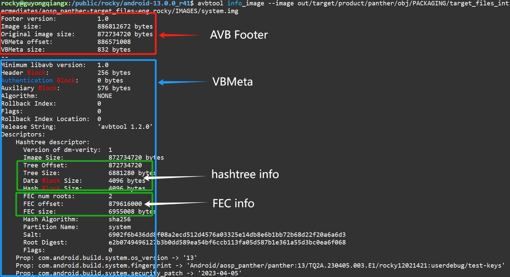

# 20250110-Android AVB 分析（十三）基于 system 分区的 dm-verity 设备验证实战

在上一篇[《Android AVB 分析（十二）嵌入式设备安全中的 dm-verity 简介》](https://blog.csdn.net/guyongqiangx/article/details/145042060)介绍 dm-verity 原理的时候，作者提供了一个 dm-verity 演示的例子。


本篇我们基于 AOSP 源码 `android-13.0.0_r41` 实际编译生成的 Google Pixel 7 (“panther”)  设备的 system 分区镜像进行 dm-verity 设备验证实战。所以，这里我们使用[《Android AVB 分析（四）system.img 到底包含了哪些数据？》](https://blog.csdn.net/guyongqiangx/article/details/144486051)中提到的 system.img


system.img 分区镜像信息：

```bash
$ avbtool info_image --image system.img 
Footer version:           1.0
Image size:               886812672 bytes
Original image size:      872734720 bytes
VBMeta offset:            886571008
VBMeta size:              832 bytes
--
Minimum libavb version:   1.0
Header Block:             256 bytes
Authentication Block:     0 bytes
Auxiliary Block:          576 bytes
Algorithm:                NONE
Rollback Index:           0
Flags:                    0
Rollback Index Location:  0
Release String:           'avbtool 1.2.0'
Descriptors:
    Hashtree descriptor:
      Version of dm-verity:  1
      Image Size:            872734720 bytes
      Tree Offset:           872734720
      Tree Size:             6881280 bytes
      Data Block Size:       4096 bytes
      Hash Block Size:       4096 bytes
      FEC num roots:         2
      FEC offset:            879616000
      FEC size:              6955008 bytes
      Hash Algorithm:        sha256
      Partition Name:        system
      Salt:                  6902f6b436dd8f08a2ecd512d4576a03325e14db8e6b1bb72b68d22f20a6a6d3
      Root Digest:           e2b0749496127b3b0dd589ea54bf6ccb113fa05d587b1e361a55d3bc0ea6f068
      Flags:                 0
    Prop: com.android.build.system.os_version -> '13'
    Prop: com.android.build.system.fingerprint -> 'Android/aosp_panther/panther:13/TQ2A.230405.003.E1/rocky12021421:userdebug/test-keys'
    Prop: com.android.build.system.security_patch -> '2023-04-05'
```

分区的主要信息如下：



> 在编译 Google Pixel 7 (“panther”)  时，system 分区镜像使用 Chain Partition 签名的方式，具体的签名信息位于 `vbmeta_system.img` 镜像中。
>
> 我们这里主要研究 dm-verity 原理，所以 system.img 中 vbmeta 数据是否签名对 dm-verity 实战验证操作没有影响。


为了对比研究 dm-verity 的功能，我们将这里带有 hash, FEC 和 vbmeta 数据的 system.img 还原:

```bash
$ ls -al
total 866048
drwxr-sr-x  2 rocky users      4096 Jan  9 23:36 .
drwxr-sr-x 32 rocky users      4096 Jan  9 23:27 ..
-rw-r--r--  1 rocky users 886812672 Jan 10 00:03 system.img
$ cp system.img system-bare.img
$ avbtool erase_footer --image system-bare.img
$ avbtool info_image --image system-bare.img
/local/public/users/rocky/android-13.0.0_r41/out/host/linux-x86/bin/avbtool: Given image does not look like a vbmeta image.
$ ls -al
total 1718340
drwxr-sr-x  2 rocky users      4096 Jan  9 23:52 .
drwxr-sr-x 32 rocky users      4096 Jan  9 23:27 ..
-rw-r--r--  1 rocky users 872734720 Jan 10 00:42 system-bare.img
-rw-r--r--  1 rocky users 886812672 Jan 10 00:03 system.img
$ 
```

从上面我们看到两个 system 分区镜像：

1. system.img

   编译后，经过 avbtool 处理好的 system.img，带有 hashtree, FEC 和 VBMeta 数据, ，大小为 886820864，约 846M

2. system-bare.img

   system.img 还原后的原始的 system 分区镜像 system-bare.img。完全的纯分区镜像，没有携带任何其他数据，大小为 872742912，约 833M


在下面的两篇文章中，我们专门分析过 system.img 镜像的 hashtree 和 FEC 数据是如何生成的：

- [《Android AVB 分析（五）哈希树到底是如何生成的？》](https://blog.csdn.net/guyongqiangx/article/details/144479669)
  - https://blog.csdn.net/guyongqiangx/article/details/144479669
- [《Android AVB 分析（六）FEC 数据到底是如何生成的？》](https://blog.csdn.net/guyongqiangx/article/details/144487615)
  - https://blog.csdn.net/guyongqiangx/article/details/144487615


简单来说，hashtree 和 FEC 数据都是按照 4096 的块大小生成的，另外:

- hashtree 使用 sha256 算法，每 4096 字节的数据生成 32 字节的哈希值
- FEC 使用 RS(255, 253) 算法编码，即在 255 个字节中，有 253 个是原始数据，有 2 个字节用于错误纠正码（冗余信息），实际上可以纠正 1 个字节的错误


## 生成 system 镜像的 hashtree 和 FEC 数据

在上一篇的示例中，我们看到作者用 veritysetup 工具的 format 命令生成了分区的 hashtree 数据：

```bash
veritysetup -v --debug format data_partition.img hash_partition.img
```


实际上，我们还可以使用 veritysetup 工具的 format 命令生成 FEC 数据。

在 Android 的 system 分区处理中，对于 hashtree 的生成还带有随机盐 salt 参数，而且对于 FEC，使用 `--roots 2`指定编码方式，以及 FEC 数据不带有 footer 信息。

所以，我们这里可以使用下面这个命令同时生成 system-bare.img 镜像的 hashtree 和 FEC 数据：

```bash
veritysetup -v --debug \
	--salt=6902f6b436dd8f08a2ecd512d4576a03325e14db8e6b1bb72b68d22f20a6a6d3 \
	--no-superblock \
	--fec-roots=2 \
	--fec-device=system-bare-fec.bin \
	format system-bare.img system-bare-hash.bin
```

参数说明：

- `-v --debug`
  - `-v` 打印尽量多的输出信息, `--debug` 输出更多的调试信息
- `--salt=6902f6......a6d3`
  - 指定计算 hashtree 是的随机盐 salt 值参数
- `--no-superblock`
  - 处理后的数据不生成 superblock 信息
- `--fec-roots=2`
  - 指定 FEC 的恢复能力，即 roots = 2
- `--fec-device=system-bare-fec.bin`
  - 指定将 FEC 数据输出到文件 `system-bare-fec.bin` 中
- `format system-bare.img system-bare-hash.bin`
  - 指定 format 命令使用的原始镜像为 system-bare.img，以及生成的 hashtree 数据存放到 `system-bare-hash.bin` 文件中

命令的执行 log 如下：

```bash
$ veritysetup -v --debug \
>     --salt=6902f6b436dd8f08a2ecd512d4576a03325e14db8e6b1bb72b68d22f20a6a6d3 \
>     --no-superblock \
>     --fec-roots=2 \
>     --fec-device=system-bare-fec.bin \
>     format system-bare.img system-bare-hash.bin
# cryptsetup 2.2.2 processing "veritysetup -v --debug --salt=6902f6b436dd8f08a2ecd512d4576a03325e14db8e6b1bb72b68d22f20a6a6d3 --no-superblock --fec-roots=2 --fec-device=system-bare-fec.bin format system-bare.img system-bare-hash.bin"
# Running command format.
# Created hash image system-bare-hash.bin.
# Created FEC image system-bare-fec.bin.
# Allocating context for crypt device system-bare-hash.bin.
# Trying to open and read device system-bare-hash.bin with direct-io.
# Initialising device-mapper backend library.
# Formatting device system-bare-hash.bin as type VERITY.
# Crypto backend (OpenSSL 1.1.1f  31 Mar 2020) initialized in cryptsetup library version 2.2.2.
# Detected kernel Linux 5.4.0-54-generic x86_64.
# Setting ciphertext data device to system-bare.img.
# Trying to open and read device system-bare.img with direct-io.
# Trying to open and read device system-bare-fec.bin with direct-io.
# Hash creation sha256, data device system-bare.img, data blocks 213070, hash_device system-bare-hash.bin, offset 0.
# Using 3 hash levels.
# Data device size required: 872734720 bytes.
# Hash device size required: 6881280 bytes.
VERITY header information for system-bare-hash.bin
UUID:            
Hash type:              1
Data blocks:            213070
Data block size:        4096
Hash block size:        4096
Hash algorithm:         sha256
Salt:                   6902f6b436dd8f08a2ecd512d4576a03325e14db8e6b1bb72b68d22f20a6a6d3
Root hash:              e2b0749496127b3b0dd589ea54bf6ccb113fa05d587b1e361a55d3bc0ea6f068
# Releasing crypt device system-bare-hash.bin context.
# Releasing device-mapper backend.
Command successful.
```


上面 log 信息的内容很丰富，值得详细查看。

重点中的重点，生成的 Root hash 和我们使用 `avbtool info_image` 看到的输出是一样的。


### 检查 hashtree 数据

为了确保一样，我们再单独计算下 system.img 中 hashtree 数据的 md5 值。

在 `avbtool info_image` 的输出中看到：

- hashtree 数据位置: `Tree Offset:           872734720`
- hashtree 数据大小: `Tree Size:             6881280 bytes`

所以 system.img 中哈希树的 md5 可以用下面的命令直接得出：

```bash
$ dd if=system.img bs=4096 skip=$((872734720/4096)) count=$((6881280/4096)) | md5sum
1680+0 records in
1680+0 records out
6881280 bytes (6.9 MB, 6.6 MiB) copied, 0.0179827 s, 383 MB/s
679a4855da89c96b65ce8d54db32fe11  -
```


然后，我们再看下单独生成的 `system-bare-hash.bin` 哈希树的 md5 值：

```bash
$ md5sum system-bare-hash.bin 
679a4855da89c96b65ce8d54db32fe11  system-bare-hash.bin
```


我们看到这里二者的 md5 值都是 679a4855da89c96b65ce8d54db32fe11，说明两种方式生成的 hash 数据是完全一样的。


### 检查 FEC 数据

为了确保一样，我们再单独计算下 system.img 中 FEC 数据的 md5 值。

在 `avbtool info_image` 的输出中看到：

- FEC 数据位置: `FEC offset:            879616000`
- FEC 数据大小: `FEC size:              6955008 bytes`

所以 system.img 中 FEC 数据的 md5 可以用下面的命令直接得出：

```bash
$ dd if=system.img bs=4096 skip=$((879616000/4096)) count=$((6955008/4096)) | md5sum
1698+0 records in
1698+0 records out
6955008 bytes (7.0 MB, 6.6 MiB) copied, 0.0189416 s, 367 MB/s
85d6a653576ba3e9093e1f44faa46489  -
```


然后，我们再看下单独生成的 `system-bare-fec.bin` FEC 数据的 md5 值：

```bash
$ md5sum system-bare-fec.bin 
85d6a653576ba3e9093e1f44faa46489  system-bare-fec.bin
```


我们看到这里二者的 md5 值都是 85d6a653576ba3e9093e1f44faa46489，说明两种方式生成的 FEC 数据是完全一样的。


重点的重点来了，我们基于:

- 原始分区镜像 `system-bare.img` ，
- 哈希树数据镜像 `system-bare-hash.bin`， 
- FEC 数据镜像 `system-bare-fec.bin` 

这 3 个部分创建出我们的想要的 dm-verity 镜像来。


为了验证 hash 检查，以及 FEC 恢复的能力，我们将做 3 个映射实验。

1. 正常的不带 FEC 的 dm-verity 映射;
2. 破坏 1 bit 后不带 FEC 的 dm-verity 映射；
3. 破坏 1 bit 后带 FEC 的 dm-verity 映射；


