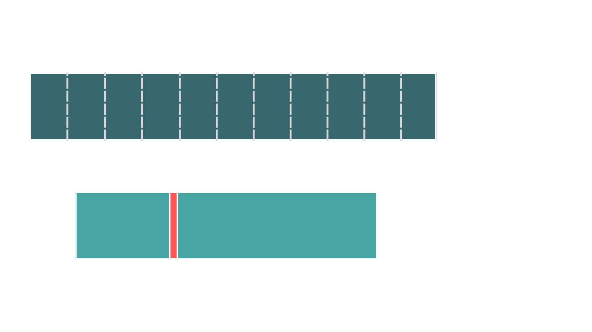
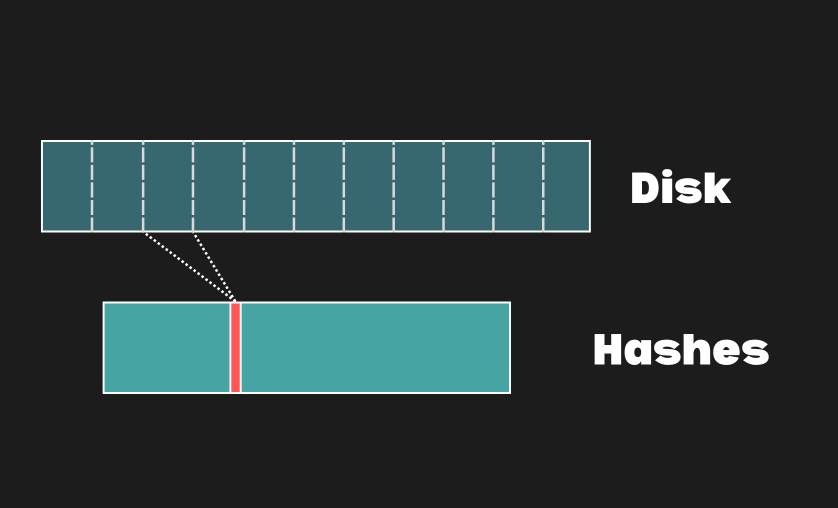

# 20250109-Android AVB 分析（十二）嵌入式设备安全中的 DM-VERITY 简介

> 日期: 2022 年 7 月 19 日
>
> 作者: [Ben Fogle](https://www.starlab.io/blog?author=62d5bca4d277922fd0dcffb1)
>
> 来源: https://www.starlab.io/blog/dm-verity-in-embedded-device-security


Linux 中的大多数安全机制都集中在保护用户在系统开机时。这很有道理，因为大多数计算都是在计算机开机时进行的，但存在一类攻击可以在系统关闭时发生。想象一下攻击者移除硬盘，对其进行更改，然后替换回去。我们如何检测和防御操作系统代码免受此类攻击？答案是使用文件系统完整性方案。（防止攻击者更改用户数据或提取机密等更普遍问题留待另一次讨论。）


Linux 中提供了多种文件系统完整性的方法，每种方法都有其自身的功能和限制。没有一种解决方案适用于所有类型的系统。今天，我们将特别关注其中一种：dm-verity。

## 关于 dm-verity

Dm-verity 于 Linux 内核 3.4 版本中引入。令人惊讶的是，它是一种广泛部署的技术：自 4.4 版本起被 Android 用于保护其系统分区（于 2013 年底发布），每天在全球数十亿嵌入式设备上使用。Dm-verity 提供最小开销的磁盘完整性，对应用程序是透明的：它们甚至不需要知道 dm-verity 正在使用中。


虽然我们将在稍后更详细地探讨为 dm-verity 付出的代价，但代价极小。它引入的运行时开销非常小，并且所需的额外空间也非常少。作为一个具体的例子，dm-verity 对于一个 10GB 的磁盘只需要额外的 81MB 空间。尽管这超出了本文的范围，dm-verity 还可以包括前向错误纠正，使其不仅能检测损坏，还能透明地纠正它。


需要提前提到的注意事项是，在所有情况下，dm-verity 都应与某种类型的安全启动方案配合使用。如果攻击者可以控制启动过程，那么他们可以轻易地绕过 dm-verity。因此，在接下来的所有内容中，我们假设我们在使用的任何设备上都有正常工作的安全启动，这，我们意识到，是“画完剩下的猫头鹰”建议。


## dm-verity 是如何工作的？

dm-verity 背后的概念实际上非常简单。将磁盘划分为块，并为每个块记录存储在其中的数据的哈希值。当需要从磁盘读取数据时，将读取的每个块与之前计算的哈希值进行验证。这非常快，并且哈希值不会占用太多额外空间。当考虑以下问题时，事情变得有趣：当计算机关闭时，哈希值存储在哪里，以及当我们重新加载它们时，我们如何知道我们可以信任这些哈希值没有被篡改？





为了简化问题，当 dm-verity 保护磁盘时，内核阻止任何人向该设备写入。换句话说，dm-verity 磁盘始终为只读，这是其与其他文件系统完整性方案区别之一。通过这种方式，dm-verity 还提供了在线完整性，尽管将磁盘设置为只读并没有什么特别激动人心的，但这提供了额外的保证，即攻击者无法在线或静止状态下修改系统。

.png)


现在来到有趣的部分：如何使用 dm-verity 保护哈希？嗯，我们把哈希表当作磁盘来处理，并用 dm-verity 来保护它！换句话说，我们把哈希分组到块中（使用默认值，每块 128 个哈希），并记录每个块的哈希。这样就产生了一个像之前那样的哈希表，但更小。我们重复这个过程，产生更小的表，直到只剩下一个哈希需要记录：根哈希。


这种结构被称为 Merkle 树。磁盘上的数据或树中的哈希值不能被修改，除非也修改根哈希，因此如果我们知道根哈希应该是多少，我们就可以验证一切是否如预期。根哈希需要得到保护，但不需要保密。


梅克尔树构建使我们能够仅验证所需的哈希值，在需要时进行验证，而不是一次性验证所有内容。特别是在嵌入式系统中，一次性验证方法可能会在启动时造成明显的延迟。它还提供了灵活性，即磁盘某一部分的损坏不会影响磁盘的其他部分（尽管如果我们愿意，可以那样处理）。


## 一个简单的例子

.png)

通过一个具体的例子来讲解，让我们创建一个 dm-verity 保护的磁盘。当然，我们需要一个数据分区来保护，但也需要某个地方来存储散列值。我们有两个选择：将它们存储在单独的数据和散列分区中，或者将散列值存储在数据分区末尾的未格式化空间中。为了简单起见，我们在这里选择前者。请注意，根散列值本身并不存储在磁盘的任何地方：我们必须自己向内核提供该值。


首先，创建一个替代数据分区并填充几个文件：

```bash
root# truncate -s 10G data_partition.img 
root# mkfs -t ext4 data_partition.img 
root# mkdir mnt 
root# mount -o loop data_partition.img mnt/ 
root# echo "hello" > mnt/one.txt 
root# echo "integrity" > mnt/two.txt 
root# umount mnt/ 
```


接下来，我们将创建一个替代分区来存储哈希数据：

```bash
root# truncate -s 100M hash_partition.img 
```


然后我们将对数据进行哈希处理并存储到我们的哈希分区中。

下面，我们使用 `--debug` 选项来展示诸如哈希树层级数量和所需最终磁盘空间等信息：

```bash
root# veritysetup -v --debug format data_partition.img hash_partition.img 
# cryptsetup 2.2.2 processing "veritysetup -v --debug format data_partition.img hash_partition.img" 
# Running command format. 
# Allocating context for crypt device hash_partition.img. 
# Trying to open and read device hash_partition.img with direct-io. 
# Initialising device-mapper backend library. 
# Formatting device hash_partition.img as type VERITY. 
# Crypto backend (OpenSSL 1.1.1f  31 Mar 2020) initialized in cryptsetup library version 2.2.2. 
# Detected kernel Linux 5.13.0-52-generic x86_64. 
# Setting ciphertext data device to data_partition.img. 
# Trying to open and read device data_partition.img with direct-io. 
# Hash creation sha256, data device data_partition.img, data blocks 2621440, hash_device hash_partition.img, offset 1. 
# Using 4 hash levels. 
# Data device size required: 10737418240 bytes. 
# Hash device size required: 84557824 bytes. 
# Updating VERITY header of size 512 on device hash_partition.img, offset 0. 
VERITY header information for hash_partition.img 
UUID:               4da1ecb5-5111-4922-8747-5e867036d9de 
Hash type:          1 
Data blocks:        2621440 
Data block size:    4096 
Hash block size:    4096 
Hash algorithm:     sha256 
Salt:       	     f2790cf141405152cf61b6eb176128ad0676b41524dd32ac39760d3be2d495cf 
Root hash:          a2a8fd07889deb10b4cdf53c01637ed373212cd7d0877a8aa9ae6fd4240f0f71 
# Releasing crypt device hash_partition.img context. 
# Releasing device-mapper backend. 
# Closing read write fd for hash_partition.img. 
Command successful. 
```


我们需要复制根哈希以供后续使用。在此阶段，对 data_partition.img 的任何单个比特(bit)更改都会导致错误，所以不要触碰它！data_partition.img 文件包含一个常规的 ext4 文件系统，而 hash_partition.img 包含我们之前讨论的整个 Merkle 树，但不包括根哈希。请参阅 cryptsetup wiki 以获取格式和所用算法的更详细描述。


现在我们可以挂载数据分区。我们需要选择一个设备映射器名称，可以是任何名称。在这个例子中，使用“verity-test”，如下面的命令所示。

```bash
root# veritysetup open \ 
>         data_partition.img \ 
>         verity-test \ 
>         hash_partition.img \ 
>         a2a8fd07889deb10b4cdf53c01637ed373212cd7d0877a8aa9ae6fd4240f0f71 
```


上述命令是需要通过安全启动进行保护的。


此时您应该在文件系统中看到 `/dev/mapper/verity-test` 出现。我们只需像常规磁盘一样挂载它，我们就有了受保护的文件系统！

```bash
root# mkdir mnt 
root# mount /dev/mapper/verity-test mnt/ 
root# cat mnt/one.txt mnt/two.txt 
hello 
integrity 
```


## 它究竟是如何工作的？

上面看起来并没有发生什么特别的事情，那么引擎内部到底发生了什么？让我们从 cat 读取 one.txt 时会发生什么开始：

.png)

我们之前没有读取过这个文件，因此内核从磁盘加载数据（1）。然后它从磁盘加载包含所需哈希值的块（2）。由于这是第一次从磁盘加载哈希值，因此还需要验证这些哈希值。内核读取下一级以找到它刚刚读取的块的哈希值（3）。这还没有被验证，所以我们再读取下一级（4）。这一级只是一个单独的块，使用我们挂载文件系统时给内核的根哈希值进行验证。这次第一次磁盘访问产生了 4 次读取（一次数据，三次哈希块）和 4 个 SHA256 哈希。这是最坏的情况，并且大多数情况下只会发生在 dm-verity 保护的磁盘挂载后。

-1736397331233-10.png)

让我们再次读取相同的文件！这次文件的数据在页面缓存中，内核足够智能，知道它已经被验证（1）。因此，数据以零次读取和零次哈希返回。然而，如果文件有一段时间未被访问，内核可能会将该页面从页面缓存中移除，以释放 RAM 供其他用途。在这种情况下，数据需要从磁盘重新读取并重新验证。（Dm-verity 确实提供了一个只在第一次读取时验证的选项。这提供了较弱的安全性，但略微提高了性能。）

.png)

让我们读取另一个文件，为了说明，我们假设它在我们刚刚读取的文件附近。我们从磁盘（1）读取文件，并找到该数据块的哈希值（2）。幸运的是，我们需要的哈希值位于与上一个文件相同的哈希块中，并且它仍然在页面缓存中。由于它在页面缓存中，我们知道我们可以信任它，而且不需要做进一步的工作。一次读取，一次哈希。


与文件数据一样，如果内核需要 RAM 用于其他目的，哈希块也可以从页面缓存中移除。在这种情况下，我们像以前一样重新读取和验证树的所有级别的块，但我们可以跳过读取和验证仍在页面缓存中的块。


## 处理数据损坏

因为 dm-verity 在二进制级别保护磁盘，所以磁盘上任何位置的单一比特(bit)变化都会导致 dm-verity 引发错误。事实上，由于写入磁盘的元数据发生微小变化，仅对磁盘进行读写操作就足以让 dm-verity 变得崩溃。为了演示，


首先，让我们拆解之前的 dm-verity 设备：

```bash
root# umount mnt/ 
root# veritysetup close verity-test 
```


现在我们将挂载读写，但不做其他更改。

```bash
root# mount -o loop data_partition.img mnt/ 
root# umount mnt/ 
```


我们将尝试重新挂载时将遇到错误：

```bash
root# veritysetup open \ 
>         data_partition.img \ 
>         verity-test \ 
>         hash_partition.img \ 
>         a2a8fd07889deb10b4cdf53c01637ed373212cd7d0877a8aa9ae6fd4240f0f71 
Verity device detected corruption after activation 
root# mount /dev/mapper/verity-test mnt/ 
mount: /path/to/mnt: can't read superblock on /dev/mapper/verity-testroot## mount /dev/mapper/verity-test mnt/ 
root# dmesg 
... 
[412036.212897] device-mapper: verity: 7:16: data block 0 is corrupted 
[412036.212996] device-mapper: verity: 7:16: data block 0 is corrupted 
[412036.213009] buffer_io_error: 91 callbacks suppressed 
[412036.213011] Buffer I/O error on dev dm-0, logical block 0, async page read 
[412036.223697] device-mapper: verity: 7:16: data block 0 is corrupted 
...
```


## 为什么不使用 dm-verity？


正如任何技术一样，dm-verity 并不适用于所有用例。最可能的不兼容性是 dm-verity 保护的磁盘是只读的。这对于具有只读系统分区和读写数据分区的嵌入式设备来说相当不错，但对于传统的服务器或工作站设置来说则有些不合适。（请注意，通过自定义分区方案和一些 initramfs 工作，可以在 Debian 或 RedHat 等发行版上使 dm-verity 工作。）


第二点值得注意的考虑是系统更新。更新必须在关闭 dm-verity 的情况下离线执行。在一个你预期每个设备都有相同系统分区的嵌入式系统中，基于块的更新对此效果良好，使我们能够一次性更新文件系统数据和哈希值。由于我们知道每个固件版本的精确磁盘布局，可以在更新之前计算出更新的根哈希。这是 Android 和其他嵌入式 Linux 设备所采取的路线。


基于文件的更新，如 rpm 或 apt，在桌面/服务器发行版中更为常见，也可能存在问题。这些更新不能保证写入顺序、时间戳或其他文件元数据的一致性，因此每个文件系统最终都是独特的。这意味着每个设备在每次更新后都需要重新计算其根哈希。对于大磁盘，这可能需要一些时间。另一个复杂的问题是，哈希需要通过安全启动来保护，因此它需要以某种方式安全更新，可能需要在安全处理任何相关密钥材料的同时重新签名各种启动组件。


## dm-verity 的替代方案

为了比较，我们将简要描述 IMA、Dm-crypt 和 Fsverity 与 dm-verity 的一些区别。

### Dm-crypt


全盘加密使用 dm-crypt（假设使用 AED 加密算法或 HMAC 方案），可以提供与 dm-verity 类似的功能，以实现离线保护。此外，它还提供保密性，因此攻击者无法读取敏感信息。然而，也有一些缺点。


第一个缺点是加密密钥需要保密。这需要使用 TPM、每次启动时输入的用户密码或某些其他安全提供或存储密钥材料的方法。这并不适用于每个用例：小型嵌入式设备或短暂存在的云镜像就属于这种情况。相比之下，dm-verity 根哈希需要防止篡改，但不需要保密，提供了更大的灵活性。


第二个缺点是性能。Dm-verity 只需计算一个或两个哈希值，并且总是比加密算法快得多。尽管 dm-verity 偶尔需要额外的磁盘读取，但在正常操作过程中，它仍然会更快地完成工作。


Dm-crypt 允许在运行时修改分区。虽然这通常是期望的，但也意味着攻击者有持续修改代码或配置的途径。具有 root 权限的攻击者可以轻松添加软件或 rootkits 以供后续访问。


最终缺点是，dm-crypt 不很适合保护一串相同的设备，因为设备永远不应该共享加密密钥。因此，从装配线滚下来的嵌入式设备或用于多个虚拟机的映像在部署前需要某种重新加密的机制。


### IMA/EVM 


Linux 内核的完整性度量架构（IMA）在近年来在 Linux 内核中取得了显著进展。IMA 类似于 dm-verity，通过预期散列值来衡量文件，但它衡量的是单个文件而不是磁盘块。IMA 是一个强大但复杂的系统，具有许多动态部分和通常留给读者练习的总体 IMA 策略。事实上，许多关于设置 IMA 的指南都警告各种意外行为。IMA 也不一定保护分区上的每个文件，除非配置为这样做。相比之下，dm-verity 在推理上要简单得多。


IMA 本身不提供离线完整性。它将完整性存储在磁盘上的扩展属性中，可以被修改。要提供离线完整性，您将转向扩展验证模块（EVM），该模块存储完整性数据的 HMAC，并使用密钥进行保护。此密钥需要每个设备唯一，并且与 dm-crypt 加密密钥的保护方式相同，因此这也不适用于许多用例。


### Fs-verity 


Fs-verity 非常类似于 dm-verity，但它是按文件而不是按磁盘进行。它需要特殊的文件系统支持，并且旨在与（来自内核文档）“可信用户空间代码（例如，在由 dm-verity 自身认证的只读分区上运行的操作系统代码”协同工作。Fs-verity 也仅限于验证常规文件内容。它不能保护元数据或目录。它旨在保护一些大型文件，如 Android APKs。


希望本对 dm-verity 的介绍为对基于 Linux 系统的文件系统完整性解决方案的进一步研究和学习奠定基础。随着边缘设备中使用的软件和数据量的增长，文件系统完整性成为越来越关键的安保措施。


## 进一步阅读


关于这些主题的更多信息，我们推荐以下内容：

- [Dm-crypt](https://en.wikipedia.org/wiki/Dm-crypt) 
- [Dm-verity](https://www.kernel.org/doc/html/latest/admin-guide/device-mapper/verity.html) 
- [IMA](https://sourceforge.net/p/linux-ima/wiki/Home/) 
- [Fs-verity](https://www.kernel.org/doc/html/latest/filesystems/fsverity.html) 