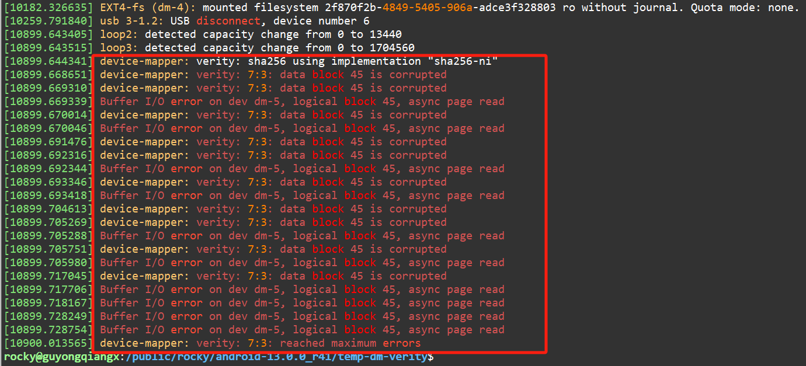
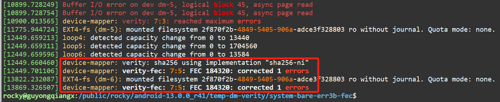

# 20250110-Android AVB 分析（十三）dm-verity 设备是如何映射和纠错的？

## 1. 准备工作

在上一篇[《Android AVB 分析（十二）嵌入式设备安全中的 dm-verity 简介》](https://blog.csdn.net/guyongqiangx/article/details/145042060)介绍 dm-verity 原理的时候，作者提供了一个 dm-verity 演示的例子。


本篇我们基于 AOSP 源码 `android-13.0.0_r41` 实际编译生成的 Google Pixel 7 (“panther”)  设备的 system 分区镜像进行 dm-verity 设备验证实战。所以，这里我们使用[《Android AVB 分析（四）system.img 到底包含了哪些数据？》](https://blog.csdn.net/guyongqiangx/article/details/144486051)中提到的 system.img


system.img 分区镜像信息：

```bash
$ avbtool info_image --image system.img 
Footer version:           1.0
Image size:               886812672 bytes
Original image size:      872734720 bytes
VBMeta offset:            886571008
VBMeta size:              832 bytes
--
Minimum libavb version:   1.0
Header Block:             256 bytes
Authentication Block:     0 bytes
Auxiliary Block:          576 bytes
Algorithm:                NONE
Rollback Index:           0
Flags:                    0
Rollback Index Location:  0
Release String:           'avbtool 1.2.0'
Descriptors:
    Hashtree descriptor:
      Version of dm-verity:  1
      Image Size:            872734720 bytes
      Tree Offset:           872734720
      Tree Size:             6881280 bytes
      Data Block Size:       4096 bytes
      Hash Block Size:       4096 bytes
      FEC num roots:         2
      FEC offset:            879616000
      FEC size:              6955008 bytes
      Hash Algorithm:        sha256
      Partition Name:        system
      Salt:                  6902f6b436dd8f08a2ecd512d4576a03325e14db8e6b1bb72b68d22f20a6a6d3
      Root Digest:           e2b0749496127b3b0dd589ea54bf6ccb113fa05d587b1e361a55d3bc0ea6f068
      Flags:                 0
    Prop: com.android.build.system.os_version -> '13'
    Prop: com.android.build.system.fingerprint -> 'Android/aosp_panther/panther:13/TQ2A.230405.003.E1/rocky12021421:userdebug/test-keys'
    Prop: com.android.build.system.security_patch -> '2023-04-05'
```

分区的主要信息如下：


> 在编译 Google Pixel 7 (“panther”)  时，system 分区镜像使用 Chain Partition 签名的方式，具体的签名信息位于 `vbmeta_system.img` 镜像中。
>
> 我们这里主要研究 dm-verity 原理，所以 system.img 中 vbmeta 数据是否签名对 dm-verity 实战验证操作没有影响。


为了对比研究 dm-verity 的功能，我们将这里带有 hash, FEC 和 vbmeta 数据的 system.img 还原:

```bash
$ ls -al
total 866048
drwxr-sr-x  2 rocky users      4096 Jan  9 23:36 .
drwxr-sr-x 32 rocky users      4096 Jan  9 23:27 ..
-rw-r--r--  1 rocky users 886812672 Jan 10 00:03 system.img
$ cp system.img system-bare.img
$ avbtool erase_footer --image system-bare.img
$ avbtool info_image --image system-bare.img
/public/rocky/android-13.0.0_r41/out/host/linux-x86/bin/avbtool: Given image does not look like a vbmeta image.
$ ls -al
total 1718340
drwxr-sr-x  2 rocky users      4096 Jan  9 23:52 .
drwxr-sr-x 32 rocky users      4096 Jan  9 23:27 ..
-rw-r--r--  1 rocky users 872734720 Jan 10 00:42 system-bare.img
-rw-r--r--  1 rocky users 886812672 Jan 10 00:03 system.img
$ 
```

从上面我们看到两个 system 分区镜像：

1. system.img

   编译后，经过 avbtool 处理好的 system.img，带有 hashtree, FEC 和 VBMeta 数据, ，大小为 886820864，约 846M

2. system-bare.img

   system.img 还原后的原始的 system 分区镜像 system-bare.img。完全的纯分区镜像，没有携带任何其他数据，大小为 872742912，约 833M


在下面的两篇文章中，我们专门分析过 system.img 镜像的 hashtree 和 FEC 数据是如何生成的：

- [《Android AVB 分析（五）哈希树到底是如何生成的？》](https://blog.csdn.net/guyongqiangx/article/details/144479669)
  - https://blog.csdn.net/guyongqiangx/article/details/144479669
- [《Android AVB 分析（六）FEC 数据到底是如何生成的？》](https://blog.csdn.net/guyongqiangx/article/details/144487615)
  - https://blog.csdn.net/guyongqiangx/article/details/144487615


简单来说，hashtree 和 FEC 数据都是按照 4096 的块大小生成的，另外:

- hashtree 使用 sha256 算法，每 4096 字节的数据生成 32 字节的哈希值
- FEC 使用 RS(255, 253) 算法编码，即在 255 个字节中，有 253 个是原始数据，有 2 个字节用于错误纠正码（冗余信息），实际上可以纠正 1 个字节的错误


## 2. 生成并验证 hashtree 和 FEC 数据

在上一篇的示例中，我们看到作者用 veritysetup 工具的 format 命令生成了分区的 hashtree 数据：

```bash
veritysetup -v --debug format data_partition.img hash_partition.img
```


实际上，我们还可以使用 veritysetup 工具的 format 命令生成 FEC 数据。

在 Android 的 system 分区处理中，对于 hashtree 的生成还带有随机盐 salt 参数，而且对于 FEC，使用 `--roots 2`指定编码方式，以及 FEC 数据不带有 footer 信息。

所以，我们这里可以使用下面这个命令，携带 salt 参数并同时生成 system-bare.img 镜像的 hashtree 和 FEC 数据：

```bash
veritysetup -v --debug \
	--salt=6902f6b436dd8f08a2ecd512d4576a03325e14db8e6b1bb72b68d22f20a6a6d3 \
	--no-superblock \
	--fec-roots=2 \
	--fec-device=system-bare-fec.bin \
	format system-bare.img system-bare-hash.bin
```

参数说明：

- `-v --debug`
  - `-v` 打印尽量多的输出信息, `--debug` 输出更多的调试信息
- `--salt=6902f6......a6d3`
  - 指定计算 hashtree 是的随机盐 salt 值参数
- `--no-superblock`
  - 处理后的数据不生成 superblock 信息
- `--fec-roots=2`
  - 指定 FEC 的恢复能力，即 roots = 2
- `--fec-device=system-bare-fec.bin`
  - 指定将 FEC 数据输出到文件 `system-bare-fec.bin` 中
- `format system-bare.img system-bare-hash.bin`
  - 指定 format 命令使用的原始镜像为 system-bare.img，以及生成的 hashtree 数据存放到 `system-bare-hash.bin` 文件中

命令的执行 log 如下：

```bash
$ veritysetup -v --debug \
>     --salt=6902f6b436dd8f08a2ecd512d4576a03325e14db8e6b1bb72b68d22f20a6a6d3 \
>     --no-superblock \
>     --fec-roots=2 \
>     --fec-device=system-bare-fec.bin \
>     format system-bare.img system-bare-hash.bin
# cryptsetup 2.2.2 processing "veritysetup -v --debug --salt=6902f6b436dd8f08a2ecd512d4576a03325e14db8e6b1bb72b68d22f20a6a6d3 --no-superblock --fec-roots=2 --fec-device=system-bare-fec.bin format system-bare.img system-bare-hash.bin"
# Running command format.
# Created hash image system-bare-hash.bin.
# Created FEC image system-bare-fec.bin.
# Allocating context for crypt device system-bare-hash.bin.
# Trying to open and read device system-bare-hash.bin with direct-io.
# Initialising device-mapper backend library.
# Formatting device system-bare-hash.bin as type VERITY.
# Crypto backend (OpenSSL 1.1.1f  31 Mar 2020) initialized in cryptsetup library version 2.2.2.
# Detected kernel Linux 5.4.0-54-generic x86_64.
# Setting ciphertext data device to system-bare.img.
# Trying to open and read device system-bare.img with direct-io.
# Trying to open and read device system-bare-fec.bin with direct-io.
# Hash creation sha256, data device system-bare.img, data blocks 213070, hash_device system-bare-hash.bin, offset 0.
# Using 3 hash levels.
# Data device size required: 872734720 bytes.
# Hash device size required: 6881280 bytes.
VERITY header information for system-bare-hash.bin
UUID:            
Hash type:              1
Data blocks:            213070
Data block size:        4096
Hash block size:        4096
Hash algorithm:         sha256
Salt:                   6902f6b436dd8f08a2ecd512d4576a03325e14db8e6b1bb72b68d22f20a6a6d3
Root hash:              e2b0749496127b3b0dd589ea54bf6ccb113fa05d587b1e361a55d3bc0ea6f068
# Releasing crypt device system-bare-hash.bin context.
# Releasing device-mapper backend.
Command successful.
```


由于命令行带有 `--debug` 参数，因此上面 log 信息的内容很丰富，值得详细查看。后面为了不占用过多篇幅，不再携带 `--debug` 参数，但在学习过程中，强烈建议带上 `--debug` 参数，从输出的 log 中学习更多细节。


这里啰嗦了半天，重点强调的是，手动通过 `veritysetup` 命令生成的 Root hash 和我们使用 `avbtool info_image` 看到的输出是一样的。


### 2.1 verity superblock 数据

对于使用 `--no-superblock` 选项与不使用该选项的差别在于，默认不使用该选项生成的 hashtree 数据会在前面生成一个 verity superblock 结构(512 bytes)，然后为这个结构分配一个 4096 字节的 block 存储。

下面是一个具体的例子，我们可以看到 `system-bare-hash-with-superblock.bin` 文件比 `system-bare-hash.bin` 大 4096 bytes, 并且在前 4096 bytes 中存放两个一个 verity superblock 结构：

```bash
$ ls -lh
-rw------- 1 rocky users 6.7M Jan 10 00:43 system-bare-fec.bin
-rw------- 1 rocky users 6.6M Jan 16 10:38 system-bare-hash-with-superblock.bin
-rw------- 1 rocky users 6.6M Jan 10 15:56 system-bare-hash.bin
-rw-r--r-- 1 rocky users 833M Jan 10 00:42 system-bare.img
-rw-r--r-- 1 rocky users 846M Jan 10 00:03 system.img
$ hexdump -C -n 4096 system-bare-hash-with-superblock.bin
00000000  76 65 72 69 74 79 00 00  01 00 00 00 01 00 00 00  |verity..........|
00000010  50 f0 76 56 f2 77 40 a9  b2 db 45 f2 4f ae 73 af  |P.vV.w@...E.O.s.|
00000020  73 68 61 32 35 36 00 00  00 00 00 00 00 00 00 00  |sha256..........|
00000030  00 00 00 00 00 00 00 00  00 00 00 00 00 00 00 00  |................|
00000040  00 10 00 00 00 10 00 00  4e 40 03 00 00 00 00 00  |........N@......|
00000050  20 00 00 00 00 00 00 00  69 02 f6 b4 36 dd 8f 08  | .......i...6...|
00000060  a2 ec d5 12 d4 57 6a 03  32 5e 14 db 8e 6b 1b b7  |.....Wj.2^...k..|
00000070  2b 68 d2 2f 20 a6 a6 d3  00 00 00 00 00 00 00 00  |+h./ ...........|
00000080  00 00 00 00 00 00 00 00  00 00 00 00 00 00 00 00  |................|
*
00001000
```


具体的 verity superblock 结构请参考：

- https://gitlab.com/cryptsetup/cryptsetup/-/wikis/DMVerity

我这里直接将这个数据结构粘贴如下：

```c
  struct verity_sb {
  uint8_t  signature[8];    /* "verity\0\0" */
  uint32_t version;         /* superblock version, 1 */
  uint32_t hash_type;       /* 0 - Chrome OS, 1 - normal */
  uint8_t  uuid[16];        /* UUID of hash device */
  uint8_t  algorithm[32];   /* hash algorithm name */
  uint32_t data_block_size; /* data block in bytes */
  uint32_t hash_block_size; /* hash block in bytes */
  uint64_t data_blocks;     /* number of data blocks */
  uint16_t salt_size;       /* salt size */
  uint8_t  _pad1[6];
  uint8_t  salt[256];       /* salt */
  uint8_t  _pad2[168];
} __attribute__((packed));
```

Android 上 avbtool 处理 system.img 等分区生成 hashtree 数据时不带 verity superblock 数据，因此我们这里手动验证时需要添加 `-no-superblock` 选项。


### 2.2 检查 hashtree 数据

为了确保手动生成的 `system-bare-hash.bin` 和 system.img 镜像中的 hashtree 数据一样，我们再单独计算下 system.img 中 hashtree 数据的 md5 值。

在 `avbtool info_image` 的输出中看到：

- hashtree 数据位置: `Tree Offset:           872734720`
- hashtree 数据大小: `Tree Size:             6881280 bytes`

所以 system.img 中哈希树的 md5 可以用下面的命令直接得出：

```bash
$ dd if=system.img bs=4096 skip=$((872734720/4096)) count=$((6881280/4096)) | md5sum
1680+0 records in
1680+0 records out
6881280 bytes (6.9 MB, 6.6 MiB) copied, 0.0179827 s, 383 MB/s
679a4855da89c96b65ce8d54db32fe11  -
```


然后，我们再看下单独生成的 `system-bare-hash.bin` 哈希树的 md5 值：

```bash
$ md5sum system-bare-hash.bin 
679a4855da89c96b65ce8d54db32fe11  system-bare-hash.bin
```


我们看到这里二者的 md5 值都是 679a4855da89c96b65ce8d54db32fe11，说明两种方式生成的 hash 数据是完全一样的。


### 2.3 检查 FEC 数据

为了确保手动生成的 `system-bare-fec.bin` 和 system.img 镜像中的 FEC 数据一样，我们再单独计算下 system.img 中 FEC 数据的 md5 值。

在 `avbtool info_image` 的输出中看到：

- FEC 数据位置: `FEC offset:            879616000`
- FEC 数据大小: `FEC size:              6955008 bytes`

所以 system.img 中 FEC 数据的 md5 可以用下面的命令直接得出：

```bash
$ dd if=system.img bs=4096 skip=$((879616000/4096)) count=$((6955008/4096)) | md5sum
1698+0 records in
1698+0 records out
6955008 bytes (7.0 MB, 6.6 MiB) copied, 0.0189416 s, 367 MB/s
85d6a653576ba3e9093e1f44faa46489  -
```


然后，我们再看下单独生成的 `system-bare-fec.bin` FEC 数据的 md5 值：

```bash
$ md5sum system-bare-fec.bin 
85d6a653576ba3e9093e1f44faa46489  system-bare-fec.bin
```


我们看到这里二者的 md5 值都是 85d6a653576ba3e9093e1f44faa46489，说明两种方式生成的 FEC 数据是完全一样的。


通过前面的几个步骤，我们已经成功生成了 system-bare.img 镜像的 hashtree 和 FEC 数据，并验证了和 system.img 中额内容一样。

重点来了，我们将要基于以下数据:

- 原始分区镜像 `system-bare.img` ，
- 哈希树数据镜像 `system-bare-hash.bin`， 
- FEC 数据镜像 `system-bare-fec.bin` 

这 3 个部分创建出我们的想要的 dm-verity 镜像来。


为了验证 hash 检查，以及 FEC 纠错的能力，我们将做 3 个映射实验。

1. 正常的不带 FEC 的 dm-verity 映射;
2. 破坏 3 bits 后不带 FEC 的 dm-verity 映射；
3. 破坏 3 bits 后带 FEC 的 dm-verity 映射；


## 3. 基本的 dm-verity 映射

我们的第一个实验是基于原始数据 `system-bare.img` 和 hashtree 数据 `system-bare-hash.bin`，进行一个基本的 dm-verity 映射生成目标设备 `system-verity`:


使用 `system-bare.img` 和 `system-bare-hash.bin` 创建名为 `system-verity` 的 dm-verity 设备：

```bash
$ sudo veritysetup -v --no-superblock \
    --salt=6902f6b436dd8f08a2ecd512d4576a03325e14db8e6b1bb72b68d22f20a6a6d3 \
    open system-bare.img system-verity system-bare-hash.bin \
    e2b0749496127b3b0dd589ea54bf6ccb113fa05d587b1e361a55d3bc0ea6f068
Command successful.
$ 
$ ls -lh /dev/mapper/
total 0
crw------- 1 root root 10, 236 Jan 17 10:49 control
lrwxrwxrwx 1 root root       7 Jan 17 13:10 system-verity -> ../dm-4
```


从上面 `/dev/mapper` 目录下的内容可以看到，`system-verity` 设备已经成功创建。


可以使用 `dmsetup info` 或 `veritysetup status` 查看设备的详细信息：

```bash
$ sudo dmsetup info system-verity
Name:              system-verity
State:             ACTIVE (READ-ONLY)
Read Ahead:        256
Tables present:    LIVE
Open count:        0
Event number:      0
Major, minor:      252, 4
Number of targets: 1
UUID: CRYPT-VERITY-system-verity

$ sudo veritysetup status system-verity
/dev/mapper/system-verity is active.
  type:        VERITY
  status:      verified
  hash type:   1
  data block:  4096
  hash block:  4096
  hash name:   sha256
  salt:        6902f6b436dd8f08a2ecd512d4576a03325e14db8e6b1bb72b68d22f20a6a6d3
  data device: /dev/loop1
  data loop:   /public/rocky/android-13.0.0_r41/temp-dm-verity/system-bare.img
  size:        1704560 sectors
  mode:        readonly
  hash device: /dev/loop0
  hash loop:   /public/rocky/android-13.0.0_r41/temp-dm-verity/system-bare-hash.bin
  hash offset: 0 sectors
  root hash:   e2b0749496127b3b0dd589ea54bf6ccb113fa05d587b1e361a55d3bc0ea6f068
```


从 `veritysetup status` 的输出可以看到，在使用数据文件映射 `system-verity` 的过程中，将：

- `system-bare.img` 挂载为 loop1 设备：`/dev/loop1`
- `system-bare-hash.bin` 挂载为 loop0 设备: `/dev/loop0`

当然，我们也可以通过 `losetup -a` 的输出来印证：

```bash
$ sudo losetup -a
/dev/loop1: [64515]:297011278 (/public/rocky/android-13.0.0_r41/temp-dm-verity/system-bare.img)
/dev/loop0: [64515]:297011277 (/public/rocky/android-13.0.0_r41/temp-dm-verity/system-bare-hash.bin)
```


我们也可以用 `veritysetup verify` 命令来验证 `system-bare.img` 的 hash 数据：

```bash
$ sudo veritysetup -v --no-superblock \
    --salt=6902f6b436dd8f08a2ecd512d4576a03325e14db8e6b1bb72b68d22f20a6a6d3 \
    verify system-bare.img system-bare-hash.bin \
    e2b0749496127b3b0dd589ea54bf6ccb113fa05d587b1e361a55d3bc0ea6f068
Command successful.
```

> 更多关于 verify 检查的细节，建议使用 `--debug` 选项查看输出 log。


试着挂载 `system-verity` 设备到 `system-bare` 目录：

```bash
$ mkdir system-bare
$ sudo mount -t ext4 -o ro /dev/mapper/system-verity system-bare
$ cd system-bare
system-bare$ ls -lh
total 116K
drwxr-xr-x.  2 root      root   4.0K Jan  1  2009 acct
drwxr-xr-x.  2 root      root   4.0K Jan  1  2009 apex
lrw-r--r--.  1 root      root     11 Jan  1  2009 bin -> /system/bin
lrw-r--r--.  1 root      root     50 Jan  1  2009 bugreports -> /data/user_de/0/com.android.shell/files/bugreports
lrw-r--r--.  1 root      root     11 Jan  1  2009 cache -> /data/cache
dr-xr-xr-x.  2 root      root   4.0K Jan  1  2009 config
lrw-r--r--.  1 root      root     17 Jan  1  2009 d -> /sys/kernel/debug
drwxrwx--x.  2 rndlegacy ot-ana 4.0K Jan  1  2009 data
drwxr-xr-x.  2 root      root   4.0K Jan  1  2009 data_mirror
drwxr-xr-x.  2 root      root   4.0K Jan  1  2009 debug_ramdisk
drwxr-xr-x.  2 root      root   4.0K Jan  1  2009 dev
lrw-r--r--.  1 root      root     11 Jan  1  2009 etc -> /system/etc
lrwxr-x---.  1 root        2000   16 Jan  1  2009 init -> /system/bin/init
-rwxr-x---.  1 root        2000  463 Jan  1  2009 init.environ.rc
drwxr-xr-x.  2 root      root   4.0K Jan  1  2009 linkerconfig
drwx------.  2 root      root    16K Jan  1  2009 lost+found
drwxr-xr-x.  2 root      root   4.0K Jan  1  2009 metadata
drwxr-xr-x.  2 root      ot-ana 4.0K Jan  1  2009 mnt
drwxr-xr-x.  2 root      root   4.0K Jan  1  2009 odm
drwxr-xr-x.  2 root      root   4.0K Jan  1  2009 odm_dlkm
drwxr-xr-x.  2 root      root   4.0K Jan  1  2009 oem
drwxr-xr-x.  2 root      root   4.0K Jan  1  2009 postinstall
drwxr-xr-x.  2 root      root   4.0K Jan  1  2009 proc
drwxr-xr-x.  2 root      root   4.0K Jan  1  2009 product
lrw-r--r--.  1 root      root     21 Jan  1  2009 sdcard -> /storage/self/primary
drwxr-xr-x.  2 root      root   4.0K Jan  1  2009 second_stage_resources
drwxr-x--x.  2 root      eutra  4.0K Jan  1  2009 storage
drwxr-xr-x.  2 root      root   4.0K Jan  1  2009 sys
drwxr-xr-x. 13 root      root   4.0K Jan  1  2009 system
drwxr-xr-x.  2 root      root   4.0K Jan  1  2009 system_dlkm
drwxr-xr-x.  2 root      root   4.0K Jan  1  2009 system_ext
drwxr-xr-x.  2 root        2000 4.0K Jan  1  2009 vendor
drwxr-xr-x.  2 root      root   4.0K Jan  1  2009 vendor_dlkm
```

在这里我们成功地将 `system-bare.img` 以 dm-verity 的方式映射成名称为 `system-verity` 的 dm-verity 设备，并挂载到 `system-bare` 目录下。

 

为了下一步的实验，我们查看一下 `init.environ.rc` 文件的相关信息：

```bash
system-bare$ ls -al init.environ.rc 
-rwxr-x---. 1 root 2000 463 Jan  1  2009 init.environ.rc
system-bare$ sudo cat init.environ.rc 
# set up the global environment
on early-init
    export ANDROID_BOOTLOGO 1
    export ANDROID_ROOT /system
    export ANDROID_ASSETS /system/app
    export ANDROID_DATA /data
    export ANDROID_STORAGE /storage
    export ANDROID_ART_ROOT /apex/com.android.art
    export ANDROID_I18N_ROOT /apex/com.android.i18n
    export ANDROID_TZDATA_ROOT /apex/com.android.tzdata
    export EXTERNAL_STORAGE /sdcard
    export ASEC_MOUNTPOINT /mnt/asec
    
    
    
    
system-bare$ sudo hexdump -Cv init.environ.rc 
00000000  23 20 73 65 74 20 75 70  20 74 68 65 20 67 6c 6f  |# set up the glo|
00000010  62 61 6c 20 65 6e 76 69  72 6f 6e 6d 65 6e 74 0a  |bal environment.|
00000020  6f 6e 20 65 61 72 6c 79  2d 69 6e 69 74 0a 20 20  |on early-init.  |
00000030  20 20 65 78 70 6f 72 74  20 41 4e 44 52 4f 49 44  |  export ANDROID|
00000040  5f 42 4f 4f 54 4c 4f 47  4f 20 31 0a 20 20 20 20  |_BOOTLOGO 1.    |
00000050  65 78 70 6f 72 74 20 41  4e 44 52 4f 49 44 5f 52  |export ANDROID_R|
00000060  4f 4f 54 20 2f 73 79 73  74 65 6d 0a 20 20 20 20  |OOT /system.    |
00000070  65 78 70 6f 72 74 20 41  4e 44 52 4f 49 44 5f 41  |export ANDROID_A|
00000080  53 53 45 54 53 20 2f 73  79 73 74 65 6d 2f 61 70  |SSETS /system/ap|
00000090  70 0a 20 20 20 20 65 78  70 6f 72 74 20 41 4e 44  |p.    export AND|
000000a0  52 4f 49 44 5f 44 41 54  41 20 2f 64 61 74 61 0a  |ROID_DATA /data.|
000000b0  20 20 20 20 65 78 70 6f  72 74 20 41 4e 44 52 4f  |    export ANDRO|
000000c0  49 44 5f 53 54 4f 52 41  47 45 20 2f 73 74 6f 72  |ID_STORAGE /stor|
000000d0  61 67 65 0a 20 20 20 20  65 78 70 6f 72 74 20 41  |age.    export A|
000000e0  4e 44 52 4f 49 44 5f 41  52 54 5f 52 4f 4f 54 20  |NDROID_ART_ROOT |
000000f0  2f 61 70 65 78 2f 63 6f  6d 2e 61 6e 64 72 6f 69  |/apex/com.androi|
00000100  64 2e 61 72 74 0a 20 20  20 20 65 78 70 6f 72 74  |d.art.    export|
00000110  20 41 4e 44 52 4f 49 44  5f 49 31 38 4e 5f 52 4f  | ANDROID_I18N_RO|
00000120  4f 54 20 2f 61 70 65 78  2f 63 6f 6d 2e 61 6e 64  |OT /apex/com.and|
00000130  72 6f 69 64 2e 69 31 38  6e 0a 20 20 20 20 65 78  |roid.i18n.    ex|
00000140  70 6f 72 74 20 41 4e 44  52 4f 49 44 5f 54 5a 44  |port ANDROID_TZD|
00000150  41 54 41 5f 52 4f 4f 54  20 2f 61 70 65 78 2f 63  |ATA_ROOT /apex/c|
00000160  6f 6d 2e 61 6e 64 72 6f  69 64 2e 74 7a 64 61 74  |om.android.tzdat|
00000170  61 0a 20 20 20 20 65 78  70 6f 72 74 20 45 58 54  |a.    export EXT|
00000180  45 52 4e 41 4c 5f 53 54  4f 52 41 47 45 20 2f 73  |ERNAL_STORAGE /s|
00000190  64 63 61 72 64 0a 20 20  20 20 65 78 70 6f 72 74  |dcard.    export|
000001a0  20 41 53 45 43 5f 4d 4f  55 4e 54 50 4f 49 4e 54  | ASEC_MOUNTPOINT|
000001b0  20 2f 6d 6e 74 2f 61 73  65 63 0a 20 20 20 20 0a  | /mnt/asec.    .|
000001c0  20 20 20 20 0a 20 20 20  20 0a 20 20 20 20 0a     |    .    .    .|
000001cf
system-bare$ sudo md5sum init.environ.rc 
7ba9edb94ea97da98433bd12254800d6  init.environ.rc
system-bare$ sudo ../fiemap_query init.environ.rc 
File: init.environ.rc
Total extents: 1

Extent Details:
Logical      Physical     Length       Flags
----------------------------------------------
0x0          0x2d000      0x1000       LAST 
$ 
```

这里我们对 `init.environ.rc` 文件做了以下几个操作：

1. 使用 `ls` 命令查看文件大小
2. 使用 `cat` 命令查看了文件的文本内容
3. 使用 `hexdump` 命令查看了文件的十六进制内容
4. 使用 `md5sum` 命令查看了文件的 md5 值
5. 使用强哥自己的 `fiemap_query` 工具查看文件的布局信息


> 关于 `fiemap_query` 是一个强哥自己写的用于查询文件在磁盘上布局 FIEMPA 信息的小工具。
>
> 后续文章打算详细介绍 fiemap，并开源 `fiemap_query` 工具

通过 `fiemap_query` 看到，`init.environ.rc` 文件占用 1 个 extent，这个 extent 的起始地址位于 0x2d000，大小为 0x1000 (4K)。

有了这个 extent 的起始位置信息(0x2d000)，以及文件的长度(463)，我们就知道 `init.environ.rc` 位于镜像 `system-bare.img` 的 0x2d000~0x2d000+463 的位置了。

下面我们通过计算 `system-bare.img` 中，区域 0x2d000~0x2d000+463 的 md5 值来进行确认：

```bash
$ hexdump -Cv -s $((0x2d000)) -n 463 system-bare.img 
0002d000  23 20 73 65 74 20 75 70  20 74 68 65 20 67 6c 6f  |# set up the glo|
0002d010  62 61 6c 20 65 6e 76 69  72 6f 6e 6d 65 6e 74 0a  |bal environment.|
0002d020  6f 6e 20 65 61 72 6c 79  2d 69 6e 69 74 0a 20 20  |on early-init.  |
0002d030  20 20 65 78 70 6f 72 74  20 41 4e 44 52 4f 49 44  |  export ANDROID|
0002d040  5f 42 4f 4f 54 4c 4f 47  4f 20 31 0a 20 20 20 20  |_BOOTLOGO 1.    |
0002d050  65 78 70 6f 72 74 20 41  4e 44 52 4f 49 44 5f 52  |export ANDROID_R|
0002d060  4f 4f 54 20 2f 73 79 73  74 65 6d 0a 20 20 20 20  |OOT /system.    |
0002d070  65 78 70 6f 72 74 20 41  4e 44 52 4f 49 44 5f 41  |export ANDROID_A|
0002d080  53 53 45 54 53 20 2f 73  79 73 74 65 6d 2f 61 70  |SSETS /system/ap|
0002d090  70 0a 20 20 20 20 65 78  70 6f 72 74 20 41 4e 44  |p.    export AND|
0002d0a0  52 4f 49 44 5f 44 41 54  41 20 2f 64 61 74 61 0a  |ROID_DATA /data.|
0002d0b0  20 20 20 20 65 78 70 6f  72 74 20 41 4e 44 52 4f  |    export ANDRO|
0002d0c0  49 44 5f 53 54 4f 52 41  47 45 20 2f 73 74 6f 72  |ID_STORAGE /stor|
0002d0d0  61 67 65 0a 20 20 20 20  65 78 70 6f 72 74 20 41  |age.    export A|
0002d0e0  4e 44 52 4f 49 44 5f 41  52 54 5f 52 4f 4f 54 20  |NDROID_ART_ROOT |
0002d0f0  2f 61 70 65 78 2f 63 6f  6d 2e 61 6e 64 72 6f 69  |/apex/com.androi|
0002d100  64 2e 61 72 74 0a 20 20  20 20 65 78 70 6f 72 74  |d.art.    export|
0002d110  20 41 4e 44 52 4f 49 44  5f 49 31 38 4e 5f 52 4f  | ANDROID_I18N_RO|
0002d120  4f 54 20 2f 61 70 65 78  2f 63 6f 6d 2e 61 6e 64  |OT /apex/com.and|
0002d130  72 6f 69 64 2e 69 31 38  6e 0a 20 20 20 20 65 78  |roid.i18n.    ex|
0002d140  70 6f 72 74 20 41 4e 44  52 4f 49 44 5f 54 5a 44  |port ANDROID_TZD|
0002d150  41 54 41 5f 52 4f 4f 54  20 2f 61 70 65 78 2f 63  |ATA_ROOT /apex/c|
0002d160  6f 6d 2e 61 6e 64 72 6f  69 64 2e 74 7a 64 61 74  |om.android.tzdat|
0002d170  61 0a 20 20 20 20 65 78  70 6f 72 74 20 45 58 54  |a.    export EXT|
0002d180  45 52 4e 41 4c 5f 53 54  4f 52 41 47 45 20 2f 73  |ERNAL_STORAGE /s|
0002d190  64 63 61 72 64 0a 20 20  20 20 65 78 70 6f 72 74  |dcard.    export|
0002d1a0  20 41 53 45 43 5f 4d 4f  55 4e 54 50 4f 49 4e 54  | ASEC_MOUNTPOINT|
0002d1b0  20 2f 6d 6e 74 2f 61 73  65 63 0a 20 20 20 20 0a  | /mnt/asec.    .|
0002d1c0  20 20 20 20 0a 20 20 20  20 0a 20 20 20 20 0a     |    .    .    .|
0002d1cf
$ dd if=system-bare.img bs=1 skip=$((0x2d000)) count=463 | md5sum
463+0 records in
463+0 records out
7ba9edb94ea97da98433bd12254800d6  -
463 bytes copied, 0.0020232 s, 229 kB/s
```


显然，我们看到，不管是 0x2d000~0x2d000+463 区域的 hexdump 数据，还是 md5sum 计算的结果，都明确无误的确认了这个区域就是分区挂载后的 `init.environ.rc` 文件。


如果你希望卸载挂载，关闭 `system-verity` 设备，可以执行以下操作。

```bash
$ sudo umount system-bare
$ sudo veritysetup close system-verity
```


## 4. 破坏后的 dm-verity 映射

现在，我手动修改 3 bit 的 system-bare.img 内容，修改后，system-bare.img 计算的哈希和原始内容计算的哈希就不匹配了，根据 dm-verity 的特性，当访问被修改的数据时，由于 hash 匹配不上，会报错。


那修改哪里的数据比较好呢？我们试着修改上一节中的文件 `init.envrion.rc`。

这里我们的目的是将这个文件第一个位置的 '#'(0x23) 改为 '$'(0x24)，通过查看 0x23 和 0x24 的二进制模式，我们可以看到这里改变了3个 bit 位：

```bash
0x23: 0010 0011
0x24: 0010 0100
```

具体的内容修改，我们通过 xxd 命令来完成:

```bash
echo -n "0002d000: 24 20" | xxd -r - system-bare-err3b.img
```

这个命令会将 system-bare-err3b.img 镜像的 0x0002d000 位置开始的两个字节数据修改为：`0x24` 和 `0x20`。


整个修改和检查的过程如下，这里 0x0002d000 位置的内容从 '#' 变成了 '$'：

```bash
$ cp system-bare.img system-bare-err3b.img
$ xxd -g 1 -c 16 -s $((0x2d000)) -l 64 system-bare-err3b.img 
0002d000: 23 20 73 65 74 20 75 70 20 74 68 65 20 67 6c 6f  # set up the glo
0002d010: 62 61 6c 20 65 6e 76 69 72 6f 6e 6d 65 6e 74 0a  bal environment.
0002d020: 6f 6e 20 65 61 72 6c 79 2d 69 6e 69 74 0a 20 20  on early-init.  
0002d030: 20 20 65 78 70 6f 72 74 20 41 4e 44 52 4f 49 44    export ANDROID
$ echo -n "0002d000: 24 20" | xxd -r - system-bare-err3b.img 
$ xxd -g 1 -c 16 -s $((0x2d000)) -l 64 system-bare-err3b.img 
0002d000: 24 20 73 65 74 20 75 70 20 74 68 65 20 67 6c 6f  $ set up the glo
0002d010: 62 61 6c 20 65 6e 76 69 72 6f 6e 6d 65 6e 74 0a  bal environment.
0002d020: 6f 6e 20 65 61 72 6c 79 2d 69 6e 69 74 0a 20 20  on early-init.  
0002d030: 20 20 65 78 70 6f 72 74 20 41 4e 44 52 4f 49 44    export ANDROID
```


> 关于如何使用 xxd 工具查看和修改二进制文件，请参考强哥的另外一篇文章：
>
> [《别找了，这个命令让你在字符串和十六进制间自由转换》](https://blog.csdn.net/guyongqiangx/article/details/118097756)
>
> - https://blog.csdn.net/guyongqiangx/article/details/118097756


好了，现在开始我们的验证。

基于错误数据镜像 `system-bare-err3b.img` 和 hashtree 文件 `system-bare-hash.bin` 创建名为 `system-err3b-verity` 的 dm-verity 映射：

```bash
$ sudo veritysetup -v --no-superblock \
    --salt=6902f6b436dd8f08a2ecd512d4576a03325e14db8e6b1bb72b68d22f20a6a6d3 \
    open system-bare-err3b.img system-err3b-verity system-bare-hash.bin \
    e2b0749496127b3b0dd589ea54bf6ccb113fa05d587b1e361a55d3bc0ea6f068
Verity device detected corruption after activation.
Command successful.
```


这里的 log 信息已经提示检测到错误了： 

```bash
Verity device detected corruption after activation.
```


由于整个错误是在 dm-verity 驱动中处理，我们可以看下 `sudo dmesg` 的命令输出：



在 dmesge 的输出中，我们看到错误信息：

```bash
device-mapper: verity: 7:3: data block 45 is corrupted
```

对于 block 45，其实际位置为：`4096 x 45 = 184320 = 0x2d000`，这是 `init.envron.rc` 文件所在的 block。


我们也可以用 `veritysetup verity` 命令验证一下错误的数据文件`system-bare-err3b.img`：

```
$ sudo veritysetup -v --no-superblock \
    --salt=6902f6b436dd8f08a2ecd512d4576a03325e14db8e6b1bb72b68d22f20a6a6d3 \
    verify system-bare-err3b.img system-bare-hash.bin \
    e2b0749496127b3b0dd589ea54bf6ccb113fa05d587b1e361a55d3bc0ea6f068
Verification failed at position 184320.
Verification of data area failed.
Command failed with code -2 (no permission or bad passphrase).
```

可以看到，这里也提示在 184320 (0x2d000) 的位置验证失败了：

```bash
Verification failed at position 184320.
```


由于我们前面修改的内容是 `init.envrion.rc` 文件的第 1 个字节，具体数据文件的修改并不会影响到文件系统的挂载，所以我们这里试着挂载一下：

```bash
$ mkdir system-bare-err3b
$ sudo mount -t ext4 -o ro /dev/mapper/system-err3b-verity system-err3b
$ cd system-bare-err3b
system-bare-err3b$ ls -al init.environ.rc 
-rwxr-x---. 1 root 2000 463 Jan  1  2009 init.environ.rc
system-err3b$ sudo ../fiemap_query init.environ.rc 
File: init.environ.rc
Total extents: 1

Extent Details:
Logical      Physical     Length       Flags
----------------------------------------------
0x0          0x2d000      0x1000       LAST 
system-bare-err3b$ sudo cat init.environ.rc 
cat: init.environ.rc: Input/output error
system-bare-err3b$ sudo hexdump -Cv init.environ.rc 
hexdump: init.environ.rc: Input/output error
```

使用 `ls` 命令查看文件的大小或使用 `fiemap_query` 查看文件布局没有问题，因为访问的是文件的 inode 信息。但是，当我们使用 `cat` 或 `hexdump` 尝试访问文件的内容时，提示 `Input/output error`


由于我们没有使用 FEC 进行恢复，所以这里一旦数据被修改了，就再也无法挽回了。


## 5. 带 FEC 的 dm-verity 映射

### 5.1 检查环境是否支持 FEC 功能

如果你跟着我的实验一步一步在你的本地验证，那务必在开始之前检查下你的环境是否支持 FEC 功能。


#### 1. 检查 dm-verity 驱动是否支持 FEC

根据官方文档：

- https://gitlab.com/cryptsetup/cryptsetup/-/wikis/DMVerity

在 dm-verity 的 v1.3 以后才支持 FEC 特性，可以通过 `dmsetup targets` 查看 dm 各个组件的当前版本：

```bash
$ sudo dmsetup targets
verity           v1.5.0
multipath        v1.13.0
striped          v1.6.0
linear           v1.4.0
error            v1.5.0
```


#### 2. 检查系统是否支持 FEC

如果 dm-verity 驱动支持 FEC，下一步要检查的就是系统是否打开了 FEC 功能。

> 当我在服务器(Ubuntu 20.04.4)上验证 FEC 功能时，无论如何都失败，调整计算各种参数，翻阅各种文档，甚至还去查看了 dm driver 代码，前后搞了好几天仍然不能成功。简直让人奔溃~
>
> 后来，将所有问题和操作提交给 chatGPT 检查，才发现是我用于实验的系统不支持 FEC。
>
> 可以使用下面的方式检查你的系统是否支持 FEC:
>
> ```bash
> $ grep -E "CONFIG_DM_VERITY|CONFIG_DM_VERITY_FEC" /boot/config-$(uname -r)
> CONFIG_DM_VERITY=m
> CONFIG_DM_VERITY_VERIFY_ROOTHASH_SIG=y
> # CONFIG_DM_VERITY_FEC is not set
> ```
>
> 建议你在实验前，也记得检查下系统是否支持 FEC 特性。


### 5.2 带 FEC 的 dm-verity 映射


为了验证 FEC 的纠错功能，将上一步中的错误数据文件 `system-bare-err3b.img` 复制成新的数据文件 `system-bare-err3b-fec.img` 用于生成带有 FEC 纠错功能的 dm-verity 设备进行验证。


映射带 FEC 功能的 dm-verity 设备 `system-err3b-fec-verity`:

```bash
$ cp system-bare-err3b.img system-bare-err3b-fec.img
$ sudo veritysetup -v --no-superblock \
    --salt=6902f6b436dd8f08a2ecd512d4576a03325e14db8e6b1bb72b68d22f20a6a6d3 \
    --fec-device=system-bare-fec.bin \
    --fec-roots=2 \
    open system-bare-err3b-fec.img system-err3b-fec-verity system-bare-hash.bin \
    e2b0749496127b3b0dd589ea54bf6ccb113fa05d587b1e361a55d3bc0ea6f068
Command successful.
```


查看下 `system-err3b-fec-verity` 设备的状态: 

```bash
$ sudo veritysetup status system-err3b-fec-verity
/dev/mapper/system-err3b-fec-verity is active.
  type:        VERITY
  status:      verified
  hash type:   1
  data block:  4096
  hash block:  4096
  hash name:   sha256
  salt:        6902f6b436dd8f08a2ecd512d4576a03325e14db8e6b1bb72b68d22f20a6a6d3
  data device: /dev/loop5
  data loop:   /public/rocky/android-13.0.0_r41/temp-dm-verity/system-bare-err3b-fec.img
  size:        1704560 sectors
  mode:        readonly
  hash device: /dev/loop4
  hash loop:   /public/rocky/android-13.0.0_r41/temp-dm-verity/system-bare-hash.bin
  hash offset: 0 sectors
  FEC device:  /dev/loop6
  FEC offset:  0 sectors
  FEC roots:   2
  root hash:   e2b0749496127b3b0dd589ea54bf6ccb113fa05d587b1e361a55d3bc0ea6f068
```

从输出可以看到，FEC 数据基于 `/dev/loop6` 设备，这个 loop 设备实际上就是基于 `system-bare-fec.bin` 映射出来的，可以通过 `sudo losetup -l /dev/loop6` 印证。


我们也可以使用 dmsetup 工具查看具体的状态和映射信息:

```bash
$ sudo dmsetup info system-err3b-fec-verity
Name:              system-err3b-fec-verity
State:             ACTIVE (READ-ONLY)
Read Ahead:        256
Tables present:    LIVE
Open count:        0
Event number:      0
Major, minor:      252, 6
Number of targets: 1
UUID: CRYPT-VERITY-system-err3b-fec-verity

$ sudo dmsetup table system-err3b-fec-verity
0 1704560 verity 1 7:5 7:4 4096 4096 213070 0 sha256 e2b0749496127b3b0dd589ea54bf6ccb113fa05d587b1e361a55d3bc0ea6f068 6902f6b436dd8f08a2ecd512d4576a03325e14db8e6b1bb72b68d22f20a6a6d3 8 use_fec_from_device 7:6 fec_blocks 214750 fec_start 0 fec_roots 2
```


接下来，我们试着用 `veritysetup verify` 验证下数据：

```bash
$ sudo veritysetup -v --no-superblock \
    --salt=6902f6b436dd8f08a2ecd512d4576a03325e14db8e6b1bb72b68d22f20a6a6d3 \
    --fec-device=system-bare-fec.bin \
    --fec-roots=2 \
    verify system-bare-err3b-fec.img system-bare-hash.bin \
    e2b0749496127b3b0dd589ea54bf6ccb113fa05d587b1e361a55d3bc0ea6f068
Verification failed at position 184320.
Verification of data area failed.
Found 1 repairable errors with FEC device.
Command successful.
```

在 184320 位置验证失败，但是发现了可以修复的错误，所以仍然验证通过。


我们通过将设备挂载起来，查看具体的文件内容来验证下错误是否修复：

```bash
$ mkdir system-bare-err3b-fec
$ sudo mount -t ext4 -o ro /dev/mapper/system-err3b-fec-verity system-bare-err3b-fec
$ cd system-bare-err3b-fec/
system-bare-err3b-fec$ ls -al init.environ.rc 
-rwxr-x---. 1 root 2000 463 Jan  1  2009 init.environ.rc
system-bare-err3b-fec$ sudo cat init.environ.rc 
# set up the global environment
on early-init
    export ANDROID_BOOTLOGO 1
    export ANDROID_ROOT /system
    export ANDROID_ASSETS /system/app
    export ANDROID_DATA /data
    export ANDROID_STORAGE /storage
    export ANDROID_ART_ROOT /apex/com.android.art
    export ANDROID_I18N_ROOT /apex/com.android.i18n
    export ANDROID_TZDATA_ROOT /apex/com.android.tzdata
    export EXTERNAL_STORAGE /sdcard
    export ASEC_MOUNTPOINT /mnt/asec
    
    
    
    
system-bare-err3b-fec$ sudo md5sum init.environ.rc 
7ba9edb94ea97da98433bd12254800d6  init.environ.rc
system-bare-err3b-fec$ 
```

将这里的输出和第 3 节中原始 `init.environ.rc` 文件的信息进行对比，发现我们手动制造的 3 bit 错误已经通过 dm-verity 的 FEC 机制得到了修复。


查看 dmesg 信息，也可以看到通过 verity-fec 纠正了 1 个错误。




我们再来检查下原始镜像数据在 184320 位置的内容：

```bash
$ xxd -g 1 -c 16 -s $((0x2d000)) -l 64 system-bare-err3b-fec.img
0002d000: 24 20 73 65 74 20 75 70 20 74 68 65 20 67 6c 6f  $ set up the glo
0002d010: 62 61 6c 20 65 6e 76 69 72 6f 6e 6d 65 6e 74 0a  bal environment.
0002d020: 6f 6e 20 65 61 72 6c 79 2d 69 6e 69 74 0a 20 20  on early-init.  
0002d030: 20 20 65 78 70 6f 72 74 20 41 4e 44 52 4f 49 44    export ANDROID
```

可以看到，尽管访问 `init.environ.rc` 数据时进行了纠错处理，但是并没有将纠错的数据写回原始镜像，而仅仅只是在运行时进行了纠错而已。


`dm-verity` 的 FEC 通常设计为块级别保护，块大小为 4 KB（4096 字节）。这意味着：

- **FEC 能纠正的最小单位是 1 个 4 KB 数据块**。
- 如果一个数据块中超过其纠错能力（由 `fec_roots` 决定）的错误，则无法恢复。

如果 `fec_roots=2`，在 4 KB 数据块内：

- 最多可以纠正 **1 字节错误**。
- 如果 1 字节中出现多位翻转（如 3 位错误），可能无法纠正。


由于我们这里按照 `fec_roots=2` 来生成的 FEC 数据，所以可以纠正 1 个字节的错误信息。

至于多于 1 个字节的错误能否纠正，大家可以仿照我上面的步骤，自行生成错误数据进行验证。


`veritysetup` 工具的各种操作，只不过是将多个动作(计算 hashtree, fec 数据，映射 loop 设备，调用 dmsetup 映射 dm-verity) 打包到一起，包装成单个命令了。这样有助于屏蔽一些无关紧要的处理细节，例如将文件映射成 loop 设备，或者计算数据的 hash 和 FEC 等。

## 6.  system 分区的 dm-verity 映射

前面几节分别尝试了集中 dm-verity 映射，包括：

1. 正常的不带 FEC 的 dm-verity 映射;
2. 破坏 3 bits 后不带 FEC 的 dm-verity 映射；
3. 破坏 3 bits 后带 FEC 的 dm-verity 映射；

但这些都是基于单独的 hashtree 和 FEC 数据文件，和 Android 系统的具体情况有所不同。


在 Android 系统上，所有的 hashtree 和 FEC，以及原始的数据都位于同一个镜像文件 system.img 上，所以本节我们就用 system.img 一个镜像将带有 FEC 纠错功能的 dm-verity 设备 `system-verity` 映射出来。


回到本文一开始的 system.img 分区镜像信息，需要获取 hashtree 和 FEC 数据的 offset 和 size:

```bash
$ avbtool info_image --image system.img 
...
Descriptors:
    Hashtree descriptor:
      Version of dm-verity:  1
      Image Size:            872734720 bytes
      Tree Offset:           872734720
      Tree Size:             6881280 bytes
      Data Block Size:       4096 bytes
      Hash Block Size:       4096 bytes
      FEC num roots:         2
      FEC offset:            879616000
      FEC size:              6955008 bytes
      Hash Algorithm:        sha256
      Partition Name:        system
      Salt:                  6902f6b436dd8f08a2ecd512d4576a03325e14db8e6b1bb72b68d22f20a6a6d3
      Root Digest:           e2b0749496127b3b0dd589ea54bf6ccb113fa05d587b1e361a55d3bc0ea6f068
      Flags:                 0
    ...
```

通过这里的信息，可以得到以下 veritysetup 的参数：

- `--data-block-size=4096` (`Data Block Size: 4096 bytes`)
- `--hash-block-size=4096` (`Hash Block Size: 4096 bytes`)
- `--data-blocks=213070`(`Image Size: 872734720 bytes`)
- `--hash-offset=872734720` (`Tree Offset: 872734720`)
- `--hash=sha256` (`Hash Algorithm: sha256`)
- `--salt=6902f6...a6d3` (`Salt: 6902f6...a6d3`)
- `--fec-offset=879616000` (`FEC offset: 879616000`)
- `--fec-roots=2` (`FEC num roots: 2`)
- `e2b074...f068` (`Root Digest: e2b074...f068`)


有了上面这些参数，使用单个 `system.img` 映射的命令如下(为了方便查看，我把 debug 信息也贴上了)：

```bash
$ sudo veritysetup -v --debug \
    --no-superblock \
    --data-block-size=4096 \
    --hash-block-size=4096 \
    --data-blocks=213070 \
    --hash-offset=872734720 \
    --hash=sha256 \
    --salt=6902f6b436dd8f08a2ecd512d4576a03325e14db8e6b1bb72b68d22f20a6a6d3 \
    --fec-device=system.img \
    --fec-offset=879616000 \
    --fec-roots=2 \
    open system.img system-verity system.img \
    e2b0749496127b3b0dd589ea54bf6ccb113fa05d587b1e361a55d3bc0ea6f068
# cryptsetup 2.7.0 processing "veritysetup -v --debug --no-superblock --data-block-size=4096 --hash-block-size=4096 --data-blocks=213070 --hash-offset=872734720 --hash=sha256 --salt=6902f6b436dd8f08a2ecd512d4576a03325e14db8e6b1bb72b68d22f20a6a6d3 --fec-device=system.img --fec-offset=879616000 --fec-roots=2 open system.img system-verity system.img e2b0749496127b3b0dd589ea54bf6ccb113fa05d587b1e361a55d3bc0ea6f068"
# Running command open.
# Allocating context for crypt device system.img.
# Trying to open and read device system.img with direct-io.
# Initialising device-mapper backend library.
# Formatting device system.img as type VERITY.
# Crypto backend (OpenSSL 3.0.13 30 Jan 2024 [default][legacy] [external libargon2]) initialized in cryptsetup library version 2.7.0.
# Detected kernel Linux 6.8.12 x86_64.
# Setting ciphertext data device to system.img.
# Trying to open and read device system.img with direct-io.
# Trying to open and read device system.img with direct-io.
# Activating volume system-verity [keyslot -2] using key.
# dm version   [ opencount flush ]   [16384] (*1)
# dm versions   [ opencount flush ]   [16384] (*1)
# Detected dm-ioctl version 4.48.0.
# Detected dm-verity version 1.10.0.
# Device-mapper backend running with UDEV support enabled.
# dm status system-verity  [ opencount noflush ]   [16384] (*1)
# Verifying VERITY device using hash sha256.
# Activating VERITY device system-verity using hash sha256.
# Allocating a free loop device (block size: 512).
# Trying to open and read device /dev/loop0 with direct-io.
# Attached loop device block size is 512 bytes.
# Allocating a free loop device (block size: 512).
# Trying to open and read device /dev/loop1 with direct-io.
# Attached loop device block size is 512 bytes.
# Calculated device size is 1704560 sectors (RW), offset 0.
# Allocating a free loop device (block size: 512).
# Trying to open and read device /dev/loop2 with direct-io.
# Attached loop device block size is 512 bytes.
# FEC and hash device is the same.
# DM-UUID is CRYPT-VERITY-system-verity
# Udev cookie 0xd4dd6d6 (semid 25) created
# Udev cookie 0xd4dd6d6 (semid 25) incremented to 1
# Udev cookie 0xd4dd6d6 (semid 25) incremented to 2
# Udev cookie 0xd4dd6d6 (semid 25) assigned to CREATE task(0) with flags DISABLE_LIBRARY_FALLBACK         (0x20)
# dm create system-verity CRYPT-VERITY-system-verity [ opencount flush ]   [16384] (*1)
# dm reload   (252:4) [ opencount flush readonly securedata ]   [16384] (*1)
# dm resume system-verity  [ opencount flush readonly securedata ]   [16384] (*1)
# system-verity: Stacking NODE_ADD (252,4) 0:6 0660 [trust_udev]
# system-verity: Stacking NODE_READ_AHEAD 256 (flags=1)
# Udev cookie 0xd4dd6d6 (semid 25) decremented to 1
# Udev cookie 0xd4dd6d6 (semid 25) waiting for zero
# Udev cookie 0xd4dd6d6 (semid 25) destroyed
# system-verity: Skipping NODE_ADD (252,4) 0:6 0660 [trust_udev]
# system-verity: Processing NODE_READ_AHEAD 256 (flags=1)
# system-verity (252:4): read ahead is 256
# system-verity: retaining kernel read ahead of 256 (requested 256)
# dm status system-verity  [ opencount noflush ]   [16384] (*1)
# Verity volume system-verity status is V.
# Releasing crypt device system.img context.
# Releasing device-mapper backend.
# Closed loop /dev/loop2 (system.img).
# Closed loop /dev/loop1 (system.img).
# Closed loop /dev/loop0 (system.img).
Command successful.
```


使用 veritysetup 或 dmsetup 查看下状态信息:

```bash
$ sudo veritysetup status system-verity
/dev/mapper/system-verity is active.
  type:        VERITY
  status:      verified
  hash type:   1
  data block:  4096
  hash block:  4096
  hash name:   sha256
  salt:        6902f6b436dd8f08a2ecd512d4576a03325e14db8e6b1bb72b68d22f20a6a6d3
  data device: /dev/loop1
  data loop:   /public/rocky/android-13.0.0_r41/temp-dm-verity/system.img
  size:        1704560 sectors
  mode:        readonly
  hash device: /dev/loop0
  hash loop:   /public/rocky/android-13.0.0_r41/temp-dm-verity/system.img
  hash offset: 1704560 sectors
  FEC device:  /dev/loop2
  FEC offset:  1718000 sectors
  FEC roots:   2
  root hash:   e2b0749496127b3b0dd589ea54bf6ccb113fa05d587b1e361a55d3bc0ea6f068
$
$ sudo dmsetup table system-verity
0 1704560 verity 1 7:1 7:0 4096 4096 213070 213070 sha256 e2b0749496127b3b0dd589ea54bf6ccb113fa05d587b1e361a55d3bc0ea6f068 6902f6b436dd8f08a2ecd512d4576a03325e14db8e6b1bb72b68d22f20a6a6d3 8 use_fec_from_device 7:2 fec_blocks 214750 fec_start 214750 fec_roots 2
```


如果你有一个现成的 Android 设备，可以通过自带的 dmclt 命令查看下映射表

```bash
console:/ # dmctl list devices -v
...
system-verity        : 252:2
  target#1: 0-2427824: verity, 1 252:0 252:0 4096 4096 303478 303478 sha1 de3446b6b2b4e86e9b941df4f7714824e4a60e29 21f2e10d1358ed8ac32df838ba446c3fe6bf883a 10 restart_on_corruption ignore_zero_blocks use_fec_from_device 252:0 fec_blocks 305869 fec_start 305869 fec_roots 2
console:/ # 
```


在实际的 Android 设备上，`system-verity` 还多了两个参数：

- `restart_on_corruption`
  - 当发现损坏的块时重启系统。此选项与 `ignore_corruption` 不兼容，需要用户空间支持以避免重启循环。
- `ignore_zero_blocks`
  - 不要验证预期包含零的块，始终返回零。这可能对分区包含未使用且不保证包含零的块的情况有用。


所以，如果要达成和 Android 设备上一样的映射，可以在前面的命令中包含这两个参数：

```bash
sudo veritysetup -v --debug \
    --no-superblock \
    --data-block-size=4096 \
    --hash-block-size=4096 \
    --data-blocks=213070 \
    --hash-offset=872734720 \
    --hash=sha256 \
    --salt=6902f6b436dd8f08a2ecd512d4576a03325e14db8e6b1bb72b68d22f20a6a6d3 \
    --fec-device=system.img \
    --fec-offset=879616000 \
    --fec-roots=2 \
    --restart-on-corruption \
    --ignore-zero-blocks \
    open system.img system-verity system.img \
    e2b0749496127b3b0dd589ea54bf6ccb113fa05d587b1e361a55d3bc0ea6f068
```


## 7. 总结

本文基于 veritysetup 工具，手动生成 hashtree 和 FEC 数据，并挂载生成 dm-verity 设备。


关于 DMVerity 以及 veritysetup 工具，请参考DMVerity 官方的 Wiki 和工具自带的 `--help` 帮助，以及 

- DMVerity
  - https://gitlab.com/cryptsetup/cryptsetup/-/wikis/DMVerity

Linux 自带的 dm-verity 文档也是很重要的参考内容：

- dm-verity
  - https://docs.kernel.org/admin-guide/device-mapper/verity.html


本文实战中的主要操作包括：

1. 生成 hashtree 和 FEC 数据 

```bash
veritysetup -v --debug \
	--salt=6902f6b436dd8f08a2ecd512d4576a03325e14db8e6b1bb72b68d22f20a6a6d3 \
	--no-superblock \
	--fec-roots=2 \
	--fec-device=system-bare-fec.bin \
	format system-bare.img system-bare-hash.bin
```


2. 不带有 FEC 纠错，直接使用原始镜像和 hashtree 数据进行映射

```bash
veritysetup -v --no-superblock \
    --salt=6902f6b436dd8f08a2ecd512d4576a03325e14db8e6b1bb72b68d22f20a6a6d3 \
    open system-bare.img system-verity system-bare-hash.bin \
    e2b0749496127b3b0dd589ea54bf6ccb113fa05d587b1e361a55d3bc0ea6f068
```


3. 带有 FEC 纠错的 dm-verity 映射

```bash
veritysetup -v --no-superblock \
    --salt=6902f6b436dd8f08a2ecd512d4576a03325e14db8e6b1bb72b68d22f20a6a6d3 \
    --fec-device=system-bare-fec.bin \
    --fec-roots=2 \
    open system-bare-err3b-fec.img system-err3b-fec-verity system-bare-hash.bin \
    e2b0749496127b3b0dd589ea54bf6ccb113fa05d587b1e361a55d3bc0ea6f068
```


4. 直接使用 Android 的 system.img 单个镜像进行映射

```bash
veritysetup -v --debug \
    --no-superblock \
    --data-block-size=4096 \
    --hash-block-size=4096 \
    --data-blocks=213070 \
    --hash-offset=872734720 \
    --hash=sha256 \
    --salt=6902f6b436dd8f08a2ecd512d4576a03325e14db8e6b1bb72b68d22f20a6a6d3 \
    --fec-device=system.img \
    --fec-offset=879616000 \
    --fec-roots=2 \
    --restart-on-corruption \
    --ignore-zero-blocks \
    open system.img system-verity system.img \
    e2b0749496127b3b0dd589ea54bf6ccb113fa05d587b1e361a55d3bc0ea6f068
```


对于 FEC 纠错机制，其运行在 linux 的 verity-fec 驱动层面，对上层用户是完全透明的。

尽管访问出错的数据时进行了纠错处理，但是驱动并没有将纠错的数据写回原始镜像，而仅仅只是在运行时进行了纠错而已。


通过手动实践明白了 dm-verity 设备是如何映射起来，FEC 纠错如何工作的之后，理解 Android 的代码就更容易了。因为 Android 代码创建 dm-verity 设备的目的无非就是将这些手动实践中使用各种数据的过程包装到代码中自动去执行而已。


## 8. 思考题 & 练习

本篇的实战基于 veritysetup 工具。

实际上 `veritysetup` 工具的各种操作，只不过是将多个动作(计算 hashtree, fec 数据，映射 loop 设备，调用 dmsetup 映射 dm-verity) 打包到一起，包装成单个命令了。这样有助于屏蔽一些无关紧要的处理细节，例如将文件映射成 loop 设备，或者计算数据的 hash 和 FEC 等。


建议你使用更原始的工具和命令，包括：

- hexdump, xxd, dd, sha256sum
- losetup
- dmsetup

等工具，将本文提到的映射操作再执行一遍，这样可以让你更好的理解整个 dm-verity 设备创建的底层操作以及 FEC 纠错功能。


而对于 Android 中的 dm-verity 解析和映射代码，无非就是将这些操作用代码来实现。


## 9. 其它

我创建了一个 Android AVB 讨论群，主要讨论 Android 设备的 AVB 验证问题。

我还有几个 Android OTA 升级讨论群，主要讨论 Android 设备的 OTA 升级话题。

欢迎您加群和我们一起交流，请在加我微信时注明“Android AVB 交流”或“Android OTA 交流”。

仅限 Android 相关的开发者参与~

> 公众号“洛奇看世界”后台回复“wx”获取个人微信。

