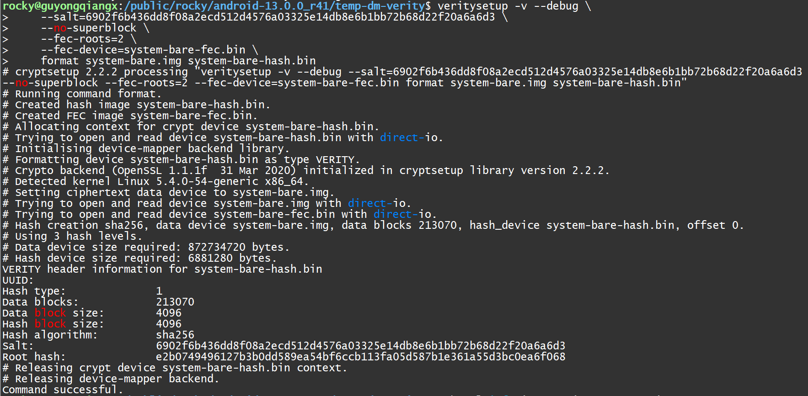

# 20250110-Android AVB 分析（十三）基于 system 分区的 dm-verity 设备验证实战

在上一篇[《Android AVB 分析（十二）嵌入式设备安全中的 dm-verity 简介》](https://blog.csdn.net/guyongqiangx/article/details/145042060)介绍 dm-verity 原理的时候，作者提供了一个 dm-verity 演示的例子。


本篇我们基于 AOSP 源码 `android-13.0.0_r41` 实际编译生成的 Google Pixel 7 (“panther”)  设备的 system 分区镜像进行 dm-verity 设备验证实战。所以，这里我们使用[《Android AVB 分析（四）system.img 到底包含了哪些数据？》](https://blog.csdn.net/guyongqiangx/article/details/144486051)中提到的 system.img


system.img 分区镜像信息：

```bash
$ avbtool info_image --image system.img 
Footer version:           1.0
Image size:               886812672 bytes
Original image size:      872734720 bytes
VBMeta offset:            886571008
VBMeta size:              832 bytes
--
Minimum libavb version:   1.0
Header Block:             256 bytes
Authentication Block:     0 bytes
Auxiliary Block:          576 bytes
Algorithm:                NONE
Rollback Index:           0
Flags:                    0
Rollback Index Location:  0
Release String:           'avbtool 1.2.0'
Descriptors:
    Hashtree descriptor:
      Version of dm-verity:  1
      Image Size:            872734720 bytes
      Tree Offset:           872734720
      Tree Size:             6881280 bytes
      Data Block Size:       4096 bytes
      Hash Block Size:       4096 bytes
      FEC num roots:         2
      FEC offset:            879616000
      FEC size:              6955008 bytes
      Hash Algorithm:        sha256
      Partition Name:        system
      Salt:                  6902f6b436dd8f08a2ecd512d4576a03325e14db8e6b1bb72b68d22f20a6a6d3
      Root Digest:           e2b0749496127b3b0dd589ea54bf6ccb113fa05d587b1e361a55d3bc0ea6f068
      Flags:                 0
    Prop: com.android.build.system.os_version -> '13'
    Prop: com.android.build.system.fingerprint -> 'Android/aosp_panther/panther:13/TQ2A.230405.003.E1/rocky12021421:userdebug/test-keys'
    Prop: com.android.build.system.security_patch -> '2023-04-05'
```

分区的主要信息如下：


> 在编译 Google Pixel 7 (“panther”)  时，system 分区镜像使用 Chain Partition 签名的方式，具体的签名信息位于 `vbmeta_system.img` 镜像中。
>
> 我们这里主要研究 dm-verity 原理，所以 system.img 中 vbmeta 数据是否签名对 dm-verity 实战验证操作没有影响。


为了对比研究 dm-verity 的功能，我们将这里带有 hash, FEC 和 vbmeta 数据的 system.img 还原:

```bash
$ ls -al
total 866048
drwxr-sr-x  2 rocky users      4096 Jan  9 23:36 .
drwxr-sr-x 32 rocky users      4096 Jan  9 23:27 ..
-rw-r--r--  1 rocky users 886812672 Jan 10 00:03 system.img
$ cp system.img system-bare.img
$ avbtool erase_footer --image system-bare.img
$ avbtool info_image --image system-bare.img
/local/public/users/rocky/android-13.0.0_r41/out/host/linux-x86/bin/avbtool: Given image does not look like a vbmeta image.
$ ls -al
total 1718340
drwxr-sr-x  2 rocky users      4096 Jan  9 23:52 .
drwxr-sr-x 32 rocky users      4096 Jan  9 23:27 ..
-rw-r--r--  1 rocky users 872734720 Jan 10 00:42 system-bare.img
-rw-r--r--  1 rocky users 886812672 Jan 10 00:03 system.img
$ 
```

从上面我们看到两个 system 分区镜像：

1. system.img

   编译后，经过 avbtool 处理好的 system.img，带有 hashtree, FEC 和 VBMeta 数据, ，大小为 886820864，约 846M

2. system-bare.img

   system.img 还原后的原始的 system 分区镜像 system-bare.img。完全的纯分区镜像，没有携带任何其他数据，大小为 872742912，约 833M


在下面的两篇文章中，我们专门分析过 system.img 镜像的 hashtree 和 FEC 数据是如何生成的：

- [《Android AVB 分析（五）哈希树到底是如何生成的？》](https://blog.csdn.net/guyongqiangx/article/details/144479669)
  - https://blog.csdn.net/guyongqiangx/article/details/144479669
- [《Android AVB 分析（六）FEC 数据到底是如何生成的？》](https://blog.csdn.net/guyongqiangx/article/details/144487615)
  - https://blog.csdn.net/guyongqiangx/article/details/144487615


简单来说，hashtree 和 FEC 数据都是按照 4096 的块大小生成的，另外:

- hashtree 使用 sha256 算法，每 4096 字节的数据生成 32 字节的哈希值
- FEC 使用 RS(255, 253) 算法编码，即在 255 个字节中，有 253 个是原始数据，有 2 个字节用于错误纠正码（冗余信息），实际上可以纠正 1 个字节的错误


## 生成 system 镜像的 hashtree 和 FEC 数据

在上一篇的示例中，我们看到作者用 veritysetup 工具的 format 命令生成了分区的 hashtree 数据：

```bash
veritysetup -v --debug format data_partition.img hash_partition.img
```


实际上，我们还可以使用 veritysetup 工具的 format 命令生成 FEC 数据。

在 Android 的 system 分区处理中，对于 hashtree 的生成还带有随机盐 salt 参数，而且对于 FEC，使用 `--roots 2`指定编码方式，以及 FEC 数据不带有 footer 信息。

所以，我们这里可以使用下面这个命令同时生成 system-bare.img 镜像的 hashtree 和 FEC 数据：

```bash
veritysetup -v --debug \
	--salt=6902f6b436dd8f08a2ecd512d4576a03325e14db8e6b1bb72b68d22f20a6a6d3 \
	--no-superblock \
	--fec-roots=2 \
	--fec-device=system-bare-fec.bin \
	format system-bare.img system-bare-hash.bin
```

参数说明：

- `-v --debug`
  - `-v` 打印尽量多的输出信息, `--debug` 输出更多的调试信息
- `--salt=6902f6......a6d3`
  - 指定计算 hashtree 是的随机盐 salt 值参数
- `--no-superblock`
  - 处理后的数据不生成 superblock 信息
- `--fec-roots=2`
  - 指定 FEC 的恢复能力，即 roots = 2
- `--fec-device=system-bare-fec.bin`
  - 指定将 FEC 数据输出到文件 `system-bare-fec.bin` 中
- `format system-bare.img system-bare-hash.bin`
  - 指定 format 命令使用的原始镜像为 system-bare.img，以及生成的 hashtree 数据存放到 `system-bare-hash.bin` 文件中

命令的执行 log 如下：

```bash
$ veritysetup -v --debug \
>     --salt=6902f6b436dd8f08a2ecd512d4576a03325e14db8e6b1bb72b68d22f20a6a6d3 \
>     --no-superblock \
>     --fec-roots=2 \
>     --fec-device=system-bare-fec.bin \
>     format system-bare.img system-bare-hash.bin
# cryptsetup 2.2.2 processing "veritysetup -v --debug --salt=6902f6b436dd8f08a2ecd512d4576a03325e14db8e6b1bb72b68d22f20a6a6d3 --no-superblock --fec-roots=2 --fec-device=system-bare-fec.bin format system-bare.img system-bare-hash.bin"
# Running command format.
# Created hash image system-bare-hash.bin.
# Created FEC image system-bare-fec.bin.
# Allocating context for crypt device system-bare-hash.bin.
# Trying to open and read device system-bare-hash.bin with direct-io.
# Initialising device-mapper backend library.
# Formatting device system-bare-hash.bin as type VERITY.
# Crypto backend (OpenSSL 1.1.1f  31 Mar 2020) initialized in cryptsetup library version 2.2.2.
# Detected kernel Linux 5.4.0-54-generic x86_64.
# Setting ciphertext data device to system-bare.img.
# Trying to open and read device system-bare.img with direct-io.
# Trying to open and read device system-bare-fec.bin with direct-io.
# Hash creation sha256, data device system-bare.img, data blocks 213070, hash_device system-bare-hash.bin, offset 0.
# Using 3 hash levels.
# Data device size required: 872734720 bytes.
# Hash device size required: 6881280 bytes.
VERITY header information for system-bare-hash.bin
UUID:            
Hash type:              1
Data blocks:            213070
Data block size:        4096
Hash block size:        4096
Hash algorithm:         sha256
Salt:                   6902f6b436dd8f08a2ecd512d4576a03325e14db8e6b1bb72b68d22f20a6a6d3
Root hash:              e2b0749496127b3b0dd589ea54bf6ccb113fa05d587b1e361a55d3bc0ea6f068
# Releasing crypt device system-bare-hash.bin context.
# Releasing device-mapper backend.
Command successful.
```



上面 log 信息的内容很丰富，值得详细查看。

重点中的重点，生成的 Root hash 和我们使用 `avbtool info_image` 看到的输出是一样的。


### 检查 hashtree 数据

为了确保一样，我们再单独计算下 system.img 中 hashtree 数据的 md5 值。

在 `avbtool info_image` 的输出中看到：

- hashtree 数据位置: `Tree Offset:           872734720`
- hashtree 数据大小: `Tree Size:             6881280 bytes`

所以 system.img 中哈希树的 md5 可以用下面的命令直接得出：

```bash
$ dd if=system.img bs=4096 skip=$((872734720/4096)) count=$((6881280/4096)) | md5sum
1680+0 records in
1680+0 records out
6881280 bytes (6.9 MB, 6.6 MiB) copied, 0.0179827 s, 383 MB/s
679a4855da89c96b65ce8d54db32fe11  -
```


然后，我们再看下单独生成的 `system-bare-hash.bin` 哈希树的 md5 值：

```bash
$ md5sum system-bare-hash.bin 
679a4855da89c96b65ce8d54db32fe11  system-bare-hash.bin
```


我们看到这里二者的 md5 值都是 679a4855da89c96b65ce8d54db32fe11，说明两种方式生成的 hash 数据是完全一样的。


### 检查 FEC 数据

为了确保一样，我们再单独计算下 system.img 中 FEC 数据的 md5 值。

在 `avbtool info_image` 的输出中看到：

- FEC 数据位置: `FEC offset:            879616000`
- FEC 数据大小: `FEC size:              6955008 bytes`

所以 system.img 中 FEC 数据的 md5 可以用下面的命令直接得出：

```bash
$ dd if=system.img bs=4096 skip=$((879616000/4096)) count=$((6955008/4096)) | md5sum
1698+0 records in
1698+0 records out
6955008 bytes (7.0 MB, 6.6 MiB) copied, 0.0189416 s, 367 MB/s
85d6a653576ba3e9093e1f44faa46489  -
```


然后，我们再看下单独生成的 `system-bare-fec.bin` FEC 数据的 md5 值：

```bash
$ md5sum system-bare-fec.bin 
85d6a653576ba3e9093e1f44faa46489  system-bare-fec.bin
```


我们看到这里二者的 md5 值都是 85d6a653576ba3e9093e1f44faa46489，说明两种方式生成的 FEC 数据是完全一样的。


重点的重点来了，我们基于:

- 原始分区镜像 `system-bare.img` ，
- 哈希树数据镜像 `system-bare-hash.bin`， 
- FEC 数据镜像 `system-bare-fec.bin` 

这 3 个部分创建出我们的想要的 dm-verity 镜像来。


为了验证 hash 检查，以及 FEC 恢复的能力，我们将做 3 个映射实验。

1. 正常的不带 FEC 的 dm-verity 映射;
2. 破坏 3 bits 后不带 FEC 的 dm-verity 映射；
3. 破坏 3 bits 后带 FEC 的 dm-verity 映射；


### 正常的不带 FEC 的 dm-verity 映射

```bash
$ sudo veritysetup -v --debug \
>     --salt=6902f6b436dd8f08a2ecd512d4576a03325e14db8e6b1bb72b68d22f20a6a6d3 \
>     --no-superblock \
>     open /dev/mapper/system system-verity /dev/mapper/system-hash e2b0749496127b3b0dd589ea54bf6ccb113fa05d587b1e361a55d3bc0ea6f068
# cryptsetup 2.2.2 processing "veritysetup -v --debug --salt=6902f6b436dd8f08a2ecd512d4576a03325e14db8e6b1bb72b68d22f20a6a6d3 --no-superblock open /dev/mapper/system system-verity /dev/mapper/system-hash e2b0749496127b3b0dd589ea54bf6ccb113fa05d587b1e361a55d3bc0ea6f068"
# Running command open.
# Allocating context for crypt device /dev/mapper/system-hash.
# Trying to open and read device /dev/mapper/system-hash with direct-io.
# Initialising device-mapper backend library.
# Setting ciphertext data device to /dev/mapper/system.
# Trying to open and read device /dev/mapper/system with direct-io.
# Formatting device /dev/mapper/system-hash as type VERITY.
# Crypto backend (OpenSSL 1.1.1f  31 Mar 2020) initialized in cryptsetup library version 2.2.2.
# Detected kernel Linux 5.4.0-54-generic x86_64.
# Setting ciphertext data device to /dev/mapper/system.
# Trying to open and read device /dev/mapper/system with direct-io.
# Activating volume system-verity by volume key.
# dm version   [ opencount flush ]   [16384] (*1)
# dm versions   [ opencount flush ]   [16384] (*1)
# Detected dm-ioctl version 4.41.0.
# Detected dm-verity version 1.5.0.
# Device-mapper backend running with UDEV support enabled.
# dm status system-verity  [ opencount noflush ]   [16384] (*1)
# Trying to activate VERITY device system-verity using hash sha256.
# Calculated device size is 1704560 sectors (RW), offset 0.
# DM-UUID is CRYPT-VERITY-system-verity
# Udev cookie 0xd4d9826 (semid 589886) created
# Udev cookie 0xd4d9826 (semid 589886) incremented to 1
# Udev cookie 0xd4d9826 (semid 589886) incremented to 2
# Udev cookie 0xd4d9826 (semid 589886) assigned to CREATE task(0) with flags DISABLE_LIBRARY_FALLBACK         (0x20)
# dm create system-verity CRYPT-VERITY-system-verity [ opencount flush ]   [16384] (*1)
# dm reload system-verity  [ opencount flush readonly securedata ]   [16384] (*1)
# dm resume system-verity  [ opencount flush readonly securedata ]   [16384] (*1)
# system-verity: Stacking NODE_ADD (253,8) 0:6 0660 [trust_udev]
# system-verity: Stacking NODE_READ_AHEAD 256 (flags=1)
# Udev cookie 0xd4d9826 (semid 589886) decremented to 1
# Udev cookie 0xd4d9826 (semid 589886) waiting for zero
# Udev cookie 0xd4d9826 (semid 589886) destroyed
# system-verity: Skipping NODE_ADD (253,8) 0:6 0660 [trust_udev]
# system-verity: Processing NODE_READ_AHEAD 256 (flags=1)
# system-verity (253:8): read ahead is 256
# system-verity: retaining kernel read ahead of 256 (requested 256)
# dm status system-verity  [ opencount noflush ]   [16384] (*1)
# Verity volume system-verity status is V.
# Releasing crypt device /dev/mapper/system-hash context.
# Releasing device-mapper backend.
Command successful.
```


```bash
$ sudo veritysetup -v \
>     --salt=6902f6b436dd8f08a2ecd512d4576a03325e14db8e6b1bb72b68d22f20a6a6d3 \
>     --no-superblock \
>     status system-verity
/dev/mapper/system-verity is active.
  type:        VERITY
  status:      verified
  hash type:   1
  data block:  4096
  hash block:  4096
  hash name:   sha256
  salt:        6902f6b436dd8f08a2ecd512d4576a03325e14db8e6b1bb72b68d22f20a6a6d3
  data device: /dev/mapper/system
  size:        1704560 sectors
  mode:        readonly
  hash device: /dev/mapper/system-hash
  hash offset: 0 sectors
Command successful.
```


我们试着验证一下：

```bash
$ sudo veritysetup -v --debug \
>     --salt=6902f6b436dd8f08a2ecd512d4576a03325e14db8e6b1bb72b68d22f20a6a6d3 \
>     --no-superblock \
>     verify /dev/mapper/system /dev/mapper/system-hash e2b0749496127b3b0dd589ea54bf6ccb113fa05d587b1e361a55d3bc0ea6f068
# cryptsetup 2.2.2 processing "veritysetup -v --debug --salt=6902f6b436dd8f08a2ecd512d4576a03325e14db8e6b1bb72b68d22f20a6a6d3 --no-superblock verify /dev/mapper/system /dev/mapper/system-hash e2b0749496127b3b0dd589ea54bf6ccb113fa05d587b1e361a55d3bc0ea6f068"
# Running command verify.
# Allocating context for crypt device /dev/mapper/system-hash.
# Trying to open and read device /dev/mapper/system-hash with direct-io.
# Initialising device-mapper backend library.
# Setting ciphertext data device to /dev/mapper/system.
# Trying to open and read device /dev/mapper/system with direct-io.
# Formatting device /dev/mapper/system-hash as type VERITY.
# Crypto backend (OpenSSL 1.1.1f  31 Mar 2020) initialized in cryptsetup library version 2.2.2.
# Detected kernel Linux 5.4.0-54-generic x86_64.
# Setting ciphertext data device to /dev/mapper/system.
# Trying to open and read device /dev/mapper/system with direct-io.
# Checking volume  by volume key.
# Trying to activate VERITY device [none] using hash sha256.
# Verification of data in userspace required.
# Hash verification sha256, data device /dev/mapper/system, data blocks 213070, hash_device /dev/mapper/system-hash, offset 0.
# Using 3 hash levels.
# Data device size required: 872734720 bytes.
# Hash device size required: 6881280 bytes.
# Verification of data area succeeded.
# Verification of root hash succeeded.
# Releasing crypt device /dev/mapper/system-hash context.
# Releasing device-mapper backend.
Command successful.
```


试着挂载一下：

```bash
$ sudo mount -t ext4 -o ro /dev/mapper/system-verity system
$ cd system
$ ls -lh
total 116K
drwxr-xr-x.  2 root      root   4.0K Jan  1  2009 acct
drwxr-xr-x.  2 root      root   4.0K Jan  1  2009 apex
lrw-r--r--.  1 root      root     11 Jan  1  2009 bin -> /system/bin
lrw-r--r--.  1 root      root     50 Jan  1  2009 bugreports -> /data/user_de/0/com.android.shell/files/bugreports
lrw-r--r--.  1 root      root     11 Jan  1  2009 cache -> /data/cache
dr-xr-xr-x.  2 root      root   4.0K Jan  1  2009 config
lrw-r--r--.  1 root      root     17 Jan  1  2009 d -> /sys/kernel/debug
drwxrwx--x.  2 rndlegacy ot-ana 4.0K Jan  1  2009 data
drwxr-xr-x.  2 root      root   4.0K Jan  1  2009 data_mirror
drwxr-xr-x.  2 root      root   4.0K Jan  1  2009 debug_ramdisk
drwxr-xr-x.  2 root      root   4.0K Jan  1  2009 dev
lrw-r--r--.  1 root      root     11 Jan  1  2009 etc -> /system/etc
lrwxr-x---.  1 root        2000   16 Jan  1  2009 init -> /system/bin/init
-rwxr-x---.  1 root        2000  463 Jan  1  2009 init.environ.rc
drwxr-xr-x.  2 root      root   4.0K Jan  1  2009 linkerconfig
drwx------.  2 root      root    16K Jan  1  2009 lost+found
drwxr-xr-x.  2 root      root   4.0K Jan  1  2009 metadata
drwxr-xr-x.  2 root      ot-ana 4.0K Jan  1  2009 mnt
drwxr-xr-x.  2 root      root   4.0K Jan  1  2009 odm
drwxr-xr-x.  2 root      root   4.0K Jan  1  2009 odm_dlkm
drwxr-xr-x.  2 root      root   4.0K Jan  1  2009 oem
drwxr-xr-x.  2 root      root   4.0K Jan  1  2009 postinstall
drwxr-xr-x.  2 root      root   4.0K Jan  1  2009 proc
drwxr-xr-x.  2 root      root   4.0K Jan  1  2009 product
lrw-r--r--.  1 root      root     21 Jan  1  2009 sdcard -> /storage/self/primary
drwxr-xr-x.  2 root      root   4.0K Jan  1  2009 second_stage_resources
drwxr-x--x.  2 root      eutra  4.0K Jan  1  2009 storage
drwxr-xr-x.  2 root      root   4.0K Jan  1  2009 sys
drwxr-xr-x. 13 root      root   4.0K Jan  1  2009 system
drwxr-xr-x.  2 root      root   4.0K Jan  1  2009 system_dlkm
drwxr-xr-x.  2 root      root   4.0K Jan  1  2009 system_ext
drwxr-xr-x.  2 root        2000 4.0K Jan  1  2009 vendor
drwxr-xr-x.  2 root      root   4.0K Jan  1  2009 vendor_dlkm
```

在这里我们成功地以 dm-verity 的方式挂载了 system-bare.img，并成功进入了 /system 目录，能够看到该目录下的所有文件。

为了下一步的实验，我们查看一下 `init.environ.rc` 文件的相关信息：

```bash
$ ls -al init.environ.rc 
-rwxr-x---. 1 root 2000 463 Jan  1  2009 init.environ.rc
rocky@guyongqiangx:/public/rocky/android-13.0.0_r41/temp-dm-verity/system$ sudo cat init.environ.rc 
# set up the global environment
on early-init
    export ANDROID_BOOTLOGO 1
    export ANDROID_ROOT /system
    export ANDROID_ASSETS /system/app
    export ANDROID_DATA /data
    export ANDROID_STORAGE /storage
    export ANDROID_ART_ROOT /apex/com.android.art
    export ANDROID_I18N_ROOT /apex/com.android.i18n
    export ANDROID_TZDATA_ROOT /apex/com.android.tzdata
    export EXTERNAL_STORAGE /sdcard
    export ASEC_MOUNTPOINT /mnt/asec
    
    
    
    
$ sudo hexdump -Cv init.environ.rc 
00000000  23 20 73 65 74 20 75 70  20 74 68 65 20 67 6c 6f  |# set up the glo|
00000010  62 61 6c 20 65 6e 76 69  72 6f 6e 6d 65 6e 74 0a  |bal environment.|
00000020  6f 6e 20 65 61 72 6c 79  2d 69 6e 69 74 0a 20 20  |on early-init.  |
00000030  20 20 65 78 70 6f 72 74  20 41 4e 44 52 4f 49 44  |  export ANDROID|
00000040  5f 42 4f 4f 54 4c 4f 47  4f 20 31 0a 20 20 20 20  |_BOOTLOGO 1.    |
00000050  65 78 70 6f 72 74 20 41  4e 44 52 4f 49 44 5f 52  |export ANDROID_R|
00000060  4f 4f 54 20 2f 73 79 73  74 65 6d 0a 20 20 20 20  |OOT /system.    |
00000070  65 78 70 6f 72 74 20 41  4e 44 52 4f 49 44 5f 41  |export ANDROID_A|
00000080  53 53 45 54 53 20 2f 73  79 73 74 65 6d 2f 61 70  |SSETS /system/ap|
00000090  70 0a 20 20 20 20 65 78  70 6f 72 74 20 41 4e 44  |p.    export AND|
000000a0  52 4f 49 44 5f 44 41 54  41 20 2f 64 61 74 61 0a  |ROID_DATA /data.|
000000b0  20 20 20 20 65 78 70 6f  72 74 20 41 4e 44 52 4f  |    export ANDRO|
000000c0  49 44 5f 53 54 4f 52 41  47 45 20 2f 73 74 6f 72  |ID_STORAGE /stor|
000000d0  61 67 65 0a 20 20 20 20  65 78 70 6f 72 74 20 41  |age.    export A|
000000e0  4e 44 52 4f 49 44 5f 41  52 54 5f 52 4f 4f 54 20  |NDROID_ART_ROOT |
000000f0  2f 61 70 65 78 2f 63 6f  6d 2e 61 6e 64 72 6f 69  |/apex/com.androi|
00000100  64 2e 61 72 74 0a 20 20  20 20 65 78 70 6f 72 74  |d.art.    export|
00000110  20 41 4e 44 52 4f 49 44  5f 49 31 38 4e 5f 52 4f  | ANDROID_I18N_RO|
00000120  4f 54 20 2f 61 70 65 78  2f 63 6f 6d 2e 61 6e 64  |OT /apex/com.and|
00000130  72 6f 69 64 2e 69 31 38  6e 0a 20 20 20 20 65 78  |roid.i18n.    ex|
00000140  70 6f 72 74 20 41 4e 44  52 4f 49 44 5f 54 5a 44  |port ANDROID_TZD|
00000150  41 54 41 5f 52 4f 4f 54  20 2f 61 70 65 78 2f 63  |ATA_ROOT /apex/c|
00000160  6f 6d 2e 61 6e 64 72 6f  69 64 2e 74 7a 64 61 74  |om.android.tzdat|
00000170  61 0a 20 20 20 20 65 78  70 6f 72 74 20 45 58 54  |a.    export EXT|
00000180  45 52 4e 41 4c 5f 53 54  4f 52 41 47 45 20 2f 73  |ERNAL_STORAGE /s|
00000190  64 63 61 72 64 0a 20 20  20 20 65 78 70 6f 72 74  |dcard.    export|
000001a0  20 41 53 45 43 5f 4d 4f  55 4e 54 50 4f 49 4e 54  | ASEC_MOUNTPOINT|
000001b0  20 2f 6d 6e 74 2f 61 73  65 63 0a 20 20 20 20 0a  | /mnt/asec.    .|
000001c0  20 20 20 20 0a 20 20 20  20 0a 20 20 20 20 0a     |    .    .    .|
000001cf
$ sudo md5sum init.environ.rc 
7ba9edb94ea97da98433bd12254800d6  init.environ.rc
$ sudo /public/ygu/temp/fiemap_query init.environ.rc 
File: init.environ.rc
Total extents: 1

Extent Details:
Logical      Physical     Length       Flags
----------------------------------------------
0x0          0x2d000      0x1000       LAST 
$ 
```

这里我们对 `init.environ.rc` 文件做了以下几个操作：

1. 使用 `ls` 命令查看文件大小
2. 使用 `cat` 命令查看了文件的文本内容
3. 使用 `hexdump` 命令查看了文件的十六进制内容
4. 使用 `md5sum` 命令查看了文件的 md5 值
5. 使用强哥自己的 `fiemap_query` 工具查看文件的布局信息


通过 `fiemap_query` 看到，`init.environ.rc` 文件占用 1 个 extent，这个 extent 的起始地址位于 0x2d000，大小为 0x1000 (4K)。

有了这个 extent 的起始位置信息(0x2d000)，以及文件的长度(463)，我们就知道 `init.environ.rc` 位于镜像 system.img 的 0x2d000~0x2d000+463 的位置了。

下面我们通过计算 system-bare.img 中，区域 0x2d000~0x2d000+463 的 md5 值来进行确认：

```bash
$ hexdump -Cv -s $((0x2d000)) -n 463 system-bare.img 
0002d000  23 20 73 65 74 20 75 70  20 74 68 65 20 67 6c 6f  |# set up the glo|
0002d010  62 61 6c 20 65 6e 76 69  72 6f 6e 6d 65 6e 74 0a  |bal environment.|
0002d020  6f 6e 20 65 61 72 6c 79  2d 69 6e 69 74 0a 20 20  |on early-init.  |
0002d030  20 20 65 78 70 6f 72 74  20 41 4e 44 52 4f 49 44  |  export ANDROID|
0002d040  5f 42 4f 4f 54 4c 4f 47  4f 20 31 0a 20 20 20 20  |_BOOTLOGO 1.    |
0002d050  65 78 70 6f 72 74 20 41  4e 44 52 4f 49 44 5f 52  |export ANDROID_R|
0002d060  4f 4f 54 20 2f 73 79 73  74 65 6d 0a 20 20 20 20  |OOT /system.    |
0002d070  65 78 70 6f 72 74 20 41  4e 44 52 4f 49 44 5f 41  |export ANDROID_A|
0002d080  53 53 45 54 53 20 2f 73  79 73 74 65 6d 2f 61 70  |SSETS /system/ap|
0002d090  70 0a 20 20 20 20 65 78  70 6f 72 74 20 41 4e 44  |p.    export AND|
0002d0a0  52 4f 49 44 5f 44 41 54  41 20 2f 64 61 74 61 0a  |ROID_DATA /data.|
0002d0b0  20 20 20 20 65 78 70 6f  72 74 20 41 4e 44 52 4f  |    export ANDRO|
0002d0c0  49 44 5f 53 54 4f 52 41  47 45 20 2f 73 74 6f 72  |ID_STORAGE /stor|
0002d0d0  61 67 65 0a 20 20 20 20  65 78 70 6f 72 74 20 41  |age.    export A|
0002d0e0  4e 44 52 4f 49 44 5f 41  52 54 5f 52 4f 4f 54 20  |NDROID_ART_ROOT |
0002d0f0  2f 61 70 65 78 2f 63 6f  6d 2e 61 6e 64 72 6f 69  |/apex/com.androi|
0002d100  64 2e 61 72 74 0a 20 20  20 20 65 78 70 6f 72 74  |d.art.    export|
0002d110  20 41 4e 44 52 4f 49 44  5f 49 31 38 4e 5f 52 4f  | ANDROID_I18N_RO|
0002d120  4f 54 20 2f 61 70 65 78  2f 63 6f 6d 2e 61 6e 64  |OT /apex/com.and|
0002d130  72 6f 69 64 2e 69 31 38  6e 0a 20 20 20 20 65 78  |roid.i18n.    ex|
0002d140  70 6f 72 74 20 41 4e 44  52 4f 49 44 5f 54 5a 44  |port ANDROID_TZD|
0002d150  41 54 41 5f 52 4f 4f 54  20 2f 61 70 65 78 2f 63  |ATA_ROOT /apex/c|
0002d160  6f 6d 2e 61 6e 64 72 6f  69 64 2e 74 7a 64 61 74  |om.android.tzdat|
0002d170  61 0a 20 20 20 20 65 78  70 6f 72 74 20 45 58 54  |a.    export EXT|
0002d180  45 52 4e 41 4c 5f 53 54  4f 52 41 47 45 20 2f 73  |ERNAL_STORAGE /s|
0002d190  64 63 61 72 64 0a 20 20  20 20 65 78 70 6f 72 74  |dcard.    export|
0002d1a0  20 41 53 45 43 5f 4d 4f  55 4e 54 50 4f 49 4e 54  | ASEC_MOUNTPOINT|
0002d1b0  20 2f 6d 6e 74 2f 61 73  65 63 0a 20 20 20 20 0a  | /mnt/asec.    .|
0002d1c0  20 20 20 20 0a 20 20 20  20 0a 20 20 20 20 0a     |    .    .    .|
0002d1cf
$ dd if=system-bare.img bs=1 skip=$((0x2d000)) count=463 | md5sum
463+0 records in
463+0 records out
7ba9edb94ea97da98433bd12254800d6  -
463 bytes copied, 0.0020232 s, 229 kB/s
```


显然，我们看到，不管是 0x2d000~0x2d000+463 区域的 hexdump 数据，还是 md5sum 计算的结果，都明确无误的确认了这个区域就是分区挂载后的 `init.environ.rc` 文件。


如果你希望卸载挂载，关闭 `system-verity` 设备，可以执行以下操作。

```bash
$ sudo umount system
$ sudo veritysetup close system-verity
```


### 破坏 3 bits 后不带 FEC 的 dm-verity 映射

现在，我手动修改 1 bit 的 system-bare.img 内容，修改后，system-bare.img 计算的哈希和原始内容计算的哈希就不匹配了，根据 dm-verity 的特性，当访问被修改的数据时，由于 hash 匹配不上，会报错。


那修改哪里的数据比较好呢？我们试着修改上一节中的文件 `init.envrion.rc`。

这里我们将第一个位置的 '#'(0x23) 改为 '$'(0x24)，通过查看 0x23 和 0x24 的二进制模式，我们可以看到这里改变了3个 bit 位：

```bash
0x23: 0010 0011
0x24: 0010 0100
```

修改前后的对比内容如下，这里 0x0002d000 位置的内容从 '#' 字符修改成了 '$'：

```bash
$ cp system-bare.img system-bare-err3b.img
$ xxd -g 1 -c 16 -s $((0x2d000)) -l 64 system-bare-err3b.img 
0002d000: 23 20 73 65 74 20 75 70 20 74 68 65 20 67 6c 6f  # set up the glo
0002d010: 62 61 6c 20 65 6e 76 69 72 6f 6e 6d 65 6e 74 0a  bal environment.
0002d020: 6f 6e 20 65 61 72 6c 79 2d 69 6e 69 74 0a 20 20  on early-init.  
0002d030: 20 20 65 78 70 6f 72 74 20 41 4e 44 52 4f 49 44    export ANDROID
$ echo -n "0002d000: 24 20" | xxd -r - system-bare-err3b.img 
$ xxd -g 1 -c 16 -s $((0x2d000)) -l 64 system-bare-err3b.img 
0002d000: 24 20 73 65 74 20 75 70 20 74 68 65 20 67 6c 6f  $ set up the glo
0002d010: 62 61 6c 20 65 6e 76 69 72 6f 6e 6d 65 6e 74 0a  bal environment.
0002d020: 6f 6e 20 65 61 72 6c 79 2d 69 6e 69 74 0a 20 20  on early-init.  
0002d030: 20 20 65 78 70 6f 72 74 20 41 4e 44 52 4f 49 44    export ANDROID
```


> 关于如何使用 xxd 工具查看和修改二进制文件，请参考强哥的另外一篇文章：
>
> [《别找了，这个命令让你在字符串和十六进制间自由转换》](https://blog.csdn.net/guyongqiangx/article/details/118097756)
>
> - https://blog.csdn.net/guyongqiangx/article/details/118097756


好了，现在开始我们的验证：

```bash
$ sudo losetup -f system-bare-err3b.img --show
/dev/loop11
$ echo "0 $(sudo blockdev --getsz /dev/loop11) linear /dev/loop11 0" | sudo dmsetup create system-err3b
$ ls -lh /dev/mapper/
total 0
crw------- 1 root root 10, 236 Nov 27 18:28 control
lrwxrwxrwx 1 root root       7 Jan 10 14:10 system -> ../dm-5
lrwxrwxrwx 1 root root       7 Jan 10 14:50 system-err3b -> ../dm-9
lrwxrwxrwx 1 root root       7 Jan 10 12:52 system-fec -> ../dm-7
lrwxrwxrwx 1 root root       7 Jan 10 14:10 system-hash -> ../dm-6
lrwxrwxrwx 1 root root       7 Jan 10 14:10 system-verity -> ../dm-8
...
```


这里将修改后的设备设置为 `system-err3b-verity`。

```bash
$ sudo veritysetup -v \
>     --salt=6902f6b436dd8f08a2ecd512d4576a03325e14db8e6b1bb72b68d22f20a6a6d3 \
>     --no-superblock \
>     open /dev/mapper/system-err3b system-err3b-verity /dev/mapper/system-hash e2b0749496127b3b0dd589ea54bf6ccb113fa05d587b1e361a55d3bc0ea6f068
Verity device detected corruption after activation.
Command successful.
```


这里已经输出错误信息提示检测到错误了：

```bash
Verity device detected corruption after activation.
```


验证一下数据设备 `/dev/mapper/system-err3b` 的 hash 值：

```
$ sudo veritysetup -v \
>     --salt=6902f6b436dd8f08a2ecd512d4576a03325e14db8e6b1bb72b68d22f20a6a6d3 \
>     --no-superblock \
>     verify /dev/mapper/system-err3b /dev/mapper/system-hash e2b0749496127b3b0dd589ea54bf6ccb113fa05d587b1e361a55d3bc0ea6f068
Verification failed at position 184320.
Verification of data area failed.
Command failed with code -2 (no permission or bad passphrase).
```

可以看到，这里已经提示在 184320 (0x2d000) 的位置验证失败了：

```bash
Verification failed at position 184320.
```


由于我们前面修改的内容是 `init.envrion.rc` 文件的第 1 个字节，具体数据文件的修改并不会影响到文件系统的挂载，所以我们这里试着挂载一下：

```bash
$ mkdir system-err3b
$ sudo mount -t ext4 -o ro /dev/mapper/system-err3b-verity system-err3b
$ cd system-err3b
system-err3b$ ls -al init.environ.rc 
-rwxr-x---. 1 root 2000 463 Jan  1  2009 init.environ.rc
system-err3b$ sudo /public/ygu/temp/fiemap_query init.environ.rc 
File: init.environ.rc
Total extents: 1

Extent Details:
Logical      Physical     Length       Flags
----------------------------------------------
0x0          0x2d000      0x1000       LAST 
system-err3b$ sudo cat init.environ.rc 
cat: init.environ.rc: Input/output error
system-err3b$ sudo hexdump -Cv init.environ.rc 
hexdump: init.environ.rc: Input/output error
```

我们可以看到，我们使用 `ls` 命令查看文件的大小或使用 `fiemap_query` 查看文件布局都没有问题，因为这个访问的是文件 `init.environ.rc` 的 inode 信息。

但是，当我们使用 `cat` 或 `hexdump` 尝试访问文件的内容时，提示 `Input/output error`

查看 `dmesg` 信息可以看到更多输出:

```bash
system-err3b$ dmesg | tail -100
[9255062.453222] device-mapper: verity: sha256 using implementation "sha256-generic"
[9255126.155965] device-mapper: verity: sha256 using implementation "sha256-generic"
[9255254.489430] EXT4-fs (dm-8): mounted filesystem without journal. Opts: (null)
[9257694.684624] device-mapper: verity: sha256 using implementation "sha256-generic"
[9257694.771419] verity_handle_err: 90 callbacks suppressed
[9257694.771420] device-mapper: verity: 253:9: data block 45 is corrupted
[9257694.772382] device-mapper: verity: 253:9: data block 45 is corrupted
[9257694.772800] buffer_io_error: 192 callbacks suppressed
[9257694.772801] Buffer I/O error on dev dm-10, logical block 45, async page read
[9257694.772905] device-mapper: verity: 253:9: data block 45 is corrupted
[9257694.772940] Buffer I/O error on dev dm-10, logical block 45, async page read
[9257694.802617] device-mapper: verity: 253:9: data block 45 is corrupted
[9257694.803766] device-mapper: verity: 253:9: data block 45 is corrupted
[9257694.804327] Buffer I/O error on dev dm-10, logical block 45, async page read
[9257694.804473] device-mapper: verity: 253:9: data block 45 is corrupted
[9257694.804519] Buffer I/O error on dev dm-10, logical block 45, async page read
[9257694.834544] device-mapper: verity: 253:9: data block 45 is corrupted
[9257694.835782] device-mapper: verity: 253:9: data block 45 is corrupted
[9257694.836339] Buffer I/O error on dev dm-10, logical block 45, async page read
[9257694.836476] device-mapper: verity: 253:9: data block 45 is corrupted
[9257694.836508] Buffer I/O error on dev dm-10, logical block 45, async page read
[9257694.868029] device-mapper: verity: 253:9: data block 45 is corrupted
[9257694.869379] Buffer I/O error on dev dm-10, logical block 45, async page read
[9257694.869721] Buffer I/O error on dev dm-10, logical block 45, async page read
[9257694.900878] Buffer I/O error on dev dm-10, logical block 45, async page read
[9257694.901084] Buffer I/O error on dev dm-10, logical block 45, async page read
[9257695.815017] device-mapper: verity: 253:9: reached maximum errors
```

这里提示：

```bash
Buffer I/O error on dev dm-10, logical block 45
```

对于 block 45，其起始位置就是: 45 x 4096 = 184320 = 0x2d000，也就是我们刚好修改的位置。


由于我们没有使用 FEC 进行恢复，所以这里一旦数据被修改了，就再也无法挽回了。


### 破坏 3 bits 后带 FEC 的 dm-verity 映射

为了验证 FEC 的纠错功能，现在我们再次使用修改后的镜像生成 dm-verity 设备进行验证。


```bash
$ cp system-bare-err3b.img system-bare-err3b-fec.img 
$ sudo losetup -f system-bare-err3b-fec.img --show
/dev/loop12
$ echo "0 $(sudo blockdev --getsz /dev/loop12) linear /dev/loop12 0" | sudo dmsetup create system-err3b-fec
```

