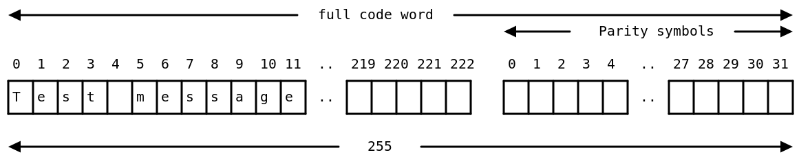
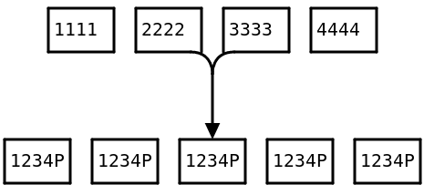
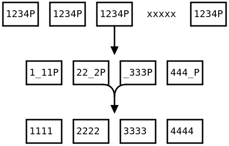

# 20250223-Android AVB 分析（十七）程序员的里德所罗门编码实战

上一篇[《Android AVB 分析（十六）5个例子理解 FEC(Reed-Solomon) 的工作原理》]()中解释了 FEC 以及 RS(里德所罗门编码)的原理，并基于 Python 的 reedsolo 库提供了 5 个 RS 编码和解码的例子，分别是：

- RS(255, 223) 编码实验
- RS(255, 253) 编码实验
- RS(255, 253) 纠错 1 字节成功
- RS(255, 253) 纠错 2 字节失败
- RS(255, 253) 纠错 2 字节成功

我相信如果您阅读了这篇文章，并亲自去做了这几个实验，那一定会对 RS 编码有一个比较深入的了解。

也可能你还希望有一些补充，所以我个人觉得以程序员实践的角度为出发点的本篇同样可以让你有些收获。

总体上，我的那篇是基于 Python 的 reedsolo 库进行实战，而本篇是基于 linux 下的工具 rscmd 进行实战。


特别说明的是，本篇非本人原创，我只是将原始的英文翻译成中文供大家参考。

原文名为 "Practical Reed-Solomon for Programmers"，我在这里将标题翻译为"程序员的里德所罗门编码实战"，以下是翻译后的内容，对原文感兴趣的朋友，强烈建议去看看。

十分感谢原文作者 Bert Hubert 的付出~


# 程序员的里德所罗门编码实战

> 日期：2021 年 6 月 13 日
>
> 作者：Bert Hubert
>
> 来源：https://berthub.eu/articles/posts/reed-solomon-for-programmers/

最近我正在做一些解码新伽利略高精度服务数据的工作。简而言之，这项新服务将允许伽利略（“欧洲 GPS”）用户实现分米级精度，这很好。这种“HAS”数据通过充分利用里德-所罗门编码进行高度冗余传输。


为了处理这些数据，我试图了解更多关于里德-所罗门（Reed-Solomon）的知识，我发现几乎所有解释对我来说都毫无用处——大量的高级数学，但没有指导如何在实际中应用 R-S。事实上，很多数学密集型的页面最终被发现对实际细节描述错误。


里德-所罗门编码背后的数学确实非常漂亮，我理解为什么许多解释都是从向用户介绍可爱的伽罗瓦域开始的。本页将专注于您真正需要了解的内容。


本文不会让你成为 Reed-Solomon 的专家。然而，它将使你能够理解和使用你工作中遇到的任何 R-S 代码。此外，你将了解 R-S 能做什么，不能做什么，以及它与其他纠错系统之间的关系。最后，有了这种理解，那些数学性较强的解释可能变得更加容易理解。

> 我想感谢 Phil Karn，KA9Q(http://www.ka9q.net/) 为我指出各种有趣的文档并澄清了我的一些误解。此外，这个页面使用了基于 R. Morelos-Zaragoza (https://twitter.com/rhmza)早期工作的 fec 库(http://www.ka9q.net/code/fec/)。这是好东西（也是 [Linux 内核的一部分](https://www.kernel.org/doc/html/v4.15/core-api/librs.html)）。

## 里德所罗门编码实践


简而言之，Reed-Solomon 是一种保护消息免受损坏或部分到达的酷方法。您可以选择向消息中添加 t 检验符号。


这些 t 校验符号允许您：

- 恢复未知位置 t/2 损坏的符号
- 恢复已知位置上的损坏/缺失符号
- 检测到消息已损坏（除非有超过 t 个损坏）


一个符号可以是 8 位长，等于一个字节，但这并不一定如此。

> 不仅这是相当好的错误容错能力，而且可以证明它不会比这更好（至少，不是基于每个符号）。


您可以随意选择 t，这意味着您可以选择您想要的保护级别。


您无法随意选择的结果保护块的长度：这始终是 255 字节（当使用字节大小的符号时）。更普遍地，长度是 2s−12*s*−1 ，其中 s*s* 是符号大小（以位为单位）。

> 请注意，对于 7 位符号，块大小将是 127 个符号，总计 889 位，相当于大约 111 字节。


增加更多的校验符号，你的消息在块中的空间就越少。



(255,223)


非常常见的 R-S 配置通常描述为“(255,223)”。这意味着块大小 N 为 255，这意味着符号大小为 8 位。第二个数字表示这些符号中有 223（K）是有效载荷，而 255-223=32（t）字节是校验符号。


此配置可以从 255 字节大小的块中的任意 16 个损坏的字节中恢复。这些损坏可以出现在消息本身或奇偶校验符号中，影响没有区别。


作为附加属性，如果您能告诉解码器哪些符号已损坏，您可以从 32 个“擦除”中恢复。这可以非常有帮助来处理数据包丢失。


如果未知位置存在 16 到 32 处损坏，R-S 至少会告诉你关于它们的信息。如果更多数据被损坏，消息可能会再次变为“有效”。


这意味着 R-S 操作可能导致以下结果：

1. 消息正确到达
2. 消息已从错误/缺失数据中恢复
3. 消息正确识别为损坏，无法恢复
4. 如此多的比特被损坏，我们意外地将其消息视为正确/恢复


因为无法区分结果 4 与结果 1 和 2，R-S 不能替代加密完整性函数！

## 参数

它通常会被提及为“(255,223)”里德-所罗门，但这种描述是极其不完整的。请注意，如果(255,223)是您获得的规范，这还不足以实现互操作性。换句话说，您需要了解更多。


以下是指定 Reed-Solomon 配置所需的全套参数：

- 符号大小（位，通常为 8 位）
- 奇偶校验符号数量（t 或“根的数量”）
- （填充，稍后详述）
- 扩展伽罗瓦域生成多项式系数
- 原始元素在生成里德-所罗门码生成多项式所用的伽罗瓦域中
- 第一个 Reed-Solomon 码生成多项式的连续根

前三个项目可由“(255,223)”推导出，其余的则仍需挑选。


如果您必须与现有标准进行互操作，您必须从规范中提取这些参数。这些可能被很好地隐藏，或者它们可能使用不同的词汇来描述相同的事物。


如果您想为自己选择一个配置，您几乎找不到在线指导，或者更糟糕的是，找到的是错误建议。


以下是您需要了解的内容。

对于 8 位符号，你可以使用两个多项式：

- 1+x2+x3+x4+x81+*x*2+*x*3+*x*4+*x*8 (famously [used by the NASA Voyager missions](https://trs.jpl.nasa.gov/bitstream/handle/2014/34531/94-0881.pdf?sequence=1))
  1+x2+x3+x4+x81+*x*2+*x*3+*x*4+*x*8 （因被 NASA 旅行者号任务使用而闻名）
- 1+x+x2+x7+x81+*x*+*x*2+*x*7+*x*8


对于“原始元素”(primitive element)，您可以选取小于 255 的任何数字，只要它不能被 3、5 或 17 整除。这与在 8 位 R-S 中使用的伽罗瓦域的复杂性有关。在实践中，人们经常选择 11，但您也可以使用 7、8、13、14、16 或 19 等数字。我进行了一些基准测试，8、11 或 14 似乎都是最快的。如果您使用非 8 位符号大小，您必须使用其他数字（以及您可以在[这里找到的其他多项式](https://core.ac.uk/download/pdf/16697418.pdf)）。


对于“第一个连续根”，据我所知，你可以选择任何小于 255 的数字。由于某种原因，人们有时会选择 121，我不知道为什么。也许是因为这是旅行者号所做的事情？无论如何，似乎对性能没有任何影响。


总结来说，您必须选择相当多的参数，但只要您选择上述建议中的一个值，就应该没问题。

## 一些示例

为了了解其工作原理，我基于 Phil Karn、KA9Q 和 Robert H. Morelos-Zaragoza 的优秀 fec 库编写了一个小工具。您可以从这里下载预编译的 Linux 二进制文件，或从 GitHub 获取源代码。


> 请注意，此工具会静默地填充您的消息以保持正确的长度，并在输出中隐藏此操作。请记住，R-S 在定义的块大小上操作 - 您可能需要自己包含长度字段！


一个使用 8 字节奇偶校验的示例：

```bash
$ ./rscmd --nroots 8 "This is a test message" 
nroots: 8
prim: 11
fcr: 121
poly: 1 + x + x^2 + x^7 + x^8
polyval: 0x187
(N,K) = (255,247)
The 8 parity bytes for "This is a test message": 7642b8e385fcf392
```


偶校验以 16 进制形式发出。


所有这些设置都可以随意更改（查看 `--help` ）。现在让我们看看解码是否正常。请注意，消息已被损坏：

```bash
$ ./rscmd --nroots 8 "This is a FAKE message" 7642b8e385fcf392
Fixed 4 corruptions in positions: 10 11 12 13
Recovered: This is a test message
```


这里我们损坏了 4 个字节，这是可以使用 8 个校验字节纠正的最大数量。而且成功了！如果我们再损坏一个位置，Reed-Solomon 编码可以保证检测到这一点，总共最多可以纠正 8 个损坏：

```bash
$ ./rscmd --nroots 8 "xHIS is a FAKE message" 7642b8e385fcf392
Fatal error: Could not correct message
```


然而，如果我们告诉解码器它们的位置，Reed-Solomon 可以纠正所有 8 个错误：

```bash
$ ./rscmd --nroots 8 "xHIS is a FAKE message" -e 0 -e 1 -e 2 -e 3 -e 10 -e 11 -e 12 -e 13 7642b8e385fcf392
Informing decoder about 8 erasures:  0 1 2 3 10 11 12 13
Fixed 8 corruptions in positions: 0 1 2 3 10 11 12 13
Recovered: This is a test message
```


请注意，您还可以损坏奇偶校验字节，它仍然可以工作：

```
#                          vv                              vvvv                          
$ ./rscmd --nroots 8 "This IS a test message"  7642b8e385fc0000
Fixed 4 corruptions in positions: 5 6 253 254
Recovered: This is a test message
```


`rscmd` 允许您配置所有 Reed-Solomon 参数，包括生成多项式。

## 使用 Reed-Solomon 编码实践

如所述，只要我们使用 8 位符号，总码字长度始终为 255 字节。


根据您的需求，您可能需要更多或更少的保护。但请注意，计算机硬件很少会损坏单个字节（一旦它们进入您的编程语言，那就是）。更常见的情况是整个扇区、磁盘或内存银行突然消失。


然而，您的 RAM 损坏单个数据位是非常可能的。此外，TCP 和以太网的校验和足够弱，以至于损坏可以未被发现地通过。


然而，这种情况非常罕见，您最好依靠密码学来检测此类数据完整性问题并重新传输整个数据。在此领域，R-S 不值得这么做。


> 与可能值得注意的例外 ZFS 不同，它在最初推出时在服务器和驱动器中发现了大量损坏。


一个原因是你看不到很多损坏的字节，因为许多传输和存储技术内部已经使用了 R-S 或类似 R-S 的算法，而这一点并没有暴露给你。


程序员遇到的一个更常见的问题是数据完全消失。这种情况经常发生——磁盘经常故障，即使是 SSD，可能更频繁。此外，网络经常掉包。

## 擦除编码(Erasure coding)

例如，假设我们有一个需要提高抗丢包能力的音频流。假设我们想要增加对 20%丢包的保护。


为此，我们可以取 4 个原始数据包，为每个数据包添加 25%的校验位，然后将这 4 个原始数据包分散到 5 个新的数据包中，如下所示：




请注意，我们还需要为每个数据包添加一个序列号。这允许接收者精确地检测出哪些数据包缺失。


如果没有数据丢失，接收器会等待所有 5 个数据包到达，然后撤销扩散。在这种情况下，运行里德-所罗门解码器只会检测到任何（非常罕见的）单个损坏的字节。


但如果第四个数据包丢失，情况将如下所示：




每个原始的 4 个数据包现在都有一个 25%的空洞！为了恢复，R-S 解码器需要确切知道哪些消息部分丢失了。幸运的是，我们知道这一点，因为我们知道分布方案，也知道哪个数据包丢失了。


据此，R-S 能够完美地重建四个原始数据包，并且我们的音频流没有中断。


以上是使用 R-S 来获得对大量数据丢失的抵抗力的一个非常简单的例子。然而请注意，在制定此类方案时投入大量思考是值得的。数据包丢失将是什么样子？它会不会是突发性的？可接受的延迟是多少？一个非常高效的设置可能会缓冲 30 秒的数据，例如对于现场采访来说这是无用的。


上述方案也适用于冗余文件和数据存储。许多 RAID6 变体或多或少使用 R-S，例如。

## 关于填充的一些话

255 字节可能对于您的消息来说太大。处理这个问题的一种方法是一致同意使用“填充”。通常实现方式是，如果您“填充”100 字节，这意味着 255 个代码块的前 100 字节被认为是零，并且不会传输。


这将一个(255,223)代码转换为(155,123)。使用填充可以节省大量带宽，同时不会“浪费”校验位。即使你知道你的填充永远不会损坏，R-S 仍然可以正常工作。


它很有诱惑力，想要聪明地传输一个长度字段，以便你可以动态地调整代码字的大小。如果你这么做，要意识到你还得单独将 R-S 添加到你的长度字段中，以确保安全性！否则，长度字段中的损坏可能会让你陷入困境。


例如，在上述 GitHub 页面上，你可以找到一个名为 `ipprotect` 的小工具，它使用一个高度填充的 8 位（N，K）=（6，4）码，向 IP 地址添加两个额外的八位字节，以提供 2 个 R-S 保护符号。

## 一些零碎的东西


如《错误控制码的理论与实践》中所述，里德-所罗门（Reed-Solomon）确实是“完美的”，但前提是你的问题恰好适合 R-S 所能处理的范围。R-S 的块大小是一个硬参数，可能不是你所需要的。


此外，虽然 R-S 可以在最大理论符号量中修复和检测损坏，但你可能不是从符号的角度思考，而是更多地从位数翻转的数量来考虑。


如果您的消息中有 x 位被翻转，这将完全损坏 x 个符号。其他纠错码可能更好地处理这种分散的损害。R-S 纠错在修复错误数据突发方面表现卓越。


过去几十年，关于纠错码的了解已经很多。现代通信协议使用诸如 Turbo 码、低密度奇偶校验码或更新的极化码等技术。这些算法解决了“软决策编码”问题，适用于处理在噪声信道中发送的数据，我们不仅要处理“一和零”，还要处理值为 1 或 0（或许多其他值）的概率。


里德-所罗门码适用于硬决策编码，其中每个符号都有一个明确的值。然而，R-S 码通常与软决策解码器一起作为连接（或嵌套）码发挥作用。


尽管 LDPC 和极化码在非常聪明的事情上有所应用，但这些似乎在保护非概率数据方面没有作用。

## 总结

- 里德-所罗门在常见 8 位模式下对 255 字节块进行操作
- 您可以选择这种块中多少部分将是校验位
- 如果您选择 t 字节，您的有效载荷为 255-t 字节
- 解码器可以随后在未知位置纠正 t/2 错误
- 它还可以纠正已知位置（擦除）中的 t 错误
- R-S 将可靠地检测，但不能修复，最多 t 个错误
- 对于较小的有效载荷，可以“填充”其中一部分甚至大部分的 255-t 字节有效载荷
- R-S 不能替代加密完整性检查！
- 使用 Reed-Solomon 时，请注意其配置方式，(255,223)并不能提供足够的信息
- R-S 通常不需要用于保护磁盘上的数据或 IP 网络传输过程中防止单个字节错误
- R-S 可以非常擅长添加冗余以应对丢失的磁盘或数据包
- 尽管在处理概率的代码方面有很多创新，LDPC、Turbo 和极化码不适用于对具体比特和字节进行错误纠正

## Further reading 进一步阅读

在我所有的搜索中，我大多找到了令人困惑的信息或描述，如果你已经理解了里德-所罗门（Reed-Solomon），这些描述会非常有效。


以下是一些我发现有用的文档：

- [Introduction to Reed-Solomon](https://innovation.vivint.com/introduction-to-reed-solomon-bc264d0794f8)
  - 一半视觉，一半数学的介绍。非常好。
- [Reed-Solomon Codes - Tommaso Martini](https://core.ac.uk/download/pdf/16697418.pdf)
- [An introduction to Reed-Solomon codes: principles, architecture and implementation](https://www.cs.cmu.edu/~guyb/realworld/reedsolomon/reed_solomon_codes.html)
- [Reed-Solomon Encoding and Decoding. A Visual Representation - León van de Pavert](https://www.theseus.fi/bitstream/handle/10024/32913/Reed-Solomon Encoding and Decoding.pdf)
- [Reed-Solomon Codes and the Exploration of the Solar System](https://trs.jpl.nasa.gov/bitstream/handle/2014/34531/94-0881.pdf?sequence=1) by Robert J. McEliece and Laif Swanson
- [Optimizing Cauchy Reed-Solomon Codes for Fault-Tolerant Network Storage Applications](http://nisl.wayne.edu/Papers/Tech/NCA-2006.pdf)
- [Finite Field Arithmetic and Reed-Solomon Coding](https://research.swtch.com/field) and [QArt Codes](https://research.swtch.com/qart) (fun!) by Russ Cox


从评论和我的个人经验来看，错误控制码的理论与实践（R.E. Blahut，1983）是一本极其有用的书，非常值得再版。作为特别奖励，它包含了足够的数学介绍，只要你付出实际努力，你就能真正理解 Reed-Solomon（以及许多相关码）背后的相当辉煌的理论。如果你真的想了解细节，我强烈建议你亲自获取这本书，而不是尝试在互联网上随机翻阅页面。


最后，上面提到的 `rscmd` 工具的 GitHub 页面可能有用。


