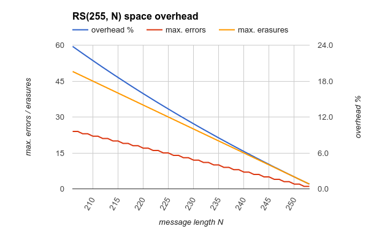
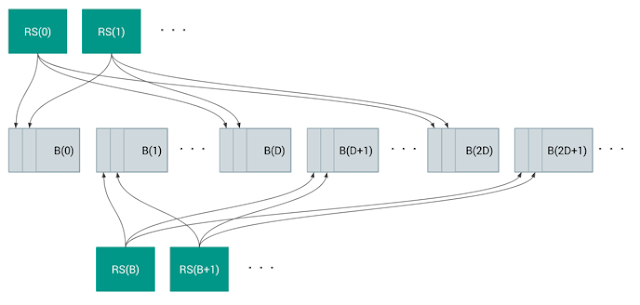

# 20250226-Android AVB 分析（十九）Android 官方 FEC 文档解读

## 导读

在上一篇[《Android AVB 分析（十八）Android 镜像中的 FEC 数据是如何计算出来的？》](https://blog.csdn.net/guyongqiangx/article/details/145865506) 中详细介绍了 Android 镜像中的 FEC 数据是如何生成的。

但你可能还会觉得不过瘾，为啥采用 RS(255, 253) 编码，为啥不采用具有更强纠错的其它编码？采用 FEC 纠错的代价有多大？采用 FEC 对 Android 性能的影响有多大？

为此，Android 在官方的 AVB 文档中补充了一篇文章链接：[《严格强制执行的启动时验证与纠错》](https://android-developers.googleblog.com/2016/07/strictly-enforced-verified-boot-with.html)，这篇文章详细介绍了为什么采用 FEC 纠错，以及相应的评估和需要为此特性付出的代价。

这篇文章的原文链接如下：

- [《Strictly Enforced Verified Boot with Error Correction》](https://android-developers.googleblog.com/2016/07/strictly-enforced-verified-boot-with.html)
  - https://android-developers.googleblog.com/2016/07/strictly-enforced-verified-boot-with.html

如果你能很轻松的读懂原文，并能很好的验证文中提到的采用 FEC 而付出的代价和获得的收益，那本文你就不需要再往下阅读了。

本文将这篇文章翻译成中文，并附上我的解释。

除了阅读翻译和注释后的本文，老规矩，我也还是十分建议你去原文看看，实际上原文并不长，只不过需要有一些关于 FEC 或 RS(Reed-Solomon)编码的背景知识，所以在去阅读原文之前，最好先通过此前的三篇文章了解下 FEC 和 RS 编码的原理，以及 Android 中是如何生成镜像 FEC 数据的：

- [《Android AVB 分析（十六）5 个例子彻底理解 FEC(Reed-Solomon) 的工作原理》](https://blog.csdn.net/guyongqiangx/article/details/145865175) 
  - https://blog.csdn.net/guyongqiangx/article/details/145865175
- [《Android AVB 分析（十七）程序员的RS(Reed-Solomon)编码实战》](https://blog.csdn.net/guyongqiangx/article/details/145865276)
  - https://blog.csdn.net/guyongqiangx/article/details/145865276
- [《Android AVB 分析（十八）Android 镜像中的 FEC 数据是如何计算出来的？》](https://blog.csdn.net/guyongqiangx/article/details/145865506) 
  - https://blog.csdn.net/guyongqiangx/article/details/145865506

感谢 Android 官方的这篇介绍 AVB 采用 FEC 纠错宏观评述的文章，感谢作者 Sami Tolvanen。

## 严格强制执行的启动时验证与纠错

> 日期：2016 年 7 月 19 日
>
> 作者：*Sami Tolvanen*
>
> 来源：https://android-developers.googleblog.com/2016/07/strictly-enforced-verified-boot-with.html

### 概览

Android 使用多层保护来确保用户安全。其中一层是验证启动(verified boot)，通过使用加密完整性检查来检测操作系统的变化，从而提高安全性。自 Marshmallow (Android 6)以来，Android 就提供了系统完整性的警告([alerted about system integrity](https://g.co/ABH))，但从搭载 Android 7.0 的首批设备开始，我们要求严格实施验证启动。这意味着具有损坏的启动映像或验证分区设备将无法启动或需要在用户同意的情况下以有限的能力启动。然而，这种严格的检查意味着以前不太明显的非恶意数据损坏现在可能会更多地影响进程功能。

默认情况下，Android 使用 dm-verity 内核驱动程序验证大分区，该驱动程序将分区划分为 4 KiB 块，并在读取时对每个块进行验证，与签名哈希树进行比对。因此，检测到单个字节的损坏将在 dm-verity 处于强制模式时导致整个块变得不可访问，从而导致内核在访问已验证分区数据时向用户空间返回 EIO 错误。

> 注: 
>
> dm-verity 驱动层将分区镜像按照 4 KiB 的块(block)大小进行划分，每次通过 dm-verity 设备读取数据时都会读取该数据所在的整个 4 KiB 块数据，计算其哈希值(hash)并同哈希树(hash tree)中的值进行比较。 
>
> 如果数据被篡改，则无法通过 hash 验证检查。如果支持 FEC 功能，则此时通过所携带的 FEC 数据进行纠错。

本篇帖子描述了通过引入前向纠错（FEC）来提高 dm-verity 鲁棒性(robustness)的工作，并解释了这如何使我们能够使操作系统更耐数据损坏。这些改进适用于运行 Android 7.0 的任何设备，本篇帖子反映了我们在 Nexus 设备上提供的 AOSP 默认实现。

> 注：
>
> 将 robustness 翻译成"鲁棒性"是我个人相当不喜欢的翻译。

### 纠错码

使用前向纠错，我们可以通过发送使用纠错码生成的冗余编码数据来检测和纠正源数据中的错误。可以纠正的错误的确切数量取决于所使用的码和分配给编码数据的空间量。

Reed-Solomon 是最常用的纠错码家族之一，在 Linux 内核中易于获取，这使得它成为 dm-verity 的明显候选者。这些码可以纠正多达 ⌊t/2⌋ 个未知错误和多达 t 个已知错误，也称为擦除错误，当添加 t 个编码符号时。

> 注：
>
> 里德-所罗门编码（Reed-Solomon Coding）是一种非二进制纠错码。所谓的非二进制纠错码，是相对于二进制的 BCH 编码而言的，RS 编码的最小纠错单位是符号(symbol)而不是位(bit)。因此，符号(symbol)是对多个比特(bit)的另外一种说法。
>
> BCH 码是二进制循环码，而 RS 码是非二进制码，所以后者通常处理符号错误，而 BCH 更专注于比特错误。
>
> 
>
> 简单来说，1 个符号(symbol) 可以是 1 bit 数据，也可以是 2 bit 或更多个 bit 的数据；1 symbol 可以是 1 byte 数据，也可以是 2 bytes 或者多个 bytes 数据。1 个 symbol 到底代表多少个 bit，是在具体的 RS 编码算法中指定的。
>
> 
>
> 一个完整的里德-所罗门（Reed-Solomon）编码可以通过以下参数来描述：
>
> **RS(n, k, t, m, d)**
>
> - **n**：编码长度，即一个编码块中包含的符号总数。
> - **k**：信息符号数，即原始数据中包含的符号数。
> - **t**：纠错能力，即编码能够纠正的最大符号错误数，计算公式为 `t=n-k`。
> - **m**：符号大小，即每个符号的比特数，通常在有限域 `GF(2^m)` 中。
> - **d**：最小距离，即任意两个有效码字之间的最小汉明距离，计算公式为 `d=n-k+1`。
>
> 在大多数的默认情况下 `m=8`，即 8 bit (或 1 byte) 表示 1 个符号(symbol)。
>
> 另外，纠错能力 t 和 d 都可以通过 n, k 计算出来。
>
> - 在没有提供错误位置的情况下，通过冗余编码能够纠正多达 ⌊t/2⌋ 个未知错误
> - 在提供了具体错误位置的情况下，通过冗余编码能够纠正多达 t 个已知错误，也称为擦除错误
>
> 
>
> 由于参数 t 和 d 可以通过计算得到，因此 **RS(n, k, t, m, d)** 通常简化记作 **RS(n, k)**，这就是为什么我们看到 RS(255, 223) 这种表示的原因。

一个典型的 RS(255, 223)码，每 223 字节源数据生成 32 字节编码数据，可以纠正每个 255 字节块中的最多 16 个未知错误。然而，使用此码会导致约 15%的空间开销，这对于存储空间有限的移动设备来说是不可接受的。我们可以通过牺牲纠错能力来减少空间开销。一个 RS(255, 253)码只能纠正一个未知错误，但空间开销仅为 0.8%。

> 注：
>
> 对于 RS(255, 223)，其参数：
>
> - m = 8，默认 8 bits 为 1 个符号 symbol
>
> - n = 255，一个编码块中包含的符号总数为 255 字节
> - k = 223，原始数据中包含的符号数为 223 字节
> - t = n - k = 255 - 223 = 32，编码能够纠正的最大符号错误数(指定错误位置可以纠正 32 字节，没有指定则最大为 16 字节)
> - d = n - k + 1 = 33
>
> 
>
> 因此，
>
> 对于 RS(255, 223) 编码，每 223 字节数据生成 32 字节的冗余编码，得到总大小为 255 字节的编码块。换句话说就是 255 字节块中最多可以纠正 32/2=16 个字节的错误。其开销为 `32/223 = 14.35%`, 算上一些填充和一些其他的损耗大约为 15%。
>
> 对于 RS(255, 253) 编码，每 253 字节数据生成 2 字节的冗余编码，得到总大小为 255 字节的编码块。换句话说就是 255 字节块中最多可以纠正 2/2=1 个字节的错误。其开销为 `2/253 = 0.791%`, 算上一些填充和一些其他的损耗大约为 0.8%。
>
> 具体一点，这里 RS(255, 253) 编码的 0.8% 开销，对一个 1000M 的分区镜像来说，其 FEC 编码的冗余数据为 8M。如果使用 RS(255, 223) 编码，虽然有较好的纠错性，但此时冗余数据就接近 150M，代价太大。

附加的复杂性在于，基于块的存储损坏通常发生在整个块上，有时甚至跨越多个连续的块。由于里德-所罗门码只能从相对较短的编码块中的有限个损坏的字节中恢复，因此没有巨大的空间开销，简单的实现将不会非常有效。

> 注：
>
> 对 eMMC 存储来说，其内部底层多基于 Nand flash，这一类存储设备发生问题时，通常是 1 个 block 损坏导致整个 block 的数据丢失，如果连续的多个 block 损坏就更麻烦了。
>
> 对于 RS(255, 253) 这样的里德所罗门编码，单块编码的总大小为 255 字节，如果所有数据挨在一起，其能够纠错的最大长度 d=n-k+1=255-253+1=3，意味着损坏数据超过 3 字节就不能恢复了。1 个 4 KiB 的 block 可以包含多个编码块，因此 1 个 block 坏了那整个编码数据是完全没法恢复的。

### 从连续损坏的块中恢复

在我们对 Android 7.0 的 dm-verity 所做的更改中，我们使用了一种称为交织的技术，使我们不仅能够从整个 4 KiB 源块的丢失中恢复，还能从多个连续块中恢复，同时与原始实现相比，显著减少了实现可用的错误纠正能力所需的空间开销。

高效交织意味着将块中的每个字节映射到单独的里德-所罗门码，每个码覆盖对应 N 个源块中的 N 个字节。一种简单的交织方式，其中每个码覆盖连续的 N 个块，已经使我们能够从最多(255 - N) / 2 个块的损坏中恢复，例如，对于 RS(255, 223)，这意味着 64 KiB。

一个更好的解决方案是通过将每个代码扩展到整个分区来最大化相同代码覆盖的字节之间的距离，从而将 RS(255, N)代码在由 T 个块组成的分区上可以处理的连续损坏块的最大数量增加到⌈T/N⌉ × (255 - N) / 2。

交织距离为 D，块大小为 B。

交错的一个额外好处是，当与 dm-verity 已执行的完整性验证结合使用时，我们可以确切地知道每个代码中的错误位置。因为代码的每个字节覆盖不同的源块——我们可以使用现有的 dm-verity 元数据验证每个块的完整性——我们知道哪些字节包含错误。能够精确地定位擦除位置使我们能够将错误纠正性能有效加倍，最多达到⌈T/N⌉ × (255 - N)个连续块。

对于约 2 GiB 的分区，有 524256 个 4 KiB 块和 RS(255, 253)，单个代码的字节之间的最大距离为 2073 块。因为每个代码可以从两个擦除中恢复，使用这种交织方法，我们可以从最多 4146 个连续损坏的块（约 16 MiB）中恢复。当然，如果编码数据本身损坏或我们丢失了任何单个代码覆盖的超过两个块，我们就无法再恢复。

在使基于块的存储错误纠正成为可能的同时，交织确实有副作用，使得解码速度变慢，因为我们需要读取多个分散在分区中的块来从错误中恢复，而不是读取单个块。幸运的是，当与 dm-verity 和固态存储结合使用时，这不是一个大问题，因为我们只有在块实际损坏时才需要解码，而这仍然相当罕见，即使我们必须纠正错误，随机访问读取也相对较快。

### 结论

严格执行的验证启动提高了安全性，但也会通过增加设备因软件错误或硬件问题可能发生的磁盘损坏的影响来降低可靠性。

我们为 dm-verity 开发的全新错误纠正功能，使得设备能够在典型 2-3 GiB 系统分区中，仅占用 0.8%的空间开销且不影响性能的情况下，从最多 16-24 MiB 的连续块丢失中恢复，无论这些块位于何处。这提高了运行 Android 7.0 的设备的安保性和可靠性。

## 其它

我创建了一个 Android AVB 讨论群，主要讨论 Android 设备的 AVB 验证问题。

我还有几个 Android OTA 升级讨论群，主要讨论 Android 设备的 OTA 升级话题。

欢迎您加群和我们一起交流，请在加我微信时注明“Android AVB 交流”或“Android OTA 交流”。

仅限 Android 相关的开发者参与~

> 公众号“洛奇看世界”后台回复“wx”获取个人微信。

