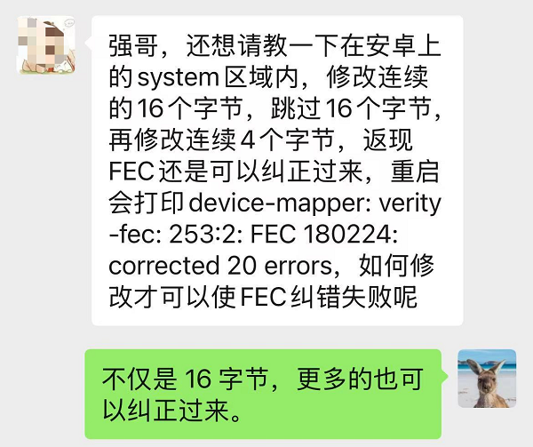
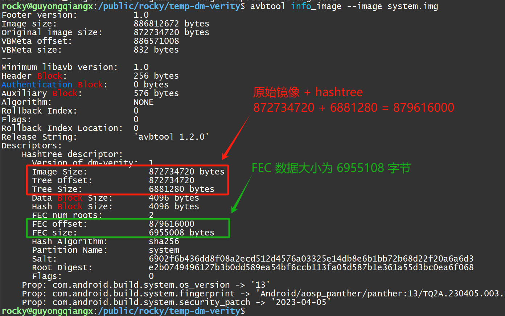
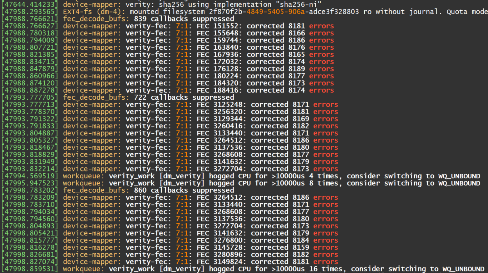

# 20250302-Android AVB 分析（十九）Android 镜像中的 FEC 到底能纠正多少错误？

我在 [《Android AVB 分析（十三）dm-verity 设备是如何映射和纠错的？》](https://blog.csdn.net/guyongqiangx/article/details/145211172)中做过一个 system 分区镜像 system.img 进行 dm-verity 映射，加载和 FEC 纠错的例子。

在那个纠错的例子中，我修改了磁盘中某个字节的 3 个 bit，有了前面的基础，我们就知道这对于 RS(255, 253) 编码来说，和几个 bit 没有关系，不论是 1 bit，2 bit, 3 bit 或者 8 bit, 都对应于 1 个符号(symbol)。所以实际上就是破坏了 1 个符号，完全可以通过 FEC 纠正回来。


有个小伙伴看了我的这篇文章，然后他也做了破坏试验，然后发现即使他破坏了 16 个字节，系统也仍然可以恢复。于是他私信问我最多可以纠正多少内容。




我当时还没有深入研究 Android 上 FEC 的纠错能力，所以估计肯定不止 16 字节，大概 4K 吧。然后请他去做实验验证。

那 Android 上的 FEC 到底能纠错多少呢？


## 1. Android 镜像的理论纠错能力

对于 RS(255, 253) 编码来说，其 t=2, 因此每 255 字节的编码块最多可以纠正 t/2=1 个字节，但是在提供了错误位置的前提下，最多可以纠正 t 个符号，即 2 个字节。

Android 镜像由于采用了 FEC 交织编码，因此纠错能力得到了大大的增强。那到底可以纠正多少呢？具体要看交织编码的情况。

回到我们这一系列一直讨论的 Android 系统镜像 system.img:



```bash
$ avbtool info_image --image system.img 
Footer version:           1.0
Image size:               886812672 bytes
Original image size:      872734720 bytes
VBMeta offset:            886571008
VBMeta size:              832 bytes
--
Minimum libavb version:   1.0
Header Block:             256 bytes
Authentication Block:     0 bytes
Auxiliary Block:          576 bytes
Algorithm:                NONE
Rollback Index:           0
Flags:                    0
Rollback Index Location:  0
Release String:           'avbtool 1.2.0'
Descriptors:
    Hashtree descriptor:
      Version of dm-verity:  1
      Image Size:            872734720 bytes
      Tree Offset:           872734720
      Tree Size:             6881280 bytes
      Data Block Size:       4096 bytes
      Hash Block Size:       4096 bytes
      FEC num roots:         2
      FEC offset:            879616000
      FEC size:              6955008 bytes
      Hash Algorithm:        sha256
      Partition Name:        system
      Salt:                  6902f6b436dd8f08a2ecd512d4576a03325e14db8e6b1bb72b68d22f20a6a6d3
      Root Digest:           e2b0749496127b3b0dd589ea54bf6ccb113fa05d587b1e361a55d3bc0ea6f068
      Flags:                 0
    Prop: com.android.build.system.os_version -> '13'
    Prop: com.android.build.system.fingerprint -> 'Android/aosp_panther/panther:13/TQ2A.230405.003.E1/rocky12021421:userdebug/test-keys'
    Prop: com.android.build.system.security_patch -> '2023-04-05'
```


对于我们示例的 system.img 镜像，其原始镜像大小为 872734720 (832.31 M)字节，然后计算得到其  hashtree 数据 6881280 (6.57 M)字节。基于原始镜像和 hastree 进行 FEC 编码，得到的 FEC 数据大小为 6955008 (6.64 M)字节。

我们在上一篇中计算过 Android 镜像交织编码的情况，对于 879616000 (838.87 M)字节的数据，需要按照 253 * 4096 填充对齐后再交织编码。

为了达到最大的纠错能力，因此将交织编码扩散到整个文件，换句话说，对于 RS(255, 253) 编码，其原始数据的 253 字节来自整个镜像数据，或者说这 253 字节均匀分布在整个镜像中。

所以，两个交织编码字节之间的距离为：3477504 字节，即 3396 K。

> 3477504 = (879616000 / 4096 + 252) / 253 * 4096

所以任意破坏连续的 3396K 数据，在交织后，实际上就破坏了 3377504 组 RS(255, 253) 编码中每一个编码的 1 个字节。而对于 RS(255, 253) 编码来说，破坏 1 个符号(即 1 字节) 是可以进行恢复的。在知道了错误位置的前提下，破坏 2 个符号也是可以恢复的。


好了，到了这里，让我们亲自做实验来验证吧。

## 2. 实验 1. 破坏 3396K 字节, fec 工具纠错成功

```bash
# 从 system.img 中提取带有 hashtree 数据的镜像
$ dd if=system.img of=system-with-hash.img bs=4096 count=$((879616000/4096))

# 从 system.img 中提取 FEC 数据
$ dd if=system.img of=system-with-hash-fec.bin bs=4096 count=$((6955008/4096)) skip=$((879616000/4096))

# 复制带有 hashtree 数据的镜像文件备用
$ cp system-with-hash.img system-with-hash-3396k-err.img

# 生成 3396K 全 0xff 的数据
$ dd if=/dev/zero bs=1024 count=3396 | tr '\000' '\377' > 3396kff.bin
$ ls -al 3396kff.bin 
-rw-r--r-- 1 rocky users 3477504 Mar  2 21:15 3396kff.bin

# 使用全 3396K 0xFF 的数据替换文件的前 3396K 字节，结果相当于将文件前 3396K 全部写成 0xFF 了
$ dd if=3396kff.bin of=system-with-hash-3396k-err.img bs=4096 seek=0 count=$((3377504/4096)) conv=notrunc

# 对比修改前后的镜像 md5 数据
$ md5sum system-with-hash.img system-with-hash-3396k-err.img 
f5714d8dc3af9b417e9884bbdc0593f5  system-with-hash.img
3693eac1093fc31cb69c0c9031b96019  system-with-hash-3396k-err.img

# 直接使用 fec 工具的 -d 和 --inplace 进行解码修复
$ fec -d --roots=2 --inplace system-with-hash-3396k-err.img system-with-hash-fec.bin 
correcting 'system-with-hash-3396k-err.img' using RS(255, 253) from 'system-with-hash-fec.bin'
corrected 3348648 errors

# 比较修复后的文件和修复前的文件，完全一样，说明直接使用 fec 工具基于正确的 fec 数据就将错误的内容修复了
$ md5sum system-with-hash.img system-with-hash-3396k-err.img 
f5714d8dc3af9b417e9884bbdc0593f5  system-with-hash.img
f5714d8dc3af9b417e9884bbdc0593f5  system-with-hash-3396k-err.img
```


这里我们看到，直接使用 fec 工具修复了这个 3396K 的错误。具体修复的编码为 3348648 组。

> 问题 1：
>
> 我们使用 3377504 个全  0xFF 的数据去修改，理论上会有 3377504 组，为什么恢复时纠错只有 3348648 组呢？


## 3. 实验 2. 破坏 3396K 字节, dm-verity 纠错成功

为了让实验更接近我们的真实的 Android 镜像挂载情况，我们特地将 system.img 挂载起来，并找到其中一个文件进行破坏实验。

```bash
# 创建临时目录 system
$ mkdir system

# 将 system.img 镜像以只读方式挂载到 system 目录下
$ sudo mount -o loop,ro system.img system

# 使用 find 命令查找镜像中大于 5M 的文件
$ cd system
system$ sudo find . -type f -size +5M | xargs ls -lh;
-rw-r--r--. 1 root root  21M Jan  1  2009 ./system/apex/com.android.art.capex
-rw-r--r--. 1 root root  21M Jan  1  2009 ./system/apex/com.android.btservices.apex
-rw-r--r--. 1 root root  37M Jan  1  2009 ./system/apex/com.android.i18n.apex
-rw-r--r--. 1 root root 8.7M Jan  1  2009 ./system/apex/com.android.media.swcodec.capex
-rw-r--r--. 1 root root 5.5M Jan  1  2009 ./system/apex/com.android.permission.capex
-rw-r--r--. 1 root root 8.0M Jan  1  2009 ./system/apex/com.android.runtime.apex
-rw-r--r--. 1 root root  48M Jan  1  2009 ./system/apex/com.android.vndk.current.apex
-rw-r--r--. 1 root root 5.4M Jan  1  2009 ./system/app/NfcNci/NfcNci.apk
-rw-r--r--. 1 root root 9.6M Jan  1  2009 ./system/app/Traceur/Traceur.apk
-rwxr-xr-x. 1 root 2000 6.5M Jan  1  2009 ./system/bin/surfaceflinger
-rw-r--r--. 1 root root 9.1M Jan  1  2009 ./system/fonts/NotoColorEmojiLegacy.ttf
-rw-r--r--. 1 root root  19M Jan  1  2009 ./system/fonts/NotoSansCJK-Regular.ttc
-rw-r--r--. 1 root root  24M Jan  1  2009 ./system/fonts/NotoSerifCJK-Regular.ttc
-rw-r--r--. 1 root root 9.0M Jan  1  2009 ./system/framework/arm64/boot-framework.oat
-rw-r--r--. 1 root root 7.7M Jan  1  2009 ./system/framework/arm/boot-framework.oat
-rw-r--r--. 1 root root  36M Jan  1  2009 ./system/framework/framework.jar
-rw-r--r--. 1 root root  34M Jan  1  2009 ./system/framework/framework-res.apk
-rw-r--r--. 1 root root  11M Jan  1  2009 ./system/framework/oat/arm64/apex@com.android.wifi@javalib@service-wifi.jar@classes.odex
-rw-r--r--. 1 root root  46M Jan  1  2009 ./system/framework/oat/arm64/services.odex
-rw-r--r--. 1 root root  17M Jan  1  2009 ./system/framework/services.jar
-rw-r--r--. 1 root root 8.5M Jan  1  2009 ./system/lib64/libhwui.so
-rw-r--r--. 1 root root  19M Jan  1  2009 ./system/lib64/libLLVM_android.so
-rw-r--r--. 1 root root 5.1M Jan  1  2009 ./system/lib/libhwui.so
-rw-r--r--. 1 root root 6.4M Jan  1  2009 ./system/priv-app/DocumentsUI/DocumentsUI.apk
-rw-r--r--. 1 root root 6.3M Jan  1  2009 ./system/priv-app/ManagedProvisioning/ManagedProvisioning.apk
-rw-r--r--. 1 root root 8.9M Jan  1  2009 ./system/priv-app/TeleService/TeleService.apk
```


我们选择一个 17M 的文件进行破坏 `system/framework/services.jar`，在破坏前先计算文件的 md5 用于后续比较，以及使用 fiemap_query 工具查看这个文件的布局情况：

```bash
# 查看文件大小，17M
system$ ls -lh system/framework/services.jar
-rw-r--r--. 1 root root 17M Jan  1  2009 system/framework/services.jar

# 查看文件 md5
system$ md5sum system/framework/services.jar
5a29f244372b2e5b728d7da2bf582000  system/framework/services.jar

# 使用 fiemap_query 查看文件布局
system$ ../../fiemap_query system/framework/services.jar
File: system/framework/services.jar
Total extents: 1

Extent Details:
Logical      Physical     Length       Flags
----------------------------------------------
0x0          0x21616000   0x10cc000    LAST 
```


> 关于查看文件布局的工具 fiemap_query，请参考文章:
>
> - [《fiemap_query，一个查询文件 FIEMAP 信息的工具》](https://blog.csdn.net/guyongqiangx/article/details/145232020)
>   - https://blog.csdn.net/guyongqiangx/article/details/145232020


有了这些信息，我们后面就可以对 `system/framework/services.jar` 进行破坏了。

```bash
# 生成 3396 全 0xff 的数据
$ dd if=/dev/zero bs=1024 count=3396 | tr '\000' '\377' > 3396kff.bin

# 使用全 3396K 0xFF 的数据替换文件 system/framework/services.jar 的前 3396K 字节
# 结果相当于将文件开始的 3396K 全部写成 0xFF 了
$ cp system.img system-err-3396k.img
$ md5sum system.img system-err-3396k.img
180d9ac31ae032943449c163079a8c9c  system.img
180d9ac31ae032943449c163079a8c9c  system-err-3396k.img
$ dd if=3396kff.bin of=system-err-3396k.img bs=1024 seek=$((0x21616000/1024)) count=3396 conv=notrunc

# 查看修改后的文件 md5，确认镜像已经被修改过了
$ md5sum system.img system-err-3396k.img
180d9ac31ae032943449c163079a8c9c  system.img
41e9ea4ab2a3a2aa80d3acdff72df1e4  system-err-3396k.img

# 挂载修改后的镜像检查文件前 3396K 内容
$ mkdir system-err-3396k
$ sudo mount -o loop,ro system-err-3396k.img system-err-3396k
$ cd system-err-3396k

# 确认前 6792K 内容已经被写成全 0xff 了
system-err-3396k$ hexdump -C system/framework/services.jar -n $((3396*1024+32))
00000000  ff ff ff ff ff ff ff ff  ff ff ff ff ff ff ff ff  |................|
*
00351000  09 00 0a 08 77 09 c3 75  00 00 0e 00 07 00 07 00  |....w..u........|
00351010  01 00 00 00 00 00 00 00  10 00 00 00 70 10 a9 fa  |............p...|
00351020

# 查看文件的 md5 值备用
system-err-3396k$ md5sum system/framework/services.jar
d42827ecfa3424ae4e0e1fc7471add1f  system/framework/services.jar

# 卸载镜像 system-err-6792k
system-err-3396k$ cd ..
$ sudo umount system-err-3396k
```


通过前面的操作，我们已经将镜像 system-err-3396k.img 中的文件 `system/framework/services.jar` 前 3396K 内容全部改成了 0xFF，接下来我们用 dm-verity 的 FEC 来验证纠错功能。

我们这里沿用[《Android AVB 分析（十三）dm-verity 设备是如何映射和纠错的？》](https://blog.csdn.net/guyongqiangx/article/details/145211172)使用的 Android 分区映射加载指令，将镜像文件`system-err-3396k.img` 映射为 dm-verity 设备`/dev/mapper/system-verity-err-3396k` :

> 各个具体映射参数的计算，也请移步[《Android AVB 分析（十三）dm-verity 设备是如何映射和纠错的？》](https://blog.csdn.net/guyongqiangx/article/details/145211172)，这里不再啰嗦。

```bash
# 创建带有 FEC 纠错的的 dm-verity 映射设备 system-verity-err-3396k
$ sudo veritysetup -v \
    --no-superblock \
    --data-block-size=4096 \
    --hash-block-size=4096 \
    --data-blocks=213070 \
    --hash-offset=872734720 \
    --hash=sha256 \
    --salt=6902f6b436dd8f08a2ecd512d4576a03325e14db8e6b1bb72b68d22f20a6a6d3 \
    --fec-device=system-err-3396k.img  \
    --fec-offset=879616000 \
    --fec-roots=2 \
    open system-err-3396k.img system-verity-err-3396k system-err-3396k.img \
    e2b0749496127b3b0dd589ea54bf6ccb113fa05d587b1e361a55d3bc0ea6f068
Command successful.

# 查看设备 system-verity-err-3396k 的映射状态
$ sudo veritysetup status system-verity-err-3396k
/dev/mapper/system-verity-err-3396k is active and is in use.
  type:        VERITY
  status:      verified
  hash type:   1
  data block:  4096
  hash block:  4096
  hash name:   sha256
  salt:        6902f6b436dd8f08a2ecd512d4576a03325e14db8e6b1bb72b68d22f20a6a6d3
  data device: /dev/loop1
  data loop:   /local/public/users/rocky/temp-dm-verity/system-err-3396k.img
  size:        1704560 sectors
  mode:        readonly
  hash device: /dev/loop0
  hash loop:   /local/public/users/rocky/temp-dm-verity/system-err-3396k.img
  hash offset: 1704560 sectors
  FEC device:  /dev/loop2
  FEC offset:  1718000 sectors
  FEC roots:   2
  root hash:   e2b0749496127b3b0dd589ea54bf6ccb113fa05d587b1e361a55d3bc0ea6f068

# 在 veritysetup status 中提到了 loop1, loop0 和 loop2 设备
# 通过 losetup -a 查看所有 loop 设备的状态
$ losetup -a
/dev/loop1: []: (/local/public/users/rocky/temp-dm-verity/system-err-3396k.img)
/dev/loop2: []: (/local/public/users/rocky/temp-dm-verity/system-err-3396k.img)
/dev/loop0: []: (/local/public/users/rocky/temp-dm-verity/system-err-3396k.img)

# 将 dm-verity 设备挂载起来读取文件 system/framework/services.jar
$ mkdir system-verity-err-3396k
$ sudo mount -t ext4 -o ro /dev/mapper/system-verity-err-3396k system-verity-err-3396k

$ cd system-verity-err-3396k
# 计算文件的 md5
system-verity-err-3396k$ md5sum system/framework/services.jar
5a29f244372b2e5b728d7da2bf582000  system/framework/services.jar

# 查看文件的前 256 字节
system-verity-err-3396k$ hexdump -C system/framework/services.jar -n 256
00000000  50 4b 03 04 14 00 00 00  00 00 00 00 21 38 50 81  |PK..........!8P.|
00000010  0a 91 58 96 a0 00 58 96  a0 00 0b 00 03 00 63 6c  |..X...X.......cl|
00000020  61 73 73 65 73 2e 64 65  78 00 00 00 64 65 78 0a  |asses.dex...dex.|
00000030  30 33 39 00 6a 99 d3 60  ee 4c d4 d7 ef 88 f6 9f  |039.j..`.L......|
00000040  9b da 59 72 35 43 8b 6b  ef 47 b9 ec 58 96 a0 00  |..Yr5C.k.G..X...|
00000050  70 00 00 00 78 56 34 12  00 00 00 00 00 00 00 00  |p...xV4.........|
00000060  7c 95 a0 00 31 5f 01 00  70 00 00 00 e5 28 00 00  ||...1_..p....(..|
00000070  34 7d 05 00 96 44 00 00  c8 20 06 00 e7 68 00 00  |4}...D... ...h..|
00000080  d0 57 09 00 9f ff 00 00  08 9f 0c 00 b2 1b 00 00  |.W..............|
00000090  00 9c 14 00 18 84 88 00  40 12 18 00 ec 14 6a 00  |........@.....j.|
000000a0  ee 14 6a 00 f1 14 6a 00  f5 14 6a 00 15 15 6a 00  |..j...j...j...j.|
000000b0  1d 15 6a 00 23 15 6a 00  28 15 6a 00 3a 15 6a 00  |..j.#.j.(.j.:.j.|
000000c0  46 15 6a 00 50 15 6a 00  5a 15 6a 00 66 15 6a 00  |F.j.P.j.Z.j.f.j.|
000000d0  6f 15 6a 00 7e 15 6a 00  89 15 6a 00 a2 15 6a 00  |o.j.~.j...j...j.|
000000e0  bd 15 6a 00 d2 15 6a 00  ee 15 6a 00 0a 16 6a 00  |..j...j...j...j.|
000000f0  18 16 6a 00 27 16 6a 00  31 16 6a 00 52 16 6a 00  |..j.'.j.1.j.R.j.|
00000100

# 查看 kernel 信息
system-verity-err-3396k$ sudo dmesg
...
[45610.537864] device-mapper: verity: sha256 using implementation "sha256-ni"
[45713.860633] EXT4-fs (dm-4): mounted filesystem 2f870f2b-4849-5405-906a-adce3f328803 ro without journal. Quota mode: none.
[45782.277213] device-mapper: verity-fec: 7:1: FEC 151552: corrected 4089 errors
[45782.288882] device-mapper: verity-fec: 7:1: FEC 155648: corrected 4084 errors
[45782.300501] device-mapper: verity-fec: 7:1: FEC 159744: corrected 4093 errors
[45782.312132] device-mapper: verity-fec: 7:1: FEC 163840: corrected 4095 errors
[45782.323414] device-mapper: verity-fec: 7:1: FEC 167936: corrected 4078 errors
[45782.334461] device-mapper: verity-fec: 7:1: FEC 172032: corrected 4090 errors
[45782.345487] device-mapper: verity-fec: 7:1: FEC 176128: corrected 4096 errors
[45782.356556] device-mapper: verity-fec: 7:1: FEC 180224: corrected 4094 errors
[45782.367571] device-mapper: verity-fec: 7:1: FEC 184320: corrected 4086 errors
[45782.378658] device-mapper: verity-fec: 7:1: FEC 188416: corrected 4090 errors
```


从上面的输出可以看到，使用带有 FEC 纠错的 dm-verity 映射后，计算文件的 md5，和原始正确的文件一样，说明文件中的错误已经得到了纠正。

在 dmesg 的输出中，我们看到 FEC 连续纠正了 10 * 4096  左右的错误。

> 问题 2:
>
> 请解释日志中 "device-mapper: verity-fec: 7:1: FEC 151552: corrected 4089 errors"，到底纠正了哪个地方的错误？你有什么办法找到这些错误的数据，并和原来正确的数据进行比较吗？


## 4. 实验 3. 破坏 4000K 字节, fec 工具纠错失败

理论上连续破坏超过 3477504 (3396K) 数据就无法恢复了，为了操作方便，我们这里再演示 1 个破坏 4000K 内容的数据，看看是不是就不能修复了。

> 我自己还尝试做过一个写入 3397k 字符 0xff 的例子，结果最终实际破坏的编码为 3450549 组，少于 3477504  个错误。
>
> ```bash
> # 直接使用 fec 工具的 -d 和 --inplace 进行解码修复，成功修复 3450549 个错误
> $ fec -d --roots=2 --inplace system-with-hash-3397k-err.img system-with-hash-fec.bin 
> correcting 'system-with-hash-3397k-err.img' using RS(255, 253) from 'system-with-hash-fec.bin'
> corrected 3450549 errors
> ```

```bash
# 复制带有 hashtree 数据的镜像文件备用
$ cp system-with-hash.img system-with-hash-4000k-err.img
# 生成 3396K 全 0xff 的数据
$ dd if=/dev/zero bs=1024 count=4000 | tr '\000' '\377' > 4000kff.bin

# 使用全 4000K 0xFF 的数据替换文件的前 4000K 字节，结果相当于将文件前 4000K 全部写成 0xFF 了
$ dd if=4000kff.bin of=system-with-hash-4000k-err.img bs=4096 seek=0 count=1000 conv=notrunc
# 对比修改前后的镜像 md5 数据
$ md5sum system-with-hash.img system-with-hash-4000k-err.img
f5714d8dc3af9b417e9884bbdc0593f5  system-with-hash.img
71e852010afcf738616c0cfb1c27ffd8  system-with-hash-4000k-err.img

# 直接使用 fec 工具的 -d 和 --inplace 进行解码修复，但是失败了
$ fec -d --roots=2 --inplace system-with-hash-4000k-err.img system-with-hash-fec.bin 
correcting 'system-with-hash-4000k-err.img' using RS(255, 253) from 'system-with-hash-fec.bin'
failed to recover [70702621, 70702874)
```

我们看到这里使用 fec 工具对 4000k 错误数据纠错失败了。


从这里看，大致验证了我们之前的猜想，对于我们的镜像数据，使用 RS(255, 253) 以及基于整个镜像文件的交织编码，最多可以纠正 3396K连续破坏的数据。


当然，如果是非连续的破坏，而这些破坏又刚好只有 1 个字节落在交织编码的 RS(255, 253) 数据块内，那可以纠错的内容就更多了。

## 5. 实验 4. 破坏 6792K 字节, dm-verity 纠错成功

实验 3 尝试使用 fec 工具对数据进行修复，但是失败了。

现在让我们回到 Android 系统，更大胆一点，使用实验 2 的方式，即将错误镜像挂载成带有 FEC 纠错的 dm-verity 设备，尝试对更多的错误数据进行恢复，可能会有更多惊喜。

这里我们试着恢复 6792K 的错误数据。为什么选择 6792K 字节呢？因为 `6792K = 3396K * 2`。刚好就是整个镜像的 2/253 = 2 x 1/253 = 2 x t/2 = t。

我们还是对分区镜像中的文件 `system/framework/services.jar` 进行破坏，具体文件信息的查看参考实验 2，这里只列举步骤。

```bash
# 生成 6792K 全 0xff 的数据
$ dd if=/dev/zero bs=1024 count=6792 | tr '\000' '\377' > 6792kff.bin

# 使用全 6792K 0xFF 的数据替换文件 system/framework/services.jar 的前 6792K 字节
# 结果相当于将文件开始的 6792K 全部写成 0xFF 了
$ cp system.img system-err-6792k.img
$ dd if=6792kff.bin of=system-err-6792k.img bs=1024 seek=$((0x21616000/1024)) count=6792 conv=notrunc

# 查看修改后的文件 md5，确认镜像已经被修改过了
$ md5sum system.img system-err-6792k.img 
180d9ac31ae032943449c163079a8c9c  system.img
bba875bc4bbc9a42f4e0f412cf93fb53  system-err-6792k.img

# 挂载修改后的镜像检查文件前 6792K 内容
$ mkdir system-err-6792k
$ sudo mount -o loop,ro system-err-6792k.img system-err-6792k
$ cd system-err-6792k

# 确认前 6792K 内容已经被写成全 0xff 了
system-err-6792k$ hexdump -C system/framework/services.jar -n $((6792*1024+32))
00000000  ff ff ff ff ff ff ff ff  ff ff ff ff ff ff ff ff  |................|
*
006a2000  73 70 65 63 69 66 69 63  20 61 72 67 75 6d 65 6e  |specific argumen|
006a2010  74 73 3e 00 32 20 20 20  20 20 20 20 20 20 20 20  |ts>.2           |
006a2020
$ echo $((0x006a2000/1024))
6792

# 查看文件的 md5 值备用
system-err-6792k$ md5sum system/framework/services.jar
ea390e54c61e1047289fbd461c6dd20b  system/framework/services.jar

# 卸载镜像 system-err-6792k
system-err-6792k$ cd ..
$ sudo umount system-err-6792k
```


通过前面的操作，我们已经将镜像 system-err-6792k.img 中的文件 `system/framework/services.jar` 前 6792K 内容全部改成了 0xFF，接下来我们用 dm-verity 的 FEC 来验证纠错功能。

我们这里将镜像文件`system-err-6792k.img` 映射为 dm-verity 设备`/dev/mapper/system-verity-err-6792k` :

```bash
# 创建带有 FEC 纠错的的 dm-verity 映射设备 system-verity-err-6792k
$ sudo veritysetup -v \
    --no-superblock \
    --data-block-size=4096 \
    --hash-block-size=4096 \
    --data-blocks=213070 \
    --hash-offset=872734720 \
    --hash=sha256 \
    --salt=6902f6b436dd8f08a2ecd512d4576a03325e14db8e6b1bb72b68d22f20a6a6d3 \
    --fec-device=system-err-6792k.img \
    --fec-offset=879616000 \
    --fec-roots=2 \
    open system-err-6792k.img system-verity-err-6792k system-err-6792k.img \
    e2b0749496127b3b0dd589ea54bf6ccb113fa05d587b1e361a55d3bc0ea6f068
    
# 查看设备 system-verity-err-6792k 的映射状态
$ sudo veritysetup status system-verity-err-6792k
/dev/mapper/system-verity-err-6792k is active.
  type:        VERITY
  status:      verified
  hash type:   1
  data block:  4096
  hash block:  4096
  hash name:   sha256
  salt:        6902f6b436dd8f08a2ecd512d4576a03325e14db8e6b1bb72b68d22f20a6a6d3
  data device: /dev/loop1
  data loop:   /local/public/users/rocky/temp-dm-verity/system-err-6792k.img
  size:        1704560 sectors
  mode:        readonly
  hash device: /dev/loop0
  hash loop:   /local/public/users/rocky/temp-dm-verity/system-err-6792k.img
  hash offset: 1704560 sectors
  FEC device:  /dev/loop2
  FEC offset:  1718000 sectors
  FEC roots:   2
  root hash:   e2b0749496127b3b0dd589ea54bf6ccb113fa05d587b1e361a55d3bc0ea6f068

# 查看和 system-verity-err-6792k 关联的 loop 设备
$ losetup -a
/dev/loop1: []: (/local/public/users/rocky/temp-dm-verity/system-err-6792k.img)
/dev/loop2: []: (/local/public/users/rocky/temp-dm-verity/system-err-6792k.img)
/dev/loop0: []: (/local/public/users/rocky/temp-dm-verity/system-err-6792k.img)

# 将 dm-verity 设备挂载起来读取文件 system/framework/services.jar
$ mkdir system-verity-err-6792k
$ sudo mount -t ext4 -o ro /dev/mapper/system-verity-err-6792k system-verity-err-6792k
$ cd system-verity-err-6792k
# 尝试查看文件的前 64 字节
$ hexdump -C system/framework/services.jar -n 64
00000000  50 4b 03 04 14 00 00 00  00 00 00 00 21 38 50 81  |PK..........!8P.|
00000010  0a 91 58 96 a0 00 58 96  a0 00 0b 00 03 00 63 6c  |..X...X.......cl|
00000020  61 73 73 65 73 2e 64 65  78 00 00 00 64 65 78 0a  |asses.dex...dex.|
00000030  30 33 39 00 6a 99 d3 60  ee 4c d4 d7 ef 88 f6 9f  |039.j..`.L......|
00000040
# 计算文件的 md5
$ md5sum system/framework/services.jar
5a29f244372b2e5b728d7da2bf582000  system/framework/services.jar

# 查看 kernel 信息，可以看到更多的纠错信息
[47644.414233] device-mapper: verity: sha256 using implementation "sha256-ni"
[47958.293565] EXT4-fs (dm-4): mounted filesystem 2f870f2b-4849-5405-906a-adce3f328803 ro without journal. Quota mode: none.
[47988.766621] fec_decode_bufs: 839 callbacks suppressed
[47988.766627] device-mapper: verity-fec: 7:1: FEC 151552: corrected 8181 errors
...
[47988.887278] device-mapper: verity-fec: 7:1: FEC 188416: corrected 8174 errors
[47993.777705] fec_decode_bufs: 722 callbacks suppressed
[47993.777713] device-mapper: verity-fec: 7:1: FEC 3125248: corrected 8171 errors
...
[47993.832214] device-mapper: verity-fec: 7:1: FEC 3272704: corrected 8173 errors
[47994.569519] workqueue: verity_work [dm_verity] hogged CPU for >10000us 4 times, consider switching to WQ_UNBOUND
[47995.947523] workqueue: verity_work [dm_verity] hogged CPU for >10000us 8 times, consider switching to WQ_UNBOUND
[47998.783202] fec_decode_bufs: 860 callbacks suppressed
[47998.783209] device-mapper: verity-fec: 7:1: FEC 3264512: corrected 8186 errors
...
[47998.827074] device-mapper: verity-fec: 7:1: FEC 3149824: corrected 8181 errors
[47998.859531] workqueue: verity_work [dm_verity] hogged CPU for >10000us 16 times, consider switching to WQ_UNBOUND
```

从 dmesg 可以看到，这里使用 FEC 纠正了更多的错误：



我们看到，这里纠正 2 x 3396K = 6792K 数据也成功了，换句话说，对于一个总大小为 846M 的 system.img 分区镜像，将其数据分成 253 份进行交织编码，每一份的大小为 3392K，FEC 竟然能从连续的两份错误数据(6792K)中修复 。


> 问题 3：
>
> 实验 4 中修复了 6792K 字节的错误，那还能修复更多的连续错误吗？
>
> 这个作业留给各位同学去实践验证。


对比实验 3 和实验 4，使用 fec 工具修复，我们看到对于 fec 工具，超过 3392K 就修复不了，但是如果挂载为带有 FEC 纠错的 dm-verity 设备，还能修复高达 6792K 字节的错误数据。

为什么会有这种差异呢？

原因在于交织编码和 dm-verity 的配合使用。

当我们使用 dm-verity 时，对每一个 block 的数据，都会生成一个对一个的 hash 值，运行时通过计算该 block 数据的 hash 值，同预先生成的 hashtree 中的 hash 进行比较，就知道是哪一块数据出错了。

对于每一个 block 中的每一个字节，都分散到一个单独的 RS 编码数据块中。因此，某个 block 的数据损坏了，这些数据就对应于 4096 个 RS 编码块中的具体字节，而且可以通过计算知道错误字节的确切位置。

所以，如果错了 2 个 block，那就可以知道 RS 编码中错误的那两个字节的位置。

能够精确地定位擦除位置使我们能够将错误纠正性能有效加倍，最多达到⌈T/N⌉ × (255 - N)个连续块。


这里的解释有点复杂，让我尝试换一个方式解释：

FEC 交织编码与 dm-verity 结合时，可以通过检查数据的 hashtree 明确定位具体错误。因为每个 4K 对应于 1 个 hash 数据。某个 hash 错了，就能反推回那个 hash 对应的 4K 块，从而知道是哪一块错了。

在知道错误位置的前提下，纠错能力翻倍，从原来的 `1/253` 变成 `2 x 1/253 = 2/253`。

对于大小为879616000 (838.87 M)字节的镜像，使用 RS(255, 253) 算法，并对整个镜像进行交织编码，再加上 dm-verity 对错误进行定位，所以最后的恢复能力就变成了：

`(879616000 / 4096 + 252) / 253 * 2 * 4096 = 3477504 * 2 = 3396K * 2 = 6792K`

## 6. 结论

我们在本篇一共做了 4 个实验，用来验证 RS 交织编码，以及 FEC 对交织编码后数据错误的恢复。

对于我们用于测试的 system.img 镜像，信息如下：


- system.img 原始数据大小为 872734720 字节
- system.img 原始数据的 hashtree 大小为 6881280 字节
- 基于 system.img 原始数据和 hashtree 计算(总大小为 879616000 字节)得到的 FEC 纠错数据大小为 6955008 字节


对于 879616000 (838.87 M)字节的数据，需要按照 253 * 4096 填充对齐后再交织编码。

为了达到最大的纠错能力，因此将交织编码扩散到整个文件，换句话说，对于 RS(255, 253) 编码，其原始数据的 253 字节来自整个镜像数据，或者说这 253 字节均匀分布在整个镜像中。

所以，两个交织编码字节之间的距离为：3477504 字节，即 3396 K。

> 3477504 = (879616000 / 4096 + 252) / 253 * 4096

所以任意破坏连续的 3396K 数据，在交织后，实际上就破坏了 3377504 组 RS(255, 253) 编码中每一个编码的 1 个字节。而对于 RS(255, 253) 编码来说，破坏 1 个符号(即 1 字节) 是可以进行恢复的。在知道了错误位置的前提下，破坏 2 个符号也是可以恢复的。


所以，我们精心设计了 4 个实验来验证对破坏数据的恢复。

包括：

- 实验 1，破坏 3396K 数据，即镜像的 1/253，使用 fec 工具纠错成功；
- 实验 2，破坏 3396K 数据，即镜像的 1/253，使用带有 FEC 纠错的 dm-verity 驱动纠错成功；
- 实验 3，破坏 4000K 数据，超过镜像的 1/253，但少于镜像的 2/253，使用 fec 工具纠错失败；

- 实验 4，破坏 6792K = 3392K x 2数据，即镜像的 2/253，使用带有 FEC 纠错的 dm-verity 驱动纠错成功；


对比实验 3 和实验 4，使用 fec 工具修复，我们看到对于 fec 工具，超过 3392K 就修复不了，但是如果挂载为带有 FEC 纠错的 dm-verity 设备，还能修复高达 6792K 字节的错误数据。

为什么会有这种差异呢？

原因在于 FEC 交织编码与 dm-verity 结合时，可以通过检查数据的 hashtree 明确定位具体错误。因为每个 4K 对应于 1 个 hash 数据。某个 hash 错了，就能反推回那个 hash 对应的 4K 块，从而知道是哪一块错了。

在知道错误位置的前提下，纠错能力翻倍，从原来的 `1/253` 变成 `2 x 1/253 = 2/253`。

对于大小为879616000 (838.87 M)字节的镜像，使用 RS(255, 253) 算法，并对整个镜像进行交织编码，再加上 dm-verity 对错误进行定位，所以最后的恢复能力就变成了 6792K：

`(879616000 / 4096 + 252) / 253 * 2 * 4096 = 3477504 * 2 = 3396K * 2 = 6792K`


不得不说，对于 1 个 838M 的镜像，其 hashtree 大小为 6M, 在加上外的 FEC 数据 6M, 结果竟然是可以纠正和 FEC 数据大小差不多的连续数据错误。


关于具体的 FEC 性能的一些解读，请参考我的下一篇文章：[《Android AVB 分析（二十）Android 官方 FEC 文档解读》](https://blog.csdn.net/guyongqiangx/article/details/145973033)


## 7. 思考和作业

最后，留给你一个思考：

我们这里在数据区制造了连续 2/253 镜像大小的错误，可以通过带有 FEC 的 dm-verity 驱动纠错。对于 hashtree 区域，以及 FEC 数据区域，还能纠正连续的 2/253 镜像大小的错误吗？如果你能清楚的解释清楚为什么，那说明你对  Android 镜像的 FEC 纠错是真的搞清楚了。


请基于你工作的 Android 平台，在上面进行数据纠错练习~并尝试解释清楚每一步中，每一个参数的来历。

## 8. 其它

我创建了一个 Android AVB 讨论群，主要讨论 Android 设备的 AVB 验证问题。

我还有几个 Android OTA 升级讨论群，主要讨论 Android 设备的 OTA 升级话题。

欢迎您加群和我们一起交流，请在加我微信时注明“Android AVB 交流”或“Android OTA 交流”。

仅限 Android 相关的开发者参与~

> 公众号“洛奇看世界”后台回复“wx”获取个人微信。

