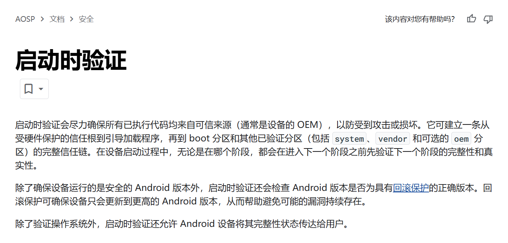
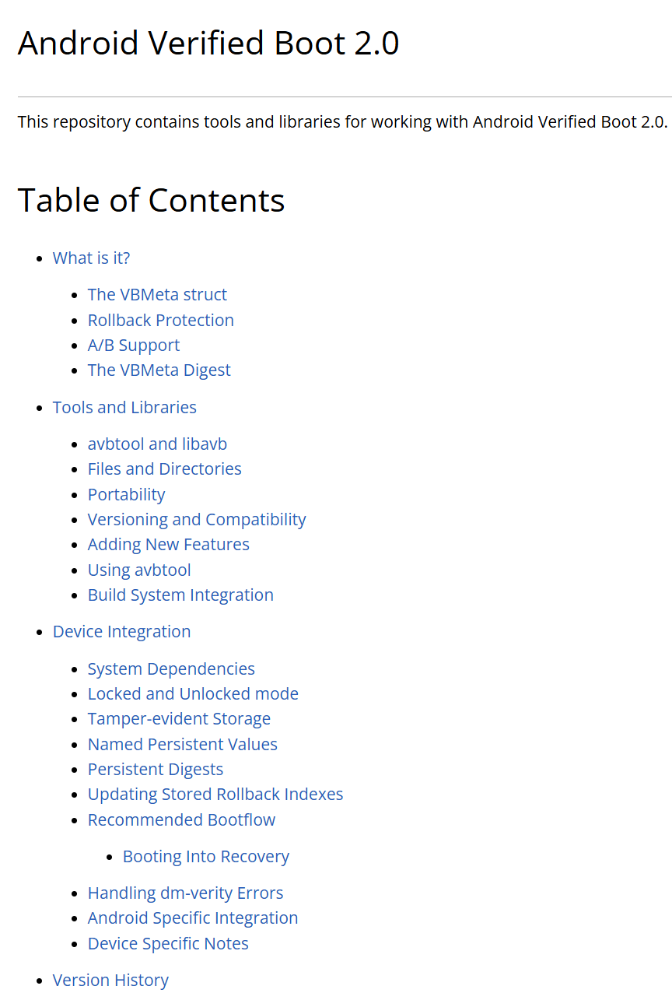

# 20250323-Android AVB 分析（一）AVB 到底该如何学习？

要回答 AVB 该如何学习，首先就需要知道 AVB 是什么？AVB 都包含哪些方面？

## 1. AVB 是什么？

AVB(Android Verified Boot) 到底是什么？

一句话解释：

从 AVB(Android Verified Boot) 字面意思看，就是 Android 启动过程(boot) 是经过验证的(Verified)，因此启动后进入的是一个授权的，未经破坏的环境。

两句话解释：

Android Verified Boot (AVB) 是一种 Android 系统的安全特性，旨在确保设备在启动时执行的代码和数据未被篡改，保护设备免受恶意攻击和漏洞。它通过建立从硬件到软件的信任链，验证每个启动阶段的完整性和真实性。

## 2. AVB 包含哪些东西？

从上一节的解释我们看到，Android Verified Boot（AVB）是Android操作系统中的核心安全特性，通过信任链、镜像签名和验证、dm-verity、FEC、回滚保护等机制，确保设备在启动时执行的代码和数据完整且可信，防止恶意篡改或数据损坏。

以下是AVB涉及的各个方面，包括信任链、镜像签名、dm-verity、FEC、回滚机制等。

> AVB 涉及的这些内容对没有安全基础，第一次接触的同学来说，很多术语会很陌生，理解起来会有一定的难度，需要不断熟悉 AVB 的代码和流程，然后总结，再回头过来印证和体会。

### 2.1 信任链与根信任

AVB 建立了一个完整的信任链，从硬件保护的根信任（通常由设备的安全芯片或 Trusted Execution Environment, TEE提供）开始，延伸到引导加载程序（bootloader）、引导分区（boot partition）以及其他被验证的分区（如system、vendor、oem）。这一链条确保每个阶段的代码和数据在执行前经过验证，防止攻击者在启动过程中注入恶意代码。例如，[Verifying Boot | Android Open Source Project ](https://source.android.com/docs/security/features/verifiedboot/verified-boot)详细描述了从硬件到软件的信任传递。

| **阶段**     | **验证对象**     | **验证方式**            |
| ------------ | ---------------- | ----------------------- |
| 硬件根信任   | 安全芯片或TEE    | 硬件固化，初始信任源    |
| 引导加载程序 | Bootloader代码   | 签名验证，哈希对比      |
| 引导分区     | 内核和ramdisk    | 完整加载内存，哈希验证  |
| 系统分区     | System、Vendor等 | dm-verity哈希树持续验证 |

信任链的建立是AVB安全性的基础，从Android 4.4引入，逐步演进为严格的验证机制。

### 2.2 镜像签名与验证

AVB要求所有可执行代码和数据在使用前进行加密验证，包括内核（从boot分区加载）、设备树（dtbo分区）、system分区和vendor分区等。验证过程分为两种情况：

- **小分区（如boot、dtbo）**：将整个分区内容加载到内存，计算哈希值并与预期哈希值比较。如果不匹配，设备将无法加载，详见[Verifying Boot | Android Open Source Project](https://source.android.com/docs/security/features/verifiedboot/verified-boot)。
- **大分区（如file system）**：使用dm-verity驱动，通过哈希树进行持续验证，运行时计算根哈希并与预期值对比。如果不匹配，进入错误状态。

哈希值通常存储在分区末尾或专用分区中，并由根信任签名，确保不可篡改。

### 2.3 dm-verity与分区完整性

dm-verity是AVB中验证大分区（如system、vendor）完整性的关键机制。它将分区划分为4 KiB的块，每个块在读取时通过与签名的哈希树进行比对来验证。如果检测到任何块的完整性损坏（如单字节错误），dm-verity将阻止访问该块，并可能导致设备进入I/O错误（eio）模式，详见[Android verified boot: Enhancing custom OS security](https://emteria.com/blog/android-verified-boot)。这一机制确保了系统分区的只读性和不可篡改性，是AVB安全性的核心组成部分。

### 2.4 FEC（前向纠错）

FEC是Android 7.0引入的增强特性，用于提高dm-verity的鲁棒性，应对非恶意数据损坏。根据[Android Developers Blog: Strictly Enforced Verified Boot with Error Correction](https://android-developers.googleblog.com/2016/07/strictly-enforced-verified-boot-with.html)，FEC通过纠错码（如Reed-Solomon码）能够检测并纠正数据中的错误，例如在255位中纠正1位未知错误。dm-verity使用交织（interleaving）技术，能够从多个4 KiB源块的丢失中恢复。这一机制减少了数据损坏对系统功能的影响，尤其在固态存储设备上效果显著。

| **FEC特性** | **描述**                                | **影响**                 |
| ----------- | --------------------------------------- | ------------------------ |
| 纠错能力    | 纠正1位错误/255位，或更高配置可纠正16位 | 增强数据鲁棒性           |
| 交织技术    | 恢复多个块丢失                          | 提高系统对损坏的容错能力 |
| 性能开销    | 解码较慢，仅在损坏时触发                | 对正常使用影响小         |

FEC的引入使得AVB在严格验证的同时，兼顾了实际使用中的容错需求。

### 2.5 回滚保护机制

回滚保护是AVB防止设备安装旧版本Android的关键机制，旨在避免已知漏洞被利用。每个分区（如system、vendor）都有一个回滚索引（rollback index），存储在不可篡改的存储中（如RPMB，Replay Protected Memory Block）。更新时，回滚索引会递增，确保设备只能安装更高版本的Android。如果尝试安装低版本，AVB将拒绝启动，详见[Verified Boot | Android Open Source Project](https://source.android.com/security/verifiedboot)。这一机制从Android 8.0开始得到强化，进一步提高了安全性。

### 2.6 错误处理与用户通知

如果验证失败，AVB的错误处理取决于设备实现：

- **启动时失败**：设备无法启动，需要通过恢复模式（recovery）进行修复。
- **运行时失败**：如果dm-verity处于restart模式，设备将重启并进入I/O错误（eio）模式，直到更新为止。在此模式下，设备显示错误屏幕，应用程序访问受限，但允许数据恢复或系统更新，详见[Verifying Boot | Android Open Source Project](https://source.android.com/docs/security/features/verifiedboot/verified-boot)。

用户通知是AVB的重要部分。如果检测到操作系统被修改，AVB会在启动时显示黄色警告屏幕，告知用户问题并提供解决方案（如恢复或更新），尤其在LOCKED设备上使用自定义根信任时，详见[Boot Flow | Android Open Source Project](https://source.android.com/docs/security/features/verifiedboot/boot-flow)。

### 2.7 只读分区与安全要求

AVB要求system和vendor等关键分区必须是只读的，以确保其完整性。读-only分区防止了这些分区的修改，从而避免了恶意篡改或意外损坏，详见[Android verified boot: Enhancing custom OS security](https://emteria.com/blog/android-verified-boot)。这一要求对开发者和用户都有深远影响，例如限制了自定义ROM的灵活性。

### 2.8 TEE集成与高级安全

在某些实现中，AVB与Trusted Execution Environment (TEE)集成，用于增强安全性。TEE使用AVB的验证状态作为输入，管理磁盘加密密钥和硬件支持的密钥存储（keystore）。此外，TEE还利用AVB的验证状态和OS版本信息，提供间接的验证强制和降级保护，支持远程证明（remote attestation），允许设备向外部实体证明其验证状态，详见[Verified boot / remote attestation - Copperhead](https://copperhead.co/android/docs/verified_boot)。

### 2.9 模式演进

AVB的模式随Android版本的演进而变化：

- **Android 4.4**：引入AVB，OEM可以启用。
- **Android 6.0**：切换到"Warning"模式，设备在检测到问题时警告用户，同时要求AES加密性能>50MiB/秒支持完整功能，详见[Android-Security-Reference/boot/verified_boot.md at master · doridori/Android-Security-Reference](https://github.com/doridori/Android-Security-Reference/blob/master/boot/verified_boot.md)。
- **Android 7.0**：切换到"Enforcing"模式，严格执行验证，设备在检测到问题时可能无法启动或功能受限。
- **Android 9.0**：AVB成为强制要求，所有新设备必须支持，详见[Android Security Features | Android Open Source Project](https://source.android.com/docs/security/features)。

## 3. AVB 该怎么学？

以下是我学习 Android AVB 的一些想法。

关于程序，从宏观上看，程序由数据和围绕数据的一系列操作构成，所谓的操作主要是数据的增删改查，在类似 Android 这样的系统中，还包括配置和编译。

对于 Android AVB 机制也不例外，AVB 的目的是验证启动中的每一个环节，包括：

1. 芯片 ROM 验证 bootloader (芯片厂家和 OEM 完成);
2. bootloader 验证 Android boot 和 vbmeta 等分区 (通过集成 libavb 完成)；
3. bootloader 将 verity 相关参数传递给 linux，在启动时创建 dm-verity 设备，用于运行时验证 system, vendor 等大分区，确保没有被篡改。

通过这 3 个步骤，确保 Android 启动后运行的是一个没有被篡改的安全环境。

因此，在启动过程中，

1. 芯片ROM使用什么数据验证 bootloader?
2. bootloader 使用什么数据验证 boot 和 vbmeta 等分区？
3. Android 系统使用什么数据来创建 dm-verity 以及保证 system 和 vendor 等分区的完整性？

所以这里就涉及到 3 个数据：

1. bootloader 的签名数据；
2. boot, vbmeta 等小分区的 vbmeta 数据；
3. system, vendor 等大分区的 vbmeta 和 hashtree, 以及 FEC 数据；

bootloader 的签名数据由芯片厂家提供方案，OEM 厂家确保实施。

对于 Android 官方提到的 AVB，主要集中在后两个数据的操作，即小分区和大分区相应的 vbmeta, hash, hashtree, FEC 等数据的操作上。

所有的一切都是围绕这些 vbmeta 相关数据的生成和使用上。

在具体流程上包括：

1. 配置：配置 Android 源码，打开 AVB 相关特性；
2. 生成：编译 Android 源码，生成带有 vbmeta 数据的安卓镜像；
3. 使用：将 Android 镜像写入到设备，在启动时使用这些数据进行验证，包括 bootloader 验证 boot，以及 Android 启动后验证 system, vendor 等；

所以，学习路径就是了解 AVB 的配置，熟悉 AVB 数据(vbmeta)在 Android 镜像上的布局，以及了解在启动过程中如何用镜像中的 AVB 数据去验证不同种类的 boot 和 system 等分区。

网上大部分 AVB 的文章一般都会将 AVB 的配置作为重点进行详细分析，而且 Android 官方文档也有这块的详细介绍。所以我并不打算一开始就十分详细介绍 AVB 配置。而是直接下载一个 Android 设备源码进行编译，分析编译 log 中用于处理镜像的指令，来了解 AVB 数据的生成，最终了解各种镜像的布局。

在生成带有 AVB 数据的镜像上，手动解析和验证镜像的布局，以及 vbmeta 数据来增进理解。

具体细节上，包括如何生成镜像的 hash, hashtree, fec，如何使用 hashtree 和 fec 创建带有 FEC 纠错的 dm-verity 设备来保护系统等。

有了这些背景之后，再回到 Android 代码上，重新理解 Android 对 AVB 相关数据的使用就比较简单了。

因此，理解的重点在于 AVB 数据的构成，以及使用。而不是一开始就拘泥于具体的 Android 代码。

换个角度来说，AVB 只是各种启动时信任链的一种。

而且，假设有那么一天需要你在另外一个系统上实现类似 AVB 机制，相信你更胸有成竹。这其实是高于 Android AVB 的一个理解层次。

## 4. AVB 学习参考资料推荐

Android 从 2015 年开始推出 AVB，到现在 10 个年头，网上可以参考的资料非常多。

这里列举一些我参考，我看过，以及我觉得比较重要的 AVB 参考资料

1. Android 官方的 Verify Boot 文档

   推荐直接看英文版：

   - https://source.android.com/docs/security/features/verifiedboot?hl=zh-cn

   同时也有中文版：

   - https://source.android.com/docs/security/features/verifiedboot?hl=zh-cn

   这个是学习 AVB 的官方一手资料，建议是先看英文版，再看中文版，不理解的地方再回看英文版，逐句进行对照。

   

   官方文档比较从比较高的角度讲述了 AVB 涉及的内容，有些内容一时难以读懂，例如一些特性几句话就带过了，一开始很容易被忽略，需要在学习时反复阅读。

   

2. AVB 本地 ReadMe 文档

   本地文件位于 Android 源码的：

   - external/avb/README.md

   或者查看在线版本

   - https://android.googlesource.com/platform/external/avb/+/master/README.md

   

   和 Android 官方网站的文档不同，这份 AVB 文档侧重于一些细节，例如 VBMeta 结构的介绍，回滚特性 Rollback，avbtool 工具，以及 libavb 源码的目录结构。

   对于这份本地文档，如果你阅读后很多内容无法理解，可以先尝试接触代码，编译，运行，拿到系统镜像后，再配合这份文档进行验证，深入理解。

   

3. 《Android AVB 分析》专栏

   这是我的 Android AVB 分析专栏，到目前为止规划了 20~25 篇，已经完成 17 篇。从具体的镜像使用的角度实战 AVB 特性。

   - https://blog.csdn.net/guyongqiangx/category_12847685.html

   网上现有专栏大部分都还处在介绍 AVB 编译配置，以及 libavb 验证 boot 分区和 Android 启动时如何加载 system 分区的阶段。对于学习 AVB 的基本原理这些文章也基本够了，但是如果要深入 AVB 的细节，徒手实战 hash, hashtree, fec 纠错，签名校验，以及回滚分析等，还是得看本专栏。

   尤其是 Android FEC 纠错，在我的 OTA 群有很多人问这个，大部分都不清楚 FEC 愿意，FEC 如何工作，FEC 如何进行交织编码，本专栏是全网目前唯一个详细分析 Android 镜像 FEC 交织编码以及纠错实战的专栏。

   理解了 Android 中 FEC 纠错，你就发现，dm-verity 对 FEC 纠错的设计真是精妙，以极小的代价，极大提高了系统镜像的稳定性。

   

   虽然本专栏基本以实战为主，但是我仍然建议你在阅读完前面第 1 ，2 条的官方文档基础上再深度阅读本专栏，毕竟本专栏也只是个人理解的二手材料。

   

4. 网上的其它 AVB 分析参考专栏和文章

   CSDN 上也有不少分析介绍 AVB 的专栏，各位可以自行百度。

   

5. 其它参考文章

   - https://emteria.com/blog/android-verified-boot
   - https://www.starlab.io/blog/dm-verity-in-embedded-device-security
   - https://android-developers.googleblog.com/2016/07/strictly-enforced-verified-boot-with.html

   如果您发现有其他不错的参考文章，也欢迎在留言区推荐，或加群一起讨论。

   

6. Android AVB 讨论群

   这是我创建的一个 Android AVB 学习交流群，里面目前有 100+ 人一起交流学习(吐槽)。一个人学习可能会很孤独，但一群人一起交流(互助，吹水)很热闹。

## 5. 其它

我创建了一个 Android AVB 讨论群，主要讨论 Android 设备的 AVB 验证问题。

我还有几个 Android OTA 升级讨论群，主要讨论 Android 设备的 OTA 升级话题。

欢迎您加群和我们一起交流，请在加我微信时注明“Android AVB 交流”或“Android OTA 交流”。

仅限 Android 相关的开发者参与~

> 公众号“洛奇看世界”后台回复“wx”获取个人微信。

