# 20230922-Android Update Engine 分析（二十二）OTA 降级限制之 timestamp

## 0. 导读

在我的 OTA 讨论群以及 VIP 答疑群里每隔一段时间就会有人问关于 OTA 降级，以及升级时检查 max_timestamp 失败的问题。我觉得有必要把这个问题总结一下。因此，本篇详细分析 OTA 升级时检查 max_timestamp 失败的原因，以及 max_timestamp 的整个处理流程。

本文主要分成 5 个部分：

- 如果你只对检查 max_timestamp 失败的原因以及解决办法感兴趣，请跳转到第 1 节；
- 如果你对 Android 引入 max_timestamp 的历史感兴趣，请跳转到第 2 节；
- 如果你想了解整个 max_timestamp 的处理流传流程，请跳转到第 3 节查看一步一步详细的代码分析；
- 如果你觉得第 3 节太啰嗦，请跳转到第 4 节查看 max_timestamp 操作流程总结；
- 如果你想知道如何将 timestamp 转换成有意义的时间，请跳转到第 5 节；
- 如果你想挑战一下自己，不妨看看第 6 节的几个思考题；


> 本文为洛奇看世界(guyongqiangx)原创，转载请注明出处。
>
> 原文链接：https://blog.csdn.net/guyongqiangx/article/details/133191750

> 本文基于 android-13.0.0_r3 代码进行分析，在线代码阅读请参考：http://aospxref.com/android-13.0.0_r3/


每写一篇文章，我还是忍不住将这一系列的所有文章列举出来，方便你快速导航。

> 核心代码[《Android Update Engine 分析》](https://blog.csdn.net/guyongqiangx/category_12140296.html)系列，文章列表：
>
> - [Android Update Engine分析（一）Makefile](https://blog.csdn.net/guyongqiangx/article/details/77650362)
>
> - [Android Update Engine分析（二）Protobuf和AIDL文件](https://blog.csdn.net/guyongqiangx/article/details/80819901)
>
> - [Android Update Engine分析（三）客户端进程](https://blog.csdn.net/guyongqiangx/article/details/80820399)
>
> - [Android Update Engine分析（四）服务端进程](https://blog.csdn.net/guyongqiangx/article/details/82116213)
>
> - [Android Update Engine分析（五）服务端核心之Action机制](https://blog.csdn.net/guyongqiangx/article/details/82226079)
>
> - [Android Update Engine分析（六）服务端核心之Action详解](https://blog.csdn.net/guyongqiangx/article/details/82390015)
>
> - [Android Update Engine分析（七） DownloadAction之FileWriter](https://blog.csdn.net/guyongqiangx/article/details/82805813)
>
> - [Android Update Engine分析（八）升级包制作脚本分析](https://blog.csdn.net/guyongqiangx/article/details/82871409)
>
> - [Android Update Engine分析（九） delta_generator 工具的 6 种操作](https://blog.csdn.net/guyongqiangx/article/details/122351084)
>
> - [Android Update Engine分析（十） 生成 payload 和 metadata 的哈希](https://blog.csdn.net/guyongqiangx/article/details/122393172)
>
> - [Android Update Engine分析（十一） 更新 payload 签名](https://blog.csdn.net/guyongqiangx/article/details/122597314)
>
> - [Android Update Engine分析（十二） 验证 payload 签名](https://blog.csdn.net/guyongqiangx/article/details/122634221)
>
> - [Android Update Engine分析（十三） 提取 payload 的 property 数据](https://blog.csdn.net/guyongqiangx/article/details/122646107)
>
> - [Android Update Engine分析（十四） 生成 payload 数据](https://blog.csdn.net/guyongqiangx/article/details/122753185)
>
> - [Android Update Engine分析（十五） FullUpdateGenerator 策略](https://blog.csdn.net/guyongqiangx/article/details/122767273)
>
> - [Android Update Engine分析（十六） ABGenerator 策略](https://blog.csdn.net/guyongqiangx/article/details/122886150)
>
> - [Android Update Engine分析（十七）10 类 InstallOperation 数据的生成和应用](https://blog.csdn.net/guyongqiangx/article/details/122942628)
>
> - [Android Update Engine分析（十八）差分数据到底是如何更新的？](https://blog.csdn.net/guyongqiangx/article/details/129464805)
>
> - [Android Update Engine分析（十九）Extent 到底是个什么鬼？](https://blog.csdn.net/guyongqiangx/article/details/132389438)
>
> - [Android Update Engine分析（二十）为什么差分包比全量包小，但升级时间却更长？](https://blog.csdn.net/guyongqiangx/article/details/132343017)
>
> - [Android Update Engine分析（二十一）Android A/B 的更新过程](https://blog.csdn.net/guyongqiangx/article/details/132536383)
>
> - [Android Update Engine分析（二十二）OTA 降级限制之 timestamp](https://blog.csdn.net/guyongqiangx/article/details/133191750)

> 如果您已经订阅了本专栏，请务必加我微信，拉你进“动态分区 & 虚拟分区专栏 VIP 答疑群”。

## 1. 从 timestamp 的升级错误说起

### 1.1 错误原因

先从很多很多年前在我的 OTA 讨论群里的一个升级错误说起：

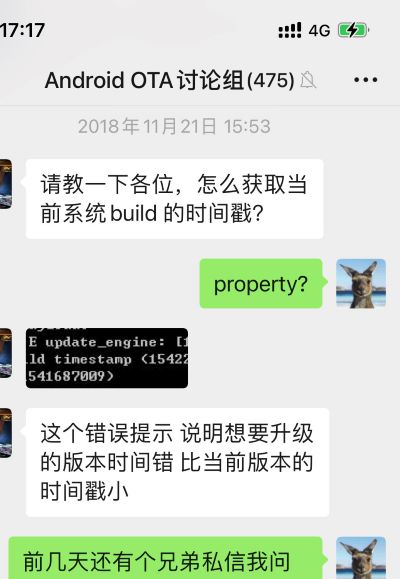

图 1. OTA 讨论群中关于 max_timestamp 升级错误的讨论


这里具体的错误信息如下：

```bash
update_engine: [1105/000053:ERROR:delta_performer.cc<1478>] The current OS build timestamp <1542293913> is newer than the maximum timestamp in the manifest <1541687009>
```

这个错误的意思是：

当前运行系统的编译时间戳(1542293913，即 Nov 15, 2018, 2:58:33 PM)，和 Payload 中 manifest 的时间戳(1541687009，即 Nov 8, 2018, 2:23:29 PM)相比，显然当前系统的编译时间比 OTA 包中的时间要新(newer)。


想象一下这个问题是如何发生的：

1. 代码在 t1 时间编译，我们把该时间点的系统叫做 A，编译后将镜像写入到设备中成了当前运行的系统 A。

2. 修改代码，在 t2 时间编译生成了系统 B 的镜像，紧接着使用系统 B 的镜像对系统 A 的镜像进行差分制作升级包，得到 payload 文件。

3. 使用 payload 文件对当前的系统 A 进行升级，得到系统 B。

4. 升级时系统 A 检查 payload 文件的时间戳，发现当前系统 A 的时间竟然比 payload 中的时间还要新~

明明是先编译的系统 A，之后再制作的升级包，怎么可能系统的编译时间比升级包的时间还要新呢？这完全没有道理哈。一定是哪里搞错了，于是本文前面提到的这个错误就发生了。


这个错误来自 `system/update_engine/payload_consumer/delta_performer.cc` 文件中的一段代码:


图 2. Update Engine 代码中检查 max_timestamp


其作用是，如果当前系统的编译时间戳(系统 A，通过 GetBuildTimestamp() 获取)比升级的目标系统时间戳(系统 B，即这里的 max_timestamp)还要新的话，打印这里的提示信息:

```
The current OS build timestamp <1542293913> is newer than the maximum timestamp in the manifest <1541687009>
```

> 背景知识：
>
> manifest 中的 max_timestamp 实际上是制作升级包时，所使用的源(source) 或目标(target) 系统的编译时间戳。


紧接着，如果当前系统不允许降级的话，则返回 kPayloadTimestampError 错误。

如果当前系统允许降级操作，则打印提示信息:

```bash
The current OS build allows downgrade, continuing to apply the payload with an older timestamp.
```


显然，真有一种当前系统的时间比 payload 中的时间还要新的可能，那就是降级操作，我们后面详细展开说明。

在 Android 12 以后的代码中，`hardware_->AllowDowngrade()` 检查的逻辑判断已经改到外层函数中了，不过总体思路仍然一样。


### 1.2 解决办法

知道了错误的原因，解决方法自然就有了。

方法一：注释掉对时间戳的检查判断，不管时间戳如何，都继续往下

其实就是干掉提出问题的那个人，谁提出问题就干掉谁。你懂的。

```c++
  if (manifest_.max_timestamp() < hardware_->GetBuildTimestamp()) {
    LOG(ERROR) << "The current OS build timestamp ("
               << hardware_->GetBuildTimestamp()
               << ") is newer than the maximum timestamp in the manifest ("
               << manifest_.max_timestamp() << ")";
    // if (!hardware_->AllowDowngrade()) {
    //   return ErrorCode::kPayloadTimestampError;
    // }
    LOG(INFO) << "The current OS build allows downgrade, continuing to apply"
                 " the payload with an older timestamp.";
  }
```

这里没有将这段代码全部注释掉，主要是还是想在 log 中看到这段警告信息。

当然，完全可以将整段代码都注释掉，看个人喜欢。


方法二：重新编译系统 B 并使用新系统 B 制作差分包

通过重新编译系统，使得目标系统的时间戳比当前系统的时间戳新。


## 2. timestamp 的提交信息

通过 `max_timestamp` 基于时间戳的升级限制，最初在 2017 年 10 月加入到 update engine 中，以下是当初的提交历史记录。


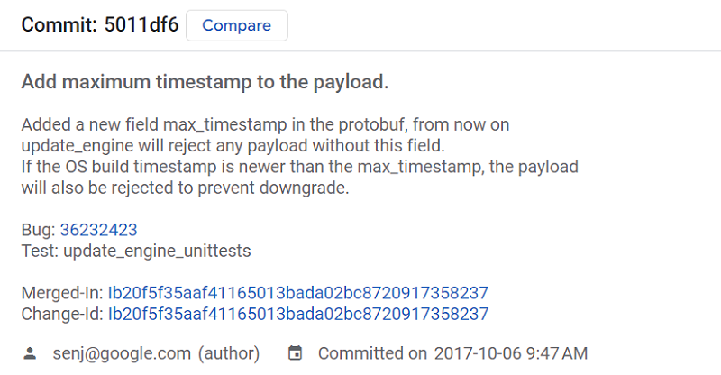

图 3. max_timestamp 的提交信息


详细的 commit 内容可以通过以下链接查看: 

https://cs.android.com/android/_/android/platform/system/update_engine/+/5011df680621eb477cad8b34f03fba5b542cc2f9


从这里的提交描述可以看到，引入 max_timestamp 进行时间戳检查，如果当前运行系统的编译时间比 max_timestamp 新(max_timestamp 实际上是目标系统的编译实践)，payload 数据将被拒绝升级来阻止降级操作。


## 3. timestamp 的作用流程

这部分我将通过阅读代码的方式详细分析 max_timestamp 的作用流程，如果你对这部分不感兴趣，请直接跳过。

### 3.1 引用 max_timestamp 的 7 个地方

我了方便，我直接基于http://aospxref.com/android-13.0.0_r3/ 阅读 Android 13 的代码。

在代码中搜索 `max_timestamp`，大概被以下 7 个文件引用：

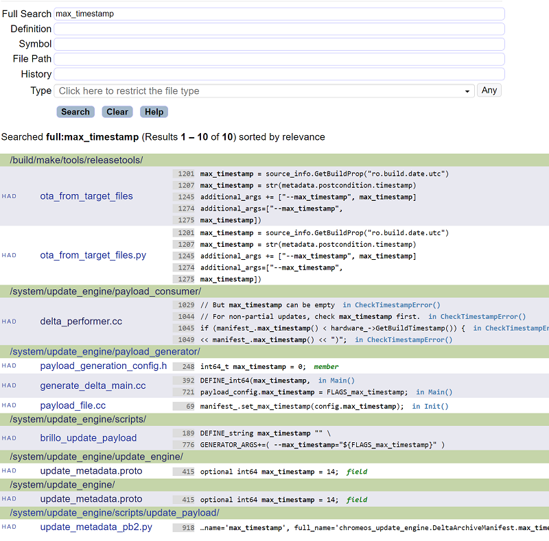

图 4. Android 中引用 max_timestamp 的几个地方


> 为了减少不相干结果的干扰，我这里的搜索工程包括: bootable, build, device, hardware, system，你也可以在整个 Android 代码中搜索，然后再排除一些完全不相干的工程。

虽然结果显示是 10 个，但第 1、2 项的 `ota_from_target_files` 和 `ota_from_target_files.py` 实际上是同一个文件，倒数第 2、3 个结果都是 max_timestamp 的定义，倒数第 1 个是 protobuf 编译结果，所以最终引用的地方大概 7 个。这 7 个引用 max_timestamp 的地方包括：

1. update_metadata.proto 中定义 max_timestamp
2. ota_from_target_files 工具中处理 max_timestamp
3. brillo_update_payload 工具中处理 max_timestamp
4. delta_generator 工具(payload_generator 编译生成的可执行应用)中处理 max_timestamp
   - generate_delta_main.cc 中处理 max_timestamp
   - payload_file.cc 中写入 max_timestamp
5. delta_performer.cc 中检查 max_timestamp


下面根据 max_timestamp 时间戳的定义，生成和使用的数据流转流程来详细分析代码。


### 3.2 max_timestamp 的定义

`max_timestamp` 定义在 `system/update_engine/update_metadata.proto` 文件中，并附带了一段注释：

```protobuf
// The maximum timestamp of the OS allowed to apply this payload. 
// Can be used to prevent downgrading the OS.
optional int64 max_timestamp = 14;
```

从代码的注释看，一句话：**max_timestamp 的引入就是用于阻止系统降级**。

再结合最初提交这个 commit 的说明，更清楚的说明了 `max_timestamp` 的用途。

```
Add maximum timestamp to the payload.

Added a new field max_timestamp in the protobuf, from now on
update_engine will reject any payload without this field.
If the OS build timestamp is newer than the max_timestamp, the payload
will also be rejected to prevent downgrade.
```

这个提交说明阐述了两点：

1. protobuf 中新增加了 max_timestamp 字段，从现在开始，update_engine 将拒绝任何不带有 max_timestamp 的 payload 用于升级。（换句话说，不再向后兼容）
2. 如果当前系统的编译时间比 max_timestamp 新，payload 会被拒绝来阻止降级操作。(之后的代码新增了一个判断条件 `if (!hardware_->AllowDowngrade())`，当系统不允许降级的时候，生成错误终止操作)


### 3.3 ota_from_target_files 工具


在使用 ota_from_target_files 工具制作升级包时，根据当前要制作的 OTA 包是降级还是升级，使用不同的方式获取 max_timestamp：

- 如果是降级操作，则直接获取 source 镜像名为 "ro.build.date.utc" 的Build Property 数据作为时间戳；

- 如果不是降级操作，则获取一个 metadata 变量数据的 postcondition.timestamp 作为时间戳；

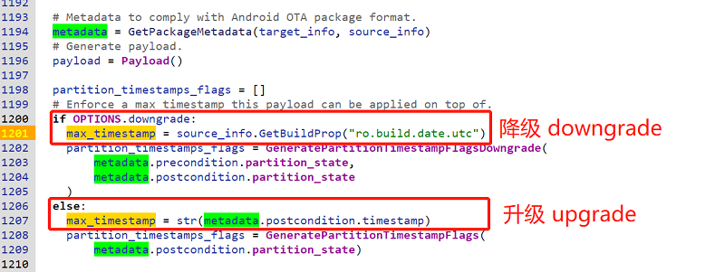

图 5. 根据升级还是降级提取 max_timestamp


并将 max_timestamp 传递给 payload.Generate() 操作：

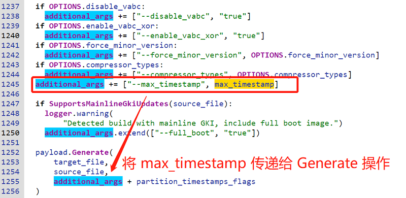

图 6. 将 max_timestamp 传递给 payload.Generate() 函数


payload 类的 Generate() 操作再把 max_timestamp 原样传递给 brillo_update_payload 工具的 generate 操作：

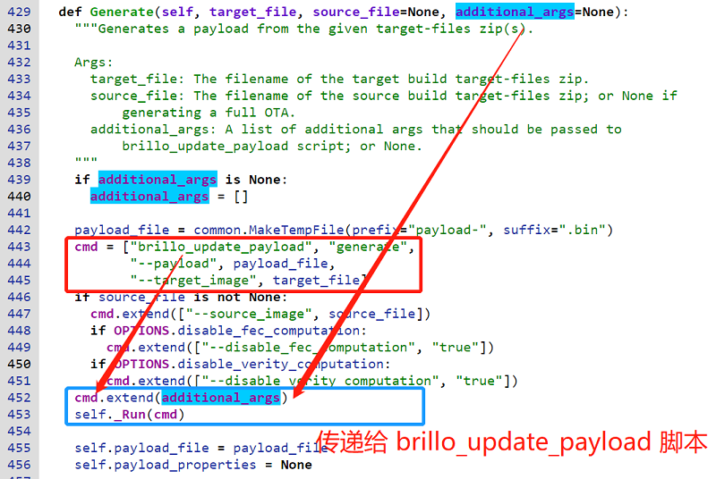

图 7. 将 max_timestamp 传递给 brillo_update_payload 脚本


所以，ota_from_target_files 工具的作用就是生成 max_timestamp 参数并传递给 brillo_update_payload 工具，因为后者是生成 OTA 相关数据的实际负责人。


你可能会问，前面提到降级时的 max_timestamp 来自 source 分区 Build Property 数据("ro.build.date.utc")，那升级的时候 max_timestamp 是如何生成的呢？我们不妨深入生成 metadata 的函数 GetPackageMetadata() 看看。


原来，GetPackageMetadata() 的目的就是生成类型为 OtaMetadata 的数据，该数据定义在文件 `build/make/tools/releasetools/ota_metadata.proto` 中，从数据结构定义处的注释可以看到，OtaMetadata 是用于描述 OTA package 的 metadata (千万不要和描述 payload 文件的 metadata 搞混淆了)，包含了 package 的信息，以及安装该更新包的前提要求。OtaMetadata 的具体结构请自行转到定义文件查看。


回到 GetPackageMetadata() 函数，这里使用 target_info 包来更新 metadata.postcondition 数据。

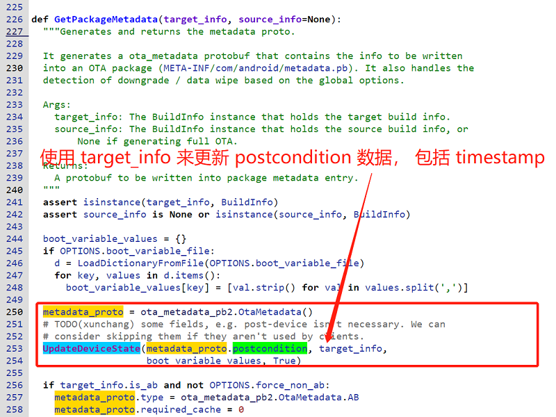

图 8. 在 GetPackageMetadata 中生成 metadata_proto


metadata.postcondition 是一个 DeviceState 类型的数据，其中包含 max_timestamp，在 UpdateDeviceState() 函数中，使用 target_info 的名为 "ro.build.date.utc" 的 Build Property 数据来设置 timestamp。

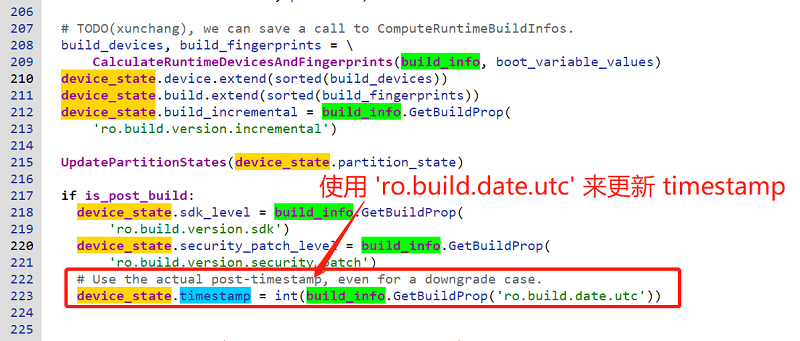

图 9. 从 Build Property 的 "ro.build.date.utc" 属性提取 timestamp


这就巧了：

- 对于降级的情况，使用 source 槽位镜像中 Build Property 数据 "ro.build.date.utc" 数据设置 timestamp
- 对于升级的情况，使用 target 槽位镜像中 Build Property 数据的 "ro.build.date.utc" 数据设置 timestamp


我们再来看看具体的 "ro.build.date.utc" 数据到底长什么样？

```bash
android-13.0.0_r41/out$ grep -rnw utc dist-new/build.prop
11:ro.system.build.date.utc=1692116768
41:ro.build.date.utc=1692116768
```

这里的 "ro.build.date.utc" 的值为 1692116768，转换成 UTC 时间为 "2023-08-15 04:26:08 PM"，也就是我这里 dist-new 的系统编译实践。


总结一下 ota_from_target_files  工具中关于 max_timestamp 的操作：

对于降级和升级的不同场景下，分别获取 source 槽位或 target 槽位 Build Property 数据中的 "ro.build.date.utc"，用来设置 max_timestamp 参数，并将其传递给调用的 brillo_update_payload  工具。


这里是我之前制作升级包的 log，从中可以看到调用 brillo_update_payload 工具的原始命令：

```bash
2023-08-16 21:32:16 - common.py - INFO    :   Running: "/local/public/users/rocky/android-13.0.0_r41/out/host/linux-x86/bin/brillo_update_payload generate --payload /tmp/payload-bt7o2beq.bin --target_image out/dist-new/aosp_panther-target_files-eng.rocky.zip --source_image out/dist-old/aosp_panther-target_files-eng.rocky.zip --enable_zucchini true --enable_lz4diff false --disable_vabc true --max_timestamp 1692116768 --partition_timestamps init_boot:1692116768,product:1692116768,system:1692116768,system_dlkm:1692116768,system_ext:1692116768"
```

可以看到，这里传递的 max_timestamp 参数为：`--max_timestamp 1692116768`，刚好就是前面在 `dist-new/build.prop` 文件中搜索到的内容。


### 3.4 brillo_update_payload 工具


上一节提到了 ota_from_target_files  中生成 max_timestamp 参数，并将其传递给 brillo_update_payload 工具的 generate 操作。

其实 brillo_update_payload 中对 max_timestamp 参数的处理非常简单，接收到该参数后，进一步将参数原样传递给下一层的 delta_generator 工具。

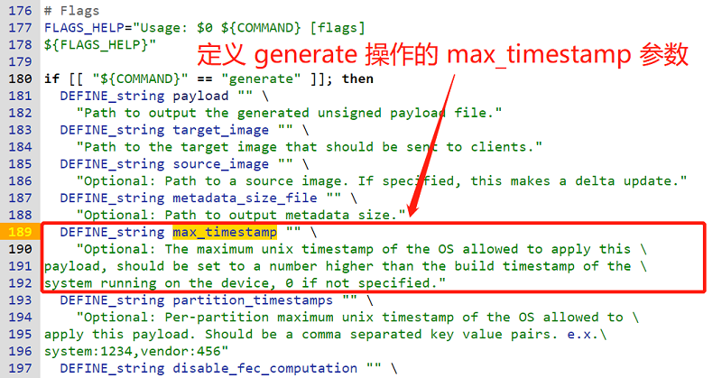

图 10. brillo_update_payload 中定义针对 generate 操作的 max_timestamp 参数


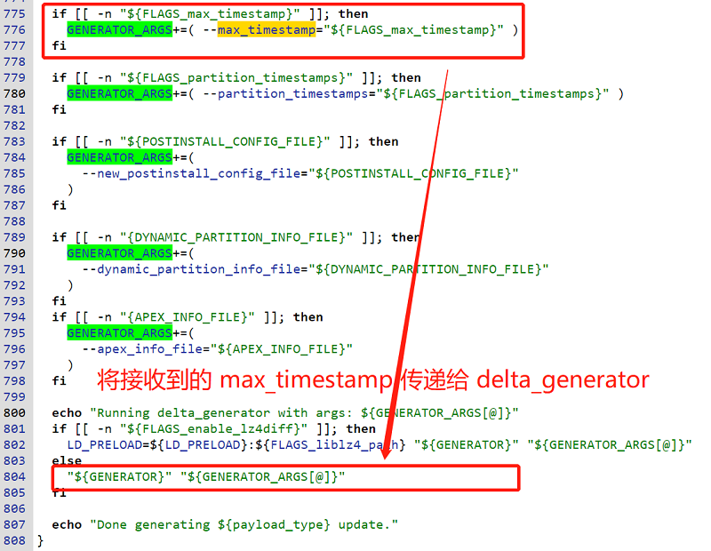

图 11. brillo_update_payload 将 max_timestamp 参数传递给 delta_generator


### 3.5 delta_generator 工具


上一节中，brillo_update_payload 作为一个二传手，直接将 max_timestamp 参数转给了 delta_generator 工具。

在 delta_generator  的 Main 函数中(generate_delta_main.cc) 定义了 FLAGS_max_timestamp 参数用于接收 brillo_update_payload 传递的 max_timestamp 参数。


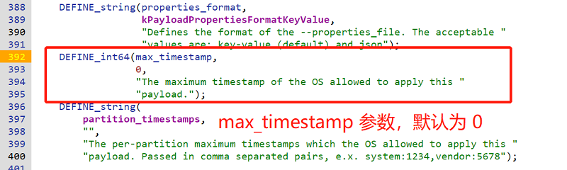

图 12. generate_delta_main.cc 中的 Main 函数中定义 max_timestamp 参数


delta_generator 将解析得到的 FLAGS_max_timestamp 参数保存在 payload_config 中，并将 payload_config 传递给生成 payload 的 GenerateUpdatePayloadFile() 函数：

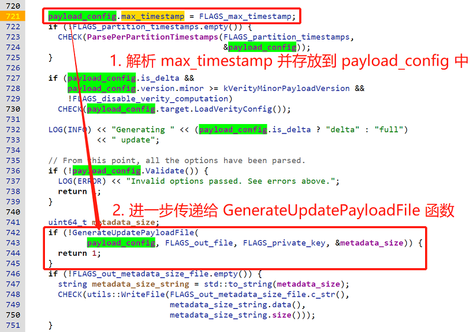

图 13. 包含 max_timestamp 的 payload_config 作为参数传递给 GenerateUpdatePayloadFile() 函数


GenerateUpdatePayloadFile() 函数将接收到的 payload_config 参数传递给 payload.Init() 函数：

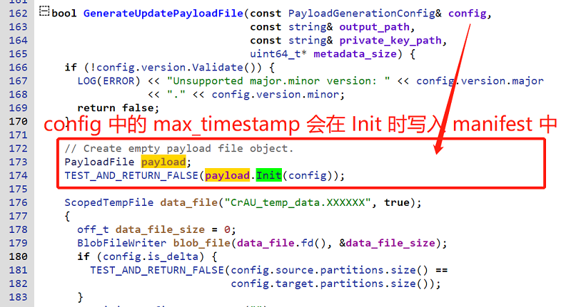

图 14. payload_config 作为参数被传递给 payload.Init() 函数


PayloadFile 的 Init() 操作中，payload_config 中的 max_timestamp 用于设置 manifest 的 max_timestamp 成员结构。

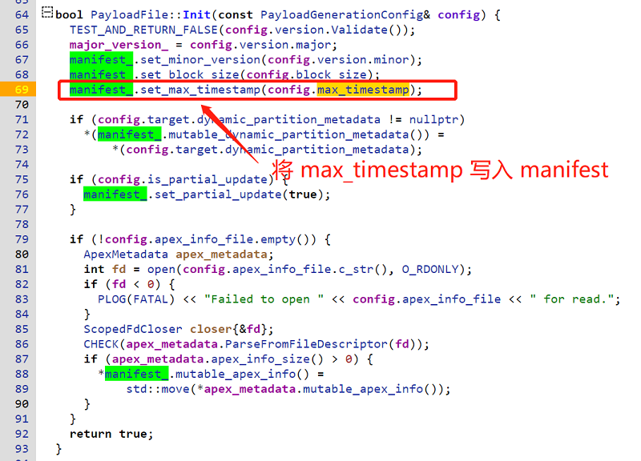

图 15. max_timestamp 被设置到 manifest.max_timestamp 中


在将 payload 数据写入真实文件的 WritePayload() 操作中，manifest 数据被串行化，最终将串行化的数据写入到 payload 文件中。

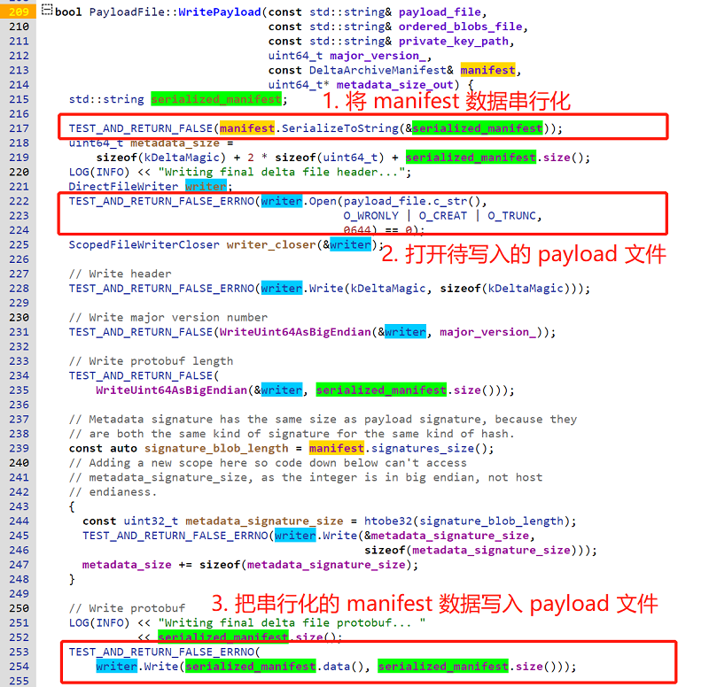

图 16. WritePayload 将 manifest 数据串行化以后输出到 payload 文件中


至此，ota_from_target_files 工具提取的 max_timestamp 数据被写入到 payload 文件中，供升级使用。


### 3.6 delta_performer.cc

OTA 升级中，最最核心的函数就是 DeltaPerformer::Write() 函数了。升级中所有收到的数据都会传递到 DeltaPerformer::Write() 进行检查、验证和写入。


在 DeltaPerformer::Write() 中调用函数 ValidateManifest() 检查接收到的 manifest 数据：

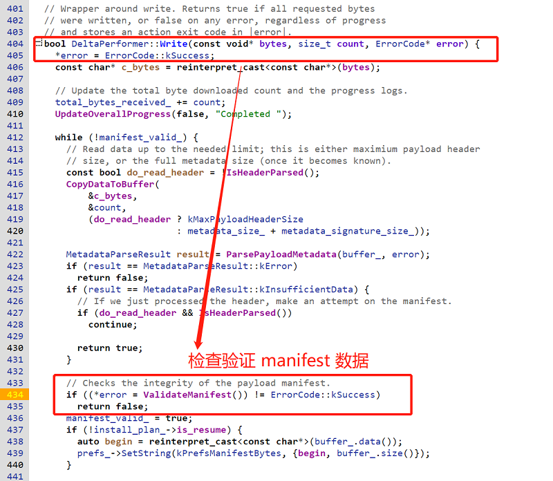

图 17. DeltaPerformer::Write() 函数调用 ValidateManifest() 检查 manifest 数据


ValidateManifest() 函数中有一个 CheckTimeStampError() 操作，用于检查各种 timestamp:

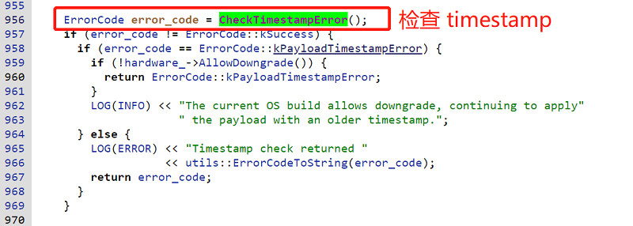

图 18. ValidateManifest() 中调用 CheckTimeStampError() 检查 timestamp


CheckTimeStampError() 函数中，使用 manifest 中的 max_timestamp 和当前系统的编译时间戳进行比较：

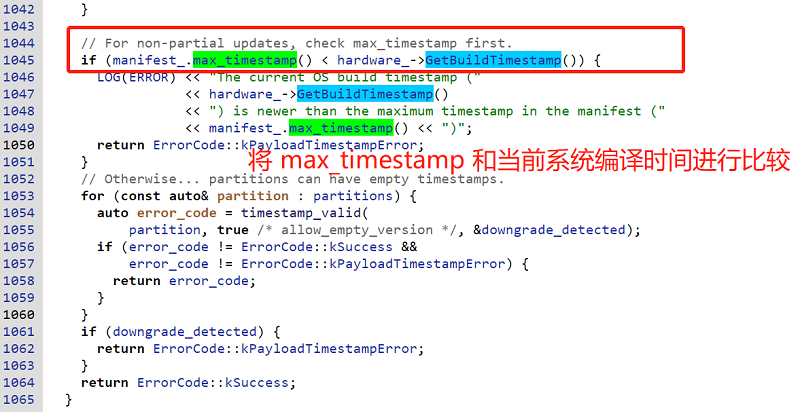

图 19. 检查 manifest 中的 max_timestamp


当前系统的编译时间是如何获取的呢？答案是通过 "ro.build.date.utc" 属性：


图 20. 通过 "ro.build.date.utc" 属性获取系统编译实践


另外，图 20 中也显示了 AllowDowngrade() 函数的源码，通过检查系统属性 "ro.ota.allow_downgrade" 和 "ro.debbuggable"，二者同时都为 true 时，AllowDowngrade() 的返回值才为真。

如果这两个属性中，有任意一个为 false，那系统都处于不可以降级的状态。


总结一下：

Update Engine 接收到升级数据以后，通过 DeltaPerformer::Write() 操作处理接收到的数据，包括检查 manifest 数据。在检查验证 manifest 数据的过程中，会调用 CheckTimeStampError() 函数检查 manifest 中 max_timestamp 的时间戳，将这个时间戳和当前系统的编译时间进行比较。

如果当前系统的编译时间比制作 payload 所用的镜像编译时间戳更新，说明系统在执行降级操作。

如果当前系统不允许降级，此时上报时间戳检查失败信息，升级终止。

只有当系统的 "ro.ota.allow_downgrade" 和 "ro.debuggable" 属性都为 true 时，系统才允许降级，此时系统打印消息 "The current OS build allows downgrade, continuing to apply the payload with an older timestamp."，然后继续进行降级操作。

## 4. max_timestamp 操作流程总结

`max_timestamp` 定义在 `system/update_engine/update_metadata.proto` 文件中，其引入的目的就是升级中通过检查 payload 文件的 manifest 数据里保存的 max_timestamp 信息，阻止系统随意降级，只有在当前系统明确允许降级时，才能通过 OTA 进行降级操作。


具体做法是：

1. 在使用 ota_from_target_files 工具制作升级包时，根据当前要制作的 OTA 包是降级包还是升级包，分别获取 source 槽位或 target 槽位的编译时间戳 (即: Build Property 数据中的 "ro.build.date.utc")，用来设置 max_timestamp 参数，并将其传递给调用的 brillo_update_payload  工具。

2. brillo_update_payload 作为一个二传手，再将 max_timestamp 参数转给了生成 payload 文件的 delta_generator 工具。

3. 在 delta_generator 工具内部，提取 max_timestamp 参数，并存放在 payload_config 结构中。

4. 在生成 payload 数据时，使用 payload_config 结构中的数据初始化 manifest，其中就包括使用 payload_config.max_timestamp 初始化 manifest.max_timestamp。

5. 在将 payload 数据写入到外部的 payload 文件中时，先将 manifest 串行化，然后再把串行化的 manifest 输入写入到 payload 文件中。

经过这样一番操作之后，用于制作升级包的 source 槽位(降级)或 target 槽位(升级) 的编译时间戳 (Build Property 数据的 "ro.build.date.utc") 信息被输出到 payload 文件的 manifest 数据中。

至此，ota_from_target_files 工具提取的 max_timestamp 数据被写入到 payload 文件中，供升级使用。


系统使用 payload 数据升级时，Update Engine 所有接收到的数据都交由 DelterPerformer::Write() 函数处理。

当接收完 manifest 数据后，将其传递给 ValidateManifest() 函数进行检查验证，其中的一个检查操作就是检查 manifest 中包含的各种时间戳。

此时，提取 manifest 中的 max_timestamp 数据，同当前系统的编译时间进行比较。

由于 max_timestamp 来自制作升级包的 source 槽位或 target 槽位的编译时间戳信息，所以用于制作升级包的时间戳信息比当前运行系统的编译时间戳旧，说明系统此时正在进行降级操作。

但此时如果系统明确不支持降级操作，将会生成 kPayloadTimestampError 错误，并终止降级操作。

如果此时系统支持降级操作，则会打印如下的提示消息，并继续进行降级操作。

```
The current OS build allows downgrade, continuing to apply the payload with an older timestamp.
```


系统什么时候支持降级操作呢？需要满足两个条件：属性 "ro.ota.allow_downgrade" 和 "ro.debuggable" 为 true。

只有当系统的 "ro.ota.allow_downgrade" 和 "ro.debuggable" 属性同时为 true 时，系统才允许降级。


为了更好理解 max_timestamp 的整个流程，建议使用 `ota_from_target_files` 工具制作升级包时，使用 `-v` 选项打开 log 信息，然后查看 log 中各个步骤用到的 max_timestamp 参数。


## 5. 如何进行 timestamp 和 UTC 时间的转换

在上面跟踪 max_timestamp 的各个步骤中，多次需要检查 timestamp。直接查看到的 timestamp 数值其实是一个无意义的是十进制字符串，如果能将其转换成 UTC 时间则会比较容易理解。

下面提供两种将 timestamp 转换成 UTC 时间的两种方式，以后看到一长串数字的 timestamp 也再也不用愁了。


### 5.1 在线工具

网上有很多进行 timestamp 和 UTC 时间转换的工具，推荐这个在线工具: https://www.timestamp-converter.com/
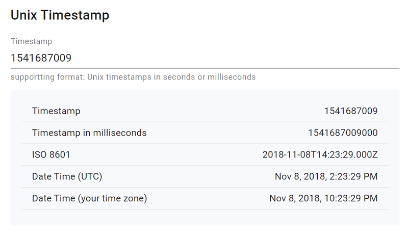

图 21. 在线的 timestamp 转换工具


### 5.2 命令行工具

如果想把 timestamp 和 UTC 时间转换集成到你的代码或工具中，可以使用 python 或其它语言来实现。

这里展示命令行上使用 date 命令转换 timestamp 的方法，比较方便:

```bash
# 默认的日期、时分秒格式
$ date -u -d "@1541687009" +'%Y-%m-%d %H:%M:%S'
2018-11-08 14:23:29

# 带 AM/PM 格式
$ date -u -d "@1541687009" +'%Y-%m-%d %I:%M:%S %p'
2018-11-08 02:23:29 PM
```


## 6. 思考题

本篇到这里就应该结束了，照例还是留几道思考题，以检查你对 max_timestamp 以及 Android OTA 系统的理解。


思考题 1：为什么降级和升级包制作中分别使用 source 槽位和 target 槽位的 Build Property 数据，而不是都用 target 目标槽位的数据呢？制作降级包时的 source 和 target 分别代表什么？

思考题 2：文中提到的升级包基本上都是指差分包，对于使用全量包升级的情形，max_timestamp 来自哪里？对 max_timestamp 的检查还管用吗？

思考题 3：为什么叫做 max_timestamp？直接叫 timestamp 不就好了吗？

思考题 4：Release 版本的系统支持降级操作吗？如果不支持，需要如何修改代码使其支持降级操作？如果支持降级操作，你能说出为什么支持降级操作吗？

思考题 5：如何查看使用 ota_from_target_files 工具制作升级包时所使用的详细命令信息？


## 7. 其它

到目前为止，我写过 Android OTA 升级相关的话题包括：

- 基础入门：《Android A/B 系统》系列
- 核心模块：《Android Update Engine 分析》 系列
- 动态分区：《Android 动态分区》 系列
- 虚拟 A/B：《Android 虚拟 A/B 分区》系列
- 升级工具：《Android OTA 相关工具》系列

更多这些关于 Android OTA 升级相关文章的内容，请参考[《Android OTA 升级系列专栏文章导读》](https://blog.csdn.net/guyongqiangx/article/details/129019303)。

如果您已经订阅了动态分区和虚拟分区付费专栏，请务必加我微信，备注订阅账号，拉您进“动态分区 & 虚拟分区专栏 VIP 答疑群”。我会在方便的时候，回答大家关于 A/B 系统、动态分区、虚拟分区、各种 OTA 升级和签名的问题。

除此之外，我有一个 Android OTA 升级讨论群，里面现在有 400+ 朋友，主要讨论手机，车机，电视，机顶盒，平板等各种设备的 OTA 升级话题，如果您从事 OTA 升级工作，欢迎加群一起交流，请在加我微信时注明“Android OTA 讨论组”。此群仅限 Android OTA 开发者参与~

> 公众号“洛奇看世界”后台回复“wx”获取个人微信。

