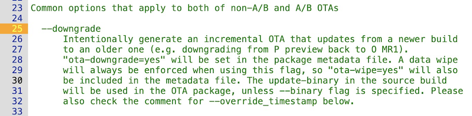
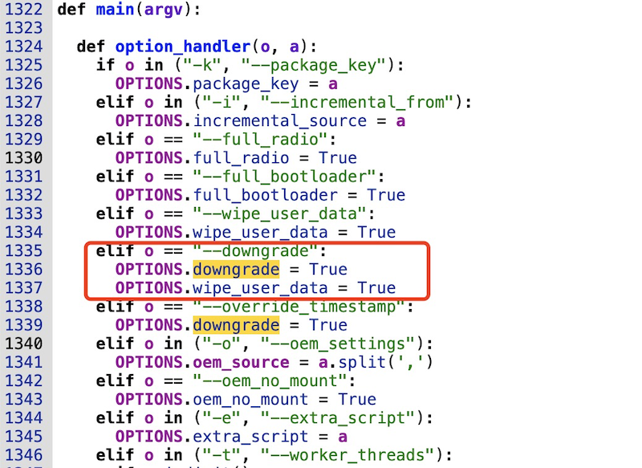
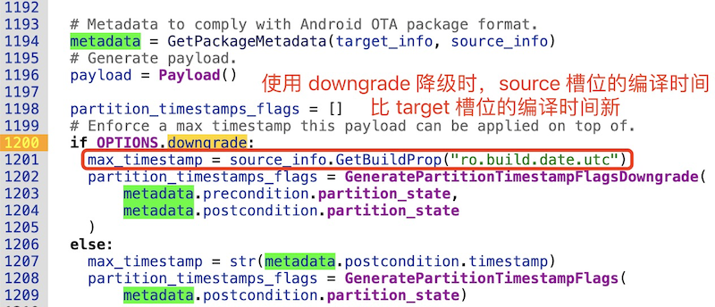
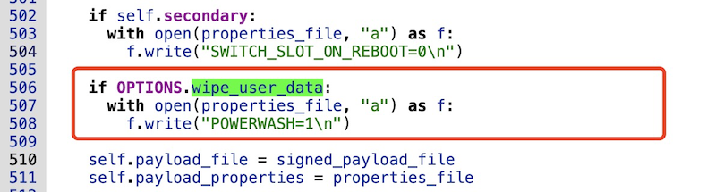
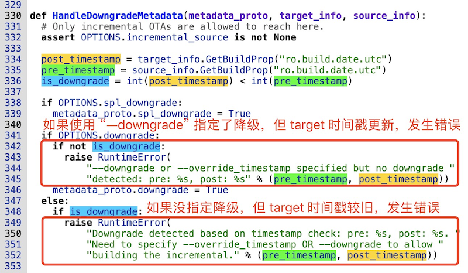

# 20230925-Android Update Engine 分析（二十四）制作降级包时，到底发生了什么？


> 本文为洛奇看世界(guyongqiangx)原创，转载请注明出处。
>
> 原文链接：https://blog.csdn.net/guyongqiangx/article/details/133421556

## 0. 导读

Android 中，跟降级相关的选项比较多，在 Android 13 的代码中就包含了以下这些选项：

- `--downgrade`

- `--override_timestamp`
- `--vabc_downgrade`
- `--spl_downgrade`

后续会逐个场景展开分析，本篇主要分析使用 ``--downgrade`制作降级包的场景。

读完本文，你将得到以下问题的答案：

升级或降级的本质是什么？我们制作降级包时到底发生了什么？使用降级包进行 OTA 更新时又发生了什么？

- 如果你对 OTA 升级和降级的本质感兴趣，请转到第 1 节；
- 如果你对如何制作降级包感兴趣，请跳转到第 2 节查看降级包制作命令；
- 如果你对降级的整个流程感兴趣，请跳转到第 3 节；
- 如果只想在较高层次了解降级包的执着，以及降级时有哪些特别操作，请跳转到第 5 节查看总结；
- 最后在第 6 节提供了几个思考题，可以试着看看能不能把这几个问题阐述清楚。


> 本文基于 android-13.0.0_r3 代码进行分析，总体脉络框架适用于所有支持 A/B 系统的版本。
>
> 在线代码阅读: http://aospxref.com/android-13.0.0_r3/


> 核心代码[《Android Update Engine 分析》](https://blog.csdn.net/guyongqiangx/category_12140296.html)系列，文章列表：
>
> - [Android Update Engine分析（一）Makefile](https://blog.csdn.net/guyongqiangx/article/details/77650362)
>
> - [Android Update Engine分析（二）Protobuf和AIDL文件](https://blog.csdn.net/guyongqiangx/article/details/80819901)
>
> - [Android Update Engine分析（三）客户端进程](https://blog.csdn.net/guyongqiangx/article/details/80820399)
>
> - [Android Update Engine分析（四）服务端进程](https://blog.csdn.net/guyongqiangx/article/details/82116213)
>
> - [Android Update Engine分析（五）服务端核心之Action机制](https://blog.csdn.net/guyongqiangx/article/details/82226079)
>
> - [Android Update Engine分析（六）服务端核心之Action详解](https://blog.csdn.net/guyongqiangx/article/details/82390015)
>
> - [Android Update Engine分析（七） DownloadAction之FileWriter](https://blog.csdn.net/guyongqiangx/article/details/82805813)
>
> - [Android Update Engine分析（八）升级包制作脚本分析](https://blog.csdn.net/guyongqiangx/article/details/82871409)
>
> - [Android Update Engine分析（九） delta_generator 工具的 6 种操作](https://blog.csdn.net/guyongqiangx/article/details/122351084)
>
> - [Android Update Engine分析（十） 生成 payload 和 metadata 的哈希](https://blog.csdn.net/guyongqiangx/article/details/122393172)
>
> - [Android Update Engine分析（十一） 更新 payload 签名](https://blog.csdn.net/guyongqiangx/article/details/122597314)
>
> - [Android Update Engine分析（十二） 验证 payload 签名](https://blog.csdn.net/guyongqiangx/article/details/122634221)
>
> - [Android Update Engine分析（十三） 提取 payload 的 property 数据](https://blog.csdn.net/guyongqiangx/article/details/122646107)
>
> - [Android Update Engine分析（十四） 生成 payload 数据](https://blog.csdn.net/guyongqiangx/article/details/122753185)
>
> - [Android Update Engine分析（十五） FullUpdateGenerator 策略](https://blog.csdn.net/guyongqiangx/article/details/122767273)
>
> - [Android Update Engine分析（十六） ABGenerator 策略](https://blog.csdn.net/guyongqiangx/article/details/122886150)
>
> - [Android Update Engine分析（十七）10 类 InstallOperation 数据的生成和应用](https://blog.csdn.net/guyongqiangx/article/details/122942628)
>
> - [Android Update Engine分析（十八）差分数据到底是如何更新的？](https://blog.csdn.net/guyongqiangx/article/details/129464805)
>
> - [Android Update Engine分析（十九）Extent 到底是个什么鬼？](https://blog.csdn.net/guyongqiangx/article/details/132389438)
>
> - [Android Update Engine分析（二十）为什么差分包比全量包小，但升级时间却更长？](https://blog.csdn.net/guyongqiangx/article/details/132343017)
>
> - [Android Update Engine分析（二十一）Android A/B 的更新过程](https://blog.csdn.net/guyongqiangx/article/details/132536383)
>
> - [Android Update Engine分析（二十二）OTA 降级限制之 timestamp](https://blog.csdn.net/guyongqiangx/article/details/133191750)
>
> - [Android Update Engine分析（二十三）如何在升级后清除用户数据？](https://blog.csdn.net/guyongqiangx/article/details/133274277)
>
> - [Android Update Engine分析（二十四）制作降级包时，到底发生了什么？](https://blog.csdn.net/guyongqiangx/article/details/133421556)
>
> - [Android Update Engine分析（二十五）升级状态 prefs 是如何保存的？](https://blog.csdn.net/guyongqiangx/article/details/133421560)
>
> - [Android Update Engine分析（二十六）OTA 更新后不切换 Slot 会怎样？](https://blog.csdn.net/guyongqiangx/article/details/133691683)
>
> - [Android Update Engine分析（二十七）如何实现 OTA 更新但不切换 Slot？](https://blog.csdn.net/guyongqiangx/article/details/133849661)

> 如果您已经订阅了本专栏，请务必加我微信，拉你进“动态分区 & 虚拟分区专栏 VIP 答疑群”。

## 1. 关于升级和降级的本质

对数据更新来说，升级和降级有什么区别？

就设备上的镜像(image)数据来说，没有任何区别。不论是升级还是降级，都是将磁盘上存放的镜像数据从镜像 A 更改成镜像 B。


你或许会说，怎么可能没区别？

从旧版本更新到新版本是升级，从新版本更新返回到旧版本是降级。


那如何区别旧版本和新版本呢？

答案就是版本号。

所谓版本号，是用于指定某一时刻代码或镜像状态的某个标记，这个标记可能是手动输入的某个字符串，也可能是编译时自动获取的系统时间。不论是哪一种，都代表生成镜像的时刻，系统的某个状态。


有这么一个场景：

假定系统的某个版本，其版本号为 A1；后来新增了某个功能 F，版本号更新为 A2；再后来发现功能 F 存在隐患，需要移除新增的功能 F，此时有两种做法：

一种做法是系统从版本 A2 的镜像回退到版本 A1 的镜像，移除新增的功能 F；

另一种做法是基于版本 A2 的代码移除新增功能 F 的代码，重新编译得到版本 A3 的镜像，也达到移除新增功能 F 的目的。


问题来了，

从版本 A1 更新到版本 A2 属于升级，这个毋庸置疑，毕竟新增了功能 F。从版本 A2 回退到版本 A1 属于降级，这也很明显，不会有疑问。


但从版本 A2 更新到版本 A3，因为代码出现了修改，版本号升高，从这一方面来说属于升级；但实际上代码的修改只是把之前新增的功能移除了，回退到了上一版本的代码，理论上又应该叫做降级。

那从版本 A2 到版本 A3，到底是升级还是降级呢？其实，说是升级也可，说成降级也行。核心是升级和降级标准认定的问题。

- 如果按照编译时间戳来说，版本 A3 的时间戳比版本 A2 的时间戳新，所以属于升级；

- 如果按照系统功能来说，版本 A3 的功能在版本 A2 的基础上回退了，所以属于降级；


同样的问题还有，对比版本 A1 和 A3，版本号虽然不一样，但是功能完全一样，那版本 A3 相对于 A1 来说，到底是升级还是属于不升不降呢？


所以，使用不同的标准，对修改代码后镜像的更新到底属于升级还是降级会有不同的结果。


在这里，我基于编译时间来划分。也就是版本 A3 相对于版本 A2 来说，虽然功能后退了，但编译时间更新，应该叫做升级。

所以升级，就是使用编译时间离当下比较近的镜像替换编译时间离当下比较远的镜像。


因此，我们这里讨论的降级，严格来说就对应于从版本 A2 更新到版本 A1 的情形。

有了这个共识，我们再来理解 Android OTA 的降级策略就容易了。


> 当然，在另外的一些场景下，我们讨论升级和降级时有可能以功能来划分。
>
> 比如和老板或者客户讨论项目时，通常会以功能来划分，取消了某个功能，此时就会理解为降级。
>
> 所以关于升级和降级的标准并不是一成不变的。

## 2. Android 如何制作降级包？

Android OTA 更新时，如何制作降级包？答案就是在制作 OTA 升级包时使用 "--downgrade" 选项。



**图 1. 制作升级包的 "--downgrade" 选项**


一个典型的降级包制作命令如下(使用默认的 test key 签名)：

```bash
$ ota_from_target_files --downgrade -i new-target_files.zip old-target_files.zip downgrade.zip
```

这里基于 `new-target_files.zip` 制作降级包，降级到 `old-target_files.zip` 对应的版本，生成名为 `downgrade.zip` 的差分包。

## 3. Android 降级流程全追踪

### 1. 使用 "--downgrade" 选项制作降级包

在制作 Android 降级包时提供了 "--downgrade" 选项，那这个选项到底是如何起作用的呢？

在制作 OTA 更新包时，如果指定了 "--downgrade" 选项，则设置选项"OPTIONS.downgrade=True" 以及 "OPTIONS.wide_user_data=True":



**图 2. 解析 "--downgrade" 选项**


### 2. OPTIONS.downgrade = True 选项

另外，在制作降级包时，OPTIONS.downgrade 选项会影响 max_timestamp 的提取：



**图 3. 降级时从 source 分区提取编译时间作为 max_timestamp**


如果"OPTIONS.downgrade=True"，则提取 source 槽位的编译时间作为 max_timestamp，并保存到 payload 文件中。

关于 max_timestamp 的详细分析，请参考：[《Android Update Engine分析（二十二）OTA 降级限制之 timestamp》](https://blog.csdn.net/guyongqiangx/article/details/133191750)


总体来说，对 max_timestamp 的后续操作如下：

1. 制作降级包时，提取 source 槽位的编译时间戳 (即: Build Property 数据中的 “ro.build.date.utc”)，用来设置 max_timestamp 参数，最终用于设置 manifest.max_timestamp，并输出到 payload.bin 文件中。

2. 升级过程中，当接收完 manifest 数据后，将其传递给 ValidateManifest() 函数进行检查验证，其中的一个检查操作就是检查 manifest 中包含的各种时间戳。

此时，提取 manifest 中的 max_timestamp 数据，同当前系统的编译时间进行比较。

- 如果是升级的情况，

max_timestamp 来自做包 target 槽位的编译时间戳，所以：

```
manifest.max_timestamp > 当前系统的编译时间
```

- 如果是降级的情况，

max_timestamp 来自做包 source 槽位的编译时间戳(即当前系统运行的槽位)，所以：

```
manifest.max_timestamp == 当前系统的编译时间
```


如果出现 `manifest.max_timestamp < 当前系统编译时间` 的情况，会停止升级，并返回升级错误 kPayloadTimestampError。


另外，对于系统能否降级，AllowDowngrade() 函数默认会检查以下两个条件：

- 系统属性 “ro.ota.allow_downgrade=true"
- 系统属性 “ro.debbuggable=true”

如果要更改限制，需要修改 AllowDowngrade() 函数对系统降级限制的检查。

系统降级时会打印消息 “The current OS build allows downgrade, continuing to apply the payload with an older timestamp.”


### 3. OPTIONS.wide_user_data = True 选项

而对于 "OPTIONS.wide_user_data=True"，就是将 "POWERWASH=1" 写入到 payload_properties.txt 文件中:



**图 4. wipe_user_data 时输出 POWERWASH=1 设置**


`POWERWASH=1`，其作用就是在升级后清除设备上的用户数据，详细分析请参考：[《Android Update Engine分析（二十三）如何在升级后清除用户数据？》](https://blog.csdn.net/guyongqiangx/article/details/133274277)


总体来说，对 `POWERWASH=1` 的操作如下：

1. 制作升级包时，`POWERWASH=1` 被写入到payload_properties.txt 文件中。

2. 升级时，将 payload_properties.txt 文件的内容作为 headers 参数的内容传递给 update engine 服务端程序。

3. 服务端的 applyPayload() 函数根据 `POWERWASH` 值设置 `install_plan_.powerwash_required=1`。

4. 在升级后期的 PostinstallRunnerAction 中，检查到 `install_plan_.powerwash_required=1`，往 BCB(bootloader message block) 区域写入命令 “boot-recovery”，并携带两个参数 “`–wipe_data`” 和 “`–reason=wipe_data_from_ota`”。
5. 系统更新后重启，进入 Recovery 模式。
6. recovery 应用程序读取 BCB 区域，解析得到 “wipe_data” 参数，调用 WipeData 函数执行数据清理工作：
   - 擦除 “/data” 分区
   - 擦除 “/cache” 分区
   - 擦除 “/metadata” 分区
7. 做完这一系列工作后，退出 recovery 系统，重启进入 Android 新系统。


对于 Virtual A/B 的情况，根据聪哥在 VIP 答疑群中的解释，还会在 WipeData 前执行 merge 操作。由于 Virtual A/B 升级会在 /metadata 分区保存升级相关数据，不 merge 就直接擦除 "/metadata" 分区，结果就是升级失败。


## 4. 制作差分包对时间戳的检查

从前面的分析可以看到，使用 "--downgrade" 选项制作降级包时，实际上最终做了两件事情：

1. 从 source 镜像中提取编译时间作为 max_timestamp 写入到 payload.bin 文件中，用于升级中对时间戳的检查；
2. 将`POWERWASH=1` 写入到payload_properties.txt 文件中，用于升级后进入 Recovery 模式清除用户数据；


那就只有这些操作吗？只能说主要操作就这些。除了主要操作之外，在制作升级包时也会根据到底是制作升级包还是降级包进行一些简单的时间戳检查。


在生成升级包之前，如果是有两个包参与的增量升级，会从 target 和 source 槽位镜像提取信息生成制作升级包的 metadata，其中会调用函数 HandleDowngradeMetadata() 对两个镜像的时间戳进行检查：



制作增量包时，

- 如果指定了 "--downgrade" 选项制作降级包，但 source 包编译时间戳比 target 包时间戳早，则制作降级包错误；

- 如果是制作升级包，target 包编译时间戳比 source 包编译时间戳早，则制作升级包错误；


## 5. 总结

使用 "--downgrade" 选项制作降级包，命令：

```bash
$ ota_from_target_files --downgrade -i new-target_files.zip old-target_files.zip downgrade.zip
```


在脚本中 "--downgrade" 选项被设置后，最终转换成两个选项"OPTIONS.downgrade=True"  和 "OPTIONS.wide_user_data=True"。


对于 "OPTIONS.downgrade=True" 选项：

1. 提取 source 槽位的编译时间戳 (即: Build Property 数据中的 “ro.build.date.utc”)，用来设置 max_timestamp 参数，最终用于设置 manifest.max_timestamp，并输出到 payload.bin 文件中。

2. 升级过程中，当接收完 manifest 数据后，将其传递给 ValidateManifest() 函数进行检查验证，用于检查当前的系统的编译时间和 payload 中的 max_timestamp 指定的时间。


对于 "OPTIONS.wide_user_data=True" 选项：

1. 制作升级包时，`POWERWASH=1` 被写入到payload_properties.txt 文件中。

2. 升级时，将 `POWERWASH=1` 作为 headers 参数的内容传递给 update engine 服务端程序。
3. 在升级后期的 PostinstallRunnerAction 中，往 BCB(bootloader message block) 区域写入命令 “boot-recovery”，并携带两个参数 “`–wipe_data`” 和 “`–reason=wipe_data_from_ota`”。
4. 系统更新后重启，进入 Recovery 模式。
5. recovery 应用程序读取 BCB 区域，解析得到 “wipe_data” 参数，调用 WipeData 函数执行数据清理工作：
   - 擦除 “/data” 分区
   - 擦除 “/cache” 分区
   - 擦除 “/metadata” 分区
6. 做完这一系列工作后，退出 recovery 系统，重启进入 Android 新系统。


详细关于 "OPTIONS.downgrade=True"  和 "OPTIONS.wide_user_data=True" 选项的流程请参考本文的第 3 节以及以下两篇文章：

- 关于 max_timestamp 的详细分析，请参考：

​	[《Android Update Engine分析（二十二）OTA 降级限制之 timestamp》](https://blog.csdn.net/guyongqiangx/article/details/133191750)

- 关于 POWERASH=1 的详细分析，请参考：

  [《Android Update Engine分析（二十三）如何在升级后清除用户数据？》](https://blog.csdn.net/guyongqiangx/article/details/133274277)


## 6. 思考题

1. 升级时发生 max_timestamp 检查错误，可能是因为什么原因呢？
2. 系统在什么情况下才可以进行降级操作？
3. 检查系统可以降级的 AllowDowngrade() 函数中会检查两个属性 "ro.ota.allow_downgrade" 和 "ro.debuggable"，这些属性是在哪里设置的呢？
4. 如果系统没有找到属性 "ro.ota.allow_downgrade" 和 "ro.debuggable"，但又需要使用这两个属性，该如何处理呢？


## 7. 其它

到目前为止，我写过 Android OTA 升级相关的话题包括：

- 基础入门：《Android A/B 系统》系列
- 核心模块：《Android Update Engine 分析》 系列
- 动态分区：《Android 动态分区》 系列
- 虚拟 A/B：《Android 虚拟 A/B 分区》系列
- 升级工具：《Android OTA 相关工具》系列

更多这些关于 Android OTA 升级相关文章的内容，请参考[《Android OTA 升级系列专栏文章导读》](https://blog.csdn.net/guyongqiangx/article/details/129019303)。

如果您已经订阅了动态分区和虚拟分区付费专栏，请务必加我微信，备注订阅账号，拉您进“动态分区 & 虚拟分区专栏 VIP 答疑群”。我会在方便的时候，回答大家关于 A/B 系统、动态分区、虚拟分区、各种 OTA 升级和签名的问题。

除此之外，我有一个 Android OTA 升级讨论群，里面现在有 400+ 朋友，主要讨论手机，车机，电视，机顶盒，平板等各种设备的 OTA 升级话题，如果您从事 OTA 升级工作，欢迎加群一起交流，请在加我微信时注明“Android OTA 讨论组”。此群仅限 Android OTA 开发者参与~

> 公众号“洛奇看世界”后台回复“wx”获取个人微信。


