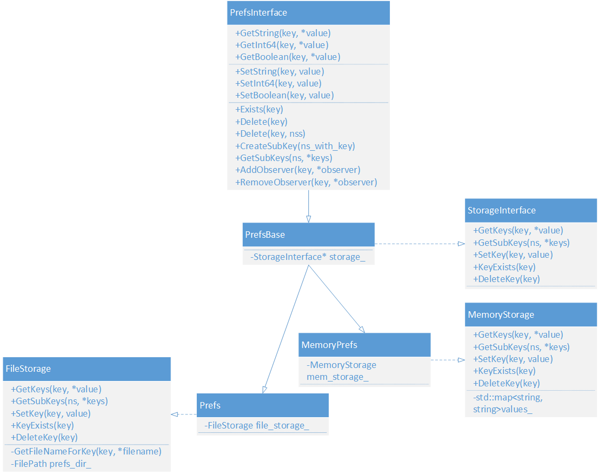
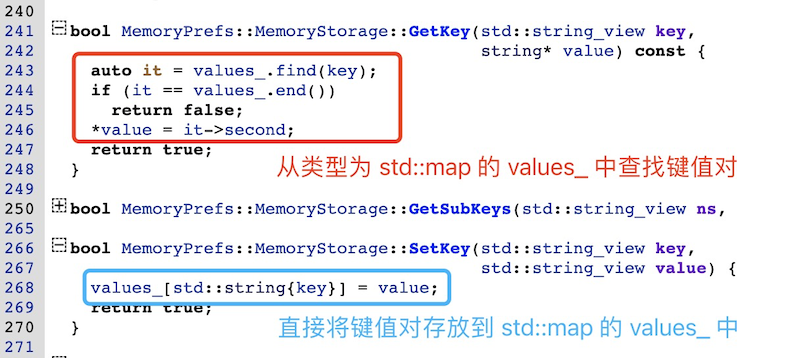
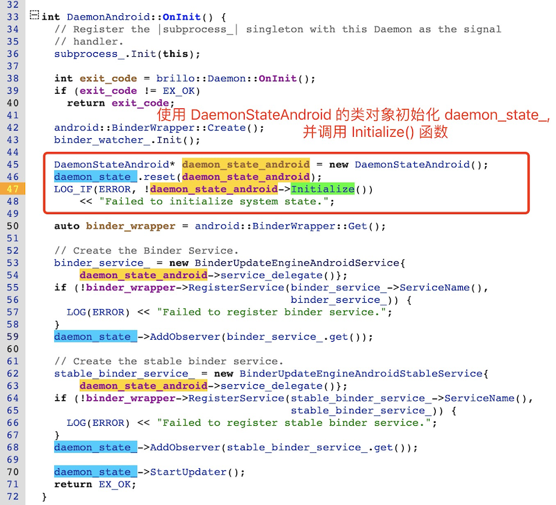
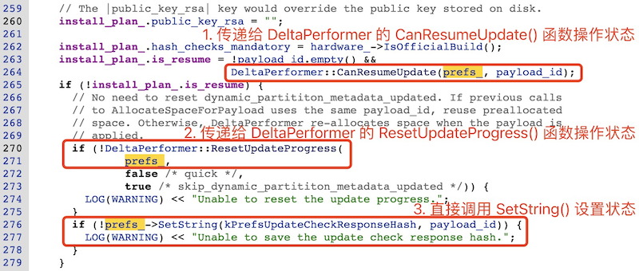
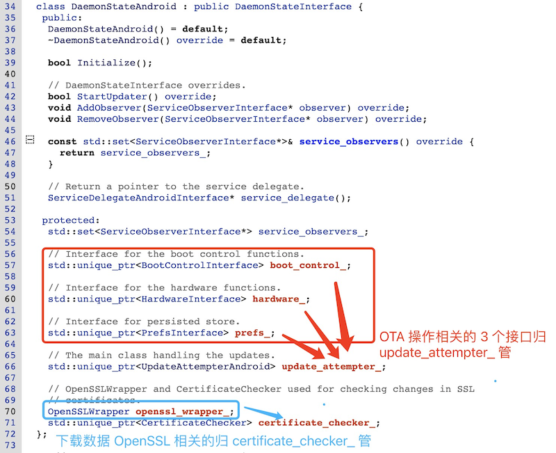
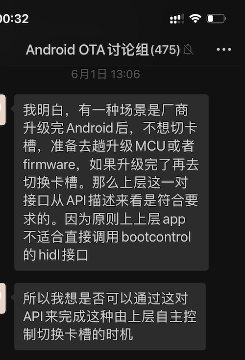

# 20230926-Android Update Engine 分析（二十五）升级状态 prefs 是如何保存的？


> 本文为洛奇看世界(guyongqiangx)原创，转载请注明出处。
>
> 原文链接：https://blog.csdn.net/guyongqiangx/article/details/133421560

## 0. 导读

本系列到现在为止一共二十四篇，前面十七篇基本上就是阅读 update engine 的核心代码和函数，第十七篇以后开始按照话题进行分析。

在前面十七篇中，把核心功能代码过了一遍，但仍然有不少功能代码还没分析过。

例如，Update Engine 的升级状态数据时如何保存的？系统到底定义了哪些 prefs 数据？本文就管理 Update Engine 状态的 Prefs 类进行详细分析。

- 如果你想了解 Prefs 实现涉及的文件和类，请转到 第 1.1 节；
- 如果你好奇 Update Engine 的启动流程，请转到第 1.3 节；
- 如果你想了解 Prefs 的初始化，以及如何调用的，请转到第 1.4 节；
- 如果你想了解当前 Update Engine 系统中到底有哪些 prefs，请转到第 2 节；
- 系统定义了 70 个 prefs，你希望知道哪些被引用过，请转到第 3 节；
- 第 4 节预留了思考题，你可以试着挑战下自己；


> 本文基于 android-13.0.0_r3 代码进行分析，总体脉络框架适用于所有支持 A/B 系统的版本。
>
> 在线代码阅读: http://aospxref.com/android-13.0.0_r3/


> 核心代码[《Android Update Engine 分析》](https://blog.csdn.net/guyongqiangx/category_12140296.html)系列，文章列表：
>
> - [Android Update Engine分析（一）Makefile](https://blog.csdn.net/guyongqiangx/article/details/77650362)
>
> - [Android Update Engine分析（二）Protobuf和AIDL文件](https://blog.csdn.net/guyongqiangx/article/details/80819901)
>
> - [Android Update Engine分析（三）客户端进程](https://blog.csdn.net/guyongqiangx/article/details/80820399)
>
> - [Android Update Engine分析（四）服务端进程](https://blog.csdn.net/guyongqiangx/article/details/82116213)
>
> - [Android Update Engine分析（五）服务端核心之Action机制](https://blog.csdn.net/guyongqiangx/article/details/82226079)
>
> - [Android Update Engine分析（六）服务端核心之Action详解](https://blog.csdn.net/guyongqiangx/article/details/82390015)
>
> - [Android Update Engine分析（七） DownloadAction之FileWriter](https://blog.csdn.net/guyongqiangx/article/details/82805813)
>
> - [Android Update Engine分析（八）升级包制作脚本分析](https://blog.csdn.net/guyongqiangx/article/details/82871409)
>
> - [Android Update Engine分析（九） delta_generator 工具的 6 种操作](https://blog.csdn.net/guyongqiangx/article/details/122351084)
>
> - [Android Update Engine分析（十） 生成 payload 和 metadata 的哈希](https://blog.csdn.net/guyongqiangx/article/details/122393172)
>
> - [Android Update Engine分析（十一） 更新 payload 签名](https://blog.csdn.net/guyongqiangx/article/details/122597314)
>
> - [Android Update Engine分析（十二） 验证 payload 签名](https://blog.csdn.net/guyongqiangx/article/details/122634221)
>
> - [Android Update Engine分析（十三） 提取 payload 的 property 数据](https://blog.csdn.net/guyongqiangx/article/details/122646107)
>
> - [Android Update Engine分析（十四） 生成 payload 数据](https://blog.csdn.net/guyongqiangx/article/details/122753185)
>
> - [Android Update Engine分析（十五） FullUpdateGenerator 策略](https://blog.csdn.net/guyongqiangx/article/details/122767273)
>
> - [Android Update Engine分析（十六） ABGenerator 策略](https://blog.csdn.net/guyongqiangx/article/details/122886150)
>
> - [Android Update Engine分析（十七）10 类 InstallOperation 数据的生成和应用](https://blog.csdn.net/guyongqiangx/article/details/122942628)
>
> - [Android Update Engine分析（十八）差分数据到底是如何更新的？](https://blog.csdn.net/guyongqiangx/article/details/129464805)
>
> - [Android Update Engine分析（十九）Extent 到底是个什么鬼？](https://blog.csdn.net/guyongqiangx/article/details/132389438)
>
> - [Android Update Engine分析（二十）为什么差分包比全量包小，但升级时间却更长？](https://blog.csdn.net/guyongqiangx/article/details/132343017)
>
> - [Android Update Engine分析（二十一）Android A/B 的更新过程](https://blog.csdn.net/guyongqiangx/article/details/132536383)
>
> - [Android Update Engine分析（二十二）OTA 降级限制之 timestamp](https://blog.csdn.net/guyongqiangx/article/details/133191750)
>
> - [Android Update Engine分析（二十三）如何在升级后清除用户数据？](https://blog.csdn.net/guyongqiangx/article/details/133274277)
>
> - [Android Update Engine分析（二十四）制作降级包时，到底发生了什么？](https://blog.csdn.net/guyongqiangx/article/details/133421556)
>
> - [Android Update Engine分析（二十五）升级状态 prefs 是如何保存的？](https://blog.csdn.net/guyongqiangx/article/details/133421560)

> 如果您已经订阅了本专栏，请务必加我微信，拉你进“动态分区 & 虚拟分区专栏 VIP 答疑群”。


## 1. Prefs 的实现

### 1. Prefs 的代码文件

Update Engine 中和 Prefs 定义和实现相关的主要文件有 4 个，分别是:

- system/update_engine/common/prefs_interface.h
- system/update_engine/common/prefs.h
- system/update_engine/common/prefs.cc
- system/update_engine/common/constants.h


**文件 prefs_interface.h**

定义了 prefs 的抽象基类 `PrefsInterface`，主要是定了 prefs 操作的接口。


**文件 prefs.h, prefs.cc**

定义了 prefs 的基类 PrefsBase，以及两个实现类 Prefs 和 MemoryPrefs。

在 PrefsBase 类内部定义了数据存取的抽象接口基类 StorageInterface，子类 Prefs 和 MemoryPrefs 内部的 FileStorage 和 MemoryStorage 是 StorageInterface 的具体实现，负责往不同的存储介质中存储 prefs 数据。


见名知意，Perfs 是基于文件的 prefs 实现类，而 MemoryPrefs 是基于内存的 prefs 实现类。

各个 prefs 类之间的关系如图 1 所示:



图 1. prefs 类层次结构图


**文件 constants.h**

定义了所有使用到的 prefs 变量名，例如: kPrefsBootId, kPrefsCurrentBytesDownloaded 等。


这里的类层次设计非常巧妙，也很实用，值得借鉴。

顶层定义了一个抽象的接口类 PrefsInterface，包含所有 prefs 功能操作的接口。

子类 PrefsBase 定义了底层存储实现的抽象接口 StorageInterface，并基于这个接口实现了所有 prefs 功能，包括 Get/SetString, Get/SetInt64, Get/SetBoolean, Exist, Delete, Add/DeleteObserver。

最终的子类 Prefs 和 MemoryPrefs 中只需要实现底层存储的接口就可以了，非常方便扩展。


### 2. Prefs 的接口实现


在实现上，prefs 类的 Get/SetString(), Get/SetInt64() 和 Get/SetBoolean() 操作都通过 Get/SetString() 实现，各种不同的值，都以 string 的格式存储：数字转换成字符串，bool 值转换成 "true", "false" 字符串。

在 GetString() 和 SetString() 把具体工作交由存储接口的 GetKey() 和 SetKey() 完成。


图 2. 通过 Get/SetString() 处理各种不同类型的值


在基于文件系统的 Prefs 中，FileStorage 存储接口在 GetKey() 和 SetKey() 操作时，先将 key 转换成文件名，然后从文件中读取字符串到 value 中，或将 value 字符串写入到文件中。


图 3. 基于 FileStorage 接口的 GetKey 和 SetKey


在基于内存的 MemoryPrefs 中，存储接口在 GetKey() 和 SetKey() 操作时，直接将将键值交由 std::map 数据处理，非常简单。



图 4. 基于 MemoryStorage 接口的 GetKey 和 SetKey


### 3. Update Engine 的启动


在开始 Prefs 的初始化之前，先回顾下 Update Engein 的服务端守护 daemon 进程是如何启动的。


Update Engine 服务端进程(代码 `main.cc`)在 main 函数中先解析命令行参数并进行简单初始化，随后创建`update_engine_daemon` 对象，并调用对象的 `Run()`方法进入服务等待状态。

在 `Run()` 中进入主循环前，通过 `OnInit()`初始化生成两个业务对象 `binder_service`_和 `daemon_state_`，前者负责 binder 服务对外的工作，后者则负责 Update Engine 后台的实际业务。

`binder_service_` 接收到客户端的服务请求后，将其交给 `daemon_state_` 的成员 `update_attempter_` 去完成，所以 `update_attempter_` 是 Update Engine 服务端业务的核心。这里的 `update_attermpter_` 就是 `UpdateAttempterAndroid` 类的对象。


所以，Update Engine 启动的调用流程如下:

```
--> main(argc, argv)
  --> daemon = chromeos_update_engine::DaemonBase::CreateInstance() (返回 DaemonAndroid 实例)
  --> daemon->Run() (即: DaemonAndroid::Run())
    --> Deamon::Run() (执行父类的 Run())
      --> Daemon::OnInit() (虚函数，执行子类的 OnInit())
        --> DaemonAndroid::OnInit()
          --> daemon_state_ = new DaemonStateAndroid()
          --> daemon_state_->Initialize() (即: DaemonStateAndroid::Initialize())
          --> daemon_state_->AddObserver(binder_service_)
          --> daemon_state_->StartUpdater() (即: DaemonStateAndroid::StartUpdater())
            --> update_attempter_->Init() (即: UpdateAttempterAndroid::Init())
    --> message_loop_.PostTask(Daemon::OnEventLoopStartedTask)
    --> message_loop_.Run() (消息主循环)
    --> Daemon::OnShutdown(&exit_code_)
```


Update Engine 服务端进程的启动，在 android-13.0.0_r3 上相对于早期的 android-7.1.2_r39 有少许变化，但总体框架没有个改变，如果希望了解 update engine 服务进程启动的更多代码细节，请参考博客:[《Android Update Engine分析（四）服务端进程》](https://blog.csdn.net/guyongqiangx/article/details/82116213)


### 4. Prefs 的初始化和调用


回顾了 Update Engine 是如何启动的之后，我们可以开始看看 Prefs 到底是如何初始化，以及如何被调用的了。

初始化 DaemonAndroid 类初始化时，生成 daemon_state_ 对象，并调用 "Initialize()" 函数。



图 5. DaemonAndroid::OnInit() 函数


在 DaemonStateAndroid::Initialzie() 函数中检查 "/data/misc/update_engine" 目录是否可用，不可用话就将 prefs 状态数据保存在内存中，否则将 prefs 状态数据保存在 "/data/misc/update_engine/prefs" 目录下。

并将初始化好的  prefs 用于实例化 UpdateAttempterAndroid 类生成 `update_attempter_` 对象。


图 6. DaemonStateAndroid::Initialize() 函数


在 UpdateAttempterAndroid 类的构造函数中，将 prefs 保存到 prefs_ 成员中。


图 7. UpdateAttempterAndroid 类的构造函数


这样在 UpdateAttempterAndroid 类中初始化了 prefs_ 成员后，就可以直接用来记录状态，或者将 prefs_ 成员传递给其他对象用来记录状态了。例如 `UpdateAttempterAndroid::ApplyPayload()` 函数:



图 8. UpdateAttempterAndroid 类中使用 prefs


简而言之，在 Update Engine 的初始化过程中，初始化一个 DaemonStateAndroid 的类对象 "`daemon_state_`"，其内部集成了多个接口成员（例如：`boot_control_`， `hardware_`, `prefs_` 等）。

在随后的整个生命周期中，Update Engine 的所有事务都交由对象 "`daemon_state_`" 处理。

对于类"`daemon_state_`"来说，自己虽然是负责人，但真正做事的却是其成员 `update_attempter_`，所以`daemon_state_` 把内部的各种接口成员都交由 `update_attempter_`代管。

当然，`daemon_state_` 中，除了`update_attempter_` 外，还有一个 `certificate_checker_`，专门负责 https 数据下载时的 Certificate 检查。所以，`daemon_state_` 内部管理大致如下：



图 9. DaemonStateAndroid 类的定义


打比方说，这有点像一个部门的部长(`daemon_state_`)，负责整个部门的运作，部门下面有多个子部门(`boot_control_`， `hardware_`, `prefs_` 等)，具体的工作都交由常务副部长(`update_attempter_`)去管理。但是，还存在一个专职秘书(`certificate_checker_`)，单独对部长负责。


## 2. 到底定义了哪些 prefs?

### 1. 所有 prefs 变量

所有 update engine 使用到的 prefs 变量都定义在文件 `system/update_engine/common/constants.h` 中，打开文件一看，定义的各种变量实在太多，根本分不清楚。

在我统计所使用的的代码版本 android-13.0.0_r41 中，这个文件中一共定义了 70 个 prefs，全部如下:

> 其中第一个 `kPrefsSubDirectory = "prefs";` 并不是真正的 prefs 变量，而是指定 `/data/misc/update_engine` 目录下存储 prefs 所使用的子目录名称，即：
>
> `/data/misc/update_engine/prefs`

```bash
 kPrefsSubDirectory = "prefs"
 kPrefsAttemptInProgress = "attempt-in-progress";
 kPrefsBackoffExpiryTime = "backoff-expiry-time";
 kPrefsBootId = "boot-id";
 kPrefsCurrentBytesDownloaded = "current-bytes-downloaded";
 kPrefsCurrentResponseSignature = "current-response-signature";
 kPrefsCurrentUrlFailureCount = "current-url-failure-count";
 kPrefsCurrentUrlIndex = "current-url-index";
 kPrefsDailyMetricsLastReportedAt = "daily-metrics-last-reported-at";
 kPrefsDeltaUpdateFailures = "delta-update-failures";
 kPrefsDynamicPartitionMetadataUpdated = "dynamic-partition-metadata-updated";
 kPrefsFullPayloadAttemptNumber = "full-payload-attempt-number";
 kPrefsInstallDateDays = "install-date-days";
 kPrefsLastActivePingDay = "last-active-ping-day";
 kPrefsLastRollCallPingDay = "last-roll-call-ping-day";
 kPrefsManifestMetadataSize = "manifest-metadata-size";
 kPrefsManifestSignatureSize = "manifest-signature-size";
 kPrefsMetricsAttemptLastReportingTime = "metrics-attempt-last-reporting-time";
 kPrefsMetricsCheckLastReportingTime = "metrics-check-last-reporting-time";
 kPrefsNoIgnoreBackoff = "no-ignore-backoff";
 kPrefsNumReboots = "num-reboots";
 kPrefsNumResponsesSeen = "num-responses-seen";
 kPrefsOmahaCohort = "omaha-cohort";
 kPrefsOmahaCohortHint = "omaha-cohort-hint";
 kPrefsOmahaCohortName = "omaha-cohort-name";
 kPrefsOmahaEolDate = "omaha-eol-date";
 kPrefsP2PEnabled = "p2p-enabled";
 kPrefsP2PFirstAttemptTimestamp = "p2p-first-attempt-timestamp";
 kPrefsP2PNumAttempts = "p2p-num-attempts";
 kPrefsPayloadAttemptNumber = "payload-attempt-number";
 kPrefsTestUpdateCheckIntervalTimeout = "test-update-check-interval-timeout";
 kPrefsPingActive = "active";
 kPrefsPingLastActive = "date_last_active";
 kPrefsPingLastRollcall = "date_last_rollcall";
 kPrefsLastFp = "last-fp";
 kPrefsPostInstallSucceeded = "post-install-succeeded";
 kPrefsPreviousVersion = "previous-version";
 kPrefsResumedUpdateFailures = "resumed-update-failures";
 kPrefsRollbackHappened = "rollback-happened";
 kPrefsRollbackVersion = "rollback-version";
 kPrefsChannelOnSlotPrefix = "channel-on-slot-";
 kPrefsSystemUpdatedMarker = "system-updated-marker";
 kPrefsTargetVersionAttempt = "target-version-attempt";
 kPrefsTargetVersionInstalledFrom = "target-version-installed-from";
 kPrefsTargetVersionUniqueId = "target-version-unique-id";
 kPrefsTotalBytesDownloaded = "total-bytes-downloaded";
 kPrefsUpdateCheckCount = "update-check-count";
 kPrefsUpdateCheckResponseHash = "update-check-response-hash";
 kPrefsUpdateCompletedBootTime = "update-completed-boot-time";
 kPrefsUpdateCompletedOnBootId = "update-completed-on-boot-id";
 kPrefsUpdateDurationUptime = "update-duration-uptime";
 kPrefsUpdateFirstSeenAt = "update-first-seen-at";
 kPrefsUpdateOverCellularPermission = "update-over-cellular-permission";
 kPrefsUpdateOverCellularTargetVersion = "update-over-cellular-target-version";
 kPrefsUpdateOverCellularTargetSize = "update-over-cellular-target-size";
 kPrefsUpdateServerCertificate = "update-server-cert";
 kPrefsUpdateStateNextDataLength = "update-state-next-data-length";
 kPrefsUpdateStateNextDataOffset = "update-state-next-data-offset";
 kPrefsUpdateStateNextOperation = "update-state-next-operation";
 kPrefsUpdateStatePayloadIndex = "update-state-payload-index";
 kPrefsUpdateStateSHA256Context = "update-state-sha-256-context";
 kPrefsUpdateStateSignatureBlob = "update-state-signature-blob";
 kPrefsUpdateStateSignedSHA256Context = "update-state-signed-sha-256-context";
 kPrefsUpdateBootTimestampStart = "update-boot-timestamp-start";
 kPrefsUpdateTimestampStart ="update-timestamp-start";
 kPrefsUrlSwitchCount = "url-switch-count";
 kPrefsVerityWritten = "verity-written";
 kPrefsWallClockScatteringWaitPeriod = "wall-clock-wait-period";
 kPrefsWallClockStagingWaitPeriod = "wall-clock-staging-wait-period";
 kPrefsManifestBytes = "manifest-bytes";
 kPrefsPreviousSlot = "previous-slot";
```


### 2. 使用的 prefs 变量示例

在我用于调试的盒子上，在 `/data/misc/update_engine/prefs` 下，我能看到这些文件:

```bash
console:/ # ls -lh /data/misc/update_engine/prefs/                             
total 58K
-rw------- 1 root root  36 2015-01-01 08:00 boot-id
-rw------- 1 root root   1 2023-02-27 18:07 delta-update-failures
-rw------- 1 root root  88 2023-02-27 18:05 dynamic-partition-metadata-updated
-rw------- 1 root root 39K 2023-02-27 18:05 manifest-bytes
-rw------- 1 root root   5 2023-02-27 18:05 manifest-metadata-size
-rw------- 1 root root   3 2023-02-27 18:05 manifest-signature-size
-rw------- 1 root root   4 2023-02-27 18:07 post-install-succeeded
-rw------- 1 root root  26 2015-01-01 08:00 previous-version
-rw------- 1 root root   1 2023-02-27 18:05 resumed-update-failures
-rw------- 1 root root  17 2023-02-27 18:07 system-updated-marker
-rw------- 1 root root   1 2023-02-27 18:07 total-bytes-downloaded
-rw------- 1 root root  88 2023-02-27 18:05 update-check-response-hash
-rw------- 1 root root  36 2023-02-27 18:07 update-completed-on-boot-id
-rw------- 1 root root   1 2023-02-27 18:07 update-state-next-data-length
-rw------- 1 root root   9 2023-02-27 18:07 update-state-next-data-offset
-rw------- 1 root root   3 2023-02-27 18:07 update-state-next-operation
-rw------- 1 root root 112 2023-02-27 18:07 update-state-sha-256-context
-rw------- 1 root root 267 2023-02-27 18:07 update-state-signature-blob
-rw------- 1 root root 112 2023-02-27 18:07 update-state-signed-sha-256-context
-rw------- 1 root root   4 2023-02-27 18:07 verity-written
console:/ # 
```

在 OTA 升级过程中，可能有更多变量被使用，在升级完成后随即被删除了。


前面分析 prefs 实现说过，在 "/data/misc/update_engine" 目录可用时，prefs 变量的 value 以字符串的方式存放在以 key 为名字的文件中。可以使用 cat 命令查看，但我自己习惯使用 xxd 命令查看原始的十六进制以及 ASCII 格式的内容，例如：
```bash
# 1. 查看 boot-id
console:/data/misc/update_engine/prefs # xxd -g 1 boot-id
00000000: 38 62 38 37 34 64 63 36 2d 38 63 62 61 2d 34 62  8b874dc6-8cba-4b
00000010: 64 34 2d 61 36 64 30 2d 39 63 66 32 38 39 39 32  d4-a6d0-9cf28992
00000020: 35 64 62 66                                      5dbf

# 2. 查看 manifest-metadata-size
console:/data/misc/update_engine/prefs # xxd -g 1 manifest-metadata-size
00000000: 33 39 37 39 39                                   39799

# 3. 查看 total-bytes-downloaded
console:/data/misc/update_engine/prefs # xxd -g 1 total-bytes-downloaded
00000000: 30                                               0
```


## 3. 对所有 prefs 排序

你肯定会说，70 个 prefs，那么多，我怎么可能知道这些 prefs 都是干什么用的。

的确，70 个 prefs 不可能每一个都仔细排查，不过，我对这些 prefs 进行过一些初步统计，或许能突出一些重点。

### 

我写了个 python 脚本从 Update Engine 中抓取所有 prefs 被使用的地方，除了在 common/constant.h 中的定义外，根据其在代码和注释中被引用的次数作为热度进行了排序。

全部 70 个 prefs 中有 40 个 prefs 只有定义，没有被使用。其余 30 个 prefs 按照被引用情况的情况排序如下：

> Refs(used): 表示该 prefs 在代码中实际被引用的次数，不包括 "//" 开头的注释
>
> Refs(all): 表示该 prefs 在代码中出现的次数，包括 "//" 开头的注释行
>
> 所有搜索都排除了 *test.cc 或 *unittest.cc 的测试文件。
> 


| ID | Prefs 名称 | Prefs 值 | 引用次数<br />(不含注释) | 引用次数<br />(含注释) |
| ---- | ---- | ------ | -------- | ---- |
| 1 | kPrefsDynamicPartitionMetadataUpdated | "dynamic-partition-metadata-updated" | 6 | 6 |
| 2 | kPrefsManifestMetadataSize | "manifest-metadata-size" | 5 | 5 |
| 3 | kPrefsManifestSignatureSize | "manifest-signature-size" | 5 | 5 |
| 4 | kPrefsNumReboots | "num-reboots" | 5 | 8 |
| 5 | kPrefsPayloadAttemptNumber | "payload-attempt-number" | 5 | 9 |
| 6 | kPrefsPreviousVersion | "previous-version" | 5 | 6 |
| 7 | kPrefsUpdateCompletedOnBootId | "update-completed-on-boot-id" | 5 | 5 |
| 8 | kPrefsUpdateStateNextDataOffset | "update-state-next-data-offset" | 5 | 5 |
| 9 | kPrefsPreviousSlot | "previous-slot" | 5 | 5 |
| 10 | kPrefsCurrentBytesDownloaded | "current-bytes-downloaded" | 4 | 6 |
| 11 | kPrefsResumedUpdateFailures | "resumed-update-failures" | 4 | 4 |
| 12 | kPrefsTotalBytesDownloaded | "total-bytes-downloaded" | 4 | 5 |
| 13 | kPrefsUpdateStateNextOperation | "update-state-next-operation" | 4 | 4 |
| 14 | kPrefsUpdateStateSHA256Context | "update-state-sha-256-context" | 4 | 4 |
| 15 | kPrefsVerityWritten | "verity-written" | 4 | 4 |
| 16 | kPrefsSystemUpdatedMarker | "system-updated-marker" | 3 | 9 |
| 17 | kPrefsUpdateCheckResponseHash | "update-check-response-hash" | 3 | 4 |
| 18 | kPrefsUpdateStateNextDataLength | "update-state-next-data-length" | 3 | 3 |
| 19 | kPrefsUpdateStateSignatureBlob | "update-state-signature-blob" | 3 | 3 |
| 20 | kPrefsUpdateStateSignedSHA256Context | "update-state-signed-sha-256-context" | 3 | 3 |
| 21 | kPrefsUpdateBootTimestampStart | "update-boot-timestamp-start" | 3 | 7 |
| 22 | kPrefsUpdateTimestampStart | "update-timestamp-start" | 3 | 7 |
| 23 | kPrefsBootId | "boot-id" | 2 | 3 |
| 24 | kPrefsPostInstallSucceeded | "post-install-succeeded" | 2 | 2 |
| 25 | kPrefsManifestBytes | "manifest-bytes" | 2 | 2 |
| 26 | kPrefsDeltaUpdateFailures | "delta-update-failures" | 1 | 1 |
| 27 | kPrefsUpdateServerCertificate | "update-server-cert" | 1 | 1 |
| 28 | kPrefsUpdateStatePayloadIndex | "update-state-payload-index" | 1 | 1 |
| 29 | kPrefsOmahaCohort | "omaha-cohort" | 0 | 2 |
| 30 | kPrefsPingActive | "active" | 0 | 1 |


由于 prefs 个数实在太多，不可能在本篇中一一列举其作用或意义


原来打算以 kPrefsBootId 的变化为例，提供一些研究 prefs 的方法。

但随着学习的深入，发现 kPrefsBootId 的变化涉及到系统 OTA 升级数据成功更新后写入标记，到系统重启，到切换 slot 检查，到再次启动 Update Engine 服务进程后进行的状态检查有关。


在我的 OTA 讨论群中曾经讨论过一种场景，行驶中的机车升级后，不能马上重启验证新系统，必须要等所有其它部分的 firmware 都升级完成以后，再切换 slot 进行激活。

然而，在激活之前机车系统是有可能进行重启的，比如系统熄火再打火。但是如果一直不激活，系统会提示升级失败。

对这个场景问题的解释，三言两语无法解释清楚，所以临时决定单独用一篇展开说明。



图 10. 升级数据但不切换 slot 的场景


## 4. 思考题

在 `DaemonStateAndroid::Initialize()`函数中通过检查目录 /data/misc/update_engine 来实例化 `prefs_` 成员

- 如果目录不存在，则将 `prefs_` 实例化为 MemoryPrefs 类对象；
- 如果目录存在，则将 `prefs_` 实例化为 Prefs 类对象，并使用 /data/misc/update_engine/prefs 作为 Prefs 操作的目录；

哪些情况会导致目录 /data/misc/update_engine 不存在，进而使用 MemoryPrefs 类对象来管理  prefs 呢？


## 5. 其它

到目前为止，我写过 Android OTA 升级相关的话题包括：

- 基础入门：《Android A/B 系统》系列
- 核心模块：《Android Update Engine 分析》 系列
- 动态分区：《Android 动态分区》 系列
- 虚拟 A/B：《Android 虚拟 A/B 分区》系列
- 升级工具：《Android OTA 相关工具》系列

更多这些关于 Android OTA 升级相关文章的内容，请参考[《Android OTA 升级系列专栏文章导读》](https://blog.csdn.net/guyongqiangx/article/details/129019303)。

如果您已经订阅了动态分区和虚拟分区付费专栏，请务必加我微信，备注订阅账号，拉您进“动态分区 & 虚拟分区专栏 VIP 答疑群”。我会在方便的时候，回答大家关于 A/B 系统、动态分区、虚拟分区、各种 OTA 升级和签名的问题。

除此之外，我有一个 Android OTA 升级讨论群，里面现在有 400+ 朋友，主要讨论手机，车机，电视，机顶盒，平板等各种设备的 OTA 升级话题，如果您从事 OTA 升级工作，欢迎加群一起交流，请在加我微信时注明“Android OTA 讨论组”。此群仅限 Android OTA 开发者参与~

> 公众号“洛奇看世界”后台回复“wx”获取个人微信。


