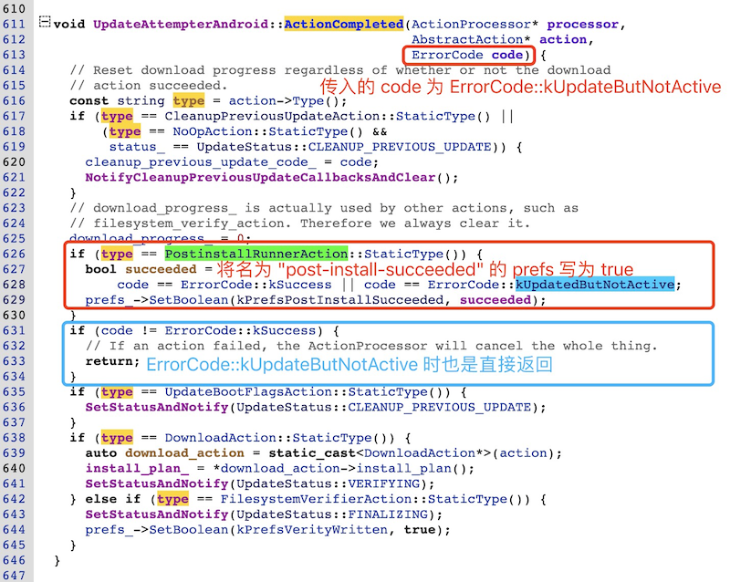

# 20231014-Android Update Engine 分析（二十七）如何实现 OTA 更新但不切换 Slot？

## 0. 导读

上篇[《Android Update Engine分析（二十六）OTA 更新后不切换 Slot 会怎样？》](https://blog.csdn.net/guyongqiangx/article/details/133691683) 分析了 OTA 更新但如果不进行切换，重启会失败的原因，以及我的一种解决思路。

分享到 OTA 答疑群后，小伙伴子非鱼分享了他的理解，比我提到的方法更简单，立马打脸了(也不完全算是打脸，主要是现成的，更简单直接，在这里也特别对子非鱼的分享表示感谢)。哈哈，我欢迎这样打脸，大家多交流才有进步。


**图 1. 小伙伴子非鱼的分享**


**图 2. switch_slot_on_reboot=false 时的 kUpdateButNotActive**


简而言之，如果我们升级以后，又不希望切换 Slot，就可以借用 "SWITCH_SLOT_ON_REBOOT=0" 选项。在升级时，将 "SWITCH_SLOT_ON_REBOOT=0" 选项通过 headers 参数传递给 update engine 的服务端，这样在当前更新完目标分区后，不会进行 Slot 切换。


本篇对这个线索进行详细分析，内容上主要分成 3 个部分，分别是分析 "switch_slot_on_reboot" 如何实现更新但不切换 Slot，如何触发 Slot 切换，以及几个思考题。

具体的内容上：

- 如果你想知道 "switch_slot_on_reboot" 选项的前前后后，请参考本文第 1 节；

- 如果你指向知道 "switch_slot_on_reboot" 的宏观操作流程，但不关心详细代码，请参考本文的地 1.6 节；

- 如果你想知道升级后没有切换 Slot，但又希望触发 Slot 切换，请转到本文第 2 节；

- 如果只想知道切换 Slot 的一些大概方式，请转到本文第 2.3 节；

- 本文在第 3 节也留下了 3 个思考题，你可以试着挑战下自己。


> 本文基于 android-13.0.0_r3 代码进行分析，总体脉络框架适用于所有支持 A/B 系统的版本。
>
> 在线代码阅读: http://aospxref.com/android-13.0.0_r3/


> 核心代码[《Android Update Engine 分析》](https://blog.csdn.net/guyongqiangx/category_12140296.html)系列，文章列表：
>
> - [Android Update Engine分析（一）Makefile](https://blog.csdn.net/guyongqiangx/article/details/77650362)
>
> - [Android Update Engine分析（二）Protobuf和AIDL文件](https://blog.csdn.net/guyongqiangx/article/details/80819901)
>
> - [Android Update Engine分析（三）客户端进程](https://blog.csdn.net/guyongqiangx/article/details/80820399)
>
> - [Android Update Engine分析（四）服务端进程](https://blog.csdn.net/guyongqiangx/article/details/82116213)
>
> - [Android Update Engine分析（五）服务端核心之Action机制](https://blog.csdn.net/guyongqiangx/article/details/82226079)
>
> - [Android Update Engine分析（六）服务端核心之Action详解](https://blog.csdn.net/guyongqiangx/article/details/82390015)
>
> - [Android Update Engine分析（七） DownloadAction之FileWriter](https://blog.csdn.net/guyongqiangx/article/details/82805813)
>
> - [Android Update Engine分析（八）升级包制作脚本分析](https://blog.csdn.net/guyongqiangx/article/details/82871409)
>
> - [Android Update Engine分析（九） delta_generator 工具的 6 种操作](https://blog.csdn.net/guyongqiangx/article/details/122351084)
>
> - [Android Update Engine分析（十） 生成 payload 和 metadata 的哈希](https://blog.csdn.net/guyongqiangx/article/details/122393172)
>
> - [Android Update Engine分析（十一） 更新 payload 签名](https://blog.csdn.net/guyongqiangx/article/details/122597314)
>
> - [Android Update Engine分析（十二） 验证 payload 签名](https://blog.csdn.net/guyongqiangx/article/details/122634221)
>
> - [Android Update Engine分析（十三） 提取 payload 的 property 数据](https://blog.csdn.net/guyongqiangx/article/details/122646107)
>
> - [Android Update Engine分析（十四） 生成 payload 数据](https://blog.csdn.net/guyongqiangx/article/details/122753185)
>
> - [Android Update Engine分析（十五） FullUpdateGenerator 策略](https://blog.csdn.net/guyongqiangx/article/details/122767273)
>
> - [Android Update Engine分析（十六） ABGenerator 策略](https://blog.csdn.net/guyongqiangx/article/details/122886150)
>
> - [Android Update Engine分析（十七）10 类 InstallOperation 数据的生成和应用](https://blog.csdn.net/guyongqiangx/article/details/122942628)
>
> - [Android Update Engine分析（十八）差分数据到底是如何更新的？](https://blog.csdn.net/guyongqiangx/article/details/129464805)
>
> - [Android Update Engine分析（十九）Extent 到底是个什么鬼？](https://blog.csdn.net/guyongqiangx/article/details/132389438)
>
> - [Android Update Engine分析（二十）为什么差分包比全量包小，但升级时间却更长？](https://blog.csdn.net/guyongqiangx/article/details/132343017)
>
> - [Android Update Engine分析（二十一）Android A/B 的更新过程](https://blog.csdn.net/guyongqiangx/article/details/132536383)
>
> - [Android Update Engine分析（二十二）OTA 降级限制之 timestamp](https://blog.csdn.net/guyongqiangx/article/details/133191750)
>
> - [Android Update Engine分析（二十三）如何在升级后清除用户数据？](https://blog.csdn.net/guyongqiangx/article/details/133274277)
>
> - [Android Update Engine分析（二十四）制作降级包时，到底发生了什么？](https://blog.csdn.net/guyongqiangx/article/details/133421556)
>
> - [Android Update Engine分析（二十五）升级状态 prefs 是如何保存的？](https://blog.csdn.net/guyongqiangx/article/details/133421560)
>
> - [Android Update Engine分析（二十六）OTA 更新后不切换 Slot 会怎样？](https://blog.csdn.net/guyongqiangx/article/details/133691683)

> 如果您已经订阅了本专栏，请务必加我微信，拉你进“动态分区 & 虚拟分区专栏 VIP 答疑群”。

## 1. 关于 switch_slot_on_reboot 选项

这里的分享提到了 switch_slot_on_reboot 选项， 这个参数是从 "--include_secondary" 做包选项引入的，本来是打算在在介绍 "--include_secondary" 选项的时候专门介绍，但没想到升级时单独使用 "SWITCH_SLOT_ON_REBOOT" 还有意外的效果。


**图 3. 制作升级包的 include_secondary 参数**


既然这里提到了 switch_slot_on_reboot, 我们就简单看下这个参数是如何设置，如何起作用的。


### 1.1 做包的 "--include_secondary" 参数

默认情况下使用 "--include_secondary" 做包时，会往 payload 的 `payload_properties.txt` 文件中写入数据:


**图 4. 往 payload_peroperties.txt 中写入 SWITCH_SLOT+ON_REBOOT=0**


最终的 `payload_properties.txt` 大概长这样:

```
$ cat payload_properties.txt 
FILE_HASH=FjmQqgOl7McZh5sti9/Mdw/pqHKy76ys8MW4r2cOt4E=
FILE_SIZE=612739752
METADATA_HASH=ij7+shTXghofVtLzZuxtctRL3xQpOFegoGVFvlIG+Gk=
METADATA_SIZE=39799
SWITCH_SLOT_ON_REBOOT=0
```

在升级的时候将 `payload_properties.txt` 文件的内容作为 headers 参数传递给 update engine。


### 1.2 升级的 headers 参数

在升级的 applyPayload() 函数中准备 install plan 时会检查 headers 参数中的 "SWITCH_SLOT_ON_REBOOT"，默认为 true，但如果指定了 "SWITCH_SLOT_ON_REBOOT=0" 则得到的值为 false。


**图 5. 使用 headers 参数设置 switch_slot_on_reboot**


### 1.3 升级后期的 CompletePostinstall() 操作

在 PostinstallRunnerAction 的 PerformAction() 中会调用 PerformPartitionPostinstall() 函数。

在 PerformPartitionPostinstall() 中，如果已经检查完所有的分区，并且没有错误，则会调用 CompletePostinstall(ErrorCode::kSuccess) 函数。


**图 6. CompletePostinstall() 函数**


在 `CompletePostinstall(ErrorCode::kSuccess)` 中，如果当前的 `switch_slot_on_reboot = false`, 则会将 `error_code` 设置为 `ErrorCode::kUpdatedButNotActive`，并将这个 code 传递给 ScopedActionComplete 类对象，使得在销毁 PostinstallRunnerAction 的阶段调用调用下面的 `ActionProcessor::ActionComplete()` 函数：


**图 7. ActionComplete() 函数**


所以这里会依次调用:

- UpdateAttempterAndroid::ActionCompleted(ErrorCode::kUpdatedButNotActive)
- UpdateAttempterAndroid::ProcessingDone(ErrorCode::kUpdatedButNotActive)


### 1.4 UpdateAttempterAndroid::ActionCompleted() 函数

在 UpdateAttempterAndroid::ActionCompleted() 函数中，如果当前的 code 为 ErrorCode::kUpdatedButNotAcitve, 往 prefs 文件 `/data/misc/update_engine/prefs/post-install-succeeded` 中写入 true:



**图 8. 基于 kUpdatedButNotActive 更新 "post-install-succeeded" 文件** 


### 1.5 UpdateAttempterAndroid::ProcessingDone() 函数

在 UpdateAttempterAndroid::ProcessingDone() 函数中，如果当前的 code 为 ErrorCode::kUpdatedButNotActive，则不进行任何处理，最后只给外界发送通知 kUpdatedButNotActive。


**图 9. ProcessingDone() 函数**


至此，整个升级流程结束，成功更新了目标分区数据，但不切换 Slot。


### 1.6 总结

如果做包的时候使用了 "--include_secondary" 参数，则会将 `SWITCH_SLOT_ON_REBOOT=0` 写入到 `payload_properties.txt` 文件中。

所以，最终的 `payload_properties.txt` 大概长这样:

```
$ cat payload_properties.txt 
FILE_HASH=FjmQqgOl7McZh5sti9/Mdw/pqHKy76ys8MW4r2cOt4E=
FILE_SIZE=612739752
METADATA_HASH=ij7+shTXghofVtLzZuxtctRL3xQpOFegoGVFvlIG+Gk=
METADATA_SIZE=39799
SWITCH_SLOT_ON_REBOOT=0
```

在升级的时候将 `payload_properties.txt` 文件的内容作为 headers 参数传递给 update engine。


update engine 服务端的 applyPayload 解析 headers 的 `SWITCH_SLOT_ON_REBOOT` 选项，用于设置 ``，默认为 true。但由于此时的 `SWITCH_SLOT_ON_REBOOT=0`，所以最终得到的 install_plan_.switch_slot_on_reboot 为 false。


在 OTA 更新完成数据更新后的 PostinstallRunnerAction 中，处理完所有的分区之后，检查 `install_plan_.switch_slot_on_reboot` 设置，如果该设置为 false, 则返回错误码: `ErrorCode::kUpdatedButNotActive`，与其说这是一个错误码，不如说是一个状态码。


基于 `ErrorCode::kUpdatedButNotActive` 的后续处理仅有:

- 往 prefs 文件 `/data/misc/update_engine/prefs/post-install-succeeded` 中写入 true
- 给外界发送通知 kUpdatedButNotActive


至此，整个数据更新流程结束，会给外界发送通知 kUpdatedButNotActive，但不会发生 Slot 切换。


这里的是基于 "--include_secondary" 做包参数产生的 "SWITCH_SLOT_ON_REBOOT=0" 的流程分析。

但 "--inculde_secondary" 参数有其特定的使用场景，那就是一次升级携带两个升级数据，我们后续专门展开讨论。


我们大部分时候都不是 "--include_secondary" 的方式，此时如果我们升级以后，又不希望切换 Slot，就可以借用 "SWITCH_SLOT_ON_REBOOT=0" 选项。


简而言之，如果我们升级以后，又不希望切换 Slot，就可以借用 "SWITCH_SLOT_ON_REBOOT=0" 选项。在升级时，将 "SWITCH_SLOT_ON_REBOOT=0" 选项通过 headers 参数传递给 update engine 的服务端，这样在当前更新完目标分区后，不会进行 Slot 切换。


## 2. 触发 Slot 切换的两种方式

上一节提到了可以通过升级时在 headers 参数中传递 "SWITCH_SLOT_ON_REBOOT=0" 来只完成升级目标分区数据，但不进行切换 Slot 的目的。


因此升级后，仍然待在当前的 Slot, 那我们后续要如何切换 Slot 呢？


### 2.1 粗暴的方式

这种方式简单粗暴，在切换 Slot 的应用中，直接调用 SetActiveBootSlot() 函数将目标分区设置为 Active 状态:

```c++
boot_control_->SetActiveBootSlot(target_slot)
```

然后重启系统，进入到目标 Slot 中。


### 2.2 正规军方式

以下介绍正规的优雅的方式：

在使用 update_engine_client 的 demo 情况下，给 update_engine_client 传递 "--switch-slot" 参数:

```bash
update_engine_client --switch_slot=true --metadata="/data/ota_package/metadata"
```

或:

```bash
update_engine_client --switch_slot
```


update_engine_client 对 switch_slot 选项的处理如下：


**图 10. update engine client 中对 switch_slot 的处理**


所以，根据命令的不同，实际上这里又有两种方式。

如果明确指定 "--switch-slot=ture"，则在 update_engine_client 中会调用服务端的 setShouldSwitchSlotOnReboot() 服务，进行一整套完整规范的操作，先后执行 3 个 Action:

- `install_plan_action`
- `filesystem_verifier_action`
- `postinstall_runner_action`

这 3 个 Action 相当于把 download_action 数据并写入分区之后的部分又全部检查执行了一遍，比较严格，然后再就行分区切换。限于篇幅这里不再详细展开。


如果只是指定了 "--switch-slot"，不明确指定 true，则在 update_engine_client 中会调用服务端的 resetShouldSwitchSlotOnReboot() 服务，进行简单直接的切换操作，基本上等同于前面粗暴的切换方式，但毕竟是系统自带的服务，所以比粗暴方式又略显得优雅一点。


**图 11. resetShouldSwithSlotOnReboot() 函数**


> 问题：
>
> 不过这里既然是要切换 Slot，所以应该是调用:
>
> ```c++
> boot_control_->SetActiveBootSlot(GetTergetSlot())
> ```
>
> 但为什么还要将 GetCurrentSlot() 的结果设置为 Active 呢？


### 2.3 总结


所以，在切换 Slot 时，可以自己写代码设置目标 Slot 为 Active 状态，然后重启切换 Slot。


或者通过使用 update_engine_client 的"--switch-slot" 选项进行切换:

```bash
update_engine_client --switch_slot=true --metadata="/data/ota_package/metadata"
```

或:

```bash
update_engine_client --switch_slot
```


前者会根据提供的 metadata 数据，对更新的分区进行后期的检查和验证后再设置切换 Slot。

后者则更为直接，将目标槽位 Slot 设置为 Active，然后重启系统。


## 3. 思考题

按照惯例，最后还是要给你留几个问题。

### 思考题  1. 你能从代码中找到 Action 执行的完整流程吗？

这个流程包括，整个 Action 流程从哪里开始，每一个 Action 的 PerformAction() 和 CompleteAction() 都是如何与上一个 Action 衔接的。

最后 Action 又是如何结束的？

关于 Action 机制的流程，请参考我早期的两篇文章:

- [《Android Update Engine分析（五）服务端核心之Action机制》](https://blog.csdn.net/guyongqiangx/article/details/82226079)

- [《Android Update Engine分析（六）服务端核心之Action详解》](https://blog.csdn.net/guyongqiangx/article/details/82390015)

这两篇文章是针对早期 Android 7.1.2_r39 的代码写的，最新的 Android 13, 14 代码已经有了不少变动。我也在考虑，是否再单独写一篇文章，详细分析最新代码中的 6 个 Action 是如何前后衔接的。


### 思考题 2. 你能简单说明下使用 swith_slot_on_reboot = 0 升级后的系统状态吗？


### 思考题 3. 使用 "SWITCH_SLOT_ON_REBOOT=0" 升级的做法对动态分区和 Virtual A/B 也管用吗？

我自己的理解是对动态分区和 Virtual A/B 也管用，但我自己没有亲自去升级实践过。

如果你也认同这个观点，说说为什么？如果不认同，那你的理由是什么？

建议你将 "SWITCH_SLOT_ON_REBOOT=0" 放到 headers 参数中，去亲自升级试试。


## 4. 其它

到目前为止，我写过 Android OTA 升级相关的话题包括：

- 基础入门：《Android A/B 系统》系列
- 核心模块：《Android Update Engine 分析》 系列
- 动态分区：《Android 动态分区》 系列
- 虚拟 A/B：《Android 虚拟 A/B 分区》系列
- 升级工具：《Android OTA 相关工具》系列

更多这些关于 Android OTA 升级相关文章的内容，请参考[《Android OTA 升级系列专栏文章导读》](https://blog.csdn.net/guyongqiangx/article/details/129019303)。

如果您已经订阅了动态分区和虚拟分区付费专栏，请务必加我微信，备注订阅账号，拉您进“动态分区 & 虚拟分区专栏 VIP 答疑群”。我会在方便的时候，回答大家关于 A/B 系统、动态分区、虚拟分区、各种 OTA 升级和签名的问题。

除此之外，我有一个 Android OTA 升级讨论群，里面现在有 400+ 朋友，主要讨论手机，车机，电视，机顶盒，平板等各种设备的 OTA 升级话题，如果您从事 OTA 升级工作，欢迎加群一起交流，请在加我微信时注明“Android OTA 讨论组”。此群仅限 Android OTA 开发者参与~

> 公众号“洛奇看世界”后台回复“wx”获取个人微信。

