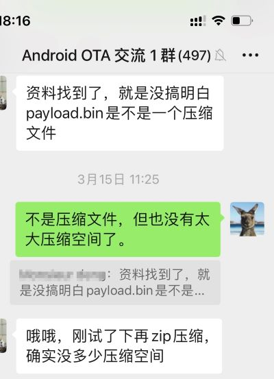
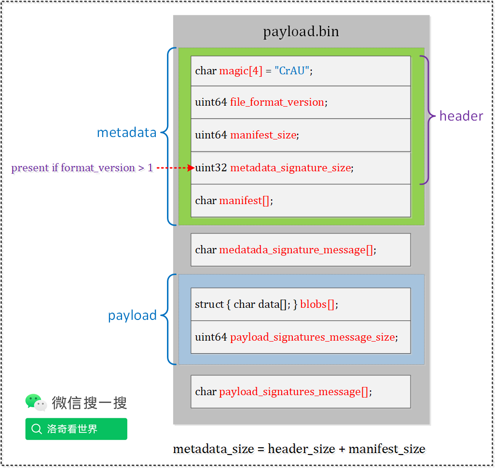
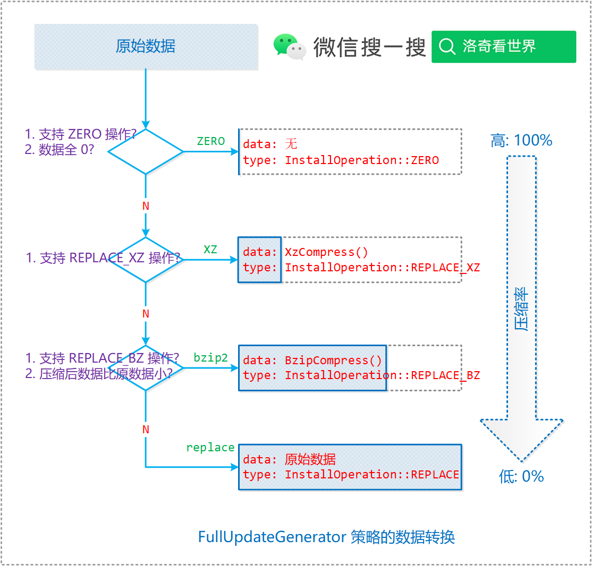

# 20240420-Android Update Engine 分析（二十八）payload.bin 文件还能再压缩吗？

> 本文为洛奇看世界(guyongqiangx)原创，转载请注明出处。
>
> 原文链接：


## 0. 导读

你可能有过这样的经历，一份代码占用的空间很大，但压缩后立刻变得很小。

经常有客户上传他们设备的 log 进行分析检查，有些设备没日没夜跑几天，最后的 log 最少都有上百兆，例如下面这个 log，原始大小为485M，经过 bz2 压缩后只有 33M。这样的压缩很可观。

```bash
$ ls -lh smartcard.log*
-rw-r--r-- 1 rocky users 485M Dec 10  2020 smartcard.log
-rw-r--r-- 1 rocky users  33M Apr 20 21:39 smartcard.log.tar.bz2
```


之前 Android OTA 交流群里有人问过，说他的升级包太大，有什么办法可以调整升级包的大小，其中一种尝试的方式就是进行压缩。

碰巧前段时间群里又有人发起话题，想知道 payload.bin 是不是一个压缩文件，估计是他的 payload.bin 文件太大了，希望能够压缩一下。

简单来说，payload.bin 并不是一个压缩文件，但里面的数据大部分已经充分压缩过了，所以整个文件也就没有多少可以再压缩的空间了。




本文针对 payload.bin 为什么不能被压缩这个问题展开分析，详细讨论 payload.bin 为什么不能被压缩的原因。

- 第 1 节总体阐述 payload.bin 文件结构
- 第 2 节分析 payload.bin 文件 metadata 的压缩效果
- 第 3 节详细分析 payload.bin 文件 blobs 数据的内容以及全量包和差分包中 blobs 数据的来源以及类型
- 第 4 节补充了一些数据压缩的知识
- 第 5 节总结了为什么对 payload.bin 文件进行压缩没有效果


> 本文基于 android-13.0.0_r3 代码进行分析，总体脉络框架适用于所有支持 A/B 系统的版本。
>
> 在线代码阅读: http://aospxref.com/android-13.0.0_r3/


> 核心代码[《Android Update Engine 分析》](https://blog.csdn.net/guyongqiangx/category_12140296.html)系列，文章列表：
>
> - [Android Update Engine分析（一）Makefile](https://blog.csdn.net/guyongqiangx/article/details/77650362)
>
> - [Android Update Engine分析（二）Protobuf和AIDL文件](https://blog.csdn.net/guyongqiangx/article/details/80819901)
>
> - [Android Update Engine分析（三）客户端进程](https://blog.csdn.net/guyongqiangx/article/details/80820399)
>
> - [Android Update Engine分析（四）服务端进程](https://blog.csdn.net/guyongqiangx/article/details/82116213)
>
> - [Android Update Engine分析（五）服务端核心之Action机制](https://blog.csdn.net/guyongqiangx/article/details/82226079)
>
> - [Android Update Engine分析（六）服务端核心之Action详解](https://blog.csdn.net/guyongqiangx/article/details/82390015)
>
> - [Android Update Engine分析（七） DownloadAction之FileWriter](https://blog.csdn.net/guyongqiangx/article/details/82805813)
>
> - [Android Update Engine分析（八）升级包制作脚本分析](https://blog.csdn.net/guyongqiangx/article/details/82871409)
>
> - [Android Update Engine分析（九） delta_generator 工具的 6 种操作](https://blog.csdn.net/guyongqiangx/article/details/122351084)
>
> - [Android Update Engine分析（十） 生成 payload 和 metadata 的哈希](https://blog.csdn.net/guyongqiangx/article/details/122393172)
>
> - [Android Update Engine分析（十一） 更新 payload 签名](https://blog.csdn.net/guyongqiangx/article/details/122597314)
>
> - [Android Update Engine分析（十二） 验证 payload 签名](https://blog.csdn.net/guyongqiangx/article/details/122634221)
>
> - [Android Update Engine分析（十三） 提取 payload 的 property 数据](https://blog.csdn.net/guyongqiangx/article/details/122646107)
>
> - [Android Update Engine分析（十四） 生成 payload 数据](https://blog.csdn.net/guyongqiangx/article/details/122753185)
>
> - [Android Update Engine分析（十五） FullUpdateGenerator 策略](https://blog.csdn.net/guyongqiangx/article/details/122767273)
>
> - [Android Update Engine分析（十六） ABGenerator 策略](https://blog.csdn.net/guyongqiangx/article/details/122886150)
>
> - [Android Update Engine分析（十七）10 类 InstallOperation 数据的生成和应用](https://blog.csdn.net/guyongqiangx/article/details/122942628)
>
> - [Android Update Engine分析（十八）差分数据到底是如何更新的？](https://blog.csdn.net/guyongqiangx/article/details/129464805)
>
> - [Android Update Engine分析（十九）Extent 到底是个什么鬼？](https://blog.csdn.net/guyongqiangx/article/details/132389438)
>
> - [Android Update Engine分析（二十）为什么差分包比全量包小，但升级时间却更长？](https://blog.csdn.net/guyongqiangx/article/details/132343017)
>
> - [Android Update Engine分析（二十一）Android A/B 的更新过程](https://blog.csdn.net/guyongqiangx/article/details/132536383)
>
> - [Android Update Engine分析（二十二）OTA 降级限制之 timestamp](https://blog.csdn.net/guyongqiangx/article/details/133191750)
>
> - [Android Update Engine分析（二十三）如何在升级后清除用户数据？](https://blog.csdn.net/guyongqiangx/article/details/133274277)
>
> - [Android Update Engine分析（二十四）制作降级包时，到底发生了什么？](https://blog.csdn.net/guyongqiangx/article/details/133421556)
>
> - [Android Update Engine分析（二十五）升级状态 prefs 是如何保存的？](https://blog.csdn.net/guyongqiangx/article/details/133421560)
>
> - [Android Update Engine分析（二十六）OTA 更新后不切换 Slot 会怎样？](https://blog.csdn.net/guyongqiangx/article/details/133691683)
>
> - [Android Update Engine分析（二十七）如何实现 OTA 更新但不切换 Slot？](https://blog.csdn.net/guyongqiangx/article/details/133849661)
>
> - [Android Update Engine分析（二十八）payload.bin 文件还能再压缩吗？]()

> 如果您已经订阅了本专栏，请务必加我微信，拉你进“动态分区 & 虚拟分区专栏 VIP 答疑群”。


## 1. payload.bin 的文件结构

要知道 payload.bin 到底能不能被压缩，首先要知道 payload.bin 的文件结构和内容。

下面是一张 payload 文件的结构图：



图 1. payload.bin 文件的结构

总体上说，payload 由两部分组成，描述 payload 的 metadata，以及随后携带升级内容的 blobs 数据。

除此之外，就是 metadata 和 payload 的签名 siganture，但签名数据本身很小，就几百字节，所以对于图中两个 signature message 的部分可以忽略不计。


## 2. payload.bin 文件的 metadata 数据

payload 的 metadata 部分主要包含了后面操作的各种分区的大小及其哈希信息，但一个设备上要更新的分区也就只有几个，所以这部分信息很少。除此之外就是每个分区内部安装操作(install operation)的类型和数据长度信息。OTA 更新需要处理的 install operation 越多，metadata 这部分数据就越大，但 metadata 到底会有多大呢？


我在 [《Android OTA 相关工具(四) 查看 payload 文件信息》](https://blog.csdn.net/guyongqiangx/article/details/129228856) 中演示了 payload_info.py 工具的用法。里面有个分析查看 payload.bin 文件的例子:

```bash
$ payload_info.py --stats out/update/payload.bin 
Payload version:             2
Manifest length:             53885
Number of partitions:        6
  Number of "boot" ops:      67
  Number of "system" ops:    790
  Number of "vendor" ops:    42
  Number of "dtbo" ops:      4
  Number of "vbmeta" ops:    1
  Number of "vendor_boot" ops: 23
  Timestamp for boot:        
  Timestamp for system:      
  Timestamp for vendor:      
  Timestamp for dtbo:        
  Timestamp for vbmeta:      
  Timestamp for vendor_boot: 
  COW Size for boot:         0
  COW Size for system:       0
  COW Size for vendor:       0
  COW Size for dtbo:         0
  COW Size for vbmeta:       0
  COW Size for vendor_boot:  0
Block size:                  4096
Minor version:               7
Blocks read:                 1059987
Blocks written:              354408
Seeks when writing:          100
```

在这个例子中，通过 `payload_info.py --stats out/update/payload.bin` 命令查看到 manifest 数据的长度为 53885

结合图 1，payload.bin 文件中 metadata 的大小为 manfiest 数据加上一个 file header(24 个字节)，所以这里整个 metadata 为 53885 + 24 = 53909，还不到 53KB。


对于一个有几百 M 甚至几个 G 的 payload 文件来说，几十 KB 的 metadata 实在是微不足道，哪怕 metadata 这部分的压缩率达到 99%，最终 metadata 压缩后剩下 1K，节省的 52K 空间实在是杯水车薪。


你也不妨用 payload_info.py 这个工具查看下你的 payload 文件的 metadata 有多大。


## 3. payload.bin 的 blobs 数据

### 3.1 blobs 数据是如何计算的？

上一节说完 metadata，剩下就是紧接着 metadata 后面的 blobs 数据了。

blobs 中到底是什么数据，做什么用的呢？

blobs 中保存的是前面 metadata 中 install operation 对应的操作数据。

这里还是以 [《Android OTA 相关工具(四) 查看 payload 文件信息》](https://blog.csdn.net/guyongqiangx/article/details/129228856) 中的例子讲解：

```
$ payload_info.py --list_ops out/update/payload.bin
Payload version:             2
Manifest length:             53885
Number of partitions:        6
  Number of "boot" ops:      67
  Number of "system" ops:    790
  Number of "vendor" ops:    42
  Number of "dtbo" ops:      4
  Number of "vbmeta" ops:    1
  Number of "vendor_boot" ops: 23
  Timestamp for boot:        
  Timestamp for system:      
  Timestamp for vendor:      
  Timestamp for dtbo:        
  Timestamp for vbmeta:      
  Timestamp for vendor_boot: 
  COW Size for boot:         0
  COW Size for system:       0
  COW Size for vendor:       0
  COW Size for dtbo:         0
  COW Size for vbmeta:       0
  COW Size for vendor_boot:  0
Block size:                  4096
Minor version:               7

boot install operations:
  0: SOURCE_COPY
    Source: 1 extent (512 blocks)
      (0,512)
    Destination: 1 extent (512 blocks)
      (0,512)
  ...
  65: ZERO
    Destination: 1 extent (281 blocks)
      (18150,281)
  66: SOURCE_COPY
    Source: 1 extent (1 block)
      (18431,1)
    Destination: 1 extent (1 block)
      (18431,1)
system install operations:
  0: BROTLI_BSDIFF
    Data offset: 170
    Data length: 1447872
    Source: 16 extents (512 blocks)
      (0,2) (3,1) (28,2) (32768,4) (65536,2) (65551,8) (85061,1) (98304,25)
      (131072,23) (163840,25) (196608,23) (229376,25) (262144,23) (294912,15)
      (302569,1) (303478,332)
    Destination: 14 extents (512 blocks)
      (0,2) (32768,2) (65551,8) (98304,2) (98308,21) (131074,21) (163840,2)
      (163844,21) (196610,21) (229376,2) (229380,21) (262146,21) (294912,15)
      (305874,353)
  1: SOURCE_COPY
    Source: 3 extents (23 blocks)
      (2,1) (2,1) (4,21)
    Destination: 1 extent (23 blocks)
      (2,23)
  2: BROTLI_BSDIFF
    Data offset: 1448042
    Data length: 81
    Source: 1 extent (1 block)
      (25,1)
    Destination: 1 extent (1 block)
      (25,1)
  ...
  788: ZERO
    Destination: 1 extent (75 blocks)
      (308293,75)
  789: REPLACE_BZ
    Data offset: 9938147
    Data length: 74
    Destination: 1 extent (1 block)
      (308368,1)
vendor install operations:
  0: SOURCE_COPY
    Source: 6 extents (512 blocks)
      (0,15) (6,1) (16,33) (48,1) (48,1) (51,461)
    Destination: 1 extent (512 blocks)
      (0,512)
  ...
  41: SOURCE_COPY
    Source: 1 extent (1 block)
      (19654,1)
    Destination: 1 extent (1 block)
      (19654,1)
dtbo install operations:
  0: SOURCE_COPY
    Source: 1 extent (1 block)
      (0,1)
    Destination: 1 extent (1 block)
      (0,1)
  1: BROTLI_BSDIFF
    Data offset: 9938221
    Data length: 182
    Source: 2 extents (3 blocks)
      (0,2) (255,1)
    Destination: 1 extent (1 block)
      (1,1)
  2: ZERO
    Destination: 1 extent (253 blocks)
      (2,253)
  3: SOURCE_COPY
    Source: 1 extent (1 block)
      (255,1)
    Destination: 1 extent (1 block)
      (255,1)
vbmeta install operations:
  0: BROTLI_BSDIFF
    Data offset: 9938403
    Data length: 868
    Source: 1 extent (1 block)
      (0,1)
    Destination: 1 extent (1 block)
      (0,1)
vendor_boot install operations:
  0: SOURCE_COPY
    Source: 1 extent (512 blocks)
      (0,512)
    Destination: 1 extent (512 blocks)
      (0,512)
  ...
  21: ZERO
    Destination: 1 extent (432 blocks)
      (9807,432)
  22: SOURCE_COPY
    Source: 1 extent (1 block)
      (10239,1)
    Destination: 1 extent (1 block)
      (10239,1)
```

展开说两个 Install Operation:

boot 分区的第一个操作 `SOURCE_COPY`：

```
boot install operations:
  0: SOURCE_COPY
    Source: 1 extent (512 blocks)
      (0,512)
    Destination: 1 extent (512 blocks)
      (0,512)
  ...
```

这个`SOURCE_COPY`操作的目的就是从 Source 分区复制第 0~512 个 block 的数据到目标分区，只需要在分区之间复制就可以了，所以在 blobs 部分并没有携带相应数据。

system 分区的第一个操作 `BROTLI_BSDIFF`:

```
system install operations:
  0: BROTLI_BSDIFF
    Data offset: 170
    Data length: 1447872
    Source: 16 extents (512 blocks)
      (0,2) (3,1) (28,2) (32768,4) (65536,2) (65551,8) (85061,1) (98304,25)
      (131072,23) (163840,25) (196608,23) (229376,25) (262144,23) (294912,15)
      (302569,1) (303478,332)
    Destination: 14 extents (512 blocks)
      (0,2) (32768,2) (65551,8) (98304,2) (98308,21) (131074,21) (163840,2)
      (163844,21) (196610,21) (229376,2) (229380,21) (262146,21) (294912,15)
      (305874,353)
```

这个 `BROTLI_BSDIFF` 操作的作用是从 Source 分区指定位置读取数据，然后加上 Install Operation 携带的数据，使用 bsdiff 的反操作 bspatch 将数据在内存中还原后写入到目标分区 Destination 中。

Install Operation 携带的数据在哪里呢？答案是 blobs 中，其中 data offset 指示了数据在 blobs 中的起始位置，data length 指定了数据长度。

换句话说，

对于这里的 `BROTLI_BSDIFF` 操作，从 source 分区读取指定的 512 个 block，具体的 block 位置已经给出来了，假设读取得到的源数据为 A。

`BROTLI_BSDIFF` 操作在 payload 的 blobs 中从 170 开始，长度为 1447872 的 patch 数据为 B。

在内存中，通过 bspatch 操作，通过源数据 A 和差分数据 B，还原得到目标数据 C，然后写入到 Destination 指定的 block 中。


那对于 blobs 中，都可能有哪些数据呢？

### 3.2 全量包中的 blobs 数据

在[《Android Update Engine 分析（十五） FullUpdateGenerator 策略》](https://blog.csdn.net/guyongqiangx/article/details/122767273)中详细分析过全量包(整包的生成策略)，如果用一个图来说，那就是下图 2：



图 2. 全量包数据生成策略

可以看到，在全量包中，主要有 3 个生成策略：

1. 对于全 0 的数据块，生成 `ZERO` 操作，因此在 blobs 中并不会有任何 Install Operation 对应的数据；
2. 对于非 0 数据，使用 `XZ` 或 `bzip2` 进行压缩，因此在 blobs 中会存在 `REPLACE_XZ` 或 `REPLACE_BZ`操作，以及经过相应算法压缩后的数据；
3. 对于非 0 数据，如果压缩效果不好，则在 blobs 中保存原始数据，对应于 `REPLACE` 操作。

一句话，全量包中的数据，要不是 xz 或 bzip2 压缩的数据，要不就是因为压缩效果不好，直接保留的原始数据。


### 3.3 差分包中的数据

在差分包生成过程中，针对新旧系统镜像，可能有 3 种类型的数据：

- 全 0 数据块
- 新旧分区相同的数据块
- 新旧分区不同的数据块

> 具体的差分策略，请转到[《Android Update Engine 分析（十六） ABGenerator 策略》](https://blog.csdn.net/guyongqiangx/article/details/122886150) 查看。

全 0 以及相同的数据，通常会生成 ZERO，以及 SOURCE_COPY 或 MOVE 操作，这些操作在 blobs 部分都没有数据。


对于新旧分区不同的数据块，根据具体的情况不同，生成不同的操作。

- 对新旧分区的数据块进行差分，得到差分数据 A，对应于操作 SOURCE_BSDIFF/BSDIFF；

- 同时对新分区的数据块进行压缩，得到压缩数据 B，具体用 xz 还是 bzip2 根据压缩效果进行选择，对应于操作 `REPLACE_XZ` 或 `REPLACE_BZ`，总之哪种效果好选哪种。

最后，将差分数据 A 和压缩数据 B 进行比较，再来一次哪种效果好选哪个。

所以，差分包中可能包含下列的一些操作：

- ZERO 操作, blobs 中不携带数据
- SOURCE_COPY/MOVE 操作，blobs 中也不携带数据
- SOURCE_BSDIFF/BSDIFF, REPLACE_ZX, REPLACE_BZ 或 REPLACE 操作，blobs 中携带相应数据

所以，这里可以看到，对于差分包，payload 的 blobs 中的数据也是和压缩数据进行过充分比较的，保证效果至少不会比压缩数据差。


到这里我们看到，不管是全量包(整包)还是差分包，payload 的 blobs 部分数据都是经过和压缩数据比较权衡的，得到的最终数据并不会比压缩数据差。

也可以这么说，blobs 中的大部分数据(操作: REPLACE_XZ, REPLACE_BZ)都是经过压缩的，其他操作，BSDIFF/REPLACE 对应的数据比使用压缩数据还要小，比压缩数据还要牛逼。

既然都这样了，那对 blobs 部分数据就没有压缩的必要了，更有甚者，此时对已经压缩过的 blobs 部分数据再次压缩，得到的结果数据反而更大了。


## 4. 数据压缩的一些补充

压缩已经压缩过的数据通常不会使数据变得更小，反而可能会使数据变得更大。

这是因为压缩算法通常依赖于数据中的冗余来减少其大小。当数据已经被压缩时，它已经去除了大部分的冗余，因此再次压缩不太可能发现更多的冗余来进一步减小数据大小。

此外，压缩算法的效率也取决于数据的类型。对于某些类型的数据，如已经高度优化的图像或视频文件，或者某些类型的加密数据，压缩可能不会有效，甚至可能导致文件大小增加。

因此，通常不建议对已经压缩过的数据进行再次压缩，除非使用的是不同的压缩算法，这些算法可能针对原始压缩数据中未被识别的特定模式或结构进行了优化。


> 一个简单的悖论
>
> 如果对同一个数据使用相同算法反复压缩可以让数据变得更小的话，那我们就对 payload.bin 反复压缩，这样 payload 数据就变得越来越小，甚至最终只有几 MB 甚至几十 KB，直到 0。这显然和我们的生活常识违背。


## 5. 总结

payload.bin 文件主要由 metadata 和 blobs 两部分组成。


对于有几百 MB 甚至几 GB 的 payload.bin 文件来说，只有几十 KB 的 metadata 部分压缩效果可以忽略不计；


而对于 blobs 数据部分，里面主要有 REPLACE_XZ，REPLACE_BZ, REPLACE, SOURCE_BSDIFF/BSDIFF 以及其他一些 diff 操作的数据，对于这些数据，都已经和相应的压缩数据进行过对比，确保存储的数据至少和压缩数据一样的效果。

所以，可以简单理解为 blobs 部分的数据和压缩数据相当了。


对已经压缩过的数据再次压缩并不会使得数据变得更小，反而可能会使数据变得更大。


现在明白为啥对 payload.bin 进行压缩没有什么作用了吗？


## 6. 其它

到目前为止，我写过 Android OTA 升级相关的话题包括：

- 基础入门：《Android A/B 系统》系列
- 核心模块：《Android Update Engine 分析》 系列
- 动态分区：《Android 动态分区》 系列
- 虚拟 A/B：《Android 虚拟 A/B 分区》系列
- 升级工具：《Android OTA 相关工具》系列

更多这些关于 Android OTA 升级相关文章的内容，请参考[《Android OTA 升级系列专栏文章导读》](https://blog.csdn.net/guyongqiangx/article/details/129019303)。

如果您已经订阅了动态分区和虚拟分区付费专栏，请务必加我微信，备注订阅账号，拉您进“动态分区 & 虚拟分区专栏 VIP 答疑群”。我会在方便的时候，回答大家关于 A/B 系统、动态分区、虚拟分区、各种 OTA 升级和签名的问题。

我有几个 Android OTA 升级讨论群，里面现在有小几百的朋友，主要讨论手机，车机，电视，机顶盒，平板等各种设备的 OTA 升级话题，如果您从事 OTA 升级工作，欢迎加群一起交流，请在加我微信时注明“Android OTA 交流”。此群仅限 Android OTA 开发者参与~

> 公众号“洛奇看世界”后台回复“wx”获取个人微信。

另外，我近期在群里找了个合伙人整理 OTA 讨论群的问题，放到知识星球，如果你对这些问题感兴趣，欢迎加入星球查阅。知识星球的更多信息，请参考：[《Android OTA 问题交流微信群和知识星球》](https://blog.csdn.net/guyongqiangx/article/details/137981377)


 


