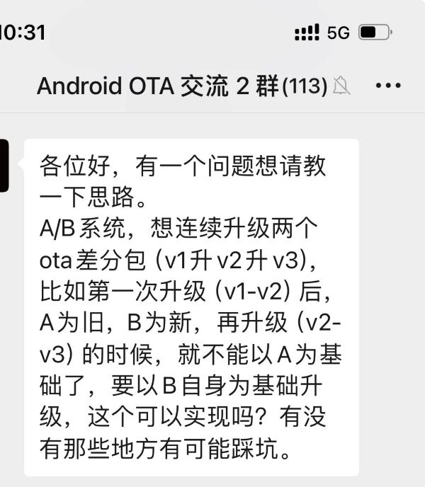

# 20240514-Android Update Engine 分析（二十九）如何进行连续多个版本的升级？

> 本文为洛奇看世界(guyongqiangx)原创，转载请注明出处。
>
> 原文链接：https://blog.csdn.net/guyongqiangx/article/details/138849767

## 0. 背景

关于如何连续进行多个版本升级，这是一个很常见的需求，也是 OTA 讨论群里试不试就会讨论的一个话题。

例如，昨天一个小伙伴在群里问，他想连续升级两个版本，如何操作比较好。

这个问题非常典型。

这个场景一般来自测试对多版本连续升级的检查需求：

当前系统运行在 A 槽位(版本 v1)，然后希望对 B 槽位进行连续多个版本的升级。

以升级两个版本 v2, v3 为例，希望先将 B 槽位升级到版本 v2，然后保持系统运行在 A 槽位，继续将 B 槽位版本从 v2 升级到 v3。

这个场景看起来很合理，但实际上没有必要。主要是不了解 Android A/B 系统的升级过程，才会提出这样的场景需求。

本文针对多版本连续升级的场景展开分析，详细讨论为什么多版本连续升级的场景没必要，以及跨多版本的情况下，到底是全量升级还是增量升级，对该如何评估进行介绍。

- 第 1 节简单总结全量升级和增量升级的原理和过程
- 第 2 节分析多版本连续升级不可能实现的原因
- 第 3 节提出如何选择跨版本的升级方式

> 核心代码[《Android Update Engine 分析》](https://blog.csdn.net/guyongqiangx/category_12140296.html)系列，文章列表：
>
> - [Android Update Engine分析（一）Makefile](https://blog.csdn.net/guyongqiangx/article/details/77650362)
>
> - [Android Update Engine分析（二）Protobuf和AIDL文件](https://blog.csdn.net/guyongqiangx/article/details/80819901)
>
> - [Android Update Engine分析（三）客户端进程](https://blog.csdn.net/guyongqiangx/article/details/80820399)
>
> - [Android Update Engine分析（四）服务端进程](https://blog.csdn.net/guyongqiangx/article/details/82116213)
>
> - [Android Update Engine分析（五）服务端核心之Action机制](https://blog.csdn.net/guyongqiangx/article/details/82226079)
>
> - [Android Update Engine分析（六）服务端核心之Action详解](https://blog.csdn.net/guyongqiangx/article/details/82390015)
>
> - [Android Update Engine分析（七） DownloadAction之FileWriter](https://blog.csdn.net/guyongqiangx/article/details/82805813)
>
> - [Android Update Engine分析（八）升级包制作脚本分析](https://blog.csdn.net/guyongqiangx/article/details/82871409)
>
> - [Android Update Engine分析（九） delta_generator 工具的 6 种操作](https://blog.csdn.net/guyongqiangx/article/details/122351084)
>
> - [Android Update Engine分析（十） 生成 payload 和 metadata 的哈希](https://blog.csdn.net/guyongqiangx/article/details/122393172)
>
> - [Android Update Engine分析（十一） 更新 payload 签名](https://blog.csdn.net/guyongqiangx/article/details/122597314)
>
> - [Android Update Engine分析（十二） 验证 payload 签名](https://blog.csdn.net/guyongqiangx/article/details/122634221)
>
> - [Android Update Engine分析（十三） 提取 payload 的 property 数据](https://blog.csdn.net/guyongqiangx/article/details/122646107)
>
> - [Android Update Engine分析（十四） 生成 payload 数据](https://blog.csdn.net/guyongqiangx/article/details/122753185)
>
> - [Android Update Engine分析（十五） FullUpdateGenerator 策略](https://blog.csdn.net/guyongqiangx/article/details/122767273)
>
> - [Android Update Engine分析（十六） ABGenerator 策略](https://blog.csdn.net/guyongqiangx/article/details/122886150)
>
> - [Android Update Engine分析（十七）10 类 InstallOperation 数据的生成和应用](https://blog.csdn.net/guyongqiangx/article/details/122942628)
>
> - [Android Update Engine分析（十八）差分数据到底是如何更新的？](https://blog.csdn.net/guyongqiangx/article/details/129464805)
>
> - [Android Update Engine分析（十九）Extent 到底是个什么鬼？](https://blog.csdn.net/guyongqiangx/article/details/132389438)
>
> - [Android Update Engine分析（二十）为什么差分包比全量包小，但升级时间却更长？](https://blog.csdn.net/guyongqiangx/article/details/132343017)
>
> - [Android Update Engine分析（二十一）Android A/B 的更新过程](https://blog.csdn.net/guyongqiangx/article/details/132536383)
>
> - [Android Update Engine分析（二十二）OTA 降级限制之 timestamp](https://blog.csdn.net/guyongqiangx/article/details/133191750)
>
> - [Android Update Engine分析（二十三）如何在升级后清除用户数据？](https://blog.csdn.net/guyongqiangx/article/details/133274277)
>
> - [Android Update Engine分析（二十四）制作降级包时，到底发生了什么？](https://blog.csdn.net/guyongqiangx/article/details/133421556)
>
> - [Android Update Engine分析（二十五）升级状态 prefs 是如何保存的？](https://blog.csdn.net/guyongqiangx/article/details/133421560)
>
> - [Android Update Engine分析（二十六）OTA 更新后不切换 Slot 会怎样？](https://blog.csdn.net/guyongqiangx/article/details/133691683)
>
> - [Android Update Engine分析（二十七）如何实现 OTA 更新但不切换 Slot？](https://blog.csdn.net/guyongqiangx/article/details/133849661)
>
> - [Android Update Engine分析（二十八）payload.bin 文件还能再压缩吗？](https://blog.csdn.net/guyongqiangx/article/details/138014834)
>
> - [Android Update Engine分析（二十九）如何进行连续多个版本的升级？](https://blog.csdn.net/guyongqiangx/article/details/138849767)

> 如果您已经订阅了本专栏，请务必加我微信，拉你进“动态分区 & 虚拟分区专栏 VIP 答疑群”。

## 1. A/B 系统的升级流程

在正式展开这个问题之前，先回顾下 Android A/B 系统的升级过程。

> 熟悉 A/B 系统升级流程的请自行跳过此部分，到第 2 节。

毕竟测试不是开发，不了解 Android A/B 系统的升级到底是如何实现的。所以开发有必要给测试科普一下 Android A/B 系统的升级流程。

这里假设当前系统运行在 A 槽位(版本 v1)，然后希望将 B 槽位升级到新版本 v2。

### 1.1 全量(整包)升级

全量升级比较简单，就是直接使用新系统 v2 的 image 制作 OTA 升级包 update.zip。

1. 当前系统在 A 槽位运行时，从服务器下载升级包 update.zip，
2. 一边下载一边升级(所谓的流式升级)，
3. 一步一步将接收到的升级数据在内存中还原(比如解压缩)，
4. 写入到 B 槽位对应分区中。

整个过程不需要 A 分区的数据参与，升级数据全部都来自升级包。

接收完整个 update.zip，也基本就意味着全部数据都已经被还原并写入到 B 槽位分区，这时 B 槽位的镜像就和制作升级包用的 v2 image 一样了。

更新完成后，系统重启并从 B 槽位启动，如果能正常启动进入系统，则升级成功，否则升级失败回退到槽位 A 的系统运行。

### 1.2 增量(差分)升级

想对于全量升级来说，差分升级要复杂不少，但大致的升级流程仍然一样。

所谓差分，就是对新系统 v2 和旧系统 v1 的镜像求差值，用数学公式表示，就是 delta = v2 - v1。

在比较 v2 和 v1 的镜像时，按 block 进行，逐块比较，粗略来说，有两种情况：

1. v2 和 v1 数据一样，没有差分数据，还原时从 v1 提取相应数据写入目标分区即可；
2. v2 和 v1 数据不同，此时就根据差分包中的 delta，在内存中基于 v1 的数据通过 v1 + delta = v2 进行还原，然后将还原后的数据写入目标分区；

至于差分数据生成的细节，本文不做深入讨论，请查看 OTA 升级专栏相关文章。

使用新系统 v2 的镜像，基于旧系统 v1 制作 OTA 升级的差分包 update.zip。这里的旧系统 v1 有时候也会被叫做基线(base)。

1. 当前系统在 A 槽位运行时，从服务器下载升级包，
2. 一边下载一边升级(所谓的流式升级)，
3. 每接收到 update.zip 中完整的一个升级操作数据，
   1. 如果数据是非差分数据，读取当前 A 槽位分区数据，写入到目标的 B 槽位分区中；
   2. 如果数据是差分数据，读取当前 A 槽位分区数据(v1)到内存，和接收到的差分数据(delta)一起进行还原得到目标分区数据(v2)，v1 + delta = v2，将 v2 数据写入到目标分区中；
4. 完成 update.zip 中所有数据的还原和写入操作

和全量升级一样，接收完整个 update.zip，也基本就意味着全部数据都已经基于 A 槽位还原并写入到 B 槽位分区中，这时 B 槽位的镜像就和制作升级包用的 v2 image 一样了。

更新完成后，系统重启并从 B 槽位启动，如果能正常启动进入系统，则升级成功，否则升级失败回退到槽位 A 的系统运行。

> 关于差分升级的细节，请参考：[《Android Update Engine 分析（十八）差分数据到底是如何更新的？》](https://blog.csdn.net/guyongqiangx/article/details/129464805)

### 1.3 总结

从上面的全量和增量升级来看，不论是哪一种方式，都和 B 槽位现有数据无关。

- 如果是全量升级，全部都使用差分包中的数据，和 A B 两个槽位现有数据都无关；
- 如果是增量升级，则需要读取当前 A 槽位分区数据，和 update.zip 中的差分数据一起在内存中还原，再写入到 B 槽位分区中。

## 2. 问题分析

回到本文一开始的场景：

当前系统运行在 A 槽位(版本 v1)，然后希望通过差分包方式，对 B 槽位连续进行多个版本的升级，从 v1->v2，再从 v2->v3。

- v1 -> v2
  - B 槽位从 v1 升级到 v2 比较好实现，就是利用当前 A 槽位的系统 v1 + delta1 = v2 进行升级即可，这里的 delta1 是指 v1->v2 的差分包数据。
- v2 -> v3
  - B 槽位从 v2 升级到 v3 该如何实现呢？按理说是 v2 + delta2 = v3 就可以了，这里就需要 v2 数据。但因为差分升级基于当前运行的槽位，而当前槽位 A 运行在 v1 版本，不是希望的 v2，所以这种升级没法通过正常的升级流程完成。

你或许会有疑问，那我读取出 B 槽位数据 v2，然后在内存中使用 v2 + delta2 = v3 还原再写回到 B 槽位不就可以了吗？

问题就出在，读取的原始数据 v2 和目标数据 v3 很大可能并不在同一个位置上，这里就涉及到多个位置了，这些位置的数据要怎么处理？

理论上可以缓存到内存中，但是一旦位置不一样的数据很多，这种操作根本就不可行。

既然 v1 -> v2，然后再从 v2 -> v3，这中间一直都在 A 槽位的系统运行，从来没有使用过 v2 系统。为什么还非要升级到 v2 ，而不是一步到位从 v1 -> v3 呢？因此，这个升级的场景就是不合理的。

另外，去测试一个从来不会使用的场景，实在也没有必要。

如果作为开发，你的测试提出这个测试场景，可以把这里的升级逻辑向她解释一下。

## 3. 解决办法

既然没有必要 v1 -> v2 -> v3，那自然就是 v1 -> v3 一步到位了。

这个一步到位又该怎么操作，有什么需要注意的呢？

这里也是有两种方式：

1. 全量升级

   直接用 v3 版本镜像制作一个全量升级包，当前在 A 槽位运行时，将 B 槽位升级到 v3 镜像。

   

2. 增量升级

   使用 v3 和 v1 进行制作一个增量升级包，当前在 A 槽位运行是，基于 A 槽位的 v1 数据，将 B  槽位升级到 v3 镜像。

全量升级简单，但升级包很大，对应于传输时间和流量要求较高。

差分升级复杂，但升级包较小，但升级时间可能会更长。

> 参考：[《Android Update Engine 分析（二十）为什么差分包比全量包小，但升级时间却更长？》](https://blog.csdn.net/guyongqiangx/article/details/132343017)

到底该怎么选择呢？这里有个权衡的过程。

所谓的权衡就是亲自进行全量升级和差分升级比较，看看升级包到底有多大，升级时间到底有多长，二者差别有多大，然后再做决定选择哪一个给客户推送。

或者，使用 `payload_info.py` 工具，对全量包和增量包预先进行分析，选择较优那个。

具体如何分析，参考下面两篇文章：

- [《Android OTA 相关工具(四) 查看 payload 文件信息》](https://blog.csdn.net/guyongqiangx/article/details/129228856)
- [《Android Update Engine 分析（二十）为什么差分包比全量包小，但升级时间却更长？》](https://blog.csdn.net/guyongqiangx/article/details/132343017)

通常情况下，如果 v3 和 v1 差异很小，个人建议选择差分升级，如果差异较大，那就应该选择整包升级。

在跨越版本比较多的情况下，例如 v1 -> v4, v5 这样的三个或三个以上版本，基本上都偏向于做一次整包升级了。

实际上在交流讨论过程中，对于这类 v1 -> v3 的升级，有不少群友选择整包升级方案。

## 4. 其它

到目前为止，我写过 Android OTA 升级相关的话题包括：

- 基础入门：《Android A/B 系统》系列
- 核心模块：《Android Update Engine 分析》 系列
- 动态分区：《Android 动态分区》 系列
- 虚拟 A/B：《Android 虚拟 A/B 分区》系列
- 升级工具：《Android OTA 相关工具》系列

更多这些关于 Android OTA 升级相关文章的内容，请参考[《Android OTA 升级系列专栏文章导读》](https://blog.csdn.net/guyongqiangx/article/details/129019303)。

如果您已经订阅了动态分区和虚拟分区付费专栏，请务必加我微信，备注订阅账号，拉您进“动态分区 & 虚拟分区专栏 VIP 答疑群”。我会在方便的时候，回答大家关于 A/B 系统、动态分区、虚拟分区、各种 OTA 升级和签名的问题。

我有几个 Android OTA 升级讨论群，里面现在有小几百的朋友，主要讨论手机，车机，电视，机顶盒，平板等各种设备的 OTA 升级话题，如果您从事 OTA 升级工作，欢迎加群一起交流，请在加我微信时注明“Android OTA 交流”。此群仅限 Android OTA 开发者参与~

> 公众号“洛奇看世界”后台回复“wx”获取个人微信。

另外，我近期在群里找了个合伙人整理 OTA 讨论群的问题，放到知识星球，如果你对这些问题感兴趣，欢迎加入星球查阅。知识星球的更多信息，请参考：[《Android OTA 问题交流微信群和知识星球》](https://blog.csdn.net/guyongqiangx/article/details/137981377)

