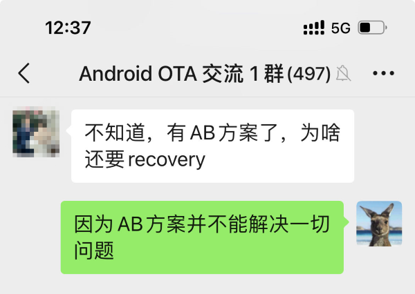
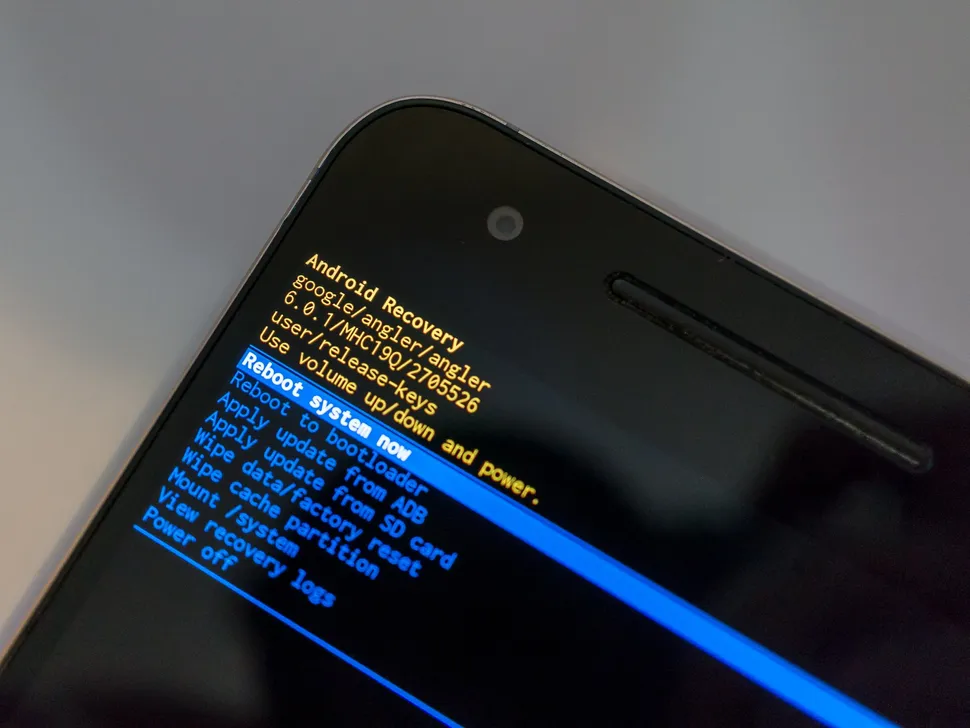
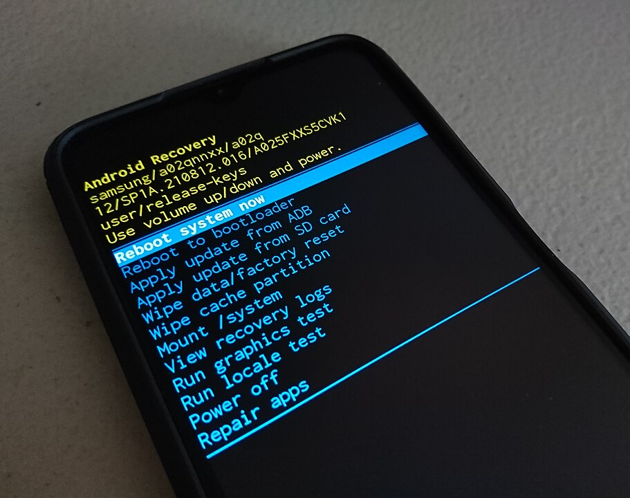

## 20240514-Android Update Engine 分析（三十）有了A/B系统，为什么还要 Recovery？

- 本文为洛奇看世界(guyongqiangx)原创，转载请注明出处。
- 原文链接：https://blog.csdn.net/guyongqiangx/article/details/140345412

## 0. 背景

有朋友在群里问，既然现在已经有 A/B 方案了，为啥还要 Recovery 系统？

这确实是个好问题。

本文先单独分析 A/B 系统和 Recovery 系统各自的功能，然后对比功能差异来找到 A/B 系统并不能完全替代 Recovery 系统的原因。同时，也解释了 Recovery 系统存在的意义。

> 核心代码[《Android Update Engine 分析》](https://blog.csdn.net/guyongqiangx/category_12140296.html)系列，文章列表：
>
> - [Android Update Engine分析（一）Makefile](https://blog.csdn.net/guyongqiangx/article/details/77650362)
>
> - [Android Update Engine分析（二）Protobuf和AIDL文件](https://blog.csdn.net/guyongqiangx/article/details/80819901)
>
> - [Android Update Engine分析（三）客户端进程](https://blog.csdn.net/guyongqiangx/article/details/80820399)
>
> - [Android Update Engine分析（四）服务端进程](https://blog.csdn.net/guyongqiangx/article/details/82116213)
>
> - [Android Update Engine分析（五）服务端核心之Action机制](https://blog.csdn.net/guyongqiangx/article/details/82226079)
>
> - [Android Update Engine分析（六）服务端核心之Action详解](https://blog.csdn.net/guyongqiangx/article/details/82390015)
>
> - [Android Update Engine分析（七） DownloadAction之FileWriter](https://blog.csdn.net/guyongqiangx/article/details/82805813)
>
> - [Android Update Engine分析（八）升级包制作脚本分析](https://blog.csdn.net/guyongqiangx/article/details/82871409)
>
> - [Android Update Engine分析（九） delta_generator 工具的 6 种操作](https://blog.csdn.net/guyongqiangx/article/details/122351084)
>
> - [Android Update Engine分析（十） 生成 payload 和 metadata 的哈希](https://blog.csdn.net/guyongqiangx/article/details/122393172)
>
> - [Android Update Engine分析（十一） 更新 payload 签名](https://blog.csdn.net/guyongqiangx/article/details/122597314)
>
> - [Android Update Engine分析（十二） 验证 payload 签名](https://blog.csdn.net/guyongqiangx/article/details/122634221)
>
> - [Android Update Engine分析（十三） 提取 payload 的 property 数据](https://blog.csdn.net/guyongqiangx/article/details/122646107)
>
> - [Android Update Engine分析（十四） 生成 payload 数据](https://blog.csdn.net/guyongqiangx/article/details/122753185)
>
> - [Android Update Engine分析（十五） FullUpdateGenerator 策略](https://blog.csdn.net/guyongqiangx/article/details/122767273)
>
> - [Android Update Engine分析（十六） ABGenerator 策略](https://blog.csdn.net/guyongqiangx/article/details/122886150)
>
> - [Android Update Engine分析（十七）10 类 InstallOperation 数据的生成和应用](https://blog.csdn.net/guyongqiangx/article/details/122942628)
>
> - [Android Update Engine分析（十八）差分数据到底是如何更新的？](https://blog.csdn.net/guyongqiangx/article/details/129464805)
>
> - [Android Update Engine分析（十九）Extent 到底是个什么鬼？](https://blog.csdn.net/guyongqiangx/article/details/132389438)
>
> - [Android Update Engine分析（二十）为什么差分包比全量包小，但升级时间却更长？](https://blog.csdn.net/guyongqiangx/article/details/132343017)
>
> - [Android Update Engine分析（二一）Android A/B 的更新过程](https://blog.csdn.net/guyongqiangx/article/details/132536383)
>
> - [Android Update Engine分析（二二）OTA 降级限制之 timestamp](https://blog.csdn.net/guyongqiangx/article/details/133191750)
>
> - [Android Update Engine分析（二三）如何在升级后清除用户数据？](https://blog.csdn.net/guyongqiangx/article/details/133274277)
>
> - [Android Update Engine分析（二四）制作降级包时，到底发生了什么？](https://blog.csdn.net/guyongqiangx/article/details/133421556)
>
> - [Android Update Engine分析（二五）升级状态 prefs 是如何保存的？](https://blog.csdn.net/guyongqiangx/article/details/133421560)
>
> - [Android Update Engine分析（二六）OTA 更新后不切换 Slot 会怎样？](https://blog.csdn.net/guyongqiangx/article/details/133691683)
>
> - [Android Update Engine分析（二七）如何实现 OTA 更新但不切换 Slot？](https://blog.csdn.net/guyongqiangx/article/details/133849661)
>
> - [Android Update Engine分析（二八）payload.bin 文件还能再压缩吗？](https://blog.csdn.net/guyongqiangx/article/details/138014834)
>
> - [Android Update Engine分析（二九）如何进行连续多个版本的升级？](https://blog.csdn.net/guyongqiangx/article/details/138849767)
>
> - [Android Update Engine分析（三十）有了A/B系统，为什么还要 Recovery？](https://blog.csdn.net/guyongqiangx/article/details/140345412)

> 如果您已经订阅了本专栏，请务必加我微信，拉你进“动态分区 & 虚拟分区专栏 VIP 答疑群”。

## 1. 问题

为啥有了 A/B 系统的升级方案，还要 Recovery 呢？

为了回答这个问题，需要系统分析，标准的做法是这样的：

1. 分析 A/B 系统和 Recovery 系统各自的功能
2. 对比 A/B 系统和 Recovery 系统的功能差异

如果 Recovery 系统所有的功能 A/B 系统都能满足，那自然的结果就是有了 A/B 系统，就可以不需要 Recovery 系统了。

如果 A/B 系统并不能实现所有的 Recovery 所具有的功能，那就无法完全替换。

## 2. A/B 系统

A/B 系统最大的特点就是无缝(seamless)升级~又或者叫做无感升级。

当前设备运行在 A 槽位，后台检测到可以升级后，一边下载升级包一边解析并更新 B 槽位(流式升级)，更新完 B 槽位之后，设备需要通过重启切换到 B 槽位。

设备重启后，从 B 槽位启动：

1. 成功进入 Android 主系统，升级成功！
2. 在启动中因为某些原因失败了，系统无法进入 B 槽位的系统，此时设备再次重启回滚(rollback)进入 A 系统。

所以，我们能看到 A/B 系统的功能就是：

1. 后台静默升级(无感)
2. 升级失败可以回滚

## 3. Recovery 系统

Recovery，顾名思义，就是恢复的意思。

最典型的场景就是，设备的主系统无法正常启动，意味着变砖了，此时进入 Recovery 系统，进行一系列的操作，比方说刷机等，让设备可以重新工作。

Recovery 到底能做什么呢

### 3.1 原生 Android M(6) 设备

这里提供一张 Google Nexus 6P (代号：angler) 手机的 Recovery 界面截图：

> 来源：https://www.androidcentral.com/what-recovery-android-z

严格来说，这是一台 Android A/B 系统(Android N 7.1.2)引入之前的 Android 设备的 Recovery 截图。

这台出厂就搭载 Android M 的原生设备，从菜单看到的 Recovery 功能如下：

- Reboot system now
- Reboot to bootloader
- Apply update from ADB
- Apply update from SD card
- Wipe data/factory reset
- Wip cache partition
- Mount /system
- View recovery logs
- Power off

### 3.2 Samsung Android S(12) 设备

下面再提供一张来自维基百科的图片：

> 来源: https://en.wikipedia.org/wiki/Android_recovery_mode

从图片中的信息可以看到，这是一台 Samsung 手机设备，搭载了 Android S(12) 系统，Recovery 中包含的功能如下：

- Reboot system now
- Reboot to bootloader
- Apply update from ADB
- Apply update from SD card
- Wipe data/factory reset
- Wipe cache partition
- Mount /system
- View recovery logs
- Run graphics test
- Run locale test
- Power off
- Repair apps

相比于上一节的 Android 原生设备(Google Nexus 6P)，这台三星手机的 Recovery 多了一些厂家自定义的诊断和测试功能，例如 "Run gaphics test", "Run locale test" 等。

总结一下上面两台手机 Recovery 下的功能：

1. 升级(可以从 ADB 或者 SD Card 升级)
2. 擦除 data 和 cache 分区，实现工厂复位
3. 挂载 /system 等分区，查看 recovery log
4. 执行其它厂家自定义的操作

### 3.3 Recovery 系统的功能

不仅是 Android 带有 Recovery 系统，很多设备都带有自己的 Recovery 系统，例如 Windows 系统自带了 Recovery，Ubuntu 也自带了 Recovery，各种服务器等也带有 Recovery。

所以，一般意义上来讲，Recovery 系统的作用包括：

- 系统恢复：当主系统出现严重问题无法正常启动时，Recovery 系统可以用来恢复设备至出厂设置或之前的备份状态。

- 故障诊断：它提供了一个独立的环境来诊断和修复主系统的问题。

- 系统更新：某些设备使用Recovery系统来安装重大系统更新或升级。

- 数据备份与恢复：可以用来备份设备数据或从备份中恢复数据。

- 安全保障：作为一个独立的系统,它可以在主系统受到安全威胁时提供保护。(例如：Windows 系统在电脑中度的情况下，可以进入 Recovery 清除病毒)

- 高级维护：允许用户或技术人员执行一些在正常系统下无法进行的高级维护操作。

对 Android 来说，包括：

- 系统更新：可以安装官方OTA（空中下载）更新包或自定义ROM。

- 擦除数据/恢复出厂设置：允许用户清除所有用户数据并将设备恢复到出厂状态。

- 清除缓存分区：帮助解决一些性能问题或更新后的兼容性问题。

- 应用ADB侧载：允许通过USB连接从电脑安装更新或应用。

- 备份和恢复：某些Recovery版本支持创建和恢复完整的系统备份。

- 挂载/卸载分区：高级用户可以直接操作设备的存储分区。

- 日志记录：可以生成用于诊断问题的系统日志。
- 其它厂家自定义的诊断、测试和修复功能

## 4. A/B 系统和 Recovery 系统的差异

有了上面的分析，我们就可以来看 A/B 系统和 Recovery 的差异了。

- A/B 系统的主要功能是升级和失败时回滚。

- Recovery 系统除了可以完成升级外，还有一些数据维护操作(挂载分区，擦除 data, cache，以及工厂复位等)，以及一些其它的测试功能

你或许会有疑问，A/B 系统确保设备上始终存在一个可以运行的系统，那其实就不需要进入 Recovery 更新啦~

另外，将 Recovery 系统上的各种功能移到主系统，这样就不再需要 Recovery 了~

现实是这样的：

1. 设备在某些特殊情况下，A/B 系统上的两个系统都不能工作时，需要通过 Recovery 来修复。甚至当 Recovery 也被破坏时，只能进入设备的 bootloader 中想办法修复。
2. Android 主系统启动后，会自动挂载 /data 分区，也就意味着这下面的某些数据文件已经被加载或者一直在使用中；如果此时更改这些文件，达不到预期的效果甚至因为在使用中而无法更改，因此最好的办法是在主系统之外进行。
3. 有些机器的诊断和测试应用不方便暴露给终端用户，因此存放到一个单独的维护系统中比较妥当。

所以，升级更新只是 Recovery 功能的一部分，其它的一些功能并不能完全移植到 Android 主系统中。

即使 A/B 系统已经很完善了，但 Recovery 系统仍然有存在的必要，只是 Recovery 系统可能不再单独存在于某个独立的分区，而是和 system 或 boot 分区合并到一起了。

现在，你明白有了A/B系统，却还是需要 Recovery 系统了吗？

## 5. 其它

到目前为止，我写过 Android OTA 升级相关的话题包括：

- 基础入门：《Android A/B 系统》系列
- 核心模块：《Android Update Engine 分析》 系列
- 动态分区：《Android 动态分区》 系列
- 虚拟 A/B：《Android 虚拟 A/B 分区》系列
- 升级工具：《Android OTA 相关工具》系列

更多这些关于 Android OTA 升级相关文章的内容，请参考[《Android OTA 升级系列专栏文章导读》](https://blog.csdn.net/guyongqiangx/article/details/129019303)。

如果您已经订阅了动态分区和虚拟分区付费专栏，请务必加我微信，备注订阅账号，拉您进“动态分区 & 虚拟分区专栏 VIP 答疑群”。我会在方便的时候，回答大家关于 A/B 系统、动态分区、虚拟分区、各种 OTA 升级和签名的问题。

我有几个 Android OTA 升级讨论群，里面现在有小几百的朋友，主要讨论手机，车机，电视，机顶盒，平板等各种设备的 OTA 升级话题，如果您从事 OTA 升级工作，欢迎加群一起交流，请在加我微信时注明“Android OTA 交流”。此群仅限 Android OTA 开发者参与~

> 公众号“洛奇看世界”后台回复“wx”获取个人微信。

另外，我近期在群里找了个合伙人整理 OTA 讨论群的问题，放到知识星球，如果你对这些问题感兴趣，欢迎加入星球查阅。知识星球的更多信息，请参考：[《Android OTA 问题交流微信群和知识星球》](https://blog.csdn.net/guyongqiangx/article/details/137981377)

