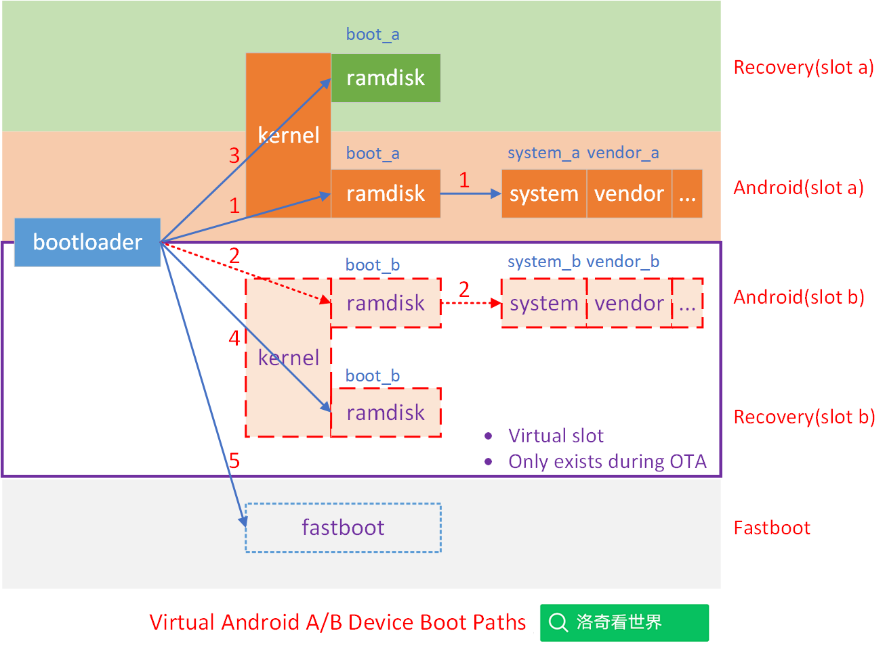

## 20240726-Android Update Engine 分析（三三）Android 设备上到底有哪些可以运行的系统?

- 本文为洛奇看世界(guyongqiangx)原创，转载请注明出处。
- 原文链接：https://blog.csdn.net/guyongqiangx/article/details/144328241

## 0. 背景

Android slot 槽位的切换是 Android OTA 一个比较基础的知识点，也是 Android OTA 讨论群里问得比较多的问题，刚接触 Android OTA 的同学往往不清楚槽位 slot 到底是如何切换的。

我在[《Android A/B System OTA分析（三）主系统和bootloader的通信》](https://blog.csdn.net/guyongqiangx/article/details/72480154)有中，有做过相关内容的分析。但没有明确指出槽位是如何切换的。这里单独将 slot 槽位的切换拿出来说一说。

本文围绕以下几个问题展开：

1. 为什么要切换槽位？
2. 哪些情况会切换槽位？
3. 在哪里切换槽位？

> 核心代码[《Android Update Engine 分析》](https://blog.csdn.net/guyongqiangx/category_12140296.html)系列，文章列表：
>
> - [Android Update Engine分析（一）Makefile](https://blog.csdn.net/guyongqiangx/article/details/77650362)
>
> - [Android Update Engine分析（二）Protobuf和AIDL文件](https://blog.csdn.net/guyongqiangx/article/details/80819901)
>
> - [Android Update Engine分析（三）客户端进程](https://blog.csdn.net/guyongqiangx/article/details/80820399)
>
> - [Android Update Engine分析（四）服务端进程](https://blog.csdn.net/guyongqiangx/article/details/82116213)
>
> - [Android Update Engine分析（五）服务端核心之Action机制](https://blog.csdn.net/guyongqiangx/article/details/82226079)
>
> - [Android Update Engine分析（六）服务端核心之Action详解](https://blog.csdn.net/guyongqiangx/article/details/82390015)
>
> - [Android Update Engine分析（七） DownloadAction之FileWriter](https://blog.csdn.net/guyongqiangx/article/details/82805813)
>
> - [Android Update Engine分析（八）升级包制作脚本分析](https://blog.csdn.net/guyongqiangx/article/details/82871409)
>
> - [Android Update Engine分析（九） delta_generator 工具的 6 种操作](https://blog.csdn.net/guyongqiangx/article/details/122351084)
>
> - [Android Update Engine分析（十） 生成 payload 和 metadata 的哈希](https://blog.csdn.net/guyongqiangx/article/details/122393172)
>
> - [Android Update Engine分析（十一） 更新 payload 签名](https://blog.csdn.net/guyongqiangx/article/details/122597314)
>
> - [Android Update Engine分析（十二） 验证 payload 签名](https://blog.csdn.net/guyongqiangx/article/details/122634221)
>
> - [Android Update Engine分析（十三） 提取 payload 的 property 数据](https://blog.csdn.net/guyongqiangx/article/details/122646107)
>
> - [Android Update Engine分析（十四） 生成 payload 数据](https://blog.csdn.net/guyongqiangx/article/details/122753185)
>
> - [Android Update Engine分析（十五） FullUpdateGenerator 策略](https://blog.csdn.net/guyongqiangx/article/details/122767273)
>
> - [Android Update Engine分析（十六） ABGenerator 策略](https://blog.csdn.net/guyongqiangx/article/details/122886150)
>
> - [Android Update Engine分析（十七）10 类 InstallOperation 数据的生成和应用](https://blog.csdn.net/guyongqiangx/article/details/122942628)
>
> - [Android Update Engine分析（十八）差分数据到底是如何更新的？](https://blog.csdn.net/guyongqiangx/article/details/129464805)
>
> - [Android Update Engine分析（十九）Extent 到底是个什么鬼？](https://blog.csdn.net/guyongqiangx/article/details/132389438)
>
> - [Android Update Engine分析（二十）为什么差分包比全量包小，但升级时间却更长？](https://blog.csdn.net/guyongqiangx/article/details/132343017)
>
> - [Android Update Engine分析（二一）Android A/B 的更新过程](https://blog.csdn.net/guyongqiangx/article/details/132536383)
>
> - [Android Update Engine分析（二二）OTA 降级限制之 timestamp](https://blog.csdn.net/guyongqiangx/article/details/133191750)
>
> - [Android Update Engine分析（二三）如何在升级后清除用户数据？](https://blog.csdn.net/guyongqiangx/article/details/133274277)
>
> - [Android Update Engine分析（二四）制作降级包时，到底发生了什么？](https://blog.csdn.net/guyongqiangx/article/details/133421556)
>
> - [Android Update Engine分析（二五）升级状态 prefs 是如何保存的？](https://blog.csdn.net/guyongqiangx/article/details/133421560)
>
> - [Android Update Engine分析（二六）OTA 更新后不切换 Slot 会怎样？](https://blog.csdn.net/guyongqiangx/article/details/133691683)
>
> - [Android Update Engine分析（二七）如何实现 OTA 更新但不切换 Slot？](https://blog.csdn.net/guyongqiangx/article/details/133849661)
>
> - [Android Update Engine分析（二八）payload.bin 文件还能再压缩吗？](https://blog.csdn.net/guyongqiangx/article/details/138014834)
>
> - [Android Update Engine分析（二九）如何进行连续多个版本的升级？](https://blog.csdn.net/guyongqiangx/article/details/138849767)
>
> - [Android Update Engine分析（三十）有了A/B系统，为什么还要 Recovery？](https://blog.csdn.net/guyongqiangx/article/details/140345412)
>
> - [Android Update Engine分析（三一）Android 能在升级时新增分区吗?](https://blog.csdn.net/guyongqiangx/article/details/140508309)
>
> - [Android Update Engine分析（三二）Android 的槽位切换是如何实现的?](https://blog.csdn.net/guyongqiangx/article/details/140759462)
>
> - [Android Update Engine分析（三三）Android 设备上到底有哪些可以运行的系统？](https://blog.csdn.net/guyongqiangx/article/details/144328241)

> 如果您已经订阅了本专栏，请务必加我微信，拉你进“动态分区 & 虚拟分区专栏 VIP 答疑群”。

## 1. 为什么要切换槽位？

为什么要切换槽位？切换槽位的本质是什么？

下面这三个图分别显示了非 A/B 和 A/B 双槽位，以及虚拟 A/B 的 Android 设备上的可用系统。

### 1.1 非 A/B 的 Android 设备

在 Android A/B (7.1) 之前非 A/B 系统的设备上，存在 3 种可能得情况：

1. Android 主系统：系统正常启动，走路径 1 的模式启动进入 Android 主系统
   - `bootloader 分区 --> boot 分区 --> system 分区`
2. Recovery 系统：系统升级，复位或不能正常启动时，走路径 2 的模式启动进入 Recovery 系统
   - `bootloader 分区 --> recovery 分区`
3. fastboot 模式：当 Android 主系统和 Recovery 系统都无法正常使用时，唯一的途径就是路径 3，进入系统刷机的 fastboot 模式
   - 直接从 bootloader 进入 fastboot 模式刷机，系统最后的救命稻草(除非你手贱把 bootloader 也搞坏了)

### 1.2 带 A/B 双系统的 Android 设备

相比于前面的非 A/B 设备，A/B 双系统的设备上可能得启动路径就比较多了。

1. A 槽位主系统：系统正常启动，走路径 1 的模式启动进入 A 槽位的 Android 主系统
   - `bootloader 分区 --> boot_a 分区 --> system_a 分区`
2. B 槽位主系统：系统正常启动，走路径 2 的模式启动进入 B 槽位的 Android 主系统
   - `bootloader 分区 --> boot_b 分区 --> system_b 分区`
3. A 槽位 Recovery 系统：系统升级，复位或不能正常启动时，走路径 3 的模式启动进入 A 槽位的 Recovery 系统
   - `bootloader 分区 --> boot_a 分区`
4. B 槽位 Recovery 系统：系统升级，复位或不能正常启动时，走路径 4 的模式启动进入 B 槽位的 Recovery 系统
   - `bootloader 分区 --> boot_b 分区`
5. fastboot 模式：当两个槽位的 Android 系统和 Recovery 系统都无法正常使用时，唯一的途径就是路径 5，进入系统刷机的 fastboot 模式
   - 直接从 bootloader 进入 fastboot 模式刷机，系统最后的救命稻草(除非你手贱把 bootloader 也搞坏了)

> Android A/B 系统的设备大多不再有单独的 Reocvery 分区，早期 A/B 系统的 Recovery ramdisk 存放在 boot 分区，和 Android 主系统共用同一个 kernel，后来随着系统演变，ramdisk 位置有些变动，为简单起见，这里以早期的系统为例。
>
> 关于 Recovery 的 ramdisk 位置的变化，值得专门用一篇文章说明。
>
> Android 官方对此也有一些总结资料：
>
> - [《Ramdisk 分区》](https://source.android.com/docs/core/architecture/partitions/ramdisk-partitions?hl=zh-cn)
>   - https://source.android.com/docs/core/architecture/partitions/ramdisk-partitions?hl=zh-cn

### 1.3  虚拟 A/B 系统的 Android 设备

在 Virual A/B 系统上，只有在升级过程中才会有两套槽位(其中一套槽位时虚拟出来的)存在，除此之外，平时只有一套 Android 系统，所以看起来像这样：

这一套路径和 A/B 双系统很接近，但又有所不同，因为 Virtual A/B 听起来是 A/B 系统，但平时实际上只有一个槽位有效，只有在升级过程中，设备才会虚拟出另外一套槽位来，完成升级后，虚拟的槽位会再次消失。

因此，对于平时，只有一套主系统，因此：

1. Android 主系统：系统正常启动，走路径 1 的模式启动进入 A 槽位的 Android 主系统
   - `bootloader 分区 --> boot_a 分区 --> system_a 分区`
2. Recovery 系统：系统升级，复位或不能正常启动时，走路径 3 的模式启动进入 A 槽位的 Recovery 系统
   - `bootloader 分区 --> boot_a 分区`
3. fastboot 模式：当两个槽位的 Android 系统和 Recovery 系统都无法正常使用时，唯一的途径就是路径 5，进入系统刷机的 fastboot 模式
   - 直接从 bootloader 进入 fastboot 模式刷机，系统最后的救命稻草(除非你手贱把 bootloader 也搞坏了)

在 OTA 升级过程中，假定当前在 A 槽位升级，此时虚拟出 B 槽位，在 B 槽位更新完成，开始 merge 之前，A 和 B两个槽位都包含可运行的系统，此时有：

- B 槽位主系统：系统正常启动，走路径 2 的模式启动进入 B 槽位的 Android 主系统
  - `bootloader 分区 --> boot_b 分区 --> system_b 分区`
- B 槽位 Recovery 系统：系统升级，复位或不能正常启动时，走路径 4 的模式启动进入 B 槽位的 Recovery 系统
  - `bootloader 分区 --> boot_b 分区`

> 特别说明：
>
> 对于 A/B 系统，早期有独立的 recovery ramdisk，但在后期，这个 ramdisk 合并到了 system 分区中。
>
> 但在 Virtual A/B 系统中，recovery 系统位于 system 分区，这又引起了另外一个问题。
>
> 假设当前在 A  槽位，升级 B 槽位后在 merge 的过程中掉电，此时 A 槽位已经被 merge 操作破坏，而 B 槽位很可能会因为掉电异常，此时除了 A 系统不可用之外，B 系统也不可用了。而且，B 槽位因为分区破坏，连 recovery 系统也进不去了。
>
> 系统完全变砖，只能通过 fastboot 模式刷机。
>
> 这个问题的说明特别感谢小伙伴“沧海一笑”，在和他讨论时我们才发现这也可能是一个问题。

### 1.4 槽位切换的本质

我们通常说的槽位切换，是指 A/B 系统中，A 和 B 两个槽位的 Android 系统切换。

其实更一般的情况是，设备上各个可以使用的系统路径之间的切换，其本质是 bootloader 根据不同的场景，选择不同的启动路径。

包括：

- bootloader 停留在自己的命令行
  - 保持在 bootloader 自己的命令行状态，等待下一步操作(例如通过 fastboot 命令进入 fastboot 刷机状态)
- bootloader 加载 recovery 系统
- bootloader 加载 A/B 两个槽位其中一个 Android 主系统
- bootloader 加载 A/B 两个槽位其中一个的 Recovery 系统
- bootloader 进入 fastboot 刷机模式。

> 问题: bootloader 是根据什么内容来判断的呢？

## 2. 哪些情况会切换槽位？

在回答上一节的问题之前，我们总结下哪些情况下会进入什么样的系统。

### 2.1 非 A/B 系统

1. 出厂时设备默认进入 Android 主系统
2. 在需要设备复位、升级和 Android 主系统不能启动时，设备进入 Recovery 救援系统
3. 如果 Recovery 系统也无法启动的情况下，设备进入 bootloader 的 fastboot 模式

### 2.2 A/B 系统

A/B 系统相对于非 A/B 系统来说会稍微复杂一些：

1. 出厂时设备默认进入 A 槽位的 Android 主系统
2. 在 A 槽位需要设备复位，或通过 U 盘等方式升级时，设备进入 A 槽位的 Recovery 救援系统
3. 在 A 槽位 Android 系统运行时升级 B 槽位，完成后切换到 B 槽位，设备重启后进入 B 槽位新的 Android 主系统
4. 在 B 槽位需要设备复位，或通过 U 盘等方式升级时，设备进入 B 槽位的 Recovery 救援系统
5. 在 B 槽位 Android 系统运行时升级 A 槽位，完成后切换到 A 槽位，设备重启后进入 A 槽位新的 Android 主系统
6. 在 B 槽位 Android 系统运行时升级 A 槽位，完成后切换到 A 槽位，设备重启后进入 A 槽位但验证失败，回退会 B 槽位系统
7. 如果 A、B 两个槽位的 Android 和 Recovery 都不能工作时，唯一的方式就是进入 bootloader 的 fastboot 模式

这里列举了一些典型的场景，实际可能的情况更多，例如：

即使 Android 系统能正常工作，在 bootloader 的命令行，也可以强制进入 Recovery 系统或 fastboot 刷机模式。

## 3. bootloader 是如何判断进入哪个系统的？

这部分的具体核心就是[《Android A/B System OTA分析（三）主系统和bootloader的通信》](https://blog.csdn.net/guyongqiangx/article/details/72480154)的内容了。

最新代码可能会有些不同，由于 bootloader 中系统切换由各芯片厂家和设备厂家实现，每一家的方案都不一样，所以无法通一套代码说明。

大致方向上，可以参考 u-boot 源码中相关内容。

## 4. 其它

到目前为止，我写过 Android OTA 升级相关的话题包括：

- 基础入门：《Android A/B 系统》系列
- 核心模块：《Android Update Engine 分析》 系列
- 动态分区：《Android 动态分区》 系列
- 虚拟 A/B：《Android 虚拟 A/B 分区》系列
- 升级工具：《Android OTA 相关工具》系列

更多这些关于 Android OTA 升级相关文章的内容，请参考[《Android OTA 升级系列专栏文章导读》](https://blog.csdn.net/guyongqiangx/article/details/129019303)。

如果您已经订阅了动态分区和虚拟分区付费专栏，请务必加我微信，备注订阅账号，拉您进“动态分区 & 虚拟分区专栏 VIP 答疑群”。我会在方便的时候，回答大家关于 A/B 系统、动态分区、虚拟分区、各种 OTA 升级和签名的问题。

我有几个 Android OTA 升级讨论群，里面现在有小几百的朋友，主要讨论手机，车机，电视，机顶盒，平板等各种设备的 OTA 升级话题，如果您从事 OTA 升级工作，欢迎加群一起交流，请在加我微信时注明“Android OTA 交流”。此群仅限 Android OTA 开发者参与~

> 公众号“洛奇看世界”后台回复“wx”获取个人微信。

