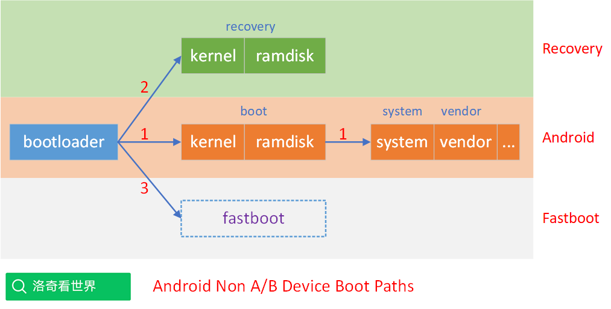
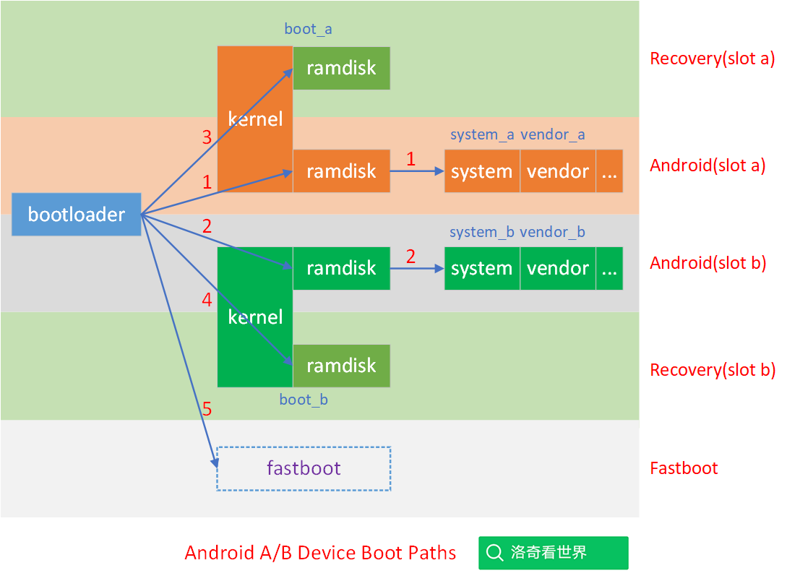

## 20240726-Android Update Engine 分析（三二）Android 的槽位切换是如何实现的?

- 本文为洛奇看世界(guyongqiangx)原创，转载请注明出处。
- 原文链接：

## 0. 背景

Android slot 槽位的切换是 Android OTA 一个比较基础的知识点，也是 Android OTA 讨论群里问得比较多的问题，刚接触 Android OTA 的同学往往不清楚槽位 slot 到底是如何切换的。

我在[《Android A/B System OTA分析（三）主系统和bootloader的通信》](https://blog.csdn.net/guyongqiangx/article/details/72480154)有中，有做过相关内容的分析。但没有明确指出槽位是如何切换的。这里单独将 slot 槽位的切换拿出来说一说。

本文围绕以下几个问题展开：

1. 为什么要切换槽位？
2. 哪些情况会切换槽位？
3. 在哪里切换槽位？
4. 具体示例代码实现

## 1. 为什么要切换槽位？

为什么要切换槽位？切换槽位的本质是什么？

下面这两个图分别显示了非 A/B 和 A/B 的 Android 设备上的可用系统。

### 1.1 非 A/B 的 Android 设备

在 Android A/B (7.1) 之前的设备上，存在 3 种可能得情况：

1. 系统正常启动，走路径 1 的模式启动进入 Android 主系统
   - `bootloader 分区 --> boot 分区 --> system 分区`
2. 系统升级，复位或不能正常启动时，走路径 2 的模式启动进入 Recovery 系统
   - `bootloader 分区 --> recovery 分区`
3. 当 Android 主系统和 Recovery 系统都无法正常使用时，唯一的途径就是路径 3，进入系统刷机的 fastboot 模式
   - 直接从 bootloader 进入 fastboot 模式刷机，系统最后的救命稻草(除非你手贱把 bootloader 也搞坏了)

### 1.2 带 A/B 系统的 Android 设备

相比于前面的非 A/B 设备，A/B 双系统的设备上可能得启动路径就比较多了。

1. 系统正常启动，走路径 1 的模式启动进入 A 槽位的 Android 主系统
   - `bootloader 分区 --> boot_a 分区 --> system_a 分区`
2. 系统正常启动，走路径 2 的模式启动进入 B 槽位的 Android 主系统
   - `bootloader 分区 --> boot_b 分区 --> system_b 分区`
3. 系统升级，复位或不能正常启动时，走路径 3 的模式启动进入 A 槽位的 Recovery 系统
   - `bootloader 分区 --> boot_a 分区`
4. 系统升级，复位或不能正常启动时，走路径 4 的模式启动进入 B 槽位的 Recovery 系统
   - `bootloader 分区 --> boot_b 分区`
5. 当两个槽位的 Android 系统和 Recovery 系统都无法正常使用时，唯一的途径就是路径 5，进入系统刷机的 fastboot 模式
   - 直接从 bootloader 进入 fastboot 模式刷机，系统最后的救命稻草(除非你手贱把 bootloader 也搞坏了)

> Android A/B 系统的设备大多不再有单独的 Reocvery 分区，早期 A/B 系统的 Recovery ramdisk 存放在 boot 分区，和 Android 主系统共用同一个 kernel，后来随着系统演变，ramdisk 位置有些变动，为简单起见，这里以早期的系统为例。
>
> 关于 Recovery 的 ramdisk 位置的变化，值得专门用一篇文章说明。

### 1.3 槽位切换的本质

我们通常说的槽位切换，是指 A/B 系统中，A 和 B 两个槽位的 Android 系统切换。

其实更一般的情况是，设备上各个可以使用的系统路径之间的切换，其本质是 bootloader 根据不同的场景，选择不同的启动路径。

包括：

- bootloader 停留在自己的命令行
  - 保持在 bootloader 自己的命令行状态，等待下一步操作(例如通过 fastboot 命令进入 fastboot 刷机状态)
- bootloader 加载 recovery 系统
- bootloader 加载 slot A 的 Android 主系统
- bootloader 加载 slot B 的 Android 主系统

问题来了？bootloader 是根据什么内容来判断的呢？

## 2. 哪些情况会切换槽位？

在回答上一节的问题之前，我们总结下哪些情况下会进入什么样的系统。

### 2.1 非 A/B 系统

1. 出厂时设备默认进入 Android 主系统
2. 在需要设备复位、升级和 Android 主系统不能启动时，设备进入 Recovery 救援系统
3. 如果 Recovery 系统也无法启动的情况下，设备进入 bootloader 的 fastboot 模式

### 2.2 A/B 系统

A/B 系统相对于非 A/B 系统来说会稍微复杂一些：

1. 出厂时设备默认进入 A 槽位的 Android 主系统
2. 在 A 槽位需要设备复位，或通过 U 盘等方式升级时，设备进入 A 槽位的 Recovery 救援系统
3. 在 A 槽位 Android 系统运行时升级 B 槽位，完成后切换到 B 槽位，设备重启后进入 B 槽位新的 Android 主系统
4. 在 B 槽位需要设备复位，或通过 U 盘等方式升级时，设备进入 B 槽位的 Recovery 救援系统
5. 在 B 槽位 Android 系统运行时升级 A 槽位，完成后切换到 A 槽位，设备重启后进入 A 槽位新的 Android 主系统
6. 如果 A、B 两个槽位的 Android 和 Recovery 都不能工作时，唯一的方式就是进入 bootloader 的 fastboot 模式

这里列举了一些典型的场景，实际可能的情况更多，例如：

即使 Android 系统能正常工作，在 bootloader 的命令行，也可以强制进入 Recovery 系统或 fastboot 刷机模式。

## 3. bootloader 是如何判断进入哪个系统的？

这部分的具体核心就是[《Android A/B System OTA分析（三）主系统和bootloader的通信》](https://blog.csdn.net/guyongqiangx/article/details/72480154)的内容了。

