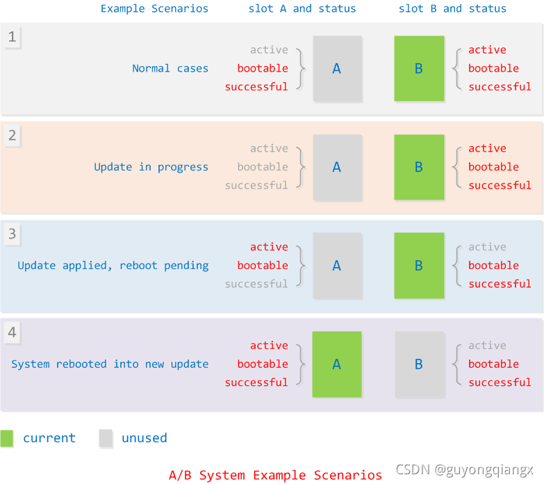
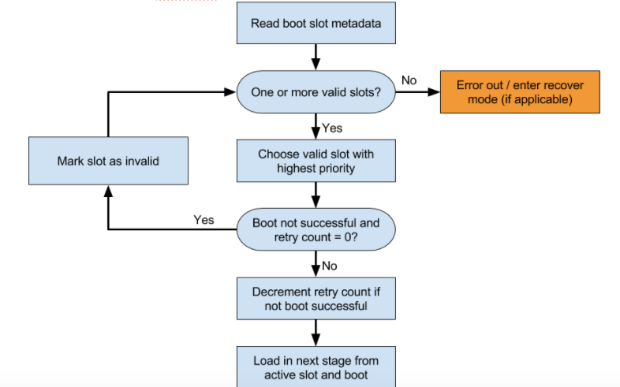
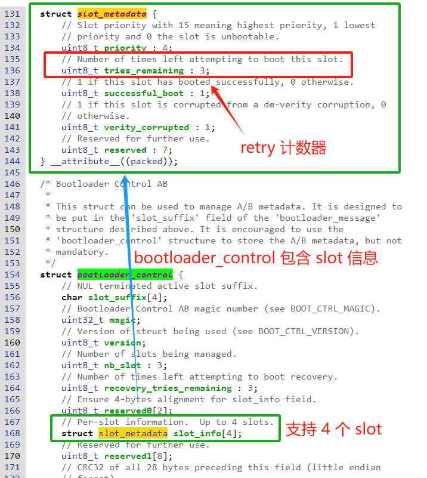
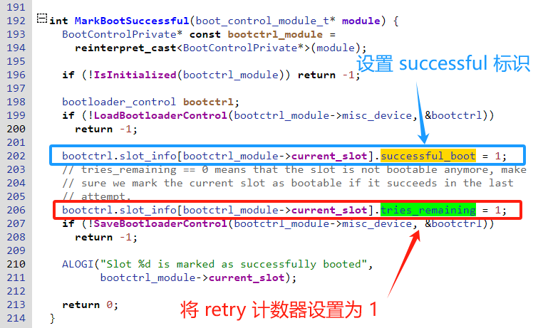
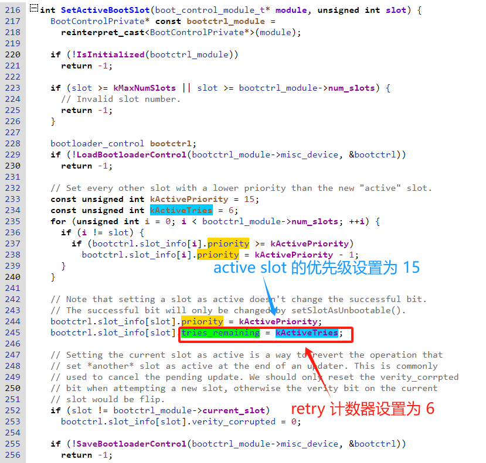
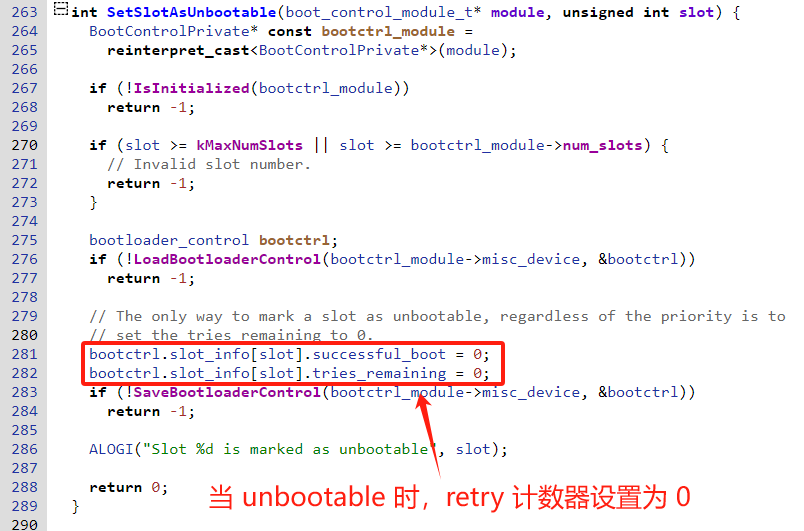

## 20240726-Android Update Engine 分析（三二）Android 的槽位切换是如何实现的?

- 本文为洛奇看世界(guyongqiangx)原创，转载请注明出处。
- 原文链接：https://blog.csdn.net/guyongqiangx/article/details/140759462

## 0. 背景

Android slot 槽位的切换是 Android OTA 一个比较基础的知识点，刚接触 Android OTA 的同学往往不清楚槽位 slot 到底是如何切换的，所以这也是 Android OTA 讨论群里问得比较多的问题

我在[《Android A/B System OTA分析（三）主系统和bootloader的通信》](https://blog.csdn.net/guyongqiangx/article/details/72480154)有中，有做过相关内容的分析。但没有明确指出槽位是如何切换的。这里单独将 slot 槽位的切换拿出来说一说。

本文围绕以下几个问题展开：

1. 哪些情况会进行槽位切换？
2. 槽位切换的代码在哪里？
3. AOSP 中 ti 的示例实现代码
4. 必须要有一个计数器吗？

> 核心代码[《Android Update Engine 分析》](https://blog.csdn.net/guyongqiangx/category_12140296.html)系列，文章列表：
>
> - [Android Update Engine分析（一）Makefile](https://blog.csdn.net/guyongqiangx/article/details/77650362)
>
> - [Android Update Engine分析（二）Protobuf和AIDL文件](https://blog.csdn.net/guyongqiangx/article/details/80819901)
>
> - [Android Update Engine分析（三）客户端进程](https://blog.csdn.net/guyongqiangx/article/details/80820399)
>
> - [Android Update Engine分析（四）服务端进程](https://blog.csdn.net/guyongqiangx/article/details/82116213)
>
> - [Android Update Engine分析（五）服务端核心之Action机制](https://blog.csdn.net/guyongqiangx/article/details/82226079)
>
> - [Android Update Engine分析（六）服务端核心之Action详解](https://blog.csdn.net/guyongqiangx/article/details/82390015)
>
> - [Android Update Engine分析（七） DownloadAction之FileWriter](https://blog.csdn.net/guyongqiangx/article/details/82805813)
>
> - [Android Update Engine分析（八）升级包制作脚本分析](https://blog.csdn.net/guyongqiangx/article/details/82871409)
>
> - [Android Update Engine分析（九） delta_generator 工具的 6 种操作](https://blog.csdn.net/guyongqiangx/article/details/122351084)
>
> - [Android Update Engine分析（十） 生成 payload 和 metadata 的哈希](https://blog.csdn.net/guyongqiangx/article/details/122393172)
>
> - [Android Update Engine分析（十一） 更新 payload 签名](https://blog.csdn.net/guyongqiangx/article/details/122597314)
>
> - [Android Update Engine分析（十二） 验证 payload 签名](https://blog.csdn.net/guyongqiangx/article/details/122634221)
>
> - [Android Update Engine分析（十三） 提取 payload 的 property 数据](https://blog.csdn.net/guyongqiangx/article/details/122646107)
>
> - [Android Update Engine分析（十四） 生成 payload 数据](https://blog.csdn.net/guyongqiangx/article/details/122753185)
>
> - [Android Update Engine分析（十五） FullUpdateGenerator 策略](https://blog.csdn.net/guyongqiangx/article/details/122767273)
>
> - [Android Update Engine分析（十六） ABGenerator 策略](https://blog.csdn.net/guyongqiangx/article/details/122886150)
>
> - [Android Update Engine分析（十七）10 类 InstallOperation 数据的生成和应用](https://blog.csdn.net/guyongqiangx/article/details/122942628)
>
> - [Android Update Engine分析（十八）差分数据到底是如何更新的？](https://blog.csdn.net/guyongqiangx/article/details/129464805)
>
> - [Android Update Engine分析（十九）Extent 到底是个什么鬼？](https://blog.csdn.net/guyongqiangx/article/details/132389438)
>
> - [Android Update Engine分析（二十）为什么差分包比全量包小，但升级时间却更长？](https://blog.csdn.net/guyongqiangx/article/details/132343017)
>
> - [Android Update Engine分析（二一）Android A/B 的更新过程](https://blog.csdn.net/guyongqiangx/article/details/132536383)
>
> - [Android Update Engine分析（二二）OTA 降级限制之 timestamp](https://blog.csdn.net/guyongqiangx/article/details/133191750)
>
> - [Android Update Engine分析（二三）如何在升级后清除用户数据？](https://blog.csdn.net/guyongqiangx/article/details/133274277)
>
> - [Android Update Engine分析（二四）制作降级包时，到底发生了什么？](https://blog.csdn.net/guyongqiangx/article/details/133421556)
>
> - [Android Update Engine分析（二五）升级状态 prefs 是如何保存的？](https://blog.csdn.net/guyongqiangx/article/details/133421560)
>
> - [Android Update Engine分析（二六）OTA 更新后不切换 Slot 会怎样？](https://blog.csdn.net/guyongqiangx/article/details/133691683)
>
> - [Android Update Engine分析（二七）如何实现 OTA 更新但不切换 Slot？](https://blog.csdn.net/guyongqiangx/article/details/133849661)
>
> - [Android Update Engine分析（二八）payload.bin 文件还能再压缩吗？](https://blog.csdn.net/guyongqiangx/article/details/138014834)
>
> - [Android Update Engine分析（二九）如何进行连续多个版本的升级？](https://blog.csdn.net/guyongqiangx/article/details/138849767)
>
> - [Android Update Engine分析（三十）有了A/B系统，为什么还要 Recovery？](https://blog.csdn.net/guyongqiangx/article/details/140345412)
>
> - [Android Update Engine分析（三一）Android 能在升级时新增分区吗?](https://blog.csdn.net/guyongqiangx/article/details/140508309)
>
> - [Android Update Engine分析（三二）Android 的槽位切换是如何实现的?](https://blog.csdn.net/guyongqiangx/article/details/140759462)

> 如果您已经订阅了本专栏，请务必加我微信，拉你进“动态分区 & 虚拟分区专栏 VIP 答疑群”。

## 1. A/B 系统槽位状态

在开始详细的槽位切换分析之前，先科普下 A/B 系统的槽位状态，以方便还不清楚的同学，知道的同学请跳过本节。

直接上[《Android A/B System OTA分析（一）概览》](https://blog.csdn.net/guyongqiangx/article/details/71334889) 中 A/B 系统状态图：

### 1.1 槽位的 3 个状态

对于一个槽位，主要有 3 个状态标识：

- bootable: 当前槽位是否可以启动
  - 特别说明的是，一个槽位的系统可以启动，并不代表该槽位可以成功启动。比方说 A 槽位运行时升级 B 槽位，更新完分区会将 B 槽位标记为 bootable（可以启动），但此时槽位 B 并不一定可以成功启动。
- successful: 当前槽位的系统是否成功启动过(启动后可以进入 Android 主系统)
  - 一个系统只有当成功启动进入 Android，通过 `update_verifier` 应用验证完成调用 `markBootSuccessful` 后，该槽位的 successful 才为真
- active: 当前槽位是否是活动槽位
  - active 值标记当前正在使用的槽位，bootloader 尝试启动 active 为真的槽位

在任意时刻，设备上的两个槽位的 bootable, successful 都可能同为 True，或一个为 True，一个为 False，或者都为 False。但必定最多只有一个槽位是 active 的，因为只有当前在使用的槽位才会标记为 active。

对于 active, bootable 和 successful 状态，Android 代码中并没有明确的定义，但是在 **IBootControl** 中包含了一组关于这些状态的获取和更改接口。具体的状态存储和操作细节，需要由厂家来实现，当你拿到的芯片厂适配好的安卓源码时，已经由厂家实现好了，可以通过在源码的根目录下搜索关键字 IBootControl 或 `setActiveBootSlot` 来查看代码的具体位置。

> IBootControl 定义的在线代码: http://aospxref.com/android-14.0.0_r2/xref/hardware/interfaces/boot/1.0/IBootControl.hal

### 1.2 系统的 4 种情形

前面这个图同时也描述了 A/B 系统 4 个典型的场景：

**场景1**：一般情况下，A、B 两个槽位的系统都正常，但当前运行在 B 槽位，此时 A、B 两个槽位除了 B 槽位标记为 Active 之外，其余状态完全一样；

**场景 2**：系统运行在 B 槽位，对 A 槽位进行升级，在升级的一开始就会将 A 槽位的 bootable，successful 全部标记为 False，即不可启动，也没有成功启动；

**场景 3**：系统运行在 B 槽位，已经完成对 A 槽位的分区更新，在准备重启切换到 A 槽位之前，会将 A 槽位标记为 bootable（可启动），但不会标记 successful。系统通过将 A 槽位设置为 active，并取消 B 槽位的 active 来实现槽位的切换。重启后，bootloader 检测到 A  槽位为 active，因此选择从 A 槽位启动系统；

**场景 4**：系统重启后从 A 槽位启动，如果进入 Android，并成功使用 update_verifier 对系统进行校验，此时会将 A 系统标记为 successful，表明槽位 A 可以成功启动。

其实这个图还缺少了场景 5、场景 6和场景 7：

场景 5：A 槽位启动不成功，尝试多次后仍然不成功，此时系统切换到 B 槽位启动，如果 B 槽位能成功启动，此时整个系统回到场景 1。这就是升级失败的回滚。

场景 6：如果 A 槽位启动不成功，切换到 B 槽位碰巧也不成功（B  槽位系统被意外破坏了)，此时系统进入 Recovery 系统进行恢复

场景 7：极端情况下，系统连 Recovery 也被破坏了，此时系统只能进入 bootloader 下的 fastboot 刷机模式进行恢复。

之所以叫 A/B，就是为了确保设备上始终有一个可以运行的系统，尽量避免设备进入到场景 6 和 7。

## 2. 哪些情况下会进行槽位切换？

总结下哪些情况下会进行槽位切换？

1. 手动通过 fastboot, bootctl 等工具指定从另外一个槽位启动
2. A 槽位升级完成后，自动切换到 B 槽位启动
3. B 槽位启动失败，自动切换到 A 槽位尝试启动

手动通过 fastboot 和 bootctl 工具切换，以及升级完成后自动切换到新槽位的操作比较好理解，即将目标槽位设置为 active

但是当一个槽位启动失败，自动尝试从另外一个槽位启动是如何实现的呢？

### 2.1 Android 官方的解释

以下内容全部来自 Android 官方网站：https://source.android.com/docs/core/architecture/bootloader/updating?hl=zh-cn

> 强烈建议阅读详细阅读 Android 官方文档，这是除了源码之外最好的一手资料。网上包括我写的 OTA 文章，也都是二手了，经过我的理解后再次输出。
>
> Android 官方现在对在线文档提供了多个版本，包括中文版，这不得不说真是太好了。如果你的英语水平还不错，我强烈建议你在阅读中文版之余也再读一下英文版。

引导加载程序必须支持与分区和槽位相关的功能，包括：

- 分区名称必须包含一个后缀，用于标识哪些分区属于引导加载程序中的特定槽位。对于每个这样的分区，都有一个相应的变量 `has-slot:partition base name`，其值为 `yes`。槽位按字母顺序命名为 a、b、c 等，与后缀为 `_a`、`_b`、`_c` 的分区相对应。引导加载程序应通知操作系统使用命令行属性 `androidboot.slot_suffix` 启动的槽位。对于搭载 Android 12 或更高版本的设备，此属性是通过 bootconfig 设置的。
- `slot-retry-count` 值将由启动控件 HAL 通过 `setActiveBootSlot` 回调或通过 `fastboot set_active` 命令重置为正值（通常为 `3`）。修改属于某个槽位的分区时，引导加载程序会清除“已成功启动”的分区并重置槽位的重试次数。

引导加载程序还应确定要加载的槽位。下图显示的是一个决策过程示例。

**图 1.** 引导加载程序槽位加载流程

1. 确定要尝试加载的槽位。不要尝试加载标记为 `slot-unbootable` 的槽位。此槽位应与 fastboot 返回的值一致，称为当前槽位。
2. 如果当前槽位未标记为 `slot-successful` 且具有 `slot-retry-count = 0`，请将当前槽位标记为 `slot-unbootable`。然后选择一个未标记为 `unbootable` 而是标记为 `slot-successful` 的其他槽位；此槽位现在是选定的槽位。如果没有当前槽位可用，系统会启动到恢复模式或向用户显示一条有意义的错误消息。
3. 选择相应的 `boot.img`，并在内核命令行上添加正确系统分区的路径。
4. 填充内核命令行 `slot_suffix` 参数。
5. 启动。如果未标记为 `slot-successful`，请减少 `slot-retry-count`。

### 2.2 强哥的补充

这里的重点是，设备上维护了一个计数器 `slot-retry-count`，计数器名字叫 `retry-count`，`remain-count` 或者其它都不重要，它的重点计数，可能是递减计数，也可能是递增计数。

如果是递减计数器，例如这里官方提到的 `retry-count`，官方建议默认值为 3，表示可以尝试 3 次。

在 bootloader 每次去去启动 A 槽位时，就将 A 槽位对应的计数器递减 1。

如果 Android 系统成功启动，在 update_verifier 中调用 `markBootSuccessful` 时会将这个计数器复位为某个值，例如 3。复位的目的是确保在 Android 系统可以成功启动的前提下，计数器不会被递减到 0，因为一旦计数器为 0 就意味着槽位不可启动了。

如果 Android 启动不成功，结果就是 A 槽位的计数器递减为 2；如果多次启动不成功，则 A 槽位的计数器最终会递减到 0。

当 bootloader 发现 A 槽位的计数器为 0 时，就切换到 B 槽位进行尝试。当然，前提是 B 槽位必须是可以启动的(bootable)。

如果使用的是递增计数器，操作也是类似，只不过相应的检查和判断就会从 0 变成某个指定的值。

### 2.3 计数器的更改

这里以递减计数器为例。

当计数器为 0 时，意味着槽位不可启动，即 unbootable 或 bootable = False。

因此，在将一个设备设置为 bootable 时，也需要将计数器设置为某个值，例如 3。

一个完整的流程大概如下：

1. 出厂时 A、B 两个槽位都是 bootable，计数器 retry=3。

2. 假设当前从 A 槽位启动，bootloader 中会将 A 槽位的计数器递减为 2，即设置 retry=2，并保存。

3. 在 A 槽位系统启动完成后，会通过 `update_verifier` 进行检查校验，只有通过了检查校验才算是启动成功，此时调用`markBootSuccessful`，在这个操作中需要将 retry 计数器设置为某个值，例如复位值 3。

   > 当然，也可以在 `markBootSuccessful` 中将 retry 设置为 1 或 2 都可以，这个看个人具体的实现，设置为 2 或 1 无非就是重试的次数减少了。但根本的目的就是确保 retry 计数器在 bootloader 检查时不为 0，一旦 bootloader 检查发现 retry 计数器为0 时，就以为这该槽位已经是不可启动的了(unbootable)。

4. 如果 A 槽位启动不成功，影响就是 retry 计数器被递减为 2，甚至是多次不成功时递减到 0。
5. A 槽位启动不成功重启时，bootloader 检查发现 retry 计数器已经递减到 0 了，会判断 A 槽位不能启动，会将其设置为 unbootable。同时读取 B 槽位的 retry 计数器，并递减，然后启动 B 槽位的镜像。
6. B 槽位启动成功后会复位相应的 retry 计数器，如果不成功，则 B 槽位的 retry 计数器也会递减。
7. 如果 B 槽位的 retry 计数器也递减到 0，而此时 A 槽位也是不可启动(unbootable)，此时系统会尝试启动 B 槽位的 Recovery 系统进行恢复。当然，进入 Recovery 的行为并没有强制规定，也可以做其他的恢复。

9. 如果在 B 槽位升级 A 槽位的系统，更新完 A 槽位的分区后，会将 A 槽位设置为 bootable，实际上此时也需要复位 A 槽位的 retry 计数器。

因此，更改计数器的地方可能有 4 个：

1. bootloader 启动系统时，对相应槽位的 retry 计数器进行递减；
2. 系统成功启动后，`markBootSuccessful` 会将 retry 计数器复位或设置为某个指定的非 0 值；
3. 系统升级完成，或者通过 fastboot 等工具将槽位设置为 bootable 时，需要复位 retry 计数器；
4. 将某个槽位设置为 unbootable 时，同时需要将相应的 retry 计数器设置为 0；

实际上这里 1,2,3 对计数器的修改或复位时必须的，4 不一定是必须，因为在大多数情况下设置为 unbootable 时，其内部的计数器已经为 0 了。

## 3. ti 示例实现代码

关于 retry 计数器，Android 参考代码并没有具体实现，交由各芯片常见移植适配 Android 时完成。

所以如果你不是芯片原厂，那当你拿到代码时，芯片原厂已经将计数器实现好了。

根据前面的讨论，除了 bootloader 中对计数器递减外，IBootControl 接口的 markBootSuccessful，setActiveBootSlot 和 setSlotAsUnbootable 也需要对计数器进行设置操作。

由于各家实现不一样，所以我这里没有办法统一的给大家一个参考代码。

在 [《Android A/B System OTA分析（三）主系统和bootloader的通信》](https://blog.csdn.net/guyongqiangx/article/details/72480154)有提到几个 A/B 系统早期的实现，但是在最新的 Android 代码中，有部分代码已经过时或者已经移除掉了。

这里以 Android 14 中自带的 ti 源码进行分析(版本 `android-14.0.0_r2`)，代码位于：`/hardware/ti/am57x/bootctrl`。

> 在线代码：http://aospxref.com/android-14.0.0_r2/xref/hardware/ti/am57x/bootctrl/

从代码的实现中看，这个 IBootControl 实现中还缺少 `setSnapshotMergeStatus` 的实现，所以这个代码可能不是 ti 的最新代码，而是 Android 11(R) 之前某个版本可用的代码。

不论这里的代码是否最新的代码，并不影响我们理解计数器的功能。

为了避免贴出来的代码太多影响整体篇幅，这里只对关键代码截图。

### 3.1 bootcontrol 相关数据的存储

从头文件 `bootloader_message.h` 以及 `bootloader_message.c` 中的代码实现可以看到，所有信息都存放在 "misc" 分区。

其中，

在 "misc" 分区的 0-2K 存放的是 `bootloader_message` 结构；

在 "misc" 分区的 2k-4k 存放的是 `bootloader_message_ab` 结构；

在 `bootloader_message_ab` 结构中包含了 `slot_metadata` 的数据，而后者用于描述每一个槽位的状态，如下：

从上面的截图中可以看到，`slot_metadata` 主要有 5 个成员，我们只看我们这里关心的 3 个：

- `priority`，用于描述槽位的优先级，15 的优先级最好，1 最低，0 表示当前槽位不可启动；
- `tries_remaining`，用于描述槽位尝试启动的次数，也就是前面说的 retry 递减计数器；
- `successful_boot`，用于描述槽位是否成功启动

> 关于 ti 的 "misc" 分区详细布局，感兴趣的朋友可以参考[《Android A/B System OTA分析（三）主系统和bootloader的通信》](https://blog.csdn.net/guyongqiangx/article/details/72480154) 中的分析画出布局图，再对比代码更容易理解。

### 3.2 markBootSuccessful 操作

在 ti 的代码中，`markBootSuccessful()` 最终由 `MarkBootSuccessful()`函数实现：

> 在线代码：http://aospxref.com/android-14.0.0_r2/xref/hardware/ti/am57x/bootctrl/boot_control.cc#192

从代码看到，这里 `MarkBootSuccessful()` 实际上是将 retry 计数器设置为 1，前面提到这里设置 retry 计数器的目的是成功启动的情形下，确保 bootloader 检查计数器时不会为 0。

因为每次启动成功都会调用 `markBootSuccessful()`，最终将计数器设置为 1，这样下一次启动时 bootloader 看到的计数器就为 1

### 3.3 setActiveBootSlot 操作

> 在线代码: http://aospxref.com/android-14.0.0_r2/xref/hardware/ti/am57x/bootctrl/boot_control.cc#216

从这里可以看到，当调用 `setActiveBootSlot()` 时，将一个槽位重新标记为活动槽位时，会将 retry 计数器设置为 6。

然后在启动过程中，bootloader 会将这个值递减。

### 3.4 setSlotAsUnbootable 操作

在 `setSlotAsUnbootable()` 操作中，计数器被清 0。

在启动过程中，当 bootloader 检测到 retry 计数器为 0 时，就会选择另一个槽位进行启动。

### 3.5 bootloader 中的计数器操作

由于我手上的是 AOSP 代码，里面并没有提供 ti 的全部实现，所以没法截图 bootloader 中的计数器递减操作，但实际上就会是这样。

感兴趣的可以结合自己手上的 Android 代码进行分析。

> 如果不知道 bootloader 的代码中哪里实现该怎么办呢？不妨以 IBootControl 这里实现的计数器名字在 bootloader 中搜索，例如这里的话就搜索 tries_remaining，我相信 bootloader 和 IBootControl 中对这个计数器会取相应的名字。

## 4. 一定要有计数器吗？

是的，必须要有计数器机制在 bootloader 和 Android 主系统之间通信，来让 bootloader 判断到底应该选择哪个槽位进行启动。

注意，这里我特别提到的是"计数器机制"，而不是计数器。

第 3 节中关于 ti 的示例代码中， `tries_remaining` 变量就是一个计数器，准确说是一个形式上比较清晰的计数器。

实际上，我们可能并不一定需要一个像 `tries_remaining` 这样一个形式上的计数器。

因此，当你分析某个方案的代码中，并没有看到一个明确的 retry 计数器时，千万不要惊讶~

例如，当前这次启动失败后，下一次启动就应该切换槽位时，系统本身就有一个天然的计数器。这个就是 bootable 状态。

当 bootable 状态为 1 时，表示系统可以启动；

当 bootable 状态为 0 时，表示系统不能启动；

这就是一个 0-1 计数器。

具体测操作时这样的：

1. 在 bootloader 启动时，将当前 active 槽位的 bootable 状态设置为 0(相当于将原来 bootable=1 递减为 0)；

2. 在 Android 启动成功后，执行 `markBootSuccessful` 操作时重新将 bootable 标记为 1；
3. 在 setActiveBootSlot 操作中，将 bootable 标记为 1；
4. 在 setSlotAsUnbootable 操作中，将 bootable 标记为 0；

这样复用 bootable 状态标识，和前面单独使用一个 retry 计数器变量是一样的效果。只不过单独使用一个计数器更清晰易懂。

为什么会单独写这么一节呢？

因为当你尝试分析 QCom 代码时，可能就会发现并没有一个单独的 retry 计数器。

## 5. 其它

到目前为止，我写过 Android OTA 升级相关的话题包括：

- 基础入门：《Android A/B 系统》系列
- 核心模块：《Android Update Engine 分析》 系列
- 动态分区：《Android 动态分区》 系列
- 虚拟 A/B：《Android 虚拟 A/B 分区》系列
- 升级工具：《Android OTA 相关工具》系列

更多这些关于 Android OTA 升级相关文章的内容，请参考[《Android OTA 升级系列专栏文章导读》](https://blog.csdn.net/guyongqiangx/article/details/129019303)。

如果您已经订阅了动态分区和虚拟分区付费专栏，请务必加我微信，备注订阅账号，拉您进“动态分区 & 虚拟分区专栏 VIP 答疑群”。我会在方便的时候，回答大家关于 A/B 系统、动态分区、虚拟分区、各种 OTA 升级和签名的问题。

我有几个 Android OTA 升级讨论群，里面现在有小几百的朋友，主要讨论手机，车机，电视，机顶盒，平板等各种设备的 OTA 升级话题，如果您从事 OTA 升级工作，欢迎加群一起交流，请在加我微信时注明“Android OTA 交流”。此群仅限 Android OTA 开发者参与~

> 公众号“洛奇看世界”后台回复“wx”获取个人微信。

另外，我近期在群里找了个合伙人整理 OTA 讨论群的问题，放到知识星球，如果你对这些问题感兴趣，欢迎加入星球查阅。知识星球的更多信息，请参考：[《Android OTA 问题交流微信群和知识星球》](https://blog.csdn.net/guyongqiangx/article/details/137981377)

