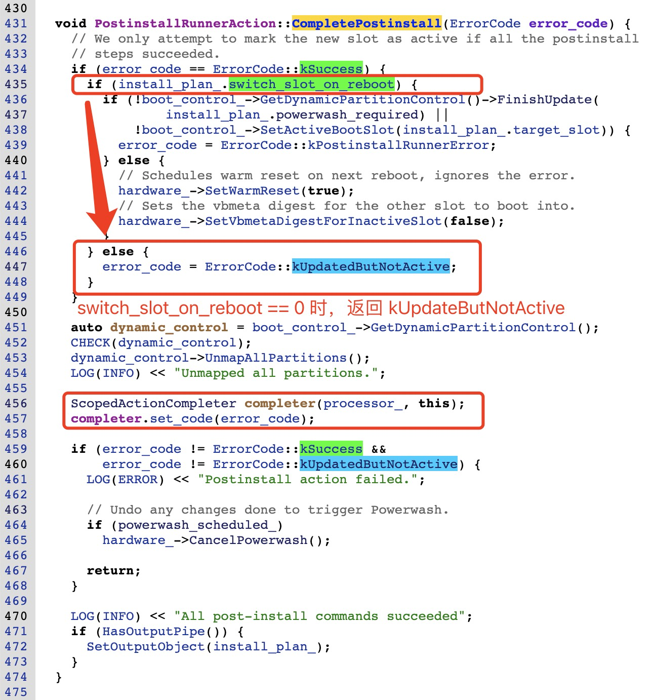

# 各个 Action 流程是如何衔接的？


---


## 2. 关于 Action 的执行流程

这里简单总结下 Action 机制的流程，更多关于 Action 的详细信息，请参考:

- [Android Update Engine分析（五）服务端核心之Action机制](https://blog.csdn.net/guyongqiangx/article/details/82226079)

- [Android Update Engine分析（六）服务端核心之Action详解](https://blog.csdn.net/guyongqiangx/article/details/82390015)


### 1. 准备 BuildUpdateActions()


### 2. 执行


### 3. 结束


```
PostinstallRunnerAction::PerformAction()
  --> PostinstallRunnerAction::PerformPartitionPostinstall()
    --> CompletePostinstall(ErrorCode::kSuccess)
```

PerformPartitionPostinstall() 函数中，执行完所有分区的操作后，调用: CompletePostinstall(ErrorCode::kSuccess)




实际上这里的 kUpdateButNotActive 被传入到 completer 中。对这里的 completer，其作用是在析构函数中调用 processor_ 的 ActionComplete 函数:


这里的 processor_ 是谁，又是在哪里设置的呢？答案是在 EnqueueAcion() 时设置。


所以这里会调用 UpdateAttempterAndroid::ProcessingDone() 函数：


在 UpdateAttempterAndroid::ProcessingDone() 函数中对于 kUpdateButNotActive 的情况，什么操作都不做。

所以，这个过程中完成了升级，但是不进行 slot 切换，并且只在名为 "post-install-succeeded" 的 prefs 文件中写入 true，并且没有做任何标记。


所以，此时只是将目标 Slot 的数据进行了更新，更新以后的其它操作例如标记为成功启动等，只有在切换了 Slot 之后继续进行。


