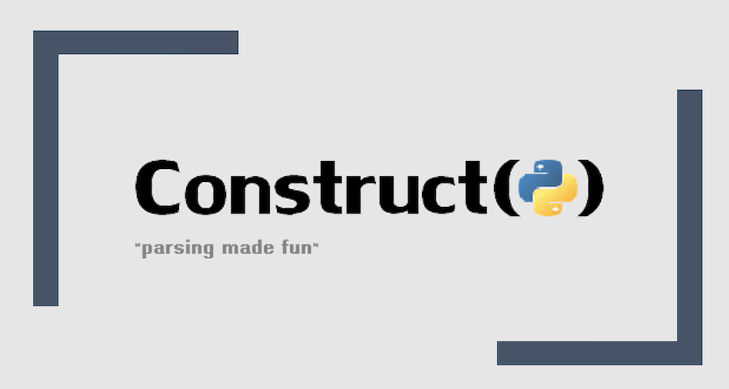

# Construct 中 Checksum 字段的使用



>  Python 第三方模块 Construct 是一个二进制数据解析神器。
>
> 本文基于 Construct 模块最新版本 v2.10 进行介绍。

很多二进制文件结构里有计算各种校验值的需求，Construct 模块提供了 Checksum 字段来满足这个需求。

## 1. Checksum 字段的用法

Checksum 字段的语法如下：

```
Checksum(checksumfield, hashfunc, bytesfunc)
```

换个说法:

```
Checksum(结果存放字段, 操作函数, 数据)
```

从介绍看，Checksum 字段用于计算和验证数据哈希，或 CRC32 校验等情形。由于哈希或校验和通常是对字节数据进行操作，所以推荐配合 RawCopy 字段一起使用。具体用法建议仔细阅读文档中关于 Checksum 参数和返回结果的说明。

实际上，由于操作函数 `hashfunc` 可以自行定义，理论上只需要根据输入数据 `bytesfunc` ，由操作函数生成跟结果存放字段 `checksumfield` 大小的内容即可。所以 Checksum 适合对数据进行加工处理的场景，比方说计算哈希，计算 CRC32 校验和，计算签名，统计数据大小等。

## 2. Checksum 字段示例

官方提供了两个使用 Checksum 计算 SHA512 哈希的例子。

### 1. 计算 SHA512 并存放到当前位置

```python
from construct import *
import hashlib
d = Struct(
    "fields" / RawCopy(Struct(
        Padding(1000),
    )),
    "checksum" / Checksum(Bytes(64),
        lambda data: hashlib.sha512(data).digest(),
        this.fields.data),
)
d.build(dict(fields=dict(value={})))
```

这里 Checksum 调用 sha512 函数，生成 fields 字段的哈希存放在当前位置。

### 2. 计算 SHA512 并存放到指定位置

```python
from construct import *
import hashlib
d = Struct(
    "offset" / Tell,
    "checksum" / Padding(64),
    "fields" / RawCopy(Struct(
        Padding(1000),
    )),
    "checksum" / Pointer(this.offset, Checksum(Bytes(64),
        lambda data: hashlib.sha512(data).digest(),
        this.fields.data)),
)
d.build(dict(fields=dict(value={})))
```

这个例子的重点是 Pointer 字段通过 `offset` 定位到实际存放的位置，然后将 Checksum 结果存放到 Pointer 字段指定的位置中。

### 3. 计算 GPT Header 数据的 CRC32

```python
from construct import *
import zlib

# 对数据的 16~19 的位置清 0
def header_raw_data(data):
    return data[:16] + b'\x00\x00\x00\x00' + data[20:]

# GPT Header 结构， 92 字节
GptHeader = Struct(
    "header" / RawCopy(Struct(
        "signature" / Const(b'EFI PART'),
        "revision" / Int32ub,
        "header_size" / Int32ul,
        "header_crc32_offset" / Tell,
        "header_crc32" / Bytes(4),  # header crc32
        Padding(4),  # reserved
        "lba_current" / Int64ul,
        "lba_backup" / Int64ul,
        "lba_usable_first" / Int64ul,
        "lba_usable_last" / Int64ul,
        "guid" / Hex(Bytes(16)),
        "lba_entry_start" / Int64ul,
        "entry_num" / Int32ul,
        "entry_size" / Int32ul,
        "entry_crc32" / Bytes(4),   # entry crc32
    )),

    # 重新计算 header_crc32
    "header_crc32" / Pointer(this.header.value.header_crc32_offset, Checksum(
        Bytes(4),
        lambda data: zlib.crc32(data).to_bytes(4, byteorder='little'),
        header_raw_data(this.header.data)
    )),
)

if __name__ == "__main__":
    # 92 bytes GPT header data
    data = bytes([
        0x45, 0x46, 0x49, 0x20, 0x50, 0x41, 0x52, 0x54,
        0x00, 0x00, 0x01, 0x00, 0x5c, 0x00, 0x00, 0x00,
        0xd3, 0x03, 0x00, 0x12, 0x00, 0x00, 0x00, 0x00,
        0x01, 0x00, 0x00, 0x00, 0x00, 0x00, 0x00, 0x00,
        0xff, 0xff, 0xe3, 0x00, 0x00, 0x00, 0x00, 0x00,
        0x06, 0x00, 0x00, 0x00, 0x00, 0x00, 0x00, 0x00,
        0xfa, 0xff, 0xe3, 0x00, 0x00, 0x00, 0x00, 0x00,
        0xb5, 0x86, 0x36, 0x48, 0xdb, 0x71, 0x21, 0x19,
        0xb2, 0xc1, 0xff, 0x06, 0xcb, 0x88, 0x99, 0x87,
        0x02, 0x00, 0x00, 0x00, 0x00, 0x00, 0x00, 0x00,
        0x10, 0x00, 0x00, 0x00, 0x80, 0x00, 0x00, 0x00,
        0x20, 0x8d, 0xf7, 0xb2
    ])
    header = GptHeader.parse(data)
    print(header)
```

说下这段代码的重点:

1. GPT Header 的 CRC32 计算时包含了 CRC32 字段本身, 但要求其所有字节都是 0，所以这里需要先将 GPT Header 的 Header CRC32 位置的数据置 0 后提交给计算函数 `zlib.crc32()` 。

   因此定义了一个函数 `header_raw_data()` 来准备数据，目的就是将 `header_crc32` 对应位置的数据设置为 0。这里也可以直接将数据的清 0 操作放到 `bytesfunc` 位置，单独定义成函数只是为了逻辑更清晰。

2. 函数 `zlib.crc32()` 返回的结果是一个 32 位的整型数据，通过 `to_bytes(4, byteorder='little')` 操作将其转化为 4 字节的小端 `little endian` 数据。

3. 提前通过 `Tell()` 调用获取 Header CRC32 位置 `header_crc32_offset`，然后通过 Pointer 方式，将 Checksun 生成的结果存放到这里。


`parse()` 操作解析数据时，会先提取已有的 Header CRC32 数据到第一个 `header_crc32` 中，然后计算 GPT Header 数据的 CRC32 值存放到第二个 `header_crc32` 中，但由于第二个 `header_crc32` 指向了前面的 `header_crc32`，所以会比较数据，如果二者的数据不一致，则解析时会报错。


以下是这段代码的执行结果:

```bash
$ python3 test-checksum-crc32.py
Container:
    header = Container:
        data = b'EFI PART\x00\x00\x01\x00\\\x00\x00\x00'... (truncated, total 92)
        value = Container:
            signature = b'EFI PART' (total 8)
            revision = 256
            header_size = 92
            header_crc32_offset = 16
            header_crc32 = b'\xd3\x03\x00\x12' (total 4)
            lba_current = 1
            lba_backup = 14942207
            lba_usable_first = 6
            lba_usable_last = 14942202
            guid = unhexlify('b5863648db712119b2c1ff06cb889987')
            lba_entry_start = 2
            entry_num = 16
            entry_size = 128
            entry_crc32 = b' \x8d\xf7\xb2' (total 4)
        offset1 = 0
        offset2 = 92
        length = 92
    header_crc32 = b'\xd3\x03\x00\x12' (total 4)
```


## 3. 其它

洛奇工作中常常会遇到自己不熟悉的问题，这些问题可能并不难，但因为不了解，找不到人帮忙而瞎折腾，往往导致浪费几天甚至更久的时间。

所以我组建了几个微信讨论群(记得微信我说加哪个群，如何加微信见后面)，欢迎一起讨论:
- 一个密码编码学讨论组，主要讨论各种加解密，签名校验等算法，请说明加密码学讨论群。
- 一个Android OTA的讨论组，请说明加Android OTA群。
- 一个git和repo的讨论组，请说明加git和repo群。

在工作之余，洛奇尽量写一些对大家有用的东西，如果洛奇的这篇文章让您有所收获，解决了您一直以来未能解决的问题，不妨赞赏一下洛奇，这也是对洛奇付出的最大鼓励。扫下面的二维码赞赏洛奇，金额随意：


洛奇自己维护了一个公众号“洛奇看世界”，一个很佛系的公众号，不定期瞎逼逼。公号也提供个人联系方式，一些资源，说不定会有意外的收获，详细内容见公号提示。扫下方二维码关注公众号：


