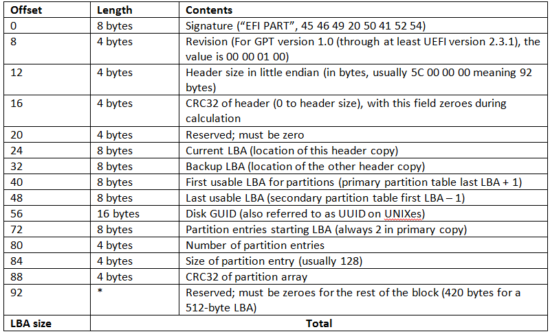

#  Python Construct 教程

二进制文件解析神器，只需要定义好文件的字段布局，一个 `parse()` 调用操作直接搞定剩余工作，没有繁琐的解析细节。

> Python Construct 官方
>
> - 代码: https://github.com/construct/construct
> - 文档: http://construct.readthedocs.org/

本文基于到 `v2.10.68 `版本的代码描述 Construct 模块的使用。

## 0. 使用 Construct 解析 GPT 数据示例

GPT 头部数据结构参考: [GPT 分区详解, http://www.jinbuguo.com/storage/gpt.html](http://www.jinbuguo.com/storage/gpt.html)



示例代码 `parse-gpt.py`:

```python
#!/usr/bin/env python3

from construct import *

GptHeader = Struct(
    "signature" / Const(b'EFI PART'),
    "revision" / Int32ub,
    "header_size" / Int32ul,
    "header_crc32_offset" / Tell,
    "header_crc32" / Bytes(4),  # CRC32 of header
    Padding(4),  # reserved
    "lba_current" / Int64ul,
    "lba_backup" / Int64ul,
    "lba_usable_first" / Int64ul,
    "lba_usable_last" / Int64ul,
    "guid" / Hex(Bytes(16)),
    "lba_entry_start" / Int64ul,
    "entry_num" / Int32ul,
    "entry_size" / Int32ul,
    "entry_crc32" / Hex(Int32ul),
    Padding(512 - this.header_size),
)

GPT = Struct(
    Bytes(512),             # LBA0: Protective MBR, 512 bytes
    "header" / GptHeader    # LBA1: Primary GPT Header, 512 bytes
)

if __name__ == "__main__":
    header = GPT.parse_file("data/gpt.bin")
    print(header)
```

脚本运行效果如下:

```bash
$ python3 parse-gpt.py
Container:
    header = Container:
        signature = b'EFI PART' (total 8)
        revision = 256
        header_size = 92
        header_crc32_offset = 528
        header_crc32 = b'\xd3\x03\x00\x12' (total 4)
        lba_current = 1
        lba_backup = 14942207
        lba_usable_first = 6
        lba_usable_last = 14942202
        guid = unhexlify('b5863648db712119b2c1ff06cb889987')
        lba_entry_start = 2
        entry_num = 16
        entry_size = 128
        entry_crc32 = 0xB2F78D20
```


## 1. 常用结构

### 1. Field

### 2. Struct

## 2. 对齐

### 2.1 Padding

