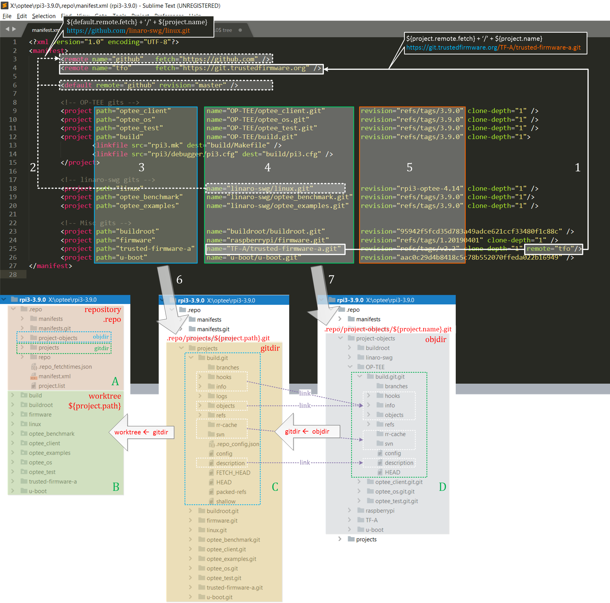
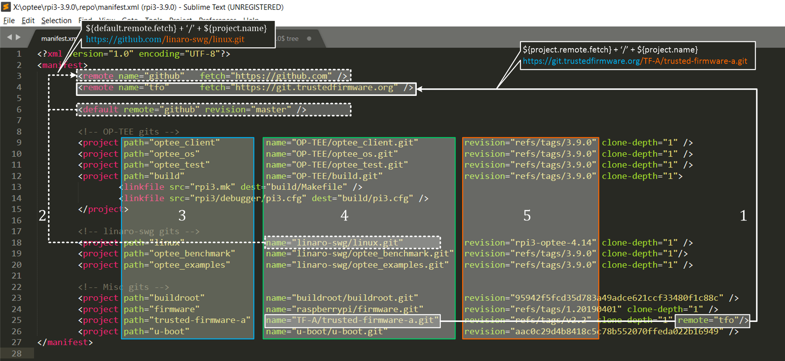
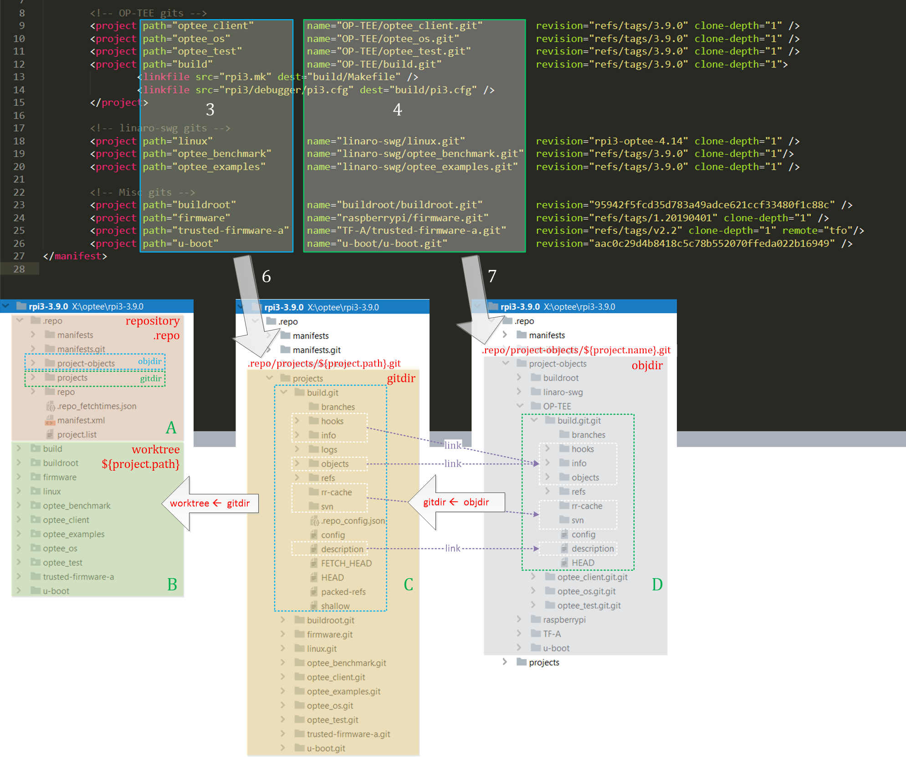

# 一张图让你掌握清单文件manifest.xml的重点


> 题图: Photo by Velizar Ivanov on Unsplash
>
> https://unsplash.com/photos/9nTxnFaSR_Q

> 这篇文章由两年前的一篇笔记修改整理而成，没有对图片完全展开详细说明，但短期不打算再写了，所以贴上来。如果你正在学习repo，希望能够提供一些帮助。如果有不正确或需要进一步说明的地方，请在文末留言，我会抽时间更新。

先上图，这张图的重点有两个：

1. 清单文件的结构
2. repo仓库的目录结构

如果直接看图明白了这两个重点，就不需要再往下看文字解释了~



图1. repo清单文件和目录结构

## 1. 我学习清单文件的经历

在开始说重点之前，说说我读清单文件的经历：
- 第一阶段：根本不知道是什么清单文件，也不知道怎么看(主要是不想去看，也不需要去看)，只需要照着别人的`repo init`和`repo sync`指令操作将代码同步到本地就可以了

- 第二阶段：开始需要切换和处理清单文件内容，也知道清单文件有个说明文档(位于`.repo\repo\docs\manifest-format.md`)，但打开文档后觉得太复杂，深入一看，结果陷入到细节里面去了，最后还是靠百度解决问题

- 第三阶段：尝试认真阅读并研究清单文件，能够根据需要灵活定制清单文件

在第二阶段呆了很长时间，文档`manifest-format.md`很详细，容易陷进细节去，看半天还是一头雾水，主要是一开始分析角度太低，分不清文档的层次。所以，如果你也是这种情况，请相信你不是唯一一个:-)。

说这么多，无非想说明我自己其实不是一个聪明的人，很多时候还很蠢，学习清单文件也花费了很多精力，如果你一开始没有弄懂清单文件，也请不要心灰意冷。

这里，我将清单文件的重点勾画出来，方便你尽快上手解清单文件，并通过清单文件提供的信息了解repo仓库的目录映射关系。

## 2. 清单文件的结构

说明文档(位于`.repo\repo\docs\manifest-format.md`)中先列举了清单文件中所有11种节点类型，然后开始展示清单文件的format，看到这里脑子就有点开始不够用了，接下来是挨个对清单文件的节点及其属性进行介绍，还没看完，就已经忘记自己为什么要看文档来了。

说实话，这个文档，非常详细，很适合遇到问题时当做查询的参考文档，像字典那样。

但其实不想那么复杂，只想要简单搞懂manifest，所以，只要读懂这篇文章里的图就够了。

这里的清单文件来自OP-TEE项目，获取命令：
```
$ repo init -u https://github.com/OP-TEE/manifest.git -m rpi3.xml -b 3.9.0
```

> 为什么选用这里的OP-TEE清单文件，而没有选Android的清单文件，基于以下几点原因：
> 1. 清单文件比较方便获取，没有被不可描述的原因墙掉
> 2. 清单文件中project比较少，方便展示
> 3. 清单文件中包含了最常用的节点
>
> 后面也会专门起一篇文章介绍Android的清单文件，但作为演示，这里的清单文件已经够了。

说了很多废话，回到上图的第一个重点：清单文件的结构，为了方便描述，我将上面的一张图拆开来说。



图2. 清单文件的结构

manifest中的节点一共有11种(详细参考`manifest-format.md`)，上图中的manifest用了其中4种，分别是: remote, default, project, linkfile

其中，最常见也最重要的是前3种(remote, default, project)，了解了这3种，你就可以自己写简单的清单文件了。

- remote节点用于指定远程仓库信息
  - name属性用于给远程仓库命名 (重要, 记为`${remote.name}`)
  - fetch属性指定远程仓库fetch操作的地址 (重要，记为`${remote.fetch}`)
- project节点指定了需要下载的代码库在远程仓库的名字和本地存储的路径
  - path属性指定project在本地的路径(包括git库的路径和工作区目录的路径) (重要, 记为`${project.path}`)
  - name属性指定project在远程仓库中的名字和本地bare库存储的路径 (重要，记为`${project.name}`)
  - revision属性指定project在工作区检出的分支 (重要)
  - clone-depth属性指定从远程仓库下载project的设置 (不重要) 
- default节点指定project节点的默认属性
  - 如果project的某个属性不存在，就从default节点取相应的属性来补充 (重要)

例如，图中标记为1的白色实线箭头指定了trustedfirmware库的下载和保存信息：
```
<remote name="tfo" fetch="https://git.trustedfirmware.org" />
...
<project path="trusted-firmware-a" name="TF-A/trusted-firmware-a.git" revision="refs/tags/v2.2" clone-depth="1" remote="tfo"/>
```

其中project的remote属性为"tfo"，关联remote的name为"tfo"的节点，得到远程仓库url地址("https://git.trustedfirmware.org")，远端git库的位置由project的name属性指定(`TF-A/trusted-firmware-a.git`)。

因此具体的git库的下载路径为`https://git.trustedfirmware.org/TF-A/trusted-firmware-a.git`(即`${remote.fetch} + '/' + ${project.name}`)。

例如：图中标记为2的白色虚线箭头指定了linux库的下载和保存信息：
```
<remote name="github fetch="https://github.com" />
...
<default remote="github" revision="master" />
...
<project path="linux" name="linaro-swg/linux.git" revision="rpi3-optee-4.14" clone-depth="1" />
```

由于这里的project节点没有指定remote属性，所以默认会使用default节点的remote属性，关联remote的name为"github"的节点，得到远程仓库的url地址("https://github.com")，远端git库的位置由project的name属性指定(`linaro-swg/linux.git`)。

因此具体的git库的下载路径为`https://github.com/linaro-swg/linux.git`(即`${remote.fetch} + '/' + ${project.name}`)。

> 既然remote节点的fetch属性指定了远程仓库的url，那为什么不直接命名为url属性方便理解呢？
>
> 因为对每一个project，除了下载(git fetch)操作时需要的url外，上传(git push)操作的url可能与下载的服务器不同。另外如果代码需要reveiw，中间可能还需要review服务器的地址，因此，一个remote节点除了fetch外，还有push和review属性，因此如果简单将fetch的地址属性命名为url，容易让人误解。

## 3. repo仓库的目录结构

跟git仓库分为仓库区(.git)和工作区一样，repo在组织时也分为仓库区(.repo)和工作区，见图3左下角的A(repo仓库区)和B(工作区)。



图3. 清单文件和目录结构的映射

如果是以镜像(`--mirror`选项指定)方式下载，则只有仓库区(.repo)，没有工作区。
如果是以默认方式下载，则先同步代码到仓库区(.repo)，然后将代码检出到工作区。

同步代码到仓库(.repo)时，会涉及到objdir，gitdir，worktree三个概念：

- objdir

在本地的`.repo/project-objects`目录下，根据清单文件manifest.xml中的name属性同步远程git仓库数据。如果name属性中包含了目录层次，则会按照相应的目录层次存放，确保跟服务器端的存放一致，相当于是服务端仓库的本地镜像。repo会在name属性的后面追加`.git`作为本地目录的名字，repo代码将这里同步数据的目录叫做objdir，见上图中的D区。

例如：
```
<project path="optee_client" name="OP-TEE/optee_client.git" revision="refs/tags/3.9.0" clone-depth="1" />
```
repo会将远程仓库`https://github.com/OP-TEE/optee_client.git`同步到本地的`.repo/project-objects/OP-TEE/optee_client.git.git`中。

- gitdir

在本地的`.repo/projects`目录下，repo按照清单文件manifest.xml中的path属性组织同步好的项目。如果path属性中包含了目录层次，则会按照相应的目录层次存放。repo代码将这里同步数据的目录叫做gitdir，见上图中的C区。

回到上面的例子，repo将远程仓库`https://github.com/OP-TEE/optee_client.git`同步到本地`.repo/project-objects/OP-TEE/optee_client.git.git`后，会将再将这个仓库映射到`.repo/projects/optee_client`目录中。

- worktree

同步完成后，本地执行`checkout`操作，将`.repo/projects`下面的项目，按照项目的path属性一一对应的检出到工作区，如果path中包含了目录层次，也会按照相应的目录层次存放。为了在工作区执行git操作，工作区的每一个项目下也存在一个`.git`目录。repo内部将这里的目录叫做worktree，见上图中的B区。

因此，每个project都有三个`.git`与之对应。为了减少磁盘空间的占用，工作区公共的git数据会链接到gitdir下，同时gitdir下公共的git数据会链接到`objdir`下。

## 4. 讨论和联系

洛奇工作中常常会遇到自己不熟悉的问题，这些问题可能并不难，但因为不了解，找不到人帮忙而瞎折腾，往往导致浪费几天甚至更久的时间。

所以我组建了两个微信讨论群(记得微信我说加哪个群，如何加微信见后面)，欢迎加群一起讨论:
- 一个Android OTA的讨论组，请说明加Android OTA群。
- 一个git和repo的讨论组，请说明加git和repo群。

在工作之余，洛奇尽量写一些对大家有用的东西，如果洛奇的这篇文章让您有所收获，解决了您一直以来未能解决的问题，不妨赞赏一下洛奇，这也是对洛奇付出的最大鼓励。扫下面的二维码赞赏洛奇，金额随意：


洛奇自己维护了一个公众号“洛奇看世界”，一个很佛系的公众号，不定期瞎逼逼。公号也提供个人联系方式，一些Andorid和GIT电子书资源，说不定会有意外的收获，详细内容见公号提示。扫下方二维码关注公众号：


