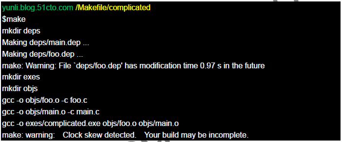
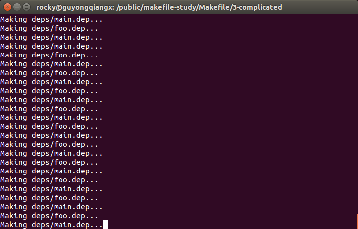

# Makefile新手？千万别错过了《驾驭Makefile》

网上搜索makefile教程，转载和推荐最多的就是陈皓《跟我一起写 Makefile》系列，无出其右。

这个系列很不错，适合初学Makefile，了解Makefile的各种规则、语法、依赖和命令。

网上有人说学了一下午《跟我一起写 Makefile》就会写makefile了。

我也试过，照着《跟我一起写 Makefile》学了几天，还是没能把一个小工程的Makefile写出来。所以，如果你学习了几天也没写出可以工作的Makefile来，相信我，你并不孤独。

所以我在这里推荐另一个Makefile入门教程，李云的《驾驭Makefile》，原文链接如下：
- https://blog.51cto.com/yunli/195759

但原文的附件链接已经失效了，需要教程文档请参考文末的链接。

本文分为五个部分：
1. 推荐《驾驭Makefile》的理由
2. 教程《驾驭Makefile》的补充
3. Makefile的学习建议
4. 相关文档和代码资源
5. 申明和其它

如果只关注Makefile的学习路径，建议略过1,2直接跳到第3部分；
如果只想下载本文提到的《驾驭Makefile》《跟我一起写 Makefile》和GNU Make Manual文档，以及《驾驭Makefile》涉及的项目代码，请直接跳转到第4部分；
杠精请直接跳转到第5部分；

## 1. 推荐《驾驭Makefile》的理由

### 1.1 Makefile的"Hello World"教程

网上很多Makefile教程内容上只有几千字，一开始介绍Makefile的基本概念(包括依赖和命令)，然后写一个Makefile组织两三个文件完成编译。

这类教程通常能让你对Makefile是怎么回事，如何工作有个初步概念。如果只想了解Makefile，这就够了。
但是离读懂实际项目的Makefile，甚至自己写Makefile还差很远。

这类就是Makefile的"Hello World"教程。

### 1.2 《跟我一起写 Makefile》类似参考手册

《跟我一起写 Makefile》非常全面，从依赖到命令，从规则到执行，基本上面面俱到。看完以后觉得Makefile也不是那么难，由于缺少项目实践，要从头组织一个Makefile还是没谱。我自己的感觉是一看全都会，一做全懵逼~

当然，大部分人学习Makefile并不是真的要写Makefile，甚至只要参考别人的规则，复制一条，粘贴再修改就可以了。基于这种情况，能读懂Makefile就够了，《跟我一起写 Makefile》作为入门教程是完全没问题的。

我开始学习Makefile，是因为老板交给我一个任务，从其他项目中拿来一些文件，加上自己写的一部分代码，重新构建一个工具类BootLoader。规模上，项目有10多个模块，驱动和测试代码加起来大概一百多个文件。

一开始虽然是0基础，但看过《跟我一起写 Makefile》，好歹有些印象。觉得参考别人的Makefile修改修改就可以了。所以初期老板问有没有什么困难，我也没太当回事，觉得不过小菜一碟，但是捣鼓了几天还是没搞出来，就有点着急了。偶然间看到《驾驭Makefile》，跟着项目实践了两遍(好吧，我是比较笨拙的那种)，最后基于huge项目的Makefile扩展一下，总算是交了差。

一句话来说，学习《跟我一起写 Makefile》可以读懂Makefile，但是离会写Makefile还差一点，更适合当做参考手册。

### 1.3 《驾驭Makefile》注重项目实践

《驾驭Makefile》教程没有介绍那么多背景知识，一开始就做项目，从易到难分别是"helloworld", "simple", "complecated"和"huge"，然后一边做项目一边插入介绍所需要的知识。

通过这四个项目的实践，让你体会一个项目Makefile的构建过程，尤其是最后的huge项目，组织形式上基本接近一个真实的项目。
我前面提到的项目最后就是基于huge的Makefile改造的。

以下是李云博客中的原话:
> 在两年多前，我曾经给单位的同事做过了Makefile方面的培训，培训是采用做项目的形式进行，通过将项目越做越复杂和真实的方式来学习Makefile。我发现这种形式非常的好，它告诉你的不仅仅是Makefile的知识点，还告诉了你为什么Makefile要写成那样，即，让你知其然也知其所以然。
>
> 在网上你能找到很多关于Makefile的学习资料，但绝大部分给你的只是一个知识点，与将Makefile运用到项目中（尤其是大型项目）的差距非常的大。因为，将Makefile运用到项目中，需要的知识是线、甚至是面。这篇文章以helloworld作为开篇，接着是simple项目、complicated项目以及huge项目，一步一步的引入了Makefile中的概念，以及告诉你做一个实用的编译环境需要注意什么。

其实我觉得这个教程最重要的一点，是文中提出问题，解决问题的思路。如果跟随项目的实践过程，对解决问题开拓思路有帮助，远比学习Makefile本身更有意义。这也是我喜欢这类手把手教程(tutorial)的原因~

## 2. 教程《驾驭Makefile》的补充

### 2.1 生成依赖时无限循环的问题

教程中，complicated项目开始存在一个无限循环的问题。

在教程p39页作者提到了Warning的问题，图2.35上我们也可以看到警告:



在这里我们可以看到以下的警告信息：
```
make: Waring: File `deps/foo.dep` has modification time 0.97 s in the future
...
make: warning: Clock skew detected. Your build may be incomplete.
```

作者当初的实验环境是Cygwin，跟我们大多数人直接用CentOS或者Ubuntu上实践还是有些区别，所以并没有出现无限循环。
> 不过我印象中，我最初用Cygwin学习好像也出现了无限循环问题，具体不太记得了。

我在Ubuntu 14.04上实验时看到的结果是这样的，无限循环了:


这个问题的根源有两点：
1. 语句`-include $(DEPS)`将文件`deps/foo.dep`和`deps/main.dep`包含到Makefile中，作为Makefile的一部分；
当include指定的文件更新时，会引发Makefile的remade操作，即make会重新读取Makefile(包括include文件)确保是最新的，并再次检查和更新所有依赖；

2. 语句`$(DIR_DEPS)/%.dep: $(DIR_DEPS) %.c`指定了文件`deps/foo.dep`和`deps/main.dep`依赖`deps`文件夹；
换句话说，要求`deps/foo.dep`和`deps/main.dep`的修改时间需要比`deps`文件夹新；

由于更新有先后，更新第二个文件后会导致`deps`文件夹的修改时间比第一个文件的修改时间新。(因为每次修改文件夹下的文件都会更新文件夹的修改时间)。

更新dep文件后，再次读取Makefile时，`deps/foo.dep`和`deps/main.dep`的修改时间需要比`deps`文件夹新的条件满足不了，从而产生了死循环。

解决办法有两种：
1. 去掉.dep文件对deps目录的依赖；
2. 始终确保.dep文件对deps目录的依赖得到满足，即保证所有.dep文件始终和deps目录的修改时间一样;

关于对这个问题的详细调试，请参考我的另外一篇文章《驾驭Makefile》中编译死循环问题彻底调试。

网上关于这个问题也有不少讨论，推荐这篇：
> - Makefile中的死循环问题--学习李云《驾驭Makefile》中的疑惑解决
>    - https://blog.csdn.net/mantis_1984/article/details/72598848

### 2.2 缺少对Makefile的全面介绍

从文档的第4部分看，其实作者是有计划完成这部分的，但我学习的版本中还没有包含，如果谁有完整的版本请分享我一下。

> 根据李云在博客的回复，这部分已经更新到他的《专业嵌入式软件开发》中了，我搜索了一下京东，好像已经绝版了~
> 

其实，对于缺失的第4部分，我觉得《跟我一起写Makefile》就是很好的补充，用来作为这篇文章的第4部分简直就是完美。

况且《驾驭Makefile》文档本身有67页，如果再加上《跟我一起写Makefile》的78也，从页数来说基本就是一本完整的书而不是一篇教程了。

## 3. Makefile的学习建议

如果你只想读懂Makefile，不需要从头写，学习《跟我一起写Makefile》就够了；

如果你需要写出自己项目的Makefile， 那我建议的步骤是:
1. 先跟着《驾驭Makefile》完成4个项目实践，了解构建一个项目Makefile的过程
2. 然后通过《跟我一起写Makefile》了解Makefile的各种规则，基本上就完成Makefile的初步学习了
3. 实际项目中遇到问题时可以查阅《跟我一起写Makefile》和GNU Makefile Manual
4. 组织更大的项目，可以研究下linux和u-boot的KBuild系统，或者Android的编译系统

## 4. 相关文档和代码资源

为了写这篇文章，我又重新按照《驾驭Makefile》教程实践了一遍，源代码见后面链接，跟十年前初学Makefile相比，还是有挺多感触，更多惊叹于李云解决问题的思路。(关于这点，后面单独写一篇说明)

本文中提到的文档包括：
- 《驾驭Makefile》
- 《跟我一起写Makefile》
- 《GNU Make Manual》
  - GUN make中文手册-v3.80，徐海兵译
  - gnu-make-manual-3.82

我已经将以上文档以及《驾驭Makefile》相关代码上传到了github，地址如下：
- https://github.com/guyongqiangx/makefile-study

## 5. 申明和其它

写这篇文章，并不是说陈皓的《跟我一起写Makefile》不好，相反，他的这份文档和GNU Makefile Manual一起陪伴了我很多年~是非常好的参考手册。

写这篇文章，只是想以过来人的角度，给Makefile入门学习的朋友提供多一条可以选择的路径。

最后非常感谢李云和陈皓，给我们写了很好的Makefile教程。
