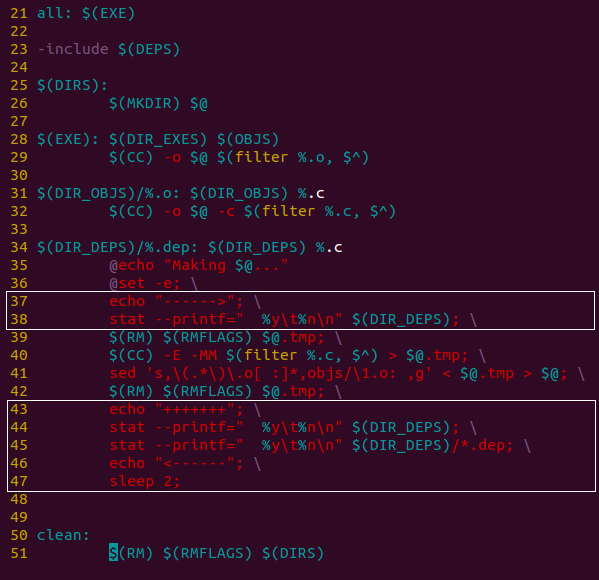

# 《驾驭Makefile》中编译死循环问题彻底调试

我在上一篇《Makefile新手？千万别错过了这个入门教程》推荐了李云的《驾驭Makefile》作为新手入门Makefile的推荐教程。

在该教程中存在两个问题：
1. 编译时出现死循环，不断反复生成main.dep和foo.dep
2. 每次编译时都会反复交替生成foo.o和main.o

这两个问题都是由同一个问题引起的，即目标文件对目录的依赖，而目录下面每次更新文件时都会更新目录的修改时间。

本文追根溯源，详细展示这两个问题的调试流程和解决办法。

全文分为四个部分：

1. 无限循环生成`.dep`文件和反复交替生成`.o`文件的问题
2. 无限循环生成`.dep`文件的调试
3. 无限循环生成`.dep`文件的解决办法
4. 交替生成`foo.o`和`main.o`的原因和解决办法

如果只关注问题的原因，请跳转到第2.3节；
如果只关注问题的解决办法，请直接跳转到第3节；

## 1. 无限循环生成`.dep`文件和反复交替生成`.o`文件的问题

先来看看两个问题分别是什么样的：
1. 编译时出现死循环，不断反复生成main.dep和foo.dep


2. 每次编译时都会反复交替生成foo.o和main.o


从第二次make开始，一次重新生成foo.o，下次重新生成main.o，再次重新生成foo.o，循环往复。

原始代码可以从以下仓库取得:
```
https://github.com/guyongqiangx/makefile-study
```

关于这个问题的调试信息位于`clock-skew-issue`分支上:
```
$ git clone https://github.com/guyongqiangx/makefile-study -b clock-skew-issue
$ cd makefile-study/Makefile/3-complicated/
makefile-study/Makefile/3-complicated$ ls -lh
total 40K
-rw-rw-r-- 1 rocky rocky 5.7K Dec 24 17:00 debug-log-0-clock-skew-issue.log
-rw-rw-r-- 1 rocky rocky 2.4K Dec 24 17:00 debug-log-fix1-no-depending-deps-dirs.log
-rw-rw-r-- 1 rocky rocky 2.8K Dec 24 17:00 debug-log-fix2-update-modification-time.log
-rw-rw-r-- 1 rocky rocky   87 Dec 24 17:00 foo.c
-rw-rw-r-- 1 rocky rocky   55 Dec 24 17:00 foo.h
-rw-rw-r-- 1 rocky rocky   54 Dec 24 17:00 main.c
-rw-rw-r-- 1 rocky rocky 1017 Dec 24 17:00 Makefile
-rw-rw-r-- 1 rocky rocky 1.1K Dec 24 17:00 Makefile.Fix1
-rw-rw-r-- 1 rocky rocky 1.2K Dec 24 17:00 Makefile.Fix2
makefile-study/Makefile/3-complicated$ 
```

## 2. 无限循环生成`.dep`文件的调试

在Makefile中，一个目标是否要更新，由这个目标和依赖的最后修改时间(last-modification time)决定。

如果目标不存在(相当于最后修改时间为0，即1970-01-01  00:00.000)，或者任何一个依赖的最后修改时间比目标的最后修改时间新，make就会执行相应的命令来更新目标。
更新完成后，目标的最后修改时间会比依赖的最后修改时间新，或者至少一样新。


关于这部分，在GNU Make Manual的`4.2 Rule Syntax`一节中原话是这么说的：

> 链接：https://www.gnu.org/software/make/manual/make.html#Rule-Syntax


我们可以通过调试来确认是不是这个原因。那如何调试呢？

### 2.1 比较目标和依赖的时间戳

既然是通过最后修改时间来判断目标是否需要更新，那我们可以在Makefile中手动检查下`deps`目录和`deps/*.dep`文件的最后修改时间来验证我们的想法。

#### 获取文件的时间戳

如何获取一个文件的时间戳呢，度娘一下，发现可以通过`stat`命令来搞定。

`stat`默认的输出信息比较多，如下：
```
$ stat main.c
  File: ‘main.c’
  Size: 54        	Blocks: 8          IO Block: 4096   regular file
Device: 801h/2049d	Inode: 188292      Links: 1
Access: (0664/-rw-rw-r--)  Uid: ( 1001/   rocky)   Gid: ( 1001/   rocky)
Access: 2020-12-24 17:00:56.114282103 +0800
Modify: 2020-12-24 17:00:56.114282103 +0800
Change: 2020-12-24 17:00:56.114282103 +0800
 Birth: -
```
但其实我们只需要最后修改时间(Modify)。

通过查看`stat`命令的选项，`--format`或`--printf`可以用于自定义输出格式。

在具体的格式上:
- `%Y`用于显示整数时间戳，但不容易阅读
- `%y`用于显示容易识别的时间
- `%n`用于显示文件名

(更多格式请参考命令`man stat`的输出)

为了格式化方便，这里使用支持反斜杆`\`转义的`--printf`格式:
```
# 使用'--printf'选项自定义输出格式
$ stat --printf="%y\t%n\n" main.c
2020-12-24 17:00:56.114282103 +0800	main.c
```

#### 获取目标和依赖的最后修改时间

为了检验`deps`目录，以及`deps/*.dep`文件的时间戳变化情况，我们将Makefile的`%.dep`规则修改成下面的样子:



主要新增了两个白色方框包含的部分，
- 38行用于显示在改动前`deps`目录的时间戳
- 44行用于显示在改动后`deps`目录的时间戳
- 45行用于显示在改动后`deps`目录下所有`.dep`文件的时间戳
- 47行的`sleep`用于编译时暂停，方便观察时间戳

运行的效果如下:


在上面的红色方框中，`deps`目录在生成了`deps/main.dep`文件以后，时间戳发生了变化:
```
17:47:05.582369639 --> 17:47:05.594369640
```
在下面的绿色方框中，`deps`目录在生成了`deps/foo.dep`文件以后，时间戳也发生了变化：
```
17:47:05.594369640 --> 17:47:07.638369704
```
但`deps/main.dep`的时间戳保持了不变。

从而验证了我们的猜想，修改`deps`目录下的文件导致`deps`的目录时间戳被更新了。
但再次在`deps`目录下生成`foo.dep`文件时，导致了`deps`目录的最后修改时间比先生成的文件`main.dep`最后修改时间新。

换句话所，此时规则`deps/main.dep: deps main.c`的依赖满足不了了，需要重新生成`deps/main.dep`。

到底是不是这样了，我们通过其它方式验证下。

#### 2.2 使用`--debug`选项调试Makefile

为了调试Makefile，自然要检查下make命令都支持哪些选项。

在GNU Make Manual的`9.7 Summary of Options`中列举了所有支持的选项，其中跟调试相关的选项有`-d`和`--debug[=options]`。
其中`--debug`的options又有多个选择。

> make完整的命令行选项参考`man make`输出或下面的官方文档:
> - https://www.gnu.org/software/make/manual/make.html#Options-Summary

你或许会问，这么多option我到底该用哪个？说实话，一开始我也不知道，好在我们的Makefile比较简单，可以一个一个的挨个试，看看哪个的输出信息能满足我们的需要。

最后发现`--debug=m`的输出信息刚好是我们需要的，为了方便查看，我将Makefile中添加的打印信息以及make输出的版权信息去掉后如下：
> 完整log请参考代码目录下的文件：`debug-log-0-clock-skew-issue.log`

```
makefile-study/Makefile/3-complicated$ make --debug=m
...
Reading makefiles...
Updating makefiles....
  File 'deps/main.dep' does not exist.
    File 'deps' does not exist.
   Must remake target 'deps'.
...
   Successfully remade target file 'deps'.
 Must remake target 'deps/main.dep'.
...
 Successfully remade target file 'deps/main.dep'.
  File 'deps/foo.dep' does not exist.
 Must remake target 'deps/foo.dep'.
...
 Successfully remade target file 'deps/foo.dep'.
Re-executing[1]: make --debug=m
...
Reading makefiles...
Updating makefiles....
  Prerequisite 'deps' is newer than target 'deps/main.dep'.
 Must remake target 'deps/main.dep'.
...
 Successfully remade target file 'deps/main.dep'.
Re-executing[2]: make --debug=m
...
Reading makefiles...
Updating makefiles....
  Prerequisite 'deps' is newer than target 'deps/foo.dep'.
 Must remake target 'deps/foo.dep'.
...
 Successfully remade target file 'deps/foo.dep'.
Re-executing[3]: make --debug=m
```

这段log一共执行了3遍`make`命令，翻译过来如下：
- 第一遍执行`make --debug=m`:
   1. 读取所有makefile，并更新；
   2. 文件`deps/main.dep`不存在，文件`deps/main.dep`依赖的`deps`目录也不存在；
   3. 创建`deps`目录，生成`deps/main.dep`文件；
   4. 文件`deps/foo.dep`不存在；
   5. 生成`deps/foo.dep`文件；
   6. 重新执行`make --debug=m`命令；
- 第二遍执行`make --debug=m`:
   1. 文件`deps/main.dep`的依赖`deps`目录修改时间比`deps/main.dep`目录新；
   2. 生成`deps/main.dep`文件；
   3. 重新执行`make --debug=m`命令；
- 第三遍执行`make --debug=m`
   1. 文件`deps/foo.dep`的依赖`deps`目录修改时间比`deps/foo.dep`目录新；
   2. 生成`deps/foo.dep`文件；
   3. 重新执行`make --debug=m`命令；

这里：
- 执行第二遍时发现之前生成的`deps/main.dep`依赖满足不了，重新生成`deps/main.dep`；
- 执行第三遍时发现另一个文件`deps/foo.dep`的依赖满足不了，重新生成`deps/foo.dep`；
- 循环往复，真是冤冤相报何时了……

### 2.3 无限循环生成`deps/*.dep`文件的原因

总结一下，通过上面第二步的调试，我们发现导致无限循环生成`deps/*.dep`的根本原因是：

1. 编译时先生成了`deps/main.dep`文件，后生成`deps/foo.dep`文件，每次生成`deps/*.dep`文件的同时都会更新`deps`目录的修改时间。后生成`deps/foo.dep`文件的结果就是`deps`目录的修改时间比`deps/main.dep`文件新；
2. 而包含指令`-include $(DEPS)`的存在，会要求更新了`deps/main.dep`和`deps/foo.dep`文件以后重新读取makefile，检查依赖关系并再次执行；
3. 再次执行时发现`deps`目录的修改时间比`deps/main.dep`文件新，此时就会重新生成`deps/main.dep`文件，结果就是`deps`目录的修改时间比`deps/foo.dep`文件新；
4. 而包含指令`-include $(DEPS)`的存在，更新`dep/main.deps`文件以后会重新读取makefile，检查依赖关系并再次执行；
5. 再次执行又发现`deps`的时间比`deps/foo.dep`文件新，又重新生成`deps/foo.dep`，结果就是`deps`目录的修改时间又一次比`deps/main.dep`文件新；

事故就这样发生了……

## 3. 无限循环生成`.dep`文件的解决办法

既然问题的根源是目录下的文件依赖于目录自身，而依赖关系要求文件要比目录新(至少一样新)。
解决思路有两条：
1. 去掉文件对对目录的依赖；
2. 始终保证文件比目录新(至少一样新)；

从上面的两个解决思路出发就产生了两个解决方案。

### 3.1 方案一，去掉文件内对目录的依赖

去掉`%.dep`文件对`$(DIR_DEPS)`目录的依赖，在编译时检查`$(DIR_DEPS)`目录是否存在，如果不存在，则手动创建该目录。

```
#$(DIR_DEPS)/%.dep: $(DIR_DEPS) %.c
$(DIR_DEPS)/%.dep: %.c
	@echo "Making $@..."
	@set -e; \
	if [ ! -e $(DIR_DEPS) ]; then \
		$(MKDIR) $(DIR_DEPS); \
	fi; \
	$(RM) $(RMFLAGS) $@.tmp; \
	$(CC) -E -MM $(filter %.c, $^) > $@.tmp; \
	sed 's,\(.*\)\.o[ :]*,objs/\1.o: ,g' < $@.tmp > $@; \
	$(RM) $(RMFLAGS) $@.tmp;
```

### 3.2 方案二，保证文件比目录新

在每次生成`%.dep`文件后，用`touch`命令更新目录下所有文件的修改时间。

```
$(DIR_DEPS)/%.dep: $(DIR_DEPS) %.c
	@echo "Making $@..."
	@set -e; \
	$(RM) $(RMFLAGS) $@.tmp; \
	$(CC) -E -MM $(filter %.c, $^) > $@.tmp; \
	sed 's,\(.*\)\.o[ :]*,objs/\1.o: ,g' < $@.tmp > $@; \
	$(RM) $(RMFLAGS) $@.tmp; \
	touch $(DIR_DEPS)/*;
```


## 4. 交替生成`foo.o`和`main.o`的原因和解决办法

和上面2.3节的原因一样，`objs`目录下的文件`*.o`依赖于目录自身，而每次更新`foo.o`或`main.o`都会更新`objs`目录的修改时间。每更新一次`objs`目录下的文件都会导致`objs`目录自身比下面的一些`*.o`文件新。当再次执行时，就会更新那些比`objs`目录旧的文件。

那为什么没有发生无限循环的问题呢？

因为没有`include`指令去包含生成的`objs/*.o`文件，所以即使每次更新`objs/*.o`文件以后出现依赖满足不了的问题，并不会马上执行makefile。

因此不会有无限的循环编译，但当你下次在命令行再次执行`make`命令时，就会发现会更新`objs/*.o`文件。

解决办法也参考上面的3.1和3.2节。

